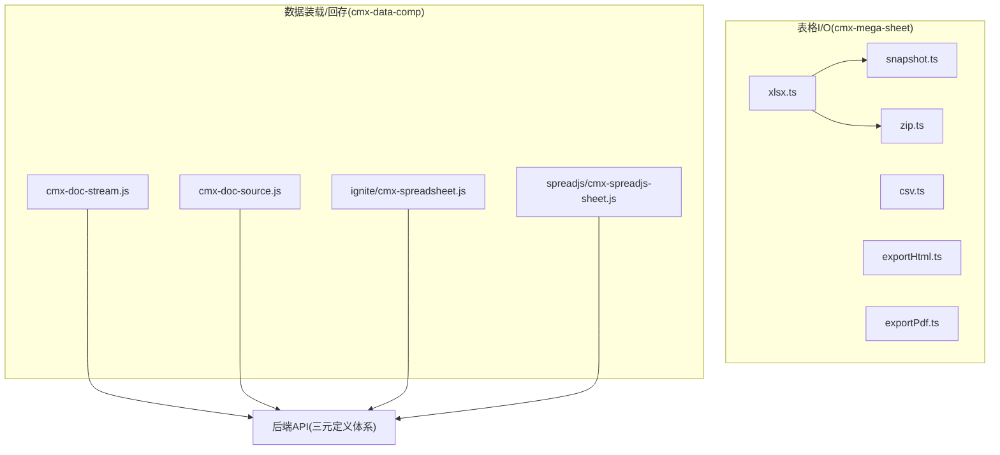
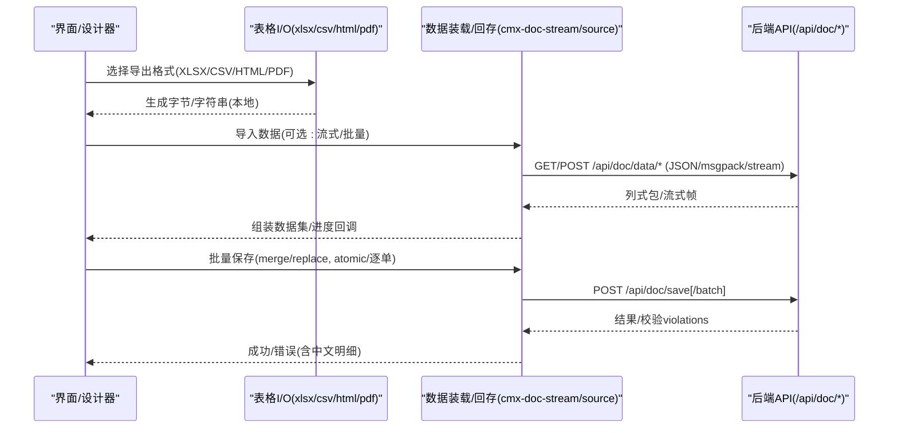
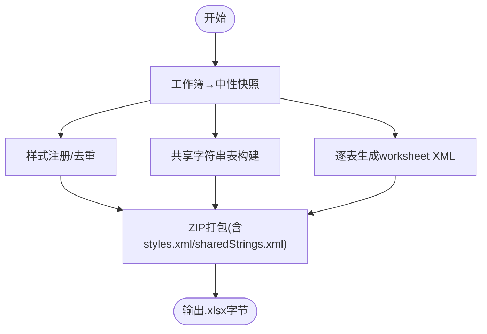
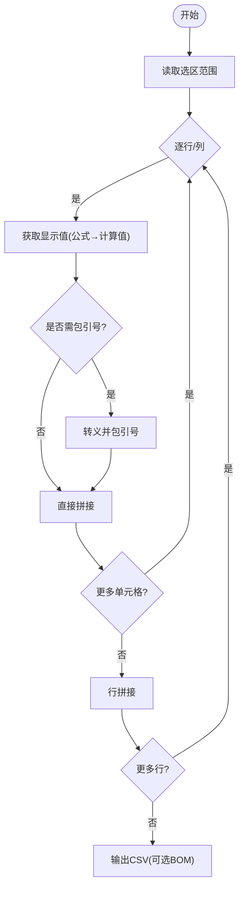
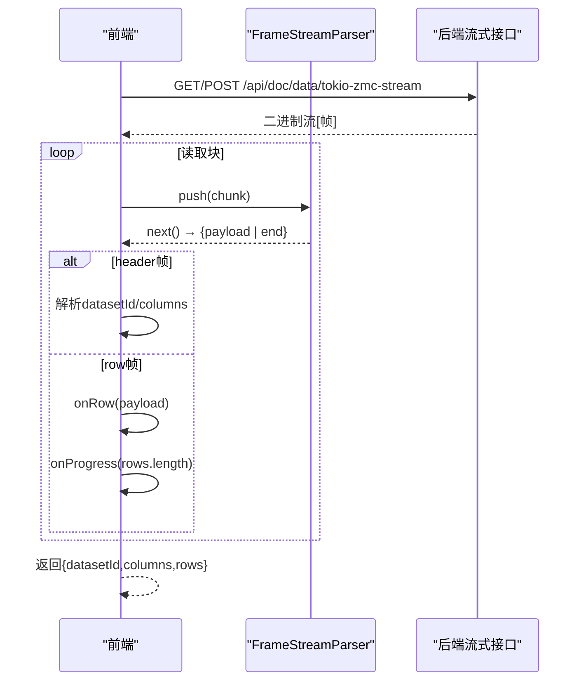
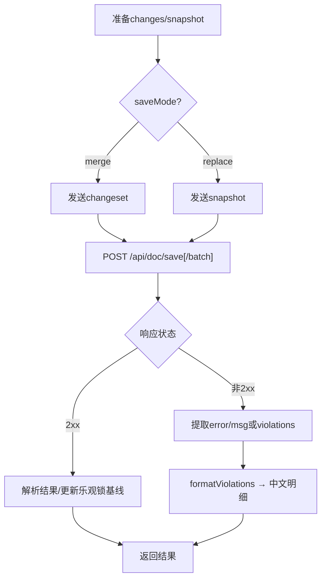
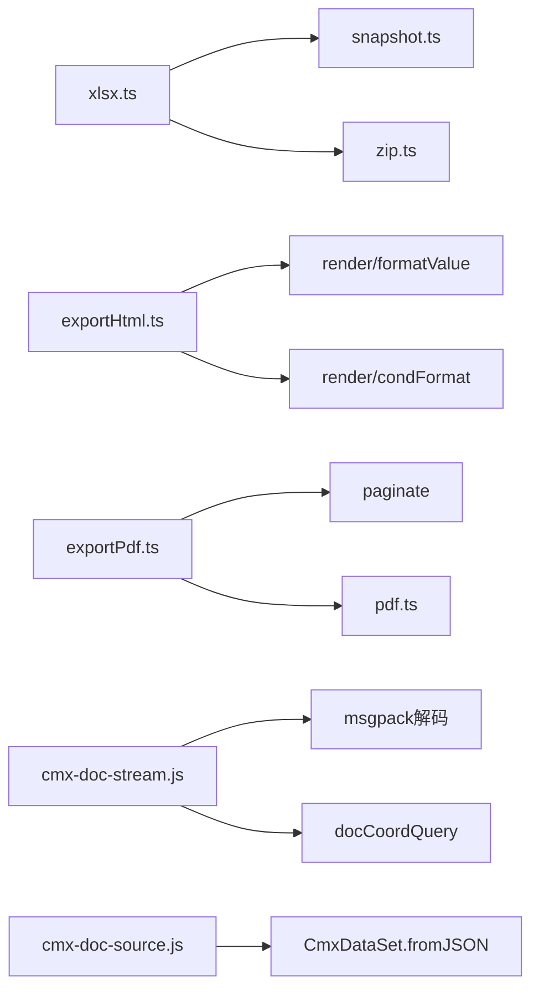

# 数据导入导出 API

<cite>
**本文引用的文件**
- [cmx-mega-sheet/src/io/xlsx.ts](file://cmx-mega-sheet/src/io/xlsx.ts)
- [cmx-mega-sheet/src/io/csv.ts](file://cmx-mega-sheet/src/io/csv.ts)
- [cmx-mega-sheet/src/io/exportHtml.ts](file://cmx-mega-sheet/src/io/exportHtml.ts)
- [cmx-mega-sheet/src/io/exportPdf.ts](file://cmx-mega-sheet/src/io/exportPdf.ts)
- [cmx-mega-sheet/src/io/snapshot.ts](file://cmx-mega-sheet/src/io/snapshot.ts)
- [cmx-mega-sheet/src/io/zip.ts](file://cmx-mega-sheet/src/io/zip.ts)
- [packages/cmx-data-comp/src/lib/cmx-doc-stream.js](file://packages/cmx-data-comp/src/lib/cmx-doc-stream.js)
- [packages/cmx-data-comp/src/lib/cmx-doc-source.js](file://packages/cmx-data-comp/src/lib/cmx-doc-source.js)
- [packages/cmx-data-comp/src/components/ignite/cmx-spreadsheet.js](file://packages/cmx-data-comp/src/components/ignite/cmx-spreadsheet.js)
- [packages/cmx-data-comp/src/components/spreadjs/cmx-spreadjs-sheet.js](file://packages/cmx-data-comp/src/components/spreadjs/cmx-spreadjs-sheet.js)
- [docs/三元定义体系架构文档.md](file://docs/三元定义体系架构文档.md)
</cite>

## 目录
1. [简介](#简介)
2. [项目结构](#项目结构)
3. [核心组件](#核心组件)
4. [架构总览](#架构总览)
5. [详细组件分析](#详细组件分析)
6. [依赖关系分析](#依赖关系分析)
7. [性能与内存优化](#性能与内存优化)
8. [故障排查指南](#故障排查指南)
9. [结论](#结论)
10. [附录：API 参考速查](#附录api-参考速查)

## 简介
本参考文档面向企业级平台的数据导入导出能力，覆盖 XLSX、CSV、HTML、PDF 等格式的导入与导出接口，说明数据映射规则、格式转换选项、错误处理机制，以及大文件流式传输、批量操作、进度回调和异常恢复的最佳实践。同时给出文件格式兼容性、版本支持与数据完整性验证的要点，帮助开发者在前后端协同中稳定高效地实现数据交换。

## 项目结构
本项目包含两套与导入导出密切相关的子系统：
- cmx-mega-sheet：前端表格内核及其 I/O 模块，提供 XLSX/CSV/HTML/PDF 的纯逻辑实现（零 DOM），可运行于 Node 或浏览器环境。
- packages/cmx-data-comp：业务单据数据装载/回存的前端适配层，提供流式加载、批量保存、校验错误格式化等能力；并与后端 /api/doc/* 系列接口对接。

图表来源
- [cmx-mega-sheet/src/io/xlsx.ts:1-22](file://cmx-mega-sheet/src/io/xlsx.ts#L1-L22)
- [cmx-mega-sheet/src/io/snapshot.ts:1-22](file://cmx-mega-sheet/src/io/snapshot.ts#L1-L22)
- [cmx-mega-sheet/src/io/zip.ts:81-122](file://cmx-mega-sheet/src/io/zip.ts#L81-L122)
- [packages/cmx-data-comp/src/lib/cmx-doc-stream.js:1-16](file://packages/cmx-data-comp/src/lib/cmx-doc-stream.js#L1-L16)
- [packages/cmx-data-comp/src/lib/cmx-doc-source.js:1-25](file://packages/cmx-data-comp/src/lib/cmx-doc-source.js#L1-L25)
- [docs/三元定义体系架构文档.md:708-729](file://docs/三元定义体系架构文档.md#L708-L729)

章节来源
- [cmx-mega-sheet/src/io/xlsx.ts:1-22](file://cmx-mega-sheet/src/io/xlsx.ts#L1-L22)
- [cmx-mega-sheet/src/io/csv.ts:1-9](file://cmx-mega-sheet/src/io/csv.ts#L1-L9)
- [cmx-mega-sheet/src/io/exportHtml.ts:1-9](file://cmx-mega-sheet/src/io/exportHtml.ts#L1-L9)
- [cmx-mega-sheet/src/io/exportPdf.ts:1-8](file://cmx-mega-sheet/src/io/exportPdf.ts#L1-L8)
- [cmx-mega-sheet/src/io/snapshot.ts:1-22](file://cmx-mega-sheet/src/io/snapshot.ts#L1-L22)
- [packages/cmx-data-comp/src/lib/cmx-doc-stream.js:1-16](file://packages/cmx-data-comp/src/lib/cmx-doc-stream.js#L1-L16)
- [packages/cmx-data-comp/src/lib/cmx-doc-source.js:1-25](file://packages/cmx-data-comp/src/lib/cmx-doc-source.js#L1-L25)
- [docs/三元定义体系架构文档.md:708-729](file://docs/三元定义体系架构文档.md#L708-L729)

## 核心组件
- XLSX 导入导出：基于 OOXML 子集的手写实现，支持单元格值/公式/样式/合并/大纲/冻结/筛选/验证/页面设置/迷你图/图表锚点等，并通过中性快照进行中转。
- CSV 导入导出：RFC-4180 风格解析与序列化，支持分隔符、行结束符、BOM 等选项。
- HTML 导出：将工作表区域导出为自包含 HTML 文档或片段，保留条件格式底色、合并、列宽、行高、边框等。
- PDF 导出：按分页结果逐页绘制文本、背景、网格线，支持页眉页脚宏展开、标题行列重复打印。
- 流式数据装载：长度分帧二进制流（msgpack）边收边解，提供 onRow/onProgress 回调，支持 AbortSignal 取消。
- 批量保存与校验：支持 merge/replace 两种模式，批量提交 atomic/逐单事务，结构化校验失败返回 violations 并格式化中文提示。

章节来源
- [cmx-mega-sheet/src/io/xlsx.ts:1-22](file://cmx-mega-sheet/src/io/xlsx.ts#L1-L22)
- [cmx-mega-sheet/src/io/csv.ts:14-26](file://cmx-mega-sheet/src/io/csv.ts#L14-L26)
- [cmx-mega-sheet/src/io/exportHtml.ts:15-24](file://cmx-mega-sheet/src/io/exportHtml.ts#L15-L24)
- [cmx-mega-sheet/src/io/exportPdf.ts:18-31](file://cmx-mega-sheet/src/io/exportPdf.ts#L18-L31)
- [packages/cmx-data-comp/src/lib/cmx-doc-stream.js:18-29](file://packages/cmx-data-comp/src/lib/cmx-doc-stream.js#L18-L29)
- [packages/cmx-data-comp/src/lib/cmx-doc-source.js:212-237](file://packages/cmx-data-comp/src/lib/cmx-doc-source.js#L212-L237)

## 架构总览
下图展示从 UI 到后端的数据导入导出流程，包括表格 I/O 与单据数据装载/回存的协作关系。

图表来源
- [cmx-mega-sheet/src/io/xlsx.ts:679-800](file://cmx-mega-sheet/src/io/xlsx.ts#L679-L800)
- [cmx-mega-sheet/src/io/csv.ts:42-55](file://cmx-mega-sheet/src/io/csv.ts#L42-L55)
- [cmx-mega-sheet/src/io/exportHtml.ts:27-53](file://cmx-mega-sheet/src/io/exportHtml.ts#L27-L53)
- [cmx-mega-sheet/src/io/exportPdf.ts:19-108](file://cmx-mega-sheet/src/io/exportPdf.ts#L19-L108)
- [packages/cmx-data-comp/src/lib/cmx-doc-stream.js:30-87](file://packages/cmx-data-comp/src/lib/cmx-doc-stream.js#L30-L87)
- [packages/cmx-data-comp/src/lib/cmx-doc-source.js:47-83](file://packages/cmx-data-comp/src/lib/cmx-doc-source.js#L47-L83)
- [docs/三元定义体系架构文档.md:708-729](file://docs/三元定义体系架构文档.md#L708-L729)

## 详细组件分析

### XLSX 导入导出
- 导出路径：工作簿 → 中性快照 → OOXML → ZIP 打包。支持多 sheet、活动 sheet、共享字符串表、样式去重注册、冻结窗格、自动筛选、数据验证、页面设置、迷你图、图表锚点等。
- 导入路径：OOXML → 快照 → 工作簿重建。兼容 Rust 侧导出产物，保证双向一致。
- 关键特性：
  - 样式系统：字体、填充、边框、数字格式、对齐、锁定/解锁等通过 StyleRegistry 去重与索引化。
  - 共享字符串表：减少冗余字符串存储。
  - 图表与绘图：按 sheet 规划 drawing/chart 部件，建立关系引用。
  - 页面设置：纸张、方向、缩放、页边距、打印标题行列。
  - 数据验证：list/whole/decimal/date/textLength/custom 类型及操作符。
  - 大纲分组：行/列分组与汇总方位控制。

图表来源
- [cmx-mega-sheet/src/io/xlsx.ts:88-236](file://cmx-mega-sheet/src/io/xlsx.ts#L88-L236)
- [cmx-mega-sheet/src/io/xlsx.ts:238-261](file://cmx-mega-sheet/src/io/xlsx.ts#L238-L261)
- [cmx-mega-sheet/src/io/xlsx.ts:679-800](file://cmx-mega-sheet/src/io/xlsx.ts#L679-L800)
- [cmx-mega-sheet/src/io/zip.ts:81-122](file://cmx-mega-sheet/src/io/zip.ts#L81-L122)

章节来源
- [cmx-mega-sheet/src/io/xlsx.ts:1-22](file://cmx-mega-sheet/src/io/xlsx.ts#L1-L22)
- [cmx-mega-sheet/src/io/xlsx.ts:88-236](file://cmx-mega-sheet/src/io/xlsx.ts#L88-L236)
- [cmx-mega-sheet/src/io/xlsx.ts:238-261](file://cmx-mega-sheet/src/io/xlsx.ts#L238-L261)
- [cmx-mega-sheet/src/io/xlsx.ts:679-800](file://cmx-mega-sheet/src/io/xlsx.ts#L679-L800)
- [cmx-mega-sheet/src/io/zip.ts:81-122](file://cmx-mega-sheet/src/io/zip.ts#L81-L122)

### CSV 导入导出
- 导出：按选区遍历单元格，取显示值（公式→计算值），按分隔符拼接，支持 eol 与 UTF-8 BOM。
- 导入：RFC-4180 解析，支持引号转义、换行内嵌字段、BOM 剥离，返回二维字符串数组，落格由调用方决定。

图表来源
- [cmx-mega-sheet/src/io/csv.ts:28-55](file://cmx-mega-sheet/src/io/csv.ts#L28-L55)
- [cmx-mega-sheet/src/io/csv.ts:57-89](file://cmx-mega-sheet/src/io/csv.ts#L57-L89)

章节来源
- [cmx-mega-sheet/src/io/csv.ts:14-26](file://cmx-mega-sheet/src/io/csv.ts#L14-L26)
- [cmx-mega-sheet/src/io/csv.ts:42-55](file://cmx-mega-sheet/src/io/csv.ts#L42-L55)
- [cmx-mega-sheet/src/io/csv.ts:57-89](file://cmx-mega-sheet/src/io/csv.ts#L57-L89)

### HTML 导出
- 将工作表区域导出为完整 HTML 文档或仅 <table> 片段，支持条件格式叠加、合并单元格、列宽/行高、边框与字体样式。
- 复用渲染层的 formatCell 与条件格式 evaluateRules，确保显示一致性。

章节来源
- [cmx-mega-sheet/src/io/exportHtml.ts:15-24](file://cmx-mega-sheet/src/io/exportHtml.ts#L15-L24)
- [cmx-mega-sheet/src/io/exportHtml.ts:27-53](file://cmx-mega-sheet/src/io/exportHtml.ts#L27-L53)
- [cmx-mega-sheet/src/io/exportHtml.ts:55-96](file://cmx-mega-sheet/src/io/exportHtml.ts#L55-L96)

### PDF 导出
- 基于分页结果逐页绘制：背景、文本、网格线、页眉页脚宏展开、标题行列重复打印。
- 支持页面设置（纸张、方向、缩放、页边距），当前不栅格化嵌入图表/图片（后续扩展）。

章节来源
- [cmx-mega-sheet/src/io/exportPdf.ts:18-31](file://cmx-mega-sheet/src/io/exportPdf.ts#L18-L31)
- [cmx-mega-sheet/src/io/exportPdf.ts:33-108](file://cmx-mega-sheet/src/io/exportPdf.ts#L33-L108)
- [cmx-mega-sheet/src/io/exportPdf.ts:117-131](file://cmx-mega-sheet/src/io/exportPdf.ts#L117-L131)

### 流式数据装载与进度回调
- 使用 fetch + ReadableStream 接收后端长度分帧二进制流（msgpack），逐帧解码并增量消费。
- 提供 onRow 每行回调与 onProgress 批次进度回调，支持 AbortSignal 中断。
- 最终返回与非流式同构的列式包 { datasetId, columns, rows }，可直接喂入数据集构造。

图表来源
- [packages/cmx-data-comp/src/lib/cmx-doc-stream.js:18-29](file://packages/cmx-data-comp/src/lib/cmx-doc-stream.js#L18-L29)
- [packages/cmx-data-comp/src/lib/cmx-doc-stream.js:30-87](file://packages/cmx-data-comp/src/lib/cmx-doc-stream.js#L30-L87)
- [packages/cmx-data-comp/src/lib/cmx-doc-stream.js:89-121](file://packages/cmx-data-comp/src/lib/cmx-doc-stream.js#L89-L121)

章节来源
- [packages/cmx-data-comp/src/lib/cmx-doc-stream.js:18-29](file://packages/cmx-data-comp/src/lib/cmx-doc-stream.js#L18-L29)
- [packages/cmx-data-comp/src/lib/cmx-doc-stream.js:30-87](file://packages/cmx-data-comp/src/lib/cmx-doc-stream.js#L30-L87)
- [packages/cmx-data-comp/src/lib/cmx-doc-stream.js:89-121](file://packages/cmx-data-comp/src/lib/cmx-doc-stream.js#L89-L121)

### 批量保存与校验错误处理
- 支持 merge（变更集）与 replace（整树快照）两种保存模式，可指定 saveMode。
- 批量保存支持 atomic（全成全败）或逐单独立事务，返回每单结果与受影响行数。
- 校验失败时，后端返回 violations，前端将其格式化为多行中文提示，便于用户定位问题。

图表来源
- [packages/cmx-data-comp/src/lib/cmx-doc-source.js:212-237](file://packages/cmx-data-comp/src/lib/cmx-doc-source.js#L212-L237)
- [packages/cmx-data-comp/src/lib/cmx-doc-source.js:278-309](file://packages/cmx-data-comp/src/lib/cmx-doc-source.js#L278-L309)
- [packages/cmx-data-comp/src/lib/cmx-doc-source.js:158-198](file://packages/cmx-data-comp/src/lib/cmx-doc-source.js#L158-L198)

章节来源
- [packages/cmx-data-comp/src/lib/cmx-doc-source.js:212-237](file://packages/cmx-data-comp/src/lib/cmx-doc-source.js#L212-L237)
- [packages/cmx-data-comp/src/lib/cmx-doc-source.js:278-309](file://packages/cmx-data-comp/src/lib/cmx-doc-source.js#L278-L309)
- [packages/cmx-data-comp/src/lib/cmx-doc-source.js:158-198](file://packages/cmx-data-comp/src/lib/cmx-doc-source.js#L158-L198)

### 第三方表格组件集成（Ignite/SpreadJS）
- Ignite：导出前构造“纯值+无颜色”副本以规避 UDF/颜色信息导致的序列化限制；导入时将 File/Blob 解析为 sheets 结构供上层模型合并。
- SpreadJS：下载 Blob 触发浏览器下载；样式映射（粗斜体、对齐、字号、下划线、颜色、格式）从 Spread 样式对象转换为通用样式属性。

章节来源
- [packages/cmx-data-comp/src/components/ignite/cmx-spreadsheet.js:400-462](file://packages/cmx-data-comp/src/components/ignite/cmx-spreadsheet.js#L400-L462)
- [packages/cmx-data-comp/src/components/spreadjs/cmx-spreadjs-sheet.js:240-274](file://packages/cmx-data-comp/src/components/spreadjs/cmx-spreadjs-sheet.js#L240-L274)

## 依赖关系分析
- 表格 I/O 模块内部依赖：
  - xlsx.ts 依赖 snapshot.ts（中性快照）、zip.ts（压缩打包）。
  - exportHtml.ts 依赖 render/formatValue 与 condFormat 以保持一致显示。
  - exportPdf.ts 依赖 paginate 与 pdf 写出模块。
- 数据装载/回存模块依赖：
  - cmx-doc-stream.js 依赖 msgpack 解码与 docCoordQuery 工具。
  - cmx-doc-source.js 依赖 CmxDataSet.fromJSON 与统一错误处理。
- 与后端 API 的契约：
  - 装载：/api/doc/data/*（JSON/msgpack/stream）
  - 保存：/api/doc/save[/batch]
  - 其他：children、revisions、restore 等

图表来源
- [cmx-mega-sheet/src/io/xlsx.ts:14-21](file://cmx-mega-sheet/src/io/xlsx.ts#L14-L21)
- [cmx-mega-sheet/src/io/exportHtml.ts:11-14](file://cmx-mega-sheet/src/io/exportHtml.ts#L11-L14)
- [cmx-mega-sheet/src/io/exportPdf.ts:10-14](file://cmx-mega-sheet/src/io/exportPdf.ts#L10-L14)
- [packages/cmx-data-comp/src/lib/cmx-doc-stream.js:15-17](file://packages/cmx-data-comp/src/lib/cmx-doc-stream.js#L15-L17)
- [packages/cmx-data-comp/src/lib/cmx-doc-source.js:13-16](file://packages/cmx-data-comp/src/lib/cmx-doc-source.js#L13-L16)

章节来源
- [cmx-mega-sheet/src/io/xlsx.ts:14-21](file://cmx-mega-sheet/src/io/xlsx.ts#L14-L21)
- [cmx-mega-sheet/src/io/exportHtml.ts:11-14](file://cmx-mega-sheet/src/io/exportHtml.ts#L11-L14)
- [cmx-mega-sheet/src/io/exportPdf.ts:10-14](file://cmx-mega-sheet/src/io/exportPdf.ts#L10-L14)
- [packages/cmx-data-comp/src/lib/cmx-doc-stream.js:15-17](file://packages/cmx-data-comp/src/lib/cmx-doc-stream.js#L15-L17)
- [packages/cmx-data-comp/src/lib/cmx-doc-source.js:13-16](file://packages/cmx-data-comp/src/lib/cmx-doc-source.js#L13-L16)

## 性能与内存优化
- 大文件流式传输：
  - 使用长度分帧二进制流（msgpack）边收边解，避免一次性加载全部数据到内存。
  - 提供 onRow 增量消费与 onProgress 批次进度回调，适合大数据量场景。
- 内存优化策略：
  - XLSX 导出采用共享字符串表与样式去重注册，显著降低重复内容体积。
  - 按需写入行/列元信息（仅记录非默认值），保持快照稀疏性。
  - 图表/绘图部件按 sheet 规划，避免不必要的部件生成。
- 批量操作：
  - 批量保存支持 atomic/逐单事务，提高吞吐与容错能力。
  - 对校验失败的结构化 violations 进行中文格式化，减少二次交互成本。
- 兼容性：
  - XLSX 实现聚焦 CMX 报表常用子集，确保与 Rust 导出侧一致。
  - CSV 遵循 RFC-4180，Excel 打开时可通过 BOM 避免乱码。
  - HTML/PDF 导出复用渲染层逻辑，保证所见即所得。

章节来源
- [packages/cmx-data-comp/src/lib/cmx-doc-stream.js:18-29](file://packages/cmx-data-comp/src/lib/cmx-doc-stream.js#L18-L29)
- [packages/cmx-data-comp/src/lib/cmx-doc-stream.js:30-87](file://packages/cmx-data-comp/src/lib/cmx-doc-stream.js#L30-L87)
- [cmx-mega-sheet/src/io/xlsx.ts:88-236](file://cmx-mega-sheet/src/io/xlsx.ts#L88-L236)
- [cmx-mega-sheet/src/io/snapshot.ts:111-188](file://cmx-mega-sheet/src/io/snapshot.ts#L111-L188)
- [cmx-mega-sheet/src/io/csv.ts:14-26](file://cmx-mega-sheet/src/io/csv.ts#L14-L26)

## 故障排查指南
- 常见错误与处理：
  - HTTP 失败：统一读取 error/msg 或 HTTP 状态文本，抛出带上下文的错误。
  - 校验失败：提取 violations 并格式化为多行中文提示，便于定位具体列与原因。
  - 流式传输异常：检测响应体可读流可用性，不支持则降级或提示。
  - 中止请求：识别 AbortError，避免误报为用户错误。
- 调试建议：
  - 启用 onProgress 观察批次进度，定位卡顿阶段。
  - 对 XLSX/CSV/HTML/PDF 导出分别验证最小用例，逐步增加复杂度。
  - 对批量保存开启 atomic=false 先试逐单，再切换 atomic=true 提升一致性。

章节来源
- [packages/cmx-data-comp/src/lib/cmx-doc-source.js:85-96](file://packages/cmx-data-comp/src/lib/cmx-doc-source.js#L85-L96)
- [packages/cmx-data-comp/src/lib/cmx-doc-source.js:158-198](file://packages/cmx-data-comp/src/lib/cmx-doc-source.js#L158-L198)
- [packages/cmx-data-comp/src/lib/cmx-doc-stream.js:47-52](file://packages/cmx-data-comp/src/lib/cmx-doc-stream.js#L47-L52)

## 结论
本方案通过表格 I/O 与数据装载/回存两大模块，实现了 XLSX/CSV/HTML/PDF 的多格式导入导出，并结合流式传输、批量操作与结构化校验错误处理，满足企业级数据交换的高可用与高性能需求。建议在大数据量场景优先使用流式装载与批量保存，结合进度回调与异常恢复策略，确保用户体验与数据一致性。

## 附录：API 参考速查
- 数据装载（GET/POST）：
  - /api/doc/data/sqlx-dataset-json
  - /api/doc/data/tokio-zmc-msgpack
  - /api/doc/data/sqlx-zmc-msgpack
  - /api/doc/data/tokio-zmc-json
  - /api/doc/data/sqlx-zmc-json
  - /api/doc/data/tokio-zmc-stream（流式）
- 懒下钻（POST）：
  - /api/doc/data/children
- 保存（POST）：
  - /api/doc/save（merge/replace）
  - /api/doc/save/batch（批量，atomic/逐单）
- 其他：
  - /api/doc/revisions（版本台账）
  - /api/doc/revision（版本快照）
  - /api/doc/restore（恢复到某版本）

章节来源
- [docs/三元定义体系架构文档.md:708-729](file://docs/三元定义体系架构文档.md#L708-L729)