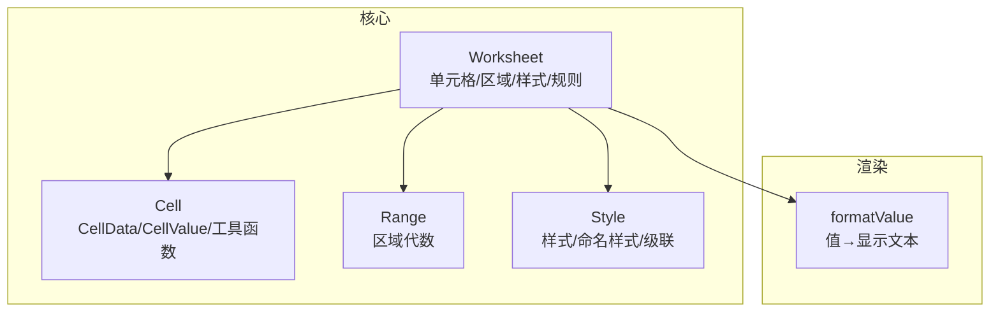
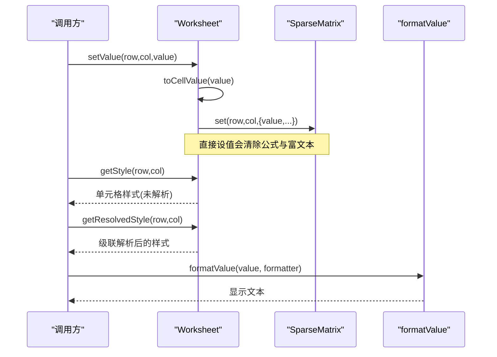
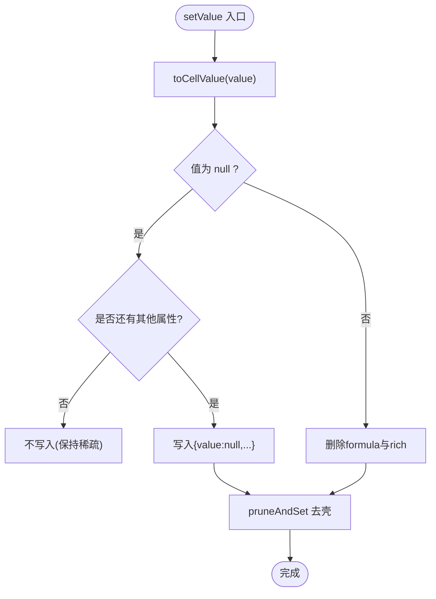
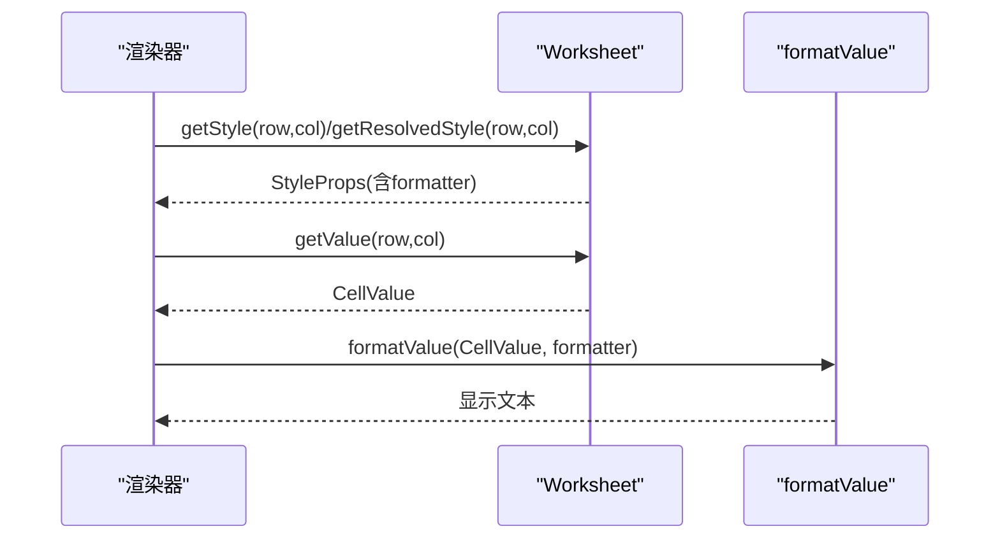
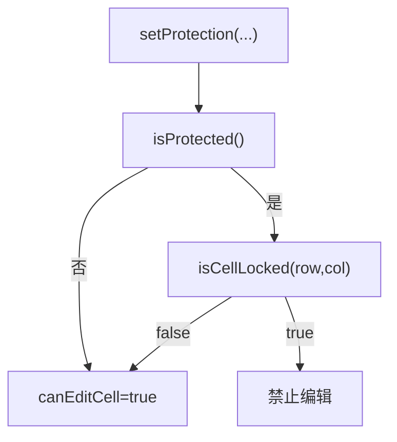
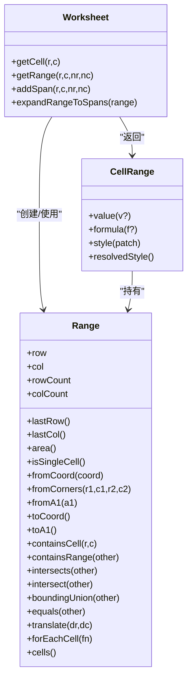
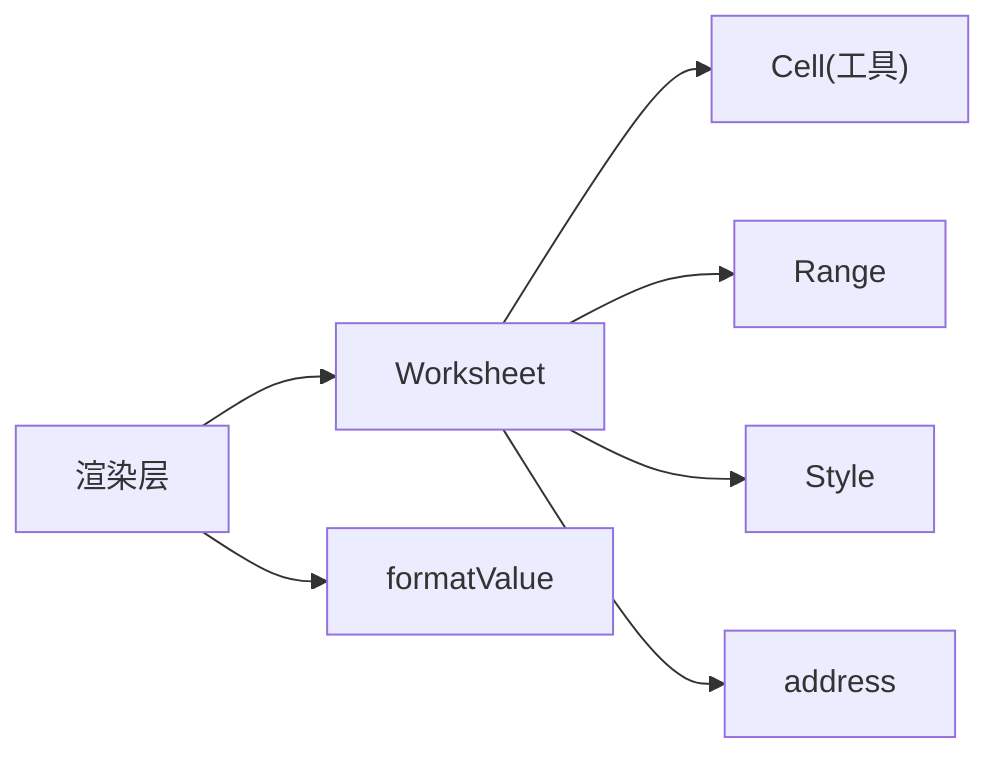

# Cell 单元格 API

<cite>
**本文引用的文件**
- [Cell.ts](file://cmx-mega-sheet/src/core/Cell.ts)
- [Range.ts](file://cmx-mega-sheet/src/core/Range.ts)
- [Worksheet.ts](file://cmx-mega-sheet/src/core/Worksheet.ts)
- [Style.ts](file://cmx-mega-sheet/src/core/Style.ts)
- [formatValue.ts](file://cmx-mega-sheet/src/render/formatValue.ts)
- [Cell.test.ts](file://cmx-mega-sheet/test/Cell.test.ts)
</cite>

## 目录
1. [简介](#简介)
2. [项目结构](#项目结构)
3. [核心组件](#核心组件)
4. [架构总览](#架构总览)
5. [详细组件分析](#详细组件分析)
6. [依赖关系分析](#依赖关系分析)
7. [性能考量](#性能考量)
8. [故障排查指南](#故障排查指南)
9. [结论](#结论)
10. [附录：API 速查与示例](#附录api-速查与示例)

## 简介
本文件为 cmx-mega-sheet 中的“单元格”相关 API 文档，聚焦于单元格的值操作、类型转换、格式化显示、编辑状态管理，以及与 Range 对象的交互。内容基于源码实现进行归纳，帮助开发者在读写单元格、设置条件格式、数据验证和样式时获得一致且可预期的行为。

## 项目结构
- 核心数据模型位于 core 目录：
  - Cell.ts：定义单元格数据结构、值规范化、公式归一化等工具。
  - Worksheet.ts：工作表数据模型，提供 getValue/setValue/getFormula/setFormula/getStyle/setStyle 等单元格操作，以及链式句柄 CellRange、合并区域、筛选、保护等能力。
  - Range.ts：不可变矩形区域对象，用于选区、合并 span、样式套用范围、公式引用区域的几何运算。
  - Style.ts：样式属性集、命名样式表、级联解析与合并。
- 渲染层 formatValue.ts：负责将内部值按格式串转换为显示文本（如数字/日期格式）。

**图示来源**
- [Worksheet.ts:435-686](file://cmx-mega-sheet/src/core/Worksheet.ts#L435-L686)
- [Cell.ts:14-73](file://cmx-mega-sheet/src/core/Cell.ts#L14-L73)
- [Range.ts:16-165](file://cmx-mega-sheet/src/core/Range.ts#L16-L165)
- [Style.ts:68-234](file://cmx-mega-sheet/src/core/Style.ts#L68-L234)
- [formatValue.ts](file://cmx-mega-sheet/src/render/formatValue.ts)

**章节来源**
- [Worksheet.ts:435-686](file://cmx-mega-sheet/src/core/Worksheet.ts#L435-L686)
- [Cell.ts:14-73](file://cmx-mega-sheet/src/core/Cell.ts#L14-L73)
- [Range.ts:16-165](file://cmx-mega-sheet/src/core/Range.ts#L16-L165)
- [Style.ts:68-234](file://cmx-mega-sheet/src/core/Style.ts#L68-L234)

## 核心组件
- 单元格数据模型（Cell）
  - CellValue：string | number | boolean | null
  - CellData：value/formula/style/rich（富文本）
  - toCellValue：将任意输入规范化为 CellValue（undefined/null→null；对象转字符串）
  - normalizeFormula：去除前导“=”并 trim
  - sanitizeImportedFormula：清洗导入的 Excel 伪前缀（@、_xlfn./_xlws.）
- 工作表（Worksheet）
  - 值与公式：getValue/setValue/getFormula/setFormula/setComputedValue
  - 样式：getStyle/setStyle/getResolvedStyle
  - 富文本：getRichText/setRichText
  - 链式句柄：getCell/getRange → CellRange（批量 value/formula/style 操作）
  - 区域与合并：addSpan/removeSpan/getSpan/getSpans/expandRangeToSpans
  - 可见性/大纲/筛选：行高列宽、隐藏行列、大纲折叠、自动筛选
  - 保护/锁定：setProtection/isProtected/isCellLocked/canEditCell/rangeHasLocked
  - 数据验证与超链接、条件格式、批注、浮动对象、迷你图、页面设置等扩展能力
- 区域（Range）
  - 构造与坐标转换：fromCoord/fromCorners/fromA1/toCoord/toA1
  - 几何运算：containsCell/containsRange/intersects/intersect/boundingUnion/equals/translate
  - 遍历：forEachCell/cells
- 样式（Style）
  - StyleProps：字体、对齐、颜色、边框、填充、旋转、缩进、锁定等
  - StyleSheet：命名样式表，expand 展开 styleName
  - resolveStyle：级联解析（sheet默认 < 列 < 行 < 单元格）

**章节来源**
- [Cell.ts:14-73](file://cmx-mega-sheet/src/core/Cell.ts#L14-L73)
- [Worksheet.ts:435-686](file://cmx-mega-sheet/src/core/Worksheet.ts#L435-L686)
- [Range.ts:16-165](file://cmx-mega-sheet/src/core/Range.ts#L16-L165)
- [Style.ts:68-234](file://cmx-mega-sheet/src/core/Style.ts#L68-L234)

## 架构总览
单元格是工作表的最小数据单元，承载值、公式、样式与富文本。Worksheet 通过 SparseMatrix 稀疏存储 CellData，并提供统一访问接口。Range 作为不可变区域对象，贯穿选区、合并、样式应用、公式引用等场景。样式通过 StyleSheet 与层级合并策略得到最终解析结果。渲染层使用 formatValue 将内部值按格式串转为显示文本。

**图示来源**
- [Worksheet.ts:530-631](file://cmx-mega-sheet/src/core/Worksheet.ts#L530-L631)
- [Cell.ts:43-55](file://cmx-mega-sheet/src/core/Cell.ts#L43-L55)
- [formatValue.ts](file://cmx-mega-sheet/src/render/formatValue.ts)

## 详细组件分析

### 单元格的值操作与类型转换
- getValue(row, col)：返回单元格当前值，不存在则返回 null。
- setValue(row, col, value)：
  - 先将 value 规范化为 CellValue（toCellValue）。
  - 若写入 null 且无其他属性，不会创建空记录（保持稀疏）。
  - 直接设值会覆盖并删除 formula 与 rich（对齐编辑覆盖语义）。
- clearValue：可通过 setValue(row, col, null) 清空值；若该格仅有值，则整条记录被清理。
- getFormula/setFormula：获取/设置公式源串（不含“=”），空字符串表示清公式。
- setComputedValue：仅更新计算值（display value），保留 formula 源串，供公式引擎回填。
- getRichText/setRichText：富文本读写；写富文本时会同步 value 为纯文本拼接，便于公式/查找/排序/TSV 兜底。

**图示来源**
- [Worksheet.ts:534-548](file://cmx-mega-sheet/src/core/Worksheet.ts#L534-L548)
- [Cell.ts:43-48](file://cmx-mega-sheet/src/core/Cell.ts#L43-L48)

**章节来源**
- [Worksheet.ts:530-603](file://cmx-mega-sheet/src/core/Worksheet.ts#L530-L603)
- [Cell.ts:43-55](file://cmx-mega-sheet/src/core/Cell.ts#L43-L55)

### 格式化显示与值到文本
- 单元格样式中可设置 formatter（数字/日期格式串）。
- 渲染层通过 formatValue 将内部值按 formatter 转换为显示文本。
- 建议：读取显示文本时使用渲染层的格式化逻辑；持久化/计算仍使用内部值。

**图示来源**
- [Worksheet.ts:605-631](file://cmx-mega-sheet/src/core/Worksheet.ts#L605-L631)
- [formatValue.ts](file://cmx-mega-sheet/src/render/formatValue.ts)

**章节来源**
- [Worksheet.ts:605-631](file://cmx-mega-sheet/src/core/Worksheet.ts#L605-L631)
- [formatValue.ts](file://cmx-mega-sheet/src/render/formatValue.ts)

### 编辑状态管理与保护/锁定
- 工作表保护：setProtection({enabled, allow*})，isProtected 判断是否保护。
- 单元格锁定：locked 字段（缺省视为锁定），isCellLocked 判定是否锁定。
- 可编辑性：canEditCell = 未保护 或 非锁定；rangeHasLocked 用于批量前置检查。
- 注意：保护态下，锁定单元格拒绝交互编辑。

**图示来源**
- [Worksheet.ts:634-661](file://cmx-mega-sheet/src/core/Worksheet.ts#L634-L661)
- [Style.ts:98-100](file://cmx-mega-sheet/src/core/Style.ts#L98-L100)

**章节来源**
- [Worksheet.ts:634-661](file://cmx-mega-sheet/src/core/Worksheet.ts#L634-L661)
- [Style.ts:98-100](file://cmx-mega-sheet/src/core/Style.ts#L98-L100)

### 与 Range 的交互
- Range 是不可变矩形区域，支持构造、坐标转换、包含/相交/交集/包围盒并集、平移、遍历等。
- Worksheet.getCell/getRange 返回 CellRange 句柄，可对区域内批量设置 value/formula/style。
- 合并区域：addSpan 会移除与之相交的旧合并区；expandRangeToSpans 可将选区扩展到包含所有相交合并区。

**图示来源**
- [Range.ts:16-165](file://cmx-mega-sheet/src/core/Range.ts#L16-L165)
- [Worksheet.ts:394-433](file://cmx-mega-sheet/src/core/Worksheet.ts#L394-L433)
- [Worksheet.ts:680-738](file://cmx-mega-sheet/src/core/Worksheet.ts#L680-L738)

**章节来源**
- [Range.ts:16-165](file://cmx-mega-sheet/src/core/Range.ts#L16-L165)
- [Worksheet.ts:394-433](file://cmx-mega-sheet/src/core/Worksheet.ts#L394-L433)
- [Worksheet.ts:680-738](file://cmx-mega-sheet/src/core/Worksheet.ts#L680-L738)

### 数据类型支持与边界情况
- 支持的原始值类型：string、number、boolean、null。
- toCellValue 会将 undefined/null 映射为 null；对象会被转为字符串。
- 公式串处理：normalizeFormula 去除前导“=”并 trim；sanitizeImportedFormula 清洗导入的 Excel 伪前缀。
- 富文本：rich 与标量 value 并存；写富文本会同步 value 为纯文本拼接，便于兼容。

**章节来源**
- [Cell.ts:14-73](file://cmx-mega-sheet/src/core/Cell.ts#L14-L73)
- [Cell.test.ts:4-32](file://cmx-mega-sheet/test/Cell.test.ts#L4-L32)

### 条件格式、数据验证与样式应用
- 数据验证（M12）：DataValidation 作用于区域，支持 list/whole/decimal/date/textLength/custom 等类型与提示/错误文案。
- 条件格式（M13）：ConditionalRule 作用于区域，支持 cellValue/colorScale/dataBar/iconSet，渲染时叠加计算，不改单元格数据。
- 样式应用：
  - 单格：getStyle/setStyle 读写单元格样式。
  - 级联：getResolvedStyle 返回 sheet默认 < 列 < 行 < 单元格 的合并结果。
  - 批量：CellRange.style(patch) 对区域内逐格叠加样式（mergeStyle）。
  - 命名样式：StyleSheet.expand 先展开 styleName 再叠加键。

**章节来源**
- [Worksheet.ts:55-105](file://cmx-mega-sheet/src/core/Worksheet.ts#L55-L105)
- [Worksheet.ts:420-433](file://cmx-mega-sheet/src/core/Worksheet.ts#L420-L433)
- [Style.ts:162-234](file://cmx-mega-sheet/src/core/Style.ts#L162-L234)

## 依赖关系分析
- Worksheet 依赖：
  - Cell（CellData/CellValue/工具函数）
  - Range（区域几何）
  - Style（样式与级联）
  - address（地址解析/格式化）
- 渲染层依赖 Worksheet 暴露的值与样式，并通过 formatValue 生成显示文本。
- 测试覆盖 toCellValue 与 normalizeFormula 的行为。

**图示来源**
- [Worksheet.ts:16-27](file://cmx-mega-sheet/src/core/Worksheet.ts#L16-L27)
- [Cell.ts:14-73](file://cmx-mega-sheet/src/core/Cell.ts#L14-L73)
- [Range.ts:10-14](file://cmx-mega-sheet/src/core/Range.ts#L10-L14)
- [Style.ts:68-234](file://cmx-mega-sheet/src/core/Style.ts#L68-L234)

**章节来源**
- [Worksheet.ts:16-27](file://cmx-mega-sheet/src/core/Worksheet.ts#L16-L27)
- [Cell.ts:14-73](file://cmx-mega-sheet/src/core/Cell.ts#L14-L73)
- [Range.ts:10-14](file://cmx-mega-sheet/src/core/Range.ts#L10-L14)
- [Style.ts:68-234](file://cmx-mega-sheet/src/core/Style.ts#L68-L234)

## 性能考量
- 稀疏存储：Worksheet 使用 SparseMatrix 存储 CellData，避免全矩阵开销。
- 去壳优化：pruneAndSet 在单元格为空壳时删除记录，维持稀疏性。
- 批量操作：CellRange 对区域逐格操作，适合小中规模区域；超大区域需评估 forEachCell 成本。
- 样式合并：resolveStyle 与 mergeStyle 为浅合并+borders 深合并，避免重复计算。

[本节为通用指导，无需具体文件引用]

## 故障排查指南
- 值写入后公式丢失：setValue 会覆盖并删除 formula，如需保留公式请使用 setComputedValue 更新计算值。
- 富文本与公式互斥：setRichText 会删除 formula；如需公式，请仅设置 value/formula。
- 导入公式异常：使用 sanitizeImportedFormula 清洗 @ 与 _xlfn./_xlws. 前缀后再设置。
- 保护态无法编辑：确认 isProtected 与 isCellLocked；必要时调整 protection 或 unlocked 单元格。
- 显示文本不符合预期：检查样式中的 formatter，并确保渲染层使用 formatValue 进行格式化。

**章节来源**
- [Worksheet.ts:534-603](file://cmx-mega-sheet/src/core/Worksheet.ts#L534-L603)
- [Cell.ts:50-73](file://cmx-mega-sheet/src/core/Cell.ts#L50-L73)
- [Worksheet.ts:634-661](file://cmx-mega-sheet/src/core/Worksheet.ts#L634-L661)

## 结论
Cell 与 Worksheet 提供了完整的单元格数据模型与操作 API，结合 Range 的区域能力与 Style 的级联样式机制，能够支撑复杂的表格编辑、展示与规则控制需求。通过规范化的值转换、公式处理与格式化流程，确保数据与显示的一致性。建议在业务中使用 Worksheet 的统一接口进行读写，并在渲染层使用 formatValue 保证显示正确。

[本节为总结，无需具体文件引用]

## 附录：API 速查与示例

### 常用 API 速查
- 值与公式
  - getValue(row, col) → CellValue
  - setValue(row, col, value) → void
  - getFormula(row, col) → string
  - setFormula(row, col, formula) → void
  - setComputedValue(row, col, value) → void
- 样式
  - getStyle(row, col) → StyleProps | undefined
  - setStyle(row, col, style) → void
  - getResolvedStyle(row, col) → StyleProps
- 富文本
  - getRichText(row, col) → RichText | null
  - setRichText(row, col, rich) → void
- 区域与合并
  - getCell(row, col) → CellRange
  - getRange(row, col, rowCount, colCount) → CellRange
  - addSpan(row, col, rowCount, colCount) → void
  - removeSpan(row, col) → void
  - getSpan(row, col) → Span | null
  - expandRangeToSpans(range) → Range
- 保护与锁定
  - setProtection(p) → void
  - isProtected() → boolean
  - isCellLocked(row, col) → boolean
  - canEditCell(row, col) → boolean
  - rangeHasLocked(row, col, rowCount, colCount) → boolean

### 示例场景（以步骤描述代替代码）
- 读写不同类型数据
  - 写入数字、布尔、字符串与空值，读取时注意 null 表示空。
  - 使用 setComputedValue 更新公式格的计算值，保留公式源。
- 条件格式设置
  - 定义 ConditionalRule（cellValue/colorScale/dataBar/iconSet），指定区域与样式，渲染时生效。
- 数据验证规则
  - 定义 DataValidation（list/whole/decimal/date/textLength/custom），配置提示与错误文案，限制用户输入。
- 单元格样式应用
  - 单格样式：setStyle 设置字体、颜色、边框、填充等。
  - 级联样式：getResolvedStyle 获取最终样式（考虑 sheet/列/行/单元格优先级）。
  - 批量样式：CellRange.style(patch) 对区域叠加样式。
- 与 Range 的交互
  - 使用 Range.fromA1/fromCorners 构造区域，遍历 cells/forEachCell 执行批量操作。
  - 合并区域：addSpan 添加合并，expandRangeToSpans 将选区扩展到包含合并区。

[本节为概念性说明，无需具体文件引用]