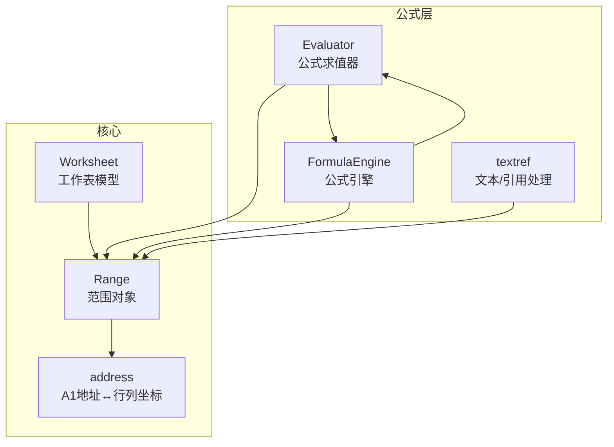
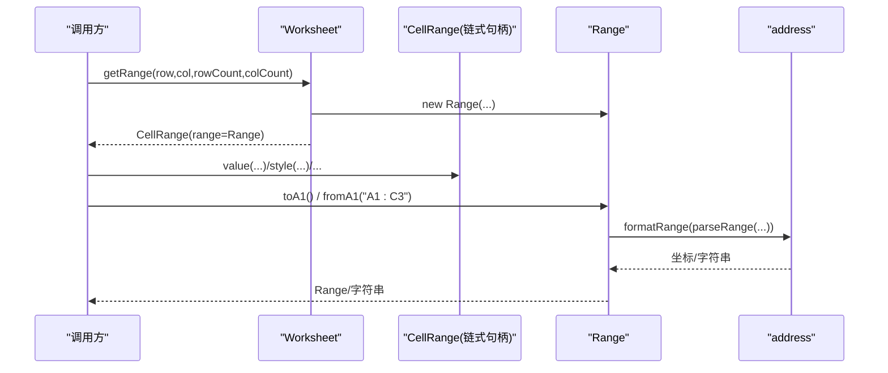
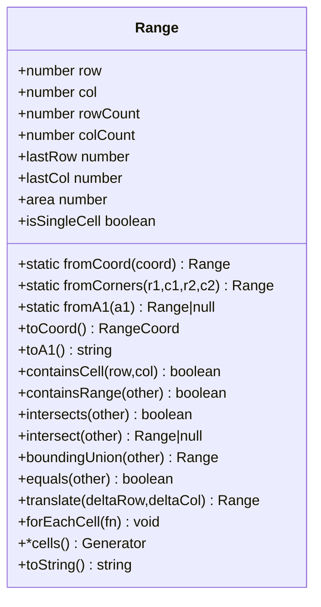
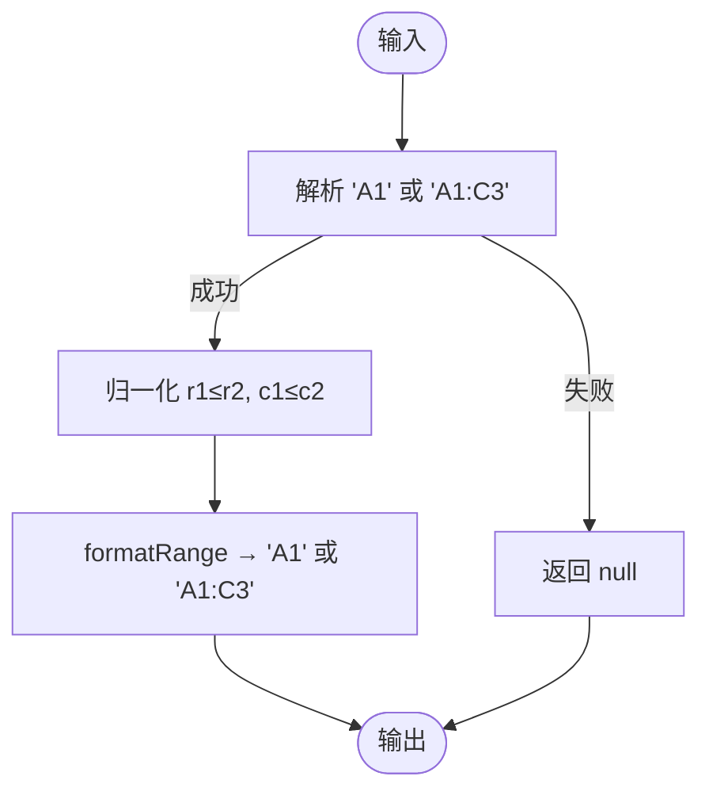
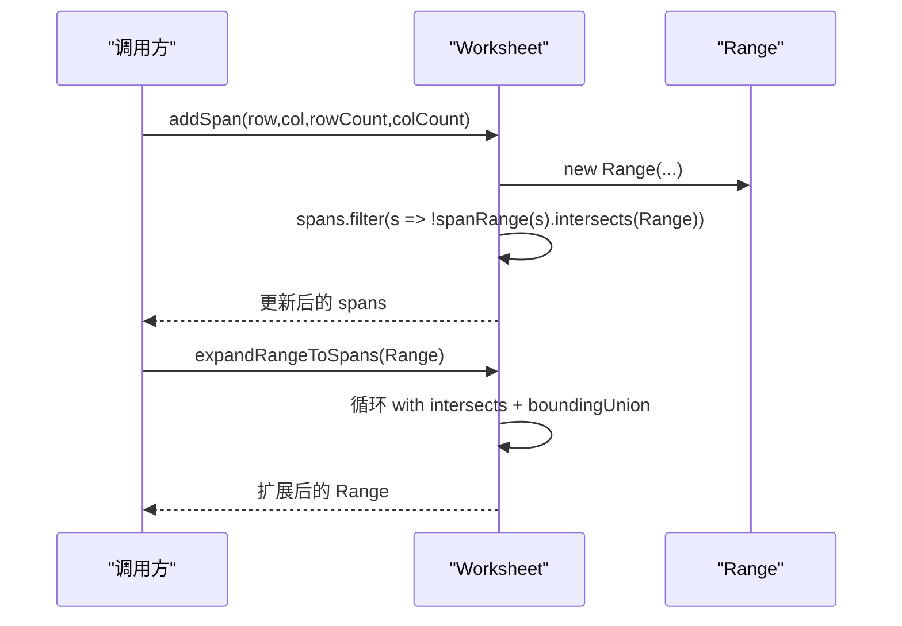
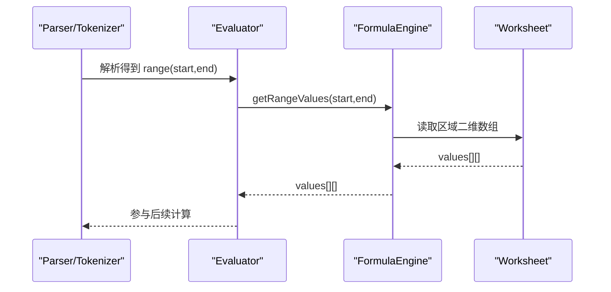
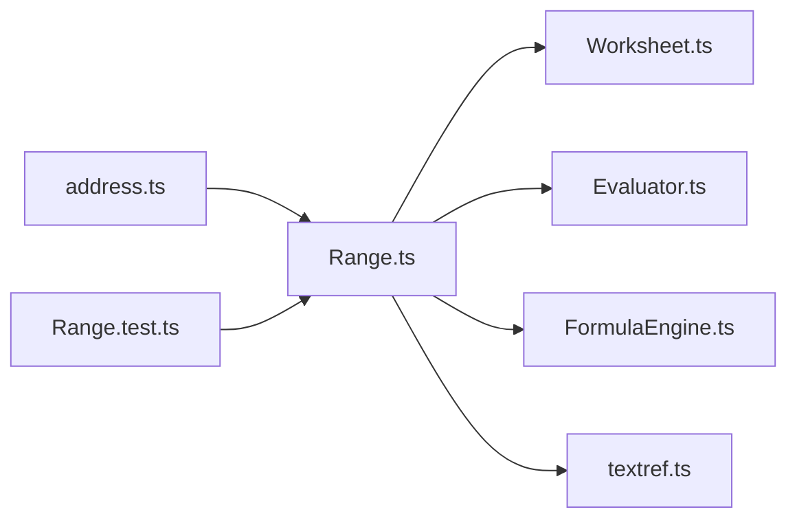

# Range 范围 API

<cite>
**本文引用的文件**
- [Range.ts](file://cmx-mega-sheet/src/core/Range.ts)
- [address.ts](file://cmx-mega-sheet/src/core/address.ts)
- [Worksheet.ts](file://cmx-mega-sheet/src/core/Worksheet.ts)
- [Evaluator.ts](file://cmx-mega-sheet/src/formula/Evaluator.ts)
- [FormulaEngine.ts](file://cmx-mega-sheet/src/formula/Formul aEngine.ts)
- [textref.ts](file://cmx-mega-sheet/src/formula/builtins/textref.ts)
- [Range.test.ts](file://cmx-mega-sheet/test/Range.test.ts)
</cite>

## 目录
1. [简介](#简介)
2. [项目结构](#项目结构)
3. [核心组件](#核心组件)
4. [架构总览](#架构总览)
5. [详细组件分析](#详细组件分析)
6. [依赖关系分析](#依赖关系分析)
7. [性能考虑](#性能考虑)
8. [故障排查指南](#故障排查指南)
9. [结论](#结论)
10. [附录：常见用法与示例路径](#附录：常见用法与示例路径)

## 简介
本文件为 Range 范围类的完整 API 文档，聚焦以下主题：
- 范围的创建与定义：fromCoord、fromCorners、fromA1、fromAddress（通过 address 层解析）
- 范围操作：intersect、intersects、boundingUnion、containsCell、containsRange
- 坐标计算与边界检查：行列归一化、lastRow/lastCol、area、isSingleCell
- 范围与单元格的映射：遍历 cells()/forEachCell()、A1 地址互转 toA1/fromA1
- 批量数据操作与性能优化：区域级写入、合并区扩展、公式引用区域取值
- 范围解析算法与地址转换机制：A1↔行列索引、区域字符串解析与格式化

## 项目结构
Range 位于 cmx-mega-sheet 的核心模块中，作为“矩形区域的不可变值对象 + 区域代数”的基元类型。它依赖 address 层完成 A1 地址与行列坐标的互转，并被 Worksheet、SelectionModel、公式引擎等广泛使用。

图表来源
- [Range.ts:1-166](file://cmx-mega-sheet/src/core/Range.ts#L1-L166)
- [address.ts:1-112](file://cmx-mega-sheet/src/core/address.ts#L1-L112)
- [Worksheet.ts:680-738](file://cmx-mega-sheet/src/core/Worksheet.ts#L680-L738)
- [Evaluator.ts:26-101](file://cmx-mega-sheet/src/formula/Evaluator.ts#L26-L101)
- [FormulaEngine.ts:93-128](file://cmx-mega-sheet/src/formula/FormulaEngine.ts#L93-L128)
- [textref.ts:131](file://cmx-mega-sheet/src/formula/builtins/textref.ts#L131)

章节来源
- [Range.ts:1-166](file://cmx-mega-sheet/src/core/Range.ts#L1-L166)
- [address.ts:1-112](file://cmx-mega-sheet/src/core/address.ts#L1-L112)
- [Worksheet.ts:680-738](file://cmx-mega-sheet/src/core/Worksheet.ts#L680-L738)

## 核心组件
- Range：不可变的矩形区域对象，提供构造、查询、集合运算、遍历与序列化能力。
- address：A1 地址与行列坐标互转、区域字符串解析与格式化。
- Worksheet：暴露 getRange/getCell 等接口，将 Range 与单元格数据、样式、合并区等绑定。
- 公式层：Evaluator/FormulaEngine/textref 通过 getRangeValues 获取区域二维数组，驱动公式计算。

章节来源
- [Range.ts:16-165](file://cmx-mega-sheet/src/core/Range.ts#L16-L165)
- [address.ts:14-112](file://cmx-mega-sheet/src/core/address.ts#L14-L112)
- [Worksheet.ts:680-738](file://cmx-mega-sheet/src/core/Worksheet.ts#L680-L738)
- [Evaluator.ts:26-101](file://cmx-mega-sheet/src/formula/Evaluator.ts#L26-L101)
- [FormulaEngine.ts:93-128](file://cmx-mega-sheet/src/formula/FormulaEngine.ts#L93-L128)
- [textref.ts:131](file://cmx-mega-sheet/src/formula/builtins/textref.ts#L131)

## 架构总览
Range 是几何与代数基元，贯穿选区、合并区、条件格式、公式引用等场景。其设计要点：
- 不可变值对象：所有操作返回新 Range，避免副作用。
- 0-based 闭区间：[row..lastRow] × [col..lastCol]，统一内部表示。
- 工厂方法：fromCoord/fromCorners/fromA1 支持多种输入形态。
- 区域代数：intersect/intersects/boundingUnion/contains* 提供集合语义。
- 遍历与序列化：cells()/forEachCell() 与 toA1/fromA1 打通 UI 与底层。

图表来源
- [Worksheet.ts:680-686](file://cmx-mega-sheet/src/core/Worksheet.ts#L680-L686)
- [Range.ts:55-83](file://cmx-mega-sheet/src/core/Range.ts#L55-L83)
- [address.ts:84-111](file://cmx-mega-sheet/src/core/address.ts#L84-L111)

## 详细组件分析

### Range 类 API 详解
- 构造与属性
  - constructor(row, col, rowCount?, colCount?)：自动 clamp 行列为 ≥0，尺寸 <1 归一为 1。
  - lastRow/lastCol：末行/末列索引（闭区间）。
  - area：单元格数 = rowCount × colCount。
  - isSingleCell：是否为单格。
- 工厂方法
  - fromCoord({r1,c1,r2,c2})：从归一化坐标构造，自动排序角点。
  - fromCorners(r1,c1,r2,c2)：任意顺序两角点构造。
  - fromA1(str)：解析 A1 区域字符串，非法返回 null。
- 视图与序列化
  - toCoord()：输出 {r1,c1,r2,c2}。
  - toA1()：输出 "A1" 或 "A1:C3"。
- 包含与相交
  - containsCell(row,col)：是否包含某单元格。
  - containsRange(other)：是否完全包含另一区域。
  - intersects(other)：是否有公共单元格。
  - intersect(other)：交集；无交返回 null。
  - boundingUnion(other)：包围盒并集（最小外接矩形）。
- 变换与遍历
  - translate(deltaRow,deltaCol)：平移（负方向向上/左，结果行列被 clamp 到 ≥0）。
  - forEachCell(fn)：行优先遍历每个单元格坐标。
  - cells()：生成器，逐格 yield {row,col}。
- 相等性
  - equals(other)：四要素全等比较。

图表来源
- [Range.ts:16-165](file://cmx-mega-sheet/src/core/Range.ts#L16-L165)

章节来源
- [Range.ts:16-165](file://cmx-mega-sheet/src/core/Range.ts#L16-L165)
- [Range.test.ts:4-119](file://cmx-mega-sheet/test/Range.test.ts#L4-L119)

### 地址解析与转换（address 层）
- 列标签与索引互转：colToLabel(index)、labelToCol(label)。
- 单格地址：parseAddr("A1") → {row,col}；formatAddr(row,col) → "A1"。
- 区域字符串：parseRange("A1:C3") → {r1,c1,r2,c2}；formatRange(coord) → "A1:C3"。
- 约定：行列 0-based，A1 引用中行号 1-based；大小写不敏感；非法输入返回 null/-1。

图表来源
- [address.ts:35-111](file://cmx-mega-sheet/src/core/address.ts#L35-L111)

章节来源
- [address.ts:14-112](file://cmx-mega-sheet/src/core/address.ts#L14-L112)

### 与 Worksheet 的集成
- 获取范围：getRange(row,col,rowCount,colCount) → CellRange(range=Range)。
- 合并区交互：addSpan/removeSpan/getSpan/getSpans；expandRangeToSpans 将选区扩展到覆盖所有与之相交的合并区（迭代至不动点）。
- 可见性与筛选：applyOutlineVisibility/applyFilterVisibility 基于 Range 控制行列隐藏。

图表来源
- [Worksheet.ts:688-738](file://cmx-mega-sheet/src/core/Worksheet.ts#L688-L738)

章节来源
- [Worksheet.ts:680-738](file://cmx-mega-sheet/src/core/Worksheet.ts#L680-L738)

### 公式引用与区域取值
- Evaluator 在遇到 range 节点时，通过 accessor.getRangeValues(start,end) 获取二维数组。
- FormulaEngine 注入 getRangeValues，将 start/end 解析为行列范围并钳制到 sheet 维度。
- textref 内置函数对引用进行切片/拼接等操作，最终仍落到 getRangeValues。

图表来源
- [Evaluator.ts:26-101](file://cmx-mega-sheet/src/formula/Evaluator.ts#L26-L101)
- [FormulaEngine.ts:93-128](file://cmx-mega-sheet/src/formula/FormulaEngine.ts#L93-L128)
- [textref.ts:131](file://cmx-mega-sheet/src/formula/builtins/textref.ts#L131)

章节来源
- [Evaluator.ts:26-101](file://cmx-mega-sheet/src/formula/Evaluator.ts#L26-L101)
- [FormulaEngine.ts:93-128](file://cmx-mega-sheet/src/formula/FormulaEngine.ts#L93-L128)
- [textref.ts:131](file://cmx-mega-sheet/src/formula/builtins/textref.ts#L131)

## 依赖关系分析
- Range 依赖 address 完成 A1 地址 ↔ 行列坐标的互转。
- Worksheet 依赖 Range 表达选区、合并区、打印区域、筛选区域等。
- 公式层通过 getRangeValues 间接消费 Range 所表达的二维区域。
- 测试用例验证了 Range 的构造、A1 往返、包含/相交、平移与遍历等行为。

图表来源
- [Range.ts:10-14](file://cmx-mega-sheet/src/core/Range.ts#L10-L14)
- [Worksheet.ts:16-27](file://cmx-mega-sheet/src/core/Worksheet.ts#L16-L27)
- [Evaluator.ts:26-101](file://cmx-mega-sheet/src/formula/Evaluator.ts#L26-L101)
- [FormulaEngine.ts:93-128](file://cmx-mega-sheet/src/formula/FormulaEngine.ts#L93-L128)
- [textref.ts:131](file://cmx-mega-sheet/src/formula/builtins/textref.ts#L131)
- [Range.test.ts:1-119](file://cmx-mega-sheet/test/Range.test.ts#L1-L119)

章节来源
- [Range.ts:10-14](file://cmx-mega-sheet/src/core/Range.ts#L10-L14)
- [Worksheet.ts:16-27](file://cmx-mega-sheet/src/core/Worksheet.ts#L16-L27)
- [Evaluator.ts:26-101](file://cmx-mega-sheet/src/formula/Evaluator.ts#L26-L101)
- [FormulaEngine.ts:93-128](file://cmx-mega-sheet/src/formula/FormulaEngine.ts#L93-L128)
- [textref.ts:131](file://cmx-mega-sheet/src/formula/builtins/textref.ts#L131)
- [Range.test.ts:1-119](file://cmx-mega-sheet/test/Range.test.ts#L1-L119)

## 性能考虑
- 区域代数复杂度
  - intersects/intersect：O(1) 几何判断。
  - boundingUnion：O(1)。
  - containsCell/containsRange：O(1)。
  - forEachCell/cells：O(N)，N=rowCount×colCount。
- 合并区扩展
  - expandRangeToSpans 在最坏情况下需遍历所有 span 多次，但内部有 guard 限制迭代次数，避免无限循环。
- 公式区域取值
  - getRangeValues 通常按区域一次性拉取二维数组，减少频繁单格访问开销。
- 建议
  - 批量写入/样式设置优先使用 CellRange 链式 API，避免逐格操作。
  - 大区域遍历尽量使用 cells()/forEachCell，必要时分块处理。
  - 对超大区域做条件格式或筛选前，先估算面积，必要时分页或增量计算。

## 故障排查指南
- 构造异常
  - 负行列会被 clamp 到 0；尺寸 <1 会被归一为 1。若发现范围不符合预期，检查传入参数。
  - 参考：[Range.ts:28-33](file://cmx-mega-sheet/src/core/Range.ts#L28-L33)
- A1 解析失败
  - fromA1 对非法字符串返回 null。请确认字符串形如 "A1" 或 "A1:C3"。
  - 参考：[Range.ts:69-73](file://cmx-mega-sheet/src/core/Range.ts#L69-L73)、[address.ts:84-97](file://cmx-mega-sheet/src/core/address.ts#L84-L97)
- 相交判断边界
  - 相邻但不重叠的区域视为不相交。若期望包含边接触，请在上层逻辑显式处理。
  - 参考：[Range.ts:100-108](file://cmx-mega-sheet/src/core/Range.ts#L100-L108)
- 合并区影响选区
  - 选中合并区内任一格会扩展为整个合并区。若行为不符预期，检查 expandRangeToSpans 的使用位置。
  - 参考：[Worksheet.ts:719-738](file://cmx-mega-sheet/src/core/Worksheet.ts#L719-L738)
- 公式区域越界
  - 公式层会将未指定轴的范围钳制到 sheet 维度。若结果异常，检查工作表行列边界。
  - 参考：[FormulaEngine.ts:128](file://cmx-mega-sheet/src/formula/FormulaEngine.ts#L128)

章节来源
- [Range.ts:28-33](file://cmx-mega-sheet/src/core/Range.ts#L28-L33)
- [Range.ts:69-73](file://cmx-mega-sheet/src/core/Range.ts#L69-L73)
- [address.ts:84-97](file://cmx-mega-sheet/src/core/address.ts#L84-L97)
- [Range.ts:100-108](file://cmx-mega-sheet/src/core/Range.ts#L100-L108)
- [Worksheet.ts:719-738](file://cmx-mega-sheet/src/core/Worksheet.ts#L719-L738)
- [FormulaEngine.ts:128](file://cmx-mega-sheet/src/formula/FormulaEngine.ts#L128)

## 结论
Range 以不可变值对象的形式提供了稳定、可组合的矩形区域抽象，配合 address 层的地址解析与 Worksheet 的领域能力，覆盖了选区、合并区、条件格式、公式引用等关键场景。其 O(1) 的几何运算与 O(N) 的遍历能力，结合批量 API 与公式层的一次性区域取值，能够在大规模表格应用中保持良好性能。

## 附录：常见用法与示例路径
- 范围选择与遍历
  - 使用 Worksheet.getRange 获取 CellRange，并通过 cells()/forEachCell 遍历。
  - 参考：[Worksheet.ts:680-686](file://cmx-mega-sheet/src/core/Worksheet.ts#L680-L686)、[Range.ts:144-160](file://cmx-mega-sheet/src/core/Range.ts#L144-L160)
- 数据复制粘贴
  - 源区域读取二维数组（公式层 getRangeValues），目标区域批量写入（CellRange.value）。
  - 参考：[Evaluator.ts:26-101](file://cmx-mega-sheet/src/formula/Evaluator.ts#L26-L101)、[Worksheet.ts:680-686](file://cmx-mega-sheet/src/core/Worksheet.ts#L680-L686)
- 条件格式应用
  - 以 Range 表达规则作用域，渲染层根据 ConditionalRule.range 计算命中样式。
  - 参考：[Worksheet.ts:84-105](file://cmx-mega-sheet/src/core/Worksheet.ts#L84-L105)
- 公式引用
  - 公式中的区域引用经 Evaluator/FormulaEngine 转换为二维数组参与计算。
  - 参考：[Evaluator.ts:26-101](file://cmx-mega-sheet/src/formula/Evaluator.ts#L26-L101)、[FormulaEngine.ts:93-128](file://cmx-mega-sheet/src/formula/FormulaEngine.ts#L93-L128)
- 地址转换与校验
  - 使用 fromA1/toA1 与 parseRange/formatRange 进行 A1 与坐标互转与校验。
  - 参考：[Range.ts:69-83](file://cmx-mega-sheet/src/core/Range.ts#L69-L83)、[address.ts:84-111](file://cmx-mega-sheet/src/core/address.ts#L84-L111)
- 单元测试参考
  - 构造、A1 往返、包含/相交、平移与遍历等行为的断言。
  - 参考：[Range.test.ts:4-119](file://cmx-mega-sheet/test/Range.test.ts#L4-L119)