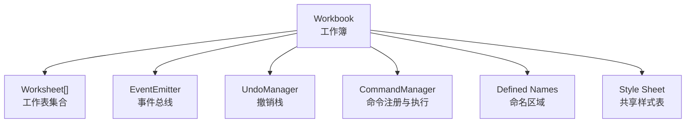
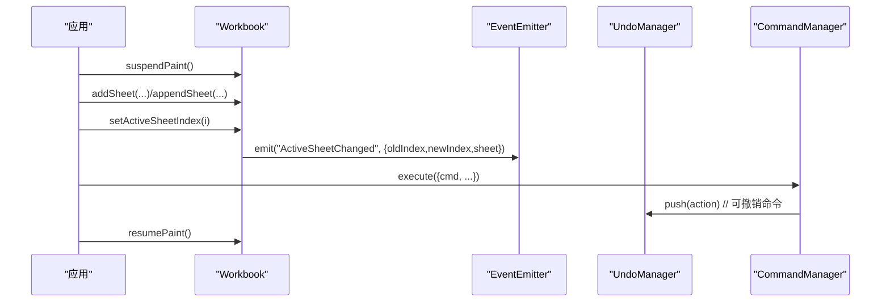
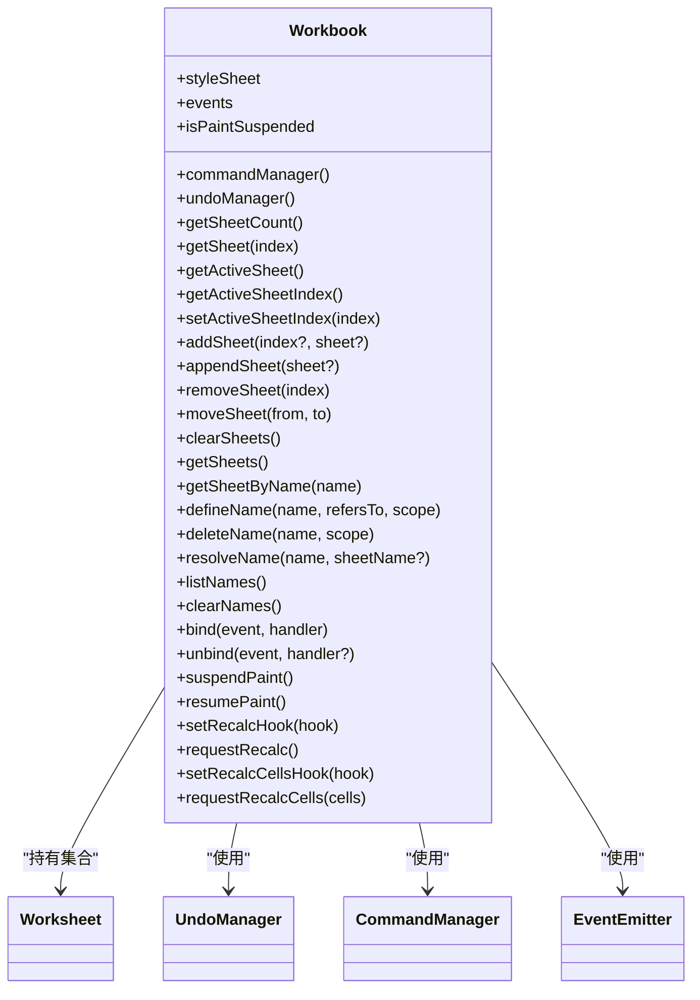
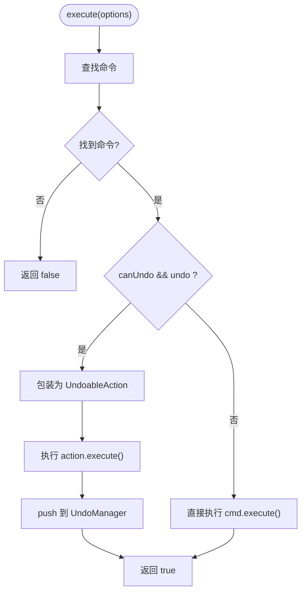
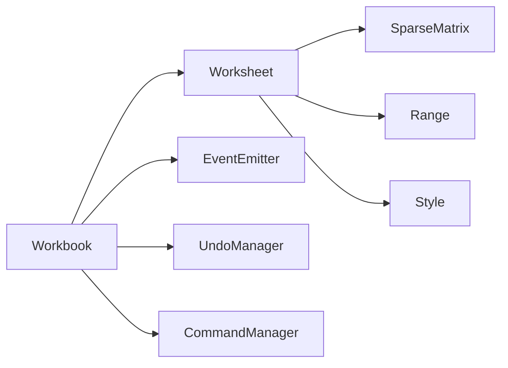

# Workbook 工作簿 API

<cite>
**本文引用的文件**
- [Workbook.ts](file://cmx-mega-sheet/src/core/Workbook.ts)
- [Worksheet.ts](file://cmx-mega-sheet/src/core/Worksheet.ts)
- [EventEmitter.ts](file://cmx-mega-sheet/src/core/EventEmitter.ts)
- [Workbook.test.ts](file://cmx-mega-sheet/test/Workbook.test.ts)
</cite>

## 目录
1. [简介](#简介)
2. [项目结构](#项目结构)
3. [核心组件](#核心组件)
4. [架构总览](#架构总览)
5. [详细组件分析](#详细组件分析)
6. [依赖关系分析](#依赖关系分析)
7. [性能考虑](#性能考虑)
8. [故障排查指南](#故障排查指南)
9. [结论](#结论)
10. [附录：使用示例与最佳实践](#附录使用示例与最佳实践)

## 简介
本文件为 cmx-mega-sheet 中的 Workbook（工作簿）API 提供系统化、可操作的文档。内容覆盖：
- 构造函数与工作表管理（addSheet、removeSheet、getSheetCount、moveSheet、clearSheets 等）
- 活动表切换机制与事件系统（ActiveSheetChanged、SheetAdded、SheetRemoved）
- 命名区域管理（defineName、deleteName、resolveName、listNames、clearNames）
- 撤销重做机制（UndoManager）与命令管理器（CommandManager）
- 绘制抑制（suspendPaint/resumePaint/isPaintSuspended）
- 批量数据导入模式与性能优化建议
- 错误处理策略与常见问题定位

## 项目结构
与 Workbook API 直接相关的核心源码位于 cmx-mega-sheet/src/core：
- Workbook.ts：工作簿模型，包含工作表集合、活动表、事件、命名区域、撤销/命令、绘制抑制等
- Worksheet.ts：工作表数据模型（单元格、合并、行列结构、筛选、验证、条件格式、批注、浮动对象、迷你图、页面设置等）
- EventEmitter.ts：类型化事件总线，用于派发工作簿级事件

图表来源
- [Workbook.ts:174-396](file://cmx-mega-sheet/src/core/Workbook.ts#L174-L396)
- [EventEmitter.ts:13-59](file://cmx-mega-sheet/src/core/EventEmitter.ts#L13-L59)

章节来源
- [Workbook.ts:1-396](file://cmx-mega-sheet/src/core/Workbook.ts#L1-L396)
- [EventEmitter.ts:1-60](file://cmx-mega-sheet/src/core/EventEmitter.ts#L1-L60)

## 核心组件
- Workbook：顶层容器，维护工作表集合、活动表索引、事件、命名区域、撤销/命令、绘制抑制计数、重算钩子
- Worksheet：单个工作表的数据模型，承载单元格值/公式/样式、合并区、行列结构与元信息、筛选、验证、条件格式、批注、浮动对象、迷你图、页面设置等
- UndoManager：撤销/重做栈，支持最大长度裁剪、do/push/undo/redo/clear
- CommandManager：命令注册与执行，自动包装可撤销命令并接入 UndoManager
- EventEmitter：类型化事件分发，隔离订阅者异常，提供 bind/unbind/emit/hasListeners

章节来源
- [Workbook.ts:174-396](file://cmx-mega-sheet/src/core/Workbook.ts#L174-L396)
- [Worksheet.ts:435-1274](file://cmx-mega-sheet/src/core/Worksheet.ts#L435-L1274)
- [EventEmitter.ts:13-59](file://cmx-mega-sheet/src/core/EventEmitter.ts#L13-L59)

## 架构总览
Workbook 作为模型层入口，协调以下子系统：
- 工作表集合：增删改查、移动页签顺序、清空
- 活动表切换：变更时触发 ActiveSheetChanged 事件
- 命名区域：定义/删除/解析/列出，区分 workbook 级与 sheet 级作用域
- 撤销/命令：通过 CommandManager 统一执行命令，可撤销命令经 UndoManager 记录
- 事件系统：基于 EventEmitter 的强类型事件分发
- 绘制抑制：suspendPaint/resumePaint 计数控制渲染批次
- 重算钩子：requestRecalc/requestRecalcCells 对接公式引擎

图表来源
- [Workbook.ts:288-306](file://cmx-mega-sheet/src/core/Workbook.ts#L288-L306)
- [Workbook.ts:156-171](file://cmx-mega-sheet/src/core/Workbook.ts#L156-L171)
- [Workbook.ts:384-395](file://cmx-mega-sheet/src/core/Workbook.ts#L384-L395)

## 详细组件分析

### Workbook 类
- 构造参数
  - opts.sheetCount：初始工作表数量（默认 1）
  - 内部创建 Worksheet 时注入共享 styleSheet
- 工作表管理
  - getSheetCount/getSheet/getActiveSheet/getActiveSheetIndex/setActiveSheetIndex
  - addSheet(index?, sheet?)：在指定位置插入或追加；若插入位置小于等于当前活动表索引，则活动表索引后移
  - appendSheet(sheet?)：等价于 addSheet(sheets.length, sheet)
  - removeSheet(index)：移除后修正活动表索引，避免越界
  - moveSheet(from, to)：页签拖拽排序；活动表跟随其内容（按 identity），保持选中同一张表
  - clearSheets()：清空所有工作表并重置活动索引
  - getSheets()/getSheetByName(name)：只读视图与按名查找
- 活动表切换机制
  - setActiveSheetIndex 会校验边界，仅在索引变化时派发 ActiveSheetChanged 事件
- 命名区域管理
  - defineName(name, refersTo, scope='workbook')：name 大写归一；refersTo 去除前导 '='
  - deleteName(name, scope)：删除命名区域
  - resolveName(name, sheetName?)：先查 sheet 级（当前 sheet 作用域），再查 workbook 级
  - listNames()：返回 name/scope/refersTo 列表
  - clearNames()：清空全部命名区域
- 事件系统
  - bind/unbind：绑定/解绑事件处理器
  - 事件载荷：
    - ActiveSheetChanged: { oldIndex, newIndex, sheet }
    - SheetAdded: { index, sheet }
    - SheetRemoved: { index, name }
- 撤销/命令
  - undoManager()：获取 UndoManager 实例
  - commandManager()：获取 CommandManager 实例
  - CommandManager.execute(options)：根据 cmd 查找命令执行；若命令标记 canUndo 且存在 undo，则包装为 UndoableAction 入栈
  - UndoManager.do/push/undo/redo/clear/maxSize：撤销/重做栈管理，支持最大长度裁剪
- 绘制抑制
  - suspendPaint()/resumePaint()/isPaintSuspended：计数型抑制，嵌套安全
- 重算钩子
  - setRecalcHook(hook)/requestRecalc()：全量重算请求
  - setRecalcCellsHook(hook)/requestRecalcCells(cells)：增量重算请求（未接引擎时退化全量）

图表来源
- [Workbook.ts:174-396](file://cmx-mega-sheet/src/core/Workbook.ts#L174-L396)

章节来源
- [Workbook.ts:174-396](file://cmx-mega-sheet/src/core/Workbook.ts#L174-L396)

### Worksheet 类（与 Workbook 协作的关键能力）
- 单元格与范围
  - getValue/setValue、getFormula/setFormula、getStyle/setStyle、getCell/getRange
  - setComputedValue：写入计算值（保留公式源）
- 合并区
  - addSpan/removeSpan/getSpan/getSpans、expandRangeToSpans
- 行列结构与元信息
  - getRowCount/setRowCount、getColumnCount/setColumnCount
  - addRows/deleteRows/addColumns/deleteColumns（同步搬移数据、合并、样式、大纲分组等）
  - getRowHeight/setRowHeight、getColumnWidth/setColumnWidth
  - isRowVisible/setRowVisible、isColumnVisible/setColumnVisible
- 大纲分组
  - rowOutlines/columnOutlines.group/ungroup/setCollapsed/list/collapseToLevel/expandAll/hiddenIndices
  - applyOutlineVisibility：根据折叠态刷新可见性
- 自动筛选（M11）
  - setAutoFilter(range|null)、setFilterCriterion(col, criterion|null)、clearFilters()
  - applyFilterVisibility：根据条件隐藏行
  - filterUniqueValues(col)：列出唯一显示值
- 数据验证（M12）、超链接（M12）、条件格式（M13）、批注（M14）、浮动对象（M14）、迷你图（M21）、页面设置（M15）、保护（M20）
- 选区与缩放
  - getSelections/setSelection/addSelection/clearSelection
  - getActiveRowIndex/getActiveColumnIndex/setActiveCell/getActiveAddr
  - zoom(factor?)：缩放因子记录

章节来源
- [Worksheet.ts:435-1274](file://cmx-mega-sheet/src/core/Worksheet.ts#L435-L1274)

### 事件系统（EventEmitter）
- 类型化事件绑定与派发，回调签名 (sender, args)
- 异常隔离：单个订阅者抛错不影响其他订阅者
- 常用方法：bind/unbind/emit/hasListeners/unbindAll

章节来源
- [EventEmitter.ts:13-59](file://cmx-mega-sheet/src/core/EventEmitter.ts#L13-L59)

### 撤销/重做与命令
- UndoManager
  - do(action)：执行并压栈，清空 redo 栈
  - push(action)：仅压栈（动作已在外部执行）
  - undo()/redo()：撤销/重做，返回被操作的动作（便于读取结构编辑元信息）
  - maxSize(n)：设置最大长度并裁剪
  - clear()：清空双栈
- CommandManager
  - register(name, command)：注册命令
  - execute(options)：根据 cmd 执行；若命令可撤销，则包装为 UndoableAction 并 push 到 UndoManager

图表来源
- [Workbook.ts:156-171](file://cmx-mega-sheet/src/core/Workbook.ts#L156-L171)
- [Workbook.ts:53-123](file://cmx-mega-sheet/src/core/Workbook.ts#L53-L123)

章节来源
- [Workbook.ts:53-171](file://cmx-mega-sheet/src/core/Workbook.ts#L53-L171)

## 依赖关系分析
- Workbook 依赖 Worksheet（工作表集合）、EventEmitter（事件）、UndoManager（撤销）、CommandManager（命令）、StyleSheet（共享样式）
- Worksheet 依赖 SparseMatrix（稀疏矩阵存储）、Range（区域）、Style（样式解析与合并）、Cell（值/公式/富文本）
- 事件流：Workbook 通过 EventEmitter 派发 ActiveSheetChanged、SheetAdded、SheetRemoved；渲染层可在其上扩展更多事件

图表来源
- [Workbook.ts:174-396](file://cmx-mega-sheet/src/core/Workbook.ts#L174-L396)
- [Worksheet.ts:435-1274](file://cmx-mega-sheet/src/core/Worksheet.ts#L435-L1274)

章节来源
- [Workbook.ts:174-396](file://cmx-mega-sheet/src/core/Workbook.ts#L174-L396)
- [Worksheet.ts:435-1274](file://cmx-mega-sheet/src/core/Worksheet.ts#L435-L1274)

## 性能考虑
- 批量操作时使用绘制抑制
  - 在大量修改前调用 suspendPaint()，完成后调用 resumePaint()，减少中间渲染开销
  - 支持嵌套：多次 suspendPaint 需对应多次 resumePaint
- 合理设置撤销栈大小
  - 通过 UndoManager.maxSize(n) 限制历史长度，避免内存膨胀
- 使用命令模式
  - 将复杂操作封装为 Command，统一执行与撤销，利于事务化与一致性
- 增量重算
  - 当公式引擎已装配时，优先使用 requestRecalcCells 进行局部重算，降低全量重算成本
- 工作表结构调整
  - addRows/deleteRows/addColumns/deleteColumns 会同步搬移数据、合并区、样式、大纲分组等，注意批量调整时的复杂度

[本节为通用性能指导，不直接分析具体代码]

## 故障排查指南
- 活动表切换未触发事件
  - 检查是否传入相同索引；setActiveSheetIndex 仅在索引变化时派发事件
- 命名区域解析不符合预期
  - 确认 scope 与作用域优先级：sheet 级优先于 workbook 级；name 为大写归一
- 撤销/重做无效
  - 确保通过 CommandManager.execute 执行命令，且命令实现 canUndo 与 undo
  - 检查 UndoManager 的 maxSize 是否过小导致历史被裁剪
- 绘制抑制状态异常
  - 确保 suspendPaint 与 resumePaint 成对调用；isPaintSuspended 可用于调试
- 事件订阅者抛错影响其他订阅者
  - EventEmitter 已隔离异常；若仍出现异常，检查订阅逻辑

章节来源
- [Workbook.ts:288-306](file://cmx-mega-sheet/src/core/Workbook.ts#L288-L306)
- [Workbook.ts:203-225](file://cmx-mega-sheet/src/core/Workbook.ts#L203-L225)
- [Workbook.ts:156-171](file://cmx-mega-sheet/src/core/Workbook.ts#L156-L171)
- [Workbook.ts:384-395](file://cmx-mega-sheet/src/core/Workbook.ts#L384-L395)
- [EventEmitter.ts:42-51](file://cmx-mega-sheet/src/core/EventEmitter.ts#L42-L51)

## 结论
Workbook 提供了完整的工作簿级能力：工作表管理、活动表切换、命名区域、撤销/命令、事件系统与绘制抑制。配合 Worksheet 的数据模型能力，可满足从基础表格到复杂报表场景的需求。建议在批量操作中使用绘制抑制与命令模式，结合撤销栈大小控制与增量重算，获得更优的性能与用户体验。

[本节为总结性内容，不直接分析具体代码]

## 附录：使用示例与最佳实践

### 常见使用模式
- 创建工作簿与工作表
  - 通过 new Workbook({ sheetCount }) 初始化多个工作表
  - 使用 appendSheet/addSheet 动态添加工作表
  - 通过 getSheet/getSheetByName 获取工作表引用
- 工作表操作
  - 设置单元格值/公式/样式：worksheet.setValue/getValue、setFormula/getFormula、setStyle/getStyle
  - 合并区域：addSpan/removeSpan/getSpan
  - 行列结构：addRows/deleteRows/addColumns/deleteColumns
  - 筛选：setAutoFilter/setFilterCriterion/clearFilters
- 事件监听
  - 绑定 ActiveSheetChanged、SheetAdded、SheetRemoved 等事件
  - 使用 unbind 解绑以避免内存泄漏
- 撤销/命令
  - 注册命令并通过 commandManager().execute 执行
  - 使用 undoManager().undo/redo 进行撤销/重做
- 批量数据导入
  - 使用 suspendPaint/resumePaint 包裹批量写入
  - 分批写入并适时刷新筛选/大纲可见性

章节来源
- [Workbook.test.ts:6-54](file://cmx-mega-sheet/test/Workbook.test.ts#L6-L54)
- [Workbook.test.ts:96-126](file://cmx-mega-sheet/test/Workbook.test.ts#L96-L126)
- [Workbook.test.ts:128-192](file://cmx-mega-sheet/test/Workbook.test.ts#L128-L192)
- [Workbook.test.ts:194-207](file://cmx-mega-sheet/test/Workbook.test.ts#L194-L207)

### 性能优化建议
- 批量写入前调用 suspendPaint()，完成后 resumePaint()
- 合理设置 UndoManager.maxSize，避免过长历史导致内存压力
- 使用命令模式封装复杂操作，保证一致性与可撤销性
- 公式引擎装配后优先使用 requestRecalcCells 进行局部重算

[本节为通用优化建议，不直接分析具体代码]

### 错误处理策略
- 事件订阅者异常隔离：单个订阅者抛错不影响其他订阅者
- 活动表索引越界保护：setActiveSheetIndex 会钳制到有效范围
- 命名区域键名规范：name 大写归一，scope 区分作用域
- 撤销栈裁剪：maxSize 超出部分将被丢弃，注意业务语义

章节来源
- [EventEmitter.ts:42-51](file://cmx-mega-sheet/src/core/EventEmitter.ts#L42-L51)
- [Workbook.ts:288-296](file://cmx-mega-sheet/src/core/Workbook.ts#L288-L296)
- [Workbook.ts:203-225](file://cmx-mega-sheet/src/core/Workbook.ts#L203-L225)
- [Workbook.ts:53-123](file://cmx-mega-sheet/src/core/Workbook.ts#L53-L123)