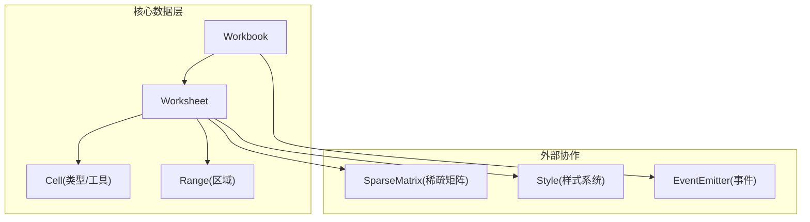
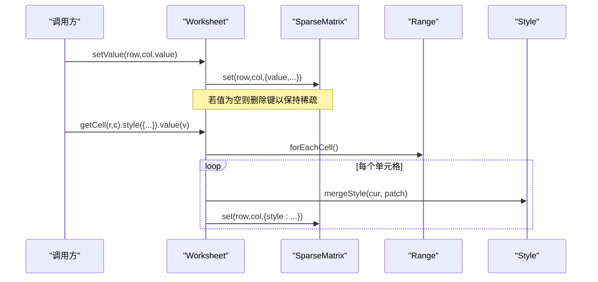
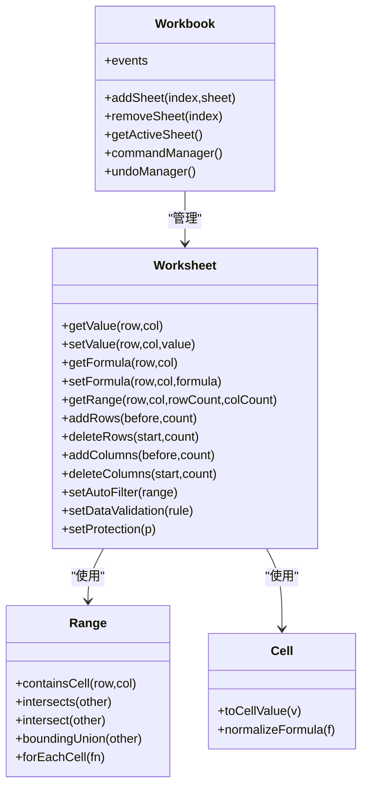

# Worksheet 工作表 API

<cite>
**本文引用的文件**
- [Worksheet.ts](file://cmx-mega-sheet/src/core/Worksheet.ts)
- [Workbook.ts](file://cmx-mega-sheet/src/core/Workbook.ts)
- [Cell.ts](file://cmx-mega-sheet/src/core/Cell.ts)
- [Range.ts](file://cmx-mega-sheet/src/core/Range.ts)
- [Worksheet.test.ts](file://cmx-mega-sheet/test/Worksheet.test.ts)
- [spec-m0.js](file://cmx-mega-sheet/demo/specs/spec-m0.js)
</cite>

## 目录
1. [简介](#简介)
2. [项目结构](#项目结构)
3. [核心组件](#核心组件)
4. [架构总览](#架构总览)
5. [详细组件分析](#详细组件分析)
6. [依赖关系分析](#依赖关系分析)
7. [性能与内存优化](#性能与内存优化)
8. [故障排查指南](#故障排查指南)
9. [结论](#结论)
10. [附录：常用场景示例](#附录常用场景示例)

## 简介
本文档面向 cmx-mega-sheet 的 Worksheet 工作表类，提供完整、可操作的 API 说明。内容覆盖单元格读写（getCell/getCellValue）、行列操作（insertRow/deleteColumn/resizeRow）、范围选择与批量操作、样式设置、数据验证、公式计算联动、工作表生命周期管理、事件机制以及与 Workbook 的关联关系。同时给出最佳实践建议，帮助你在大数据量下保持良好性能。

## 项目结构
cmx-mega-sheet 的核心数据模型位于 src/core，其中 Worksheet 是工作表的数据中心；Workbook 管理多工作表集合、事件、命令与撤销；Cell 定义单元格数据结构与值归一化；Range 提供区域代数与遍历能力。测试与演示脚本展示了典型用法。

图表来源
- [Worksheet.ts:435-492](file://cmx-mega-sheet/src/core/Worksheet.ts#L435-L492)
- [Workbook.ts:174-269](file://cmx-mega-sheet/src/core/Workbook.ts#L174-L269)
- [Cell.ts:14-36](file://cmx-mega-sheet/src/core/Cell.ts#L14-L36)
- [Range.ts:16-33](file://cmx-mega-sheet/src/core/Range.ts#L16-L33)

章节来源
- [Worksheet.ts:1-14](file://cmx-mega-sheet/src/core/Worksheet.ts#L1-L14)
- [Workbook.ts:1-12](file://cmx-mega-sheet/src/core/Workbook.ts#L1-L12)

## 核心组件
- Worksheet：承载工作表数据与行为（单元格、合并区、行列元数据、选区、大纲、筛选、验证、条件格式、批注、浮动对象、迷你图、页面设置、保护等）。
- Range：不可变矩形区域，支持包含、相交、并集、平移、遍历等操作。
- Cell：单元格数据记录（value/formula/style/rich）及工具函数（toCellValue、normalizeFormula、sanitizeImportedFormula）。
- Workbook：工作簿容器，维护多工作表、活动表、事件、命名区域、命令与撤销、重算钩子。

章节来源
- [Worksheet.ts:435-492](file://cmx-mega-sheet/src/core/Worksheet.ts#L435-L492)
- [Range.ts:16-33](file://cmx-mega-sheet/src/core/Range.ts#L16-L33)
- [Cell.ts:14-36](file://cmx-mega-sheet/src/core/Cell.ts#L14-L36)
- [Workbook.ts:174-269](file://cmx-mega-sheet/src/core/Workbook.ts#L174-L269)

## 架构总览
Worksheet 通过 SparseMatrix 实现稀疏存储，所有行列增删都会同步搬移数据、合并区、行列元数据，保证一致性。Workbook 提供事件与命令/撤销，便于上层交互层驱动。样式采用级联解析（sheet默认 < 列 < 行 < 单元格），并通过 StyleSheet 统一管理。

图表来源
- [Worksheet.ts:534-548](file://cmx-mega-sheet/src/core/Worksheet.ts#L534-L548)
- [Worksheet.ts:394-433](file://cmx-mega-sheet/src/core/Worksheet.ts#L394-L433)
- [Range.ts:144-151](file://cmx-mega-sheet/src/core/Range.ts#L144-L151)

## 详细组件分析

### 单元格操作 API
- 读取/写入值
  - getValue(row, col): 返回 CellValue（string|number|boolean|null）。
  - setValue(row, col, value): 将任意输入规范化为 CellValue；直接设值会清除该格的 formula 与 rich。
  - getRichText(row, col)/setRichText(row, col, rich): 富文本读写；rich=null 时清除富文本但保留标量 value。
  - getFormula(row, col)/setFormula(row, col, formula): 公式源串不含前导“=”；清空公式保留 value/style。
  - setComputedValue(row, col, value): 写公式格的计算显示值，不改变公式源。
- 链式句柄
  - getCell(row, col): 返回 CellRange，支持 .value()/formula()/style() 链式调用。
  - getRange(row, col, rowCount, colCount): 对区域批量赋值或样式叠加。

章节来源
- [Worksheet.ts:530-631](file://cmx-mega-sheet/src/core/Worksheet.ts#L530-L631)
- [Worksheet.ts:394-433](file://cmx-mega-sheet/src/core/Worksheet.ts#L394-L433)
- [Cell.ts:43-55](file://cmx-mega-sheet/src/core/Cell.ts#L43-L55)

### 行列操作 API
- 行列数
  - getRowCount()/getColumnCount(): 获取当前行列数。
  - setRowCount(n)/setColumnCount(n): 缩减时会丢弃越界数据。
- 插入/删除
  - addRows(before, count)/deleteRows(start, count): 同步搬移单元格数据、行高、隐藏状态、行样式、合并 span、大纲分组，并更新 _rowCount。
  - addColumns(before, count)/deleteColumns(start, count): 同理在列维度同步。
- 尺寸与可见性
  - getRowHeight(row)/setRowHeight(row, px): 默认行高 20px。
  - getColumnWidth(col)/setColumnWidth(col, px): 默认列宽 62px。
  - isRowVisible(row)/setRowVisible(row, visible): 手动隐藏/显示行。
  - isColumnVisible(col)/setColumnVisible(col, visible): 手动隐藏/显示列。
- 大纲分组
  - rowOutlines/columnOutlines.group(start, count)/ungroup(index)/collapseToLevel(n)/expandAll(): 多级嵌套分组与折叠态控制。
  - applyOutlineVisibility(): 根据大纲折叠刷新可见性（与手动隐藏分账）。

章节来源
- [Worksheet.ts:503-527](file://cmx-mega-sheet/src/core/Worksheet.ts#L503-L527)
- [Worksheet.ts:740-790](file://cmx-mega-sheet/src/core/Worksheet.ts#L740-L790)
- [Worksheet.ts:1084-1179](file://cmx-mega-sheet/src/core/Worksheet.ts#L1084-L1179)
- [Worksheet.ts:248-388](file://cmx-mega-sheet/src/core/Worksheet.ts#L248-L388)

### 范围选择与批量操作
- 选区
  - getSelections()/setSelection(row,col,rowCount,colCount)/addSelection(...)/clearSelections(): 支持多选区与活动格。
  - getActiveRowIndex()/getActiveColumnIndex()/setActiveCell(row,col)/getActiveAddr(): 活动格坐标与 A1 地址。
- 区域遍历与批量
  - getRange(...).forEachCell(fn): 遍历区域内每个单元格。
  - CellRange.value()/formula()/style(): 对区域批量赋值或样式叠加（style 为合并而非替换）。
- 合并区扩展
  - expandRangeToSpans(range): 将选区扩展到包含与之相交的所有合并区（迭代到不动点）。

章节来源
- [Worksheet.ts:1181-1218](file://cmx-mega-sheet/src/core/Worksheet.ts#L1181-L1218)
- [Worksheet.ts:394-433](file://cmx-mega-sheet/src/core/Worksheet.ts#L394-L433)
- [Worksheet.ts:719-738](file://cmx-mega-sheet/src/core/Worksheet.ts#L719-L738)
- [Range.ts:144-151](file://cmx-mega-sheet/src/core/Range.ts#L144-L151)

### 样式设置与级联
- 单元格样式
  - getStyle(row,col)/setStyle(row,col,style): 精确到单元格的样式读写。
  - getResolvedStyle(row,col): 解析最终样式，顺序为 sheet默认 < 列 < 行 < 单元格。
- 行列/工作表默认样式
  - setDefaultStyle(style)/setRowStyle(row, style)/setColumnStyle(col, style)。
- 命名样式
  - 通过 Workbook.styleSheet.define(...) 定义命名样式，并在单元格样式中引用 styleName。

章节来源
- [Worksheet.ts:605-631](file://cmx-mega-sheet/src/core/Worksheet.ts#L605-L631)
- [Worksheet.ts:1069-1082](file://cmx-mega-sheet/src/core/Worksheet.ts#L1069-L1082)
- [spec-m0.js:18-37](file://cmx-mega-sheet/demo/specs/spec-m0.js#L18-L37)

### 数据验证
- 规则管理
  - setDataValidation(rule): 添加或覆盖某区域的验证规则（后加入优先）。
  - getValidationAt(row,col): 命中某格的验证规则（返回最后一条覆盖该格的）。
  - listValidations()/clearDataValidation(range?): 列出或清除验证规则。
- 规则类型
  - ValidationType: list | whole | decimal | date | textLength | custom
  - ValidationOperator: between | notBetween | eq | ne | gt | lt | ge | le
  - DataValidation: 包含 range、type、operator、formula1/formula2、list、allowBlank、prompt/error 等。

章节来源
- [Worksheet.ts:55-76](file://cmx-mega-sheet/src/core/Worksheet.ts#L55-L76)
- [Worksheet.ts:894-919](file://cmx-mega-sheet/src/core/Worksheet.ts#L894-L919)

### 自动筛选
- 区域与条件
  - setAutoFilter(range|null): 设置/清除筛选区域；清除时恢复行可见性。
  - setFilterCriterion(col, criterion|null): 设置某列筛选条件并刷新可见性；criterion=null 清该列。
  - clearFilters(): 清除全部筛选条件并恢复行可见。
- 条件类型
  - FilterCriterion.values: 白名单过滤（显示文本比较）。
  - FilterCriterion.condition: 表达式条件（eq/ne/gt/ge/lt/le/contains/notContains/startsWith/endsWith/between/topN）。
- 辅助
  - filterUniqueValues(col): 列出筛选区域内某列的唯一显示值（供下拉）。
  - applyFilterVisibility(): 按筛选条件刷新行可见性（与手动/大纲隐藏分账）。

章节来源
- [Worksheet.ts:37-53](file://cmx-mega-sheet/src/core/Worksheet.ts#L37-L53)
- [Worksheet.ts:792-881](file://cmx-mega-sheet/src/core/Worksheet.ts#L792-L881)
- [Worksheet.ts:1043-1067](file://cmx-mega-sheet/src/core/Worksheet.ts#L1043-L1067)

### 其他特性（超链接、条件格式、批注、浮动对象、迷你图、页面设置、保护）
- 超链接：setHyperlink/getHyperlink/listHyperlinks
- 条件格式：addConditionalRule/removeConditionalRule/listConditionalRules/clearConditionalRules
- 批注：setComment/getComment/listComments
- 浮动对象：addFloatingObject/removeFloatingObject/getFloatingObject/listFloatingObjects/clearFloatingObjects
- 迷你图：setSparkline/getSparkline/clearSparkline/listSparklines
- 页面设置：setPageSetup/getPageSetup/setPrintArea
- 保护：setProtection/isProtected/isCellLocked/canEditCell/rangeHasLocked

章节来源
- [Worksheet.ts:921-1041](file://cmx-mega-sheet/src/core/Worksheet.ts#L921-L1041)
- [Worksheet.ts:633-661](file://cmx-mega-sheet/src/core/Worksheet.ts#L633-L661)

### 工作表生命周期与事件机制
- 生命周期
  - 构造：new Worksheet(name, {rowCount?, colCount?, styleSheet?})，默认行列数与样式表。
  - 销毁：由 Workbook 持有引用，移除工作表时释放。
- 事件（Workbook 级）
  - ActiveSheetChanged: 活动表切换（oldIndex/newIndex/sheet）。
  - SheetAdded/SheetRemoved: 工作表增删。
- 命令与撤销
  - commandManager().register('cmd', {execute, undo?}): 注册可撤销命令。
  - undoManager().do(action)/undo()/redo(): 执行/撤销/重做。
- 重算钩子
  - requestRecalc()/requestRecalcCells(cells): 触发全量或增量重算（由 FormulaEngine 装配）。

章节来源
- [Workbook.ts:174-269](file://cmx-mega-sheet/src/core/Workbook.ts#L174-L269)
- [Workbook.ts:271-397](file://cmx-mega-sheet/src/core/Workbook.ts#L271-L397)

### 与 Workbook 的关联关系
- Workbook 持有 Worksheet 数组，并提供 addSheet/appendSheet/removeSheet/moveSheet/clearSheets/getSheetByName 等方法。
- 新建 Worksheet 时可传入共享 StyleSheet，使命名样式跨表生效。
- 活动表切换时派发 ActiveSheetChanged 事件，供 UI 响应。

章节来源
- [Workbook.ts:271-358](file://cmx-mega-sheet/src/core/Workbook.ts#L271-L358)
- [Workbook.ts:174-269](file://cmx-mega-sheet/src/core/Workbook.ts#L174-L269)

## 依赖关系分析
- Worksheet 依赖 Range 进行区域运算与遍历，依赖 SparseMatrix 进行稀疏存储，依赖 Style 进行样式合并与解析。
- Workbook 依赖 EventEmitter 派发工作簿级事件，依赖 Worksheet 管理多表集合。
- Cell 提供值与公式的工具函数，被 Worksheet 在写入时调用以规范化数据。

图表来源
- [Worksheet.ts:435-492](file://cmx-mega-sheet/src/core/Worksheet.ts#L435-L492)
- [Workbook.ts:174-269](file://cmx-mega-sheet/src/core/Workbook.ts#L174-L269)
- [Range.ts:16-33](file://cmx-mega-sheet/src/core/Range.ts#L16-L33)
- [Cell.ts:43-55](file://cmx-mega-sheet/src/core/Cell.ts#L43-L55)

章节来源
- [Worksheet.ts:435-492](file://cmx-mega-sheet/src/core/Worksheet.ts#L435-L492)
- [Workbook.ts:174-269](file://cmx-mega-sheet/src/core/Workbook.ts#L174-L269)

## 性能与内存优化
- 稀疏存储：未使用的单元格不占空间；setValue(null) 不会创建槽位；pruneAndSet 会在单元格为空时删除键。
- 批量操作：优先使用 getRange(...).value()/style() 进行批量赋值与样式叠加，减少多次单格调用开销。
- 行列增删：addRows/addColumns 会同步搬移数据与元数据，尽量批量操作以减少多次移位成本。
- 样式级联：尽量复用命名样式（styleName），避免重复定义相同样式对象。
- 筛选与大纲：applyFilterVisibility/applyOutlineVisibility 仅在必要时调用，避免频繁刷新。
- 重算：编辑后调用 requestRecalc/requestRecalcCells，利用增量重算降低大图重算成本。
- 缩放：zoom(factor) 限制在 [0.1, 4]，避免极端缩放导致渲染压力。

章节来源
- [Worksheet.ts:534-548](file://cmx-mega-sheet/src/core/Worksheet.ts#L534-L548)
- [Worksheet.ts:394-433](file://cmx-mega-sheet/src/core/Worksheet.ts#L394-L433)
- [Worksheet.ts:1084-1179](file://cmx-mega-sheet/src/core/Worksheet.ts#L1084-L1179)
- [Workbook.ts:231-261](file://cmx-mega-sheet/src/core/Workbook.ts#L231-L261)

## 故障排查指南
- 公式被覆盖：setValue 会清除公式；如需保留公式源，请使用 setComputedValue 写入计算值。
- 富文本与公式互斥：setRichText 会清除公式；如需富文本，请确保不再设置公式。
- 筛选无效：确认已设置 setAutoFilter 区域，并使用 setFilterCriterion 设置列条件；必要时调用 applyFilterVisibility。
- 保护状态下无法编辑：检查 isProtected 与 isCellLocked；可通过 setProtection 调整保护策略。
- 合并区选中异常：使用 expandRangeToSpans 将选区扩展到包含合并区，避免只选中部分单元格。
- 撤销/重做不生效：确保通过 commandManager 注册命令且 canUndo/undo 正确实现；或使用 UndoManager.do/push。

章节来源
- [Worksheet.ts:559-588](file://cmx-mega-sheet/src/core/Worksheet.ts#L559-L588)
- [Worksheet.ts:792-881](file://cmx-mega-sheet/src/core/Worksheet.ts#L792-L881)
- [Worksheet.ts:633-661](file://cmx-mega-sheet/src/core/Worksheet.ts#L633-L661)
- [Workbook.ts:125-172](file://cmx-mega-sheet/src/core/Workbook.ts#L125-L172)

## 结论
Worksheet 提供了完整的单元格、行列、范围、样式、验证、筛选、保护等数据侧能力，配合 Workbook 的事件与命令/撤销机制，能够支撑复杂的企业级表格应用。通过稀疏存储、批量操作、样式级联与重算钩子，可以在大数据量下保持良好性能。建议在开发中优先使用链式 API 与批量方法，并结合筛选/大纲/保护等高级特性构建健壮的工作表功能。

## 附录：常用场景示例
以下示例基于仓库中的测试与演示脚本，展示常见用法路径。为避免直接粘贴代码，这里以“步骤+路径”的方式呈现，便于你快速定位源码。

- 单元格读写与公式
  - 步骤：创建 Worksheet → setValue 写入数值 → getFormula/setFormula 设置/读取公式 → setValue 覆盖公式 → getComputedValue 写入计算值。
  - 参考路径：[Worksheet.test.ts:5-42](file://cmx-mega-sheet/test/Worksheet.test.ts#L5-L42)

- 批量数据操作
  - 步骤：使用 getRange(row,col,rowCount,colCount) 获取区域句柄 → value(v) 批量赋值 → style({...}) 批量样式叠加。
  - 参考路径：[Worksheet.test.ts:65-85](file://cmx-mega-sheet/test/Worksheet.test.ts#L65-L85)

- 格式设置与命名样式
  - 步骤：Workbook.styleSheet.define('money', {...}) → 单元格样式引用 styleName → getResolvedStyle 查看级联结果。
  - 参考路径：[spec-m0.js:18-37](file://cmx-mega-sheet/demo/specs/spec-m0.js#L18-L37)

- 行列增删与元数据同步
  - 步骤：addRows/addColumns 插入行列 → 验证数据、行高、样式、合并区是否随索引移动。
  - 参考路径：[Worksheet.test.ts:139-183](file://cmx-mega-sheet/test/Worksheet.test.ts#L139-L183)

- 范围选择与活动格
  - 步骤：setSelection/addSelection 设置选区 → getActiveRowIndex/getActiveColumnIndex/getActiveAddr 获取活动格。
  - 参考路径：[Worksheet.test.ts:185-206](file://cmx-mega-sheet/test/Worksheet.test.ts#L185-L206)

- 自动筛选
  - 步骤：setAutoFilter(range) → setFilterCriterion(col, criterion) → applyFilterVisibility → filterUniqueValues(col)。
  - 参考路径：[Worksheet.ts:1043-1067](file://cmx-mega-sheet/src/core/Worksheet.ts#L1043-L1067)

- 数据验证
  - 步骤：setDataValidation({range,type,operator,...}) → getValidationAt(row,col) 查询命中规则。
  - 参考路径：[Worksheet.ts:894-919](file://cmx-mega-sheet/src/core/Worksheet.ts#L894-L919)

- 工作簿事件与命令/撤销
  - 步骤：Workbook.bind('ActiveSheetChanged', handler) → commandManager().register('cmd', {execute, undo}) → undoManager().do(action)。
  - 参考路径：[Workbook.ts:360-397](file://cmx-mega-sheet/src/core/Workbook.ts#L360-L397)