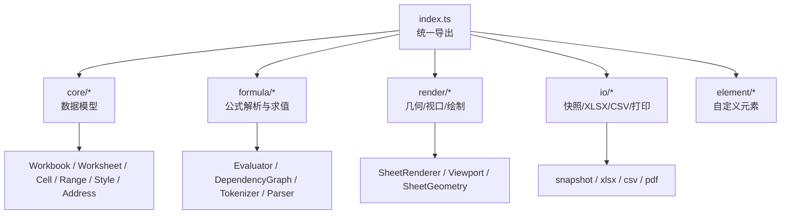
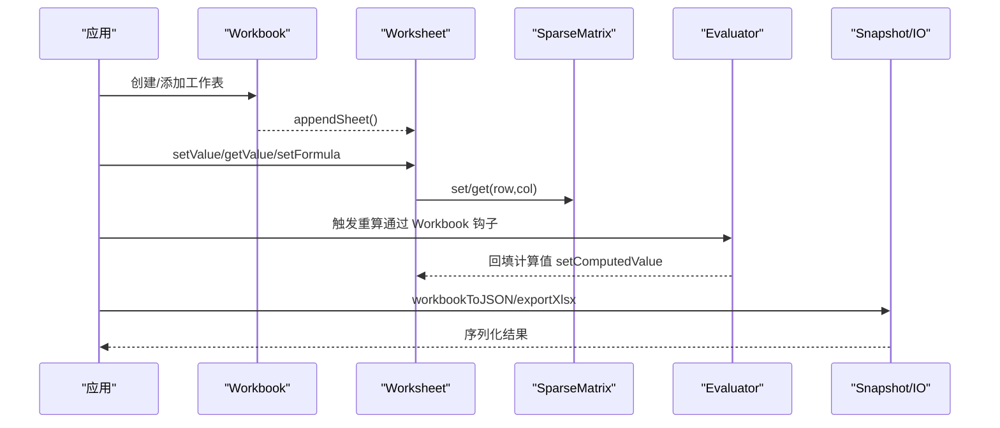
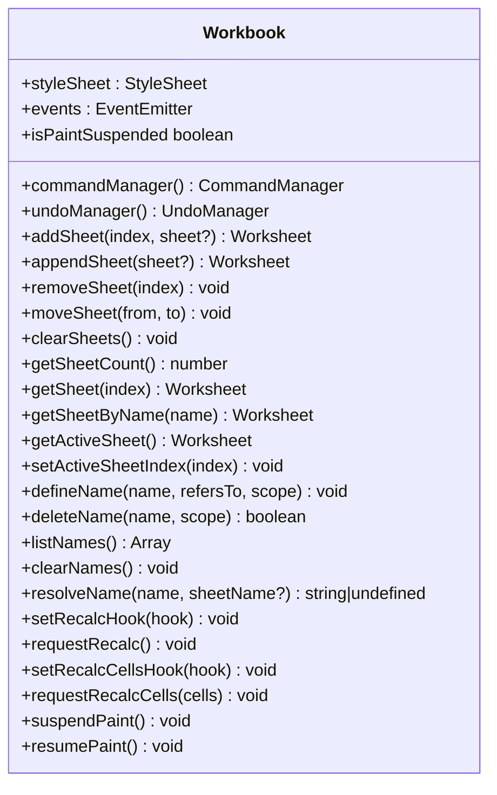
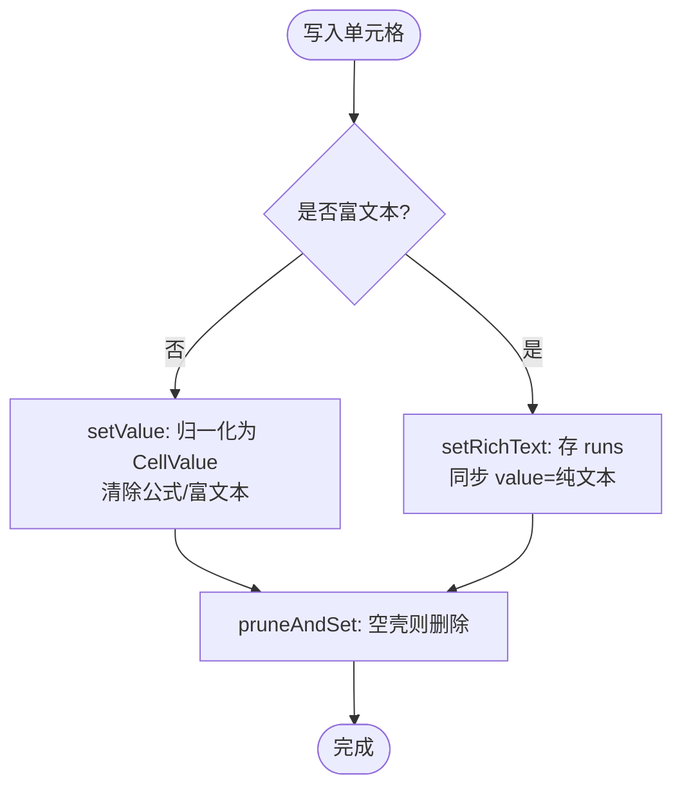
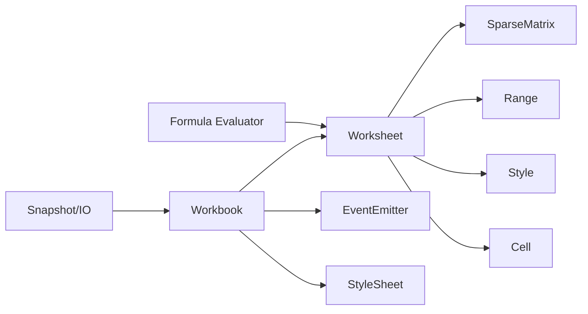

# 核心 API

<cite>
**本文引用的文件**
- [index.ts](file://cmx-mega-sheet/src/index.ts)
- [Workbook.ts](file://cmx-mega-sheet/src/core/Workbook.ts)
- [Worksheet.ts](file://cmx-mega-sheet/src/core/Worksheet.ts)
- [Cell.ts](file://cmx-mega-sheet/src/core/Cell.ts)
- [Range.ts](file://cmx-mega-sheet/src/core/Range.ts)
- [Style.ts](file://cmx-mega-sheet/src/core/Style.ts)
- [EventEmitter.ts](file://cmx-mega-sheet/src/core/EventEmitter.ts)
- [SparseMatrix.ts](file://cmx-mega-sheet/src/core/SparseMatrix.ts)
- [address.ts](file://cmx-mega-sheet/src/core/address.ts)
- [Evaluator.ts](file://cmx-mega-sheet/src/formula/Evaluator.ts)
- [snapshot.ts](file://cmx-mega-sheet/src/io/snapshot.ts)
- [spec-m0.js](file://cmx-mega-sheet/demo/specs/spec-m0.js)
- [Workbook.test.ts](file://cmx-mega-sheet/test/Workbook.test.ts)
</cite>

## 目录
1. [简介](#简介)
2. [项目结构](#项目结构)
3. [核心组件](#核心组件)
4. [架构总览](#架构总览)
5. [详细组件分析](#详细组件分析)
6. [依赖关系分析](#依赖关系分析)
7. [性能考量](#性能考量)
8. [故障排查指南](#故障排查指南)
9. [结论](#结论)
10. [附录：常用操作示例与迁移建议](#附录：常用操作示例与迁移建议)

## 简介
本文件为电子表格引擎的核心 API 文档，聚焦 Workbook、Worksheet、Cell、Range 等核心类的构造函数参数、方法签名与属性配置；系统说明工作簿创建工作表、单元格读写、范围计算、数据绑定机制；并给出类型定义、错误处理与性能优化建议。文末提供批量导入、公式计算、样式设置等常见模式的参考路径与版本兼容性说明。

## 项目结构
该引擎采用分层模块化设计，核心数据模型位于 core 层（无渲染、无 DOM），后续里程碑逐步叠加 render、formula、io、element 能力。公共入口统一从 index.ts 导出，便于上层按需引入。

图表来源
- [index.ts:1-298](file://cmx-mega-sheet/src/index.ts#L1-L298)

章节来源
- [index.ts:1-298](file://cmx-mega-sheet/src/index.ts#L1-L298)

## 核心组件
- Workbook：工作簿容器，管理多张工作表、活动表、事件、命令与撤销、命名区域、重算钩子。
- Worksheet：工作表数据模型，承载单元格值/公式/样式、合并区、行列结构与元数据、筛选/验证/条件格式/批注/浮动对象/迷你图/页面设置/保护等。
- Cell：单元格数据记录（value/formula/style/rich）及工具函数（toCellValue、normalizeFormula、sanitizeImportedFormula）。
- Range：不可变矩形区域对象，提供包含/相交/交集/包围并/平移/遍历等代数运算。
- Style：样式体系与级联解析（单元格 > 行默认 > 列默认 > sheet 默认），支持命名样式表 StyleSheet。
- EventEmitter：类型化事件总线，用于工作簿级事件派发。
- SparseMatrix：稀疏二维存储，支撑行列增删时的坐标搬移。
- address：A1 地址与行列索引互转、区域字符串解析。
- Evaluator：公式 AST 求值器，通过 CellAccessor 抽象访问单元格/区域值，支持命名解析与上下文敏感函数。

章节来源
- [Workbook.ts:174-397](file://cmx-mega-sheet/src/core/Workbook.ts#L174-L397)
- [Worksheet.ts:435-800](file://cmx-mega-sheet/src/core/Worksheet.ts#L435-L800)
- [Cell.ts:14-74](file://cmx-mega-sheet/src/core/Cell.ts#L14-L74)
- [Range.ts:16-166](file://cmx-mega-sheet/src/core/Range.ts#L16-L166)
- [Style.ts:63-234](file://cmx-mega-sheet/src/core/Style.ts#L63-L234)
- [EventEmitter.ts:13-60](file://cmx-mega-sheet/src/core/EventEmitter.ts#L13-L60)
- [SparseMatrix.ts:12-175](file://cmx-mega-sheet/src/core/SparseMatrix.ts#L12-L175)
- [address.ts:14-112](file://cmx-mega-sheet/src/core/address.ts#L14-L112)
- [Evaluator.ts:21-199](file://cmx-mega-sheet/src/formula/Evaluator.ts#L21-L199)

## 架构总览
核心数据流围绕“工作簿—工作表—单元格”展开，配合 Range 进行区域操作，Style 提供样式级联，EventEmitter 驱动事件，Evaluator 负责公式求值，IO 层负责持久化与交换。

图表来源
- [Workbook.ts:263-397](file://cmx-mega-sheet/src/core/Workbook.ts#L263-L397)
- [Worksheet.ts:530-631](file://cmx-mega-sheet/src/core/Worksheet.ts#L530-L631)
- [Evaluator.ts:59-158](file://cmx-mega-sheet/src/formula/Evaluator.ts#L59-L158)
- [snapshot.ts:112-188](file://cmx-mega-sheet/src/io/snapshot.ts#L112-L188)

## 详细组件分析

### Workbook 工作簿
- 构造参数
  - opts.sheetCount：初始工作表数量（默认 1）。
- 关键属性与方法
  - styleSheet：共享命名样式表（StyleSheet）。
  - events：事件总线（bind/unbind）。
  - commandManager()/undoManager()：命令与撤销管理器。
  - addSheet(index, sheet?) / appendSheet(sheet?) / removeSheet(index) / moveSheet(from,to) / clearSheets()：工作表集合管理。
  - getSheetCount()/getSheet(index)/getSheetByName(name)/getActiveSheet()/setActiveSheetIndex(index)：查询与切换活动表。
  - defineName/deleteName/listNames/clearNames/resolveName(name, sheetName?)：命名区域（M8）。
  - setRecalcHook()/requestRecalc()：全量重算钩子（M3+）。
  - setRecalcCellsHook()/requestRecalcCells(cells)：增量重算（M16）。
  - suspendPaint()/resumePaint()/isPaintSuspended：绘制抑制计数（M0 惰性开关）。
- 事件
  - ActiveSheetChanged、SheetAdded、SheetRemoved。

图表来源
- [Workbook.ts:174-397](file://cmx-mega-sheet/src/core/Workbook.ts#L174-L397)

章节来源
- [Workbook.ts:174-397](file://cmx-mega-sheet/src/core/Workbook.ts#L174-L397)
- [Workbook.test.ts:1-200](file://cmx-mega-sheet/test/Workbook.test.ts#L1-L200)

### Worksheet 工作表
- 构造参数
  - name：工作表名。
  - opts.rowCount/colCount：行列数（默认 40×12）。
  - opts.styleSheet：可传入共享样式表。
- 关键属性与方法
  - 名称：name(v?)。
  - 结构：getRowCount()/getColumnCount()/setRowCount(n)/setColumnCount(n)。
  - 单元格：getValue(row,col)/setValue(row,col,value)、getFormula/setFormula、getRichText/setRichText、setComputedValue(row,col,value)、getStyle/setStyle、getResolvedStyle(row,col)。
  - 链式句柄：getCell(r,c).value()/formula()/style(patch)、getRange(r,c,h,w)。
  - 合并：addSpan/removeSpan/getSpan/getSpans/expandRangeToSpans(range)。
  - 行列元数据：getRowHeight/setRowHeight、getColumnWidth/setColumnWidth、isRowVisible/setRowVisible、isColumnVisible/setColumnVisible、applyOutlineVisibility()。
  - 大纲：rowOutlines/columnOutlines（OutlineAxis）。
  - 自动筛选：autoFilter（M11）、applyFilterVisibility()。
  - 数据验证：_validations（M12）。
  - 超链接：_hyperlinks（M12）。
  - 条件格式：_conditionalRules（M13）。
  - 批注：_comments（M14）。
  - 浮动对象：_floatingObjects（M14）。
  - 迷你图：_sparklines（M21）。
  - 页面设置：pageSetup（M15）。
  - 保护：protection（M20）、isProtected()/isCellLocked()/canEditCell()/rangeHasLocked()。
  - 选区：selections、activeRow/activeCol（内部维护）。
- 可见性合并
  - 手动隐藏、大纲折叠隐藏、筛选隐藏分别记账，避免互相覆盖。

图表来源
- [Worksheet.ts:530-631](file://cmx-mega-sheet/src/core/Worksheet.ts#L530-L631)
- [Cell.ts:38-74](file://cmx-mega-sheet/src/core/Cell.ts#L38-L74)

章节来源
- [Worksheet.ts:435-800](file://cmx-mega-sheet/src/core/Worksheet.ts#L435-L800)

### Cell 单元格数据
- 类型
  - CellValue：string | number | boolean | null。
  - RichRun/RichText：富文本片段与序列。
  - CellData：value/formula/style/rich。
- 工具函数
  - toCellValue(v)：规范化输入。
  - normalizeFormula(f)：去前导 '=' 并 trim。
  - sanitizeImportedFormula(f)：清洗导入的 Excel 伪前缀（@、_xlfn._xlws.）。

章节来源
- [Cell.ts:14-74](file://cmx-mega-sheet/src/core/Cell.ts#L14-L74)

### Range 区域
- 不可变矩形，0-based 闭区间表示。
- 构造：new Range(row, col, rowCount?, colCount?)。
- 静态工厂：fromCoord/fromCorners/fromA1。
- 方法：lastRow/lastCol、area、isSingleCell、containsCell/containsRange/intersects/intersect/boundingUnion/equals/translate/forEachCell/cells/toA1/toCoord。

章节来源
- [Range.ts:16-166](file://cmx-mega-sheet/src/core/Range.ts#L16-L166)

### Style 样式与级联
- 样式键：字体、对齐、边框、填充、数字格式、锁定等。
- 命名样式表 StyleSheet：define/get/remove/names/expand/toJSON/fromJSON。
- 级联解析 resolveStyle(sheet, layers)：按优先级合并（单元格 > 行默认 > 列默认 > sheet 默认）。
- mergeStyle：浅合并，borders 深合并。

章节来源
- [Style.ts:63-234](file://cmx-mega-sheet/src/core/Style.ts#L63-L234)

### 事件系统
- EventEmitter<TSender, EventMap>：类型化事件总线，bind/unbind/emit/unbindAll/hasListeners。
- 工作簿事件：ActiveSheetChanged、SheetAdded、SheetRemoved。

章节来源
- [EventEmitter.ts:13-60](file://cmx-mega-sheet/src/core/EventEmitter.ts#L13-L60)
- [Workbook.ts:174-397](file://cmx-mega-sheet/src/core/Workbook.ts#L174-L397)

### 稀疏矩阵
- SparseMatrix<T>：仅存储非空槽位，键为 "row,col"。
- 关键操作：insertRows/deleteRows/insertColumns/deleteColumns 会移动受影响的槽位，保证数据一致性。

章节来源
- [SparseMatrix.ts:12-175](file://cmx-mega-sheet/src/core/SparseMatrix.ts#L12-L175)

### 地址与区域
- address.ts：colToLabel/labelToCol、parseAddr/formatAddr、parseRange/formatRange。
- 约定：行列索引 0-based，A1 引用行号 1-based。

章节来源
- [address.ts:14-112](file://cmx-mega-sheet/src/core/address.ts#L14-L112)

### 公式求值
- Evaluator：AST 求值，支持标量/区域/数组字面量/一元/二元/函数调用。
- CellAccessor：抽象单元格/区域取值与命名解析。
- EvalContext：当前所在格与 sheetName。
- flattenArg/flattenArgs/scalarArg/firstError：实参处理工具。

章节来源
- [Evaluator.ts:21-199](file://cmx-mega-sheet/src/formula/Evaluator.ts#L21-L199)

## 依赖关系分析
- Workbook 依赖 Worksheet、EventEmitter、StyleSheet，并通过钩子与 FormulaEngine 解耦。
- Worksheet 依赖 SparseMatrix、Range、Style、Cell 工具函数与 address。
- 公式层通过 Evaluator 与 Worksheet 的 CellAccessor 交互，避免循环依赖。
- IO 层 snapshot 将 Worksheet/Workbook 状态序列化为中性 JSON，支持跨版本迁移。

图表来源
- [Workbook.ts:174-397](file://cmx-mega-sheet/src/core/Workbook.ts#L174-L397)
- [Worksheet.ts:435-800](file://cmx-mega-sheet/src/core/Worksheet.ts#L435-L800)
- [Evaluator.ts:59-158](file://cmx-mega-sheet/src/formula/Evaluator.ts#L59-L158)
- [snapshot.ts:112-188](file://cmx-mega-sheet/src/io/snapshot.ts#L112-L188)

章节来源
- [Workbook.ts:174-397](file://cmx-mega-sheet/src/core/Workbook.ts#L174-L397)
- [Worksheet.ts:435-800](file://cmx-mega-sheet/src/core/Worksheet.ts#L435-L800)
- [Evaluator.ts:59-158](file://cmx-mega-sheet/src/formula/Evaluator.ts#L59-L158)
- [snapshot.ts:112-188](file://cmx-mega-sheet/src/io/snapshot.ts#L112-L188)

## 性能考量
- 使用稀疏存储：大量空格不占用内存，行列增删时批量移动槽位，避免 O(N^2) 拷贝。
- 样式级联缓存：在 Worksheet 层按需解析最终样式，减少重复计算。
- 增量重算：通过 requestRecalcCells 仅重算受影响单元格，降低大数据量下的重算成本。
- 批量操作：优先使用 CellRange 批量赋值/样式，减少多次单格调用开销。
- 绘制抑制：大批量编辑前 suspendPaint，完成后 resumePaint，减少 UI 刷新。
- 导入清洗：使用 sanitizeImportedFormula 清理 Excel 伪前缀，避免额外解析失败与重试。

[本节为通用性能建议，不直接分析具体文件]

## 故障排查指南
- 公式错误
  - #NAME?：函数未注册或命名区域未解析。检查 FunctionRegistry 与 resolveNameRef。
  - #DIV/0!：除零。确保分母校验。
  - #VALUE!：类型不匹配或函数抛错。检查参数类型与实现。
- 单元格值异常
  - 设值后公式丢失：setValue 会覆盖公式，如需保留公式请使用 setComputedValue 回填计算值。
  - 富文本与公式互斥：setRichText 会清除 formula。
- 样式未生效
  - 确认级联顺序：单元格 > 行默认 > 列默认 > sheet 默认。
  - 命名样式未展开：ensure styleName 已定义且被正确展开。
- 筛选/大纲隐藏冲突
  - 使用 applyFilterVisibility 与 applyOutlineVisibility 分别刷新，避免覆盖用户手动隐藏。
- 撤销/重做
  - 确保命令实现了 canUndo/undo，或通过 CommandManager 包装。

章节来源
- [Evaluator.ts:116-158](file://cmx-mega-sheet/src/formula/Evaluator.ts#L116-L158)
- [Worksheet.ts:530-631](file://cmx-mega-sheet/src/core/Worksheet.ts#L530-L631)
- [Style.ts:218-234](file://cmx-mega-sheet/src/core/Style.ts#L218-L234)
- [Workbook.ts:125-172](file://cmx-mega-sheet/src/core/Workbook.ts#L125-L172)

## 结论
本引擎以清晰的层次划分与类型安全为核心，提供了完整的工作簿/工作表/单元格/区域管理能力，结合样式级联、公式求值、IO 快照与事件系统，满足企业级电子表格场景。通过稀疏存储、增量重算与批量操作等手段，兼顾了性能与可扩展性。

[本节为总结性内容，不直接分析具体文件]

## 附录：常用操作示例与迁移建议

### 常用操作模式（参考路径）
- 批量数据导入
  - 参考：[spec-m0.js:15-38](file://cmx-mega-sheet/demo/specs/spec-m0.js#L15-L38)
  - 要点：创建 Worksheet，设置行列宽，使用 CellRange.value/formula 批量写入，必要时合并 span。
- 公式计算
  - 参考：[Evaluator.ts:59-158](file://cmx-mega-sheet/src/formula/Evaluator.ts#L59-L158)
  - 要点：通过 Workbook.setRecalcHook/requestRecalc 或 requestRecalcCells 触发重算，Evaluator 将结果回填至 Worksheet。
- 样式设置
  - 参考：[Style.ts:123-234](file://cmx-mega-sheet/src/core/Style.ts#L123-L234)
  - 要点：使用 StyleSheet 定义命名样式，通过 CellRange.style 叠加样式，getResolvedStyle 获取最终样式。
- 工作簿与工作表管理
  - 参考：[Workbook.test.ts:5-94](file://cmx-mega-sheet/test/Workbook.test.ts#L5-L94)
  - 要点：addSheet/appendSheet/removeSheet/moveSheet 管理表集合，setActiveSheetIndex 切换活动表。
- 快照与持久化
  - 参考：[snapshot.ts:112-188](file://cmx-mega-sheet/src/io/snapshot.ts#L112-L188)
  - 要点：sheetToJSON/workbookToJSON 序列化，workbookFromJSON/sheetFromJSON 反序列化，保持中性与稀疏。

### 类型定义速查
- CellValue：string | number | boolean | null
- CellData：{ value?, formula?, style?, rich? }
- Range：{ row, col, rowCount, colCount }
- StyleProps：字体/对齐/边框/填充/格式/锁定等
- Worksheet 扩展：AutoFilterState、DataValidation、ConditionalRule、CellComment、FloatingObject、Sparkline、PageSetup、SheetProtection

### 错误处理建议
- 公式层：捕获 #NAME?/#VALUE!/#DIV/0! 等错误，向上返回给渲染层提示。
- 单元格写入：对非法值进行 toCellValue 规范化；富文本与公式互斥需明确语义。
- 样式合并：borders 深合并，避免覆盖未设置的边。

### 版本兼容性与废弃 API 迁移
- 快照版本：SNAPSHOT_VERSION 用于向后兼容迁移（fromJSON 根据版本迁移）。
- 导入公式清洗：sanitizeImportedFormula 去除 @ 与 _xlfn./_xlws. 前缀，避免旧 Excel 序列化差异导致 #NAME?。
- 命名区域：scope='workbook' 与 sheet 级同名时，sheet 级优先；迁移时需确保作用域一致。
- 保护态：locked 默认锁定，仅在 sheet 保护启用时生效；迁移时注意 locked 与 protection.enabled 的组合。

章节来源
- [snapshot.ts:18-21](file://cmx-mega-sheet/src/io/snapshot.ts#L18-L21)
- [Cell.ts:57-74](file://cmx-mega-sheet/src/core/Cell.ts#L57-L74)
- [Workbook.ts:185-229](file://cmx-mega-sheet/src/core/Workbook.ts#L185-L229)
- [Worksheet.ts:633-661](file://cmx-mega-sheet/src/core/Worksheet.ts#L633-L661)