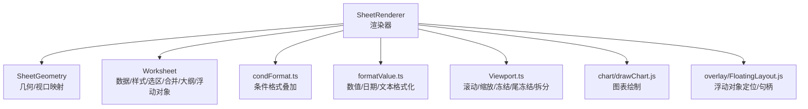
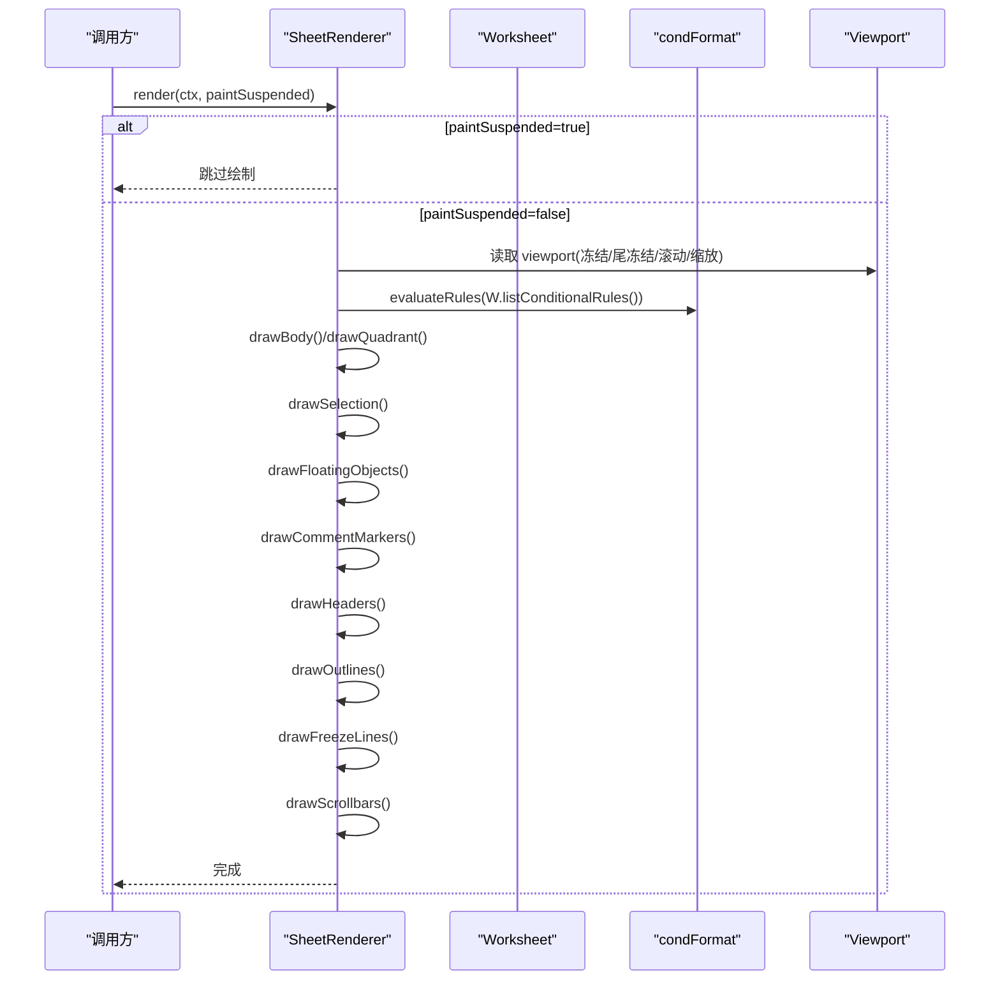
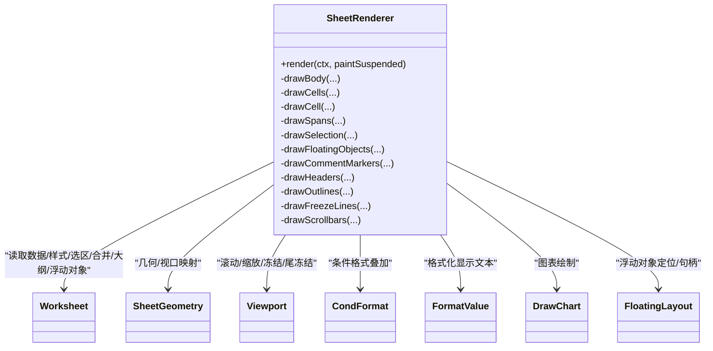

# SheetRenderer 渲染器

<cite>
**本文引用的文件**
- [SheetRenderer.ts](file://cmx-mega-sheet/src/render/SheetRenderer.ts)
- [condFormat.ts](file://cmx-mega-sheet/src/render/condFormat.ts)
- [formatValue.ts](file://cmx-mega-sheet/src/render/formatValue.ts)
- [Viewport.ts](file://cmx-mega-sheet/src/render/Viewport.ts)
- [Worksheet.ts](file://cmx-mega-sheet/src/core/Worksheet.ts)
- [SheetRenderer.test.ts](file://cmx-mega-sheet/test/SheetRenderer.test.ts)
</cite>

## 目录
1. [简介](#简介)
2. [项目结构](#项目结构)
3. [核心组件](#核心组件)
4. [架构总览](#架构总览)
5. [详细组件分析](#详细组件分析)
6. [依赖关系分析](#依赖关系分析)
7. [性能与优化建议](#性能与优化建议)
8. [故障排查指南](#故障排查指南)
9. [结论](#结论)
10. [附录](#附录)

## 简介
本文件为 SheetRenderer 类的权威 API 文档，聚焦其在 Canvas 上的可见区域绘制能力。内容涵盖：网格线、行列头、单元格内容与样式、合并单元格、选区显示、条件格式叠加、浮动对象（图片/图表/形状）、批注标记、冻结/尾冻结分界线、滚动条等。同时解释 render() 的渲染流程、paintSuspended 参数的作用、主题配置 LIGHT_THEME/DARK_THEME，以及跨浏览器兼容性与性能优化实践。

## 项目结构
SheetRenderer 位于渲染层，围绕“薄绘制”的职责：仅负责把可见区域画出来，几何由 SheetGeometry 提供，值与样式来自 Worksheet。相关关键文件：
- SheetRenderer.ts：Canvas 绘制主类，定义 RenderContext2D 最小接口、主题常量、渲染管线。
- condFormat.ts：条件格式引擎，计算每格叠加结果（样式/数据条/图标集/色阶）。
- formatValue.ts：单元格显示值格式化入口，委托 numFmt 引擎。
- Viewport.ts：视口状态（滚动、缩放、行列头尺寸、冻结/尾冻结、拆分模式）。
- Worksheet.ts：工作表数据模型（值、样式、合并、选区、大纲、浮动对象、图表规格等）。
- SheetRenderer.test.ts：覆盖基础绘制、虚拟化、暂停绘制、合并、选区与主题等行为。

图示来源
- [SheetRenderer.ts:1-229](file://cmx-mega-sheet/src/render/SheetRenderer.ts#L1-L229)
- [condFormat.ts:1-45](file://cmx-mega-sheet/src/render/condFormat.ts#L1-L45)
- [formatValue.ts:1-24](file://cmx-mega-sheet/src/render/formatValue.ts#L1-L24)
- [Viewport.ts:1-178](file://cmx-mega-sheet/src/render/Viewport.ts#L1-L178)
- [Worksheet.ts:145-186](file://cmx-mega-sheet/src/core/Worksheet.ts#L145-L186)

章节来源
- [SheetRenderer.ts:1-229](file://cmx-mega-sheet/src/render/SheetRenderer.ts#L1-L229)
- [Viewport.ts:1-178](file://cmx-mega-sheet/src/render/Viewport.ts#L1-L178)

## 核心组件
- SheetRenderer：渲染器主体，封装 render() 主流程与所有绘制方法；维护 theme/chartTheme、showGridlines/showHeaders/showFillHandle、condOverlays、imageCache、selectedObjectId、scrollbars。
- RenderContext2D：面向 CanvasRenderingContext2D 的最小接口抽象，便于测试与跨环境兼容。
- RenderTheme/LIGHT_THEME/DARK_THEME：渲染主题色板，控制网格线、头部背景/文字、选中高亮、滚动条、冻结线等颜色。
- condFormat.ts：条件格式规则评估，输出每格的 overlay（style/fill/bar/icon）。
- formatValue.ts：将原始值按格式串转为显示文本与可选颜色。
- Viewport：记录滚动、缩放、行列头尺寸、冻结/尾冻结、拆分模式，并生成签名用于缓存失效。
- Worksheet：承载数据、样式、合并、选区、大纲、浮动对象、图表规格等。

章节来源
- [SheetRenderer.ts:35-158](file://cmx-mega-sheet/src/render/SheetRenderer.ts#L35-L158)
- [condFormat.ts:17-45](file://cmx-mega-sheet/src/render/condFormat.ts#L17-L45)
- [formatValue.ts:12-24](file://cmx-mega-sheet/src/render/formatValue.ts#L12-L24)
- [Viewport.ts:16-42](file://cmx-mega-sheet/src/render/Viewport.ts#L16-L42)
- [Worksheet.ts:145-186](file://cmx-mega-sheet/src/core/Worksheet.ts#L145-L186)

## 架构总览
SheetRenderer 的渲染流程以 render(ctx, paintSuspended) 为中心，按以下顺序执行：
1. 若 paintSuspended 为 true，直接返回（批量更新时避免重绘）。
2. 清空背景（theme.sheetBack）。
3. 计算条件格式叠加（evaluateRules），保存至 condOverlays。
4. 根据冻结/尾冻结情况，划分象限并调用 drawQuadrant/drawBody。
5. 绘制选区（drawSelection）。
6. 绘制浮动对象（drawFloatingObjects）与批注标记（drawCommentMarkers）。
7. 绘制行列头（drawHeaders）。
8. 绘制大纲区（drawOutlines）。
9. 绘制冻结/尾冻结分界线（drawFreezeLines）。
10. 绘制滚动条（drawScrollbars）。

图示来源
- [SheetRenderer.ts:165-229](file://cmx-mega-sheet/src/render/SheetRenderer.ts#L165-L229)
- [condFormat.ts:33-45](file://cmx-mega-sheet/src/render/condFormat.ts#L33-L45)
- [Viewport.ts:16-42](file://cmx-mega-sheet/src/render/Viewport.ts#L16-L42)

## 详细组件分析

### render() 方法与 paintSuspended
- 职责：全量重绘可见区域。当 paintSuspended 为 true 时，立即返回，不执行任何绘制，用于批量更新后一次性刷新。
- 关键点：
  - 背景填充：使用 theme.sheetBack 填充整个 viewport。
  - 条件格式：在绘制前计算一次，后续 drawCell 叠加。
  - 象限划分：无冻结时单象限；有冻结/尾冻结时分为最多 3×3=9 个象限，分别 clip 到屏幕矩形，先画滚动区再画冻结区，保证层级正确。
  - 收尾绘制：选区、浮动对象、批注、行列头、大纲、冻结线、滚动条。

章节来源
- [SheetRenderer.ts:165-229](file://cmx-mega-sheet/src/render/SheetRenderer.ts#L165-L229)
- [SheetRenderer.test.ts:114-122](file://cmx-mega-sheet/test/SheetRenderer.test.ts#L114-L122)

### 可见区域绘制与虚拟化
- 通过 SheetGeometry 获取当前可视行列范围（sTop/sBot/sLeft/sRight），仅遍历可见且未隐藏的行列。
- 合并单元格处理：普通单元格遍历时跳过被 span 覆盖的格子；合并区统一在 drawSpans 中用背景覆盖内部网格线，再绘制外框与内容。
- 溢出裁剪：非折行文本可溢入相邻空格，遇到有内容的格即止，避免覆盖邻格文字。

章节来源
- [SheetRenderer.ts:231-256](file://cmx-mega-sheet/src/render/SheetRenderer.ts#L231-L256)
- [SheetRenderer.ts:433-450](file://cmx-mega-sheet/src/render/SheetRenderer.ts#L433-L450)
- [SheetRenderer.ts:640-683](file://cmx-mega-sheet/src/render/SheetRenderer.ts#L640-L683)
- [SheetRenderer.ts:1131-1166](file://cmx-mega-sheet/src/render/SheetRenderer.ts#L1131-L1166)

### 网格线渲染
- 在 drawBody 中优先绘制网格线（最底层），随后绘制单元格背景/边框/文本，确保用户自定义边框永远盖过默认网格线。
- 网格线仅在 showGridlines 为 true 时绘制。

章节来源
- [SheetRenderer.ts:249-256](file://cmx-mega-sheet/src/render/SheetRenderer.ts#L249-L256)
- [SheetRenderer.ts:1106-1129](file://cmx-mega-sheet/src/render/SheetRenderer.ts#L1106-L1129)

### 单元格内容绘制
- 值与样式：从 Worksheet 获取 resolved style 与 value，支持复选框、超链接、富文本、迷你图、数据验证下拉箭头等。
- 文本排版：支持水平/垂直对齐、下划线、删除线、自动换行、shrinkToFit、fill 对齐、缩进、旋转（M18）。
- 条件格式叠加：
  - colorScale：按 min/mid/max 线性插值背景色。
  - dataBar：按比例绘制半透明条。
  - iconSet：左侧绘制图标并让位文本。
  - cellValue：命中则合并 style。
- 结构化填充：backColor/solid/pattern/gradient 均支持，且不依赖浏览器渐变 API，保证 jsdom 桩安全。

章节来源
- [SheetRenderer.ts:452-533](file://cmx-mega-sheet/src/render/SheetRenderer.ts#L452-L533)
- [SheetRenderer.ts:620-780](file://cmx-mega-sheet/src/render/SheetRenderer.ts#L620-L780)
- [SheetRenderer.ts:831-904](file://cmx-mega-sheet/src/render/SheetRenderer.ts#L831-L904)
- [condFormat.ts:33-182](file://cmx-mega-sheet/src/render/condFormat.ts#L33-L182)
- [formatValue.ts:12-24](file://cmx-mega-sheet/src/render/formatValue.ts#L12-L24)

### 合并单元格处理
- 合并区在 drawSpans 中统一绘制：先用 sheetBack 打底覆盖内部网格线，再叠 backColor/结构化填充，最后绘制文本与自定义边框。
- 普通单元格遍历时跳过被 span 覆盖的格子，避免重复绘制。

章节来源
- [SheetRenderer.ts:1131-1166](file://cmx-mega-sheet/src/render/SheetRenderer.ts#L1131-L1166)
- [SheetRenderer.ts:433-450](file://cmx-mega-sheet/src/render/SheetRenderer.ts#L433-L450)

### 选区显示
- 选区扩展到覆盖相交的合并区，绘制统一的选区矩形与半透明填充。
- 最后一个（primary）选区右下角绘制自动填充手柄。
- 行列头对应选中行列高亮。

章节来源
- [SheetRenderer.ts:1168-1191](file://cmx-mega-sheet/src/render/SheetRenderer.ts#L1168-L1191)
- [SheetRenderer.ts:1235-1333](file://cmx-mega-sheet/src/render/SheetRenderer.ts#L1235-L1333)
- [SheetRenderer.test.ts:137-163](file://cmx-mega-sheet/test/SheetRenderer.test.ts#L137-L163)

### 条件格式叠加
- 渲染前计算 evaluateRules，得到 Map<"r,c", overlay>，包含 style/fill/bar/icon。
- drawCell 中按优先级叠加：色阶 fill > backColor solid > 结构化填充；dataBar 在文本之下；iconSet 在左侧并让位文本。

章节来源
- [SheetRenderer.ts:176-179](file://cmx-mega-sheet/src/render/SheetRenderer.ts#L176-L179)
- [SheetRenderer.ts:462-487](file://cmx-mega-sheet/src/render/SheetRenderer.ts#L462-L487)
- [condFormat.ts:33-182](file://cmx-mega-sheet/src/render/condFormat.ts#L33-L182)

### 浮动对象绘制
- 支持图片、图表、形状三类对象，锚定到单元格坐标，随滚动/缩放/冻结跟随移动。
- 图片：优先使用 imageCache 中的 HTMLImageElement；失败回退占位框。
- 图表：构建 ChartData（类别/系列），调用 drawChart 绘制。
- 形状：矩形/椭圆/线，支持填充与描边。
- 选中对象：绘制选框与调整句柄。

章节来源
- [SheetRenderer.ts:319-379](file://cmx-mega-sheet/src/render/SheetRenderer.ts#L319-L379)
- [SheetRenderer.ts:381-405](file://cmx-mega-sheet/src/render/SheetRenderer.ts#L381-L405)
- [Worksheet.ts:167-186](file://cmx-mega-sheet/src/core/Worksheet.ts#L167-L186)

### 批注标记
- 对每个批注所在单元格右上角绘制红色三角标记，仅当该格在可见区或冻结带内才绘制。

章节来源
- [SheetRenderer.ts:407-431](file://cmx-mega-sheet/src/render/SheetRenderer.ts#L407-L431)

### 冻结/尾冻结分界线与拆分条
- 冻结分界线：比网格线更粗/更深；拆分模式下绘制可拖拽的拆分条（浅底带+两侧描边+中部抓握点）。
- 尾冻结线：钉在内容区右/下沿，恒细线。

章节来源
- [SheetRenderer.ts:258-317](file://cmx-mega-sheet/src/render/SheetRenderer.ts#L258-L317)
- [Viewport.ts:30-42](file://cmx-mega-sheet/src/render/Viewport.ts#L30-L42)

### 行列头与筛选箭头
- 列头：背景、分隔线、列标文字、选中高亮、筛选箭头（活动条件高亮）。
- 行头：背景、分隔线、行号文字、选中高亮。
- 角部：行列头交叉处底色与分隔线。

章节来源
- [SheetRenderer.ts:1235-1333](file://cmx-mega-sheet/src/render/SheetRenderer.ts#L1235-L1333)

### 大纲区绘制
- 行/列分组线、折叠按钮（+/−）、角上层级总开关（1/2/3…）。
- 仅当存在分组且大纲带宽>0 时绘制。

章节来源
- [SheetRenderer.ts:1347-1473](file://cmx-mega-sheet/src/render/SheetRenderer.ts#L1347-L1473)

### 滚动条绘制
- 轨道与滑块，双条交汇时填充右下角小方块避免缺口。

章节来源
- [SheetRenderer.ts:1475-1506](file://cmx-mega-sheet/src/render/SheetRenderer.ts#L1475-L1506)

### 主题配置选项（LIGHT_THEME/DARK_THEME）
- 主题色板控制网格线、头部背景/文字、选中高亮、滚动条、冻结线等。
- 可通过 renderer.theme = DARK_THEME 切换深色主题。

章节来源
- [SheetRenderer.ts:70-138](file://cmx-mega-sheet/src/render/SheetRenderer.ts#L70-L138)
- [SheetRenderer.test.ts:146-152](file://cmx-mega-sheet/test/SheetRenderer.test.ts#L146-L152)

## 依赖关系分析
- SheetRenderer 依赖：
  - Worksheet：读取值、样式、合并、选区、大纲、浮动对象、图表规格。
  - SheetGeometry/Viewport：计算可见区域、冻结/尾冻结、缩放、偏移。
  - condFormat.ts：条件格式叠加。
  - formatValue.ts：格式化显示文本。
  - chart/drawChart.js：图表绘制。
  - overlay/FloatingLayout.js：浮动对象定位与句柄。
- 耦合与内聚：
  - 渲染逻辑集中在 SheetRenderer，职责单一，内聚度高。
  - 通过 RenderContext2D 最小接口降低对具体 Canvas 实现的耦合，利于测试与跨环境。

图示来源
- [SheetRenderer.ts:1-229](file://cmx-mega-sheet/src/render/SheetRenderer.ts#L1-L229)
- [condFormat.ts:1-45](file://cmx-mega-sheet/src/render/condFormat.ts#L1-L45)
- [formatValue.ts:1-24](file://cmx-mega-sheet/src/render/formatValue.ts#L1-L24)
- [Viewport.ts:1-178](file://cmx-mega-sheet/src/render/Viewport.ts#L1-L178)
- [Worksheet.ts:145-186](file://cmx-mega-sheet/src/core/Worksheet.ts#L145-L186)

章节来源
- [SheetRenderer.ts:1-229](file://cmx-mega-sheet/src/render/SheetRenderer.ts#L1-L229)

## 性能与优化建议
- 使用 paintSuspended：批量更新数据时传入 paintSuspended=true，避免多次重绘，待全部更新完成后一次性渲染。
- 视口虚拟化：仅绘制可见行列，避免全表扫描；合并区跳过覆盖格，减少冗余绘制。
- 条件格式预计算：在 render 开始时计算一次 condOverlays，避免重复评估。
- 文本测量与换行：wrapText 采用贪心断词与硬切策略，避免过多 measureText 开销；必要时限制最大扩展方向（溢出裁剪最多各方向 32 格）。
- 结构化填充与渐变：使用手写分带插值替代 createLinearGradient，提升兼容性并减少复杂路径开销。
- 图片缓存：imageCache 复用 HTMLImageElement，避免重复解码与绘制失败回退。
- 冻结/尾冻结象限绘制：clip 到屏幕矩形，防止越界绘制；先滚动区后冻结区，减少重绘次数。
- 主题与字体：统一 DEFAULT_FONT_PX/FAMILY，缩放时按 zoom 调整字号，减少布局抖动。

[本节为通用指导，无需特定文件引用]

## 故障排查指南
- 现象：渲染空白或不显示内容
  - 检查 paintSuspended 是否为 true，导致跳过绘制。
  - 确认 viewport.width/height 与 leftOffset/topOffset 是否正确设置。
- 现象：网格线/边框不显示
  - 确认 showGridlines 与 borders 配置；注意自定义边框会覆盖默认网格线。
- 现象：条件格式不生效
  - 检查 evaluateRules 是否返回 overlay；确认 range 与 operator/colors/barColor/iconSet 配置。
- 现象：浮动对象位置异常
  - 检查 anchor.fromRow/fromCol/toRow/toCol 与 getCellRect 映射；确认 imageCache 注入。
- 现象：批注标记不出现
  - 确认批注所在格在可见区或冻结带内；检查 commentMarker 计算。
- 现象：冻结/尾冻结线错位
  - 检查 frozenRows/frozenCols/trailingRows/trailingCols 与 splitRow/splitCol 状态。

章节来源
- [SheetRenderer.ts:165-229](file://cmx-mega-sheet/src/render/SheetRenderer.ts#L165-L229)
- [SheetRenderer.ts:319-431](file://cmx-mega-sheet/src/render/SheetRenderer.ts#L319-L431)
- [SheetRenderer.ts:1106-1166](file://cmx-mega-sheet/src/render/SheetRenderer.ts#L1106-L1166)
- [condFormat.ts:33-182](file://cmx-mega-sheet/src/render/condFormat.ts#L33-L182)

## 结论
SheetRenderer 以“薄绘制”为核心，结合 SheetGeometry/Viewport 实现高效的可见区域渲染，并通过条件格式、浮动对象、批注、冻结/尾冻结、大纲与滚动条等功能完善用户体验。其设计强调跨环境兼容（RenderContext2D 最小接口）、可测试性（录制型 mock）与性能优化（虚拟化、象限 clip、预计算）。遵循本文档的最佳实践，可在不同浏览器与 Node 环境下稳定高效地渲染大型表格。

[本节为总结，无需特定文件引用]

## 附录

### Canvas 上下文使用最佳实践
- 始终使用 ctx.save()/restore() 保护状态变更（font、lineWidth、globalAlpha、变换矩阵）。
- 绘制前清理或设置必要状态（如 setLineDash([]) 复原实线）。
- 使用 clip 限制绘制区域，避免越界影响其他象限。
- 对于不支持的方法（如 setLineDash、translate/rotate、drawImage），做降级处理以保证兼容性。

章节来源
- [SheetRenderer.ts:931-994](file://cmx-mega-sheet/src/render/SheetRenderer.ts#L931-L994)
- [SheetRenderer.ts:692-707](file://cmx-mega-sheet/src/render/SheetRenderer.ts#L692-L707)
- [SheetRenderer.ts:342-352](file://cmx-mega-sheet/src/render/SheetRenderer.ts#L342-L352)

### 跨浏览器兼容性指南
- 使用 RenderContext2D 最小接口，屏蔽浏览器差异。
- 对可选能力进行运行时检测（setLineDash、translate/rotate、drawImage），并提供退化方案。
- 避免依赖浏览器特定的 Canvas API（如 createLinearGradient），改用分带插值实现渐变。
- 字体与度量：使用标准 font 字符串与 measureText，注意不同平台下的度量差异。

章节来源
- [SheetRenderer.ts:35-68](file://cmx-mega-sheet/src/render/SheetRenderer.ts#L35-L68)
- [SheetRenderer.ts:1066-1104](file://cmx-mega-sheet/src/render/SheetRenderer.ts#L1066-L1104)