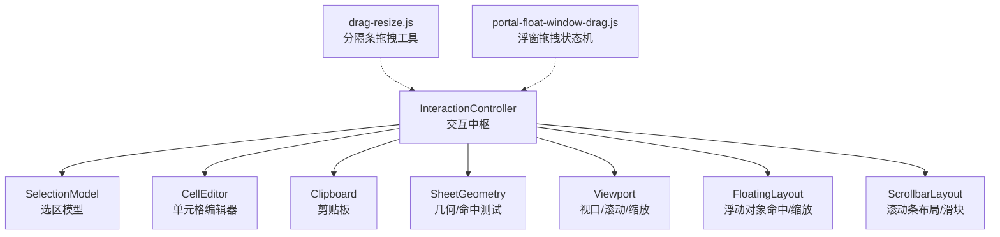
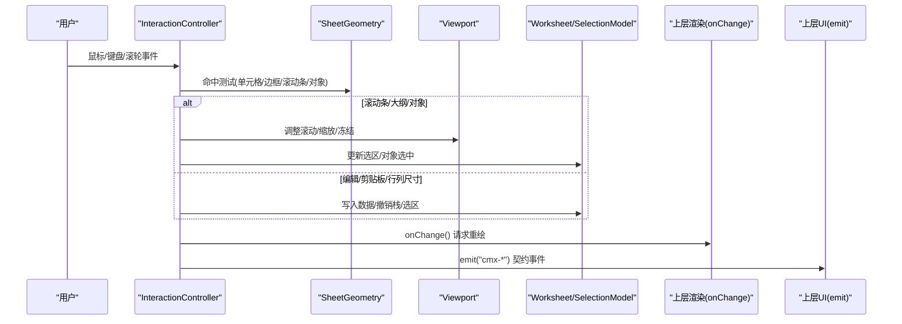
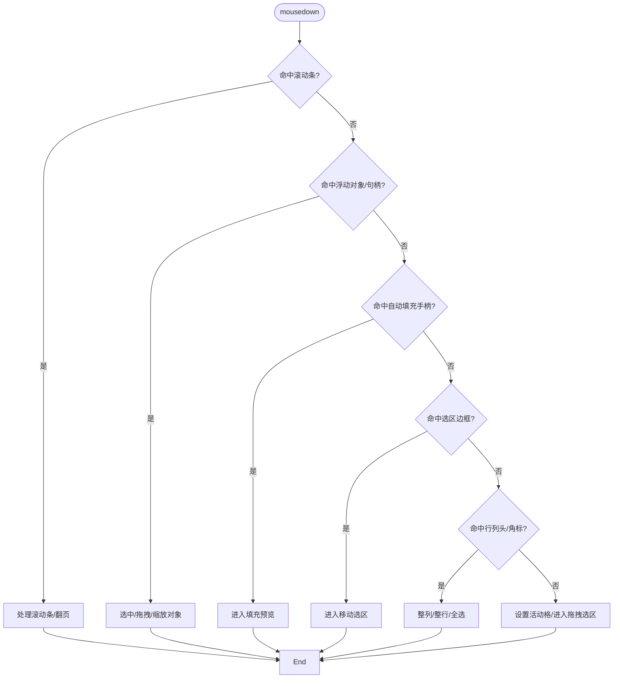
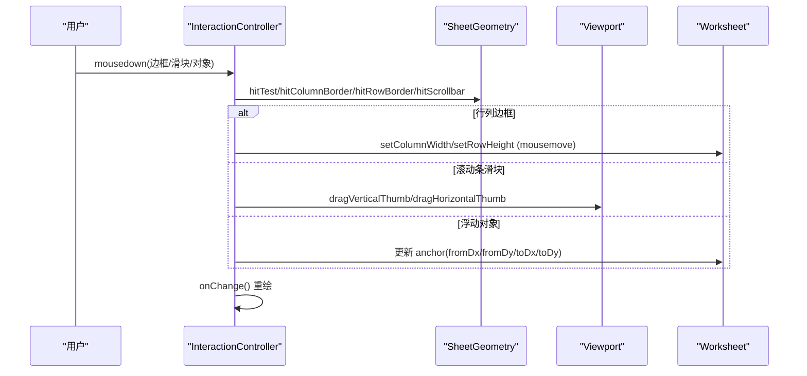
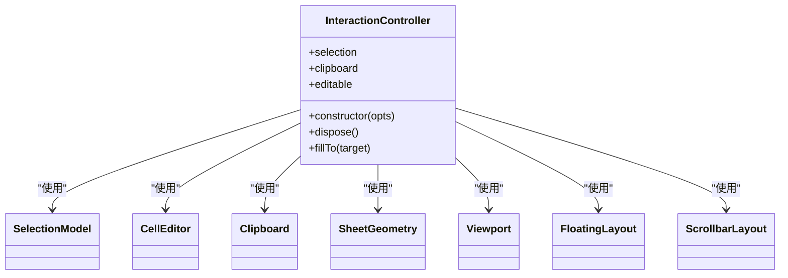

# 交互控制器

<cite>
**本文引用的文件**
- [InteractionController.ts](file://cmx-mega-sheet/src/render/InteractionController.ts)
- [InteractionController.test.ts](file://cmx-mega-sheet/test/InteractionController.test.ts)
- [FloatingLayout.ts](file://cmx-mega-sheet/src/render/overlay/FloatingLayout.ts)
- [ScrollbarLayout.ts](file://cmx-mega-sheet/src/render/ScrollbarLayout.ts)
- [drag-resize.js](file://CMXHTMLDesigner/src/utils/drag-resize.js)
- [portal-float-window-drag.js](file://CMXPortalManager/src/lib/portal-float-window-drag.js)
</cite>

## 目录
1. [简介](#简介)
2. [项目结构](#项目结构)
3. [核心组件](#核心组件)
4. [架构总览](#架构总览)
5. [详细组件分析](#详细组件分析)
6. [依赖关系分析](#依赖关系分析)
7. [性能考量](#性能考量)
8. [故障排查指南](#故障排查指南)
9. [结论](#结论)
10. [附录](#附录)

## 简介
本文件为“交互控制器”的权威 API 与实现说明，聚焦以下目标：
- 用户输入事件处理机制（鼠标、键盘、滚轮）
- 手势识别与处理（拖拽、缩放、双击、选择模式切换）
- 事件冒泡与默认行为控制、自定义事件触发
- 交互配置选项、事件监听方法、调试工具与性能优化建议

该控制器将 DOM 事件统一翻译为模型操作（选区、编辑、剪贴板、滚动/缩放），并对外派发契约事件，便于上层 UI 渲染与业务集成。

## 项目结构
围绕交互能力的相关代码主要分布在以下位置：
- 表格交互中枢：InteractionController（鼠标/键盘/滚轮/拖拽/缩放/编辑/剪贴板/对象交互）
- 浮动对象命中与缩放句柄：FloatingLayout（对象矩形计算、句柄命中）
- 滚动条布局与滑块换算：ScrollbarLayout（滑块尺寸、轨道点击翻页、滑块位移到滚动值换算）
- 通用拖拽分隔条工具：drag-resize.js（水平/垂直拖拽绑定、clamp）
- 浮窗拖拽状态机：portal-float-window-drag.js（开始/更新/结束拖拽，区分移动与点击）

图表来源
- [InteractionController.ts:1-172](file://cmx-mega-sheet/src/render/InteractionController.ts#L1-L172)
- [FloatingLayout.ts:28-56](file://cmx-mega-sheet/src/render/overlay/FloatingLayout.ts#L28-L56)
- [ScrollbarLayout.ts:90-167](file://cmx-mega-sheet/src/render/ScrollbarLayout.ts#L90-L167)
- [drag-resize.js:1-66](file://CMXHTMLDesigner/src/utils/drag-resize.js#L1-L66)
- [portal-float-window-drag.js:1-59](file://CMXPortalManager/src/lib/portal-float-window-drag.js#L1-L59)

章节来源
- [InteractionController.ts:1-172](file://cmx-mega-sheet/src/render/InteractionController.ts#L1-L172)

## 核心组件
- InteractionController：事件绑定与分发、选区/编辑/剪贴板/滚动/缩放/对象交互的统一入口
- SelectionModel：选区数据结构与操作（单选、多选、扩展、全选、跳转）
- CellEditor：单元格内联编辑、提交/取消、定位重绘
- Clipboard：内部 TSV/HTML 序列化与解析，系统剪贴板互通
- SheetGeometry：坐标转换、命中测试（单元格、行列头、边框、滚动条、拆分条、筛选箭头等）
- Viewport：视口尺寸、滚动位置、缩放比例、冻结行列、结构变更通知
- FloatingLayout：浮动对象矩形计算、8 个缩放句柄命中
- ScrollbarLayout：滚动条轨道/滑块布局、滑块拖拽到滚动值换算
- drag-resize.js：通用分隔条拖拽绑定与 clamp
- portal-float-window-drag.js：浮窗拖拽状态机（开始/更新/结束）

章节来源
- [InteractionController.ts:59-146](file://cmx-mega-sheet/src/render/InteractionController.ts#L59-L146)
- [FloatingLayout.ts:28-56](file://cmx-mega-sheet/src/render/overlay/FloatingLayout.ts#L28-L56)
- [ScrollbarLayout.ts:90-167](file://cmx-mega-sheet/src/render/ScrollbarLayout.ts#L90-L167)
- [drag-resize.js:1-66](file://CMXHTMLDesigner/src/utils/drag-resize.js#L1-L66)
- [portal-float-window-drag.js:1-59](file://CMXPortalManager/src/lib/portal-float-window-drag.js#L1-L59)

## 架构总览
交互控制器作为“事件→模型→视图”的中枢，负责：
- 事件捕获与优先级判定（滚动条 > 大纲按钮 > 浮动对象 > 自动填充/移动选区 > 行列头/角标 > 单元格）
- 将事件转换为模型变更（选区、编辑、剪贴板、滚动/缩放、行列尺寸、对象锚点）
- 通过回调请求重绘，并通过 emit 派发契约事件给上层 UI

图表来源
- [InteractionController.ts:148-172](file://cmx-mega-sheet/src/render/InteractionController.ts#L148-L172)
- [InteractionController.ts:188-357](file://cmx-mega-sheet/src/render/InteractionController.ts#L188-L357)
- [InteractionController.ts:738-753](file://cmx-mega-sheet/src/render/InteractionController.ts#L738-L753)

## 详细组件分析

### 事件绑定与生命周期
- 绑定范围：画布 mousedown/mousemove/mouseup/dblclick/wheel；宿主 host 的 keydown/copy/cut/paste/contextmenu；document 级 mousemove/mouseup 用于跨边界拖拽
- 生命周期：构造时初始化选区与编辑器、同步初始选区、绑定事件；dispose 时取消编辑、移除所有监听器
- 事件优先级：滚动条 > 大纲按钮 > 浮动对象（含缩放句柄）> 自动填充手柄 > 移动选区 > 行列头/角标 > 单元格

章节来源
- [InteractionController.ts:148-172](file://cmx-mega-sheet/src/render/InteractionController.ts#L148-L172)
- [InteractionController.ts:174-180](file://cmx-mega-sheet/src/render/InteractionController.ts#L174-L180)
- [InteractionController.ts:188-357](file://cmx-mega-sheet/src/render/InteractionController.ts#L188-L357)

### 鼠标事件与选择模式
- 单击：根据命中区域设置活动格或整行/整列/全选
- 拖拽选区：mousedown 记录锚点，mousemove 持续扩展 Range，mouseup 结束
- Shift+点击：从活动格扩展到目标格
- Ctrl/Meta+点击：添加单点到多选
- 行列头/角标：整列/整行/全选
- 自动填充手柄：命中右下角小方块进入填充预览，释放后应用外推
- 移动选区块：在选区边框按下进入移动模式，释放后执行移动命令

图表来源
- [InteractionController.ts:188-357](file://cmx-mega-sheet/src/render/InteractionController.ts#L188-L357)

章节来源
- [InteractionController.ts:188-357](file://cmx-mega-sheet/src/render/InteractionController.ts#L188-L357)

### 键盘导航与编辑
- 方向键：移动活动格；Shift+方向：扩展选区；Ctrl+方向：跳至数据区边界
- Home/Ctrl+Home/End/Ctrl+End：行首/工作表起点/行尾/工作表终点
- Enter/F2/字符：进入编辑；Enter 提交并下移；Delete 清空
- 撤销/重做：Ctrl+Z/Y
- 复制/剪切/粘贴：Ctrl+C/X/V，支持系统剪贴板互通
- 全选：Ctrl+A

章节来源
- [InteractionController.ts:755-800](file://cmx-mega-sheet/src/render/InteractionController.ts#L755-L800)
- [InteractionController.test.ts:81-162](file://cmx-mega-sheet/test/InteractionController.test.ts#L81-L162)

### 滚轮与缩放
- 普通滚轮：按 delta 更新 scrollLeft/scrollTop，并限制不超出内容末尾
- Ctrl/Meta+滚轮：以当前缩放为中心进行缩放（放大/缩小）
- 滚动过程中若处于编辑态，会重新定位编辑器

章节来源
- [InteractionController.ts:738-753](file://cmx-mega-sheet/src/render/InteractionController.ts#L738-L753)
- [InteractionController.test.ts:188-210](file://cmx-mega-sheet/test/InteractionController.test.ts#L188-L210)

### 双击行为
- 双击行列头边界：自适应列宽/行高（基于文本量测或字号估算）
- 双击单元格：进入编辑模式

章节来源
- [InteractionController.ts:635-682](file://cmx-mega-sheet/src/render/InteractionController.ts#L635-L682)

### 拖拽操作（行列尺寸、滚动条、对象）
- 行列尺寸拖拽：命中行列边框进入 resize 模式，mousemove 实时调整宽度/高度，mouseup 派发 cmx-col-resized / cmx-row-resized
- 滚动条拖拽：命中滑块记录抓取偏移，mousemove 驱动滑块位移并换算为滚动值，mouseup 结束
- 浮动对象拖拽/缩放：命中对象进入拖拽；选中对象后命中 8 个缩放句柄进入缩放；mousemove 实时更新锚点偏移；mouseup 结束

图表来源
- [InteractionController.ts:259-271](file://cmx-mega-sheet/src/render/InteractionController.ts#L259-L271)
- [InteractionController.ts:433-459](file://cmx-mega-sheet/src/render/InteractionController.ts#L433-L459)
- [InteractionController.ts:481-528](file://cmx-mega-sheet/src/render/InteractionController.ts#L481-L528)
- [InteractionController.ts:554-585](file://cmx-mega-sheet/src/render/InteractionController.ts#L554-L585)

章节来源
- [InteractionController.ts:259-271](file://cmx-mega-sheet/src/render/InteractionController.ts#L259-L271)
- [InteractionController.ts:433-459](file://cmx-mega-sheet/src/render/InteractionController.ts#L433-L459)
- [InteractionController.ts:481-528](file://cmx-mega-sheet/src/render/InteractionController.ts#L481-L528)
- [InteractionController.ts:554-585](file://cmx-mega-sheet/src/render/InteractionController.ts#L554-L585)

### 手势识别与处理（自动填充、移动选区、对象句柄）
- 自动填充：命中主选区右下角小方块进入填充预览，依据主导轴（纵向优先）扩展目标区，释放后调用外推引擎写入
- 移动选区：在选区边框按下进入移动模式，mousemove 更新目标位置，mouseup 执行 moveRangeCommand
- 对象句柄：命中 8 个句柄进入缩放，按方位更新 fromDx/fromDy 或 toDx/toDy，防止翻转（最小跨度保护）

章节来源
- [InteractionController.ts:318-334](file://cmx-mega-sheet/src/render/InteractionController.ts#L318-L334)
- [InteractionController.ts:530-553](file://cmx-mega-sheet/src/render/InteractionController.ts#L530-L553)
- [InteractionController.ts:481-509](file://cmx-mega-sheet/src/render/InteractionController.ts#L481-L509)
- [FloatingLayout.ts:28-56](file://cmx-mega-sheet/src/render/overlay/FloatingLayout.ts#L28-L56)

### 事件冒泡、阻止默认行为与自定义事件
- 阻止默认行为：对滚动条、大纲按钮、对象命中、右键菜单、滚轮等场景调用 preventDefault，避免浏览器默认滚动/菜单等行为干扰
- 事件冒泡：部分事件绑定在 document（mousemove/mouseup）以支持跨边界拖拽；键盘事件绑定在 host
- 自定义事件：通过 emit 派发 cmx-cell-selected / cmx-cell-edited / cmx-sheet-changed / cmx-col-resized / cmx-row-resized / cmx-edit-rejected 等契约事件

章节来源
- [InteractionController.ts:148-172](file://cmx-mega-sheet/src/render/InteractionController.ts#L148-L172)
- [InteractionController.ts:188-357](file://cmx-mega-sheet/src/render/InteractionController.ts#L188-L357)
- [InteractionController.ts:612-633](file://cmx-mega-sheet/src/render/InteractionController.ts#L612-L633)

### 交互配置选项（InteractionOptions）
- workbook/sheet/geometry：工作簿、工作表、几何信息
- canvas/host：画布与宿主元素（挂编辑器、接收键盘/剪贴板事件）
- onChange：状态改变后请求重绘
- emit：派发契约事件
- onContextMenu：右键菜单回调（返回 true 表示已处理）
- measureText：文本量测（自适应列宽用）
- onFilterArrow：筛选箭头点击回调
- onValidationError：数据验证失败回调
- onHyperlink：超链接点击回调
- onObjectSelect：浮动对象选中回调
- onCommentClick：批注标记点击回调

章节来源
- [InteractionController.ts:59-87](file://cmx-mega-sheet/src/render/InteractionController.ts#L59-L87)

### 事件监听方法与公共接口
- 构造函数传入上述选项，内部完成事件绑定与初始同步
- dispose()：取消编辑、移除所有监听器，停止响应后续事件
- fillTo(target)：程序化填充（供 element 门面/测试）

章节来源
- [InteractionController.ts:131-146](file://cmx-mega-sheet/src/render/InteractionController.ts#L131-L146)
- [InteractionController.ts:174-180](file://cmx-mega-sheet/src/render/InteractionController.ts#L174-L180)
- [InteractionController.ts:732-736](file://cmx-mega-sheet/src/render/InteractionController.ts#L732-L736)

### 辅助工具与相关模块
- 分隔条拖拽工具：提供水平/垂直拖拽绑定与 clamp，适用于面板分割线等场景
- 浮窗拖拽状态机：封装 start/update/finish 三阶段，支持阈值判断移动与点击区分，以及边界约束

章节来源
- [drag-resize.js:1-66](file://CMXHTMLDesigner/src/utils/drag-resize.js#L1-L66)
- [portal-float-window-drag.js:1-59](file://CMXPortalManager/src/lib/portal-float-window-drag.js#L1-L59)

## 依赖关系分析
- InteractionController 依赖：
  - SelectionModel：选区状态与操作
  - CellEditor：编辑态管理
  - Clipboard：剪贴板数据格式与系统互通
  - SheetGeometry：命中测试、滚动条布局、行列尺寸、视口结构
  - Viewport：滚动与缩放
  - FloatingLayout：浮动对象命中与缩放句柄
  - ScrollbarLayout：滚动条布局与滑块换算
- 外部耦合：
  - 上层通过 onChange 与 emit 解耦渲染与事件
  - 可注入 measureText/onContextMenu/onFilterArrow 等回调以适配不同 UI

图表来源
- [InteractionController.ts:21-41](file://cmx-mega-sheet/src/render/InteractionController.ts#L21-L41)
- [InteractionController.ts:89-146](file://cmx-mega-sheet/src/render/InteractionController.ts#L89-L146)

章节来源
- [InteractionController.ts:21-41](file://cmx-mega-sheet/src/render/InteractionController.ts#L21-L41)
- [InteractionController.ts:89-146](file://cmx-mega-sheet/src/render/InteractionController.ts#L89-L146)

## 性能考量
- 事件节流与批量更新：通过 onChange 集中触发重绘，减少频繁渲染
- 命中测试优化：优先命中滚动条/大纲/对象，避免不必要的单元格命中
- 缩放与滚动：缩放时仅更新 viewport.zoom，配合 geometry.clampScroll 保证边界正确
- 文本量测：自适应列宽时使用 measureText 缓存策略（由上层实现）以减少重复计算
- 编辑器定位：滚动/缩放时及时 reposition，避免错位导致的额外重排

[本节为通用指导，不直接分析具体文件]

## 故障排查指南
- 无法滚过内容末尾：检查 viewport 的 clampScroll 逻辑与滚动条布局是否正确
- 缩放异常：确认 ctrl/meta+wheel 分支与 zoom 更新路径
- 编辑态卡顿：确保 onChange 仅在必要时触发，且编辑器重定位正确
- 对象缩放翻转：检查句柄缩放时对 fromDx/fromDy/toDx/toDy 的最小跨度保护
- 右键菜单未生效：确认 onContextMenu 已注入且返回 true 表示已处理

章节来源
- [InteractionController.ts:738-753](file://cmx-mega-sheet/src/render/InteractionController.ts#L738-L753)
- [InteractionController.ts:481-509](file://cmx-mega-sheet/src/render/InteractionController.ts#L481-L509)
- [InteractionController.ts:148-172](file://cmx-mega-sheet/src/render/InteractionController.ts#L148-L172)

## 结论
InteractionController 提供了完整、可扩展的交互中枢，覆盖鼠标/键盘/滚轮/拖拽/缩放/编辑/剪贴板/对象交互等核心能力。通过清晰的优先级判定、回调解耦与契约事件，既能满足复杂表格场景，又便于在不同 UI 层复用与定制。

[本节总结性内容，不直接分析具体文件]

## 附录
- 单元测试参考：InteractionController.test.ts 覆盖了选择、导航、编辑、删除/撤销、剪贴板、滚轮缩放、对象缩放等关键用例，可作为行为契约与回归保障
- 滚动条滑块换算：thumbPosToScroll 将滑块位移换算为内容像素滚动值，考虑缩放因子

章节来源
- [InteractionController.test.ts:50-264](file://cmx-mega-sheet/test/InteractionController.test.ts#L50-L264)
- [ScrollbarLayout.ts:150-167](file://cmx-mega-sheet/src/render/ScrollbarLayout.ts#L150-L167)