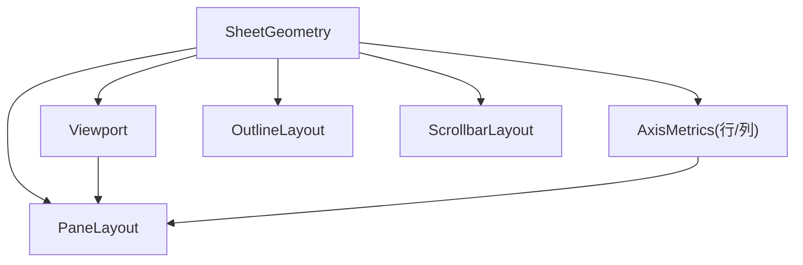
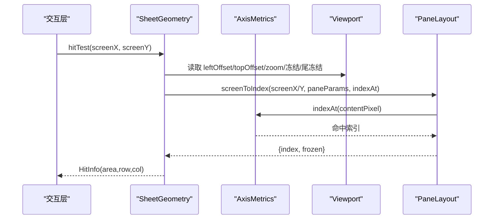

# 几何计算

<cite>
**本文引用的文件**
- [SheetGeometry.ts](file://cmx-mega-sheet/src/render/SheetGeometry.ts)
- [AxisMetrics.ts](file://cmx-mega-sheet/src/render/AxisMetrics.ts)
- [Viewport.ts](file://cmx-mega-sheet/src/render/Viewport.ts)
- [PaneLayout.ts](file://cmx-mega-sheet/src/render/PaneLayout.ts)
- [OutlineLayout.ts](file://cmx-mega-sheet/src/render/OutlineLayout.ts)
- [ScrollbarLayout.ts](file://cmx-mega-sheet/src/render/ScrollbarLayout.ts)
- [SheetGeometry.test.ts](file://cmx-mega-sheet/test/SheetGeometry.test.ts)
</cite>

## 目录
1. [简介](#简介)
2. [项目结构](#项目结构)
3. [核心组件](#核心组件)
4. [架构总览](#架构总览)
5. [详细组件分析](#详细组件分析)
6. [依赖关系分析](#依赖关系分析)
7. [性能与缓存](#性能与缓存)
8. [高精度渲染支持](#高精度渲染支持)
9. [使用示例](#使用示例)
10. [错误处理模式](#错误处理模式)
11. [调试技巧](#调试技巧)
12. [结论](#结论)

## 简介
本 API 文档聚焦于几何计算子系统，围绕 SheetGeometry 类展开，系统阐述坐标转换、单元格矩形计算、冻结行列与尾冻结的几何处理、视口到屏幕坐标映射、行列尺寸计算、合并单元格几何、滚动条布局与命中、大纲区交互等。同时给出几何缓存机制、性能优化策略、高精度渲染支持、使用示例、错误处理模式与调试技巧，帮助开发者在复杂表格场景下稳定高效地实现渲染与交互。

## 项目结构
几何计算位于 cmx-mega-sheet 渲染层，核心文件包括：
- SheetGeometry：几何主入口，封装坐标变换、可见范围、滚动条、命中测试等
- AxisMetrics：单轴（行/列）像素度量与索引双向映射
- Viewport：视口状态（滚动、缩放、头/尾冻结、拆分模式、滚动条占位等）
- PaneLayout：冻结/尾冻结分带纯几何（index↔screen 互逆不变式）
- OutlineLayout：大纲区按钮与命中区域几何
- ScrollbarLayout：滚动条布局解析与滑块位置换算



图表来源
- [SheetGeometry.ts:80-143](file://cmx-mega-sheet/src/render/SheetGeometry.ts#L80-L143)
- [AxisMetrics.ts:12-144](file://cmx-mega-sheet/src/render/AxisMetrics.ts#L12-L144)
- [Viewport.ts:47-178](file://cmx-mega-sheet/src/render/Viewport.ts#L47-L178)
- [PaneLayout.ts:22-201](file://cmx-mega-sheet/src/render/PaneLayout.ts#L22-L201)
- [OutlineLayout.ts](file://cmx-mega-sheet/src/render/OutlineLayout.ts)
- [ScrollbarLayout.ts](file://cmx-mega-sheet/src/render/ScrollbarLayout.ts)

章节来源
- [SheetGeometry.ts:1-143](file://cmx-mega-sheet/src/render/SheetGeometry.ts#L1-L143)
- [AxisMetrics.ts:1-144](file://cmx-mega-sheet/src/render/AxisMetrics.ts#L1-L144)
- [Viewport.ts:1-178](file://cmx-mega-sheet/src/render/Viewport.ts#L1-L178)
- [PaneLayout.ts:1-201](file://cmx-mega-sheet/src/render/PaneLayout.ts#L1-L201)

## 核心组件
- SheetGeometry：提供 getCellRect、hitTest、showCell、scrollRowRange/scrollColRange、resolveScrollbars、maxScroll、clampScroll、split 拖拽、大纲区命中等能力
- AxisMetrics：维护行高/列宽的前缀和与二分查找，支持隐藏行列（尺寸为 0），提供 indexAt、rangeInWindow、startOf/endOf/totalSize
- Viewport：管理滚动、缩放、行列头/大纲带宽、冻结/尾冻结数量、拆分模式、滚动条占位、内容宽高、签名
- PaneLayout：冻结/尾冻结三带坐标变换，保证 indexStartToScreen 与 screenToIndex 严格互逆
- OutlineLayout：行列大纲按钮与层级开关的几何与命中
- ScrollbarLayout：滚动条轨道与滑块布局、滑块位置与滚动值换算

章节来源
- [SheetGeometry.ts:80-647](file://cmx-mega-sheet/src/render/SheetGeometry.ts#L80-L647)
- [AxisMetrics.ts:12-144](file://cmx-mega-sheet/src/render/AxisMetrics.ts#L12-L144)
- [Viewport.ts:47-178](file://cmx-mega-sheet/src/render/Viewport.ts#L47-L178)
- [PaneLayout.ts:22-201](file://cmx-mega-sheet/src/render/PaneLayout.ts#L22-L201)
- [OutlineLayout.ts](file://cmx-mega-sheet/src/render/OutlineLayout.ts)
- [ScrollbarLayout.ts](file://cmx-mega-sheet/src/render/ScrollbarLayout.ts)

## 架构总览
SheetGeometry 作为几何计算中枢，通过 AxisMetrics 获取行列尺寸与前缀和，借助 Viewport 提供的视口状态（滚动、缩放、冻结/尾冻结、头/尾偏移）以及 PaneLayout 的分带算法，完成：
- 内容坐标 ↔ 屏幕坐标的双向转换
- 单元格/合并区域的屏幕矩形计算
- 视口可见范围（滚动带/冻结带/尾冻结带）
- 滚动条布局解析与命中
- 大纲区按钮命中与层级开关
- 自动填充手柄、筛选箭头、复选框、下拉箭头的命中



图表来源
- [SheetGeometry.ts:276-297](file://cmx-mega-sheet/src/render/SheetGeometry.ts#L276-L297)
- [PaneLayout.ts:121-153](file://cmx-mega-sheet/src/render/PaneLayout.ts#L121-L153)
- [AxisMetrics.ts:67-87](file://cmx-mega-sheet/src/render/AxisMetrics.ts#L67-L87)
- [Viewport.ts:106-129](file://cmx-mega-sheet/src/render/Viewport.ts#L106-L129)

## 详细组件分析

### 坐标系统与转换
- 内容坐标：未缩放、以 A1 左上为原点的逻辑像素（行高列宽的自然累加）
- 屏幕坐标：相对画布宿主左上角，已含行列头偏移 + 视口滚动 + 缩放
- 转换公式：
  - 屏幕 = (内容 - 滚动) * zoom + 头偏移
  - 内容 = (屏幕 - 头偏移) / zoom + 滚动
- 冻结/尾冻结分带：
  - 头冻结带：紧贴头偏移，不随滚动移动
  - 滚动带：在冻结带之后，随该轴滚动
  - 尾冻结带：钉在视口末端（offset + viewSize），不随滚动移动

关键方法路径
- 内容→屏幕：contentXToScreen/contentYToScreen
- 屏幕→内容：screenXToContent/screenYToContent
- 分带工具：indexStartToScreen/screenToIndex/freezeLineScreen/trailingLineScreen

章节来源
- [SheetGeometry.ts:182-254](file://cmx-mega-sheet/src/render/SheetGeometry.ts#L182-L254)
- [PaneLayout.ts:96-153](file://cmx-mega-sheet/src/render/PaneLayout.ts#L96-L153)

### 单元格矩形与合并单元格
- getCellRect(row, col, rowCount=1, colCount=1)：返回单元格或合并区的屏幕矩形（相对画布宿主，已含滚动/缩放/头偏移）
- 合并单元格：rowCount/colCount>1 时返回覆盖整个跨度的矩形，用于徽标定位等
- 宽度/高度由 startOf 差值乘以 zoom 得到，确保与 hitTest 严格互逆

章节来源
- [SheetGeometry.ts:256-270](file://cmx-mega-sheet/src/render/SheetGeometry.ts#L256-L270)

### 冻结行列与尾冻结几何
- 冻结线：freezeLineX()/freezeLineY()，无冻结返回 offset
- 尾冻结线：trailingLineX()/trailingLineY()，无尾冻结返回 +∞
- 可见范围：scrollRowRange/scrollColRange 在冻结时跳过冻结带；frozenBandRange/trailingBandRange 分别返回冻结/尾冻结可见区间
- 拆分条：hitColumnSplit/hitRowSplit/splitColToIndex/splitRowToIndex 支持 M19-step2 可拖冻结

章节来源
- [SheetGeometry.ts:122-180](file://cmx-mega-sheet/src/render/SheetGeometry.ts#L122-L180)
- [PaneLayout.ts:44-82](file://cmx-mega-sheet/src/render/PaneLayout.ts#L44-L82)
- [PaneLayout.ts:166-200](file://cmx-mega-sheet/src/render/PaneLayout.ts#L166-L200)

### 视口到屏幕映射与可见范围
- 视口可见范围：visibleRowRange/visibleColRange 根据冻结/尾冻结情况计算滚动带可见索引区间
- 顶部/底部/左侧/右侧可见行列：getViewportTopRow/getViewportBottomRow/getViewportLeftColumn/getViewportRightColumn
- 最大滚动位置：maxScroll() 考虑冻结与尾冻结扣除，避免滚过头露白
- 钳制滚动：clampScroll() 将当前滚动位置限制到合法区间

章节来源
- [SheetGeometry.ts:451-599](file://cmx-mega-sheet/src/render/SheetGeometry.ts#L451-L599)

### 滚动条布局与命中
- resolveScrollbars()：解析滚动条布局并回写 gutter（影响 contentWidth/Height → 可见范围）
- hitScrollbar(x,y,layout)：命中滚动条（垂直/水平，滑块/轨道空白）
- dragVerticalThumb/dragHorizontalThumb：滑块拖动换算 scrollTop/scrollLeft 并应用

章节来源
- [SheetGeometry.ts:550-646](file://cmx-mega-sheet/src/render/SheetGeometry.ts#L550-L646)
- [ScrollbarLayout.ts](file://cmx-mega-sheet/src/render/ScrollbarLayout.ts)

### 大纲区与交互命中
- hitOutlineButton：命中分组折叠钮或层级总开关，支持双轴层级按钮在角落的正确命中
- rowCenterScreen/colCenterScreen：用于大纲按钮定位
- hitFilterArrow/hitCheckbox/hitCellDropdown/hitFillHandle：针对筛选箭头、复选框、下拉箭头、自动填充手柄的命中

章节来源
- [SheetGeometry.ts:344-449](file://cmx-mega-sheet/src/render/SheetGeometry.ts#L344-L449)
- [OutlineLayout.ts](file://cmx-mega-sheet/src/render/OutlineLayout.ts)

### 行列尺寸计算
- AxisMetrics.sizeAt(index)：返回实际占用像素（隐藏为 0）
- AxisMetrics.startOf/endOf/totalSize：前缀和与边界
- AxisMetrics.indexAt(pixel)：二分查找命中索引，跳过零宽元素
- AxisMetrics.rangeInWindow(startPx,endPx)：窗口覆盖的索引区间

章节来源
- [AxisMetrics.ts:12-144](file://cmx-mega-sheet/src/render/AxisMetrics.ts#L12-L144)

## 依赖关系分析
- SheetGeometry 强依赖 AxisMetrics（行列尺寸）、Viewport（视口状态）、PaneLayout（分带几何）
- OutlineLayout 提供大纲区按钮几何，被 SheetGeometry.hitOutlineButton 调用
- ScrollbarLayout 提供滚动条布局与滑块换算，被 SheetGeometry.resolveScrollbars/hitScrollbar 调用
- Viewport 提供签名机制，用于设计器徽标叠层重定位触发

```mermaid
classDiagram
class SheetGeometry {
+getCellRect(row,col,rowCount,colCount) CellRect
+hitTest(screenX,screenY) HitInfo
+showCell(row,col,align) void
+resolveScrollbars() ScrollbarLayout
+maxScroll() {left,top}
+clampScroll() void
}
class AxisMetrics {
+sizeAt(index) number
+startOf(index) number
+endOf(index) number
+totalSize() number
+indexAt(pixel) number
+rangeInWindow(startPx,endPx) {first,last}|null
}
class Viewport {
+set(partial) void
+signature() string
+contentWidth number
+contentHeight number
}
class PaneLayout {
+indexStartToScreen(index,p) number
+screenToIndex(screen,p,indexAt) {index,frozen}
+freezeLineScreen(p) number
+trailingLineScreen(p) number
}
SheetGeometry --> AxisMetrics : "使用"
SheetGeometry --> Viewport : "读取状态"
SheetGeometry --> PaneLayout : "分带几何"
```

图表来源
- [SheetGeometry.ts:80-647](file://cmx-mega-sheet/src/render/SheetGeometry.ts#L80-L647)
- [AxisMetrics.ts:12-144](file://cmx-mega-sheet/src/render/AxisMetrics.ts#L12-L144)
- [Viewport.ts:47-178](file://cmx-mega-sheet/src/render/Viewport.ts#L47-L178)
- [PaneLayout.ts:22-201](file://cmx-mega-sheet/src/render/PaneLayout.ts#L22-L201)

章节来源
- [SheetGeometry.ts:80-647](file://cmx-mega-sheet/src/render/SheetGeometry.ts#L80-L647)
- [AxisMetrics.ts:12-144](file://cmx-mega-sheet/src/render/AxisMetrics.ts#L12-L144)
- [Viewport.ts:47-178](file://cmx-mega-sheet/src/render/Viewport.ts#L47-L178)
- [PaneLayout.ts:22-201](file://cmx-mega-sheet/src/render/PaneLayout.ts#L22-L201)

## 性能与缓存
- 惰性前缀和缓存：AxisMetrics 内部维护 offsets 数组，首次访问时构建，后续复用；当尺寸/隐藏/数量变化后通过 invalidate/setCount 失效重建
- 分带纯函数：PaneLayout 不持有 AxisMetrics 实例，通过回调取 startOf/sizeAt，便于 Node 单测与解耦
- 视口签名：Viewport.signature() 聚合所有影响屏幕位置的量，变化时仅刷新必要叠层，减少重绘
- 可见范围裁剪：scrollRowRange/scrollColRange 仅在滚动带计算可见索引，冻结/尾冻结恒可见，避免全表遍历
- 二分查找：AxisMetrics.indexAt/rangeInWindow 使用 O(log n) 查找，适合大数据集

优化建议
- 批量更新 AxisMetrics 后统一 invalidate，避免频繁重建
- 合理设置冻结/尾冻结数量，减少滚动带计算开销
- 使用 computeScrollToShow 的最小移动策略，避免不必要的滚动抖动
- 利用 clampScroll 防止内容变短或放大后出现空白

章节来源
- [AxisMetrics.ts:17-111](file://cmx-mega-sheet/src/render/AxisMetrics.ts#L17-L111)
- [PaneLayout.ts:22-201](file://cmx-mega-sheet/src/render/PaneLayout.ts#L22-L201)
- [Viewport.ts:116-156](file://cmx-mega-sheet/src/render/Viewport.ts#L116-L156)
- [SheetGeometry.ts:451-599](file://cmx-mega-sheet/src/render/SheetGeometry.ts#L451-L599)

## 高精度渲染支持
- 缩放系数：Viewport.zoom 支持 0.1~4 范围，几何计算全程乘以 zoom，保证缩放一致性
- 亚像素稳定：Viewport.signature() 对数值取整，避免亚像素抖动导致频繁刷新
- 冻结/尾冻结对齐：分带几何保证 indexStartToScreen 与 screenToIndex 严格互逆，跨冻结边界、跨滚动、跨缩放均成立
- 滚动条换算：thumbPosToScroll 精确换算滑块位置与滚动值，适配不同缩放

章节来源
- [Viewport.ts:78-86](file://cmx-mega-sheet/src/render/Viewport.ts#L78-L86)
- [Viewport.ts:131-156](file://cmx-mega-sheet/src/render/Viewport.ts#L131-L156)
- [PaneLayout.ts:96-153](file://cmx-mega-sheet/src/render/PaneLayout.ts#L96-L153)
- [SheetGeometry.ts:621-646](file://cmx-mega-sheet/src/render/SheetGeometry.ts#L621-L646)

## 使用示例
以下为常见用法的路径参考（不包含具体代码内容）：
- 计算单元格矩形（含合并）：[getCellRect:256-270](file://cmx-mega-sheet/src/render/SheetGeometry.ts#L256-L270)
- 屏幕坐标命中测试：[hitTest:276-297](file://cmx-mega-sheet/src/render/SheetGeometry.ts#L276-L297)
- 滚动使单元格可见：[computeScrollToShow/showCell:507-546](file://cmx-mega-sheet/src/render/SheetGeometry.ts#L507-L546)
- 解析滚动条布局与命中：[resolveScrollbars/hitScrollbar:550-619](file://cmx-mega-sheet/src/render/SheetGeometry.ts#L550-L619)
- 拖拽滑块：[dragVerticalThumb/dragHorizontalThumb:621-646](file://cmx-mega-sheet/src/render/SheetGeometry.ts#L621-L646)
- 大纲区按钮命中：[hitOutlineButton:406-449](file://cmx-mega-sheet/src/render/SheetGeometry.ts#L406-L449)
- 可见范围查询：[scrollRowRange/scrollColRange:475-477](file://cmx-mega-sheet/src/render/SheetGeometry.ts#L475-L477)

测试用例参考
- 基础矩形与滚动/缩放：[SheetGeometry.test.ts:18-59](file://cmx-mega-sheet/test/SheetGeometry.test.ts#L18-L59)
- 命中测试与区域判断：[SheetGeometry.test.ts:61-85](file://cmx-mega-sheet/test/SheetGeometry.test.ts#L61-L85)
- 互逆不变式验证：[SheetGeometry.test.ts:87-111](file://cmx-mega-sheet/test/SheetGeometry.test.ts#L87-L111)
- 可见范围与滚动：[SheetGeometry.test.ts:113-169](file://cmx-mega-sheet/test/SheetGeometry.test.ts#L113-L169)
- 隐藏行几何：[SheetGeometry.test.ts:171-185](file://cmx-mega-sheet/test/SheetGeometry.test.ts#L171-L185)
- 大纲区层级按钮命中：[SheetGeometry.test.ts:187-200](file://cmx-mega-sheet/test/SheetGeometry.test.ts#L187-L200)

章节来源
- [SheetGeometry.ts:256-646](file://cmx-mega-sheet/src/render/SheetGeometry.ts#L256-L646)
- [SheetGeometry.test.ts:18-200](file://cmx-mega-sheet/test/SheetGeometry.test.ts#L18-L200)

## 错误处理模式
- 输入钳制：Viewport.set 对 width/height/rowHeaderWidth/colHeaderHeight 等非负值进行 Math.max(0,...) 保护；frozenRowCount/frozenColCount 等整数参数进行 Math.floor 与下限保护
- 索引越界：AxisMetrics.indexAt 对 <0 或 ≥total 的情况返回边界索引，避免异常
- 滚动钳制：maxScroll/clampScroll 确保滚动位置不超过内容边界，避免露白
- 空轴处理：AxisMetrics.length=0 时 rangeInWindow 返回 null，调用方需判空

章节来源
- [Viewport.ts:88-104](file://cmx-mega-sheet/src/render/Viewport.ts#L88-L104)
- [AxisMetrics.ts:67-87](file://cmx-mega-sheet/src/render/AxisMetrics.ts#L67-L87)
- [SheetGeometry.ts:574-599](file://cmx-mega-sheet/src/render/SheetGeometry.ts#L574-L599)

## 调试技巧
- 使用 hitTest 中心点验证 getCellRect 互逆性：选取单元格矩形中心，命中应回到原行列
- 检查冻结/尾冻结线：freezeLineX/Y 与 trailingLineX/Y 应与视觉分割一致
- 滚动条命中：先调用 resolveScrollbars 再 hitScrollbar，确保 layout 最新
- 大纲区命中：双轴层级按钮需在角落正确命中，避免早退分支吞掉点击
- 签名变化：Viewport.signature 变化时确认是否需要刷新叠层或重算几何

章节来源
- [SheetGeometry.test.ts:87-111](file://cmx-mega-sheet/test/SheetGeometry.test.ts#L87-L111)
- [SheetGeometry.ts:122-143](file://cmx-mega-sheet/src/render/SheetGeometry.ts#L122-L143)
- [SheetGeometry.ts:550-619](file://cmx-mega-sheet/src/render/SheetGeometry.ts#L550-L619)
- [Viewport.ts:131-156](file://cmx-mega-sheet/src/render/Viewport.ts#L131-L156)

## 结论
SheetGeometry 通过严谨的坐标转换、分带几何与惰性缓存，提供了高性能、高精度的几何计算能力，支撑冻结/尾冻结、滚动条、大纲区、合并单元格等复杂场景。配合 AxisMetrics、Viewport、PaneLayout、OutlineLayout、ScrollbarLayout，形成清晰分层与稳定不变式，便于扩展与维护。建议在实际使用中遵循最小滚动、合理冻结、批量失效与签名驱动刷新等最佳实践，以获得更优性能与体验。