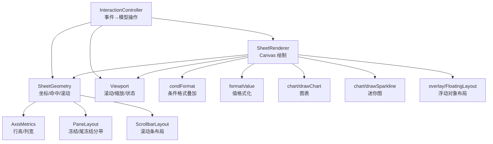
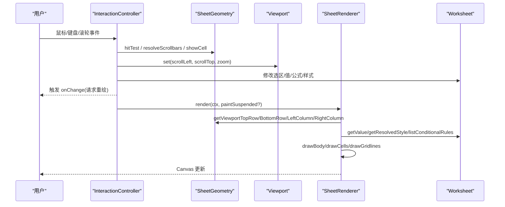
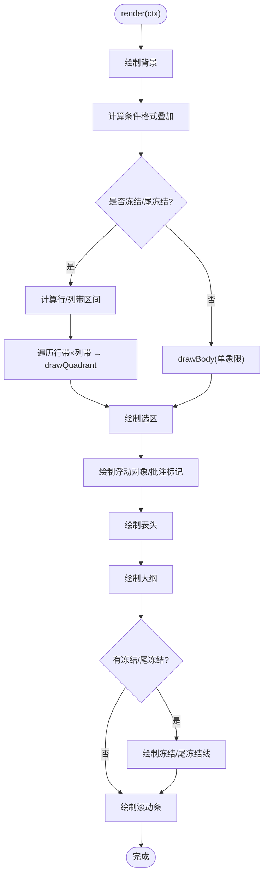
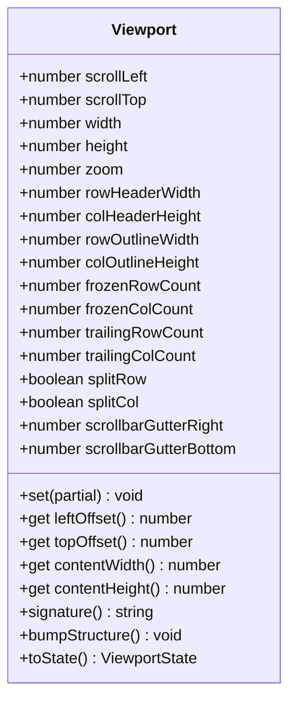
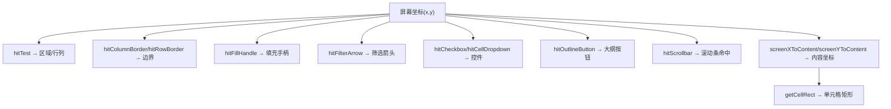
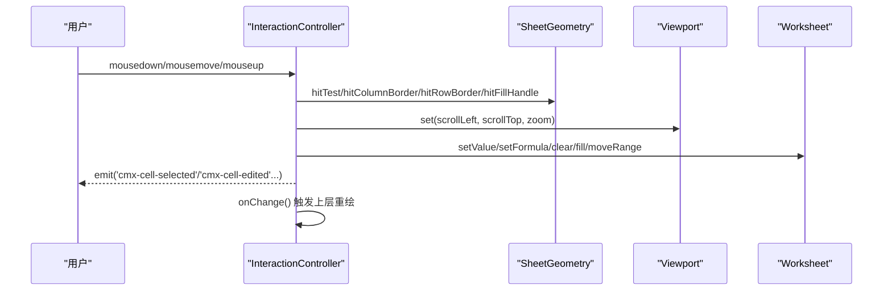
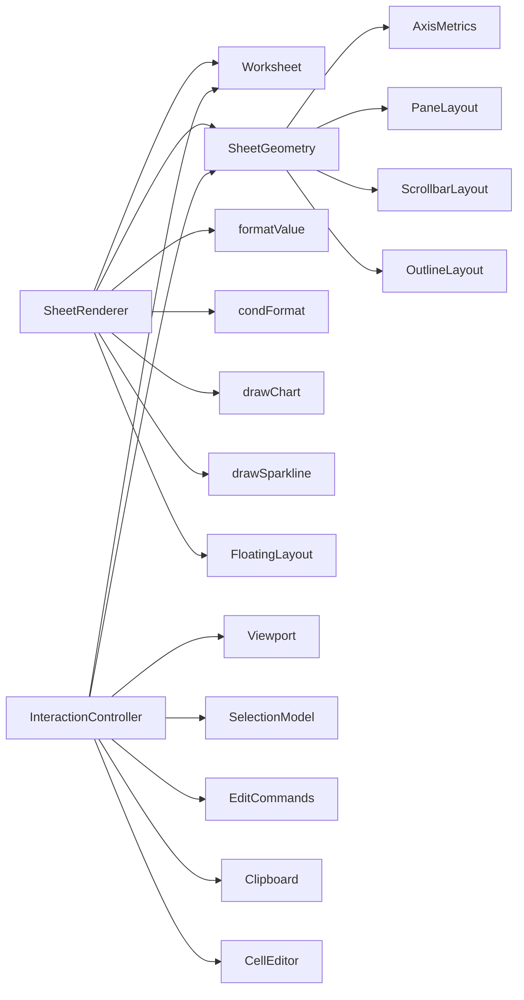

# 渲染 API

<cite>
**本文引用的文件**
- [SheetRenderer.ts](file://cmx-mega-sheet/src/render/SheetRenderer.ts)
- [Viewport.ts](file://cmx-mega-sheet/src/render/Viewport.ts)
- [SheetGeometry.ts](file://cmx-mega-sheet/src/render/SheetGeometry.ts)
- [InteractionController.ts](file://cmx-mega-sheet/src/render/InteractionController.ts)
- [AxisMetrics.ts](file://cmx-mega-sheet/src/render/AxisMetrics.ts)
- [PaneLayout.ts](file://cmx-mega-sheet/src/render/PaneLayout.ts)
- [ScrollbarLayout.ts](file://cmx-mega-sheet/src/render/ScrollbarLayout.ts)
- [OutlineLayout.ts](file://cmx-mega-sheet/src/render/OutlineLayout.ts)
- [formatValue.ts](file://cmx-mega-sheet/src/render/formatValue.ts)
- [condFormat.ts](file://cmx-mega-sheet/src/render/condFormat.ts)
- [drawChart.ts](file://cmx-mega-sheet/src/render/chart/drawChart.ts)
- [drawSparkline.ts](file://cmx-mega-sheet/src/render/chart/drawSparkline.ts)
- [FloatingLayout.ts](file://cmx-mega-sheet/src/render/overlay/FloatingLayout.ts)
</cite>

## 目录
1. [简介](#简介)
2. [项目结构](#项目结构)
3. [核心组件](#核心组件)
4. [架构总览](#架构总览)
5. [详细组件分析](#详细组件分析)
6. [依赖关系分析](#依赖关系分析)
7. [性能与虚拟化](#性能与虚拟化)
8. [主题定制与跨浏览器兼容](#主题定制与跨浏览器兼容)
9. [故障排查指南](#故障排查指南)
10. [结论](#结论)

## 简介
本 API 文档面向渲染系统，围绕以下目标展开：
- SheetRenderer 的渲染配置、视口管理与几何计算
- Viewport 的滚动控制、缩放功能与区域计算
- InteractionController 的交互事件处理、用户输入响应与手势支持
- 主题定制、性能优化与跨浏览器兼容性
- 渲染管线、虚拟化和增量更新机制

该渲染子系统由“几何层 + 视口层 + 渲染层 + 交互层”构成，职责清晰、可测试性强，并支持冻结/尾冻结、大纲分组、条件格式、图表/迷你图、浮动对象等高级能力。

## 项目结构
渲染相关代码集中在 cmx-mega-sheet/src/render 目录，关键文件如下：
- SheetRenderer.ts：Canvas 绘制层，负责把可见区域画出来（网格线、行列头、单元格文本/背景/边框、合并跨格、选区、条件格式叠加、图表/迷你图、批注标记、滚动条）
- Viewport.ts：记录滚动位置、尺寸、缩放、行列头/大纲带占位、冻结/尾冻结、拆分模式、滚动条占位，并提供签名用于叠层重定位
- SheetGeometry.ts：单元格↔屏幕像素映射，提供 hitTest、getCellRect、滚动范围、滚动条命中/拖拽、最大滚动、钳制等
- InteractionController.ts：DOM 事件到模型操作的枢纽，封装选择、编辑、剪贴板、滚动/缩放、大纲折叠、自动填充、移动选区、浮动对象拖拽/缩放等
- AxisMetrics.ts / PaneLayout.ts / ScrollbarLayout.ts / OutlineLayout.ts：轴度量、分带布局、滚动条布局、大纲按钮布局等支撑模块
- formatValue.ts / condFormat.ts / chart/* / overlay/FloatingLayout.ts：格式化、条件格式、图表/迷你图绘制、浮动对象布局

**图示来源**
- [InteractionController.ts:1-120](file://cmx-mega-sheet/src/render/InteractionController.ts#L1-L120)
- [SheetGeometry.ts:1-120](file://cmx-mega-sheet/src/render/SheetGeometry.ts#L1-L120)
- [Viewport.ts:1-80](file://cmx-mega-sheet/src/render/Viewport.ts#L1-L80)
- [SheetRenderer.ts:1-160](file://cmx-mega-sheet/src/render/SheetRenderer.ts#L1-L160)

**章节来源**
- [SheetRenderer.ts:1-160](file://cmx-mega-sheet/src/render/SheetRenderer.ts#L1-L160)
- [Viewport.ts:1-80](file://cmx-mega-sheet/src/render/Viewport.ts#L1-L80)
- [SheetGeometry.ts:1-120](file://cmx-mega-sheet/src/render/SheetGeometry.ts#L1-L120)
- [InteractionController.ts:1-120](file://cmx-mega-sheet/src/render/InteractionController.ts#L1-L120)

## 核心组件
- SheetRenderer：薄渲染层，仅负责“画什么”，不持有数据；通过 Worksheet 获取值/样式，通过 SheetGeometry 获取可见范围与矩形；支持条件格式叠加、图表/迷你图、批注三角标记、冻结/尾冻结分割线、滚动条绘制
- Viewport：视图状态容器，维护 scrollLeft/scrollTop/width/height/zoom、行列头/大纲带宽度/高度、冻结/尾冻结数量、拆分模式、滚动条占位；提供 signature() 用于外部叠层重定位
- SheetGeometry：纯计算几何层，实现内容坐标↔屏幕坐标转换、hitTest、滚动范围计算、滚动条解析与拖拽、最大滚动与钳制、showCell 对齐策略、大纲按钮命中
- InteractionController：交互中枢，绑定 canvas/host DOM 事件，驱动 SelectionModel/EditCommands/Clipboard/CellEditor，派发契约事件（如 cmx-cell-selected/cell-edited/sheet-changed/col-resized/row-resized/edit-rejected）

**章节来源**
- [SheetRenderer.ts:140-230](file://cmx-mega-sheet/src/render/SheetRenderer.ts#L140-L230)
- [Viewport.ts:47-178](file://cmx-mega-sheet/src/render/Viewport.ts#L47-L178)
- [SheetGeometry.ts:80-180](file://cmx-mega-sheet/src/render/SheetGeometry.ts#L80-L180)
- [InteractionController.ts:89-172](file://cmx-mega-sheet/src/render/InteractionController.ts#L89-L172)

## 架构总览
渲染管线从交互到绘制的关键流程如下：

**图示来源**
- [InteractionController.ts:148-172](file://cmx-mega-sheet/src/render/InteractionController.ts#L148-L172)
- [SheetGeometry.ts:451-572](file://cmx-mega-sheet/src/render/SheetGeometry.ts#L451-L572)
- [SheetRenderer.ts:165-229](file://cmx-mega-sheet/src/render/SheetRenderer.ts#L165-L229)

## 详细组件分析

### SheetRenderer：渲染配置、视口管理与几何计算
- 渲染入口 render(ctx, paintSuspended)：根据 geometry.viewport 决定背景、条件格式叠加、冻结/尾冻结象限划分、主体绘制、选区、浮动对象、批注标记、表头、大纲、冻结线、滚动条
- 象限绘制 drawQuadrant/drawBody：按冻结/尾冻结将画布划分为最多 3×3 个象限，clip 到屏幕矩形，避免越界绘制
- 单元格绘制 drawCell：背景（条件格式色阶优先）、复选框、数据条、图标集、超链接、富文本、溢出裁剪、迷你图、自定义边框
- 文本绘制 drawCellText/drawCellTextFlat：支持字号缩放、shrinkToFit、wordWrap、fill 对齐、underline/strikethrough、旋转（M18）
- 条件格式 condOverlays：在渲染前评估规则，生成叠加信息（style/fill/bar/icon），在 drawCell 中应用
- 图表/迷你图：buildChartData 抽取数据源区域，调用 drawChart/drawSparkline
- 批注标记：仅在可见范围内绘制右上角红三角
- 冻结/尾冻结线：普通冻结细线，拆分模式粗条+抓握点

**图示来源**
- [SheetRenderer.ts:165-229](file://cmx-mega-sheet/src/render/SheetRenderer.ts#L165-L229)
- [SheetRenderer.ts:231-317](file://cmx-mega-sheet/src/render/SheetRenderer.ts#L231-L317)
- [SheetRenderer.ts:319-431](file://cmx-mega-sheet/src/render/SheetRenderer.ts#L319-L431)
- [SheetRenderer.ts:433-533](file://cmx-mega-sheet/src/render/SheetRenderer.ts#L433-L533)

**章节来源**
- [SheetRenderer.ts:140-800](file://cmx-mega-sheet/src/render/SheetRenderer.ts#L140-L800)

### Viewport：滚动控制、缩放与区域计算
- 状态字段：scrollLeft/scrollTop/width/height/zoom、rowHeaderWidth/colHeaderHeight、rowOutlineWidth/colOutlineHeight、frozenRowCount/frozenColCount、trailingRowCount/trailingColCount、splitRow/splitCol、scrollbarGutterRight/scrollbarGutterBottom
- 缩放 clamp：zoom 限制在 [0.1, 4]
- 偏移与内容尺寸：leftOffset/topOffset、contentWidth/contentHeight
- 签名 signature：包含所有影响单元格屏幕位置的量，用于外部徽标叠层按需刷新
- 结构版本 bumpStructure：行列数/行高列宽变化时递增，纳入签名

**图示来源**
- [Viewport.ts:16-178](file://cmx-mega-sheet/src/render/Viewport.ts#L16-L178)

**章节来源**
- [Viewport.ts:47-178](file://cmx-mega-sheet/src/render/Viewport.ts#L47-L178)

### SheetGeometry：几何映射、命中与滚动
- 分带参数：colPane()/rowPane() 统一冻结/尾冻结/滚动/缩放/内容尺寸
- 坐标变换：contentXToScreen/screenXToContent、contentYToScreen/screenYToContent
- 可见范围：visibleRowRange/visibleColRange、scrollRowRange/scrollColRange、getViewportTopRow/BottomRow/LeftColumn/RightColumn
- 滚动控制：computeScrollToShow/showCell/clampScroll/maxScroll
- 滚动条：resolveScrollbars/hitScrollbar/dragVerticalThumb/dragHorizontalThumb
- 命中测试：hitTest/hitColumnBorder/hitRowBorder/hitFillHandle/hitFilterArrow/hitCheckbox/hitCellDropdown/hitOutlineButton
- 拆分条：hitColumnSplit/hitRowSplit/splitColToIndex/splitRowToIndex

**图示来源**
- [SheetGeometry.ts:276-449](file://cmx-mega-sheet/src/render/SheetGeometry.ts#L276-L449)
- [SheetGeometry.ts:502-647](file://cmx-mega-sheet/src/render/SheetGeometry.ts#L502-L647)

**章节来源**
- [SheetGeometry.ts:80-648](file://cmx-mega-sheet/src/render/SheetGeometry.ts#L80-L648)

### InteractionController：交互事件处理、用户输入与手势
- 事件绑定：canvas mousedown/mousemove/mouseup/dblclick/wheel，host keydown/copy/cut/paste/contextmenu，document级 move/up
- 选择：点击/拖拽/Shift扩展/Ctrl多选/整行列选/全选
- 编辑：Enter/F2/字符进入编辑，提交写入值或公式，支持 list 验证下拉编辑器
- 剪贴板：内部 Clipboard 保真粘贴（含公式平移），系统剪贴板互通 TSV/HTML
- 滚动/缩放：wheel 滚动，Ctrl+wheel 缩放
- 大纲：折叠/层级切换，刷新可见性与几何
- 自动填充：拖拽预览目标区，应用外推序列
- 移动选区：拖拽选区块移动
- 浮动对象：选中/拖拽/8句柄缩放
- 滚动条：滑块拖拽、轨道翻页
- 事件派发：cmx-cell-selected/cell-edited/sheet-changed/col-resized/row-resized/edit-rejected

**图示来源**
- [InteractionController.ts:148-172](file://cmx-mega-sheet/src/render/InteractionController.ts#L148-L172)
- [InteractionController.ts:188-357](file://cmx-mega-sheet/src/render/InteractionController.ts#L188-L357)
- [InteractionController.ts:738-753](file://cmx-mega-sheet/src/render/InteractionController.ts#L738-L753)
- [InteractionController.ts:860-923](file://cmx-mega-sheet/src/render/InteractionController.ts#L860-L923)

**章节来源**
- [InteractionController.ts:89-1196](file://cmx-mega-sheet/src/render/InteractionController.ts#L89-L1196)

## 依赖关系分析
- SheetRenderer 依赖：
  - Worksheet：读取值/样式/条件格式/浮动对象/批注/迷你图
  - SheetGeometry：可见范围、单元格矩形、冻结/尾冻结线、滚动条布局
  - formatValue：单元格值格式化
  - condFormat：条件格式叠加计算
  - chart/drawChart & chart/drawSparkline：图表/迷你图绘制
  - overlay/FloatingLayout：浮动对象矩形解析与句柄命中
- SheetGeometry 依赖：
  - AxisMetrics：行高/列宽、startOf/sizeAt/rangeInWindow
  - PaneLayout：冻结/尾冻结分带、indexStartToScreen/screenToIndex
  - ScrollbarLayout：滚动条布局解析与滑块位置换算
  - OutlineLayout：大纲按钮几何
- Viewport 独立：仅状态与签名计算
- InteractionController 依赖：
  - SelectionModel/Range/EditCommands/Clipboard：选择与编辑命令
  - Worksheet/Workbook：数据与撤销栈
  - SheetGeometry/Viewport：几何与视口状态
  - CellEditor：单元格编辑 UI

**图示来源**
- [SheetRenderer.ts:12-33](file://cmx-mega-sheet/src/render/SheetRenderer.ts#L12-L33)
- [SheetGeometry.ts:18-46](file://cmx-mega-sheet/src/render/SheetGeometry.ts#L18-L46)
- [InteractionController.ts:21-40](file://cmx-mega-sheet/src/render/InteractionController.ts#L21-L40)

**章节来源**
- [SheetRenderer.ts:12-33](file://cmx-mega-sheet/src/render/SheetRenderer.ts#L12-L33)
- [SheetGeometry.ts:18-46](file://cmx-mega-sheet/src/render/SheetGeometry.ts#L18-L46)
- [InteractionController.ts:21-40](file://cmx-mega-sheet/src/render/InteractionController.ts#L21-L40)

## 性能与虚拟化
- 虚拟化：SheetGeometry.visibleRowRange/visibleColRange 基于 AxisMetrics.rangeInWindow 计算可见行列，仅绘制可见区域；冻结/尾冻结分带确保各象限 clip 到屏幕矩形，避免多余绘制
- 增量更新：Viewport.signature() 聚合滚动/缩放/头/大纲/冻结/尾冻结/滚动条占位/结构版本，外部叠层仅在签名变化时重定位；结构变化通过 bumpStructure() 触发
- 条件格式：渲染前一次性 evaluateRules，生成 condOverlays Map，减少重复计算
- 文本测量与溢出：wrapText/repeatToFill/overflowClipRect 控制换行与溢出裁剪，避免覆盖邻格
- 滚动条解析：两趟 resolveScrollbars 计算 gutter，保证可见范围与后续绘制一致
- 冻结/尾冻结：3×3 象限绘制，主区先画、冻结象限后盖，符合 Excel 层序且减少重绘

建议：
- 大数据量场景下，保持 viewport.width/height 合理，避免超大内容导致 rangeInWindow 扫描开销过大
- 频繁结构变化（行列增删/行高列宽调整）时，集中调用 bumpStructure() 并批量重绘
- 条件格式规则较多时，注意 evaluateRules 的计算成本，必要时缓存或分批计算

[本节为通用指导，无需特定文件引用]

## 主题定制与跨浏览器兼容
- 主题：RenderTheme 提供 LIGHT_THEME/DARK_THEME，涵盖网格线、表头、选中态、滚动条、冻结线等颜色；ChartTheme 同步图表配色
- 最小上下文接口：RenderContext2D 定义最小方法集合，真实 CanvasRenderingContext2D 或 jsdom mock 均可注入，便于 Node 测试
- 可选能力回退：
  - globalAlpha：数据条半透明，jsdom 桩可选
  - setLineDash：虚线/点线描边，无则退化实线
  - translate/rotate：文本旋转，无则水平绘制
  - drawImage：浮动图片，无则跳过
- 跨浏览器注意事项：
  - 剪贴板：部分浏览器限制 text/html，已 try/catch 降级
  - 滚动条：不同平台滚动条占用差异，通过 ScrollbarLayout 动态计算 gutter
  - 字体与度量：measureText 结果因字体而异，自适应列宽/行高需传入 measureText 回调

**章节来源**
- [SheetRenderer.ts:35-138](file://cmx-mega-sheet/src/render/SheetRenderer.ts#L35-L138)
- [SheetRenderer.ts:567-576](file://cmx-mega-sheet/src/render/SheetRenderer.ts#L567-L576)
- [SheetRenderer.ts:692-707](file://cmx-mega-sheet/src/render/SheetRenderer.ts#L692-L707)
- [InteractionController.ts:988-1023](file://cmx-mega-sheet/src/render/InteractionController.ts#L988-L1023)

## 故障排查指南
- 滚动异常：检查 maxScroll/clampScroll 是否正确；确认 resolveScrollbars 已在 resize/滚动/缩放/结构变化后调用
- 冻结/尾冻结错位：确认 freezeLineX/Y、trailingLineX/Y 计算与 viewport.splitCol/splitRow 模式一致
- 条件格式未生效：检查 evaluateRules 是否返回非空 condOverlays，以及 drawCell 中是否应用 overlay.fill/style/bar/icon
- 文本溢出覆盖邻格：确认 overflowClipRect 启用条件（非 wordWrap/shrinkToFit），并确保 ctx.save/clip 可用
- 交互无响应：确认 InteractionController.bindEvents 已执行，host 具备 tabindex；dispose 后事件已移除
- 只读模式：editable=false 时，写入类操作短路，但选择/滚动仍可用

**章节来源**
- [SheetGeometry.ts:555-599](file://cmx-mega-sheet/src/render/SheetGeometry.ts#L555-L599)
- [SheetRenderer.ts:176-179](file://cmx-mega-sheet/src/render/SheetRenderer.ts#L176-L179)
- [SheetRenderer.ts:505-518](file://cmx-mega-sheet/src/render/SheetRenderer.ts#L505-L518)
- [InteractionController.ts:174-180](file://cmx-mega-sheet/src/render/InteractionController.ts#L174-L180)

## 结论
本渲染系统以清晰的层次分离（几何/视口/渲染/交互）实现了高性能、可扩展的表格渲染能力。SheetRenderer 专注绘制，Viewport 管理视图状态，SheetGeometry 提供精确的坐标与命中计算，InteractionController 将用户输入转化为模型变更并派发标准事件。结合虚拟化、条件格式、图表/迷你图、浮动对象与主题定制，满足复杂企业级表格场景需求。建议在大数据量与高频交互场景中关注签名变化与结构版本管理，以获得最佳性能与稳定性。

[本节为总结性内容，无需特定文件引用]