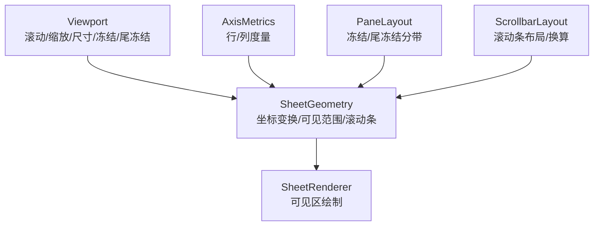
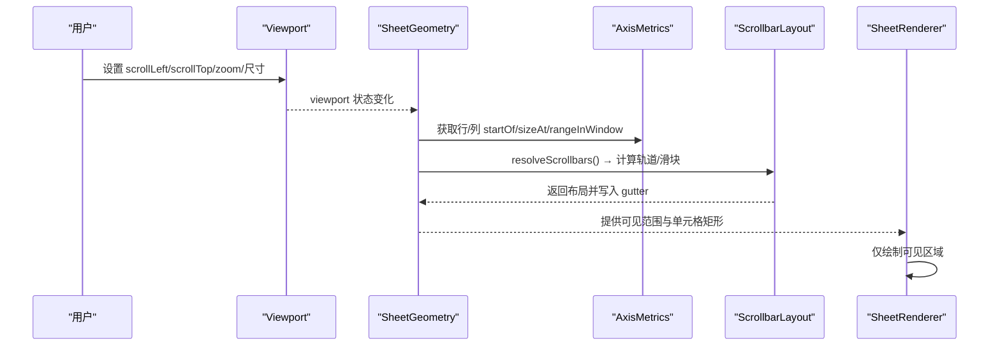
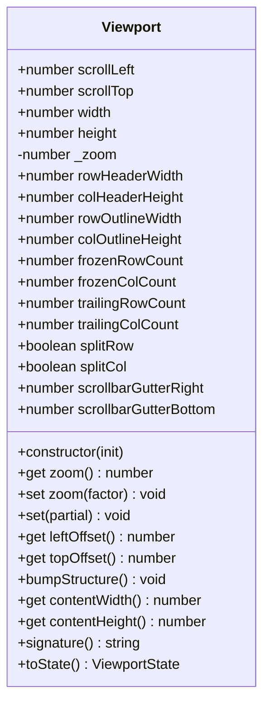
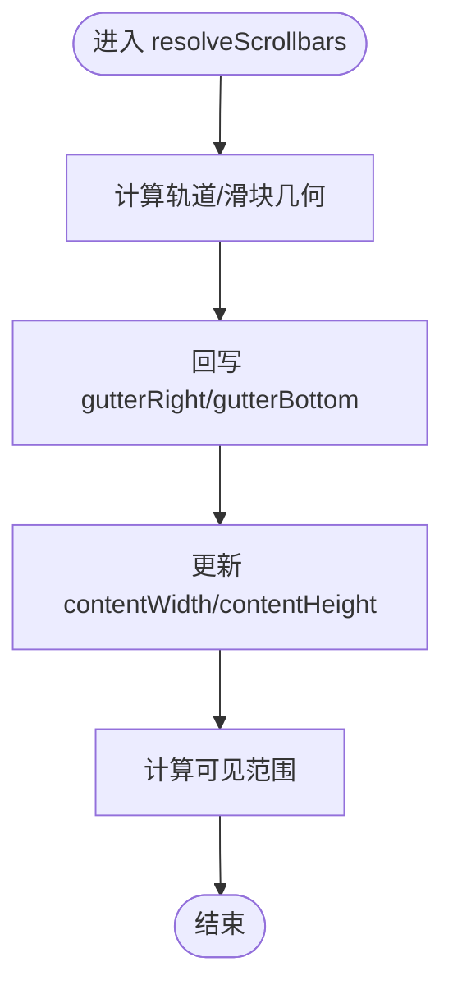
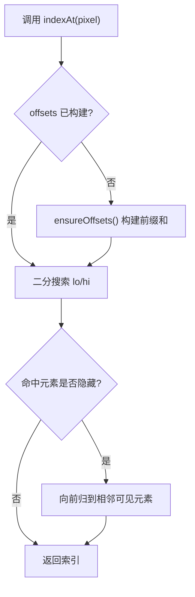
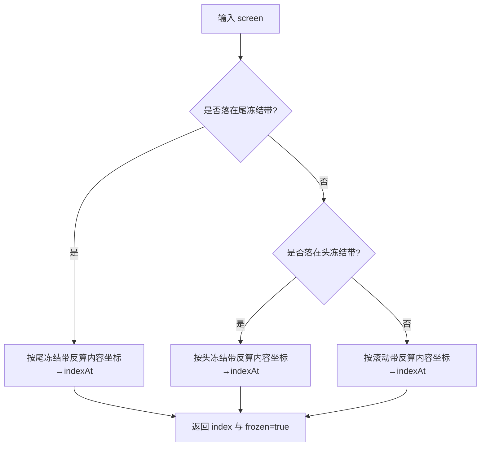
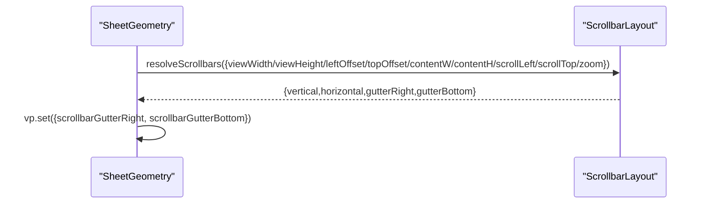
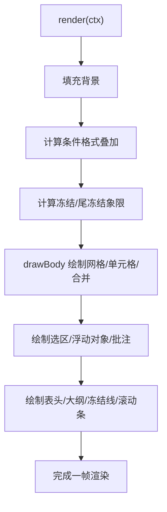
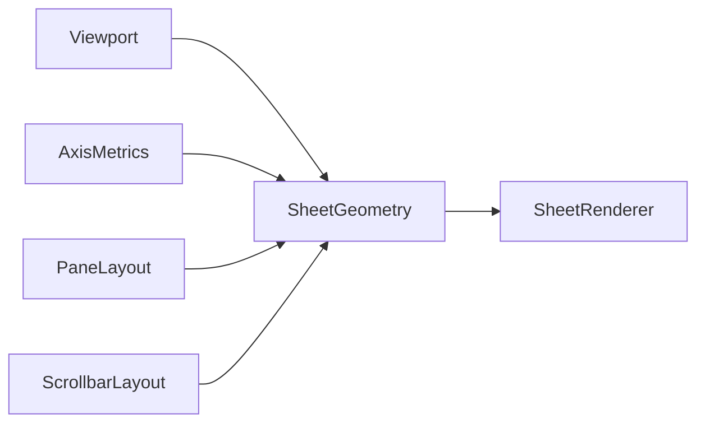

# 视口管理

<cite>
**本文引用的文件**
- [Viewport.ts](file://cmx-mega-sheet/src/render/Viewport.ts)
- [SheetGeometry.ts](file://cmx-mega-sheet/src/render/SheetGeometry.ts)
- [AxisMetrics.ts](file://cmx-mega-sheet/src/render/AxisMetrics.ts)
- [PaneLayout.ts](file://cmx-mega-sheet/src/render/PaneLayout.ts)
- [ScrollbarLayout.ts](file://cmx-mega-sheet/src/render/ScrollbarLayout.ts)
- [SheetRenderer.ts](file://cmx-mega-sheet/src/render/SheetRenderer.ts)
- [Viewport.test.ts](file://cmx-mega-sheet/test/Viewport.test.ts)
- [SheetGeometry.test.ts](file://cmx-mega-sheet/test/SheetGeometry.test.ts)
- [SheetGeometryResize.test.ts](file://cmx-mega-sheet/test/SheetGeometryResize.test.ts)
- [ScrollbarLayout.test.ts](file://cmx-mega-sheet/test/ScrollbarLayout.test.ts)
</cite>

## 目录
1. [简介](#简介)
2. [项目结构](#项目结构)
3. [核心组件](#核心组件)
4. [架构总览](#架构总览)
5. [详细组件分析](#详细组件分析)
6. [依赖关系分析](#依赖关系分析)
7. [性能考量](#性能考量)
8. [故障排查指南](#故障排查指南)
9. [结论](#结论)
10. [附录：API 参考与使用示例](#附录api-参考与使用示例)

## 简介
本文件为“视口管理系统”的 API 文档，聚焦于 Viewport 类及其在电子表格渲染中的滚动控制、缩放实现、可视区域计算、边界检测与自适应调整。同时说明视口与几何计算的交互关系、滚动事件处理流程、状态管理与性能优化策略，以及大表格虚拟化渲染原理。文末提供配置选项、事件监听方法与调试工具使用指南。

## 项目结构
视口相关能力集中在 cmx-mega-sheet 渲染层，关键文件如下：
- Viewport：视口状态（滚动、缩放、尺寸、行列头/大纲带占位、冻结/尾冻结、拆分模式、滚动条占位）与签名生成。
- SheetGeometry：单元格↔屏幕像素映射、可见范围计算、滚动对齐、滚动条布局解析与命中、最大滚动与钳制。
- AxisMetrics：单轴度量（行高/列宽），支持索引↔像素坐标的 O(log n) 双向映射与前缀和惰性构建。
- PaneLayout：冻结/尾冻结分带的纯几何变换（index↔screen）。
- ScrollbarLayout：滚动条轨道/滑块布局与滑块位移↔滚动位置换算。
- SheetRenderer：基于视口与几何的可见区域绘制（虚拟化只画可见格）。

图表来源
- [Viewport.ts:16-178](file://cmx-mega-sheet/src/render/Viewport.ts#L16-L178)
- [SheetGeometry.ts:1-648](file://cmx-mega-sheet/src/render/SheetGeometry.ts#L1-L648)
- [AxisMetrics.ts:1-144](file://cmx-mega-sheet/src/render/AxisMetrics.ts#L1-L144)
- [PaneLayout.ts:1-201](file://cmx-mega-sheet/src/render/PaneLayout.ts#L1-L201)
- [ScrollbarLayout.ts:90-167](file://cmx-mega-sheet/src/render/ScrollbarLayout.ts#L90-L167)
- [SheetRenderer.ts:169-229](file://cmx-mega-sheet/src/render/SheetRenderer.ts#L169-L229)

章节来源
- [Viewport.ts:16-178](file://cmx-mega-sheet/src/render/Viewport.ts#L16-L178)
- [SheetGeometry.ts:1-648](file://cmx-mega-sheet/src/render/SheetGeometry.ts#L1-L648)

## 核心组件
- Viewport：维护视口状态并提供签名，用于触发设计器徽标叠层等重定位；对 zoom 进行范围钳制；计算内容宽高时扣除行列头与滚动条占位。
- SheetGeometry：封装所有坐标变换、可见范围、滚动对齐、滚动条布局解析与命中、最大滚动与钳制；通过 PaneLayout 统一处理冻结/尾冻结。
- AxisMetrics：以稀疏前缀和 + 二分查找实现高效索引↔像素映射，支撑可见范围计算与命中测试。
- PaneLayout：定义冻结/滚动/尾冻结三带坐标变换不变式，保证 indexStartToScreen 与 screenToIndex 严格互逆。
- ScrollbarLayout：计算滚动条轨道与滑块矩形，提供 thumbPosToScroll 将滑块位移换算为滚动位置。
- SheetRenderer：依据几何层提供的可见范围与单元格矩形进行最小化绘制，实现虚拟化。

章节来源
- [Viewport.ts:47-178](file://cmx-mega-sheet/src/render/Viewport.ts#L47-L178)
- [SheetGeometry.ts:80-648](file://cmx-mega-sheet/src/render/SheetGeometry.ts#L80-L648)
- [AxisMetrics.ts:12-144](file://cmx-mega-sheet/src/render/AxisMetrics.ts#L12-L144)
- [PaneLayout.ts:22-201](file://cmx-mega-sheet/src/render/PaneLayout.ts#L22-L201)
- [ScrollbarLayout.ts:90-167](file://cmx-mega-sheet/src/render/ScrollbarLayout.ts#L90-L167)
- [SheetRenderer.ts:169-229](file://cmx-mega-sheet/src/render/SheetRenderer.ts#L169-L229)

## 架构总览
视口驱动渲染的关键路径：
- 用户操作（滚轮/拖拽/缩放）→ 更新 Viewport（scrollLeft/scrollTop/zoom/width/height）
- SheetGeometry 根据 Viewport 与 AxisMetrics 计算可见范围与单元格屏幕矩形
- SheetRenderer 仅绘制可见区域，避免全量渲染
- 滚动条布局由 ScrollbarLayout 解析并回写 gutter，影响 contentWidth/contentHeight，进而影响可见范围

图表来源
- [Viewport.ts:74-104](file://cmx-mega-sheet/src/render/Viewport.ts#L74-L104)
- [SheetGeometry.ts:555-572](file://cmx-mega-sheet/src/render/SheetGeometry.ts#L555-L572)
- [AxisMetrics.ts:118-124](file://cmx-mega-sheet/src/render/AxisMetrics.ts#L118-L124)
- [SheetRenderer.ts:169-229](file://cmx-mega-sheet/src/render/SheetRenderer.ts#L169-L229)

## 详细组件分析

### Viewport 类：状态、缩放与签名
- 状态字段：scrollLeft/scrollTop、width/height、zoom、rowHeaderWidth/colHeaderHeight、rowOutlineWidth/colOutlineHeight、frozenRowCount/frozenColCount、trailingRowCount/trailingColCount、splitRow/splitCol、scrollbarGutterRight/scrollbarGutterBottom。
- 缩放限制：zoom 被钳制到 [0.1, 4]，非有限值兜底为 1。
- 内容尺寸：contentWidth/contentHeight 自动扣除行列头与滚动条占位。
- 签名 signature：聚合所有影响单元格屏幕位置的量（含结构版本），用于增量刷新设计器徽标等。
- set：批量更新并做安全钳制（负数→0，冻结/尾冻结取整）。

图表来源
- [Viewport.ts:16-178](file://cmx-mega-sheet/src/render/Viewport.ts#L16-L178)

章节来源
- [Viewport.ts:47-178](file://cmx-mega-sheet/src/render/Viewport.ts#L47-L178)
- [Viewport.test.ts:4-58](file://cmx-mega-sheet/test/Viewport.test.ts#L4-L58)

### SheetGeometry：坐标变换、可见范围与滚动条
- 坐标变换：
  - 内容坐标→屏幕坐标：考虑冻结带、尾冻结带、滚动与缩放。
  - 屏幕坐标→内容坐标：严格互逆，用于 hitTest 与滚动条拖拽。
- 可见范围：
  - 冻结带恒可见；滚动带通过 AxisMetrics.rangeInWindow 计算首末行/列。
  - 提供 getViewportTopRow/BottomRow/LeftColumn/RightColumn。
- 滚动对齐：
  - computeScrollToShow(row,col,align) 计算使目标单元格可见的最小滚动偏移，支持 start/center/end。
  - showCell 直接应用到视口。
- 滚动条：
  - resolveScrollbars：解析轨道/滑块并将 gutter 回写到 Viewport。
  - maxScroll/clampScroll：计算最大滚动位置并钳制当前滚动。
  - hitScrollbar/dragVerticalThumb/dragHorizontalThumb：滚动条命中与拖拽。

图表来源
- [SheetGeometry.ts:555-572](file://cmx-mega-sheet/src/render/SheetGeometry.ts#L555-L572)
- [SheetGeometry.ts:451-500](file://cmx-mega-sheet/src/render/SheetGeometry.ts#L451-L500)
- [SheetGeometry.ts:574-648](file://cmx-mega-sheet/src/render/SheetGeometry.ts#L574-L648)

章节来源
- [SheetGeometry.ts:80-648](file://cmx-mega-sheet/src/render/SheetGeometry.ts#L80-L648)
- [SheetGeometry.test.ts:18-70](file://cmx-mega-sheet/test/SheetGeometry.test.ts#L18-L70)
- [SheetGeometryResize.test.ts:14-50](file://cmx-mega-sheet/test/SheetGeometryResize.test.ts#L14-L50)

### AxisMetrics：高效索引↔像素映射
- 惰性前缀和：仅在需要时构建 offsets，减少重复计算。
- 隐藏元素：隐藏行/列尺寸为 0，但仍占索引，二分时跳过零宽元素。
- rangeInWindow：返回窗口覆盖的索引区间，供可见范围计算。
- indexAt：O(log n) 二分定位像素所在索引。

图表来源
- [AxisMetrics.ts:67-87](file://cmx-mega-sheet/src/render/AxisMetrics.ts#L67-L87)
- [AxisMetrics.ts:118-142](file://cmx-mega-sheet/src/render/AxisMetrics.ts#L118-L142)

章节来源
- [AxisMetrics.ts:12-144](file://cmx-mega-sheet/src/render/AxisMetrics.ts#L12-L144)

### PaneLayout：冻结/尾冻结分带几何
- 三带模型：头冻结、滚动、尾冻结；无冻结/尾冻结时退化为单段或两带。
- 不变式：indexStartToScreen 与 screenToIndex 严格互逆，跨冻结/滚动/缩放均成立。
- 辅助函数：freezeLineScreen、trailingLineScreen、bandOf、scrollBandVisibleRange、frozenBandRange、trailingBandRange。

图表来源
- [PaneLayout.ts:102-153](file://cmx-mega-sheet/src/render/PaneLayout.ts#L102-L153)
- [PaneLayout.ts:166-201](file://cmx-mega-sheet/src/render/PaneLayout.ts#L166-L201)

章节来源
- [PaneLayout.ts:22-201](file://cmx-mega-sheet/src/render/PaneLayout.ts#L22-L201)

### ScrollbarLayout：滚动条布局与换算
- resolveScrollbars：计算横竖滚动条是否显示、轨道与滑块矩形，处理双轴互相占用空间的两趟逻辑。
- thumbPosToScroll：将滑块位移换算为未缩放的内容滚动位置，考虑 zoom。

图表来源
- [SheetGeometry.ts:555-572](file://cmx-mega-sheet/src/render/SheetGeometry.ts#L555-L572)
- [ScrollbarLayout.ts:90-167](file://cmx-mega-sheet/src/render/ScrollbarLayout.ts#L90-L167)

章节来源
- [ScrollbarLayout.ts:90-167](file://cmx-mega-sheet/src/render/ScrollbarLayout.ts#L90-L167)
- [ScrollbarLayout.test.ts:41-123](file://cmx-mega-sheet/test/ScrollbarLayout.test.ts#L41-L123)

### SheetRenderer：可视化与虚拟化
- render：先填充背景，再计算条件格式叠加，随后根据冻结/尾冻结情况划分象限绘制主区，最后绘制选区、浮动对象、批注标记、表头、大纲、冻结线、滚动条。
- 虚拟化：通过 geometry.getViewportTopRow/BottomRow/LeftColumn/RightColumn 限定绘制范围，仅绘制可见单元格。

图表来源
- [SheetRenderer.ts:169-229](file://cmx-mega-sheet/src/render/SheetRenderer.ts#L169-L229)

章节来源
- [SheetRenderer.ts:169-229](file://cmx-mega-sheet/src/render/SheetRenderer.ts#L169-L229)

## 依赖关系分析
- Viewport 被 SheetGeometry 读取以计算坐标与可见范围。
- SheetGeometry 依赖 AxisMetrics（行/列度量）、PaneLayout（分带几何）、ScrollbarLayout（滚动条布局）。
- SheetRenderer 依赖 SheetGeometry 提供几何信息，从而进行最小化绘制。

图表来源
- [Viewport.ts:47-178](file://cmx-mega-sheet/src/render/Viewport.ts#L47-L178)
- [SheetGeometry.ts:18-47](file://cmx-mega-sheet/src/render/SheetGeometry.ts#L18-L47)
- [SheetRenderer.ts:12-33](file://cmx-mega-sheet/src/render/SheetRenderer.ts#L12-L33)

章节来源
- [SheetGeometry.ts:18-47](file://cmx-mega-sheet/src/render/SheetGeometry.ts#L18-L47)
- [SheetRenderer.ts:12-33](file://cmx-mega-sheet/src/render/SheetRenderer.ts#L12-L33)

## 性能考量
- 虚拟化渲染：仅绘制可见单元格，避免全量 DOM/Canvas 操作。
- 惰性前缀和：AxisMetrics 按需构建 offsets，减少重复计算。
- 签名机制：Viewport.signature 聚合所有影响屏幕位置的变量，变化才触发重定位，避免每帧重算。
- 滚动条两趟解析：确保横竖滚动条共存时的正确占位，避免闪烁与误判。
- 缩放适配：滚动条滑块长度与位置随 zoom 调整，保持手感一致。

[本节为通用性能建议，不直接分析具体文件]

## 故障排查指南
- 缩放异常：检查 Viewport.zoom 是否被外部设置为非法值；确认 setter 钳制生效。
- 滚动越界：调用 SheetGeometry.clampScroll 或在 resize/结构变化后重新钳制。
- 可见范围错误：确认 AxisMetrics 的 count/hidden/sizeOf 是否正确更新，必要时 invalidate。
- 滚动条不显示：检查 resolveScrollbars 的 viewWidth/viewHeight/contentW/contentH 与 zoom 是否一致；确认 gutter 已回写。
- 命中失败：确认 hitTest/hitColumnBorder/hitRowBorder 使用的 tolerance 与屏幕坐标是否一致；冻结/尾冻结场景需使用 PaneLayout 的 screenToIndex。

章节来源
- [Viewport.test.ts:4-58](file://cmx-mega-sheet/test/Viewport.test.ts#L4-L58)
- [SheetGeometry.ts:591-599](file://cmx-mega-sheet/src/render/SheetGeometry.ts#L591-L599)
- [AxisMetrics.ts:92-105](file://cmx-mega-sheet/src/render/AxisMetrics.ts#L92-L105)
- [ScrollbarLayout.test.ts:41-123](file://cmx-mega-sheet/test/ScrollbarLayout.test.ts#L41-L123)

## 结论
Viewport 作为视口状态中心，配合 SheetGeometry 的坐标变换与可见范围计算，结合 AxisMetrics 的高效度量与 PaneLayout 的分带几何，实现了高性能的大表格虚拟化渲染。滚动条布局与缩放适配保证了交互一致性。通过签名机制与惰性计算，系统在频繁交互下仍保持稳定与低开销。

[本节为总结性内容，不直接分析具体文件]

## 附录：API 参考与使用示例

### Viewport 配置项
- scrollLeft/scrollTop：滚动位置（像素，未缩放坐标系）。
- width/height：视口像素尺寸。
- zoom：缩放系数，范围 [0.1, 4]。
- rowHeaderWidth/colHeaderHeight：行列头占位。
- rowOutlineWidth/colOutlineHeight：大纲带宽占位。
- frozenRowCount/frozenColCount：冻结行数/列数。
- trailingRowCount/trailingColCount：尾冻结行数/列数。
- splitRow/splitCol：拆分模式开关（冻结线是否为可拖拆分条）。
- scrollbarGutterRight/scrollbarGutterBottom：滚动条占位（由几何层回写）。

章节来源
- [Viewport.ts:16-42](file://cmx-mega-sheet/src/render/Viewport.ts#L16-L42)
- [Viewport.ts:47-104](file://cmx-mega-sheet/src/render/Viewport.ts#L47-L104)

### Viewport 方法
- set(partial)：批量更新并钳制。
- signature()：生成稳定签名字符串，忽略亚像素抖动。
- bumpStructure()：结构变化时递增版本号。
- toState()：导出不可变状态快照。

章节来源
- [Viewport.ts:74-178](file://cmx-mega-sheet/src/render/Viewport.ts#L74-L178)

### SheetGeometry 常用 API
- getCellRect(row,col,rowSpan,colSpan)：单元格屏幕矩形。
- hitTest(screenX,screenY)：命中区域与行列。
- hitColumnBorder/hitRowBorder：行列头边界命中（调宽/高）。
- scrollRowRange/scrollColRange：滚动带可见范围。
- getViewportTopRow/BottomRow/LeftColumn/RightColumn：视口可见行列。
- computeScrollToShow/showCell：滚动对齐。
- resolveScrollbars：解析滚动条布局并回写 gutter。
- maxScroll/clampScroll：最大滚动与钳制。
- hitScrollbar/dragVerticalThumb/dragHorizontalThumb：滚动条命中与拖拽。

章节来源
- [SheetGeometry.ts:256-648](file://cmx-mega-sheet/src/render/SheetGeometry.ts#L256-L648)

### 滚动事件处理流程
- 鼠标/触摸拖拽滚动条：hitScrollbar 判定条与区 → dragVerticalThumb/dragHorizontalThumb 计算新滚动位置 → vp.set 更新 → 触发 signature 变化 → 重绘。
- 滚轮/键盘滚动：更新 vp.scrollLeft/vp.scrollTop → clampScroll 钳制 → 重新计算可见范围 → 重绘。
- 缩放：更新 vp.zoom → 滚动条布局与可见范围重新计算 → 重绘。

章节来源
- [SheetGeometry.ts:605-648](file://cmx-mega-sheet/src/render/SheetGeometry.ts#L605-L648)
- [ScrollbarLayout.ts:150-167](file://cmx-mega-sheet/src/render/ScrollbarLayout.ts#L150-L167)

### 调试工具与测试用例
- Viewport 测试：验证缩放钳制、负值钳制、内容尺寸扣除、签名稳定性与亚像素抖动忽略。
- SheetGeometry 测试：验证单元格矩形、滚动与缩放下的坐标变换、行列边界命中。
- ScrollbarLayout 测试：验证滚动条可见性、两趟解析、滑块几何与 thumbPosToScroll 往返。

章节来源
- [Viewport.test.ts:4-58](file://cmx-mega-sheet/test/Viewport.test.ts#L4-L58)
- [SheetGeometry.test.ts:18-70](file://cmx-mega-sheet/test/SheetGeometry.test.ts#L18-L70)
- [SheetGeometryResize.test.ts:14-50](file://cmx-mega-sheet/test/SheetGeometryResize.test.ts#L14-L50)
- [ScrollbarLayout.test.ts:41-123](file://cmx-mega-sheet/test/ScrollbarLayout.test.ts#L41-L123)