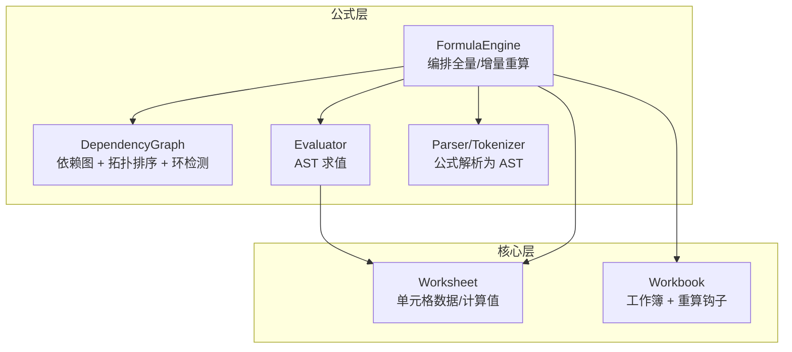
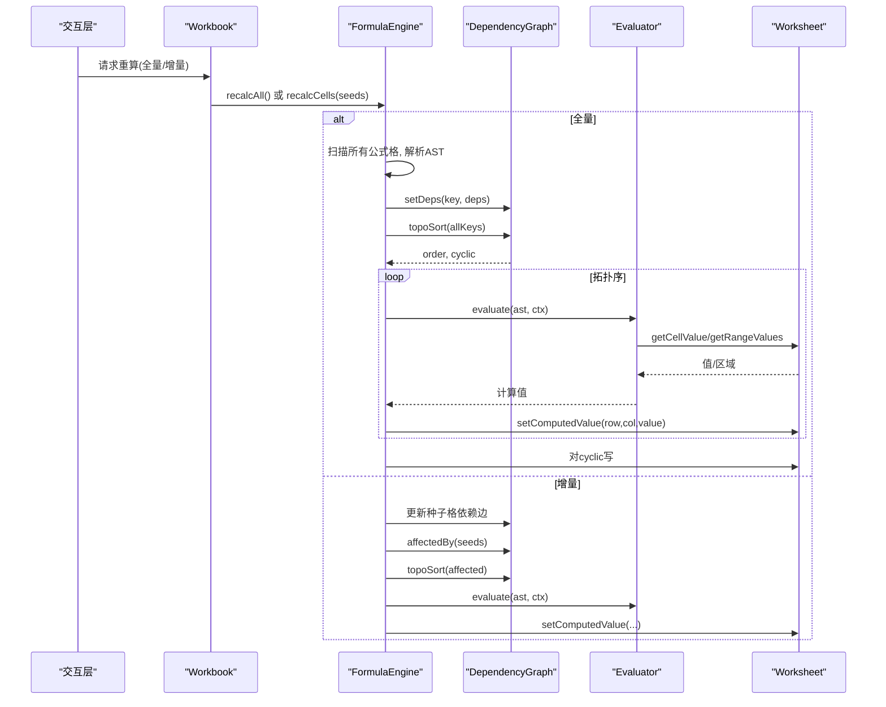
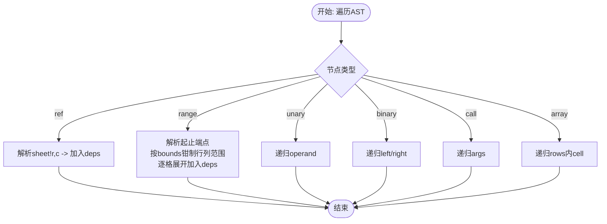
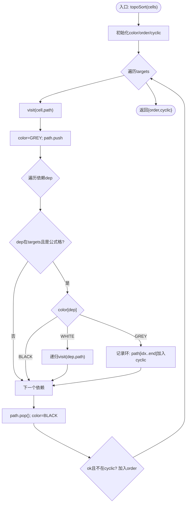
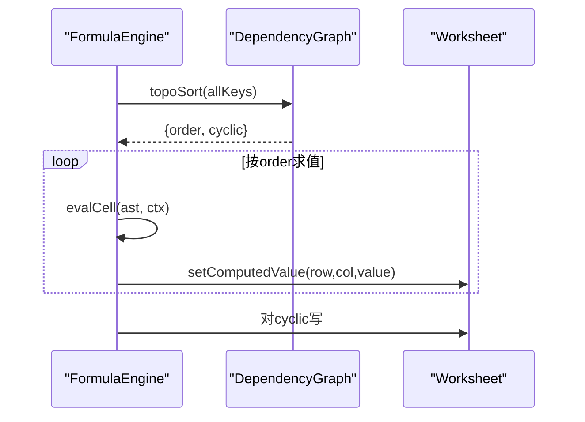
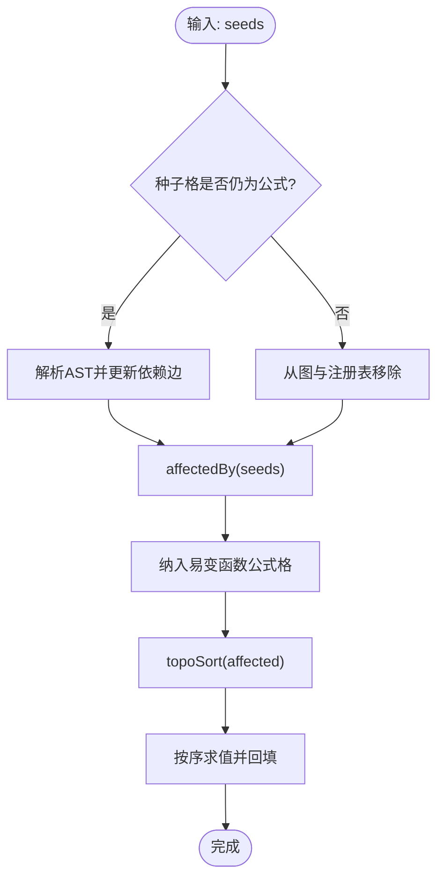
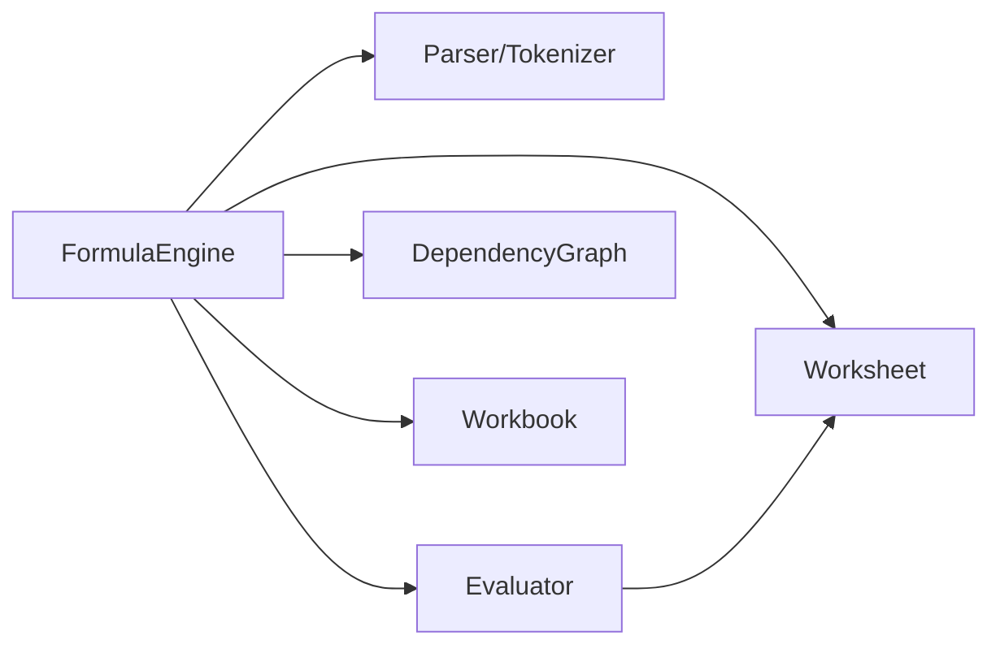

# 依赖图管理

<cite>
**本文引用的文件**
- [DependencyGraph.ts](file://cmx-mega-sheet/src/formula/DependencyGraph.ts)
- [FormulaEngine.ts](file://cmx-mega-sheet/src/formula/Formul aEngine.ts)
- [Evaluator.ts](file://cmx-mega-sheet/src/formula/Evaluator.ts)
- [Worksheet.ts](file://cmx-mega-sheet/src/core/Worksheet.ts)
- [Workbook.ts](file://cmx-mega-sheet/src/core/Workbook.ts)
- [DependencyGraph.test.ts](file://cmx-mega-sheet/test/DependencyGraph.test.ts)
</cite>

## 目录
1. [简介](#简介)
2. [项目结构](#项目结构)
3. [核心组件](#核心组件)
4. [架构总览](#架构总览)
5. [详细组件分析](#详细组件分析)
6. [依赖关系分析](#依赖关系分析)
7. [性能考量](#性能考量)
8. [故障排查指南](#故障排查指南)
9. [结论](#结论)
10. [附录](#附录)

## 简介
本技术文档围绕工作簿中的“依赖图管理系统”展开，聚焦以下目标：
- 依赖图的构建算法：从公式 AST 提取单元格依赖、跨工作表引用处理、区域引用的逐格展开。
- 循环依赖检测：基于三色深度优先搜索的环检测与环上单元格标记机制。
- 拓扑排序：用于确定重算顺序（被依赖者先计算）。
- 增量依赖维护：编辑单元格时如何更新依赖图并仅重算受影响子集。
- 性能优化：依赖缓存、批量更新、易变函数处理等策略。
- 数据结构与流程图：提供清晰的依赖图模型与关键算法流程示意。

## 项目结构
依赖图相关代码位于 cmx-mega-sheet 模块的 formula 与 core 层：
- formula 层负责公式解析、求值、依赖抽取与依赖图管理。
- core 层提供工作表与工作簿的数据模型及重算钩子。

图表来源
- [FormulaEngine.ts:1-289](file://cmx-mega-sheet/src/formula/Formul aEngine.ts#L1-L289)
- [DependencyGraph.ts:1-201](file://cmx-mega-sheet/src/formula/DependencyGraph.ts#L1-L201)
- [Evaluator.ts:1-199](file://cmx-mega-sheet/src/formula/Evaluator.ts#L1-L199)
- [Worksheet.ts:1-800](file://cmx-mega-sheet/src/core/Worksheet.ts#L1-L800)
- [Workbook.ts:1-397](file://cmx-mega-sheet/src/core/Workbook.ts#L1-L397)

章节来源
- [FormulaEngine.ts:1-289](file://cmx-mega-sheet/src/formula/Formul aEngine.ts#L1-L289)
- [DependencyGraph.ts:1-201](file://cmx-mega-sheet/src/formula/DependencyGraph.ts#L1-L201)
- [Evaluator.ts:1-199](file://cmx-mega-sheet/src/formula/Evaluator.ts#L1-L199)
- [Worksheet.ts:1-800](file://cmx-mega-sheet/src/core/Worksheet.ts#L1-L800)
- [Workbook.ts:1-397](file://cmx-mega-sheet/src/core/Workbook.ts#L1-L397)

## 核心组件
- DependencyGraph：维护公式格的出边（依赖）与入边（被依赖者），支持拓扑排序与环检测，并提供受影响闭包查询以支撑增量重算。
- FormulaEngine：装配 Parser/Evaluator/DependencyGraph，实现全量与增量重算；注册 Workbook 的重算钩子；维护解析缓存与公式格注册表。
- Evaluator：对 AST 进行求值，通过 CellAccessor 访问 Worksheet 的值与区域，支持命名区域与上下文敏感函数。
- Worksheet：存储单元格值、公式与计算值，提供 setComputedValue 供引擎回填结果。
- Workbook：管理工作表集合与重算钩子，暴露 requestRecalc/requestRecalcCells 触发重算。

章节来源
- [DependencyGraph.ts:1-201](file://cmx-mega-sheet/src/formula/DependencyGraph.ts#L1-L201)
- [FormulaEngine.ts:1-289](file://cmx-mega-sheet/src/formula/Formul aEngine.ts#L1-L289)
- [Evaluator.ts:1-199](file://cmx-mega-sheet/src/formula/Evaluator.ts#L1-L199)
- [Worksheet.ts:1-800](file://cmx-mega-sheet/src/core/Worksheet.ts#L1-L800)
- [Workbook.ts:1-397](file://cmx-mega-sheet/src/core/Workbook.ts#L1-L397)

## 架构总览
依赖图系统的工作流如下：
- 全量重算：遍历所有工作表的公式格，解析公式得到 AST，抽取依赖并构建依赖图；对所有公式格做拓扑排序，按序求值并回填计算值；将环上单元格标记为 #CIRC!。
- 增量重算：编辑一批种子格后，若依赖图已建立，则仅对种子格自身（若是公式）更新其依赖边；计算受影响闭包（含种子本身若是公式），并对该子集拓扑排序、求值回填；易变函数在每次增量重算中均纳入。

图表来源
- [FormulaEngine.ts:145-243](file://cmx-mega-sheet/src/formula/Formul aEngine.ts#L145-L243)
- [DependencyGraph.ts:142-199](file://cmx-mega-sheet/src/formula/DependencyGraph.ts#L142-L199)
- [Evaluator.ts:62-83](file://cmx-mega-sheet/src/formula/Evaluator.ts#L62-L83)
- [Worksheet.ts:590-603](file://cmx-mega-sheet/src/core/Worksheet.ts#L590-L603)
- [Workbook.ts:231-261](file://cmx-mega-sheet/src/core/Workbook.ts#L231-L261)

## 详细组件分析

### 依赖图构建算法
- 从 AST 抽取依赖：
  - 单格引用 ref：解析 sheet 前缀与行列号，生成 cellKey(sheet,row,col)。
  - 区域引用 range：将起止端点解析为坐标，整列/整行按 bounds 钳制到当前 sheet 维度，逐格展开为依赖集合。
  - 表达式节点（unary/binary/call/array）递归遍历，忽略字面量与函数名。
- 跨工作表引用：
  - 引用文本带 sheet! 前缀时，使用指定 sheet；否则默认使用当前 sheet。
- 区域展开边界：
  - 通过 bounds(sheet) 获取 sheet 的行数与列数，避免对百万级整列/整行进行无界遍历。

图表来源
- [DependencyGraph.ts:26-94](file://cmx-mega-sheet/src/formula/DependencyGraph.ts#L26-L94)
- [FormulaEngine.ts:149-172](file://cmx-mega-sheet/src/formula/Formul aEngine.ts#L149-L172)

章节来源
- [DependencyGraph.ts:26-94](file://cmx-mega-sheet/src/formula/DependencyGraph.ts#L26-L94)
- [FormulaEngine.ts:149-172](file://cmx-mega-sheet/src/formula/Formul aEngine.ts#L149-L172)

### 循环依赖检测算法
- 三色 DFS：
  - 状态：白=未访问、灰=在递归栈中、黑=已完成。
  - 当遇到灰色节点时，说明存在环；从路径中找到环起点，将路径中从该点到当前节点的所有单元格标记为环上。
- 拓扑排序输出：
  - 返回无环部分的拓扑序（order）与环上单元格集合（cyclic）。
- 环上单元格标记：
  - 在全量与增量重算中，将 cyclic 集合对应的单元格写入 #CIRC!。

图表来源
- [DependencyGraph.ts:163-199](file://cmx-mega-sheet/src/formula/DependencyGraph.ts#L163-L199)
- [FormulaEngine.ts:183-194](file://cmx-mega-sheet/src/formula/Formul aEngine.ts#L183-L194)

章节来源
- [DependencyGraph.ts:163-199](file://cmx-mega-sheet/src/formula/DependencyGraph.ts#L163-L199)
- [FormulaEngine.ts:183-194](file://cmx-mega-sheet/src/formula/Formul aEngine.ts#L183-L194)

### 拓扑排序在重算顺序中的应用
- 全量重算：
  - 收集所有公式格 key，调用 topoSort 得到 order；按 order 依次求值并回填计算值。
- 增量重算：
  - 对受影响子集（affectedBy）执行 topoSort，仅重算该子集；易变函数所在公式格每次纳入受影响集合。

图表来源
- [FormulaEngine.ts:175-194](file://cmx-mega-sheet/src/formula/Formul aEngine.ts#L175-L194)
- [DependencyGraph.ts:163-199](file://cmx-mega-sheet/src/formula/DependencyGraph.ts#L163-L199)

章节来源
- [FormulaEngine.ts:175-194](file://cmx-mega-sheet/src/formula/Formul aEngine.ts#L175-L194)
- [DependencyGraph.ts:163-199](file://cmx-mega-sheet/src/formula/DependencyGraph.ts#L163-L199)

### 增量依赖维护的实现
- 种子格自身若是公式：
  - 重新解析 AST，更新其依赖边（setDeps），并更新公式格注册表（formulaCellMap）。
- 若种子格由公式变为普通值：
  - 从依赖图中移除其出边，并从注册表中删除。
- 受影响闭包：
  - 通过 affectedBy(seeds) 计算传递依赖者集合；同时包含种子本身若是公式的情况。
- 易变函数：
  - 每次增量重算将所有含易变函数的公式格纳入受影响集合，确保其值刷新。

图表来源
- [FormulaEngine.ts:206-243](file://cmx-mega-sheet/src/formula/Formul aEngine.ts#L206-L243)
- [DependencyGraph.ts:142-156](file://cmx-mega-sheet/src/formula/DependencyGraph.ts#L142-L156)

章节来源
- [FormulaEngine.ts:206-243](file://cmx-mega-sheet/src/formula/Formul aEngine.ts#L206-L243)
- [DependencyGraph.ts:142-156](file://cmx-mega-sheet/src/formula/DependencyGraph.ts#L142-L156)

### 依赖图数据结构示例
- 键空间：
  - CellKey = `${sheet}!${row},${col}`，sheet 可为空表示同表引用。
- 内部映射：
  - deps: Map<CellKey, Set<CellKey>>，记录每个公式格的直接依赖。
  - dependents: Map<CellKey, Set<CellKey>>，反向索引，用于脏传播与受影响闭包计算。
- 典型场景：
  - B1=A1+1 → deps[B1]={A1}, dependents[A1]={B1}
  - C1=B1*2 → deps[C1]={B1}, dependents[B1]={C1}
  - 受 A1 变化影响：affectedBy([A1])={B1,C1}

章节来源
- [DependencyGraph.ts:15-104](file://cmx-mega-sheet/src/formula/DependencyGraph.ts#L15-L104)
- [DependencyGraph.test.ts:34-73](file://cmx-mega-sheet/test/DependencyGraph.test.ts#L34-L73)

### 算法流程图汇总
- 依赖抽取流程：见“依赖图构建算法”小节。
- 环检测与拓扑排序：见“循环依赖检测算法”与“拓扑排序在重算顺序中的应用”小节。
- 增量重算流程：见“增量依赖维护的实现”小节。

## 依赖关系分析
- FormulaEngine 依赖：
  - Parser/Tokenizer：解析公式为 AST。
  - Evaluator：对 AST 求值。
  - DependencyGraph：构建与维护依赖图，提供拓扑排序与环检测。
  - Worksheet：读取/写入单元格值与计算值。
  - Workbook：注册重算钩子，触发全量/增量重算。
- 耦合与内聚：
  - 公式层与核心层通过接口（CellAccessor、Workbook 钩子）解耦，便于测试与替换。
  - DependencyGraph 纯逻辑、零 DOM，可独立单元测试。

图表来源
- [FormulaEngine.ts:15-28](file://cmx-mega-sheet/src/formula/Formul aEngine.ts#L15-L28)
- [Evaluator.ts:21-31](file://cmx-mega-sheet/src/formula/Evaluator.ts#L21-L31)
- [Workbook.ts:231-261](file://cmx-mega-sheet/src/core/Workbook.ts#L231-L261)

章节来源
- [FormulaEngine.ts:15-28](file://cmx-mega-sheet/src/formula/Formul aEngine.ts#L15-L28)
- [Evaluator.ts:21-31](file://cmx-mega-sheet/src/formula/Evaluator.ts#L21-L31)
- [Workbook.ts:231-261](file://cmx-mega-sheet/src/core/Workbook.ts#L231-L261)

## 性能考量
- 依赖缓存：
  - 解析缓存：FormulaEngine.parseCache 缓存 AST 与解析错误，避免重复解析。
- 批量更新机制：
  - 全量重算一次性重建依赖图并按拓扑序批量求值回填。
  - 增量重算仅对受影响子集拓扑排序与求值，降低 O(全簿) 到 O(受影响)。
- 区域展开优化：
  - 整列/整行依赖通过 bounds 钳制到 sheet 维度，避免遍历百万格。
- 易变函数处理：
  - 增量重算时将含易变函数的公式格纳入受影响集合，保证正确性。
- 内存与复杂度：
  - 依赖图使用 Map/Set，增删改操作近似 O(1)；拓扑排序 O(V+E)；受影响闭包 BFS/DFS 近似 O(V+E)。

章节来源
- [FormulaEngine.ts:69-80](file://cmx-mega-sheet/src/formula/Formul aEngine.ts#L69-L80)
- [FormulaEngine.ts:149-172](file://cmx-mega-sheet/src/formula/Formul aEngine.ts#L149-L172)
- [FormulaEngine.ts:206-243](file://cmx-mega-sheet/src/formula/Formul aEngine.ts#L206-L243)
- [DependencyGraph.ts:142-199](file://cmx-mega-sheet/src/formula/DependencyGraph.ts#L142-L199)

## 故障排查指南
- 循环依赖：
  - 现象：单元格显示 #CIRC!。
  - 排查：检查是否存在 A→B→A 或自引用 A→A；查看 topoSort 返回的 cyclic 集合。
- 解析错误：
  - 现象：单元格显示 #NAME? 或 #VALUE!。
  - 排查：检查 parseCache 中对应公式的 error 字段；确认函数名与命名区域是否正确。
- 区域越界：
  - 现象：#REF!。
  - 排查：确认引用 sheet 是否存在、行列是否在范围内；整列/整行是否被 bounds 正确钳制。
- 增量重算未生效：
  - 现象：修改种子格后下游未更新。
  - 排查：确认 graphBuilt 标志；检查 affectedBy 是否包含下游；确认易变函数是否纳入。

章节来源
- [FormulaEngine.ts:183-194](file://cmx-mega-sheet/src/formula/Formul aEngine.ts#L183-L194)
- [FormulaEngine.ts:259-272](file://cmx-mega-sheet/src/formula/Formul aEngine.ts#L259-L272)
- [DependencyGraph.ts:163-199](file://cmx-mega-sheet/src/formula/DependencyGraph.ts#L163-L199)
- [DependencyGraph.test.ts:87-127](file://cmx-mega-sheet/test/DependencyGraph.test.ts#L87-L127)

## 结论
依赖图管理系统通过 AST 驱动的依赖抽取、三色 DFS 的环检测与拓扑排序，实现了高效、正确的公式重算。全量与增量两种模式兼顾了初始构建与频繁编辑场景的性能需求。依赖缓存、区域展开边界钳制与易变函数处理进一步提升了鲁棒性与效率。建议在大规模表格中优先采用增量重算，并结合合理的区域设计以避免不必要的逐格展开。

## 附录
- 关键 API 与职责速查：
  - extractDeps：从 AST 抽取依赖集合。
  - DependencyGraph.setDeps/clearDeps：维护依赖边。
  - DependencyGraph.topoSort：拓扑排序与环检测。
  - DependencyGraph.affectedBy：计算受影响闭包。
  - FormulaEngine.recalcAll/recalcCells：全量/增量重算入口。
  - Worksheet.setComputedValue：回填计算值。
  - Workbook.requestRecalc/requestRecalcCells：触发重算。

章节来源
- [DependencyGraph.ts:26-199](file://cmx-mega-sheet/src/formula/DependencyGraph.ts#L26-L199)
- [FormulaEngine.ts:145-289](file://cmx-mega-sheet/src/formula/Formul aEngine.ts#L145-L289)
- [Worksheet.ts:590-603](file://cmx-mega-sheet/src/core/Worksheet.ts#L590-L603)
- [Workbook.ts:231-261](file://cmx-mega-sheet/src/core/Workbook.ts#L231-L261)