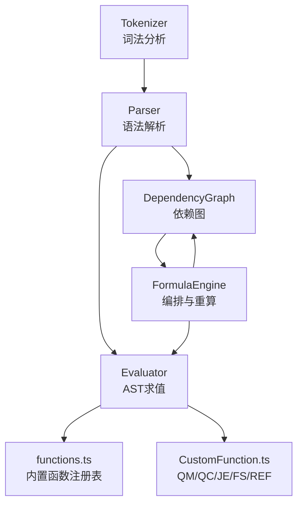
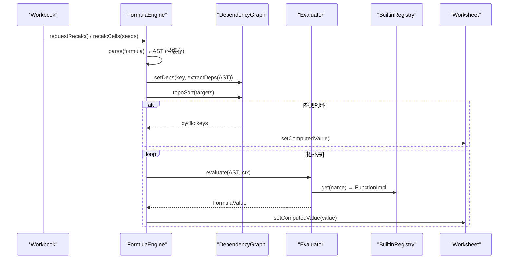
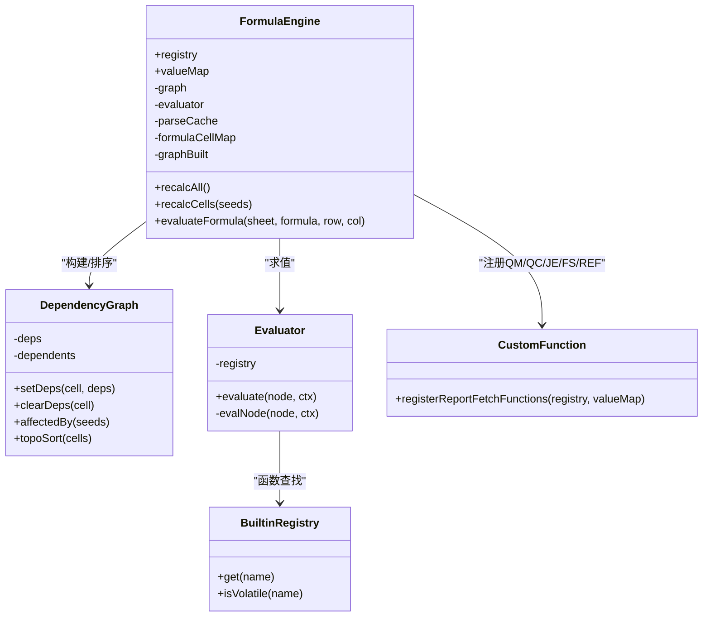

# 公式计算引擎

<cite>
**本文引用的文件**
- [FormulaEngine.ts](file://cmx-mega-sheet/src/formula/FormulaEngine.ts)
- [Parser.ts](file://cmx-mega-sheet/src/formula/Parser.ts)
- [Tokenizer.ts](file://cmx-mega-sheet/src/formula/Tokenizer.ts)
- [DependencyGraph.ts](file://cmx-mega-sheet/src/formula/DependencyGraph.ts)
- [Evaluator.ts](file://cmx-mega-sheet/src/formula/Evaluator.ts)
- [functions.ts](file://cmx-mega-sheet/src/formula/functions.ts)
- [CustomFunction.ts](file://cmx-mega-sheet/src/formula/CustomFunction.ts)
- [value.ts](file://cmx-mega-sheet/src/formula/value.ts)
- [math.ts](file://cmx-mega-sheet/src/formula/builtins/math.ts)
- [FormulaEngine.test.ts](file://cmx-mega-sheet/test/FormulaEngine.test.ts)
- [Parser.test.ts](file://cmx-mega-sheet/test/Parser.test.ts)
- [DependencyGraph.test.ts](file://cmx-mega-sheet/test/DependencyGraph.test.ts)
</cite>

## 目录
1. [简介](#简介)
2. [项目结构](#项目结构)
3. [核心组件](#核心组件)
4. [架构总览](#架构总览)
5. [详细组件分析](#详细组件分析)
6. [依赖关系分析](#依赖关系分析)
7. [性能考量](#性能考量)
8. [故障排查指南](#故障排查指南)
9. [结论](#结论)
10. [附录：开发指南与调试](#附录：开发指南与调试)

## 简介
本技术文档围绕 cmx-mega-sheet 中的“公式计算引擎”展开，系统性说明以下能力：
- 词法分析（Tokenizer）的令牌识别机制
- 语法解析（Parser）的优先级爬升算法与 AST 构建
- 依赖图（DependencyGraph）的构建、拓扑排序与循环依赖检测
- 求值器（Evaluator）的执行流程、上下文敏感函数与缓存策略
- 内置函数库与自定义函数注册机制
- 全量与增量重算的性能优化
- 公式开发指南与调试方法

该引擎以纯逻辑实现，零 DOM 依赖，便于在 Node 环境下进行单测与离线验证。

## 项目结构
公式引擎位于 cmx-mega-sheet/src/formula 目录，按职责分层组织：
- Tokenizer：将公式字符串切分为 token 流
- Parser：基于 Pratt/优先级爬升将 token 流解析为 AST
- DependencyGraph：维护单元格间的依赖关系，提供拓扑排序与环检测
- Evaluator：遍历 AST 执行求值，调用函数注册表
- functions：内置函数注册表（聚合、数学、文本、日期、查找等）
- CustomFunction：报表取数函数 QM/QC/JE/FS/REF 的注册与查表
- value：统一值类型、错误类型与转换工具
- FormulaEngine：编排层，串联解析、建图、求值与回填

图表来源
- [Tokenizer.ts:1-200](file://cmx-mega-sheet/src/formula/Tokenizer.ts#L1-L200)
- [Parser.ts:1-199](file://cmx-mega-sheet/src/formula/Parser.ts#L1-L199)
- [DependencyGraph.ts:1-201](file://cmx-mega-sheet/src/formula/DependencyGraph.ts#L1-L201)
- [Evaluator.ts:1-199](file://cmx-mega-sheet/src/formula/Evaluator.ts#L1-L199)
- [functions.ts:1-800](file://cmx-mega-sheet/src/formula/functions.ts#L1-L800)
- [CustomFunction.ts:1-79](file://cmx-mega-sheet/src/formula/CustomFunction.ts#L1-L79)
- [FormulaEngine.ts:1-289](file://cmx-mega-sheet/src/formula/FormulaEngine.ts#L1-L289)

章节来源
- [FormulaEngine.ts:1-289](file://cmx-mega-sheet/src/formula/FormulaEngine.ts#L1-L289)
- [Tokenizer.ts:1-200](file://cmx-mega-sheet/src/formula/Tokenizer.ts#L1-L200)
- [Parser.ts:1-199](file://cmx-mega-sheet/src/formula/Parser.ts#L1-L199)
- [DependencyGraph.ts:1-201](file://cmx-mega-sheet/src/formula/DependencyGraph.ts#L1-L201)
- [Evaluator.ts:1-199](file://cmx-mega-sheet/src/formula/Evaluator.ts#L1-L199)
- [functions.ts:1-800](file://cmx-mega-sheet/src/formula/functions.ts#L1-L800)
- [CustomFunction.ts:1-79](file://cmx-mega-sheet/src/formula/CustomFunction.ts#L1-L79)

## 核心组件
- 词法分析器（Tokenizer）：负责将公式源串切分为数字、字符串、引用、区域、标识符、运算符、括号、逗号、分号、冒号、百分号、EOF 等 token，并处理整列/整行区域的特殊匹配顺序，避免误判。
- 语法解析器（Parser）：采用优先级爬升（Pratt）解析中缀表达式，支持比较、连接、加减、乘除、幂（右结合）、一元正负、尾随百分号、函数调用、单元格/区域引用、数组字面量、命名/布尔字面。
- 依赖图（DependencyGraph）：从 AST 抽取单元格依赖，维护正向与反向边，提供受影响闭包计算、拓扑排序与三色 DFS 环检测。
- 求值器（Evaluator）：对 AST 节点递归求值，处理标量/区域、名称解析、算术/比较/连接、函数调用；通过 CellAccessor 抽象访问工作簿数据。
- 内置函数库（functions.ts）：覆盖聚合、数学、统计、数据库、文本、日期、查找/引用等常用函数族，并通过扩展模块（builtins/*）集中管理。
- 自定义函数（CustomFunction.ts）：注册 QM/QC/JE/FS/REF 五个报表取数函数，基于 ReportValueMap 按所在格取值，标记为易变（volatile）。
- 编排层（FormulaEngine）：绑定 Workbook，提供全量/增量重算、直接求值、解析缓存、持久化公式格注册表、易变函数纳入策略。

章节来源
- [Tokenizer.ts:1-200](file://cmx-mega-sheet/src/formula/Tokenizer.ts#L1-L200)
- [Parser.ts:1-199](file://cmx-mega-sheet/src/formula/Parser.ts#L1-L199)
- [DependencyGraph.ts:1-201](file://cmx-mega-sheet/src/formula/DependencyGraph.ts#L1-L201)
- [Evaluator.ts:1-199](file://cmx-mega-sheet/src/formula/Evaluator.ts#L1-L199)
- [functions.ts:1-800](file://cmx-mega-sheet/src/formula/functions.ts#L1-L800)
- [CustomFunction.ts:1-79](file://cmx-mega-sheet/src/formula/CustomFunction.ts#L1-L79)
- [FormulaEngine.ts:1-289](file://cmx-mega-sheet/src/formula/FormulaEngine.ts#L1-L289)

## 架构总览
公式引擎的整体流程如下：
- 编辑或导入后触发 Workbook 的重算钩子，FormulaEngine 执行全量或增量重算
- 扫描所有含公式的单元格，解析公式为 AST，提取依赖并更新依赖图
- 对依赖图进行拓扑排序，检测环并将环上单元格标记为 #CIRC!
- 按拓扑序调用 Evaluator 求值，将结果写回单元格的计算值
- 对于易变函数（如 QM/QC/JE/FS/REF），每次重算都会纳入计算范围

图表来源
- [FormulaEngine.ts:149-198](file://cmx-mega-sheet/src/formula/FormulaEngine.ts#L149-L198)
- [DependencyGraph.ts:163-199](file://cmx-mega-sheet/src/formula/DependencyGraph.ts#L163-L199)
- [Evaluator.ts:62-83](file://cmx-mega-sheet/src/formula/Evaluator.ts#L62-L83)
- [functions.ts:63-355](file://cmx-mega-sheet/src/formula/functions.ts#L63-L355)

## 详细组件分析

### 词法分析器（Tokenizer）
- 令牌类型：number、string、ref、range、ident、op、lparen、rparen、lbrace、rbrace、comma、semicolon、colon、percent、eof
- 关键规则：
  - 跳过空白与隐式交集符号 @
  - 字符串支持转义双引号
  - 优先匹配整行区域（1:1/2:5）与整列区域（A:A/$A:$C），避免被数字或标识符分支吞掉
  - 引用匹配 Sheet!A1/A1/$A$1，并在紧跟 '(' 或更长标识符时退化为 ident，避免误判函数名为引用
  - 运算符支持双字符组合（<> <= >=）
  - 末尾追加 EOF token 供解析器终止

复杂度与边界：
- 线性扫描 O(n)，正则匹配常数时间
- 对超长公式与超大区域引用有保护（后续依赖图与访问器钳制到 sheet 维度）

章节来源
- [Tokenizer.ts:1-200](file://cmx-mega-sheet/src/formula/Tokenizer.ts#L1-L200)

### 语法解析器（Parser）
- 使用 Pratt/优先级爬升解析中缀表达式，定义二元运算符优先级与右结合性（^ 右结合）
- 支持：
  - 一元前缀 + 与 -，以及后缀 %（建模为 unary '%'）
  - 函数调用 name(...)，参数列表逗号分隔
  - 单元格引用 ref 与区域 range（start/end 为引用文本）
  - 数组字面量 {1,2;3,4}（逗号分列、分号分行）
  - 命名/布尔字面（TRUE/FALSE/命名区域）
- 错误处理：空公式、多余记号、不匹配的括号均抛出解析错误

复杂度：
- 解析过程近似 O(n)，AST 大小与公式长度成正比

章节来源
- [Parser.ts:1-199](file://cmx-mega-sheet/src/formula/Parser.ts#L1-L199)

### 依赖图（DependencyGraph）
- 从 AST 抽取依赖：
  - ref → 单格键
  - range → 展开为逐格键（整列/整行按 bounds 钳到 sheet 维度）
  - 其他节点（unary/binary/call/array）递归收集
- 数据结构：
  - deps：公式格 → 依赖集合
  - dependents：格键 → 依赖它的公式格集合（反向边）
- 算法：
  - affectedBy：从种子格出发沿反向边传播，得到受影响闭包
  - topoSort：三色 DFS（白/灰/黑）进行拓扑排序，灰→灰即环，记录环上格
- 性能：
  - 设依赖/清除依赖 O(k)（k 为依赖数量）
  - 拓扑排序 O(V+E)，V 为目标集大小，E 为依赖边数

章节来源
- [DependencyGraph.ts:22-94](file://cmx-mega-sheet/src/formula/DependencyGraph.ts#L22-L94)
- [DependencyGraph.ts:100-199](file://cmx-mega-sheet/src/formula/DependencyGraph.ts#L100-L199)

### 求值器（Evaluator）
- 求值入口 evaluate(node, ctx)：
  - 若结果为区域，落到标量上下文取左上角
- 节点求值：
  - number/string/name/ref/range/array/unary/binary/call
- 名称解析：
  - 先尝试 resolveNameRef（命名区域→引用文本，再按 ref/range 求值）
  - 再尝试 resolveName（标量命名/TRUE/FALSE）
  - 未知返回 #NAME?
- 算术与比较：
  - 比较操作使用 compareValues，遵循 Excel 类型排序
  - 连接 & 使用 toText
  - 算术使用 toNumber，除零返回 #DIV/0!，溢出返回 #NUM!
- 函数调用：
  - 通过 registry.get(name) 获取实现，传入已求值的实参与上下文
  - 捕获异常返回 #VALUE!

章节来源
- [Evaluator.ts:21-158](file://cmx-mega-sheet/src/formula/Evaluator.ts#L21-L158)
- [value.ts:14-131](file://cmx-mega-sheet/src/formula/value.ts#L14-L131)

### 内置函数库（functions.ts）
- 覆盖类别：
  - 聚合：SUM/AVERAGE/COUNT/COUNTA/COUNTBLANK/MAX/MIN/SUBTOTAL 等
  - 多条件聚合：SUMIFS/COUNTIFS/AVERAGEIFS/MAXIFS/MINIFS
  - 数学/取整：ABS/ROUND/ROUNDDOWN/ROUNDUP/INT/TRUNC/MOD/POWER/SQRT/MROUND/CEILING/FLOOR/EVEN/ODD/SIGN/GCD/LCM/SUMSQ/PRODUCT/SUMPRODUCT/MEDIAN/MODE/VAR/STDEV/RANK/LARGE/SMALL/PERCENTILE
  - 逻辑：IF/IFERROR/IFNA/AND/OR/NOT/TRUE/FALSE/ISBLANK/ISERROR/ISNUMBER/ISTEXT/ISEMPTY/COALESCE/IFS/SWITCH/ISNA/ISERR/ISLOGICAL/ISNONTEXT/ISODD/ISEVEN/NA/N/T/TYPE
  - 文本：CONCATENATE/CONCAT/LEFT/RIGHT/MID/LEN/TRIM/UPPER/LOWER/TEXT/VALUE/TEXTJOIN/SUBSTITUTE/REPLACE/FIND/SEARCH/REPT/PROPER/EXACT/CHAR/CODE/UNICHAR/UNICODE/NUMBERVALUE
  - 查找/引用：MATCH/VLOOKUP/HLOOKUP/LOOKUP/INDEX/CHOOSE/XLOOKUP/ROWS/COLUMNS/ROW/COLUMN
  - 日期时间：DATE/TIME/YEAR/MONTH/DAY/HOUR/MINUTE/SECOND/WEEKDAY/EDATE/EOMONTH/DATEDIF/DATEVALUE/TODAY/NOW/NETWORKDAYS/DAYS/DAYS360/YEARFRAC/WEEKNUM/ISOWEEKNUM/TIMEVALUE/WORKDAY/WORKDAY.INTL/NETWORKDAYS.INTL
  - M17 扩展：通过 builtins/math、financial、statistical、database、textref、engineering 汇入
- 辅助工具：
  - numericValues：过滤空与文本，仅保留数值参与聚合
  - matchesCriteria：支持运算符前缀与通配符匹配
  - textFormat：复用渲染格式化引擎，保证显示一致

章节来源
- [functions.ts:1-800](file://cmx-mega-sheet/src/formula/functions.ts#L1-L800)
- [math.ts:1-200](file://cmx-mega-sheet/src/formula/builtins/math.ts#L1-L200)

### 自定义函数（CustomFunction.ts）
- 报表取数函数：QM/QC/JE/FS/REF
- 语义：
  - 上下文敏感：按「所在格」从 ReportValueMap 取值
  - 易变（volatile）：map 更新后必须重算
  - 缺/空/非数值 → 0，数字字符串 → 数字
- 注册：registerReportFetchFunctions 将五个函数注册到 BuiltinRegistry，并标记 volatile

章节来源
- [CustomFunction.ts:1-79](file://cmx-mega-sheet/src/formula/CustomFunction.ts#L1-L79)

### 编排层（FormulaEngine）
- 职责：
  - 绑定 Workbook，设置重算钩子（全量与增量）
  - 解析缓存：parseCache 存储 AST 或解析错误
  - 持久化公式格注册表：formulaCellMap 用于增量重算
  - 全量重算 recalcAll：
    - 扫描所有公式格，解析并提取依赖，重建依赖图
    - 拓扑排序，环上格标记 #CIRC!
    - 按序求值并回填
  - 增量重算 recalcCells：
    - 未建图则退化全量
    - 对种子格更新依赖（若仍为公式）或移除（若改回普通值）
    - 计算受影响闭包（包含种子本身若是公式）
    - 易变公式格每次纳入
    - 拓扑排序受影响子集并求值回填
  - 直接求值 evaluateFormula：不落格，供预览/聚合层使用

章节来源
- [FormulaEngine.ts:36-289](file://cmx-mega-sheet/src/formula/FormulaEngine.ts#L36-L289)

## 依赖关系分析
- 组件耦合：
  - FormulaEngine 依赖 Parser、DependencyGraph、Evaluator、BuiltinRegistry、CustomFunction
  - Evaluator 依赖 FunctionRegistry、value 工具
  - DependencyGraph 依赖 address 工具与 AST 类型
  - functions.ts 汇总各 builtins 模块，形成统一注册表
- 外部依赖：
  - core/address：地址解析与行列转换
  - render/numFmt：文本格式化（TEXT 函数）
  - core/dateSerial：日期序列号转换
- 潜在循环：
  - 依赖图通过三色 DFS 检测环，避免死循环求值
  - 易变函数通过 isVolatile 标记，确保每次重算纳入

图表来源
- [FormulaEngine.ts:36-289](file://cmx-mega-sheet/src/formula/FormulaEngine.ts#L36-L289)
- [DependencyGraph.ts:100-199](file://cmx-mega-sheet/src/formula/DependencyGraph.ts#L100-L199)
- [Evaluator.ts:59-158](file://cmx-mega-sheet/src/formula/Evaluator.ts#L59-L158)
- [CustomFunction.ts:71-79](file://cmx-mega-sheet/src/formula/CustomFunction.ts#L71-L79)

章节来源
- [FormulaEngine.ts:36-289](file://cmx-mega-sheet/src/formula/FormulaEngine.ts#L36-L289)
- [DependencyGraph.ts:100-199](file://cmx-mega-sheet/src/formula/DependencyGraph.ts#L100-L199)
- [Evaluator.ts:59-158](file://cmx-mega-sheet/src/formula/Evaluator.ts#L59-L158)
- [CustomFunction.ts:71-79](file://cmx-mega-sheet/src/formula/CustomFunction.ts#L71-L79)

## 性能考量
- 解析缓存：FormulaEngine.parseCache 避免重复解析相同公式
- 依赖图增量维护：recalcCells 仅更新受影响的公式格及其依赖者
- 区域钳制：整列/整行依赖与取值钳到 sheet 维度，避免百万格遍历
- 易变函数纳入：QM/QC/JE/FS/REF 每次重算都纳入，保证正确性
- 函数族模块化：builtins/* 按族组织，便于扩展与维护
- 错误短路：toNumber/toText/toBoolean 快速失败，减少无效计算

[本节为通用性能讨论，无需特定文件来源]

## 故障排查指南
- 常见错误值：
  - #DIV/0!：除零
  - #VALUE!：类型错误或函数异常
  - #REF!：越界或无效 sheet
  - #NAME?：未知命名或函数名
  - #NUM!：数值域外或溢出
  - #N/A：未找到匹配项
  - #SPILL!：动态数组溢出受阻（预留）
  - #CIRC!：循环引用
- 定位方法：
  - 检查解析错误：Parser 抛出 FormulaParseError，包含位置信息
  - 检查词法错误：Tokenizer 抛出 FormulaLexError，包含位置信息
  - 检查依赖环：DependencyGraph.topoSort 返回 cyclic 集合
  - 检查函数实现：Evaluator.evalCall 捕获异常返回 #VALUE!
- 调试建议：
  - 使用 evaluateFormula 直接求值，不落格
  - 查看 ReportValueMap.raw() 确认取数映射
  - 通过测试用例对照行为（见 test 目录）

章节来源
- [value.ts:14-32](file://cmx-mega-sheet/src/formula/value.ts#L14-L32)
- [Parser.ts:29-68](file://cmx-mega-sheet/src/formula/Parser.ts#L29-L68)
- [Tokenizer.ts:50-55](file://cmx-mega-sheet/src/formula/Tokenizer.ts#L50-L55)
- [DependencyGraph.ts:163-199](file://cmx-mega-sheet/src/formula/DependencyGraph.ts#L163-L199)
- [Evaluator.ts:148-157](file://cmx-mega-sheet/src/formula/Evaluator.ts#L148-L157)

## 结论
公式计算引擎通过清晰的层次划分与严格的依赖管理，实现了高效、可扩展的公式解析与求值能力。其核心优势包括：
- 高性能的词法与语法解析
- 精确的依赖图构建与拓扑排序
- 完善的内置函数库与自定义函数扩展机制
- 全量与增量重算兼顾正确性与性能
- 丰富的错误处理与调试支持

该引擎为复杂表格场景提供了稳定可靠的计算基础。

[本节为总结性内容，无需特定文件来源]

## 附录：开发指南与调试
- 开发新函数：
  - 在 functions.ts 或对应 builtins/* 中添加实现
  - 如需上下文敏感或易变，参考 CustomFunction 注册方式
  - 使用 Evaluator 提供的 flattenArg/scalarArg/firstError 等工具
- 调试技巧：
  - 使用 Parser.test.ts 与 Tokenizer.test.ts 验证解析与词法
  - 使用 DependencyGraph.test.ts 验证依赖抽取与拓扑排序
  - 使用 FormulaEngine.test.ts 进行端到端验证（含跨表、命名区域、数组字面量）
- 最佳实践：
  - 避免大范围区域引用导致性能问题
  - 合理使用易变函数，控制重算范围
  - 利用解析缓存与增量重算提升效率

章节来源
- [Parser.test.ts:1-111](file://cmx-mega-sheet/test/Parser.test.ts#L1-L111)
- [DependencyGraph.test.ts:1-128](file://cmx-mega-sheet/test/DependencyGraph.test.ts#L1-L128)
- [FormulaEngine.test.ts:1-161](file://cmx-mega-sheet/test/FormulaEngine.test.ts#L1-L161)