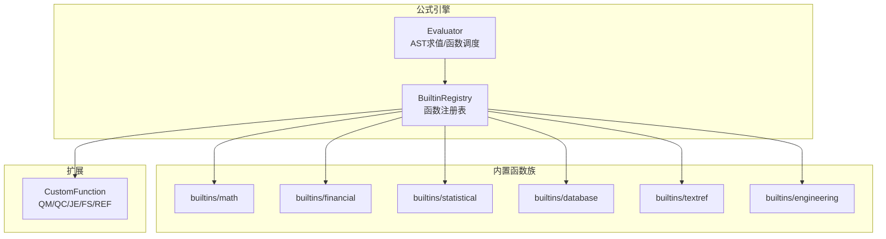
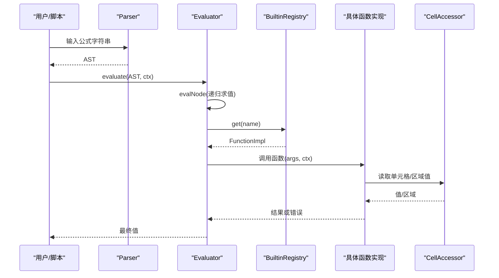
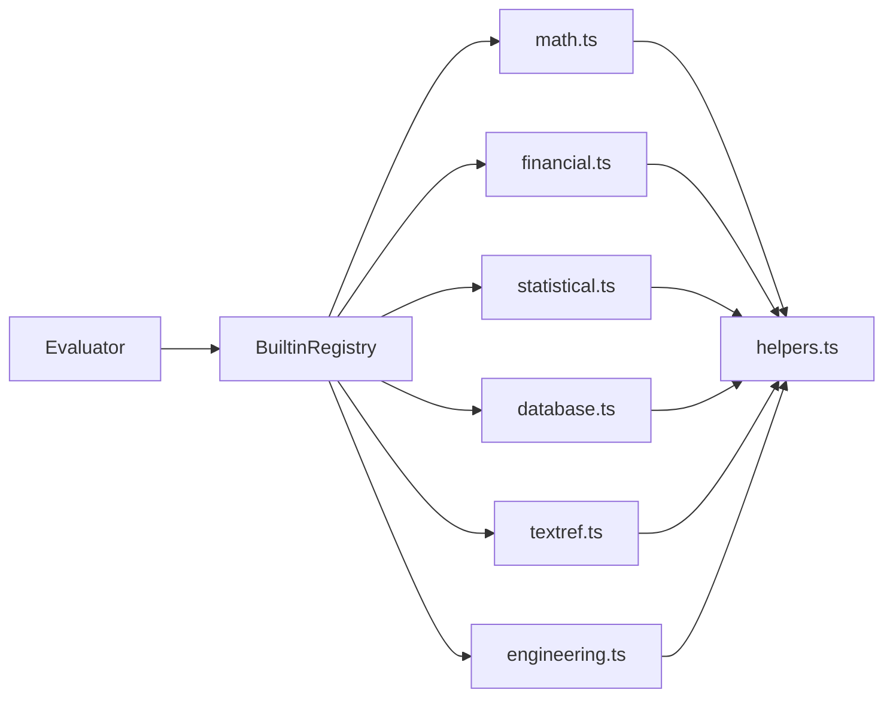

# 内置函数库

<cite>
**本文引用的文件**
- [functions.ts](file://cmx-mega-sheet/src/formula/functions.ts)
- [Evaluator.ts](file://cmx-mega-sheet/src/formula/Evaluator.ts)
- [CustomFunction.ts](file://cmx-mega-sheet/src/formula/CustomFunction.ts)
- [math.ts](file://cmx-mega-sheet/src/formula/builtins/math.ts)
- [financial.ts](file://cmx-mega-sheet/src/formula/builtins/financial.ts)
- [statistical.ts](file://cmx-mega-sheet/src/formula/builtins/statistical.ts)
- [database.ts](file://cmx-mega-sheet/src/formula/builtins/database.ts)
- [textref.ts](file://cmx-mega-sheet/src/formula/builtins/textref.ts)
- [engineering.ts](file://cmx-mega-sheet/src/formula/builtins/engineering.ts)
- [functionsM17.test.ts](file://cmx-mega-sheet/test/functionsM17.test.ts)
</cite>

## 目录
1. [简介](#简介)
2. [项目结构](#项目结构)
3. [核心组件](#核心组件)
4. [架构总览](#架构总览)
5. [详细组件分析](#详细组件分析)
6. [依赖关系分析](#依赖关系分析)
7. [性能考量](#性能考量)
8. [故障排查指南](#故障排查指南)
9. [结论](#结论)
10. [附录：函数参考与示例](#附录函数参考与示例)

## 简介
本仓库的内置函数库位于 cmx-mega-sheet 的公式引擎中，提供数学、统计、文本引用、数据库、工程、财务等类别的函数实现，并通过统一的注册表机制集中管理。该引擎以“纯逻辑、零 DOM”的方式运行，支持区域（二维数组）与标量参数、条件匹配、日期序列号、复数运算、单位换算等能力，并与报表取数自定义函数（QM/QC/JE/FS/REF）集成。

## 项目结构
- 公式求值器与注册表
  - Evaluator：AST 求值、名称解析、函数调用调度、错误处理
  - functions：内置函数注册表（核心 + M17 各族扩展），汇总所有函数名到实现的映射
  - CustomFunction：报表取数自定义函数的注册与上下文敏感取值
- 函数族模块
  - builtins/math：数学、三角、组合、进制、取整兄弟、随机等
  - builtins/financial：年金、投资评估、折旧、利率换算等
  - builtins/statistical：均值家族、离差、双变量回归、分位、正态分布等
  - builtins/database：D 函数族（DSUM/DAVERAGE/DCOUNT/…）
  - builtins/textref：现代文本、地址/间接引用、信息/逻辑函数
  - builtins/engineering：进制转换、位运算、误差函数、贝塞尔、单位换算、复数
- 测试
  - test/functionsM17.test.ts：覆盖各函数族的典型用例与边界断言

**图表来源**
- [Evaluator.ts:59-157](file://cmx-mega-sheet/src/formula/Evaluator.ts#L59-L157)
- [functions.ts:63-355](file://cmx-mega-sheet/src/formula/functions.ts#L63-L355)
- [CustomFunction.ts:71-78](file://cmx-mega-sheet/src/formula/CustomFunction.ts#L71-L78)

**章节来源**
- [Evaluator.ts:1-199](file://cmx-mega-sheet/src/formula/Evaluator.ts#L1-L199)
- [functions.ts:1-355](file://cmx-mega-sheet/src/formula/functions.ts#L1-L355)
- [CustomFunction.ts:1-79](file://cmx-mega-sheet/src/formula/CustomFunction.ts#L1-L79)

## 核心组件
- 求值器（Evaluator）
  - 负责 AST 节点求值、名称解析、二元/一元运算、函数调用、区域展开为二维值、在标量上下文中取左上角
  - 统一错误传播与类型转换（toNumber/toText/toBoolean）
- 函数注册表（BuiltinRegistry）
  - 由 functions.ts 构建，聚合核心函数与 M17 各族函数，形成统一命名空间
  - 支持 volatile 标记（如 QM/QC/…）用于依赖图重算
- 自定义函数（CustomFunction）
  - 将 QM/QC/JE/FS/REF 注册为易变函数，按当前所在格从 ReportValueMap 查值，缺/空/非数值返回 0

**章节来源**
- [Evaluator.ts:59-157](file://cmx-mega-sheet/src/formula/Evaluator.ts#L59-L157)
- [functions.ts:63-355](file://cmx-mega-sheet/src/formula/functions.ts#L63-L355)
- [CustomFunction.ts:20-78](file://cmx-mega-sheet/src/formula/CustomFunction.ts#L20-L78)

## 架构总览
下图展示了公式从解析到执行的关键路径，以及内置函数族如何被注册并参与计算。

**图表来源**
- [Evaluator.ts:62-157](file://cmx-mega-sheet/src/formula/Evaluator.ts#L62-L157)
- [functions.ts:63-355](file://cmx-mega-sheet/src/formula/functions.ts#L63-L355)

## 详细组件分析

### 数学函数（Math）
- 覆盖范围
  - 常量与指数对数：PI、EXP、LN、LOG、LOG10、SQRTPI
  - 三角与反三角：SIN/COS/TAN/ASIN/ACOS/ATAN/ATAN2/SINH/COSH/TANH/ASINH/ACOSH/ATANH/SEC/CSC/COT/SECH/CSCH/COTH/ACOT/ACOTH
  - 角度转换：DEGREES/RADIANS
  - 组合数学：FACT、FACTDOUBLE、COMBIN、COMBINA、PERMUT、PERMUTATIONA、MULTINOMIAL、QUOTIENT
  - 取整兄弟：CEILING.MATH/FLOOR.MATH、CEILING.PRECISE/FLOOR.PRECISE/ISO.CEILING
  - 进制与罗马：BASE、DECIMAL、ROMAN、ARABIC
  - 级数与随机：SERIESSUM、RAND、RANDBETWEEN
- 关键行为
  - 域外/溢出返回 #NUM!；非法参数返回 #VALUE!
  - 有限性校验统一封装（finite）
- 复杂度与性能
  - 多数 O(1)；组合/级数随参数规模线性增长
  - 避免大数溢出，阶乘/组合采用逐步约分

**章节来源**
- [math.ts:127-264](file://cmx-mega-sheet/src/formula/builtins/math.ts#L127-L264)
- [functions.ts:63-148](file://cmx-mega-sheet/src/formula/functions.ts#L63-L148)

### 统计函数（Statistical）
- 覆盖范围
  - 均值家族：GEOMEAN、HARMEAN、TRIMMEAN、AVERAGEA、MAXA/MINA、STDEVA/STDEVPA/VARA/VARPA
  - 离差：DEVSQ、AVEDEV、SKEW/SKEW.P、KURT
  - 双变量：CORREL/PEARSON、RSQ、SLOPE、INTERCEPT、COVAR/COVARIANCE.S/P、STEYX、FORECAST/FORECAST.LINEAR
  - 次序/分位：QUARTILE/QUARTILE.INC/EXC、PERCENTRANK/INC/EXC、RANK.AVG
  - 正态分布：NORM.DIST/NORMDIST、NORM.S.DIST/NORMSDIST、NORM.INV/NORMINV、NORM.S.INV/NORMSINV、STANDARDIZE、CONFIDENCE.NORM/CONFIDENCE、GAUSS、PHI
- 关键行为
  - A 变体将文本视为 0、布尔 1/0；成对缺失跳过
  - 回归/协方差/相关系数基于样本/总体区分
  - 正态 CDF/逆 CDF 使用近似算法保证精度与性能
- 复杂度与性能
  - 均值/方差 O(n)；排序类（分位/百分位）O(n log n)
  - 回归/协方差 O(n)

**章节来源**
- [statistical.ts:136-405](file://cmx-mega-sheet/src/formula/builtins/statistical.ts#L136-L405)
- [functions.ts:148-164](file://cmx-mega-sheet/src/formula/functions.ts#L148-L164)

### 文本引用函数（TextRef）
- 覆盖范围
  - 现代文本：TEXTBEFORE、TEXTAFTER、FIXED、DOLLAR、CLEAN
  - 引用：ADDRESS、INDIRECT（支持 A1/R1C1 绝对形式）
  - 信息/逻辑：XOR、ERROR.TYPE、ISREF、SHEET（当前/命名单表）
- 关键行为
  - TEXTBEFORE/TEXTAFTER 支持负 instance 从末尾计数
  - ADDRESS 支持 A1/R1C1 及 sheet 前缀
  - INDIRECT 在标量上下文返回区域左上角值
- 复杂度与性能
  - 文本分割/查找 O(n)；地址解析 O(1)

**章节来源**
- [textref.ts:141-188](file://cmx-mega-sheet/src/formula/builtins/textref.ts#L141-L188)
- [functions.ts:229-286](file://cmx-mega-sheet/src/formula/functions.ts#L229-L286)

### 数据库函数（Database）
- 覆盖范围
  - D 函数族：DSUM、DAVERAGE、DCOUNT、DCOUNTA、DMAX、DMIN、DGET、DPRODUCT、DSTDEV、DSTDEVP、DVAR、DVARP
- 语义
  - database：首行标题，其余记录
  - field：列标题文本或 1-based 列号
  - criteria：首行标题，其下每行一组“与”条件；行与行之间“或”
  - 条件支持运算符前缀与通配符（* ?），大小写不敏感
- 复杂度与性能
  - 选择列 O(R*C)，聚合 O(k)；整体 O(R*C + k)

**章节来源**
- [database.ts:151-169](file://cmx-mega-sheet/src/formula/builtins/database.ts#L151-L169)
- [functions.ts:389-433](file://cmx-mega-sheet/src/formula/functions.ts#L389-L433)

### 工程函数（Engineering）
- 覆盖范围
  - 进制转换：BIN/OCT/DEC/HEX 互转，DEC2BIN/OCT/HEX
  - 位运算：BITAND/BITOR/BITXOR/BITLSHIFT/BITRSHIFT（48 位无符号）
  - 比较/误差：DELTA、GESTEP、ERF/ERFC（含 .PRECISE）
  - 贝塞尔：BESSELJ/Y/I/K（整数阶）
  - 单位换算：CONVERT（重量/距离/时间/压强/力/能量/功率/体积/温度特例）
  - 复数：COMPLEX 及 IM* 系列（实部/虚部/模/幅角/共轭/加减乘除/幂/指数/对数/三角/双曲）
- 关键行为
  - 补码语义（二/八/十六进制 10 位）
  - 单位换算需同物理量；温度非线性处理
  - 复数输出遵循 Excel 风格格式
- 复杂度与性能
  - 位运算 O(1)；贝塞尔/误差函数常数级近似；单位换算 O(1)

**章节来源**
- [engineering.ts:394-516](file://cmx-mega-sheet/src/formula/builtins/engineering.ts#L394-L516)

### 财务函数（Financial）
- 覆盖范围
  - 年金：PMT、FV、PV、NPER、RATE、IPMT、PPMT、CUMIPMT、CUMPRINC
  - 投资评估：NPV、IRR、MIRR、XNPV、XIRR
  - 折旧：SLN、SYD、DDB、DB
  - 利率换算：EFFECT、NOMINAL、DOLLARDE、DOLLARFR、PDURATION、RRI
- 关键行为
  - 现金流方向约定（付出为负）；type=0 期末、type=1 期初
  - 迭代求解 RATE/IRR/XIRR 使用 Newton+二分兜底，不收敛返回 #NUM!
  - XNPV/XIRR 使用实际天数/365
- 复杂度与性能
  - 年金/折旧 O(n)；迭代求解通常数十次迭代内收敛

**章节来源**
- [financial.ts:131-345](file://cmx-mega-sheet/src/formula/builtins/financial.ts#L131-L345)

### 函数注册机制与扩展方式
- 注册位置
  - functions.ts 中的 BUILTINS 对象集中定义核心函数，并通过展开运算符合并各族内置函数（MATH_BUILTINS、FINANCIAL_BUILTINS、STATISTICAL_BUILTINS、DATABASE_BUILTINS、TEXTREF_BUILTINS、ENGINEERING_BUILTINS）
- 扩展点
  - 新增函数族：在对应 builtins/*.ts 导出 Record<string, FunctionImpl>，并在 functions.ts 中合并
  - 自定义函数：通过 CustomFunction.registerReportFetchFunctions 将 QM/QC/JE/FS/REF 注册为易变函数
- 版本兼容
  - 函数名去重由测试保障（BUILTIN_NAMES 无重复键）
  - 向后兼容：保留旧别名（如 NORMDIST、NORMSDIST、NORMINV、NORMSINV 等）

**章节来源**
- [functions.ts:346-355](file://cmx-mega-sheet/src/formula/functions.ts#L346-L355)
- [functionsM17.test.ts:41-53](file://cmx-mega-sheet/test/functionsM17.test.ts#L41-L53)
- [CustomFunction.ts:71-78](file://cmx-mega-sheet/src/formula/CustomFunction.ts#L71-L78)

## 依赖关系分析
- 低耦合设计
  - Evaluator 仅依赖 CellAccessor 与 FunctionRegistry，不直接访问 Worksheet
  - 各函数族独立维护，通过统一接口 FunctionImpl 接入
- 直接依赖
  - functions.ts 依赖 value.js/dateSerial.js/render/numFmt/apply.js 进行类型转换、日期序列号与格式化
  - 各 builtins 依赖 helpers.ts 的参数校验工具（reqNum/optNum/strictNumbers/isErr）
- 潜在循环
  - 未见循环依赖；函数族只读注册表，求值器单向调度

**图表来源**
- [Evaluator.ts:59-157](file://cmx-mega-sheet/src/formula/Evaluator.ts#L59-L157)
- [functions.ts:63-355](file://cmx-mega-sheet/src/formula/functions.ts#L63-L355)

**章节来源**
- [Evaluator.ts:1-199](file://cmx-mega-sheet/src/formula/Evaluator.ts#L1-L199)
- [functions.ts:1-355](file://cmx-mega-sheet/src/formula/functions.ts#L1-L355)

## 性能考量
- 通用优化
  - 参数展平与短路：flattenArg/flattenArgs 减少重复遍历；firstError 快速失败
  - 数值校验：reqNum/optNum/strictNumbers 统一前置校验，避免后续分支开销
  - 有限性检查：finite 统一将 NaN/±Infinity 转为 #NUM!
- 特定函数族
  - 统计：排序类（分位/百分位）O(n log n)，大数据集建议预排序或分批
  - 财务：迭代求解（RATE/IRR/XIRR）默认 80 次 Newton + 200 次二分兜底，通常快速收敛
  - 工程：贝塞尔/误差函数使用多项式近似，常数级耗时
- 内存与缓存
  - 区域展开按需进行；避免不必要的中间数组
  - 文本操作尽量原地替换与正则复用

[本节为通用指导，不直接分析具体文件]

## 故障排查指南
- 常见错误
  - #NAME?：函数未注册或名称拼写错误
  - #VALUE!：参数类型不匹配或非法（如位数越界、单位不兼容）
  - #NUM!：域外/溢出（如对数负数、开方负数、进制超出范围）
  - #DIV/0!：除零或样本不足（方差/标准差样本 < 2）
  - #N/A：未找到匹配项（MATCH/VLOOKUP/HLOOKUP/LOOKUP/XLOOKUP 等）
- 定位方法
  - 使用测试框架验证：test/functionsM17.test.ts 提供大量断言样例
  - 借助 Evaluator 的错误传播：evalCall 捕获异常并返回 #VALUE!
  - 自定义函数：确认 ReportValueMap 已正确灌入且 activeSheetName 设置正确

**章节来源**
- [Evaluator.ts:148-157](file://cmx-mega-sheet/src/formula/Evaluator.ts#L148-L157)
- [functionsM17.test.ts:41-53](file://cmx-mega-sheet/test/functionsM17.test.ts#L41-L53)

## 结论
该内置函数库以模块化、可扩展的方式提供了丰富的公式能力，覆盖数学、统计、文本引用、数据库、工程、财务等领域。通过统一的注册表与求值器，函数族可独立演进并保持向后兼容。配合完善的测试与错误处理策略，能够满足企业级报表与数据分析场景的需求。

[本节为总结，不直接分析具体文件]

## 附录：函数参考与示例

### 语法、参数与返回值概览
- 数学（部分）
  - SIN(x)、COS(x)、TAN(x)：返回三角函数值；x 为弧度
  - ASIN(x)、ACOS(x)、ATAN(x)、ATAN2(y,x)：反三角函数；注意定义域
  - LN(x)、LOG(x[,base])、LOG10(x)：对数；x>0，base≠1
  - EXP(x)、POWER(x,y)、SQRT(x)：指数/幂/平方根；SQRT(x≥0)
  - ROUND(x,d)、ROUNDDOWN(x,d)、ROUNDUP(x,d)、INT(x)、TRUNC(x)：取整/舍入
  - MOD(a,b)、SIGN(x)、GCD/LCM：取模/符号/最大公约数/最小公倍数
  - CEILING.MATH/FLOOR.MATH、CEILING.PRECISE/FLOOR.PRECISE/ISO.CEILING：取整对齐
  - BASE(n,radix[,min_length])、DECIMAL(text,radix)、ROMAN(number)、ARABIC(text)：进制/罗马
  - SERIESSUM(x,nStart,m,coeffs)、RAND()、RANDBETWEEN(lo,hi)：级数/随机
- 统计（部分）
  - GEOMEAN/HARMEAN/TRIMMEAN/AVERAGEA：均值家族；A 变体文本计 0、布尔 1/0
  - DEVSQ/AVEDEV/SKEW/SKEW.P/KURT：离差与形状
  - CORREL/PEARSON/RSQ/SLOPE/INTERCEPT/COVAR/COVARIANCE.S/P：双变量回归
  - QUARTILE/QUARTILE.INC/EXC、PERCENTRANK/INC/EXC、RANK.AVG：次序/分位
  - NORM.DIST/NORM.S.DIST/NORM.INV/NORM.S.INV/STANDARDIZE/CONFIDENCE.NORM：正态分布
- 文本引用（部分）
  - TEXTBEFORE/TEXTAFTER(text,delimiter,[instance],[if_not_found])：按分隔符截取
  - FIXED(number,[decimals],[no_commas])、DOLLAR(number,[decimals])：定点/货币格式化
  - CLEAN(text)：去除控制字符
  - ADDRESS(row,col,[abs],[a1],[sheet])、INDIRECT(ref_text,[a1])：地址生成/间接引用
  - XOR(...)、ERROR.TYPE(error)、ISREF(value)、SHEET([name])：逻辑与信息
- 数据库（部分）
  - DSUM/DAVERAGE/DCOUNT/DCOUNTA/DMAX/DMIN/DGET/DPRODUCT/DSTDEV/DSTDEVP/DVAR/DVARP(database,field,criteria)
  - criteria 支持运算符前缀与通配符；行间“或”，行内“与”
- 工程（部分）
  - BIN2DEC/OCT2DEC/HEX2DEC 及其反向转换；DEC2BIN/OCT/HEX
  - BITAND/BITOR/BITXOR/BITLSHIFT/BITRSHIFT：位运算（48 位无符号）
  - DELTA/GESTEP、ERF/ERFC(.PRECISE)：比较/误差函数
  - BESSELJ/Y/I/K(n,x)：贝塞尔函数
  - CONVERT(value,from_unit,to_unit)：单位换算（温度特例）
  - COMPLEX(re,im[,suffix]) 及 IM* 系列：复数运算
- 财务（部分）
  - PMT/FV/PV/NPER/RATE/IPMT/PPMT/CUMIPMT/CUMPRINC：年金与分期
  - NPV/IRR/MIRR/XNPV/XIRR：投资评估
  - SLN/SYD/DDB/DB：折旧
  - EFFECT/NOMINAL/DOLLARDE/DOLLARFR/PDURATION/RRI：利率换算

### 用法示例（来自测试）
- 数学/三角
  - SIN(PI()/6) ≈ 0.5；COS(0)=1；TAN(PI()/4)=1；ASIN(1)=π/2；ATAN2(1,1)=π/4
  - LOG10(1000)=3；LOG(8,2)=3；LN(EXP(1))=1
  - FACT(5)=120；COMBIN(5,2)=10；PERMUT(5,2)=20；MULTINOMIAL(2,3,4)=1260
  - CEILING.MATH(-8.1,2,1)=-10；FLOOR.MATH(-5.5,2,1)=-4
  - BASE(255,16)="FF"；BASE(7,2,8)="00000111"；DECIMAL("FF",16)=255；ROMAN(1994)="MCMXCIV"
- 财务
  - PMT(0.005,360,-200000)≈1199.10；FV(0.005,120,-100)≈16387.93；PV(0.08,20,-500)≈4909.07
  - IRR({-100,50,60,70})≈0.3387；MIRR({-1000,300,400,500,600},0.1,0.12)≈0.2014
  - XNPV(0.1,{-1000,1100},{40000,40365})≈0；XIRR({...})≈0.1
  - SLN(10000,1000,5)=1800；SYD(10000,1000,5,1)=3000；DDB(10000,1000,5,1)≈4000；DB(10000,1000,5,1)≈3690
- 统计
  - GEOMEAN(4,9)=6；HARMEAN(1,2,4)≈12/7；TRIMMEAN({1,2,3,4,100},0.4)=3；AVERAGEA(2,4,"x")=2
  - DEVSQ(2,4,6)=8；AVEDEV(2,4,6)≈4/3；SKEW(1,2,3,4,5)≈0；KURT(1,2,3,4,5)≈-1.2
  - CORREL(A1:A5,B1:B5)=1；SLOPE(B1:B5,A1:A5)=2；FORECAST(6,B1:B5,A1:A5)=12
  - QUARTILE(A1:A5,2)=3；PERCENTRANK(A1:A5,3)≈0.5；RANK.AVG(3,{1,3,3,5})=2.5
  - NORM.S.DIST(0,TRUE)=0.5；NORM.S.DIST(1.96,TRUE)≈0.975；NORM.S.INV(0.975)≈1.96

**章节来源**
- [functionsM17.test.ts:55-153](file://cmx-mega-sheet/test/functionsM17.test.ts#L55-L153)
- [functionsM17.test.ts:155-195](file://cmx-mega-sheet/test/functionsM17.test.ts#L155-L195)

### 边界情况与错误处理
- 数学
  - LN(0)/LN(-1) → #NUM!；SQRT(-1) → #NUM!；POWER 结果非有限 → #NUM!
  - CEILING.MATH/FLOOR.MATH 负数 mode≠0 远离零；significance=0 → 0
  - BASE/DECIMAL 超出 radix 范围 → #NUM!；ROMAN(0) → ""；ARABIC 非法 → #VALUE!
- 统计
  - 样本方差/标准差样本<2 → #DIV/0!；总体方差/标准差样本<1 → #DIV/0!
  - PERCENTRANK 目标不在数据范围内 → #N/A；QUARTILE.EXC 超出范围 → #NUM!
  - 正态分布 sigma≤0 → #NUM!；概率 p∈(0,1) 否则 #NUM!
- 文本引用
  - INDIRECT 空字符串 → #REF!；R1C1 非绝对 → #REF!
  - TEXTBEFORE/TEXTAFTER 分隔符为空时分别返回 "" 或原文；找不到返回 #N/A
- 数据库
  - criteria 列名不存在 → #VALUE!；字段索引越界 → #VALUE!
  - 多条件行全空 → 全选；单条记录唯一性要求（DGET）
- 工程
  - 进制转换超出位宽 → #NUM!；位运算超出 48 位 → #NUM!
  - CONVERT 不同物理量 → #N/A；温度单位不匹配 → #N/A
  - 复数除零 → #NUM!；IMARGUMENT(0,0) → #DIV/0!
- 财务
  - RATE/IRR/XIRR 不收敛 → #NUM!；现金流长度<2 → #NUM!
  - NPER 比值≤0 → NaN→#NUM!；折旧期数越界 → #NUM!

**章节来源**
- [math.ts:127-264](file://cmx-mega-sheet/src/formula/builtins/math.ts#L127-L264)
- [statistical.ts:136-405](file://cmx-mega-sheet/src/formula/builtins/statistical.ts#L136-L405)
- [textref.ts:141-188](file://cmx-mega-sheet/src/formula/builtins/textref.ts#L141-L188)
- [database.ts:151-169](file://cmx-mega-sheet/src/formula/builtins/database.ts#L151-L169)
- [engineering.ts:394-516](file://cmx-mega-sheet/src/formula/builtins/engineering.ts#L394-L516)
- [financial.ts:131-345](file://cmx-mega-sheet/src/formula/builtins/financial.ts#L131-L345)

### 自定义函数开发指南
- 函数签名规范
  - 实现类型为 FunctionImpl：(args: EvaluatedArg[], ctx: EvalContext) => FormulaValue
  - 参数可为标量或区域（二维数组）；ctx 提供 accessor、row、col、sheetName
- 错误处理模式
  - 使用 reqNum/optNum/strictNumbers 进行参数校验；isError 判断错误并透传
  - 统一有限性检查 finite；非法参数返回 #VALUE!，域外返回 #NUM!
- 性能优化建议
  - 优先展平参数后一次性遍历（flattenArg/flattenArgs）
  - 避免重复计算，必要时缓存中间结果
  - 对大数据集使用向量化思维（批量处理）
- 版本兼容性与向后兼容
  - 保留旧别名（如 NORMDIST、NORMSDIST、NORMINV、NORMSINV）
  - 通过测试确保函数名去重（BUILTIN_NAMES 无重复键）

**章节来源**
- [Evaluator.ts:43-55](file://cmx-mega-sheet/src/formula/Evaluator.ts#L43-L55)
- [functions.ts:63-355](file://cmx-mega-sheet/src/formula/functions.ts#L63-L355)
- [functionsM17.test.ts:41-53](file://cmx-mega-sheet/test/functionsM17.test.ts#L41-L53)