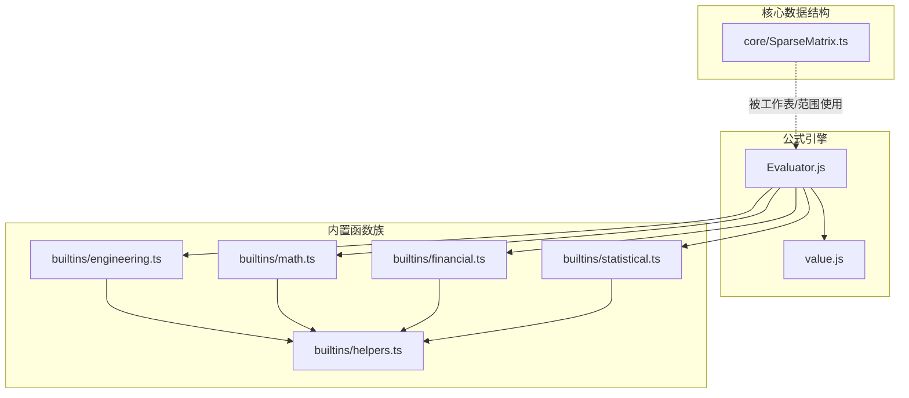
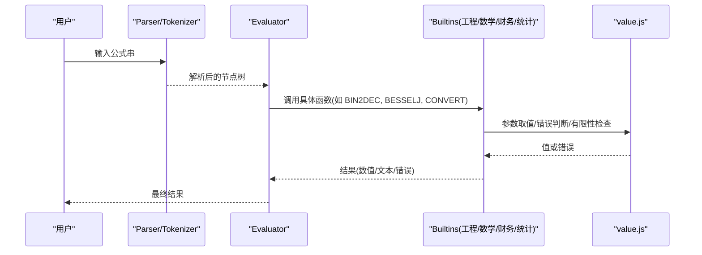
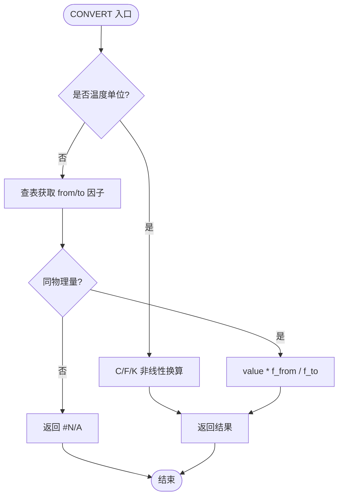
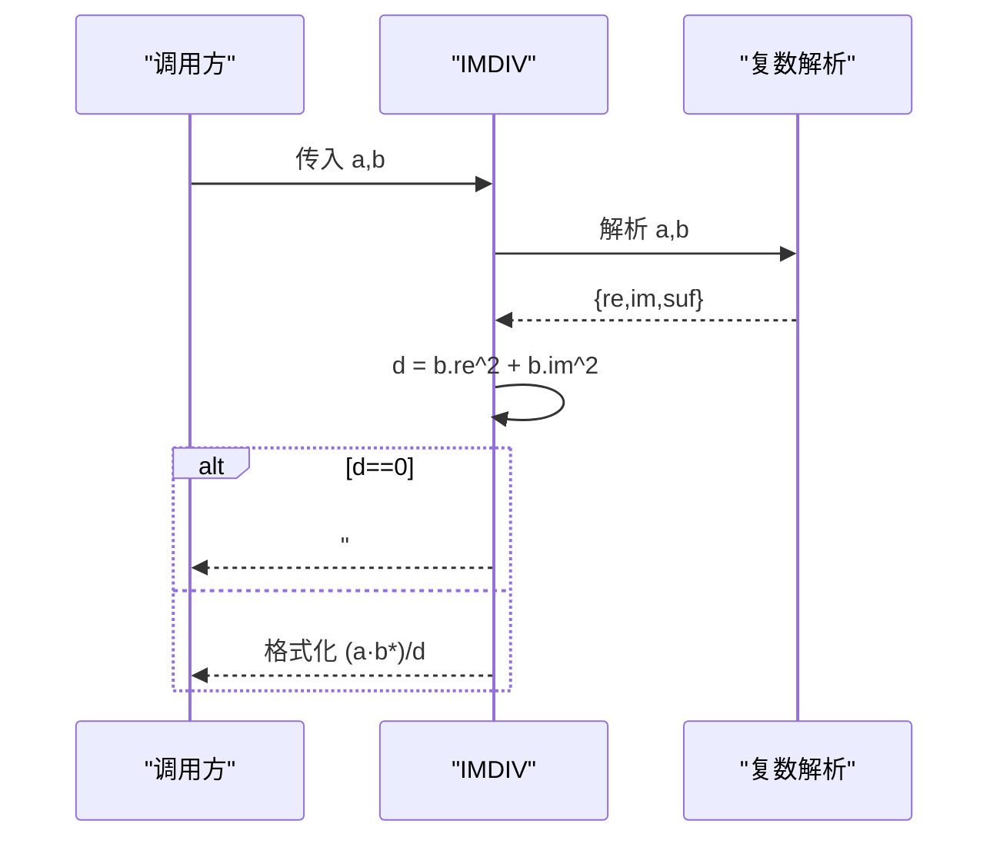
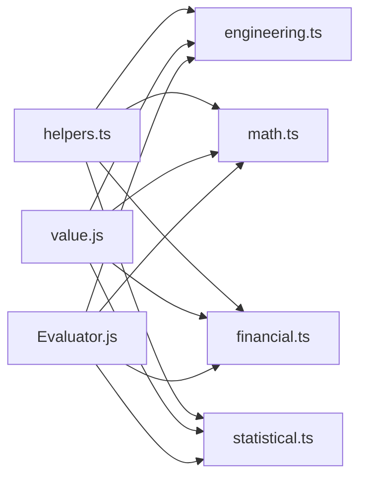

# 工程函数

<cite>
**本文引用的文件**
- [engineering.ts](file://cmx-mega-sheet/src/formula/builtins/engineering.ts)
- [math.ts](file://cmx-mega-sheet/src/formula/builtins/math.ts)
- [financial.ts](file://cmx-mega-sheet/src/formula/builtins/financial.ts)
- [statistical.ts](file://cmx-mega-sheet/src/formula/builtins/statistical.ts)
- [helpers.ts](file://cmx-mega-sheet/src/formula/builtins/helpers.ts)
- [Evaluator.js](file://cmx-mega-sheet/src/formula/Evaluator.js)
- [value.js](file://cmx-mega-sheet/src/formula/value.js)
- [SparseMatrix.ts](file://cmx-mega-sheet/src/core/SparseMatrix.ts)
- [engineeringDate.test.ts](file://cmx-mega-sheet/test/engineeringDate.test.ts)
</cite>

## 目录
1. [简介](#简介)
2. [项目结构](#项目结构)
3. [核心组件](#核心组件)
4. [架构总览](#架构总览)
5. [详细组件分析](#详细组件分析)
6. [依赖关系分析](#依赖关系分析)
7. [性能与内存管理](#性能与内存管理)
8. [故障排查指南](#故障排查指南)
9. [结论](#结论)
10. [附录：与 MATLAB/Python 的兼容性对照](#附录与-matlabpython-的兼容性对照)

## 简介
本参考文档面向工程计算场景，系统化梳理电子表格公式引擎中的“工程函数族”，覆盖数值转换、位运算、复数运算、误差函数、贝塞尔函数、单位换算等；并扩展至数学、财务、统计等常用科学计算能力。文档从数学原理、工程应用、精度与稳定性、性能调优、内存管理以及与 MATLAB/Python 生态的兼容性等方面给出专业说明，帮助在科学计算与工程设计中高效使用这些函数。

## 项目结构
工程函数以“按族拆分”的方式组织在内置函数模块中，统一通过评估器（Evaluator）和值类型系统（value.js）进行参数解析、错误传播与结果输出。核心目录与职责如下：
- builtins/engineering.ts：工程函数族（进制转换、位运算、比较、误差函数、贝塞尔函数、单位换算 CONVERT、复数 IM* 系列）。
- builtins/math.ts：数学/三角/组合/进制/取整/随机等。
- builtins/financial.ts：年金、现值、终值、利率、折旧、投资评估等。
- builtins/statistical.ts：均值、方差、偏度、峰度、回归、正态分布、分位数等。
- builtins/helpers.ts：跨族共享的参数收集、数值提取、错误收窄工具。
- core/SparseMatrix.ts：稀疏矩阵存储，支撑大规模电子表格数据的高效存取与行列操作。
- formula/Evaluator.js、formula/value.js：表达式求值与值/错误类型系统。

图表来源
- [Evaluator.js](file://cmx-mega-sheet/src/formula/Evaluator.js)
- [value.js](file://cmx-mega-sheet/src/formula/value.js)
- [engineering.ts:1-11](file://cmx-mega-sheet/src/formula/builtins/engineering.ts#L1-L11)
- [math.ts:1-10](file://cmx-mega-sheet/src/formula/builtins/math.ts#L1-L10)
- [financial.ts:1-10](file://cmx-mega-sheet/src/formula/builtins/financial.ts#L1-L10)
- [statistical.ts:1-11](file://cmx-mega-sheet/src/formula/builtins/statistical.ts#L1-L11)
- [helpers.ts:1-10](file://cmx-mega-sheet/src/formula/builtins/helpers.ts#L1-L10)
- [SparseMatrix.ts:1-10](file://cmx-mega-sheet/src/core/SparseMatrix.ts#L1-L10)

章节来源
- [engineering.ts:1-11](file://cmx-mega-sheet/src/formula/builtins/engineering.ts#L1-L11)
- [math.ts:1-10](file://cmx-mega-sheet/src/formula/builtins/math.ts#L1-L10)
- [financial.ts:1-10](file://cmx-mega-sheet/src/formula/builtins/financial.ts#L1-L10)
- [statistical.ts:1-11](file://cmx-mega-sheet/src/formula/builtins/statistical.ts#L1-L11)
- [helpers.ts:1-10](file://cmx-mega-sheet/src/formula/builtins/helpers.ts#L1-L10)
- [SparseMatrix.ts:1-10](file://cmx-mega-sheet/src/core/SparseMatrix.ts#L1-L10)

## 核心组件
- 工程函数族（engineering.ts）
  - 进制转换：BIN/OCT/DEC/HEX 互转，支持 10 位补码语义与可选 places 左补零。
  - 位运算：BITAND/OR/XOR/LSHIFT/RSHIFT，48 位无符号域，溢出返回 #NUM!。
  - 比较：DELTA/GESTEP。
  - 误差函数：ERF/ERFC 及其 .PRECISE 版本，Abramowitz–Stegun 近似，误差 ≤1.5e-7。
  - 贝塞尔函数：J/Y/I/K 阶函数，级数+渐近展开，对齐 Excel 常用域精度。
  - 单位换算：CONVERT，覆盖重量、距离、时间、压强、力、能量、功率、温度、体积等。
  - 复数：COMPLEX + IM* 系列（实部、虚部、模、幅角、共轭、加减乘除、指数、对数、幂、三角双曲等），字符串 "a+bi"/"a+bj" 语义。
- 数学函数族（math.ts）
  - 三角/反三角/双曲/反双曲、角度转换、对数/指数、组合数学、取整家族、进制 BASE/DECIMAL/ARABIC/ROMAN、SERIESSUM、RAND/RANDBETWEEN。
- 财务函数族（financial.ts）
  - 年金 PMT/FV/PV/NPER/RATE、分期 IPMT/PPMT、累计 CUMIPMT/CUMPRINC、投资 NPV/IRR/XNPV/XIRR/MIRR、折旧 SLN/SYD/DB/DDB、利率换算 EFFECT/NOMINAL、分数价格 DOLLARDE/DOLLARFR、PDURATION/RRI。
- 统计函数族（statistical.ts）
  - 均值家族 GEOMEAN/HARMEAN/TRIMMEAN/AVERAGEA、离差 DEVSQ/AVEDEV、偏度 SKEW/KURT、双变量 CORREL/PEARSON/COVAR/SLOPE/INTERCEPT/RSQ/FORECAST/STEYX、分位 QUARTILE/PERCENTRANK/RANK.AVG、正态分布 NORM.DIST/NORM.INV/NORM.S.DIST/NORM.S.INV/STANDARDIZE/CONFIDENCE。
- 辅助工具（helpers.ts）
  - reqNum/optNum/collectNumbers/strictNumbers/mean/isErr 等，统一参数解析与错误处理策略。

章节来源
- [engineering.ts:30-516](file://cmx-mega-sheet/src/formula/builtins/engineering.ts#L30-L516)
- [math.ts:127-264](file://cmx-mega-sheet/src/formula/builtins/math.ts#L127-L264)
- [financial.ts:131-345](file://cmx-mega-sheet/src/formula/builtins/financial.ts#L131-L345)
- [statistical.ts:136-275](file://cmx-mega-sheet/src/formula/builtins/statistical.ts#L136-L275)
- [helpers.ts:37-89](file://cmx-mega-sheet/src/formula/builtins/helpers.ts#L37-L89)

## 架构总览
公式引擎将用户输入的公式解析为 AST，由 Evaluator 调度对应内置函数实现。各函数族独立维护导出对象（如 ENGINEERING_BUILTINS），由注册表汇总。所有函数遵循统一的参数解析、错误传播与有限性检查约定，保证行为一致性与可测试性。

图表来源
- [Evaluator.js](file://cmx-mega-sheet/src/formula/Evaluator.js)
- [value.js](file://cmx-mega-sheet/src/formula/value.js)
- [engineering.ts:394-516](file://cmx-mega-sheet/src/formula/builtins/engineering.ts#L394-L516)
- [math.ts:127-264](file://cmx-mega-sheet/src/formula/builtins/math.ts#L127-L264)
- [financial.ts:131-345](file://cmx-mega-sheet/src/formula/builtins/financial.ts#L131-L345)
- [statistical.ts:136-275](file://cmx-mega-sheet/src/formula/builtins/statistical.ts#L136-L275)

## 详细组件分析

### 工程函数族（engineering.ts）
- 数学原理与应用
  - 进制转换：采用 10 位补码表示负数，目标进制字符串输出时支持 places 左补零；适用于数字逻辑、通信协议、嵌入式调试等。
  - 位运算：48 位无符号域，使用 BigInt 避免 32 位截断；用于掩码、标志位、硬件寄存器模拟。
  - 误差函数：Abramowitz–Stegun 近似，|误差|≤1.5e-7；用于概率、信号噪声建模。
  - 贝塞尔函数：小 x 用多项式逼近，大 x 用渐近展开；用于波动、热传导、电磁场问题。
  - 单位换算：以基准单位为枢纽线性换算，温度非线性特例；用于工程计量、实验数据处理。
  - 复数：解析 "a+bi"/"a+bj"，提供完整代数与超越运算；用于交流电路、控制理论、信号处理。
- 关键流程（以 CONVERT 为例）

图表来源
- [engineering.ts:352-390](file://cmx-mega-sheet/src/formula/builtins/engineering.ts#L352-L390)

- 关键流程（以复数除法 IMDIV 为例）

图表来源
- [engineering.ts:490-494](file://cmx-mega-sheet/src/formula/builtins/engineering.ts#L490-L494)

- 复杂度与稳定性
  - 贝塞尔函数：小 x 多项式 O(1)，大 x 渐近 O(1)；递推法 Jn/Yn/In/Kn 为 O(n)。
  - 误差函数：O(1) 多项式近似。
  - 位运算：BigInt 运算，常数时间与空间开销随位数增长。
  - 复数运算：基本运算 O(1)，多参聚合 IMSUM/IMPRODUCT 为 O(k)。

- 错误处理
  - 域外/非有限 → #NUM!；非法参数 → #VALUE!；不兼容单位 → #N/A；除零 → #DIV/0!。

章节来源
- [engineering.ts:30-516](file://cmx-mega-sheet/src/formula/builtins/engineering.ts#L30-L516)
- [engineeringDate.test.ts:19-74](file://cmx-mega-sheet/test/engineeringDate.test.ts#L19-L74)

### 数学函数族（math.ts）
- 要点
  - 三角/反三角/双曲/反双曲：定义域校验与值域限制，返回有限值或 #NUM!。
  - 组合数学：FACT/COMBIN/PERMUT 等，逐步约分避免溢出。
  - 取整家族：CEILING.MATH/FLOOR.MATH/CEILING.PRECISE/ISO.CEILING/FLOOR.PRECISE，支持 mode 与精确模式。
  - 进制：BASE/DECIMAL/ARABIC/ROMAN，支持罗马数字与任意基数。
  - SERIESSUM：幂级数求和，系数数组支持区域展平。
- 典型应用
  - 工程测量角度转换、信号采样频率换算、组合优化计数、数值级数逼近。

章节来源
- [math.ts:52-124](file://cmx-mega-sheet/src/formula/builtins/math.ts#L52-L124)
- [math.ts:127-264](file://cmx-mega-sheet/src/formula/builtins/math.ts#L127-L264)

### 财务函数族（financial.ts）
- 要点
  - 年金恒等式：fvOf/pmtOf/pvOf/nperOf 四解其一，type=0 期末、type=1 期初。
  - 迭代求解：RATE/IRR/XIRR 使用 Newton + 二分兜底，不收敛返回 #NUM!。
  - 投资评估：NPV/XNPV 基于现金流折现，XNPV 使用实际天数/365。
  - 折旧：SLN/SYD/DB/DDB，支持首尾年特殊处理。
  - 利率换算：EFFECT/NOMINAL，分数价格 DOLLARDE/DOLLARFR。
- 典型应用
  - 贷款摊销、项目投资评估、设备折旧、债券定价。

章节来源
- [financial.ts:23-129](file://cmx-mega-sheet/src/formula/builtins/financial.ts#L23-L129)
- [financial.ts:131-345](file://cmx-mega-sheet/src/formula/builtins/financial.ts#L131-L345)

### 统计函数族（statistical.ts）
- 要点
  - 均值家族：GEOMEAN/HARMEAN/TRIMMEAN/AVERAGEA，A 变体文本计 0、布尔 1/0。
  - 离差与形状：DEVSQ/AVEDEV/SKEW/KURT，样本/总体区分。
  - 双变量：CORREL/PEARSON/COVAR/SLOPE/INTERCEPT/RSQ/FORECAST/STEYX，成对缺失跳过。
  - 分位与次序：QUARTILE/PERCENTRANK/RANK.AVG，含 INC/EXC 语义。
  - 正态分布：NORM.DIST/NORM.INV/NORM.S.DIST/NORM.S.INV/STANDARDIZE/CONFIDENCE，CDF 使用 Abramowitz–Stegun 近似。
- 典型应用
  - 质量控制、实验数据分析、风险评估、预测建模。

章节来源
- [statistical.ts:28-77](file://cmx-mega-sheet/src/formula/builtins/statistical.ts#L28-L77)
- [statistical.ts:136-275](file://cmx-mega-sheet/src/formula/builtins/statistical.ts#L136-L275)
- [statistical.ts:378-404](file://cmx-mega-sheet/src/formula/builtins/statistical.ts#L378-L404)

### 辅助工具（helpers.ts）
- 作用
  - 统一参数解析：reqNum/optNum 将标量/区域左上角转为数字，空值回退默认。
  - 数值收集：collectNumbers 忽略空白与非数值文本；strictNumbers 严格要求数值。
  - 错误收窄：isErr 泛型守卫，避免误判。
  - 基础统计：mean 等。
- 设计原则
  - 错误短路：遇到错误立即返回，减少无效计算。
  - 与 Excel 语义对齐：区域聚合忽略非数值文本，直接传参的文本数字参与计算。

章节来源
- [helpers.ts:26-89](file://cmx-mega-sheet/src/formula/builtins/helpers.ts#L26-L89)

### 稀疏矩阵（SparseMatrix.ts）
- 作用
  - 仅存储非空单元格，键为 "row,col"，支持插入/删除行列时的坐标平移。
  - 提供 maxRow/maxCol、遍历 entries、浅拷贝等能力。
- 性能特性
  - 空间复杂度 O(nnz)，nnz 为非空元素数；行列操作最坏 O(nnz) 重建映射。
- 适用场景
  - 大规模电子表格、稀疏数据矩阵、动态行列增删频繁的场景。

章节来源
- [SparseMatrix.ts:1-175](file://cmx-mega-sheet/src/core/SparseMatrix.ts#L1-L175)

## 依赖关系分析
- 函数族之间通过 helpers.ts 复用参数解析与数值收集逻辑，降低耦合。
- 所有函数均依赖 value.js 的类型系统与错误类型，以及 Evaluator.js 的求值上下文。
- 工程函数族内部自包含复数解析、误差函数、贝塞尔函数实现，不依赖外部库。

图表来源
- [helpers.ts:1-10](file://cmx-mega-sheet/src/formula/builtins/helpers.ts#L1-L10)
- [value.js](file://cmx-mega-sheet/src/formula/value.js)
- [Evaluator.js](file://cmx-mega-sheet/src/formula/Evaluator.js)

章节来源
- [helpers.ts:1-10](file://cmx-mega-sheet/src/formula/builtins/helpers.ts#L1-L10)
- [value.js](file://cmx-mega-sheet/src/formula/value.js)
- [Evaluator.js](file://cmx-mega-sheet/src/formula/Evaluator.js)

## 性能与内存管理
- 数值精度与稳定性
  - 误差函数与正态分布 CDF 使用 Abramowitz–Stegun 近似，误差控制在 1e-7 级别，满足工程需求。
  - 贝塞尔函数在小 x 使用多项式逼近，在大 x 使用渐近展开，避免数值不稳定。
  - 位运算使用 BigInt 避免 32 位截断，确保 48 位无符号域正确性。
- 性能建议
  - 批量计算：尽量向量化或使用区域参数，减少逐单元格调用开销。
  - 避免重复计算：缓存中间结果（如常量、查表项）。
  - 选择合适算法：贝塞尔函数根据 x 大小切换路径，保持 O(1) 或 O(n) 复杂度可控。
- 内存管理
  - 稀疏矩阵仅存非空元素，适合大规模稀疏数据；行列增删时重建映射，注意批量操作以减少重建次数。
  - 复数运算避免创建过多临时对象，复用解析结果。
- 错误与边界
  - 严格域检查：对数、开方、反三角等函数的定义域与值域需提前校验，避免 NaN/Inf。
  - 单位换算：温度非线性，其他线性；不同物理量不可换算，返回 #N/A。

[本节为通用指导，无需特定文件引用]

## 故障排查指南
- 常见错误
  - #NUM!: 域外参数、非有限结果、位运算越界、复数模为零的对数/除法。
  - #VALUE!: 非法参数类型、单位后缀非法。
  - #N/A: 单位不兼容、向量长度不一致。
  - #DIV/0!: 除零、协方差/相关系数分母为零。
- 排查步骤
  - 检查参数类型与范围：使用 reqNum/optNum 的返回值是否为错误。
  - 验证单位：CONVERT 前确认物理量一致，温度单位使用标准缩写。
  - 复数解析：确保 "a+bi"/"a+bj" 格式合法，i/j 后缀一致。
  - 贝塞尔函数：阶数 n≥0，Y/K 类要求 x>0。
- 测试用例参考
  - 工程函数单元测试覆盖进制转换、位运算、误差函数、贝塞尔、单位换算、复数运算等。

章节来源
- [engineeringDate.test.ts:19-74](file://cmx-mega-sheet/test/engineeringDate.test.ts#L19-L74)

## 结论
该工程函数族提供了完整的工程计算能力，涵盖进制转换、位运算、误差函数、贝塞尔函数、单位换算与复数运算，并与数学、财务、统计函数形成互补。实现遵循 Excel 语义与高精度近似，具备稳定的错误处理与良好的性能特征。结合稀疏矩阵与统一的参数解析框架，可在大规模电子表格与科学计算场景中稳定运行。

[本节为总结，无需特定文件引用]

## 附录：与 MATLAB/Python 的兼容性对照
- 误差函数
  - ERF(x) ≈ scipy.special.erf(x)
  - ERFC(x) ≈ scipy.special.erfc(x)
- 贝塞尔函数
  - BESSELJ(n,x) ≈ scipy.special.jv(n,x)
  - BESSELY(n,x) ≈ scipy.special.yv(n,x)
  - BESSELI(n,x) ≈ scipy.special.iv(n,x)
  - BESSELK(n,x) ≈ scipy.special.kv(n,x)
- 复数运算
  - COMPLEX(a,b,"i") ↔ Python 复数 a + bj
  - IMABS(z) ≈ abs(z)
  - IMARGUMENT(z) ≈ angle(z)
  - IMSUM/IMPRODUCT/IMSUB/IMDIV ↔ 复数加减乘除
- 单位换算
  - CONVERT(value,"from","to") ↔ 使用单位库（如 pint）进行换算
- 数学函数
  - SIN/COS/TAN/ASIN/ACOS/ATAN 等 ↔ numpy 对应函数
  - CEILING.MATH/FLOOR.MATH 与 numpy.ceil/floor 行为略有差异，注意 mode 与 precision
- 财务函数
  - PMT/FV/PV/NPER/RATE ↔ numpy_financial 或 scipy 金融模块
  - NPV/IRR/XNPV/XIRR ↔ numpy_financial 或自定义实现
- 统计函数
  - CORREL/PEARSON ↔ numpy.corrcoef
  - SLOPE/INTERCEPT ↔ numpy.polyfit 一阶
  - NORM.DIST/NORM.INV ↔ scipy.stats.norm

[本节为概念性对照，无需特定文件引用]