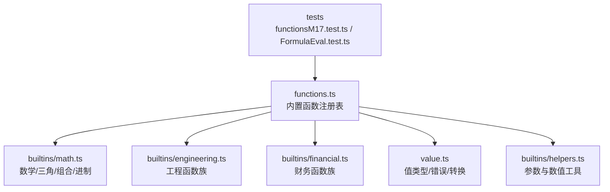
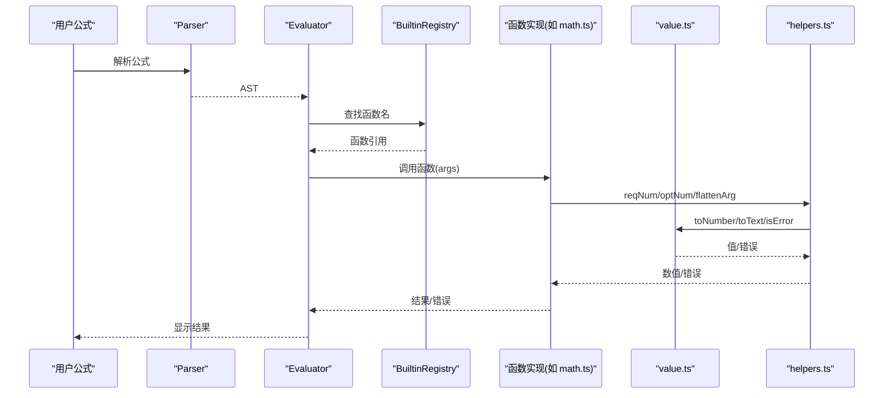
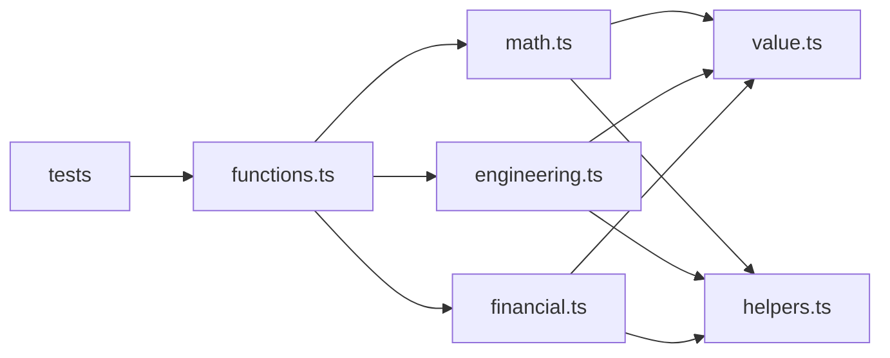

# 数学函数

<cite>
**本文引用的文件**   
- [math.ts](file://cmx-mega-sheet/src/formula/builtins/math.ts)
- [functions.ts](file://cmx-mega-sheet/src/formula/functions.ts)
- [value.ts](file://cmx-mega-sheet/src/formula/value.ts)
- [helpers.ts](file://cmx-mega-sheet/src/formula/builtins/helpers.ts)
- [engineering.ts](file://cmx-mega-sheet/src/formula/builtins/engineering.ts)
- [financial.ts](file://cmx-mega-sheet/src/formula/builtins/financial.ts)
- [functionsM17.test.ts](file://cmx-mega-sheet/test/functionsM17.test.ts)
- [FormulaEval.test.ts](file://cmx-mega-sheet/test/Formul aEval.test.ts)
</cite>

## 目录
1. [简介](#简介)
2. [项目结构](#项目结构)
3. [核心组件](#核心组件)
4. [架构总览](#架构总览)
5. [详细组件分析](#详细组件分析)
6. [依赖关系分析](#依赖关系分析)
7. [性能与精度](#性能与精度)
8. [故障排查](#故障排查)
9. [结论](#结论)
10. [附录：函数参考速查](#附录函数参考速查)

## 简介
本参考文档聚焦于工作表公式引擎中的“数学函数族”，覆盖基本算术、三角函数、对数/指数、舍入/取整、组合数学、进制转换、随机数等。文档说明每个函数的语法、参数类型、返回值、计算精度与溢出保护，并提供使用示例、数值处理机制、性能优化建议以及与 Excel 的兼容性要点。

## 项目结构
数学函数主要分布在以下模块：
- 内置函数注册表与通用逻辑：functions.ts
- 数学/三角/组合/进制族：builtins/math.ts
- 工程函数族（含更多进制/位运算）：builtins/engineering.ts
- 财务函数族（部分与数值相关）：builtins/financial.ts
- 值类型与强制转换、错误定义：value.ts
- 共享工具（参数解析、数值收集）：builtins/helpers.ts
- 测试用例（行为断言与示例）：test/functionsM17.test.ts、test/FormulaEval.test.ts

图表来源
- [functions.ts:346-354](file://cmx-mega-sheet/src/formula/functions.ts#L346-L354)
- [math.ts:127-264](file://cmx-mega-sheet/src/formula/builtins/math.ts#L127-L264)
- [engineering.ts:1-96](file://cmx-mega-sheet/src/formula/builtins/engineering.ts#L1-L96)
- [financial.ts:301-334](file://cmx-mega-sheet/src/formula/builtins/financial.ts#L301-L334)
- [value.ts:13-83](file://cmx-mega-sheet/src/formula/value.ts#L13-L83)
- [helpers.ts:26-90](file://cmx-mega-sheet/src/formula/builtins/helpers.ts#L26-L90)

章节来源
- [functions.ts:1-1149](file://cmx-mega-sheet/src/formula/functions.ts#L1-L1149)
- [math.ts:1-294](file://cmx-mega-sheet/src/formula/builtins/math.ts#L1-L294)
- [value.ts:1-131](file://cmx-mega-sheet/src/formula/value.ts#L1-L131)
- [helpers.ts:1-90](file://cmx-mega-sheet/src/formula/builtins/helpers.ts#L1-L90)
- [engineering.ts:1-96](file://cmx-mega-sheet/src/formula/builtins/engineering.ts#L1-L96)
- [financial.ts:301-334](file://cmx-mega-sheet/src/formula/builtins/financial.ts#L301-L334)
- [functionsM17.test.ts:1-279](file://cmx-mega-sheet/test/functionsM17.test.ts#L1-L279)
- [FormulaEval.test.ts:1-173](file://cmx-mega-sheet/test/FormulaEval.test.ts#L1-L173)

## 核心组件
- 值系统与错误传播：value.ts 定义了 FormulaValue、FormulaError 及 toNumber/toText/toBoolean 等转换规则，确保算术上下文与文本上下文语义一致，并统一错误传播。
- 参数与数值工具：helpers.ts 提供 reqNum/optNum/collectNumbers/strictNumbers 等，保证各函数族在参数解析和数值收集上的一致性。
- 内置函数注册表：functions.ts 汇总基础函数（SUM/AVERAGE/ROUND/MOD/POWER/SQRT 等），并通过展开方式并入 math/financial/statistical/database/textref/engineering 各族实现。
- 数学函数族：math.ts 实现三角、对数/指数、角度、组合数学、取整兄弟、进制转换、级数和随机数等。
- 工程函数族：engineering.ts 补充更多进制转换、位运算、误差函数、单位换算、复数等。
- 财务函数族：financial.ts 包含若干与数值相关的金融计算（如 NOMINAL/DOLLARDE/FRACTION 等）。

章节来源
- [value.ts:13-83](file://cmx-mega-sheet/src/formula/value.ts#L13-L83)
- [helpers.ts:26-90](file://cmx-mega-sheet/src/formula/builtins/helpers.ts#L26-L90)
- [functions.ts:44-158](file://cmx-mega-sheet/src/formula/functions.ts#L44-L158)
- [math.ts:127-264](file://cmx-mega-sheet/src/formula/builtins/math.ts#L127-L264)
- [engineering.ts:1-96](file://cmx-mega-sheet/src/formula/builtins/engineering.ts#L1-L96)
- [financial.ts:301-334](file://cmx-mega-sheet/src/formula/builtins/financial.ts#L301-L334)

## 架构总览
公式求值流程中，函数通过 Evaluator 调用具体实现；各函数内部使用 value.ts 进行类型转换与错误检查，使用 helpers.ts 做参数解析与数值收集，最终返回数字或 Excel 风格错误。

图表来源
- [functions.ts:346-354](file://cmx-mega-sheet/src/formula/functions.ts#L346-L354)
- [math.ts:12-24](file://cmx-mega-sheet/src/formula/builtins/math.ts#L12-L24)
- [value.ts:42-83](file://cmx-mega-sheet/src/formula/value.ts#L42-L83)
- [helpers.ts:37-66](file://cmx-mega-sheet/src/formula/builtins/helpers.ts#L37-L66)

## 详细组件分析

### 基本算术与聚合
- ABS、MOD、POWER、SQRT、INT、TRUNC、SIGN、GCD、LCM、PRODUCT、SUM、AVERAGE、MAX、MIN、COUNT/COUNTA/COUNTBLANK、SUMIF/COUNTIF/SUMIFS/COUNTIFS/AVERAGEIF/AVERAGEIFS、MAXIFS/MINIFS、SUBTOTAL、MEDIAN、MODE/MODE.SNGL、STDEV/STDEV.S/VAR/VAR.S 等。
- 关键特性
  - 区域聚合忽略非数值文本，布尔按 1/0 参与（与 Excel 一致）。
  - ROUND 采用“半远离零”舍入，避免 JS Math.round 负数半向上差异。
  - MOD 遵循 a - b*floor(a/b) 的数学定义。
  - POWER/SQRT 对非法域返回 #NUM!。
  - 多条件聚合支持通配符与比较运算符前缀。

章节来源
- [functions.ts:44-158](file://cmx-mega-sheet/src/formula/functions.ts#L44-L158)
- [functions.ts:389-442](file://cmx-mega-sheet/src/formula/functions.ts#L389-L442)
- [functions.ts:474-559](file://cmx-mega-sheet/src/formula/functions.ts#L474-L559)
- [functions.ts:595-655](file://cmx-mega-sheet/src/formula/functions.ts#L595-L655)
- [FormulaEval.test.ts:101-157](file://cmx-mega-sheet/test/FormulaEval.test.ts#L101-L157)

### 三角函数与角度
- SIN、COS、TAN、ASIN、ACOS、ATAN、ATAN2、SINH、COSH、TANH、ASINH、ACOSH、ATANH、SEC、CSC、COT、SECH、CSCH、COTH、ACOT、ACOTH、DEGREES、RADIANS、PI。
- 关键点
  - 反三角输入域外返回 #NUM!（如 ASIN(x) 要求 x∈[-1,1]）。
  - ATAN2(x,y) 对应 atan(y/x)，原点 (0,0) 返回 #DIV/0!。
  - 双曲函数与反双曲函数遵循标准数学定义与域限制。
  - 角度转换 DEGREES/RADIANS 基于 PI 常量。

章节来源
- [math.ts:127-166](file://cmx-mega-sheet/src/formula/builtins/math.ts#L127-L166)
- [functionsM17.test.ts:55-65](file://cmx-mega-sheet/test/functionsM17.test.ts#L55-L65)

### 对数与指数
- EXP、LN、LOG10、LOG(base)、SQRTPI。
- 关键点
  - LN/LOG10/LOG 要求正数底与真数；LOG 默认以 10 为底，可指定 base。
  - SQRTPI(x)=sqrt(π·x)，x<0 返回 #NUM!。
  - 结果有限性校验，NaN/±Infinity→#NUM!。

章节来源
- [math.ts:127-140](file://cmx-mega-sheet/src/formula/builtins/math.ts#L127-L140)
- [functionsM17.test.ts:66-73](file://cmx-mega-sheet/test/functionsM17.test.ts#L66-L73)

### 舍入与取整
- ROUND、ROUNDDOWN、ROUNDUP、INT、TRUNC、CEILING、FLOOR、MROUND、CEILING.MATH、FLOOR.MATH、CEILING.PRECISE、ISO.CEILING、FLOOR.PRECISE、EVEN、ODD、SIGN。
- 关键点
  - ROUND 使用“半远离零”策略，对齐 Excel。
  - CEILING.MATH/FLOOR.MATH 的 significance 取绝对值；mode≠0 时负数方向改变。
  - PRECISE 系列恒朝 ±∞ 取整，significance 取绝对值。
  - MROUND 要求 n 与 m 同号。

章节来源
- [functions.ts:77-142](file://cmx-mega-sheet/src/formula/functions.ts#L77-L142)
- [math.ts:216-293](file://cmx-mega-sheet/src/formula/builtins/math.ts#L216-L293)
- [functionsM17.test.ts:84-92](file://cmx-mega-sheet/test/functionsM17.test.ts#L84-L92)

### 组合数学与阶乘
- FACT、FACTDOUBLE、COMBIN、COMBINA、PERMUT、PERMUTATIONA、MULTINOMIAL、QUOTIENT。
- 关键点
  - 阶乘与组合数采用乘法式逐步约分，避免中间溢出。
  - COMBINA/PERMUTATIONA 允许重复选择/排列。
  - MULTINOMIAL 计算多项式系数，过程中检测溢出。
  - QUOTIENT 返回整数商，除数为 0 返回 #DIV/0!。

章节来源
- [math.ts:51-84](file://cmx-mega-sheet/src/formula/builtins/math.ts#L51-L84)
- [math.ts:168-214](file://cmx-mega-sheet/src/formula/builtins/math.ts#L168-L214)
- [functionsM17.test.ts:74-83](file://cmx-mega-sheet/test/functionsM17.test.ts#L74-L83)

### 进制转换与罗马数字
- BASE、DECIMAL、ROMAN、ARABIC。
- 关键点
  - BASE(value, radix[, min_length]) 将正整数转为指定进制字符串，支持最小长度补零。
  - DECIMAL(text, radix) 将任意进制字符串转十进制数。
  - ROMAN(n) 范围 1..3999；ARABIC("MMXVIII") 支持前导负号。
  - 工程函数族还提供 BIN/OCT/DEC/HEX 互转与位运算（见下文）。

章节来源
- [math.ts:86-124](file://cmx-mega-sheet/src/formula/builtins/math.ts#L86-L124)
- [math.ts:223-239](file://cmx-mega-sheet/src/formula/builtins/math.ts#L223-L239)
- [engineering.ts:30-86](file://cmx-mega-sheet/src/formula/builtins/engineering.ts#L30-L86)
- [functionsM17.test.ts:93-100](file://cmx-mega-sheet/test/functionsM17.test.ts#L93-L100)

### 幂级数与随机数
- SERIESSUM、RAND、RANDBETWEEN。
- 关键点
  - SERIESSUM(x,nStart,m,{c0,c1,...}) 计算幂级数和。
  - RAND 返回 [0,1) 均匀分布；RANDBETWEEN(lo,hi) 返回整数区间随机数。
  - 注意：引擎中 NOW/TODAY 为非 volatile 内置，随重算刷新，不逐帧变化。

章节来源
- [math.ts:241-263](file://cmx-mega-sheet/src/formula/builtins/math.ts#L241-L263)
- [functionsM17.test.ts:101-105](file://cmx-mega-sheet/test/functionsM17.test.ts#L101-L105)

### 工程函数族（扩展）
- 进制转换（BIN2OCT/BIN2DEC/BIN2HEX、OCT2BIN/OCT2DEC/OCT2HEX、DEC2BIN/DEC2OCT/DEC2HEX、HEX2BIN/HEX2OCT/HEX2DEC）、位运算（BITAND/BITOR/BITXOR/BITLSHIFT/BITRSHIFT）、比较（DELTA/GESTEP）、误差函数（ERF/ERFC 及其 .PRECISE 版本）、贝塞尔函数（BESSELI/J/K/Y）、单位换算 CONVERT、复数（COMPLEX + IM* 一族）。
- 关键点
  - 源为字符串的进制转换遵循 Excel 补码语义；目标为字符串（DEC2* 例外返回数字）。
  - 位运算限定 48 位无符号范围。
  - 域外/溢出 → #NUM!；参数非法 → #VALUE!。

章节来源
- [engineering.ts:1-96](file://cmx-mega-sheet/src/formula/builtins/engineering.ts#L1-L96)

### 财务函数族（数值相关片段）
- 利率换算 EFFECT/NOMINAL、分数价格 DOLLARDE/DOLLARFR、期限 PDURATION 等。
- 关键点
  - 参数域检查严格（如 npery≥1、effect>0 等）。
  - 结果有限性校验，异常返回 #NUM!。

章节来源
- [financial.ts:301-334](file://cmx-mega-sheet/src/formula/builtins/financial.ts#L301-L334)

## 依赖关系分析
- functions.ts 作为注册中心，导入并展开 math/financial/statistical/database/textref/engineering 各族实现，形成统一的 BUILTINS 表。
- 各函数实现依赖 value.ts 的类型转换与错误判断，以及 helpers.ts 的参数解析与数值收集。
- 测试文件验证函数集合规模、去重、典型用例与错误传播。

图表来源
- [functions.ts:346-354](file://cmx-mega-sheet/src/formula/functions.ts#L346-L354)
- [math.ts:12-24](file://cmx-mega-sheet/src/formula/builtins/math.ts#L12-L24)
- [engineering.ts:13-24](file://cmx-mega-sheet/src/formula/builtins/engineering.ts#L13-L24)
- [financial.ts:301-334](file://cmx-mega-sheet/src/formula/builtins/financial.ts#L301-L334)
- [value.ts:13-83](file://cmx-mega-sheet/src/formula/value.ts#L13-L83)
- [helpers.ts:26-90](file://cmx-mega-sheet/src/formula/builtins/helpers.ts#L26-L90)

章节来源
- [functions.ts:346-354](file://cmx-mega-sheet/src/formula/functions.ts#L346-L354)
- [functionsM17.test.ts:41-53](file://cmx-mega-sheet/test/functionsM17.test.ts#L41-L53)

## 性能与精度
- 数值精度
  - 数字到文本转换使用 toPrecision(15) 去除尾零，避免科学计数法影响常规区间显示，对齐 Excel 有效数字习惯。
  - 舍入函数 ROUND 采用“半远离零”策略，避免 JS Math.round 的负数半向上偏差。
- 溢出保护
  - 多数函数对结果进行有限性检查（NaN/±Infinity→#NUM!）。
  - 阶乘/组合数采用乘法式逐步约分，减少中间溢出风险。
  - 工程函数位运算限定 48 位无符号范围，超出返回 #NUM!。
- 性能建议
  - 批量数据优先使用数组/区域聚合（SUM/AVERAGE 等），减少函数调用开销。
  - 避免在循环中频繁调用高成本函数（如复杂统计/回归类），必要时预处理数据。
  - 合理使用 MROUND/CEILING.FLOOR 等取整函数，减少后续格式化开销。

章节来源
- [value.ts:77-83](file://cmx-mega-sheet/src/formula/value.ts#L77-L83)
- [functions.ts:474-482](file://cmx-mega-sheet/src/formula/functions.ts#L474-L482)
- [math.ts:51-84](file://cmx-mega-sheet/src/formula/builtins/math.ts#L51-L84)
- [engineering.ts:88-96](file://cmx-mega-sheet/src/formula/builtins/engineering.ts#L88-L96)

## 故障排查
- 常见错误
  - #NUM!：域外输入（如 LN(0)、ASIN(2)、SQRT(-1)）、结果非有限、阶乘/组合溢出、工程函数位运算越界。
  - #DIV/0!：除数为 0（如 MOD(a,0)、ATAN2(0,0)）。
  - #VALUE!：参数类型不符（如 TEXT 函数期望文本却收到错误值）、位数/格式非法。
  - #N/A：未找到匹配项（如 MATCH 精确匹配失败）。
- 调试建议
  - 使用 IFERROR/IFNA 包裹可疑表达式，定位错误来源。
  - 借助 ISNUMBER/ISTEXT/ISBLANK 等类型检查函数确认参数类型。
  - 通过测试用例对照预期行为（见 tests/functionsM17.test.ts、tests/FormulaEval.test.ts）。

章节来源
- [functionsM17.test.ts:265-278](file://cmx-mega-sheet/test/functionsM17.test.ts#L265-L278)
- [FormulaEval.test.ts:75-77](file://cmx-mega-sheet/test/FormulaEval.test.ts#L75-L77)
- [value.ts:13-32](file://cmx-mega-sheet/src/formula/value.ts#L13-L32)

## 结论
该数学函数体系以 value.ts 为核心类型系统，配合 helpers.ts 的参数解析与 functions.ts 的统一注册，实现了与 Excel 高度一致的语义与错误模型。math.ts 补齐了三角、对数/指数、组合数学、取整兄弟、进制转换等关键能力；engineering.ts 进一步扩展工程领域函数；financial.ts 提供必要的金融数值计算。整体设计强调域检查、溢出保护与精度控制，便于在企业报表与模板中稳定使用。

## 附录：函数参考速查
- 基本算术与聚合：ABS、MOD、POWER、SQRT、INT、TRUNC、SIGN、GCD、LCM、PRODUCT、SUM、AVERAGE、MAX、MIN、COUNT/COUNTA/COUNTBLANK、SUMIF/COUNTIF/SUMIFS/COUNTIFS/AVERAGEIF/AVERAGEIFS、MAXIFS/MINIFS、SUBTOTAL、MEDIAN、MODE/MODE.SNGL、STDEV/STDEV.S/VAR/VAR.S
- 三角与角度：SIN、COS、TAN、ASIN、ACOS、ATAN、ATAN2、SINH、COSH、TANH、ASINH、ACOSH、ATANH、SEC、CSC、COT、SECH、CSCH、COTH、ACOT、ACOTH、DEGREES、RADIANS、PI
- 对数与指数：EXP、LN、LOG10、LOG(base)、SQRTPI
- 舍入与取整：ROUND、ROUNDDOWN、ROUNDUP、CEILING、FLOOR、MROUND、CEILING.MATH、FLOOR.MATH、CEILING.PRECISE、ISO.CEILING、FLOOR.PRECISE、EVEN、ODD、SIGN
- 组合数学：FACT、FACTDOUBLE、COMBIN、COMBINA、PERMUT、PERMUTATIONA、MULTINOMIAL、QUOTIENT
- 进制与罗马：BASE、DECIMAL、ROMAN、ARABIC
- 工程函数：BIN/OCT/DEC/HEX 互转、位运算、DELTA/GESTEP、ERF/ERFC(.PRECISE)、BESSEL 族、CONVERT、COMPLEX 与 IM* 族
- 财务数值：EFFECT、NOMINAL、DOLLARDE、DOLLARFR、PDURATION
- 随机与级数：RAND、RANDBETWEEN、SERIESSUM

章节来源
- [functions.ts:63-158](file://cmx-mega-sheet/src/formula/functions.ts#L63-L158)
- [math.ts:127-264](file://cmx-mega-sheet/src/formula/builtins/math.ts#L127-L264)
- [engineering.ts:1-96](file://cmx-mega-sheet/src/formula/builtins/engineering.ts#L1-L96)
- [financial.ts:301-334](file://cmx-mega-sheet/src/formula/builtins/financial.ts#L301-L334)
- [functionsM17.test.ts:55-105](file://cmx-mega-sheet/test/functionsM17.test.ts#L55-L105)
- [FormulaEval.test.ts:101-157](file://cmx-mega-sheet/test/FormulaEval.test.ts#L101-L157)