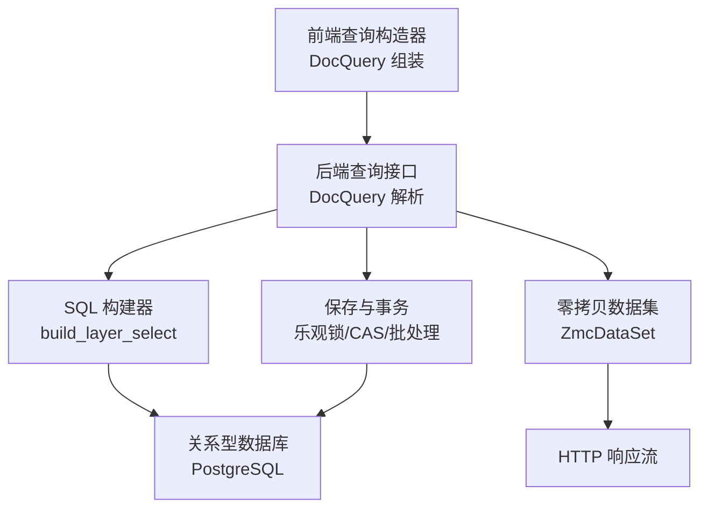
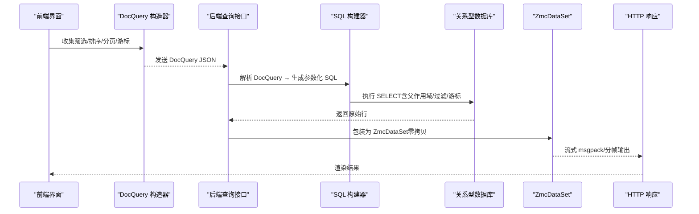
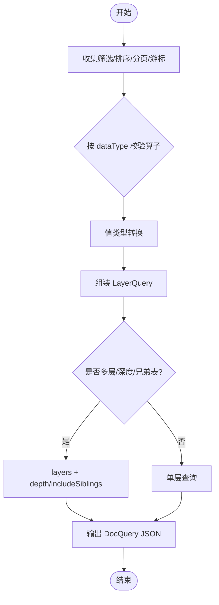
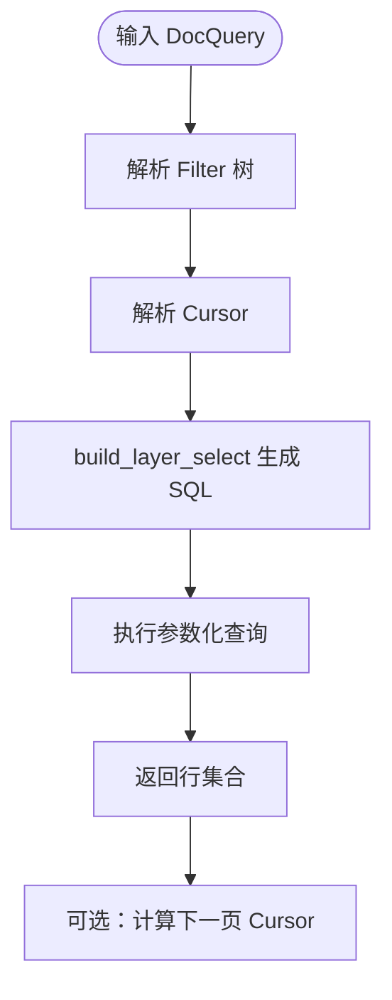
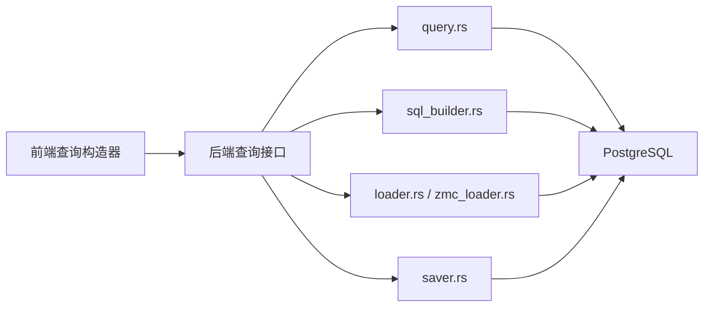

# 数据库函数

<cite>
**本文引用的文件**
- [cmx-doc-query.js](file://packages/cmx-data-comp/src/lib/cmx-doc-query.js)
- [cmx-doc-query.test.js](file://packages/cmx-data-comp/src/lib/__tests__/cmx-doc-query.test.js)
- [三元定义体系架构文档.md](file://docs/三元定义体系架构文档.md)
- [财务报表平台设计方案.html](file://docs/财务报表平台设计方案.html)
- [ZMC-零内存复制-ERP后端最佳实践.md](file://docs/ZMC-零内存复制-ERP后端最佳实践.md)
- [模型中心-元数据建模与数据库部署方案.html](file://docs/模型中心-元数据建模与数据库部署方案.html)
- [20260817_流程引擎_已知问题与技术债务.md](file://documents/技术债/20260817_流程引擎_已知问题与技术债务.md)
- [20260804_cmx-mdm_M3_匹配合并存活_任务细化.md](file://documents/MDM主数据管理平台/20260804_cmx-mdm_M3_匹配合并存活_任务细化.md)
- [20260812_cmx-mdm_匹配合并存活算法原理.md](file://documents/MDM主数据管理平台/20260812_cmx-mdm_匹配合并存活算法原理.md)
</cite>

## 目录
1. [简介](#简介)
2. [项目结构](#项目结构)
3. [核心组件](#核心组件)
4. [架构总览](#架构总览)
5. [详细组件分析](#详细组件分析)
6. [依赖关系分析](#依赖关系分析)
7. [性能考量](#性能考量)
8. [故障排查指南](#故障排查指南)
9. [结论](#结论)
10. [附录](#附录)

## 简介
本参考文档面向“数据库函数”的查询与操作能力，覆盖筛选、聚合、排序、连接（多层父子关联）、分页与游标、事务与并发控制、大数据量查询优化、以及与关系型数据库的集成和数据同步机制。文档基于仓库中的前端查询构造器、后端查询与保存实现、报表取数函数、以及零拷贝数据集等设计进行系统化说明，并提供复杂查询场景的实现示例与最佳实践。

## 项目结构
围绕数据库函数的关键代码分布在以下位置：
- 前端通用单据查询构造器：将 UI 状态转换为 DocQuery JSON，驱动后端查询
- 后端查询与 SQL 构建：Filter 树、Cursor 游标分页、层选择 SQL 生成
- 报表取数函数：财务常用取数函数映射到 DB 聚合查询
- 零拷贝数据集（ZMC）：从 PG 到 HTTP 的流式传输，避免中间对象复制
- 多库注册与执行：DbRegistry 管理多个数据源，支持运行期登记
- 事务与并发：乐观锁、行级锁、CAS 版本控制、批量保存策略

图表来源
- [三元定义体系架构文档.md:1676-1711](file://docs/三元定义体系架构文档.md#L1676-L1711)
- [ZMC-零内存复制-ERP后端最佳实践.md:46-51](file://docs/ZMC-零内存复制-ERP后端最佳实践.md#L46-L51)

章节来源
- [cmx-doc-query.js:1-51](file://packages/cmx-data-comp/src/lib/cmx-doc-query.js#L1-L51)
- [三元定义体系架构文档.md:1676-1711](file://docs/三元定义体系架构文档.md#L1676-L1711)

## 核心组件
- 前端查询构造器（DocQuery 组装）
  - 提供算子集、按数据类型过滤可用算子、值类型转换、排序与分页参数组装、游标编码
  - 输出标准 DocQuery JSON，供后端 /api/doc/data/* 使用
- 后端查询与 SQL 构建
  - Filter 树（$and/$or/列多算子/简写等值）
  - Cursor 游标分页（base64(JSON {vals,id})），稳定无漂移
  - build_layer_select 生成带父作用域、过滤树、游标谓词、ORDER BY/LIMIT 的参数化 SQL
- 报表取数函数
  - 取数函数族（QC/QM/JE/LJ/FS/SUMQTY 等）声明编译为聚合查询，下推到 DB
- 零拷贝数据集（ZMC）
  - 抽象行源 trait，TokioPgRowSource/sqlx PgRow 适配器
  - 惰性列式二进制编码，msgpack 或流式分帧直出
- 多库注册与执行
  - DbRegistry 以 db_id 命名连接池，支持运行期 register_data_source
- 保存与事务
  - 乐观锁（update_time 基线比对）、CAS 版本控制、批量 save（原子/逐单）、审计列填充、临时 id→真 id 映射

章节来源
- [cmx-doc-query.js:1-129](file://packages/cmx-data-comp/src/lib/cmx-doc-query.js#L1-L129)
- [三元定义体系架构文档.md:1531-1615](file://docs/三元定义体系架构文档.md#L1531-L1615)
- [财务报表平台设计方案.html:566-578](file://docs/财务报表平台设计方案.html#L566-L578)
- [ZMC-零内存复制-ERP后端最佳实践.md:46-51](file://docs/ZMC-零内存复制-ERP后端最佳实践.md#L46-L51)
- [模型中心-元数据建模与数据库部署方案.html:412-433](file://docs/模型中心-元数据建模与数据库部署方案.html#L412-L433)

## 架构总览
下图展示从前端 UI 到数据库查询与返回的完整链路，包括筛选、排序、分页、连接（多层父子）与零拷贝传输。

图表来源
- [三元定义体系架构文档.md:1676-1711](file://docs/三元定义体系架构文档.md#L1676-L1711)
- [ZMC-零内存复制-ERP后端最佳实践.md:46-51](file://docs/ZMC-零内存复制-ERP后端最佳实践.md#L46-L51)

## 详细组件分析

### 前端查询构造器（DocQuery）
- 功能要点
  - 算子集：等于、不等于、大于/小于、包含、开头/结尾匹配、模糊忽略大小写、空判断等
  - 按数据类型限制可用算子（数值/日期用比较；文本用 contains/like；布尔仅等值/空）
  - 值类型转换：字符串→数字/布尔，保证后端接收正确 JSON 值
  - 排序与分页：orderBy、limit、offset、cursor（base64 编码）
  - 多层查询：layers 中每层独立 filter/orderBy/limit/cursor，顶层 depth/includeSiblings
- 典型用法
  - 根据 UI 条件行生成 DocQuery，提交至后端 /api/doc/data/*
  - 使用后端回带的 cursor 继续翻页，避免 offset 漂移

图表来源
- [cmx-doc-query.js:1-129](file://packages/cmx-data-comp/src/lib/cmx-doc-query.js#L1-L129)

章节来源
- [cmx-doc-query.js:1-129](file://packages/cmx-data-comp/src/lib/cmx-doc-query.js#L1-L129)
- [cmx-doc-query.test.js:1-91](file://packages/cmx-data-comp/src/lib/__tests__/cmx-doc-query.test.js#L1-L91)

### 后端查询与 SQL 构建（Filter 树、Cursor、层选择）
- Filter 树
  - 键映射：$eq/$ne/$not/$gt/$gte/$lt/$lte/$in/$notIn/$like/$ilike/$contains/$startsWith/$endsWith/$null/$isNull
  - 支持 And/Or 组合、列多算子隐式 AND、简写等值
- Cursor 游标分页
  - wire 形态：base64(JSON {"vals":[...], "id":<末行id>})
  - 稳定无漂移，优先于 offset
- build_layer_select
  - 生成参数化 SQL：父作用域 ANY($1)、过滤树、游标谓词、ORDER BY 稳定排序、LIMIT
  - 有游标时忽略 OFFSET

图表来源
- [三元定义体系架构文档.md:1676-1711](file://docs/三元定义体系架构文档.md#L1676-L1711)

章节来源
- [三元定义体系架构文档.md:1676-1711](file://docs/三元定义体系架构文档.md#L1676-L1711)

### 报表取数函数（财务常用）
- 取数函数族（下推 DB 的聚合查询）
  - QC(account, [period], [dim...])：科目期初余额
  - QM(account, [period], [dim...])：科目期末余额
  - JE(account, dir, [period])：发生额（借/贷/净额）
  - LJ(account, dir, [period])：本年累计发生额
  - FS(account, dir, [period])：对方发生额
  - SUMQTY(dim..., [ds])：数量合计
- 特点
  - 通过函数注册表登记，每个函数声明其编译成的聚合查询
  - 支持 period/dim 展开与维度过滤，直接下推到数据库

章节来源
- [财务报表平台设计方案.html:566-578](file://docs/财务报表平台设计方案.html#L566-L578)

### 零拷贝数据集（ZMC）与流式传输
- 核心设计
  - 抽象 ZmcRowSource trait：get_str/get_bytes 零拷贝借出底层 Bytes
  - ZmcDataSet<R>：持有原始行，惰性列式二进制编码
  - 驱动适配器：TokioPgRowSource（tokio-postgres Row）、sqlx PgRow 适配器
  - 出口：msgpack 全量编码或 tokio-zmc-stream 流式分帧（application/octet-stream）
- 优势
  - 同一份宽表大查询，峰值内存显著降低，与行数解耦
  - 绕过 JSON 中间对象，减少 GC/分配压力

章节来源
- [ZMC-零内存复制-ERP后端最佳实践.md:46-51](file://docs/ZMC-零内存复制-ERP后端最佳实践.md#L46-L51)

### 多库注册与执行（DbRegistry）
- 能力
  - 以 db_id 命名注册多个连接池，支持运行期 register_data_source
  - 执行器入参即 db_id，便于跨库定向执行
- 配置
  - toml 中 databases 段定义 db_id/db_type/db_url/default
  - 启动即注册进全局池管理器；可列出全部 db_id

章节来源
- [模型中心-元数据建模与数据库部署方案.html:412-433](file://docs/模型中心-元数据建模与数据库部署方案.html#L412-L433)

### 事务处理与并发控制
- 乐观锁（B2）
  - 带锁 UPDATE：WHERE update_time = baseline，SET update_time = now()
  - 冲突判定：got < expected 时补查存在性，区分 409 Conflict 与业务错误
- CAS 版本控制
  - published_version+1 作为第二道保险，防止并发更新已合并/发布行
- 行级锁（FOR UPDATE）
  - 在关键路径（如合并 master）先 SELECT ... FOR UPDATE 串行化交叉操作
- 批量保存策略
  - atomic=true：N 单共用大事务，任一失败整批回滚
  - atomic=false：逐单事务，互不影响，汇总 outcomes

章节来源
- [三元定义体系架构文档.md:1531-1615](file://docs/三元定义体系架构文档.md#L1531-L1615)
- [20260812_cmx-mdm_匹配合并存活算法原理.md:334-376](file://documents/MDM主数据管理平台/20260812_cmx-mdm_匹配合并存活算法原理.md#L334-L376)
- [20260804_cmx-mdm_M3_匹配合并存活_任务细化.md:51-89](file://documents/MDM主数据管理平台/20260804_cmx-mdm_M3_匹配合并存活_任务细化.md#L51-L89)
- [20260817_流程引擎_已知问题与技术债务.md:196-209](file://documents/技术债/20260817_流程引擎_已知问题与技术债务.md#L196-L209)

## 依赖关系分析
- 前端与后端契约
  - 前端 cmx-doc-query.js 产出 DocQuery JSON，后端解析为 Filter/OrderBy/Cursor
- 后端内部模块
  - query.rs（DocQuery/LayerQuery/Filter/Op/OrderBy/Cursor）
  - sql_builder.rs（build_layer_select 参数化 SQL）
  - loader.rs/zmc_loader.rs（装载与零拷贝数据集）
  - saver.rs（保存、乐观锁、CAS、批量、审计、版本快照）
- 外部依赖
  - PostgreSQL（连接池、健康检查、多库注册）
  - 流式传输（msgpack/tokio-zmc-stream）

图表来源
- [三元定义体系架构文档.md:652-657](file://docs/三元定义体系架构文档.md#L652-L657)

章节来源
- [三元定义体系架构文档.md:652-657](file://docs/三元定义体系架构文档.md#L652-L657)

## 性能考量
- 大数据量查询优化
  - 使用 Cursor 游标分页替代 OFFSET，避免深翻页性能退化
  - 利用 build_layer_select 的稳定 ORDER BY（upper_id, line_no, id）确保分页稳定性
  - 报表取数函数下推聚合，减少网络与内存占用
- 零拷贝传输
  - ZmcDataSet 惰性编码与流式分帧，峰值内存显著降低，与行数解耦
- 批量保存
  - atomic=true 大事务批量写入，减少事务开销；atomic=false 提高容错粒度
- 多库与连接池
  - DbRegistry 合理配置 pool_config、health_check_interval/timeout，提升可用性

章节来源
- [三元定义体系架构文档.md:1676-1711](file://docs/三元定义体系架构文档.md#L1676-L1711)
- [ZMC-零内存复制-ERP后端最佳实践.md:46-51](file://docs/ZMC-零内存复制-ERP后端最佳实践.md#L46-L51)
- [模型中心-元数据建模与数据库部署方案.html:412-433](file://docs/模型中心-元数据建模与数据库部署方案.html#L412-L433)

## 故障排查指南
- 常见错误与恢复
  - 乐观锁冲突（409）：update_time 基线陈旧，需刷新页面后重试
  - CAS 失败：published_version 不匹配，提示并发修改，建议重新加载最新数据
  - 行不存在：批量保存时某行被删除，应返回业务错误而非整体失败
- 并发问题定位
  - 流程引擎全删重插导致后写覆盖先写，需引入行锁/乐观锁保护关键路径
  - MDM 合并路径使用 FOR UPDATE 与 CAS 双重护栏，避免交叉合并冲突
- 调试建议
  - 打印 DocQuery JSON 与生成的 SQL 参数，核对 Filter 树与 Cursor
  - 使用 ZMC 流式输出监控内存与吞吐，确认未产生中间对象副本

章节来源
- [三元定义体系架构文档.md:1531-1615](file://docs/三元定义体系架构文档.md#L1531-L1615)
- [20260817_流程引擎_已知问题与技术债务.md:196-209](file://documents/技术债/20260817_流程引擎_已知问题与技术债务.md#L196-L209)
- [20260812_cmx-mdm_匹配合并存活算法原理.md:334-376](file://documents/MDM主数据管理平台/20260812_cmx-mdm_匹配合并存活算法原理.md#L334-L376)

## 结论
本参考文档系统梳理了数据库函数的查询与操作能力，涵盖前端 DocQuery 构造、后端 Filter 树与 SQL 构建、报表取数函数、零拷贝数据集、多库注册与执行、事务与并发控制等关键环节。通过 Cursor 分页、ZMC 流式传输、乐观锁与 CAS 版本控制等手段，实现了高并发、大数据量场景下的稳定与高性能。建议在复杂查询场景中优先采用下推聚合与游标分页，并在关键写路径引入行锁与版本校验，以确保数据一致性与系统健壮性。

## 附录
- 复杂查询场景示例
  - 多表关联：利用 layers 的父作用域 ANY($1) 与稳定 ORDER BY 实现层级数据加载
  - 子查询：Filter 树中 $and/$or 组合嵌套，表达复杂条件
  - 条件过滤：按 dataType 限制算子，coerceValue 保证类型安全
- 最佳实践
  - 使用 Cursor 分页替代 OFFSET
  - 报表取数函数下推聚合，减少内存与网络开销
  - 批量保存根据业务需求选择 atomic=true/false
  - 多库注册按需扩展，运行期动态挂载目标库