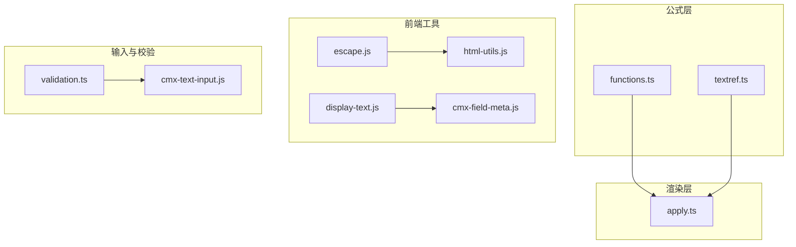
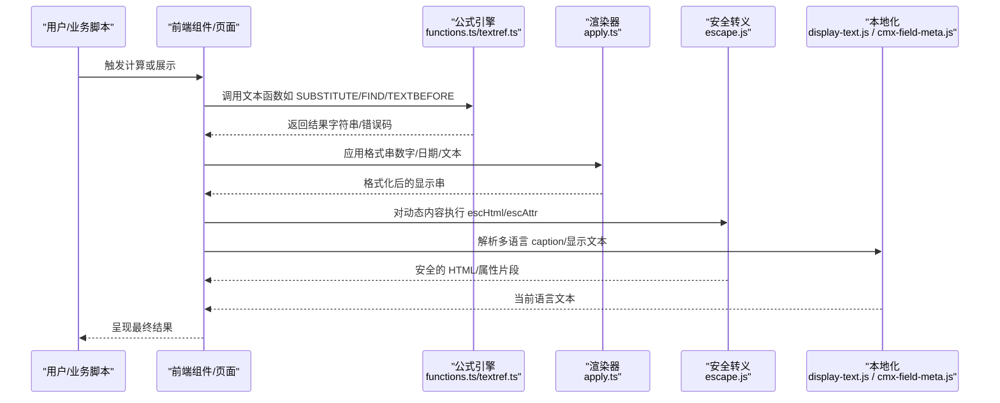
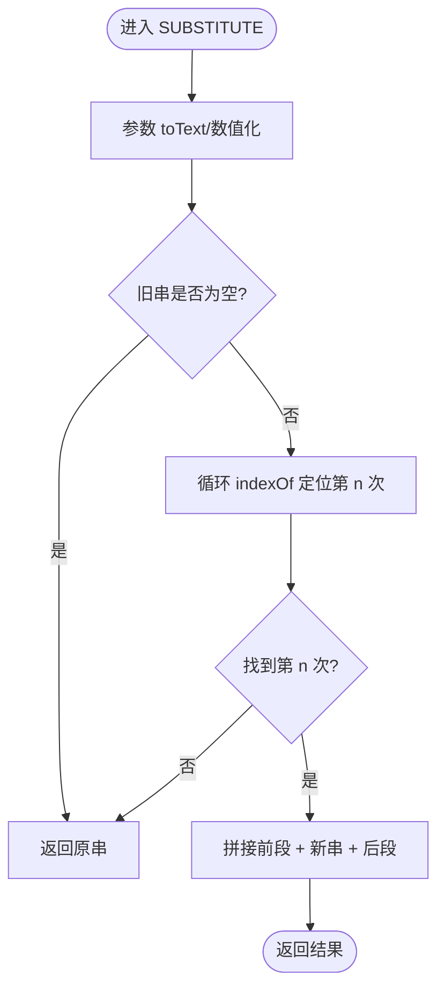
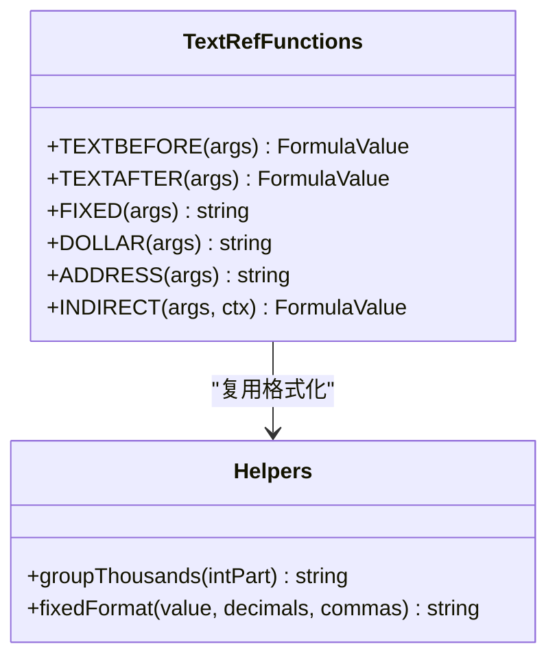
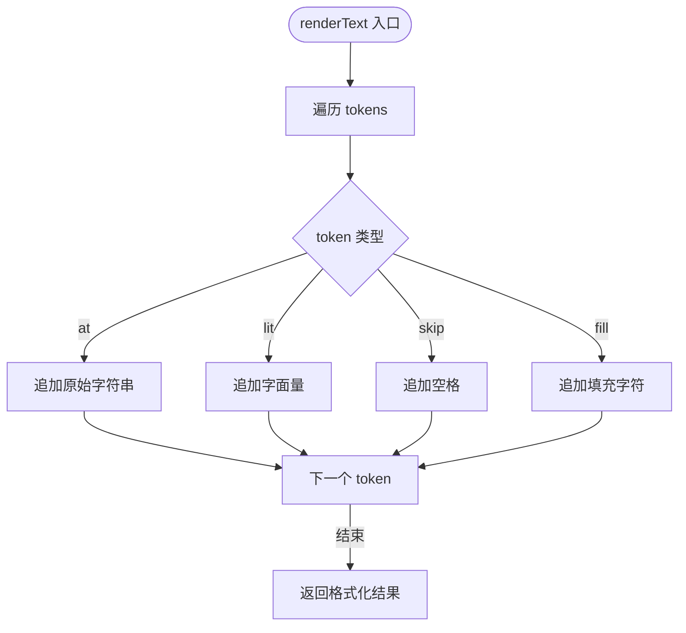
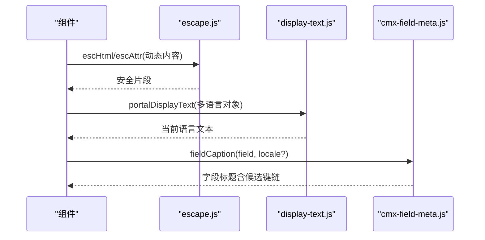
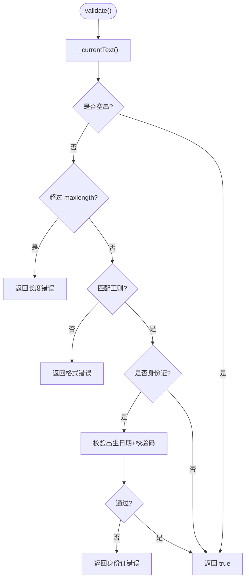
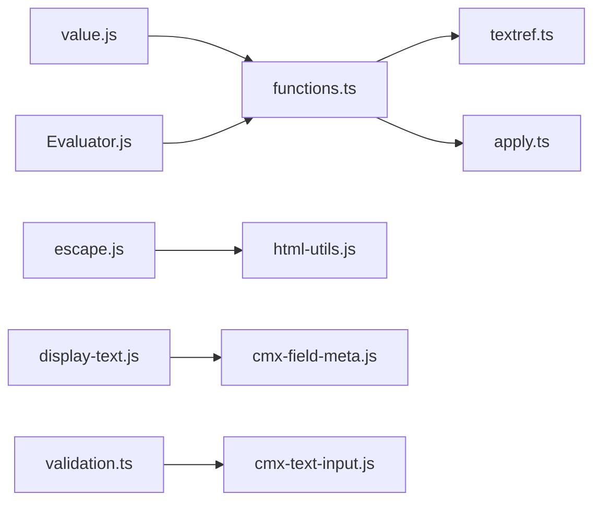

# 文本引用函数

<cite>
**本文引用的文件**
- [functions.ts](file://cmx-mega-sheet/src/formula/functions.ts)
- [textref.ts](file://cmx-mega-sheet/src/formula/builtins/textref.ts)
- [apply.ts](file://cmx-mega-sheet/src/render/numFmt/apply.ts)
- [escape.js](file://CMXPortalManager/src/lib/escape.js)
- [display-text.js](file://CMXPortalManager/src/lib/display-text.js)
- [cmx-field-meta.js](file://packages/cmx-data-comp/src/lib/cmx-field-meta.js)
- [html-utils.js](file://CMXHTMLDesigner/src/utils/html-utils.js)
- [validation.ts](file://cmx-mega-sheet/src/core/validation.ts)
- [cmx-text-input.js](file://packages/cmx-data-comp/src/components/cmx-text-input.js)
</cite>

## 目录
1. [简介](#简介)
2. [项目结构](#项目结构)
3. [核心组件](#核心组件)
4. [架构总览](#架构总览)
5. [详细组件分析](#详细组件分析)
6. [依赖关系分析](#依赖关系分析)
7. [性能考虑](#性能考虑)
8. [故障排查指南](#故障排查指南)
9. [结论](#结论)
10. [附录](#附录)

## 简介
本参考文档聚焦“文本引用函数”能力，覆盖字符串操作、格式化、查找替换、编码转换、多语言与本地化、大文本处理优化以及 Unicode 与特殊字符处理。内容基于仓库中公式引擎的内置文本函数、渲染层数值/日期/文本格式化、前端转义与显示文本工具、字段元数据的多语言 caption 解析，以及输入校验等实现进行系统化梳理，并提供流程图与时序图帮助理解关键流程。

## 项目结构
围绕文本处理的关键模块分布如下：
- 公式层（Excel 风格文本函数）：位于 cmx-mega-sheet 的公式内置函数集合，提供 CONCATENATE、LEFT、RIGHT、MID、LEN、TRIM、UPPER、LOWER、TEXT、VALUE、TEXTJOIN、SUBSTITUTE、REPLACE、FIND、SEARCH、REPT、PROPER、EXACT、CHAR、CODE、UNICHAR、UNICODE、NUMBERVALUE、MATCH 等。
- 引用与现代文本函数：位于 textref.ts，提供 TEXTBEFORE、TEXTAFTER、FIXED、DOLLAR、CLEAN、ADDRESS、INDIRECT、XOR、ERROR.TYPE、ISREF 等。
- 渲染层格式化：位于 apply.ts，负责数字、百分比、货币、日期时间、通用文本的格式串解析与输出。
- 安全转义与显示文本：escape.js 提供 HTML/属性转义；display-text.js 提供国际化优先的显示文本提取；cmx-field-meta.js 提供字段标题的多语言候选键解析与兜底。
- 设计器 HTML 工具：html-utils.js 提供 prettyFormatHtml、serializeDesignArea、escapeHtml/escapeAttr 等。
- 输入校验：validation.ts 提供文本长度、列表、正则等规则校验；cmx-text-input.js 在组件层集成校验与 i18n 值归一化。

图表来源
- [functions.ts:226-283](file://cmx-mega-sheet/src/formula/functions.ts#L226-L283)
- [textref.ts:30-189](file://cmx-mega-sheet/src/formula/builtins/textref.ts#L30-L189)
- [apply.ts:235-320](file://cmx-mega-sheet/src/render/numFmt/apply.ts#L235-L320)
- [escape.js:1-34](file://CMXPortalManager/src/lib/escape.js#L1-L34)
- [display-text.js:1-15](file://CMXPortalManager/src/lib/display-text.js#L1-L15)
- [cmx-field-meta.js:1-110](file://packages/cmx-data-comp/src/lib/cmx-field-meta.js#L1-L110)
- [html-utils.js:24-81](file://CMXHTMLDesigner/src/utils/html-utils.js#L24-L81)
- [validation.ts:1-87](file://cmx-mega-sheet/src/core/validation.ts#L1-L87)
- [cmx-text-input.js:225-253](file://packages/cmx-data-comp/src/components/cmx-text-input.js#L225-L253)

章节来源
- [functions.ts:226-283](file://cmx-mega-sheet/src/formula/functions.ts#L226-L283)
- [textref.ts:30-189](file://cmx-mega-sheet/src/formula/builtins/textref.ts#L30-L189)
- [apply.ts:235-320](file://cmx-mega-sheet/src/render/numFmt/apply.ts#L235-L320)
- [escape.js:1-34](file://CMXPortalManager/src/lib/escape.js#L1-L34)
- [display-text.js:1-15](file://CMXPortalManager/src/lib/display-text.js#L1-L15)
- [cmx-field-meta.js:1-110](file://packages/cmx-data-comp/src/lib/cmx-field-meta.js#L1-L110)
- [html-utils.js:24-81](file://CMXHTMLDesigner/src/utils/html-utils.js#L24-L81)
- [validation.ts:1-87](file://cmx-mega-sheet/src/core/validation.ts#L1-L87)
- [cmx-text-input.js:225-253](file://packages/cmx-data-comp/src/components/cmx-text-input.js#L225-L253)

## 核心组件
- 公式文本函数族
  - 基础操作：CONCATENATE/CONCAT、LEFT、RIGHT、MID、LEN、TRIM、UPPER、LOWER、PROPER、EXACT、REPT。
  - 查找与定位：FIND（区分大小写）、SEARCH（不区分大小写且支持 ? * 通配符）。
  - 替换与分割：SUBSTITUTE（按第 n 次出现替换）、REPLACE（按位置替换）、TEXTJOIN（分隔连接）。
  - 编码与字符：CHAR/CODE、UNICHAR/UNICODE、CLEAN（去除 ASCII 控制字符）。
  - 数值与文本互转：VALUE、NUMBERVALUE、TEXT（结合格式串）。
  - 匹配：MATCH（用于查找匹配项索引）。
- 引用与现代文本
  - TEXTBEFORE/TEXTAFTER：按分隔符与实例序号返回前/后子串，支持负序号从末尾计数。
  - FIXED/DOLLAR：定点格式化与货币符号包裹，支持千分位与小数位控制。
  - ADDRESS/INDIRECT：地址文本生成与文本引用求值（区域取左上角）。
- 渲染层格式化
  - 数字：固定小数、千分位、百分比、货币前缀、括号负数、通用最短表示。
  - 日期时间：序列号到年月日时分秒、12/24 小时制、经过时间 [h]:mm。
  - 文本：占位 at、字面量 lit、填充 fill、跳过 skip 等 token 渲染。
- 安全转义与显示文本
  - escHtml/escAttr/escAttrHtml：统一 HTML 文本节点与属性值转义，避免 XSS。
  - portalDisplayText：对象型多语言文本的优先级选择与空值回退。
  - fieldCaption/currentLocaleCandidates：字段标题的多语言候选键链与 UI5 语言读取。
- 输入校验
  - validation.ts：list/whole/decimal/date/textLength/custom 等规则校验。
  - cmx-text-input.js：长度限制、正则（含 phone/email/idcard 内置模式）、身份证附加校验。

章节来源
- [functions.ts:226-283](file://cmx-mega-sheet/src/formula/functions.ts#L226-L283)
- [textref.ts:30-189](file://cmx-mega-sheet/src/formula/builtins/textref.ts#L30-L189)
- [apply.ts:235-320](file://cmx-mega-sheet/src/render/numFmt/apply.ts#L235-L320)
- [escape.js:1-34](file://CMXPortalManager/src/lib/escape.js#L1-L34)
- [display-text.js:1-15](file://CMXPortalManager/src/lib/display-text.js#L1-L15)
- [cmx-field-meta.js:1-110](file://packages/cmx-data-comp/src/lib/cmx-field-meta.js#L1-L110)
- [validation.ts:1-87](file://cmx-mega-sheet/src/core/validation.ts#L1-L87)
- [cmx-text-input.js:225-253](file://packages/cmx-data-comp/src/components/cmx-text-input.js#L225-L253)

## 架构总览
下图展示文本处理在“公式计算 → 渲染输出 → 前端展示”的链路，以及安全与本地化的横切关注点。

图表来源
- [functions.ts:226-283](file://cmx-mega-sheet/src/formula/functions.ts#L226-L283)
- [textref.ts:30-189](file://cmx-mega-sheet/src/formula/builtins/textref.ts#L30-L189)
- [apply.ts:235-320](file://cmx-mega-sheet/src/render/numFmt/apply.ts#L235-L320)
- [escape.js:1-34](file://CMXPortalManager/src/lib/escape.js#L1-L34)
- [display-text.js:1-15](file://CMXPortalManager/src/lib/display-text.js#L1-L15)
- [cmx-field-meta.js:1-110](file://packages/cmx-data-comp/src/lib/cmx-field-meta.js#L1-L110)

## 详细组件分析

### 文本函数族（查找、替换、截取、拼接、编码）
- 算法要点
  - 查找：FIND 使用 indexOf 并支持起始偏移；SEARCH 将通配符转换为正则并忽略大小写，支持从指定位置开始匹配。
  - 替换：SUBSTITUTE 通过循环 indexOf 定位第 n 次出现并替换；REPLACE 基于位置切片拼接。
  - 截取：LEFT/RIGHT/MID 基于 slice 与边界保护（start 最小为 1，len 非负）。
  - 拼接：CONCATENATE/CONCAT 遍历参数并 toText 累加；TEXTJOIN 使用分隔符连接。
  - 编码：CHAR/CODE 基于 charCodeAt/fromCharCode；UNICHAR/UNICODE 基于 codePointAt/fromCodePoint 以支持代理对；CLEAN 过滤 ASCII 控制字符。
- 边界情况
  - 空串与无效参数：多数函数先 toText/scaleArg，遇到错误类型直接返回错误码。
  - 索引越界：MID/REPLACE 使用 Math.max(0, len) 与 Math.max(1, start) 防止越界。
  - 通配符：SEARCH 的 wildcardToRegExp 需正确处理 ? 与 * 的语义。
- 复杂度
  - 查找/替换：O(n) 线性扫描；多次替换时可能多次遍历。
  - 截取/拼接：slice 与 concat 均为 O(k)，k 为结果长度。
- 优化建议
  - 批量替换可考虑一次性构建正则或使用更高效的分块策略。
  - 超大文本建议流式处理或分片计算，避免单次创建过长中间串。

图表来源
- [functions.ts:674-685](file://cmx-mega-sheet/src/formula/functions.ts#L674-L685)
- [functions.ts:687-701](file://cmx-mega-sheet/src/formula/functions.ts#L687-L701)

章节来源
- [functions.ts:226-283](file://cmx-mega-sheet/src/formula/functions.ts#L226-L283)
- [functions.ts:674-701](file://cmx-mega-sheet/src/formula/functions.ts#L674-L701)

### 引用与现代文本函数（TEXTBEFORE/AFTER、FIXED/DOLLAR、ADDRESS/INDIRECT）
- 算法要点
  - TEXTBEFORE/TEXTAFTER：收集所有分隔符位置，根据 instance 正负选择命中位置并切片。
  - FIXED/DOLLAR：定点格式化，decimals<0 时对整数部分舍入；DOLLAR 包裹货币符号并按 Excel 规则处理负数。
  - ADDRESS：根据绝对/相对标志生成 A1 或 R1C1 地址，可选 sheet 名前缀。
  - INDIRECT：R1C1 仅支持绝对形式，区域引用在标量上下文返回左上角值。
- 边界情况
  - 分隔符为空：TEXTBEFORE 返回空串，TEXTAFTER 返回原串。
  - 无效 instance：超出范围或为 0 返回 #VALUE! 或 #N/A。
  - 地址合法性：行列必须为正，abs_num 必须在 1..4。
- 复杂度
  - 分隔符扫描：O(n)。
  - 地址解析：常数时间。

图表来源
- [textref.ts:30-189](file://cmx-mega-sheet/src/formula/builtins/textref.ts#L30-L189)

章节来源
- [textref.ts:30-189](file://cmx-mega-sheet/src/formula/builtins/textref.ts#L30-L189)

### 渲染层格式化（数字、日期、文本）
- 算法要点
  - 数字：解析格式串 token，支持千分位、百分比、货币前缀、条件段（负数括号）、通用最短表示。
  - 日期：序列号拆分到年月日时分秒，支持 12/24 小时制与经过时间。
  - 文本：at/lit/skip/fill 等 token 组合输出。
- 边界情况
  - 无效格式串：token 未知则忽略或按默认行为处理。
  - 零值与空串：按格式串要求输出或留空。
- 复杂度
  - 逐 token 遍历：O(m)，m 为 token 数量。

图表来源
- [apply.ts:302-312](file://cmx-mega-sheet/src/render/numFmt/apply.ts#L302-L312)

章节来源
- [apply.ts:235-320](file://cmx-mega-sheet/src/render/numFmt/apply.ts#L235-L320)

### 安全转义与显示文本（防 XSS 与多语言）
- 算法要点
  - escHtml：转义 & < >，用于文本节点。
  - escAttr：额外转义 " 与防御性转义 < >，用于属性值。
  - escAttrHtml：保守集合，同时适用于不确定上下文。
  - portalDisplayText：优先 zh_CN/zh-CN/zh/default/en_US/en，否则取首个非空值。
  - fieldCaption/currentLocaleCandidates：读取 UI5 getLanguage，生成候选键链（包含 '-'/'_' 互换与主语言段），并支持显式 locale 覆盖。
- 边界情况
  - null/undefined：统一转为空串或 fallback。
  - 多语言对象无匹配：回退到第一个非空值或字段名/ID。
- 复杂度
  - 转义：O(n) 字符串扫描。
  - 候选键生成：常数级映射与去重。

图表来源
- [escape.js:1-34](file://CMXPortalManager/src/lib/escape.js#L1-L34)
- [display-text.js:1-15](file://CMXPortalManager/src/lib/display-text.js#L1-L15)
- [cmx-field-meta.js:1-110](file://packages/cmx-data-comp/src/lib/cmx-field-meta.js#L1-L110)

章节来源
- [escape.js:1-34](file://CMXPortalManager/src/lib/escape.js#L1-L34)
- [display-text.js:1-15](file://CMXPortalManager/src/lib/display-text.js#L1-L15)
- [cmx-field-meta.js:1-110](file://packages/cmx-data-comp/src/lib/cmx-field-meta.js#L1-L110)

### 输入校验与本地化输入（长度、正则、身份证）
- 算法要点
  - 长度校验：maxlength 超限返回错误信息。
  - 正则校验：内置 phone/email/idcard 模式，或自定义 pattern 优先。
  - 身份证附加校验：位数正则通过后进一步校验出生日期与 GB 11643 校验码。
  - i18n 值归一：setValue 接受对象，内部按当前 locale 归一为多语言分量。
- 边界情况
  - 空值由 required 负责，此处放过。
  - 自定义正则失败返回错误信息。
- 复杂度
  - 正则匹配：O(n)，n 为输入长度。

图表来源
- [cmx-text-input.js:225-253](file://packages/cmx-data-comp/src/components/cmx-text-input.js#L225-L253)
- [validation.ts:1-87](file://cmx-mega-sheet/src/core/validation.ts#L1-L87)

章节来源
- [cmx-text-input.js:225-253](file://packages/cmx-data-comp/src/components/cmx-text-input.js#L225-L253)
- [validation.ts:1-87](file://cmx-mega-sheet/src/core/validation.ts#L1-L87)

## 依赖关系分析
- 公式层依赖 value/Evaluator 提供的 toText、scalarArg、isError 等基础能力。
- 渲染层依赖格式串编译与 token 解析，与公式层解耦但共享数值/日期概念。
- 前端工具独立于公式与渲染，专注于安全与本地化。
- 输入校验与表单组件耦合，确保用户输入符合业务规则。

图表来源
- [functions.ts:226-283](file://cmx-mega-sheet/src/formula/functions.ts#L226-L283)
- [textref.ts:30-189](file://cmx-mega-sheet/src/formula/builtins/textref.ts#L30-L189)
- [apply.ts:235-320](file://cmx-mega-sheet/src/render/numFmt/apply.ts#L235-L320)
- [escape.js:1-34](file://CMXPortalManager/src/lib/escape.js#L1-L34)
- [display-text.js:1-15](file://CMXPortalManager/src/lib/display-text.js#L1-L15)
- [cmx-field-meta.js:1-110](file://packages/cmx-data-comp/src/lib/cmx-field-meta.js#L1-L110)
- [validation.ts:1-87](file://cmx-mega-sheet/src/core/validation.ts#L1-L87)
- [cmx-text-input.js:225-253](file://packages/cmx-data-comp/src/components/cmx-text-input.js#L225-L253)

章节来源
- [functions.ts:226-283](file://cmx-mega-sheet/src/formula/functions.ts#L226-L283)
- [textref.ts:30-189](file://cmx-mega-sheet/src/formula/builtins/textref.ts#L30-L189)
- [apply.ts:235-320](file://cmx-mega-sheet/src/render/numFmt/apply.ts#L235-L320)
- [escape.js:1-34](file://CMXPortalManager/src/lib/escape.js#L1-L34)
- [display-text.js:1-15](file://CMXPortalManager/src/lib/display-text.js#L1-L15)
- [cmx-field-meta.js:1-110](file://packages/cmx-data-comp/src/lib/cmx-field-meta.js#L1-L110)
- [validation.ts:1-87](file://cmx-mega-sheet/src/core/validation.ts#L1-L87)
- [cmx-text-input.js:225-253](file://packages/cmx-data-comp/src/components/cmx-text-input.js#L225-L253)

## 性能考虑
- 大文本处理
  - 避免重复创建长串：尽量使用 slice/replace 一次到位，减少中间对象。
  - 批量替换：考虑构建正则一次性替换，而非多次 indexOf。
  - 流式处理：对于超大文本，采用分块或流式 API（如 ReadableStream）逐步处理，降低内存峰值。
- 查找与替换
  - FIND/SEARCH：合理设置起始位置，避免全串扫描。
  - SUBSTITUTE：当 n 较大时注意循环次数；必要时改用正则。
- 格式化
  - 格式串 token 解析应缓存；频繁渲染场景下避免重复编译。
  - 日期序列化尽量复用部件数组，减少重复计算。
- 安全与本地化
  - 转义函数为 O(n)，应在热点路径谨慎调用；批量渲染时可合并转义。
  - 多语言候选键生成成本较低，可在初始化阶段预计算。

[本节为通用指导，无需特定文件来源]

## 故障排查指南
- 常见错误码
  - #VALUE!：参数类型错误或非法索引（如 FIND/SEARCH 未找到、instance=0）。
  - #REF!：无效引用或地址（如 INDIRECT 不支持的 R1C1 形式）。
  - #N/A：未找到匹配（如 TEXTBEFORE/AFTER 未找到分隔符且未提供 else）。
- 调试建议
  - 检查参数 toText/数值化是否成功，确认边界值（空串、负数、超长）。
  - 对 SEARCH 的通配符进行最小用例验证，确认 wildcardToRegExp 行为。
  - 对 REPLACE/SUBSTITUTE 的位置与长度进行断言，避免越界。
  - 对多语言显示文本，检查候选键链是否包含目标 locale。
- 安全相关
  - 任何动态 HTML 输出必须经 escHtml/escAttr 处理，避免 XSS。
  - 属性值必须转义引号与尖括号，防止注入。

章节来源
- [functions.ts:674-701](file://cmx-mega-sheet/src/formula/functions.ts#L674-L701)
- [textref.ts:116-135](file://cmx-mega-sheet/src/formula/builtins/textref.ts#L116-L135)
- [escape.js:1-34](file://CMXPortalManager/src/lib/escape.js#L1-L34)
- [display-text.js:1-15](file://CMXPortalManager/src/lib/display-text.js#L1-L15)
- [cmx-field-meta.js:24-38](file://packages/cmx-data-comp/src/lib/cmx-field-meta.js#L24-L38)

## 结论
本项目在文本处理方面提供了完整的公式函数族、渲染格式化、安全转义与多语言支持，覆盖了企业级应用的典型场景。通过清晰的职责划分与模块化设计，文本处理既具备高内聚的算法实现，又具备良好的可扩展性与安全性。针对大文本与复杂替换场景，建议结合流式处理与正则优化进一步提升性能。

[本节为总结，无需特定文件来源]

## 附录
- 实际应用场景示例（代码片段路径）
  - 数据清洗：使用 CLEAN 去除控制字符，TRIM 清理空白，SUBSTITUTE 标准化分隔符。
    - 参考路径：[functions.ts:250-283](file://cmx-mega-sheet/src/formula/functions.ts#L250-L283)、[textref.ts:157-163](file://cmx-mega-sheet/src/formula/builtins/textref.ts#L157-L163)
  - 报表生成：使用 TEXTJOIN 拼接明细行，FIXED/DOLLAR 格式化金额，DATE 系列与日期格式串渲染。
    - 参考路径：[functions.ts:256-261](file://cmx-mega-sheet/src/formula/functions.ts#L256-L261)、[textref.ts:145-156](file://cmx-mega-sheet/src/formula/builtins/textref.ts#L145-L156)、[apply.ts:235-320](file://cmx-mega-sheet/src/render/numFmt/apply.ts#L235-L320)
  - 国际化支持：使用 portalDisplayText 与 fieldCaption 获取当前语言文本，确保 caption 多语言键正确匹配。
    - 参考路径：[display-text.js:1-15](file://CMXPortalManager/src/lib/display-text.js#L1-L15)、[cmx-field-meta.js:58-81](file://packages/cmx-data-comp/src/lib/cmx-field-meta.js#L58-L81)
  - 安全输出：在 HTML 模板中使用 escHtml/escAttr 转义动态内容，避免 XSS。
    - 参考路径：[escape.js:1-34](file://CMXPortalManager/src/lib/escape.js#L1-L34)、[html-utils.js:369-377](file://CMXHTMLDesigner/src/utils/html-utils.js#L369-L377)
  - 输入校验：在表单组件中集成长度、正则与身份证校验，提升数据质量。
    - 参考路径：[cmx-text-input.js:225-253](file://packages/cmx-data-comp/src/components/cmx-text-input.js#L225-L253)、[validation.ts:24-65](file://cmx-mega-sheet/src/core/validation.ts#L24-L65)

[本节为补充说明，无需特定文件来源]