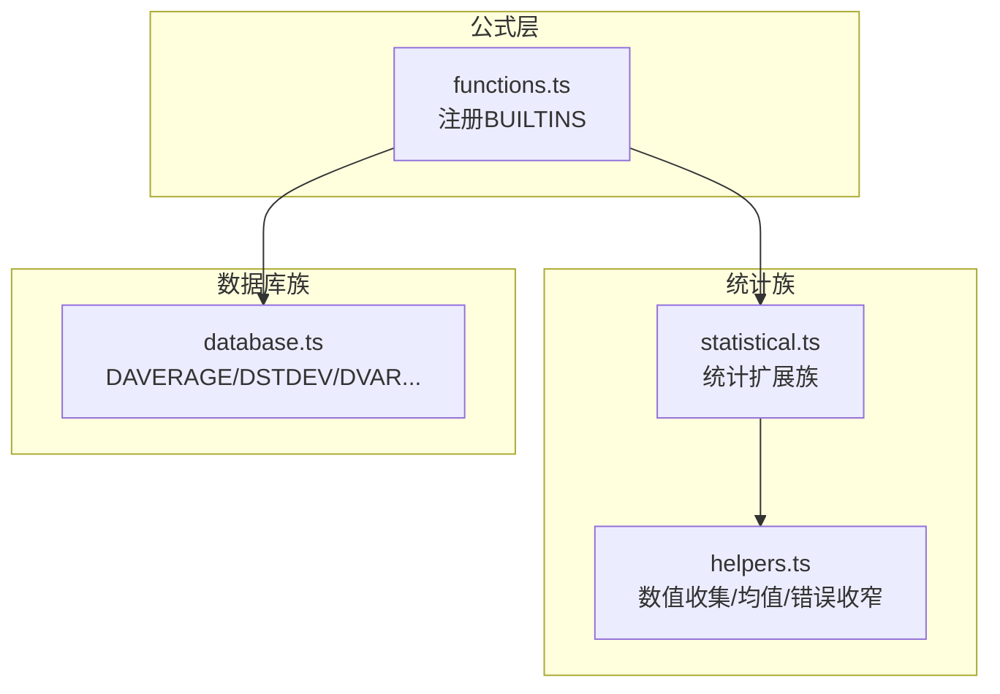
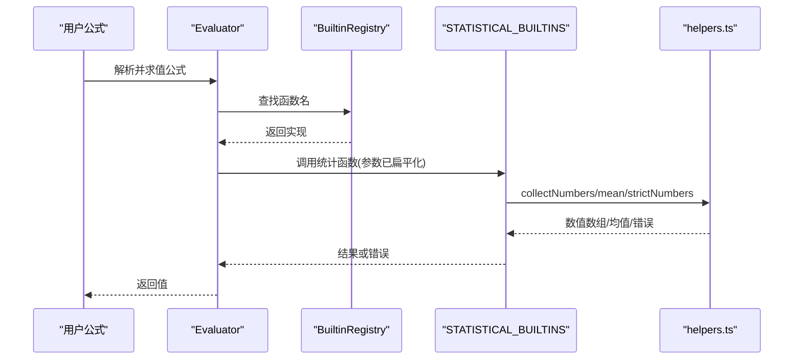
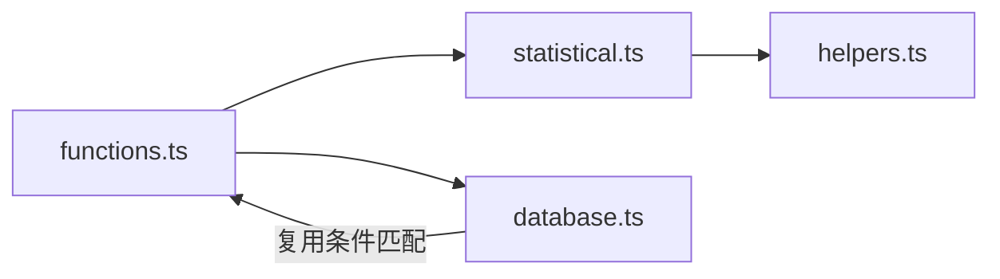

# 统计函数

<cite>
**本文引用的文件**
- [statistical.ts](file://cmx-mega-sheet/src/formula/builtins/statistical.ts)
- [functions.ts](file://cmx-mega-sheet/src/formula/functions.ts)
- [database.ts](file://cmx-mega-sheet/src/formula/builtins/database.ts)
- [helpers.ts](file://cmx-mega-sheet/src/formula/builtins/helpers.ts)
- [functionsM17.test.ts](file://cmx-mega-sheet/test/functionsM17.test.ts)
</cite>

## 目录
1. [简介](#简介)
2. [项目结构](#项目结构)
3. [核心组件](#核心组件)
4. [架构总览](#架构总览)
5. [详细组件分析](#详细组件分析)
6. [依赖关系分析](#依赖关系分析)
7. [性能考量](#性能考量)
8. [故障排查指南](#故障排查指南)
9. [结论](#结论)
10. [附录：与Excel兼容性与业务场景示例](#附录：与excel兼容性与业务场景示例)

## 简介
本参考文档面向统计分析函数的使用与实现，覆盖平均值、中位数、众数、标准差、方差、相关系数等常用统计计算，并说明其统计学原理、适用场景、计算方法、缺失值处理、异常值检测机制、置信区间与显著性检验的可用能力，以及与Excel统计函数的兼容性。该能力由表格引擎的公式系统提供，适用于数据分析、质量控制、市场研究等业务场景。

## 项目结构
统计函数主要位于公式内置函数族中的“统计扩展族”，并通过统一注册表暴露给公式解析与求值器。关键位置如下：
- 统计扩展族实现：builtins/statistical.ts
- 基础聚合与部分统计（AVERAGE/MEDIAN/MODE/STDEV/VAR/RANK/LARGE/SMALL/PERCENTILE）：functions.ts
- 数据库D函数族（DAVERAGE/DSTDEV/DVAR等）：builtins/database.ts
- 共享工具（collectNumbers/mean/isNums等）：builtins/helpers.ts
- 测试用例（验证统计行为与兼容性）：test/functionsM17.test.ts

图表来源
- [functions.ts:346-354](file://cmx-mega-sheet/src/formula/functions.ts#L346-L354)
- [statistical.ts:136-275](file://cmx-mega-sheet/src/formula/builtins/statistical.ts#L136-L275)
- [database.ts:151-169](file://cmx-mega-sheet/src/formula/builtins/database.ts#L151-L169)
- [helpers.ts:54-89](file://cmx-mega-sheet/src/formula/builtins/helpers.ts#L54-L89)

章节来源
- [functions.ts:346-354](file://cmx-mega-sheet/src/formula/functions.ts#L346-L354)
- [statistical.ts:136-275](file://cmx-mega-sheet/src/formula/builtins/statistical.ts#L136-L275)
- [database.ts:151-169](file://cmx-mega-sheet/src/formula/builtins/database.ts#L151-L169)
- [helpers.ts:54-89](file://cmx-mega-sheet/src/formula/builtins/helpers.ts#L54-L89)

## 核心组件
- 统计扩展族（statistical.ts）：提供均值家族（GEOMEAN/HARMEAN/TRIMMEAN/AVERAGEA）、离差（DEVSQ/AVEDEV/SKEW/KURT）、双变量回归与相关性（CORREL/PEARSON/COVAR/SLOPE/INTERCEPT/RSQ/FORECAST/STEYX）、次序与分位（QUARTILE/PERCENTRANK/RANK.AVG）、正态分布（NORM.DIST/NORM.INV/NORM.S.DIST/NORM.S.INV/STANDARDIZE/CONFIDENCE.NORM/GAUSS/PHI）。
- 基础函数（functions.ts）：提供AVERAGE/MEDIAN/MODE/STDEV/VAR/RANK/LARGE/SMALL/PERCENTILE等常用统计，以及SUMIF/COUNTIF等多条件聚合。
- 数据库函数（database.ts）：提供按条件区域筛选后的统计（DAVERAGE/DSTDEV/DVAR等），支持多条件“行或列”组合。
- 工具库（helpers.ts）：统一的数值收集、均值计算、错误收窄等，保证各函数族一致的数据清洗与错误传播语义。

章节来源
- [statistical.ts:136-275](file://cmx-mega-sheet/src/formula/builtins/statistical.ts#L136-L275)
- [functions.ts:67-164](file://cmx-mega-sheet/src/formula/functions.ts#L67-L164)
- [database.ts:151-169](file://cmx-mega-sheet/src/formula/builtins/database.ts#L151-L169)
- [helpers.ts:54-89](file://cmx-mega-sheet/src/formula/builtins/helpers.ts#L54-L89)

## 架构总览
统计函数通过统一注册表注入到公式引擎，解析后由求值器调用具体实现。数据在传入前会进行扁平化与类型转换，空值跳过、文本数字按规则处理、错误短路上抛。

图表来源
- [functions.ts:346-354](file://cmx-mega-sheet/src/formula/functions.ts#L346-L354)
- [statistical.ts:136-275](file://cmx-mega-sheet/src/formula/builtins/statistical.ts#L136-L275)
- [helpers.ts:54-89](file://cmx-mega-sheet/src/formula/builtins/helpers.ts#L54-L89)

## 详细组件分析

### 均值家族（GEOMEAN/HARMEAN/TRIMMEAN/AVERAGEA）
- GEOMEAN：几何平均，要求所有输入为正数；对负数或零返回数值错误。
- HARMEAN：调和平均，要求所有输入为正数；对负数或零返回数值错误。
- TRIMMEAN：截尾平均，去除两端指定比例的数据后再求均值，用于抑制极端值影响。
- AVERAGEA：将文本视为0、布尔TRUE/FALSE视为1/0，再求均值，对齐Excel语义。

适用场景
- 增长率复合计算（GEOMEAN）
- 速率/比率平均（HARMEAN）
- 抗异常值的稳健均值（TRIMMEAN）
- 混合数据类型区域的快速汇总（AVERAGEA）

章节来源
- [statistical.ts:138-171](file://cmx-mega-sheet/src/formula/builtins/statistical.ts#L138-L171)

### 中位数与众数（MEDIAN/MODE）
- MEDIAN：排序后取中间值或两中间值平均。
- MODE/MODE.SNGL：出现频率最高的值；若无重复则返回未找到错误。

适用场景
- 收入/价格分布的中心趋势（MEDIAN）
- 最常见类别或评分（MODE）

章节来源
- [functions.ts:148-150](file://cmx-mega-sheet/src/formula/functions.ts#L148-L150)
- [functions.ts:502-519](file://cmx-mega-sheet/src/formula/functions.ts#L502-L519)

### 标准差与方差（STDEV/STDEVP/VAR/VARP及A变体）
- STDEV/VAR：样本标准差/方差，自由度n-1。
- STDEVP/VARP：总体标准差/方差，自由度n。
- AVERAGEA/STDEVA/STDEVPA/VARA/VARPA：A变体将文本视为0、布尔1/0参与计算。

适用场景
- 质量波动度量（标准差）
- 风险/离散度评估（方差）
- 含非数值但需纳入计算的混合数据（A变体）

章节来源
- [functions.ts:151-158](file://cmx-mega-sheet/src/formula/functions.ts#L151-L158)
- [statistical.ts:168-171](file://cmx-mega-sheet/src/formula/builtins/statistical.ts#L168-L171)
- [statistical.ts:278-289](file://cmx-mega-sheet/src/formula/builtins/statistical.ts#L278-L289)

### 相关系数与回归（CORREL/PEARSON/RSQ/SLOPE/INTERCEPT/COVAR/FORECAST/STEYX）
- CORREL/PEARSON：线性相关系数，范围[-1,1]。
- RSQ：决定系数（相关系数的平方）。
- SLOPE/INTERCEPT：线性回归斜率与截距。
- COVAR/COVARIANCE.P/COVARIANCE.S：协方差（总体/样本）。
- FORECAST/FORECAST.LINEAR：基于已知数据的线性预测。
- STEYX：估计标准误差。

适用场景
- 变量间线性关系强度（CORREL/RSQ）
- 建立简单预测模型（SLOPE/INTERCEPT/FORECAST）
- 评估预测精度（STEYX）

章节来源
- [statistical.ts:218-235](file://cmx-mega-sheet/src/formula/builtins/statistical.ts#L218-L235)
- [statistical.ts:305-327](file://cmx-mega-sheet/src/formula/builtins/statistical.ts#L305-L327)

### 次序与分位（QUARTILE/PERCENTRANK/RANK.AVG）
- QUARTILE/QUARTILE.INC/QUARTILE.EXC：四分位数（包含/不包含端点插值）。
- PERCENTRANK/PERCENTRANK.INC/PERCENTRANK.EXC：相对位置百分比。
- RANK.AVG：并列排名取平均。

适用场景
- 成绩/绩效的分位定位（QUARTILE/PERCENTRANK）
- 排名与并列处理（RANK.AVG）

章节来源
- [statistical.ts:238-249](file://cmx-mega-sheet/src/formula/builtins/statistical.ts#L238-L249)
- [statistical.ts:329-376](file://cmx-mega-sheet/src/formula/builtins/statistical.ts#L329-L376)

### 正态分布与置信区间（NORM.DIST/NORM.INV/NORM.S.DIST/NORM.S.INV/STANDARDIZE/CONFIDENCE.NORM/GAUSS/PHI）
- NORM.DIST/NORM.S.DIST：正态分布概率密度/累积分布。
- NORM.INV/NORM.S.INV：反函数（分位数）。
- STANDARDIZE：标准化为Z分数。
- CONFIDENCE.NORM：给定显著性水平与总体标准差的置信区间半宽。
- GAUSS/PHI：标准正态CDF减0.5与PDF。

适用场景
- 假设检验与置信区间估算（CONFIDENCE.NORM + 正态分位）
- 过程能力/合格率评估（NORM.DIST）
- 异常值阈值设定（STANDARDIZE + 分位数）

章节来源
- [statistical.ts:79-116](file://cmx-mega-sheet/src/formula/builtins/statistical.ts#L79-L116)
- [statistical.ts:251-274](file://cmx-mega-sheet/src/formula/builtins/statistical.ts#L251-L274)
- [statistical.ts:378-404](file://cmx-mega-sheet/src/formula/builtins/statistical.ts#L378-L404)

### 数据库条件统计（DAVERAGE/DSTDEV/DVAR等）
- DAVERAGE：按条件区域筛选后求均值。
- DSTDEV/DSTDEVP/DVAR/DVARP：按条件区域筛选后求标准差/方差。
- 支持多条件“行或”、“列与”的组合筛选，条件支持运算符前缀与通配符。

适用场景
- 按类别/时间段筛选后的质量指标统计
- 报表中按维度聚合的统计

章节来源
- [database.ts:151-169](file://cmx-mega-sheet/src/formula/builtins/database.ts#L151-L169)
- [database.ts:84-129](file://cmx-mega-sheet/src/formula/builtins/database.ts#L84-L129)

### 缺失值处理与异常值检测
- 缺失值：空单元格在多数统计中被跳过；成对缺失在双变量函数中成对跳过。
- 文本与布尔：AVERAGEA/STDEVA/VARA等A变体将文本视为0、布尔TRUE/FALSE视为1/0；普通聚合忽略纯文本。
- 异常值：TRIMMEAN可剔除两端极端值；也可结合分位函数识别上下界。
- 错误短路：任何参数为错误值时，函数直接返回错误，便于快速定位问题。

章节来源
- [statistical.ts:28-59](file://cmx-mega-sheet/src/formula/builtins/statistical.ts#L28-L59)
- [statistical.ts:152-164](file://cmx-mega-sheet/src/formula/builtins/statistical.ts#L152-L164)
- [helpers.ts:54-66](file://cmx-mega-sheet/src/formula/builtins/helpers.ts#L54-L66)

### 置信区间与显著性检验
- 置信区间：CONFIDENCE.NORM提供基于正态分布的置信区间半宽，配合样本均值可得区间估计。
- 显著性检验：当前实现未提供t检验/z检验/p值函数；可通过正态分位与标准误手工构造近似检验逻辑（例如利用STANDARDIZE与CONFIDENCE.NORM）。

章节来源
- [statistical.ts:397-404](file://cmx-mega-sheet/src/formula/builtins/statistical.ts#L397-L404)

## 依赖关系分析
- functions.ts作为统一入口，汇聚数学、财务、统计、数据库、文本引用、工程函数族。
- statistical.ts依赖helpers.ts的数值收集与均值工具，并复用错误判断与类型转换。
- database.ts复用functions.ts的条件匹配逻辑（运算符前缀、通配符）以实现条件筛选。

图表来源
- [functions.ts:346-354](file://cmx-mega-sheet/src/formula/functions.ts#L346-L354)
- [statistical.ts:13-26](file://cmx-mega-sheet/src/formula/builtins/statistical.ts#L13-L26)
- [database.ts:34-72](file://cmx-mega-sheet/src/formula/builtins/database.ts#L34-L72)

章节来源
- [functions.ts:346-354](file://cmx-mega-sheet/src/formula/functions.ts#L346-L354)
- [statistical.ts:13-26](file://cmx-mega-sheet/src/formula/builtins/statistical.ts#L13-L26)
- [database.ts:34-72](file://cmx-mega-sheet/src/formula/builtins/database.ts#L34-L72)

## 性能考量
- 时间复杂度：大多数统计函数为O(n)或O(n log n)（排序类如QUARTILE/MEDIAN）。
- 内存占用：避免创建额外大对象，尽量就地迭代与归约。
- 错误短路：尽早返回错误，减少无效计算。
- 大数据集建议：使用TRIMMEAN降低极端值影响；必要时分块计算或使用数据库函数按条件筛选减少数据量。

[本节为通用指导，不直接分析具体文件]

## 故障排查指南
- #DIV/0!：样本标准差/方差需要至少2个有效样本；相关/回归需要至少2对有效数据且自变量方差非零。
- #NUM!：几何/调和平均要求正数；分位/百分位超出范围；正态分布参数非法（如标准差≤0）。
- #N/A：目标值不在数据范围内（如PERCENTRANK越界）；RANK未找到目标。
- #VALUE!：向量长度不一致（如SUMPRODUCT）；数据库字段不存在。
- 调试建议：逐步检查参数是否为错误值；用AVERAGE/COUNT确认有效样本数量；用TRIMMEAN排除异常值后再计算。

章节来源
- [statistical.ts:138-171](file://cmx-mega-sheet/src/formula/builtins/statistical.ts#L138-L171)
- [statistical.ts:218-235](file://cmx-mega-sheet/src/formula/builtins/statistical.ts#L218-L235)
- [statistical.ts:238-249](file://cmx-mega-sheet/src/formula/builtins/statistical.ts#L238-L249)
- [statistical.ts:378-404](file://cmx-mega-sheet/src/formula/builtins/statistical.ts#L378-L404)
- [functions.ts:502-559](file://cmx-mega-sheet/src/formula/functions.ts#L502-L559)

## 结论
该统计函数族覆盖了从基础集中趋势、离散程度到相关性、回归、分位与正态分布的常见需求，具备与Excel高度一致的语义与错误处理。通过A变体、条件统计与稳健均值，可满足多种业务场景的数据分析与质量控制。对于更高级的显著性检验，可借助现有正态分布与置信区间函数手工构建。

[本节为总结性内容，不直接分析具体文件]

## 附录：与Excel兼容性与业务场景示例

### 与Excel统计函数的兼容性
- 名称与行为对齐：AVERAGE/MEDIAN/MODE/STDEV/VAR/RANK/LARGE/SMALL/PERCENTILE等已在基础函数中实现；统计扩展族补充了GEOMEAN/HARMEAN/TRIMMEAN/AVERAGEA、DEVSQ/AVEDEV/SKEW/KURT、CORREL/PEARSON/COVAR/SLOPE/INTERCEPT/RSQ/FORECAST/STEYX、QUARTILE/PERCENTRANK/RANK.AVG、NORM.DIST/NORM.INV/NORM.S.DIST/NORM.S.INV/STANDARDIZE/CONFIDENCE.NORM/GAUSS/PHI。
- 语义细节：AVERAGEA/STDEVA/VARA等A变体将文本视为0、布尔1/0；双变量函数成对缺失跳过；分位INC/EXC差异与Excel一致。
- 数据库函数：DAVERAGE/DSTDEV/DVAR等支持多条件筛选，条件匹配与通配符与SUMIF家族一致。

章节来源
- [functions.ts:67-164](file://cmx-mega-sheet/src/formula/functions.ts#L67-L164)
- [statistical.ts:136-275](file://cmx-mega-sheet/src/formula/builtins/statistical.ts#L136-L275)
- [database.ts:151-169](file://cmx-mega-sheet/src/formula/builtins/database.ts#L151-L169)
- [functionsM17.test.ts:155-194](file://cmx-mega-sheet/test/functionsM17.test.ts#L155-L194)

### 业务场景示例
- 数据分析：使用AVERAGE/MEDIAN/MODE了解中心趋势；用STDEV/VAR衡量波动；用CORREL/RSQ评估变量关系；用FORECAST做简单预测。
- 质量控制：用TRIMMEAN剔除极端偏差；用STDEVA/VARA处理含文本/布尔的质检记录；用NORM.DIST评估合格率；用CONFIDENCE.NORM给出置信区间。
- 市场研究：用PERCENTRANK/QUARTILE定位受访者得分分位；用RANK.AVG处理并列排名；用SLOPE/INTERCEPT建立价格-销量线性模型。

章节来源
- [functionsM17.test.ts:155-194](file://cmx-mega-sheet/test/functionsM17.test.ts#L155-L194)