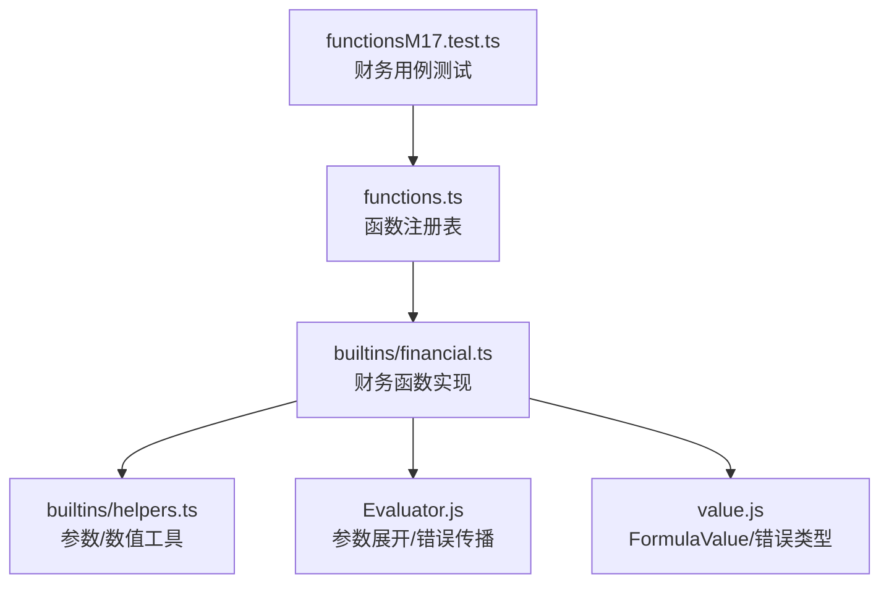
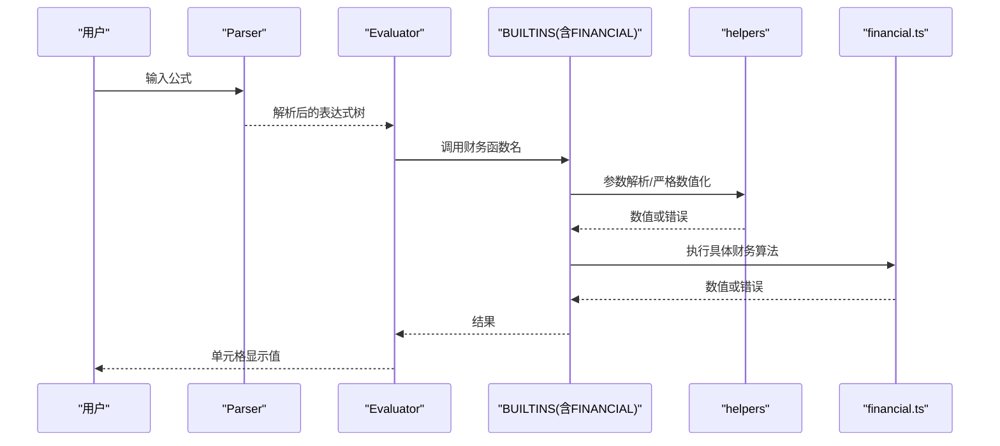
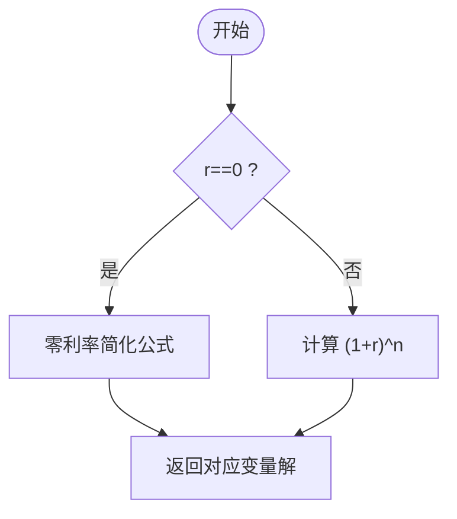
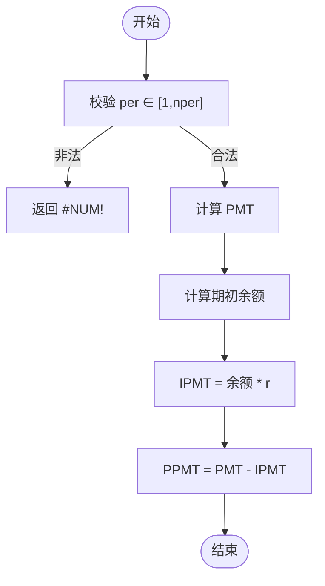
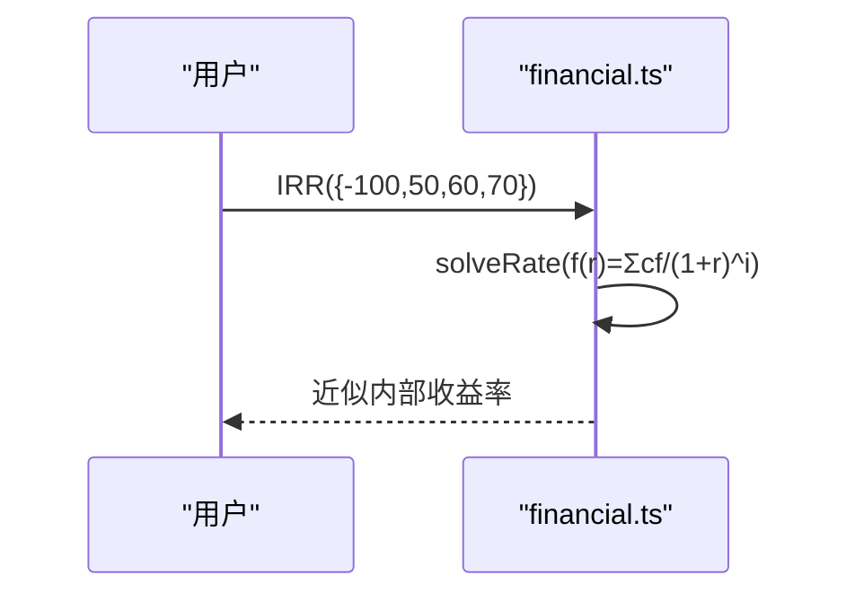
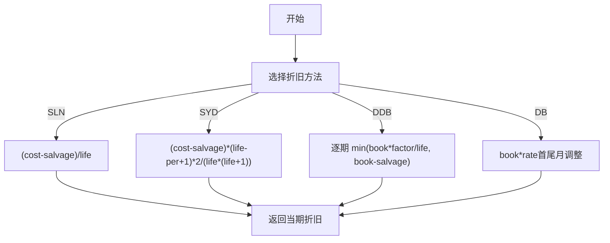
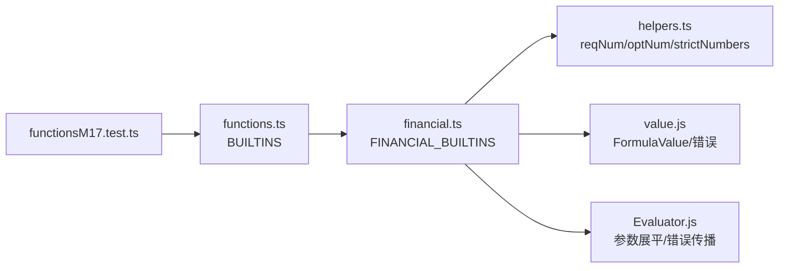

# 财务函数

<cite>
**本文引用的文件**
- [financial.ts](file://cmx-mega-sheet/src/formula/builtins/financial.ts)
- [helpers.ts](file://cmx-mega-sheet/src/formula/builtins/helpers.ts)
- [functions.ts](file://cmx-mega-sheet/src/formula/functions.ts)
- [Evaluator.js](file://cmx-mega-sheet/src/formula/Evaluator.js)
- [value.js](file://cmx-mega-sheet/src/formula/value.js)
- [functionsM17.test.ts](file://cmx-mega-sheet/test/functionsM17.test.ts)
</cite>

## 目录
1. [简介](#简介)
2. [项目结构](#项目结构)
3. [核心组件](#核心组件)
4. [架构总览](#架构总览)
5. [详细组件分析](#详细组件分析)
6. [依赖关系分析](#依赖关系分析)
7. [性能与数值稳定性](#性能与数值稳定性)
8. [故障排查指南](#故障排查指南)
9. [结论](#结论)
10. [附录：业务场景与最佳实践](#附录业务场景与最佳实践)

## 简介
本参考文档聚焦于电子表格引擎中的“财务函数族”，覆盖年金（PMT/PV/FV/NPER/RATE）、本息拆分（IPMT/PPMT/CUMIPMT/CUMPRINC）、投资评估（NPV/IRR/MIRR/XNPV/XIRR）、折旧（SLN/SYD/DDB/DB）、利率换算（EFFECT/NOMINAL）以及复利增长相关工具（PDURATION/RRI、DOLLARDE/DOLLARFR）。所有实现遵循 Excel 语义约定：type=0 表示期末付款，type=1 表示期初付款；现金流方向遵循“付出为负、收入为正”的惯例。迭代类函数（RATE/IRR/XIRR）采用牛顿法求解并辅以二分兜底，不收敛时返回 #NUM!。

## 项目结构
财务函数位于公式引擎的内置函数模块中，按“族”拆分管理：
- 财务函数实现：builtins/financial.ts
- 参数解析与数值处理工具：builtins/helpers.ts
- 函数注册表与统一入口：functions.ts（将各族函数合并到 BUILTINS）
- 求值器与类型系统：Evaluator.js、value.js
- 单元测试验证：test/functionsM17.test.ts

图表来源
- [functions.ts:346-354](file://cmx-mega-sheet/src/formula/functions.ts#L346-L354)
- [financial.ts:131-345](file://cmx-mega-sheet/src/formula/builtins/financial.ts#L131-L345)
- [helpers.ts:37-79](file://cmx-mega-sheet/src/formula/builtins/helpers.ts#L37-L79)
- [functionsM17.test.ts:108-153](file://cmx-mega-sheet/test/functionsM17.test.ts#L108-L153)

章节来源
- [functions.ts:346-354](file://cmx-mega-sheet/src/formula/functions.ts#L346-L354)
- [financial.ts:1-10](file://cmx-mega-sheet/src/formula/builtins/financial.ts#L1-L10)

## 核心组件
- 财务计算内核
  - 年金恒等式：pv*(1+r)^n + pmt*(1+r*type)*((1+r)^n − 1)/r + fv = 0，围绕该恒等式推导 PMT/PV/FV/NPER/RATE。
  - 本息拆分：基于每期期初余额乘以利率得到利息 IPMT，PPMT=PMT-IPMT。
  - 累计利息/本金：CUMIPMT/CUMPRINC 对区间 [start,end] 累加。
  - 投资评估：NPV 按固定周期折现；XNPV 按实际天数/365 折现；IRR/XIRR 通过迭代求解使 NPV=0 的利率；MIRR 区分融资利率与再投资利率。
  - 折旧：SLN 直线法、SYD 年数总和法、DDB 双倍余额递减法、DB 固定余额递减法（含首尾月份调整）。
  - 利率换算：EFFECT 名义→有效；NOMINAL 有效→名义；RRI 年化增长率；PDURATION 复利翻倍所需期数；DOLLARDE/DOLLARFR 分数报价转换。
- 参数与数值工具
  - reqNum/optNum：必填/可选数字参数解析，空值回退默认值。
  - strictNumbers：严格数值向量，非数值文本直接报错。
  - isErr：统一错误收窄，便于分支判断。
- 错误与返回值
  - 统一使用 FormulaValue 与 FORMULA_ERRORS 集合，常见错误包括 #NUM!、#DIV/0!、#VALUE!、#N/A。
  - numResult：有限数返回数值，否则返回 #NUM!。

章节来源
- [financial.ts:23-129](file://cmx-mega-sheet/src/formula/builtins/financial.ts#L23-L129)
- [helpers.ts:37-79](file://cmx-mega-sheet/src/formula/builtins/helpers.ts#L37-L79)
- [functions.ts:63-354](file://cmx-mega-sheet/src/formula/functions.ts#L63-L354)

## 架构总览
财务函数作为“族”被注册到统一的函数注册表中，由求值器在解析公式后调用。参数经 Evaluator 展平与类型转换，再由 helpers 进行强校验，最终进入具体财务算法。

图表来源
- [functions.ts:346-354](file://cmx-mega-sheet/src/formula/functions.ts#L346-L354)
- [financial.ts:131-345](file://cmx-mega-sheet/src/formula/builtins/financial.ts#L131-L345)
- [helpers.ts:37-79](file://cmx-mega-sheet/src/formula/builtins/helpers.ts#L37-L79)

## 详细组件分析

### 年金与贷款计算（PMT/PV/FV/NPER/RATE）
- 模型与公式
  - 核心恒等式：pv*(1+r)^n + pmt*(1+r*type)*((1+r)^n − 1)/r + fv = 0
  - PMT：已知 r、nper、pv、fv、type，求每期付款额
  - PV：已知 r、nper、pmt、fv、type，求现值
  - FV：已知 r、nper、pmt、pv、type，求终值
  - NPER：已知 r、pmt、pv、fv、type，求期数
  - RATE：已知 nper、pmt、pv、fv、type，求利率（迭代）
- 现金流符号约定
  - 支出为负、收入为正；type=0 期末付款，type=1 期初付款
- 典型用法
  - 等额本息还款计划、储蓄目标终值、现值预算规划

图表来源
- [financial.ts:32-62](file://cmx-mega-sheet/src/formula/builtins/financial.ts#L32-L62)

章节来源
- [financial.ts:132-173](file://cmx-mega-sheet/src/formula/builtins/financial.ts#L132-L173)
- [functionsM17.test.ts:108-122](file://cmx-mega-sheet/test/functionsM17.test.ts#L108-L122)

### 本息拆分与累计（IPMT/PPMT/CUMIPMT/CUMPRINC）
- 模型
  - 第 per 期利息：以该期期初余额 × r 计算
  - 本金：PPMT = PMT - IPMT
  - 累计：对区间 [start,end] 累加 IPMT 或 PPMT
- 边界
  - per 必须在 [1, nper] 内，否则返回 #NUM!
  - CUMIPMT/CUMPRINC 要求 pv>0、rate>0、nper>0

图表来源
- [financial.ts:64-81](file://cmx-mega-sheet/src/formula/builtins/financial.ts#L64-L81)
- [financial.ts:354-373](file://cmx-mega-sheet/src/formula/builtins/financial.ts#L354-L373)

章节来源
- [financial.ts:174-197](file://cmx-mega-sheet/src/formula/builtins/financial.ts#L174-L197)
- [functionsM17.test.ts:123-130](file://cmx-mega-sheet/test/functionsM17.test.ts#L123-L130)

### 投资评估（NPV/IRR/MIRR/XNPV/XIRR）
- 模型
  - NPV：按固定周期折现现金流
  - XNPV：按实际天数/365 折现，支持不规则现金流
  - IRR：使 NPV=0 的内部收益率（迭代）
  - XIRR：使 XNPV=0 的内部收益率（迭代）
  - MIRR：区分融资利率与再投资利率，避免多根问题
- 迭代求解
  - Newton 法 + 二分兜底，最大迭代次数限制，不收敛返回 #NUM!

图表来源
- [financial.ts:111-125](file://cmx-mega-sheet/src/formula/builtins/financial.ts#L111-L125)
- [financial.ts:205-240](file://cmx-mega-sheet/src/formula/builtins/financial.ts#L205-L240)

章节来源
- [financial.ts:199-240](file://cmx-mega-sheet/src/formula/builtins/financial.ts#L199-L240)
- [functionsM17.test.ts:131-140](file://cmx-mega-sheet/test/functionsM17.test.ts#L131-L140)

### 折旧（SLN/SYD/DDB/DB）
- 模型
  - SLN：直线折旧 = (成本 - 残值) / 寿命
  - SYD：年数总和法，前期折旧更多
  - DDB：双倍余额递减法，逐期取 min(余额×因子/寿命, 余额-残值)
  - DB：固定余额递减法，首尾月份特殊处理
- 适用
  - 固定资产折旧、税务摊销、资产台账

图表来源
- [financial.ts:244-292](file://cmx-mega-sheet/src/formula/builtins/financial.ts#L244-L292)

章节来源
- [financial.ts:244-292](file://cmx-mega-sheet/src/formula/builtins/financial.ts#L244-L292)
- [functionsM17.test.ts:141-146](file://cmx-mega-sheet/test/functionsM17.test.ts#L141-L146)

### 利率换算与复利工具（EFFECT/NOMINAL/PDURATION/RRI/DOLLARDE/DOLLARFR）
- 模型
  - EFFECT：名义利率转有效年利率
  - NOMINAL：有效年利率转名义利率
  - PDURATION：复利增长至目标值所需期数
  - RRI：年化复合增长率
  - DOLLARDE/DOLLARFR：债券分数报价与十进制报价互转
- 适用
  - 贷款定价、产品收益展示、债券报价

章节来源
- [financial.ts:294-344](file://cmx-mega-sheet/src/formula/builtins/financial.ts#L294-L344)
- [functionsM17.test.ts:147-152](file://cmx-mega-sheet/test/functionsM17.test.ts#L147-L152)

## 依赖关系分析
- 函数注册
  - functions.ts 将 FINANCIAL_BUILTINS 合并入 BUILTINS，形成统一函数表
- 参数与类型
  - helpers.ts 提供 reqNum/optNum/strictNumbers/isErr 等工具
  - value.js 定义 FormulaValue 与错误常量
  - Evaluator.js 负责参数展平、区域取值、错误传播
- 测试驱动
  - functionsM17.test.ts 覆盖年金、投资评估、折旧、利率换算等关键路径

图表来源
- [functions.ts:346-354](file://cmx-mega-sheet/src/formula/functions.ts#L346-L354)
- [financial.ts:131-345](file://cmx-mega-sheet/src/formula/builtins/financial.ts#L131-L345)
- [helpers.ts:37-79](file://cmx-mega-sheet/src/formula/builtins/helpers.ts#L37-L79)

章节来源
- [functions.ts:346-354](file://cmx-mega-sheet/src/formula/functions.ts#L346-L354)
- [financial.ts:131-345](file://cmx-mega-sheet/src/formula/builtins/financial.ts#L131-L345)

## 性能与数值稳定性
- 迭代求解
  - RATE/IRR/XIRR 使用牛顿法，最多 80 次迭代；发散时退化为二分搜索（范围 -0.999999~10），最多 200 次
  - 收敛阈值 1e-9，保证精度同时避免无限循环
- 复杂度
  - NPV/XNPV：O(n)，n 为现金流数量
  - 折旧 DDB/DB：O(per)，per 为当前期
  - 累计 CUMIPMT/CUMPRINC：O(end-start+1)
- 数值稳定
  - 零利率分支单独处理，避免除以 0
  - 对无效参数（如 life<=0、per 越界）快速返回 #NUM!

章节来源
- [financial.ts:83-109](file://cmx-mega-sheet/src/formula/builtins/financial.ts#L83-L109)
- [financial.ts:111-125](file://cmx-mega-sheet/src/formula/builtins/financial.ts#L111-L125)
- [financial.ts:259-292](file://cmx-mega-sheet/src/formula/builtins/financial.ts#L259-L292)

## 故障排查指南
- 常见错误
  - #NUM!：参数越界或无实数解（如 per 不在 [1,nper]、life<=0、rate/pv/nper 不合法）
  - #DIV/0!：分母为零（如 life=0、n<2 且 pvNeg/fvPos 为 0）
  - #VALUE!：类型不匹配（严格数值模式下出现非数值文本）
  - #N/A：查找未命中（与本财务模块关联较少，但错误传播一致）
- 定位建议
  - 检查参数域：确保 rate>0、nper>0、pv>0（部分函数要求）
  - 检查现金流符号：NPV/IRR 需至少一次正负交替
  - 检查日期对齐：XNPV/XIRR 要求 flows 与 dates 长度一致
  - 查看测试断言：对照 functionsM17.test.ts 的期望值与边界条件

章节来源
- [financial.ts:64-81](file://cmx-mega-sheet/src/formula/builtins/financial.ts#L64-L81)
- [financial.ts:212-226](file://cmx-mega-sheet/src/formula/builtins/financial.ts#L212-L226)
- [financial.ts:244-292](file://cmx-mega-sheet/src/formula/builtins/financial.ts#L244-L292)
- [functionsM17.test.ts:265-278](file://cmx-mega-sheet/test/functionsM17.test.ts#L265-L278)

## 结论
本财务函数族实现了完整的年金、投资评估、折旧与利率换算能力，严格对齐 Excel 语义，具备稳健的错误处理与数值稳定性保障。通过模块化注册与统一求值器，可无缝集成到电子表格引擎中，支撑贷款计算、投资分析、预算规划等典型财务场景。

## 附录：业务场景与最佳实践

- 投资分析与贷款计算
  - 等额本息还款：使用 PMT 计算月供，再用 IPMT/PPMT 拆分期初利息与本金，结合 CUMIPMT/CUMPRINC 统计年度利息与本金累计
  - 贷款额度与期限：用 PV 反推可贷金额或用 NPER 估算还款期数
  - 内部收益率：IRR/XIRR 用于项目可行性评估，注意现金流符号与时间间隔
- 预算规划与复利增长
  - 目标终值：FV 计算定期投入的未来价值
  - 复利翻倍：PDURATION 计算达到目标所需的期数
  - 年化增长率：RRI 从现值与终值反推年化复合增长率
- 折旧与税务
  - 直线法（SLN）与加速折旧（DDB/DB）适用于不同资产策略
  - 年数总和法（SYD）适合前期高折旧的资产管理
- 会计准则与数据接口
  - 现金流方向：遵循“付出为负、收入为正”的通用约定
  - 日期基准：XNPV/XIRR 使用实际天数/365，符合多数市场惯例
  - 与金融系统集成：通过函数注册表暴露为标准公式，前端/后端均可复用；数据格式为数值与日期序列，错误类型统一
- 建模与风险评估最佳实践
  - 敏感性分析：对利率、期限、现金流波动进行情景模拟
  - 收敛性检查：对 IRR/XIRR 设置合理 guess，必要时限定搜索区间
  - 边界校验：在应用层对 rate、nper、pv 等进行前置校验，减少运行时错误

[本节为概念性内容，不直接分析具体文件，故无“章节来源”标注]