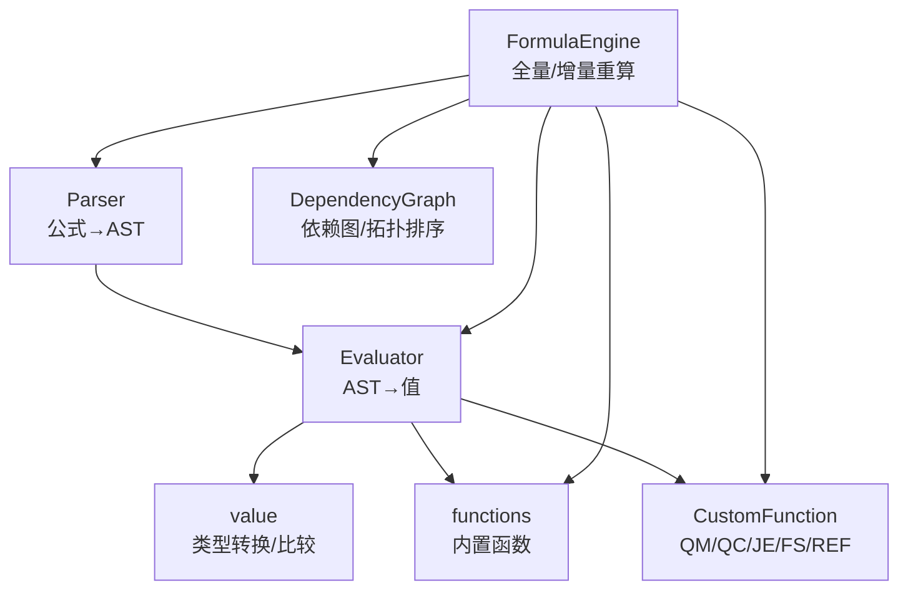
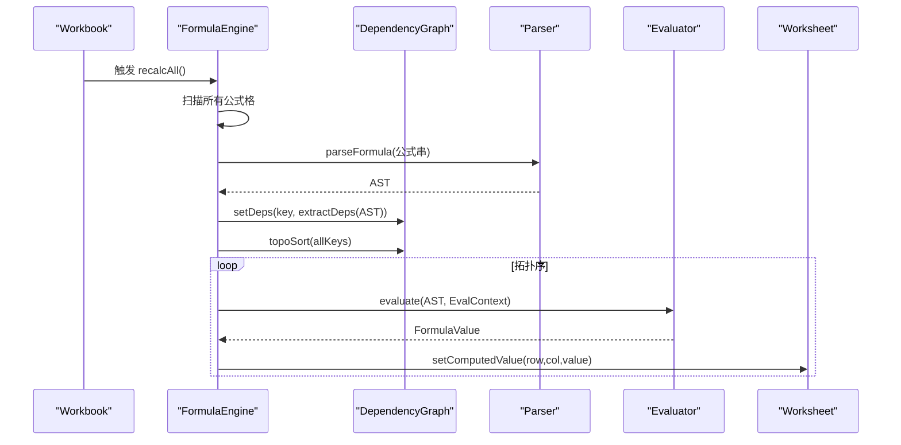
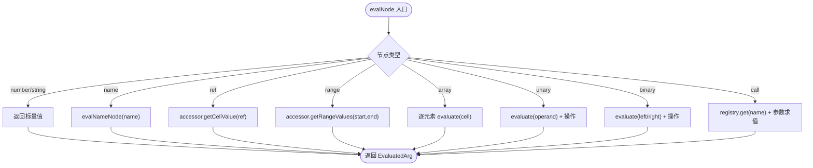
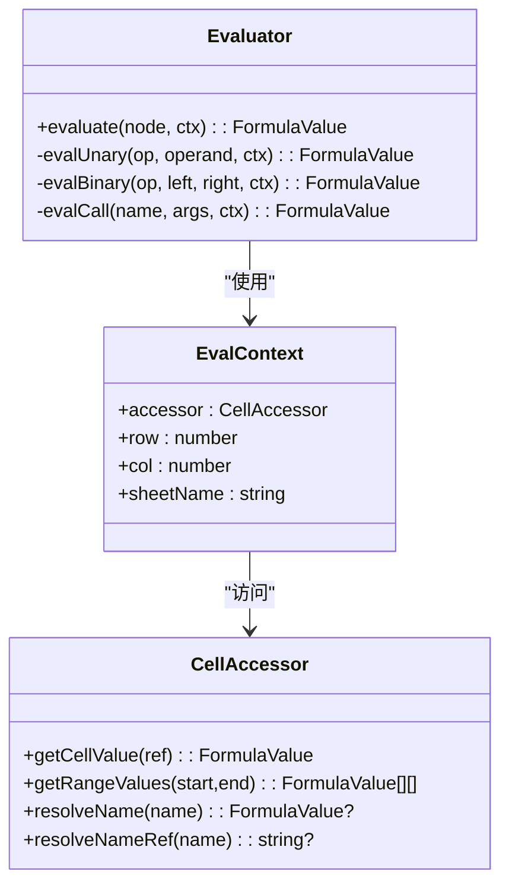
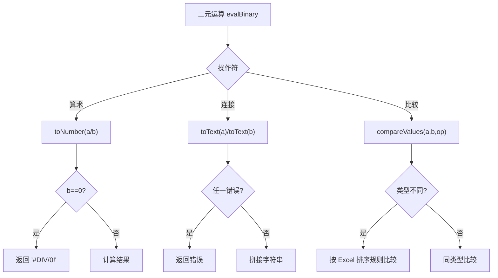
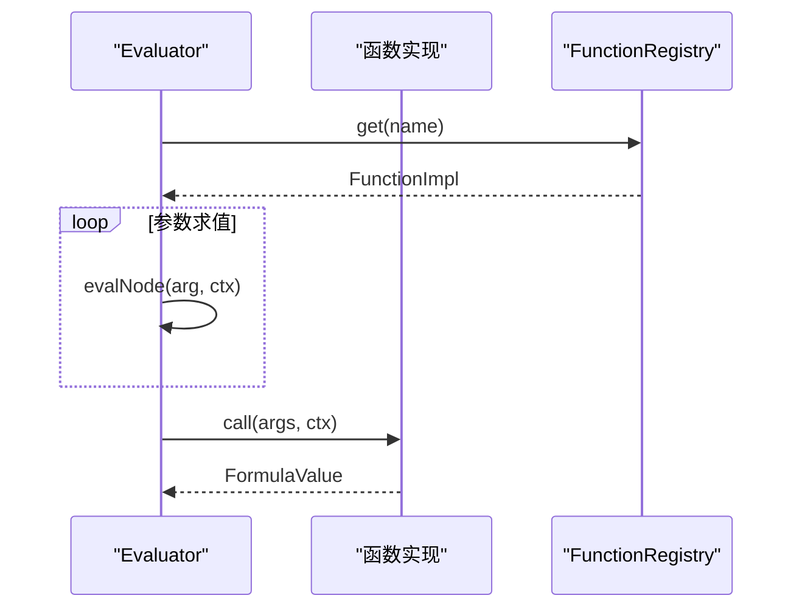
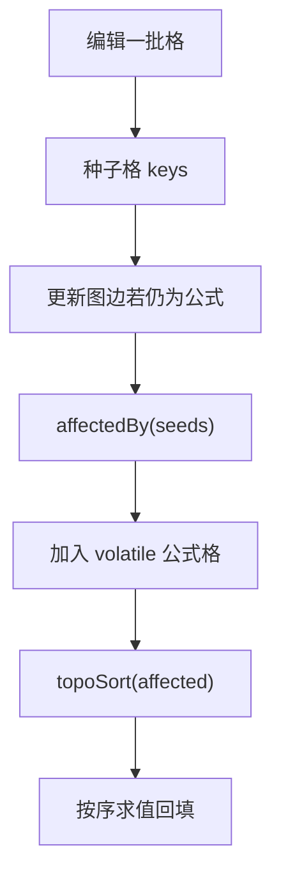
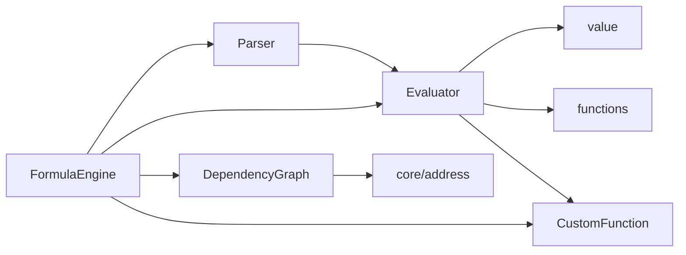

# 求值器

<cite>
**本文引用的文件**
- [Evaluator.ts](file://cmx-mega-sheet/src/formula/Evaluator.ts)
- [FormulaEngine.ts](file://cmx-mega-sheet/src/formula/FormulaEngine.ts)
- [Parser.ts](file://cmx-mega-sheet/src/formula/Parser.ts)
- [value.ts](file://cmx-mega-sheet/src/formula/value.ts)
- [DependencyGraph.ts](file://cmx-mega-sheet/src/formula/DependencyGraph.ts)
- [functions.ts](file://cmx-mega-sheet/src/formula/functions.ts)
- [CustomFunction.ts](file://cmx-mega-sheet/src/formula/CustomFunction.ts)
- [FormulaEval.test.ts](file://cmx-mega-sheet/test/FormulaEval.test.ts)
</cite>

## 目录
1. [简介](#简介)
2. [项目结构](#项目结构)
3. [核心组件](#核心组件)
4. [架构总览](#架构总览)
5. [详细组件分析](#详细组件分析)
6. [依赖关系分析](#依赖关系分析)
7. [性能考量](#性能考量)
8. [故障排查指南](#故障排查指南)
9. [结论](#结论)
10. [附录](#附录)

## 简介
本技术文档围绕公式求值器的实现，系统阐述 AST 节点的求值执行流程、求值上下文（EvalContext）的职责与数据访问器（CellAccessor）的使用方式、错误处理机制（除零、类型不匹配、引用无效等）、递归求值（嵌套函数调用）的实现策略，以及性能优化手段（解析缓存、中间结果短路、增量重算）。文档同时提供具体求值过程示例与调试技巧，帮助读者快速定位问题并高效扩展。

## 项目结构
公式子系统位于 cmx-mega-sheet/src/formula 下，采用分层设计：
- 词法/语法层：Tokenizer、Parser（生成 AST）
- 求值层：Evaluator（AST 求值）、value（类型转换与比较）
- 引擎编排层：FormulaEngine（全量/增量重算、依赖图、工作簿集成）
- 函数注册：functions（内置函数）、CustomFunction（报表取数函数 QM/QC/JE/FS/REF）
- 依赖管理：DependencyGraph（依赖抽取、拓扑排序、环检测）

**图表来源**
- [Parser.ts:196-199](file://cmx-mega-sheet/src/formula/Parser.ts#L196-L199)
- [Evaluator.ts:59-84](file://cmx-mega-sheet/src/formula/Evaluator.ts#L59-L84)
- [FormulaEngine.ts:36-54](file://cmx-mega-sheet/src/formula/FormulaEngine.ts#L36-L54)
- [DependencyGraph.ts:100-199](file://cmx-mega-sheet/src/formula/DependencyGraph.ts#L100-L199)

**章节来源**
- [Parser.ts:1-199](file://cmx-mega-sheet/src/formula/Parser.ts#L1-L199)
- [Evaluator.ts:1-199](file://cmx-mega-sheet/src/formula/Evaluator.ts#L1-L199)
- [FormulaEngine.ts:1-289](file://cmx-mega-sheet/src/formula/FormulaEngine.ts#L1-L289)

## 核心组件
- 解析器（Parser）：将公式字符串转换为 AST，支持中缀运算符优先级、一元前缀/后缀百分号、函数调用、单元格/区域引用、数组字面量、命名标识符。
- 求值器（Evaluator）：对 AST 节点进行求值，处理二元运算、一元运算、函数调用、单元格引用、区域展开、数组字面量；在标量上下文中区域取左上角。
- 值与错误（value）：定义 FormulaValue 与 FormulaError，提供 toNumber/toText/toBoolean、compareValues、isError/isBlank 等工具。
- 函数注册表（functions）：集中注册内置函数（数学、统计、文本、查找、日期时间等），使用 Evaluator 提供的辅助（flattenArg、scalarArg、firstError）。
- 自定义函数（CustomFunction）：注册 QM/QC/JE/FS/REF，基于 ReportValueMap 按“所在格”取值，标记为易变（volatile）。
- 依赖图（DependencyGraph）：从 AST 抽取依赖、维护正向/反向边、拓扑排序、三色 DFS 环检测。
- 公式引擎（FormulaEngine）：编排解析、依赖图、求值，提供全量/增量重算、直接求值 evaluateFormula。

**章节来源**
- [Parser.ts:17-199](file://cmx-mega-sheet/src/formula/Parser.ts#L17-L199)
- [Evaluator.ts:21-199](file://cmx-mega-sheet/src/formula/Evaluator.ts#L21-L199)
- [value.ts:1-131](file://cmx-mega-sheet/src/formula/value.ts#L1-L131)
- [functions.ts:1-355](file://cmx-mega-sheet/src/formula/functions.ts#L1-L355)
- [CustomFunction.ts:1-79](file://cmx-mega-sheet/src/formula/CustomFunction.ts#L1-L79)
- [DependencyGraph.ts:1-201](file://cmx-mega-sheet/src/formula/DependencyGraph.ts#L1-L201)
- [FormulaEngine.ts:1-289](file://cmx-mega-sheet/src/formula/FormulaEngine.ts#L1-L289)

## 架构总览
公式求值的核心路径：
- 输入：工作簿中的公式串或外部传入的公式串
- 解析：Parser.parseFormula → AST
- 依赖抽取：extractDeps(AST, sheetName, bounds) → 依赖键集合
- 依赖图：DependencyGraph.setDeps / topoSort / affectedBy
- 求值：Evaluator.evaluate(node, ctx) → FormulaValue
- 回填：Worksheet.setComputedValue(row, col, value)

**图表来源**
- [FormulaEngine.ts:149-198](file://cmx-mega-sheet/src/formula/FormulaEngine.ts#L149-L198)
- [DependencyGraph.ts:163-199](file://cmx-mega-sheet/src/formula/DependencyGraph.ts#L163-L199)
- [Parser.ts:196-199](file://cmx-mega-sheet/src/formula/Parser.ts#L196-L199)
- [Evaluator.ts:62-84](file://cmx-mega-sheet/src/formula/Evaluator.ts#L62-L84)

## 详细组件分析

### AST 节点求值流程（Evaluator）
- 数字/字符串：直接返回对应值
- 名称（name）：优先尝试 resolveNameRef（命名区域→引用文本），再回退到 resolveName（TRUE/FALSE/标量命名）
- 引用（ref）：通过 CellAccessor.getCellValue 获取单格值
- 区域（range）：通过 CellAccessor.getRangeValues 获取二维值
- 数组字面量（array）：逐元素按标量上下文求值，产出二维值
- 一元运算（unary）：支持负号与百分号，错误透传
- 二元运算（binary）：比较、连接、算术（含除零与溢出保护）
- 函数调用（call）：查找 FunctionRegistry，参数已求值为 EvaluatedArg（标量或区域），捕获异常返回 #VALUE!

**图表来源**
- [Evaluator.ts:72-84](file://cmx-mega-sheet/src/formula/Evaluator.ts#L72-L84)
- [Evaluator.ts:95-157](file://cmx-mega-sheet/src/formula/Evaluator.ts#L95-L157)

**章节来源**
- [Evaluator.ts:62-157](file://cmx-mega-sheet/src/formula/Evaluator.ts#L62-L157)

### 求值上下文（EvalContext）与数据访问器（CellAccessor）
- EvalContext：包含 accessor、当前行/列（row/col）、sheetName，供上下文敏感函数（如 ROW/COLUMN、QM/QC/JE/FS/REF）使用
- CellAccessor：
  - getCellValue(ref)：解析单格引用，越界/无效 sheet 返回 '#REF!'
  - getRangeValues(start, end)：展开区域为二维值，整列/整行钳制到 sheet 维度避免遍历百万格
  - resolveNameRef(name)：命名区域→引用文本，用于 SUM(myRange) 等场景
  - resolveName(name)：布尔/标量命名解析，未知返回 undefined → #NAME?

**图表来源**
- [Evaluator.ts:21-41](file://cmx-mega-sheet/src/formula/Evaluator.ts#L21-L41)
- [FormulaEngine.ts:82-115](file://cmx-mega-sheet/src/formula/FormulaEngine.ts#L82-L115)

**章节来源**
- [Evaluator.ts:21-41](file://cmx-mega-sheet/src/formula/Evaluator.ts#L21-L41)
- [FormulaEngine.ts:82-115](file://cmx-mega-sheet/src/formula/FormulaEngine.ts#L82-L115)

### 错误处理机制
- 除零错误：二元除法 '/' 时右操作数为 0 返回 '#DIV/0!'
- 类型不匹配：toNumber/toText/toBoolean 失败返回 '#VALUE!'；比较操作未知运算符返回 '#VALUE!'
- 引用无效：getCellValue 越界/无效 sheet 返回 '#REF!'；命名解析失败返回 '#NAME?'
- 循环引用：依赖图三色 DFS 检测环，环上格写 '#CIRC!'
- 函数异常：evalCall try/catch 捕获异常返回 '#VALUE!'

**图表来源**
- [Evaluator.ts:116-146](file://cmx-mega-sheet/src/formula/Evaluator.ts#L116-L146)
- [value.ts:42-75](file://cmx-mega-sheet/src/formula/value.ts#L42-L75)
- [value.ts:90-103](file://cmx-mega-sheet/src/formula/value.ts#L90-L103)

**章节来源**
- [Evaluator.ts:108-157](file://cmx-mega-sheet/src/formula/Evaluator.ts#L108-L157)
- [value.ts:14-32](file://cmx-mega-sheet/src/formula/value.ts#L14-L32)
- [FormulaEngine.ts:183-187](file://cmx-mega-sheet/src/formula/FormulaEngine.ts#L183-L187)

### 递归求值与嵌套函数调用
- 递归策略：evalNode 对子节点递归求值，函数调用 evalCall 先对每个参数调用 evalNode，再交给函数实现
- 短路求值：二元运算与函数内部使用 firstError/立即返回策略，遇到错误提前终止
- 易变函数：QM/QC/JE/FS/REF 标记 volatile，每次纳入受影响闭包重新计算

**图表来源**
- [Evaluator.ts:148-157](file://cmx-mega-sheet/src/formula/Evaluator.ts#L148-L157)
- [CustomFunction.ts:71-78](file://cmx-mega-sheet/src/formula/CustomFunction.ts#L71-L78)

**章节来源**
- [Evaluator.ts:148-157](file://cmx-mega-sheet/src/formula/Evaluator.ts#L148-L157)
- [CustomFunction.ts:1-79](file://cmx-mega-sheet/src/formula/CustomFunction.ts#L1-L79)

### 性能优化技术
- 解析缓存：FormulaEngine.parseCache 缓存 AST 或解析错误，避免重复解析
- 中间结果短路：evalBinary/函数内部使用 firstError 短路传播错误
- 增量重算：recalcCells 仅重算受影响的公式格闭包，大表编辑从 O(全簿) 降到 O(受影响)
- 区域钳制：getRangeValues 与 extractDeps 对整列/整行钳制到 sheet 维度，避免遍历百万格
- 易变函数纳入：isVolatileAst 检测 AST 是否含易变函数，增量时每次纳入受影响集

**图表来源**
- [FormulaEngine.ts:206-243](file://cmx-mega-sheet/src/formula/FormulaEngine.ts#L206-L243)
- [DependencyGraph.ts:146-156](file://cmx-mega-sheet/src/formula/DependencyGraph.ts#L146-L156)

**章节来源**
- [FormulaEngine.ts:69-80](file://cmx-mega-sheet/src/formula/FormulaEngine.ts#L69-L80)
- [FormulaEngine.ts:206-243](file://cmx-mega-sheet/src/formula/FormulaEngine.ts#L206-L243)
- [DependencyGraph.ts:75-94](file://cmx-mega-sheet/src/formula/DependencyGraph.ts#L75-L94)

### 具体求值过程示例
- 基本算术：'1+2*3' → 7；'(1+2)*3' → 9；'2^10' → 1024
- 除零：'1/0' → '#DIV/0!'
- 字符串连接：'"a"&"b"&1' → 'ab1'
- 比较：'3>2' → true；'3<>3' → false
- 单元格引用：A1+A2（A1=10,A2=20）→ 30
- 区域求和：SUM(A1:A3)（A1..A3=10,20,30）→ 60
- 空单元格：A1+Z9（Z9 为空）→ 10（空在算术上下文视为 0）
- 内置函数：ROUND、ABS、INT、MOD、IF、AND/OR/NOT、CONCATENATE、LEFT/RIGHT/MID/LEN/UPPER、TEXT、SUMIF/COUNTIF、SUBTOTAL、COALESCE/ISEMPTY/ISBLANK
- 未知函数：NOSUCHFN(1) → '#NAME?'
- 错误传播：SUM(1, 1/0) → '#DIV/0!'

**章节来源**
- [FormulaEval.test.ts:42-173](file://cmx-mega-sheet/test/FormulaEval.test.ts#L42-L173)

## 依赖关系分析
- 解析依赖：Parser 依赖 Tokenizer（未在本节详述），输出 AST
- 求值依赖：Evaluator 依赖 value（类型转换/比较）、FunctionRegistry（函数实现）、CellAccessor（数据访问）
- 引擎依赖：FormulaEngine 依赖 Parser、Evaluator、DependencyGraph、ReportValueMap（CustomFunction）
- 依赖图：DependencyGraph 依赖地址解析（address），从 AST 抽取依赖键，维护正向/反向边

**图表来源**
- [FormulaEngine.ts:15-28](file://cmx-mega-sheet/src/formula/FormulaEngine.ts#L15-L28)
- [Evaluator.ts:11-19](file://cmx-mega-sheet/src/formula/Evaluator.ts#L11-L19)
- [DependencyGraph.ts:12-13](file://cmx-mega-sheet/src/formula/DependencyGraph.ts#L12-L13)

**章节来源**
- [FormulaEngine.ts:15-28](file://cmx-mega-sheet/src/formula/FormulaEngine.ts#L15-L28)
- [Evaluator.ts:11-19](file://cmx-mega-sheet/src/formula/Evaluator.ts#L11-L19)
- [DependencyGraph.ts:12-13](file://cmx-mega-sheet/src/formula/DependencyGraph.ts#L12-L13)

## 性能考量
- 解析缓存：避免重复解析相同公式串
- 短路求值：错误传播减少无意义计算
- 增量重算：仅重算受影响子集，适合大表频繁编辑
- 区域钳制：防止整列/整行遍历导致性能灾难
- 易变函数：按需纳入受影响集，平衡正确性与性能

[本节为通用指导，无需特定文件来源]

## 故障排查指南
- 除零错误：检查二元除法右侧是否为 0；确认数据源是否可能为空
- 类型不匹配：检查 toNumber/toText/toBoolean 的输入；确保文本可解析为数字
- 引用无效：检查 getCellValue 的 ref 是否有效；跨表引用是否正确
- 命名解析失败：确认 resolveNameRef/resolveName 是否返回预期值
- 循环引用：查看依赖图 topoSort 的 cyclic 集合；调整公式依赖
- 函数异常：检查函数实现是否抛出异常；使用 IFERROR 包裹可疑表达式

**章节来源**
- [Evaluator.ts:116-157](file://cmx-mega-sheet/src/formula/Evaluator.ts#L116-L157)
- [FormulaEngine.ts:183-187](file://cmx-mega-sheet/src/formula/FormulaEngine.ts#L183-L187)
- [value.ts:42-75](file://cmx-mega-sheet/src/formula/value.ts#L42-L75)

## 结论
该公式求值器以清晰的 AST 驱动求值为核心，结合依赖图与拓扑排序实现高效的全量/增量重算。通过 EvalContext 与 CellAccessor 解耦数据访问，支持跨表引用与命名区域。错误处理覆盖除零、类型不匹配、引用无效等常见场景，并提供循环引用检测。性能优化包括解析缓存、短路求值、区域钳制与增量重算，适用于大规模表格场景。测试用例覆盖了主要功能与边界情况，便于验证与扩展。

[本节为总结性内容，无需特定文件来源]

## 附录
- 调试技巧：
  - 使用 evaluateFormula(sheetName, formula, row, col) 直接求值不落格，便于预览与调试
  - 通过 ReportValueMap.raw() 查看报表取数值表映射
  - 检查 DependencyGraph.topoSort 的 order 与 cyclic，定位依赖问题
  - 利用测试用例模式构造最小可复现场景

**章节来源**
- [FormulaEngine.ts:278-287](file://cmx-mega-sheet/src/formula/FormulaEngine.ts#L278-L287)
- [CustomFunction.ts:57-60](file://cmx-mega-sheet/src/formula/CustomFunction.ts#L57-L60)
- [DependencyGraph.ts:163-199](file://cmx-mega-sheet/src/formula/DependencyGraph.ts#L163-L199)