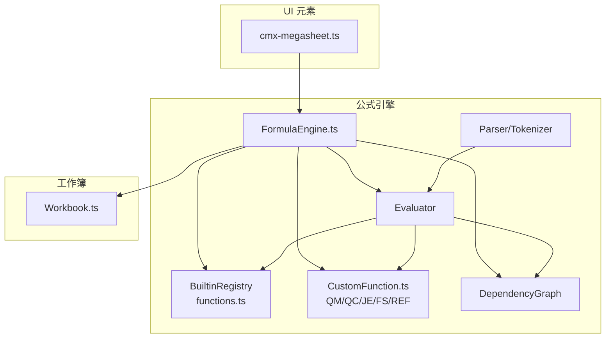
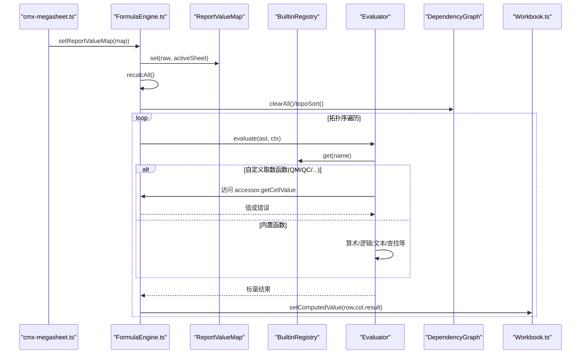
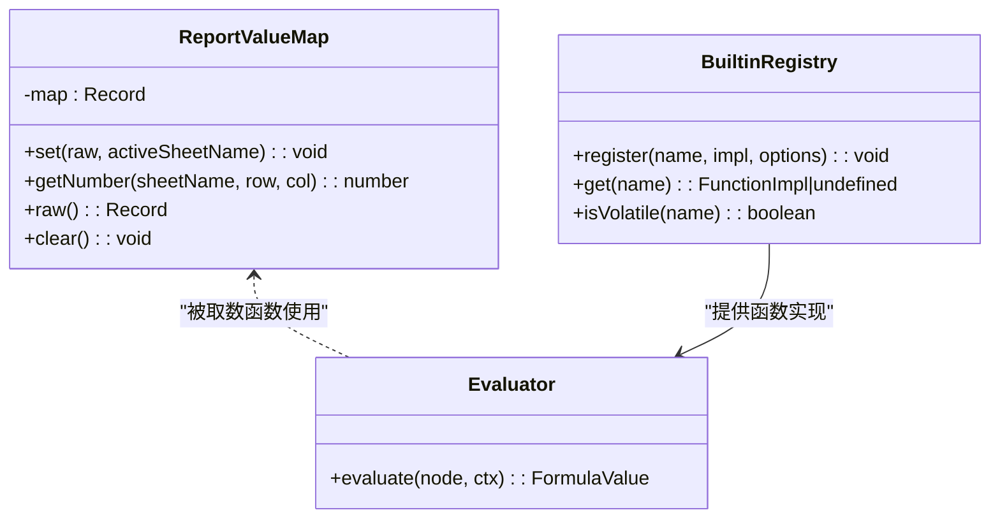
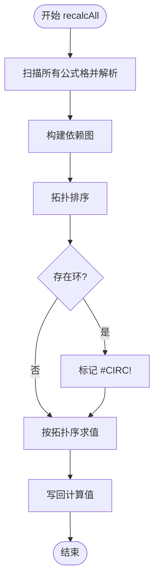
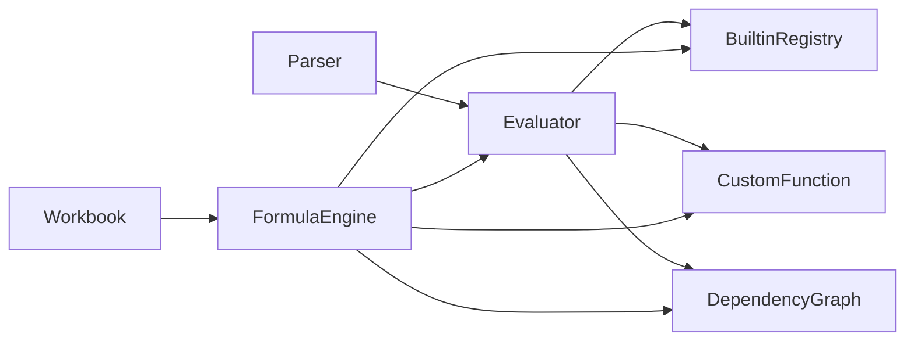

# 自定义函数系统

<cite>
**本文引用的文件**
- [CustomFunction.ts](file://cmx-mega-sheet/src/formula/CustomFunction.ts)
- [FormulaEngine.ts](file://cmx-mega-sheet/src/formula/Formul aEngine.ts)
- [Evaluator.ts](file://cmx-mega-sheet/src/formula/Evaluator.ts)
- [functions.ts](file://cmx-mega-sheet/src/formula/functions.ts)
- [Workbook.ts](file://cmx-mega-sheet/src/core/Workbook.ts)
- [cmx-megasheet.ts](file://cmx-mega-sheet/src/element/cmx-megasheet.ts)
- [CustomFunction.test.ts](file://cmx-mega-sheet/test/CustomFunction.test.ts)
- [FormulaEngine.test.ts](file://cmx-mega-sheet/test/FormulaEngine.test.ts)
- [README.md](file://cmx-mega-sheet/README.md)
</cite>

## 目录
1. [简介](#简介)
2. [项目结构](#项目结构)
3. [核心组件](#核心组件)
4. [架构总览](#架构总览)
5. [详细组件分析](#详细组件分析)
6. [依赖关系分析](#依赖关系分析)
7. [性能与内存优化](#性能与内存优化)
8. [异步、错误处理与调试](#异步错误处理与调试)
9. [权限与安全](#权限与安全)
10. [故障排查指南](#故障排查指南)
11. [结论](#结论)
12. [附录：开发示例与最佳实践](#附录开发示例与最佳实践)

## 简介
本技术文档面向“报表取数自定义函数系统”，聚焦以下目标：
- 如何注册和定义自定义函数，包括函数签名规范、参数传递机制与返回值处理。
- 详解报表取数函数 ReportValueMap 的实现原理与使用方法（QM/QC/JE/FS/REF）。
- 函数生命周期管理、内存优化策略与增量重算机制。
- 异步函数支持现状、错误处理与调试工具使用。
- 完整的自定义函数开发示例（从简单数学计算到复杂业务逻辑）。
- 函数权限控制与安全性考虑。
- 性能监控与故障排查指南。

该子系统位于 cmx-mega-sheet 的公式引擎层，采用纯逻辑、零 DOM 的设计，确保可测性与高性能。

## 项目结构
公式引擎相关代码集中在 cmx-mega-sheet/src/formula 目录，围绕解析、求值、依赖图与内置/自定义函数展开；Workbook 提供重算钩子；cmx-megasheet 元素对外暴露 setReportValueMap/getReportValueMap 等能力。

图表来源
- [FormulaEngine.ts:36-67](file://cmx-mega-sheet/src/formula/FormulaEngine.ts#L36-L67)
- [Evaluator.ts:59-83](file://cmx-mega-sheet/src/formula/Evaluator.ts#L59-L83)
- [functions.ts:63-355](file://cmx-mega-sheet/src/formula/functions.ts#L63-L355)
- [CustomFunction.ts:27-78](file://cmx-mega-sheet/src/formula/CustomFunction.ts#L27-L78)
- [Workbook.ts:232-248](file://cmx-mega-sheet/src/core/Workbook.ts#L232-L248)
- [cmx-megasheet.ts:200,869-1091:200-200](file://cmx-mega-sheet/src/element/cmx-megasheet.ts#L200-L200)

章节来源
- [README.md:98-138](file://cmx-mega-sheet/README.md#L98-L138)

## 核心组件
- ReportValueMap：维护 sheet!CELLREF → 值的映射，负责键归一化、数值语义转换（缺/空/非数值→0），供 QM/QC/JE/FS/REF 按所在格查表取值。
- registerReportFetchFunctions：将 QM/QC/JE/FS/REF 注册为易变（volatile）函数，实现上下文敏感取数。
- FormulaEngine：编排 Parser/Evaluator/DependencyGraph/CustomFunction，提供全量/增量重算、直接求值 evaluateFormula、setReportValueMap 灌值并触发重算。
- Evaluator：AST 求值器，统一处理引用、区域、数组、一元/二元运算、函数调用，并通过 CellAccessor 解引用单元格。
- functions.ts：内置函数注册表（SUM/AVERAGE/ROUND/IF/VLOOKUP/TEXT 等），与 CustomFunction 分工明确——后端算真值，前端做聚合与通用函数。
- Workbook：通过 setRecalcHook/setRecalcCellsHook 与 FormulaEngine 协作，驱动全量/增量重算。
- cmx-megasheet：对外暴露 setReportValueMap/getReportValueMap，桥接 UI 与公式引擎。

章节来源
- [CustomFunction.ts:27-78](file://cmx-mega-sheet/src/formula/CustomFunction.ts#L27-L78)
- [FormulaEngine.ts:36-67](file://cmx-mega-sheet/src/formula/FormulaEngine.ts#L36-L67)
- [Evaluator.ts:21-55](file://cmx-mega-sheet/src/formula/Evaluator.ts#L21-L55)
- [functions.ts:63-355](file://cmx-mega-sheet/src/formula/functions.ts#L63-L355)
- [Workbook.ts:232-248](file://cmx-mega-sheet/src/core/Workbook.ts#L232-L248)
- [cmx-megasheet.ts:869-1091](file://cmx-mega-sheet/src/element/cmx-megasheet.ts#L869-L1091)

## 架构总览
下图展示从 UI 设置报表取数值表到公式重算、再到单元格回填计算值的完整流程。

图表来源
- [FormulaEngine.ts:63-198](file://cmx-mega-sheet/src/formula/FormulaEngine.ts#L63-L198)
- [Evaluator.ts:62-83](file://cmx-mega-sheet/src/formula/Evaluator.ts#L62-L83)
- [CustomFunction.ts:71-78](file://cmx-mega-sheet/src/formula/CustomFunction.ts#L71-L78)
- [Workbook.ts:232-248](file://cmx-mega-sheet/src/core/Workbook.ts#L232-L248)

## 详细组件分析

### 报表取数函数与 ReportValueMap
- 设计要点
  - 键归一化：支持裸 CELLREF（如 c5）自动补 activeSheet 前缀，并将 CELLREF 大写标准化。
  - 数值语义：缺/空/非数值返回 0；数字字符串转为数字；非有限数视为 0。
  - 上下文敏感：QM/QC/JE/FS/REF 根据「公式所在格」读取对应值，而非函数参数。
  - 易变性：标记 volatile，map 更新后依赖图每次纳入，保证重算。
- 使用方式
  - 通过 FormulaEngine.setReportValueMap 注入 map，或经由 cmx-megasheet.setReportValueMap 传入。
  - 在单元格公式中直接使用 QM()/QC()/JE()/FS()/REF()，无需传参即可取当前格值。
- 测试覆盖
  - 键归一化、跨表键保留、缺失/空白/非数值语义、数值字符串转数字、易变性验证、参与算术与聚合。

章节来源
- [CustomFunction.ts:27-78](file://cmx-mega-sheet/src/formula/CustomFunction.ts#L27-L78)
- [CustomFunction.test.ts:31-103](file://cmx-mega-sheet/test/CustomFunction.test.ts#L31-L103)
- [FormulaEngine.test.ts:91-108](file://cmx-mega-sheet/test/FormulaEngine.test.ts#L91-L108)

#### 类图：ReportValueMap 与取数函数

图表来源
- [CustomFunction.ts:27-78](file://cmx-mega-sheet/src/formula/CustomFunction.ts#L27-L78)
- [Evaluator.ts:59-83](file://cmx-mega-sheet/src/formula/Evaluator.ts#L59-L83)

### 公式引擎与重算机制
- 全量重算（recalcAll）
  - 扫描所有工作表的公式格，解析 AST，构建依赖图，拓扑排序，逐格求值并回填计算值。
  - 环检测：循环依赖的单元格标记 #CIRC!。
- 增量重算（recalcCells）
  - 仅对受影响的公式格闭包进行重算；若图未建立则退化全量。
  - 易变公式（含 QM/QC/NOW/TODAY/RAND 等）每次纳入受影响集合。
- 直接求值（evaluateFormula）
  - 不写入单元格，直接返回求值结果，用于预览或聚合层。

章节来源
- [FormulaEngine.ts:149-243](file://cmx-mega-sheet/src/formula/FormulaEngine.ts#L149-L243)
- [FormulaEngine.ts:278-287](file://cmx-mega-sheet/src/formula/FormulaEngine.ts#L278-L287)

#### 流程图：全量重算

图表来源
- [FormulaEngine.ts:149-198](file://cmx-mega-sheet/src/formula/FormulaEngine.ts#L149-L198)

### 内置函数与扩展点
- 内置函数覆盖数学、财务、统计、数据库、文本、日期时间、查找引用等，约 272 个函数。
- 与 CustomFunction 的分工：后端计算真实取数结果，经 setReportValueMap 下发；前端只做聚合与通用函数。
- 扩展点：通过 BuiltinRegistry.register 注册新函数，遵循 FunctionImpl 签名与 EvalContext 上下文。

章节来源
- [functions.ts:63-355](file://cmx-mega-sheet/src/formula/functions.ts#L63-L355)
- [Evaluator.ts:43-55](file://cmx-mega-sheet/src/formula/Evaluator.ts#L43-L55)

### 组件门面与集成
- cmx-megasheet 暴露 setReportValueMap/getReportValueMap，便于外部注入报表取数值表。
- 内部通过 FormulaEngine.valueMap 持有 ReportValueMap 实例，并在构造时注册取数函数。

章节来源
- [cmx-megasheet.ts:200,869-1091:200-200](file://cmx-mega-sheet/src/element/cmx-megasheet.ts#L200-L200)
- [FormulaEngine.ts:36-67](file://cmx-mega-sheet/src/formula/FormulaEngine.ts#L36-L67)

## 依赖关系分析
- 低耦合：Evaluator 不直接依赖 Worksheet，通过 CellAccessor 抽象；FormulaEngine 通过 Workbook 的重算钩子解耦。
- 清晰分层：Parser → Evaluator → DependencyGraph → FormulaEngine；CustomFunction 作为函数实现接入。
- 无环风险：依赖图拓扑排序避免循环求值，环上单元格标记 #CIRC!。

图表来源
- [FormulaEngine.ts:36-67](file://cmx-mega-sheet/src/formula/FormulaEngine.ts#L36-L67)
- [Evaluator.ts:59-83](file://cmx-mega-sheet/src/formula/Evaluator.ts#L59-L83)
- [Workbook.ts:232-248](file://cmx-mega-sheet/src/core/Workbook.ts#L232-L248)

章节来源
- [FormulaEngine.ts:36-67](file://cmx-mega-sheet/src/formula/FormulaEngine.ts#L36-L67)
- [Evaluator.ts:21-55](file://cmx-mega-sheet/src/formula/Evaluator.ts#L21-L55)

## 性能与内存优化
- 解析缓存：FormulaEngine.parseCache 缓存 AST，减少重复解析开销。
- 增量重算：recalcCells 仅重算受影响闭包，大表编辑从 O(全簿) 降至 O(受影响)。
- 易变函数纳入：含 QM/QC/NOW/TODAY/RAND 等的公式在增量重算中始终纳入，保证正确性。
- 区域边界钳制：整列/整行范围在求值时钳制到 sheet 维度，避免遍历百万格。
- 稀疏存储：底层数据模型使用稀疏矩阵，降低内存占用。
- 建议
  - 尽量复用 ReportValueMap 批量注入，避免频繁重建。
  - 谨慎使用易变函数，必要时结合缓存策略。
  - 利用 evaluateFormula 进行预览计算，避免落格带来的额外开销。

章节来源
- [FormulaEngine.ts:69-80](file://cmx-mega-sheet/src/formula/FormulaEngine.ts#L69-L80)
- [FormulaEngine.ts:206-243](file://cmx-mega-sheet/src/formula/FormulaEngine.ts#L206-L243)
- [FormulaEngine.ts:82-115](file://cmx-mega-sheet/src/formula/FormulaEngine.ts#L82-L115)

## 异步、错误处理与调试
- 异步函数支持
  - 当前 Evaluator 同步求值，不支持 Promise 或 async 函数。如需异步，应在上层（如服务层）预计算结果并通过 setReportValueMap 注入。
- 错误处理
  - 解析失败：返回 #NAME? 或解析错误标记。
  - 运行时异常：捕获后返回 #VALUE!。
  - 除零：返回 #DIV/0!。
  - 循环依赖：标记 #CIRC!。
- 调试工具
  - 单元测试：CustomFunction.test.ts、FormulaEngine.test.ts 覆盖关键路径。
  - 直接求值：evaluateFormula 可用于快速验证公式逻辑。
  - 原始 Map 查看：getReportValueMap 可导出当前取数值表用于诊断。

章节来源
- [Evaluator.ts:148-157](file://cmx-mega-sheet/src/formula/Evaluator.ts#L148-L157)
- [FormulaEngine.ts:259-287](file://cmx-mega-sheet/src/formula/FormulaEngine.ts#L259-L287)
- [CustomFunction.test.ts:31-103](file://cmx-mega-sheet/test/CustomFunction.test.ts#L31-L103)
- [FormulaEngine.test.ts:37-115](file://cmx-mega-sheet/test/FormulaEngine.test.ts#L37-L115)

## 权限与安全
- 函数权限控制
  - 当前公式引擎层未内置细粒度函数级权限控制。可通过外层（页面/服务）限制哪些用户可调用 setReportValueMap 或执行特定公式。
- 安全性考虑
  - 输入校验：对 setReportValueMap 的 map 键进行白名单校验，防止注入非法键。
  - 输出过滤：对 evaluateFormula 的结果进行类型与范围校验，避免渲染异常。
  - 资源限制：对区域引用进行边界钳制，防止超大范围导致性能问题。
- 建议
  - 在服务端对报表取数真值进行权限校验后再下发。
  - 在前端对公式长度、嵌套深度、函数名进行限制，避免恶意滥用。

[本节为概念性说明，不直接分析具体文件]

## 故障排查指南
- 常见问题
  - 结果为 0：检查 ReportValueMap 是否包含对应 sheet!CELLREF 键，或缺失/非数值。
  - 结果为 #NAME?：函数名未注册或解析失败。
  - 结果为 #VALUE!：运行时异常或类型不匹配。
  - 结果为 #DIV/0!：除数为 0。
  - 结果为 #CIRC!：存在循环依赖。
- 排查步骤
  - 使用 getReportValueMap 查看当前取数值表。
  - 使用 evaluateFormula 直接验证公式。
  - 检查依赖图是否正确构建（全量/增量重算是否生效）。
  - 查看单元测试用例，对照行为差异。

章节来源
- [CustomFunction.test.ts:31-103](file://cmx-mega-sheet/test/CustomFunction.test.ts#L31-L103)
- [FormulaEngine.test.ts:37-115](file://cmx-mega-sheet/test/FormulaEngine.test.ts#L37-L115)

## 结论
自定义函数系统以 ReportValueMap 为核心，结合 FormulaEngine 的全量/增量重算机制，实现了高效、可测、可扩展的报表取数能力。QM/QC/JE/FS/REF 等取数函数通过上下文敏感与易变性设计，确保了动态数据更新的正确性。配合丰富的内置函数与清晰的职责划分，系统既满足报表模板的高频需求，又为后续扩展预留了良好空间。

[本节为总结性内容，不直接分析具体文件]

## 附录：开发示例与最佳实践

### 函数签名规范
- FunctionImpl 签名：接收已求值的实参（标量或区域二维数组）与 EvalContext，返回 FormulaValue。
- EvalContext：包含 accessor、row、col、sheetName，供上下文敏感函数使用。
- 返回值：标量值或错误标记（如 #VALUE!、#DIV/0!、#CIRC!）。

章节来源
- [Evaluator.ts:43-55](file://cmx-mega-sheet/src/formula/Evaluator.ts#L43-L55)

### 参数传递机制
- 实参类型：EvaluatedArg 可为 value 或 range，Evaluator 自动展平为标量序列或二维数组。
- 区域引用：通过 CellAccessor.getRangeValues 获取二维值，支持整列/整行范围。
- 命名解析：CellAccessor.resolveNameRef 支持命名区域转引用文本，再求值。

章节来源
- [Evaluator.ts:21-31](file://cmx-mega-sheet/src/formula/Evaluator.ts#L21-L31)
- [Evaluator.ts:91-106](file://cmx-mega-sheet/src/formula/Evaluator.ts#L91-L106)

### 返回值处理
- 错误传播：任何一步返回错误，后续操作短路返回该错误。
- 类型转换：toNumber/toText/toBoolean 统一处理类型转换，失败返回错误。
- 特殊值：#N/A、#REF!、#NAME? 等错误标记用于定位问题。

章节来源
- [Evaluator.ts:108-157](file://cmx-mega-sheet/src/formula/Evaluator.ts#L108-L157)

### 简单数学计算示例
- 场景：计算单元格 A1 与 B1 的和，并四舍五入到两位小数。
- 实现：使用 SUM 与 ROUND 内置函数，组合公式 =ROUND(SUM(A1,B1),2)。
- 验证：通过 evaluateFormula 直接求值，或使用 setReportValueMap 注入 A1/B1 的值。

章节来源
- [functions.ts:63-99](file://cmx-mega-sheet/src/formula/functions.ts#L63-L99)
- [FormulaEngine.ts:278-287](file://cmx-mega-sheet/src/formula/FormulaEngine.ts#L278-L287)

### 复杂业务逻辑示例
- 场景：根据条件汇总多个区域的数值，并应用多条件筛选。
- 实现：使用 SUMIFS/COUNTIFS/AVERAGEIFS 等多条件聚合函数，结合 VLOOKUP/XLOOKUP 进行数据关联。
- 验证：通过单元测试模拟不同条件组合，确保结果正确。

章节来源
- [functions.ts:595-641](file://cmx-mega-sheet/src/formula/functions.ts#L595-L641)
- [CustomFunction.test.ts:97-103](file://cmx-mega-sheet/test/CustomFunction.test.ts#L97-L103)

### 性能监控与优化建议
- 监控指标：重算次数、受影响单元格数量、易变函数调用频率。
- 优化策略：减少易变函数使用，批量注入 ReportValueMap，利用增量重算。
- 工具：使用 evaluateFormula 进行预览计算，避免落格开销。

[本节为概念性说明，不直接分析具体文件]