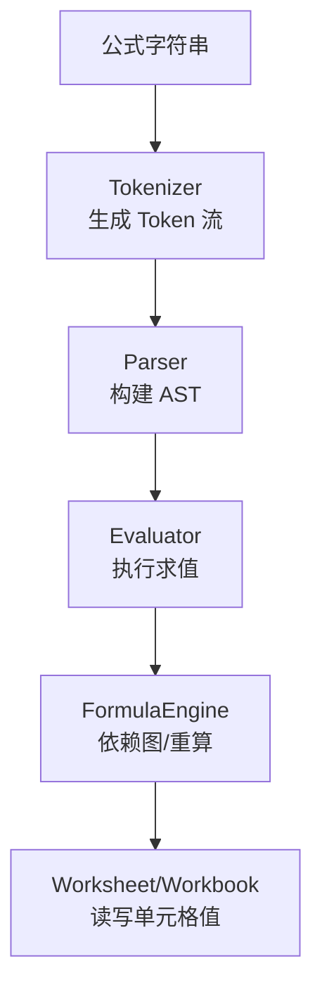
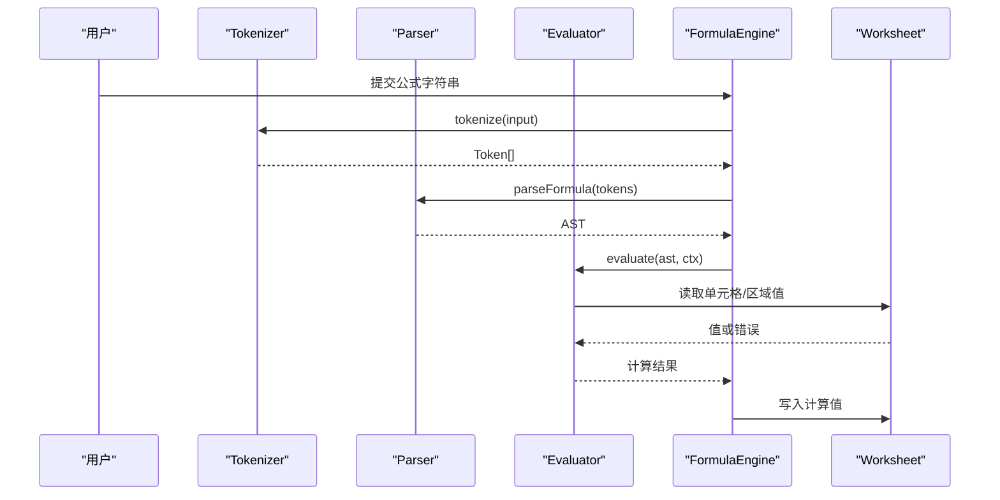
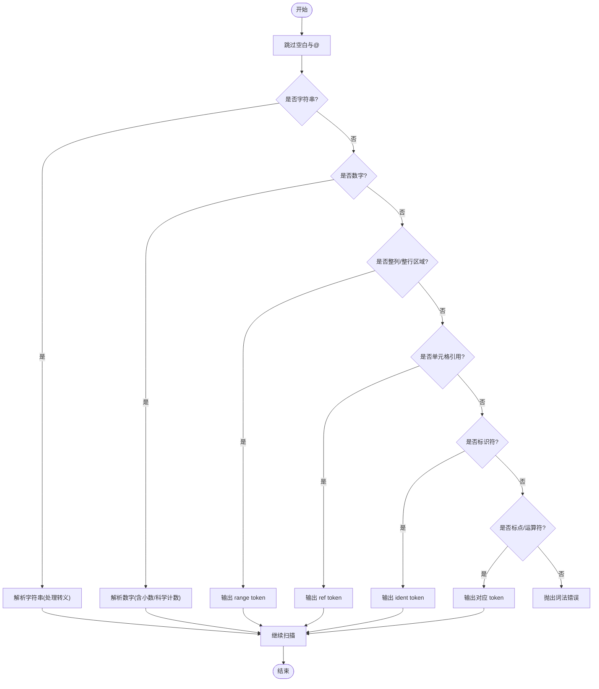
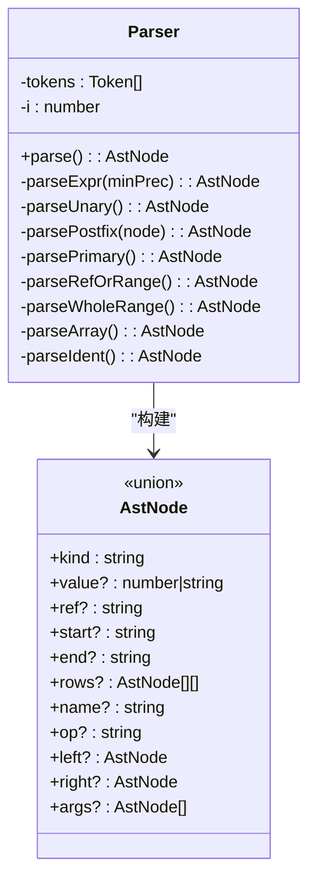
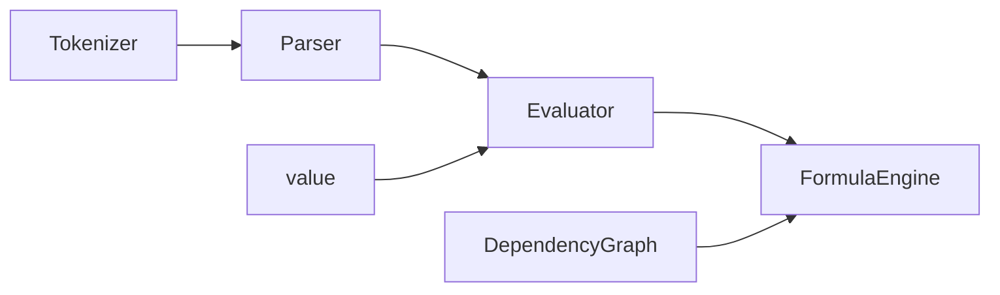

# 解析器与词法分析器

<cite>
**本文引用的文件**
- [Tokenizer.ts](file://cmx-mega-sheet/src/formula/Tokenizer.ts)
- [Parser.ts](file://cmx-mega-sheet/src/formula/Parser.ts)
- [Evaluator.ts](file://cmx-mega-sheet/src/formula/Evaluator.ts)
- [FormulaEngine.ts](file://cmx-mega-sheet/src/formula/FormulaEngine.ts)
- [value.ts](file://cmx-mega-sheet/src/formula/value.ts)
- [DependencyGraph.ts](file://cmx-mega-sheet/src/formula/DependencyGraph.ts)
- [Tokenizer.test.ts](file://cmx-mega-sheet/test/Tokenizer.test.ts)
- [Parser.test.ts](file://cmx-mega-sheet/test/Parser.test.ts)
</cite>

## 目录
1. [简介](#简介)
2. [项目结构](#项目结构)
3. [核心组件](#核心组件)
4. [架构总览](#架构总览)
5. [详细组件分析](#详细组件分析)
6. [依赖关系分析](#依赖关系分析)
7. [性能考量](#性能考量)
8. [故障排查指南](#故障排查指南)
9. [结论](#结论)
10. [附录：示例公式的 AST 结构](#附录示例公式的-ast-结构)

## 简介
本技术文档聚焦于公式解析器的两个关键阶段：词法分析（Tokenizer）与语法分析（Parser），并说明它们如何协作构建抽象语法树（AST），以及后续求值引擎如何消费 AST。文档覆盖以下要点：
- Tokenizer 如何将公式字符串切分为令牌流，包括数字、字符串、单元格引用、区域引用、函数名、运算符、括号、逗号、数组字面量分隔符等识别规则。
- Parser 如何基于优先级爬升（Pratt）算法构建 AST，处理表达式优先级、括号嵌套、数组字面量、一元操作符、尾随百分号、函数调用等语法规则。
- 词法错误与语法错误的处理机制，以及错误恢复策略。
- 通过具体示例展示常见复杂公式的解析过程与 AST 结构，如 SUM(A1:B2)+C1*2、IF(A1>0,TRUE,FALSE)。

## 项目结构
公式子系统位于 cmx-mega-sheet/src/formula 目录下，核心文件职责如下：
- Tokenizer.ts：词法分析，将公式源串转换为 token 流。
- Parser.ts：语法分析，将 token 流解析为 AST。
- Evaluator.ts：AST 求值器，根据 AST 计算结果。
- FormulaEngine.ts：编排层，负责解析缓存、依赖图、全量/增量重算。
- value.ts：公式值类型、错误值与类型转换工具。
- DependencyGraph.ts：依赖图与拓扑排序，支持环检测与增量重算。

**图表来源**
- [Tokenizer.ts:61-188](file://cmx-mega-sheet/src/formula/Tokenizer.ts#L61-L188)
- [Parser.ts:195-198](file://cmx-mega-sheet/src/formula/Parser.ts#L195-L198)
- [Evaluator.ts:62-83](file://cmx-mega-sheet/src/formula/Evaluator.ts#L62-L83)
- [FormulaEngine.ts:149-194](file://cmx-mega-sheet/src/formula/FormulaEngine.ts#L149-L194)

**章节来源**
- [Tokenizer.ts:1-200](file://cmx-mega-sheet/src/formula/Tokenizer.ts#L1-L200)
- [Parser.ts:1-199](file://cmx-mega-sheet/src/formula/Parser.ts#L1-L199)
- [Evaluator.ts:1-199](file://cmx-mega-sheet/src/formula/Evaluator.ts#L1-L199)
- [FormulaEngine.ts:1-289](file://cmx-mega-sheet/src/formula/FormulaEngine.ts#L1-L289)

## 核心组件
- 词法分析器（Tokenizer）：负责将输入公式剥离前导“=”后，按字符扫描生成 token 序列，包含数字、字符串、单元格/区域引用、标识符（函数名或命名）、运算符、括号、逗号、分号、冒号、百分号、花括号等。遇到无法识别的字符抛出词法错误。
- 语法分析器（Parser）：使用 Pratt 优先级爬升解析中缀表达式，定义二元运算符优先级与结合性，处理一元正负、尾随百分号、括号分组、数组字面量、函数调用、单元格/区域引用、名称节点（TRUE/FALSE/命名）。
- 求值器（Evaluator）：遍历 AST 节点进行求值，支持标量与区域二维值，内置比较、连接、算术运算，错误值传播，函数调用通过注册表查找实现。
- 公式引擎（FormulaEngine）：管理解析缓存、依赖图、全量/增量重算，将 AST 依赖展开为单元格键集合，拓扑排序后求值回填，循环引用标记为 #CIRC!。
- 值类型与工具（value.ts）：定义公式值类型、错误值集合、数值/文本/布尔转换与比较逻辑。
- 依赖图（DependencyGraph.ts）：从 AST 抽取依赖，维护正向/反向依赖映射，提供受影响闭包计算与拓扑排序，支持三色 DFS 环检测。

**章节来源**
- [Tokenizer.ts:11-36](file://cmx-mega-sheet/src/formula/Tokenizer.ts#L11-L36)
- [Parser.ts:17-28](file://cmx-mega-sheet/src/formula/Parser.ts#L17-L28)
- [Evaluator.ts:21-55](file://cmx-mega-sheet/src/formula/Evaluator.ts#L21-L55)
- [FormulaEngine.ts:30-54](file://cmx-mega-sheet/src/formula/FormulaEngine.ts#L30-L54)
- [value.ts:13-28](file://cmx-mega-sheet/src/formula/value.ts#L13-L28)
- [DependencyGraph.ts:15-34](file://cmx-mega-sheet/src/formula/DependencyGraph.ts#L15-L34)

## 架构总览
公式解析与求值流水线由四个层次组成：
- 词法层：将字符串转为 token 流，屏蔽空白、转义、特殊符号。
- 语法层：将 token 流转为 AST，表达运算符优先级与结构。
- 求值层：根据 AST 与上下文访问器读取单元格/区域值，执行函数与运算。
- 编排层：构建依赖图，拓扑排序，处理循环引用与增量重算。

**图表来源**
- [FormulaEngine.ts:69-80](file://cmx-mega-sheet/src/formula/FormulaEngine.ts#L69-L80)
- [Parser.ts:195-198](file://cmx-mega-sheet/src/formula/Parser.ts#L195-L198)
- [Evaluator.ts:62-83](file://cmx-mega-sheet/src/formula/Evaluator.ts#L62-L83)
- [FormulaEngine.ts:259-272](file://cmx-mega-sheet/src/formula/FormulaEngine.ts#L259-L272)

## 详细组件分析

### 词法分析器（Tokenizer）
- 令牌类型：number、string、ref、range、ident、op、lparen、rparen、lbrace、rbrace、comma、semicolon、colon、percent、eof。
- 识别规则：
  - 数字：整数、小数、科学计数法；以 isDigit 判断起始，扩展小数与指数部分。
  - 字符串：双引号包裹，内部 "" 转义为一个 "，未闭合抛出词法错误。
  - 引用与区域：支持 Sheet!A1、$A$1、整列 A:A、整行 1:1；优先匹配整列/整行以避免被拆成 ident + colon。
  - 标识符：函数名或命名区域，字母/下划线/中文开头，可含数字与点。
  - 运算符：+ - * / ^ & = < > <= >=，支持双字符比较。
  - 标点：括号、逗号、分号、冒号、百分号、花括号。
  - 空白与 @：跳过空白与隐式交集 @。
- 错误处理：遇到无法识别字符抛出 FormulaLexError，携带位置信息便于定位。

**图表来源**
- [Tokenizer.ts:61-188](file://cmx-mega-sheet/src/formula/Tokenizer.ts#L61-L188)

**章节来源**
- [Tokenizer.ts:38-49](file://cmx-mega-sheet/src/formula/Tokenizer.ts#L38-L49)
- [Tokenizer.ts:61-188](file://cmx-mega-sheet/src/formula/Tokenizer.ts#L61-L188)
- [Tokenizer.test.ts:11-93](file://cmx-mega-sheet/test/Tokenizer.test.ts#L11-L93)

### 语法分析器（Parser）
- AST 节点类型：number、string、ref、range、array、name、unary、binary、call。
- 表达式优先级：
  - 比较运算符（=、<>、<、>、<=、>=）优先级最低。
  - 连接符 & 次之。
  - 加减 (+,-) 高于连接。
  - 乘除 (*,/ ) 高于加减。
  - 幂 (^) 最高且右结合。
- 一元操作符：-x、+x；后缀百分号 x% 建模为 unary '%'。
- 括号分组：(expr) 提升优先级。
- 数组字面量：{1,2;3,4}，逗号分列、分号分行，元素为标量表达式。
- 引用与区域：ref 或 ref:ref → range；整列/整行区域作为单独 range token 解析。
- 函数调用：ident(...) 解析为 call 节点，参数为表达式列表。
- 错误处理：空公式、不匹配的括号、多余记号抛出 FormulaParseError。

**图表来源**
- [Parser.ts:17-28](file://cmx-mega-sheet/src/formula/Parser.ts#L17-L28)
- [Parser.ts:46-193](file://cmx-mega-sheet/src/formula/Parser.ts#L46-L193)

**章节来源**
- [Parser.ts:36-44](file://cmx-mega-sheet/src/formula/Parser.ts#L36-L44)
- [Parser.ts:58-84](file://cmx-mega-sheet/src/formula/Parser.ts#L58-L84)
- [Parser.ts:86-106](file://cmx-mega-sheet/src/formula/Parser.ts#L86-L106)
- [Parser.ts:108-193](file://cmx-mega-sheet/src/formula/Parser.ts#L108-L193)
- [Parser.test.ts:25-95](file://cmx-mega-sheet/test/Parser.test.ts#L25-L95)

### 求值器（Evaluator）
- 节点求值：
  - number/string/name/ref/range/array/unary/binary/call。
  - 区域在标量上下文中取左上角值。
  - 名称节点先尝试 resolveNameRef 解析为引用，再回退到标量 resolveName。
- 运算：
  - 比较：compareValues 对齐 Excel 语义（数字<文本<布尔）。
  - 连接：toText 拼接。
  - 算术：toNumber 转换，除法零返回 #DIV/0!，幂溢出返回 #NUM!。
- 函数调用：通过 FunctionRegistry 查找实现，捕获异常返回 #VALUE!。
- 辅助工具：flattenArg/flattenArgs/scalarArg/firstError/splitTopRange。

**章节来源**
- [Evaluator.ts:62-83](file://cmx-mega-sheet/src/formula/Evaluator.ts#L62-L83)
- [Evaluator.ts:95-106](file://cmx-mega-sheet/src/formula/Evaluator.ts#L95-L106)
- [Evaluator.ts:108-157](file://cmx-mega-sheet/src/formula/Evaluator.ts#L108-L157)
- [value.ts:40-75](file://cmx-mega-sheet/src/formula/value.ts#L40-L75)
- [value.ts:90-103](file://cmx-mega-sheet/src/formula/value.ts#L90-L103)

### 公式引擎（FormulaEngine）
- 解析缓存：避免重复解析相同公式。
- 依赖抽取：extractDeps 将 AST 中的 ref/range 展开为单元格键集合。
- 全量重算：遍历所有公式格，重建依赖图，拓扑排序，标记循环引用为 #CIRC!，按序求值回填。
- 增量重算：编辑种子格后，仅更新其出边，计算受影响闭包，拓扑排序并求值。
- 直接求值：evaluateFormula 用于预览或聚合场景。

**章节来源**
- [FormulaEngine.ts:69-80](file://cmx-mega-sheet/src/formula/FormulaEngine.ts#L69-L80)
- [FormulaEngine.ts:149-194](file://cmx-mega-sheet/src/formula/FormulaEngine.ts#L149-L194)
- [FormulaEngine.ts:206-243](file://cmx-mega-sheet/src/formula/FormulaEngine.ts#L206-L243)
- [DependencyGraph.ts:26-94](file://cmx-mega-sheet/src/formula/DependencyGraph.ts#L26-L94)
- [DependencyGraph.ts:163-199](file://cmx-mega-sheet/src/formula/DependencyGraph.ts#L163-L199)

## 依赖关系分析
- Tokenizer 无外部依赖，纯字符串处理。
- Parser 依赖 Tokenizer 输出的 Token 流。
- Evaluator 依赖 Parser 的 AST 与 value.ts 的类型转换工具。
- FormulaEngine 依赖 Parser、Evaluator、DependencyGraph 与 Workbook/Worksheet 接口。
- DependencyGraph 依赖 Parser 的 AST 与地址解析工具。

**图表来源**
- [Parser.ts:15](file://cmx-mega-sheet/src/formula/Parser.ts#L15)
- [Evaluator.ts:11-19](file://cmx-mega-sheet/src/formula/Evaluator.ts#L11-L19)
- [FormulaEngine.ts:18-28](file://cmx-mega-sheet/src/formula/FormulaEngine.ts#L18-L28)
- [DependencyGraph.ts:12-13](file://cmx-mega-sheet/src/formula/DependencyGraph.ts#L12-L13)

**章节来源**
- [Parser.ts:15](file://cmx-mega-sheet/src/formula/Parser.ts#L15)
- [Evaluator.ts:11-19](file://cmx-mega-sheet/src/formula/Evaluator.ts#L11-L19)
- [FormulaEngine.ts:18-28](file://cmx-mega-sheet/src/formula/FormulaEngine.ts#L18-L28)
- [DependencyGraph.ts:12-13](file://cmx-mega-sheet/src/formula/DependencyGraph.ts#L12-L13)

## 性能考量
- 词法分析：线性扫描，正则匹配整列/整行区域避免二次拆分。
- 语法分析：Pratt 解析 O(n)，优先级表常数时间查询。
- 依赖抽取：区域展开为逐格依赖，但通过 bounds 钳制到 sheet 维度，避免百万格遍历。
- 重算：全量重算 O(V+E)，增量重算仅影响子集，显著降低大表编辑成本。
- 解析缓存：FormulaEngine 缓存已解析公式，减少重复开销。

[本节为通用性能讨论，无需特定文件分析]

## 故障排查指南
- 词法错误：
  - 未闭合字符串：抛出 FormulaLexError，检查字符串转义与闭合。
  - 无法识别字符：检查输入是否包含非法符号。
- 语法错误：
  - 空公式：确保输入非空。
  - 不匹配括号：检查括号配对。
  - 多余记号：确保表达式末尾无额外 token。
- 运行时错误：
  - #NAME?：函数名未知或命名未解析。
  - #VALUE!：类型不匹配或函数抛错。
  - #REF!：单元格引用无效。
  - #DIV/0!：除零。
  - #NUM!：数值溢出。
  - #CIRC!：循环引用，检查依赖图环。

**章节来源**
- [Tokenizer.ts:50-55](file://cmx-mega-sheet/src/formula/Tokenizer.ts#L50-L55)
- [Tokenizer.ts:94-95](file://cmx-mega-sheet/src/formula/Tokenizer.ts#L94-L95)
- [Tokenizer.ts:184-188](file://cmx-mega-sheet/src/formula/Tokenizer.ts#L184-L188)
- [Parser.ts:29-34](file://cmx-mega-sheet/src/formula/Parser.ts#L29-L34)
- [Parser.ts:58-67](file://cmx-mega-sheet/src/formula/Parser.ts#L58-L67)
- [value.ts:13-26](file://cmx-mega-sheet/src/formula/value.ts#L13-L26)
- [FormulaEngine.ts:183-187](file://cmx-mega-sheet/src/formula/FormulaEngine.ts#L183-L187)

## 结论
该公式解析与求值系统采用清晰的词法-语法-求值分层架构，具备完整的运算符优先级、函数调用、数组字面量、区域引用等能力。通过依赖图与拓扑排序实现高效的全量与增量重算，错误处理机制完善，适合企业级电子表格场景。建议在复杂公式场景中充分利用解析缓存与增量重算以提升性能，并通过单元测试覆盖边界条件。

[本节为总结性内容，无需特定文件分析]

## 附录：示例公式的 AST 结构
- 示例1：SUM(A1:B2)+C1*2
  - 词法：ident("SUM"), lparen, ref("A1"), colon, ref("B2"), rparen, op("+"), ref("C1"), op("*"), number("2")
  - 语法：binary("+", call("SUM", range("A1","B2")), binary("*", ref("C1"), number("2")))
- 示例2：IF(A1>0,TRUE,FALSE)
  - 词法：ident("IF"), lparen, ref("A1"), op(">"), number("0"), comma, name("TRUE"), comma, name("FALSE"), rparen
  - 语法：call("IF", binary(">", ref("A1"), number("0")), name("TRUE"), name("FALSE"))

**章节来源**
- [Parser.test.ts:75-95](file://cmx-mega-sheet/test/Parser.test.ts#L75-L95)
- [Tokenizer.test.ts:74-93](file://cmx-mega-sheet/test/Tokenizer.test.ts#L74-L93)