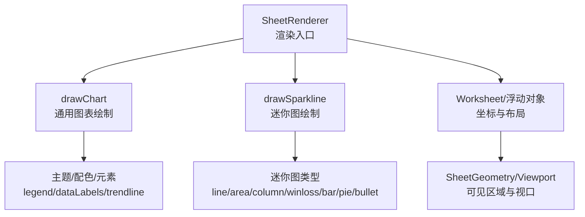
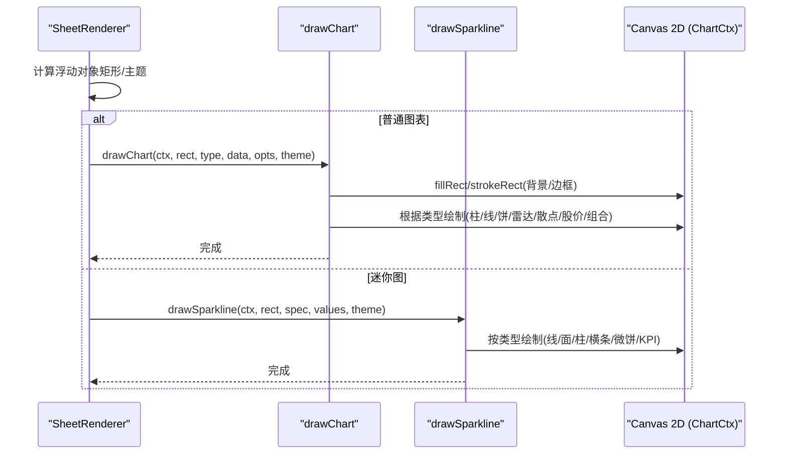
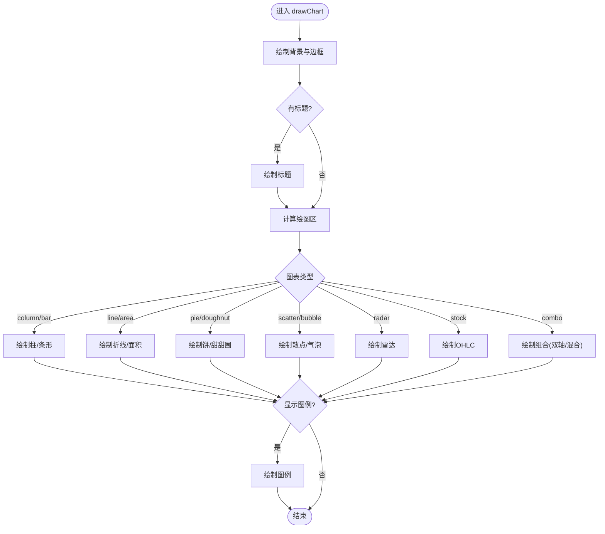
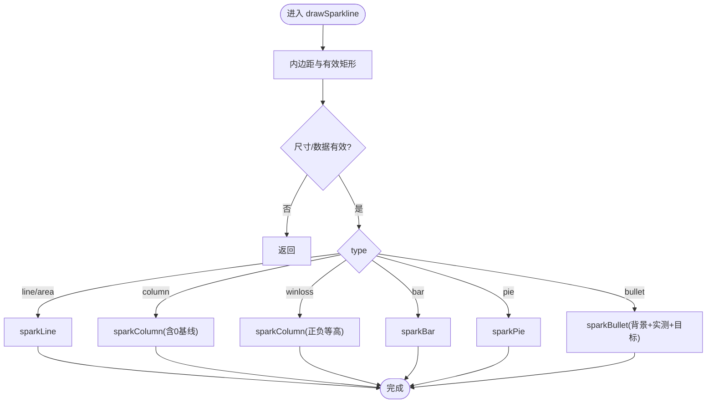
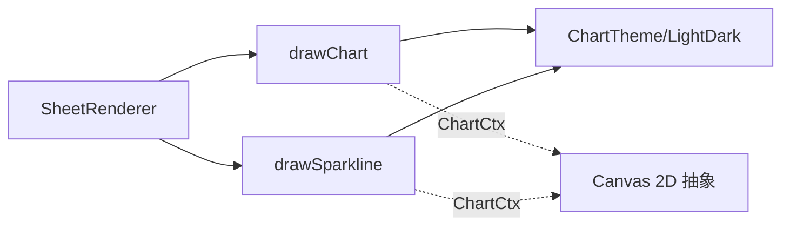

# 图表可视化

<cite>
**本文引用的文件**
- [drawChart.ts](file://cmx-mega-sheet/src/render/chart/drawChart.ts)
- [drawSparkline.ts](file://cmx-mega-sheet/src/render/chart/drawSparkline.ts)
- [SheetRenderer.ts](file://cmx-mega-sheet/src/render/SheetRenderer.ts)
- [index.ts](file://cmx-mega-sheet/src/index.ts)
- [ChartTypes.test.ts](file://cmx-mega-sheet/test/ChartTypes.test.ts)
- [Sparkline.test.ts](file://cmx-mega-sheet/test/Sparkline.test.ts)
- [spec-m24.js](file://cmx-mega-sheet/demo/specs/spec-m24.js)
</cite>

## 目录
1. [简介](#简介)
2. [项目结构](#项目结构)
3. [核心组件](#核心组件)
4. [架构总览](#架构总览)
5. [详细组件分析](#详细组件分析)
6. [依赖关系分析](#依赖关系分析)
7. [性能考量](#性能考量)
8. [故障排查指南](#故障排查指南)
9. [结论](#结论)
10. [附录](#附录)

## 简介
本技术文档聚焦于电子表格引擎中的图表可视化能力，覆盖折线图、柱状图、饼图等基础图表的渲染算法，以及迷你图（Sparkline）的轻量实现。文档还详细说明图表配置选项、样式定制与数据绑定机制，并给出动画效果、交互响应与性能优化的实践建议，最后提供扩展开发与第三方图表库集成的指导方案。

## 项目结构
图表能力位于 cmx-mega-sheet 模块的渲染层：
- 通用图表绘制：src/render/chart/drawChart.ts
- 迷你图绘制：src/render/chart/drawSparkline.ts
- 渲染器集成：src/render/SheetRenderer.ts
- 公共导出：src/index.ts
- 测试与示例：test/*, demo/specs/*

图示来源
- [SheetRenderer.ts:143-168](file://cmx-mega-sheet/src/render/SheetRenderer.ts#L143-L168)
- [drawChart.ts:104-152](file://cmx-mega-sheet/src/render/chart/drawChart.ts#L104-L152)
- [drawSparkline.ts:27-43](file://cmx-mega-sheet/src/render/chart/drawSparkline.ts#L27-L43)

章节来源
- [SheetRenderer.ts:143-168](file://cmx-mega-sheet/src/render/SheetRenderer.ts#L143-L168)
- [index.ts:185-186](file://cmx-mega-sheet/src/index.ts#L185-L186)

## 核心组件
- 通用图表绘制器 drawChart
  - 支持类型：column/bar/line/area/pie（M14），doughnut/scatter/bubble/radar/stock(OHLC)/combo（M24）
  - 增强元素：图例 legend、数据标签 dataLabels、趋势线 trendline（线性回归/移动平均）、双轴 secondaryAxis、甜甜圈挖孔 holeRatio
  - 主题：LIGHT_CHART_THEME/DARK_CHART_THEME，背景/边框/网格/标签等“非数据”元素随主题变化，系列数据色恒定
- 迷你图绘制器 drawSparkline
  - 类型：line/area/column/winloss/bar/pie/bullet
  - 特性：markers/highLow/firstLast 标记点；winloss 正负等高；bullet 目标竖线；严格边界控制避免溢出单元格
- 渲染器 SheetRenderer
  - 将图表/迷你图作为浮动对象绘制到工作表可见区域，注入 ChartTheme，复用最小 Canvas 2D 接口以支持 Node 测试

章节来源
- [drawChart.ts:10-25](file://cmx-mega-sheet/src/render/chart/drawChart.ts#L10-L25)
- [drawChart.ts:56-99](file://cmx-mega-sheet/src/render/chart/drawChart.ts#L56-L99)
- [drawChart.ts:104-152](file://cmx-mega-sheet/src/render/chart/drawChart.ts#L104-L152)
- [drawSparkline.ts:13-21](file://cmx-mega-sheet/src/render/chart/drawSparkline.ts#L13-L21)
- [drawSparkline.ts:27-43](file://cmx-mega-sheet/src/render/chart/drawSparkline.ts#L27-L43)
- [SheetRenderer.ts:143-168](file://cmx-mega-sheet/src/render/SheetRenderer.ts#L143-L168)

## 架构总览
图表渲染采用“薄渲染层 + 纯函数绘制”的设计：
- 数据模型：ChartData（类别 + 多系列数值）
- 绘制函数：drawChart/drawSparkline 为纯函数，仅依赖最小 Canvas 2D 抽象 ChartCtx
- 集成点：SheetRenderer 负责计算几何、视口裁剪、主题注入与调用绘制函数
- 测试友好：通过录制型 mock ctx 断言绘制原语次数，确保行为稳定

图示来源
- [SheetRenderer.ts:143-168](file://cmx-mega-sheet/src/render/SheetRenderer.ts#L143-L168)
- [drawChart.ts:104-152](file://cmx-mega-sheet/src/render/chart/drawChart.ts#L104-L152)
- [drawSparkline.ts:27-43](file://cmx-mega-sheet/src/render/chart/drawSparkline.ts#L27-L43)

## 详细组件分析

### 通用图表绘制器（drawChart）
- 数据模型
  - ChartSeries：name + values
  - ChartData：categories + series + title
- 选项与增强
  - legend：底部图例
  - dataLabels：数据标签
  - trendline：linear（最小二乘）或 movingAverage（窗口3）
  - secondaryAxis：指定系列使用次轴（双轴）
  - seriesTypes：混合 column/line
  - holeRatio：甜甜圈挖孔比例
- 主题
  - LIGHT_CHART_THEME/DARK_CHART_THEME：背景、边框、标题、坐标轴、网格、标签、图例、中性带/线
- 算法要点
  - 柱/条形：基于 valueRange 归一化，基线含 0，组内多系列并列
  - 折线/面积：stepX 均匀分布，面积填充使用 globalAlpha 半透明
  - 饼/甜甜圈：扇区角度按正值占比分配，甜甜圈用背景色挖空
  - 散点/气泡：两/三系列映射 x/y/size，气泡半透明
  - 雷达：n 轴放射，网格环与系列多边形
  - 股价 OHLC：影线 + 实体，涨绿跌红
  - 组合：按 seriesTypes 混合柱/线，secondaryAxis 独立缩放
  - 趋势线：线性回归与移动平均叠加

图示来源
- [drawChart.ts:104-152](file://cmx-mega-sheet/src/render/chart/drawChart.ts#L104-L152)
- [drawChart.ts:170-232](file://cmx-mega-sheet/src/render/chart/drawChart.ts#L170-L232)
- [drawChart.ts:234-261](file://cmx-mega-sheet/src/render/chart/drawChart.ts#L234-L261)
- [drawChart.ts:265-328](file://cmx-mega-sheet/src/render/chart/drawChart.ts#L265-L328)
- [drawChart.ts:330-405](file://cmx-mega-sheet/src/render/chart/drawChart.ts#L330-L405)
- [drawChart.ts:409-432](file://cmx-mega-sheet/src/render/chart/drawChart.ts#L409-L432)

章节来源
- [drawChart.ts:10-25](file://cmx-mega-sheet/src/render/chart/drawChart.ts#L10-L25)
- [drawChart.ts:56-99](file://cmx-mega-sheet/src/render/chart/drawChart.ts#L56-L99)
- [drawChart.ts:104-152](file://cmx-mega-sheet/src/render/chart/drawChart.ts#L104-L152)
- [drawChart.ts:170-232](file://cmx-mega-sheet/src/render/chart/drawChart.ts#L170-L232)
- [drawChart.ts:234-261](file://cmx-mega-sheet/src/render/chart/drawChart.ts#L234-L261)
- [drawChart.ts:265-328](file://cmx-mega-sheet/src/render/chart/drawChart.ts#L265-L328)
- [drawChart.ts:330-405](file://cmx-mega-sheet/src/render/chart/drawChart.ts#L330-L405)
- [drawChart.ts:409-432](file://cmx-mega-sheet/src/render/chart/drawChart.ts#L409-L432)

### 迷你图绘制器（drawSparkline）
- 类型与特性
  - line/area：折线与面积填充，支持 markers/highLow/firstLast 标记点
  - column：柱状，强制包含 0 的坐标范围，避免溢出单元格
  - winloss：正负等高柱，中心对齐
  - bar：横向条
  - pie：微饼
  - bullet：KPI 横条 + 目标竖线，背景带与前景线随主题
- 关键算法
  - range(values)：计算 min/max，处理全相等或空值
  - yOf(v)：将数值映射到像素坐标，保证在单元格内
  - 极小高度保护：h < 1 时修正为 1px 且不越界

图示来源
- [drawSparkline.ts:27-43](file://cmx-mega-sheet/src/render/chart/drawSparkline.ts#L27-L43)
- [drawSparkline.ts:45-81](file://cmx-mega-sheet/src/render/chart/drawSparkline.ts#L45-L81)
- [drawSparkline.ts:83-120](file://cmx-mega-sheet/src/render/chart/drawSparkline.ts#L83-L120)
- [drawSparkline.ts:122-146](file://cmx-mega-sheet/src/render/chart/drawSparkline.ts#L122-L146)
- [drawSparkline.ts:148-164](file://cmx-mega-sheet/src/render/chart/drawSparkline.ts#L148-L164)

章节来源
- [drawSparkline.ts:13-21](file://cmx-mega-sheet/src/render/chart/drawSparkline.ts#L13-L21)
- [drawSparkline.ts:27-43](file://cmx-mega-sheet/src/render/chart/drawSparkline.ts#L27-L43)
- [drawSparkline.ts:45-81](file://cmx-mega-sheet/src/render/chart/drawSparkline.ts#L45-L81)
- [drawSparkline.ts:83-120](file://cmx-mega-sheet/src/render/chart/drawSparkline.ts#L83-L120)
- [drawSparkline.ts:122-146](file://cmx-mega-sheet/src/render/chart/drawSparkline.ts#L122-L146)
- [drawSparkline.ts:148-164](file://cmx-mega-sheet/src/render/chart/drawSparkline.ts#L148-L164)

### 渲染器集成（SheetRenderer）
- 职责
  - 管理可见区域绘制（网格、行列头、单元格内容）
  - 注入 ChartTheme，调用 drawChart/drawSparkline 绘制浮动对象（图表/迷你图）
  - 复用最小 Canvas 2D 抽象，便于 Node 下测试
- 关键点
  - chartTheme 属性由上层 element 随主题切换同步
  - 通过 resolveObjectRect/hitObject 等工具计算浮动对象位置与命中

章节来源
- [SheetRenderer.ts:143-168](file://cmx-mega-sheet/src/render/SheetRenderer.ts#L143-L168)
- [index.ts:185-186](file://cmx-mega-sheet/src/index.ts#L185-L186)

## 依赖关系分析
- 模块耦合
  - SheetRenderer 依赖 drawChart/drawSparkline，但不直接依赖浏览器 Canvas 类型，而是通过 ChartCtx 抽象
  - drawChart/drawSparkline 之间解耦，仅共享 ChartCtx/ChartRect/ChartTheme 类型定义
- 外部依赖
  - 零运行时依赖，纯 canvas 2D 路径绘制
- 测试与验证
  - 通过录制型 mock ctx 统计绘制原语调用次数，验证各类型行为
  - 主题切换、挖孔颜色、系列数据色不随主题变化等行为均有单测覆盖

图示来源
- [SheetRenderer.ts:143-168](file://cmx-mega-sheet/src/render/SheetRenderer.ts#L143-L168)
- [drawChart.ts:27-47](file://cmx-mega-sheet/src/render/chart/drawChart.ts#L27-L47)
- [drawSparkline.ts:10-11](file://cmx-mega-sheet/src/render/chart/drawSparkline.ts#L10-L11)

章节来源
- [ChartTypes.test.ts:1-155](file://cmx-mega-sheet/test/ChartTypes.test.ts#L1-L155)
- [Sparkline.test.ts:1-141](file://cmx-mega-sheet/test/Sparkline.test.ts#L1-L141)

## 性能考量
- 零依赖与纯函数绘制
  - 无额外库开销，路径绘制直接操作 Canvas 2D
- 视口与虚拟化
  - 仅绘制可见区域，减少无效绘制
- 数据量与复杂度
  - 折线/面积：O(n) 路径构建
  - 柱/条形：O(n*m) 绘制（n 类别，m 系列）
  - 雷达：O(n*k)（n 轴，k 系列）
  - 散点/气泡：O(n)
  - 股价：O(n)
  - 组合：按 seriesTypes 混合，注意柱宽分配
- 优化建议
  - 大数据量时启用数据采样或聚合
  - 关闭不必要的元素（如 dataLabels、legend）以降低绘制成本
  - 合理设置 holeRatio 与网格环数量，避免过多 arc/stroke
  - 使用 requestAnimationFrame 分批绘制超大图表（需在上层封装）

[本节为通用性能讨论，不直接分析具体文件]

## 故障排查指南
- 常见问题
  - 迷你图柱溢出单元格：检查是否使用了包含 0 的坐标范围；确认 sparkColumn 的 axMin/axMax 逻辑
  - 甜甜圈挖孔颜色异常：确认传入 DARK_CHART_THEME 时挖孔使用背景色而非白色
  - 系列数据色随主题变化：系列色来自固定 PALETTE，不应随主题改变；若出现异常，检查是否误用了主题色
  - 组合图双轴错位：确认 secondaryAxis 索引正确，且 seriesTypes 与系列顺序一致
- 定位方法
  - 使用录制型 mock ctx 统计绘制原语次数，对比期望
  - 通过 spec-m24 用例验证新增类型与选项是否正确持久化与渲染

章节来源
- [Sparkline.test.ts:67-86](file://cmx-mega-sheet/test/Sparkline.test.ts#L67-L86)
- [ChartTypes.test.ts:110-155](file://cmx-mega-sheet/test/ChartTypes.test.ts#L110-L155)
- [spec-m24.js:52-67](file://cmx-mega-sheet/demo/specs/spec-m24.js#L52-L67)

## 结论
本项目实现了轻量、零依赖的图表与迷你图渲染能力，覆盖主流图表类型与增强元素，具备良好的主题适配与测试可验证性。通过最小 Canvas 2D 抽象与纯函数绘制，保证了跨环境的一致性与高性能。未来可在动画、交互与大规模数据场景下进一步扩展。

[本节为总结，不直接分析具体文件]

## 附录

### 配置选项速查
- 通用图表选项（ChartDrawOptions）
  - legend：布尔，显示图例
  - dataLabels：布尔，显示数据标签
  - trendline：'linear' | 'movingAverage'，趋势线类型
  - secondaryAxis：number[]，使用次轴的系列索引
  - seriesTypes：Array<'column' | 'line'>，每系列的图表类型
  - holeRatio：number，甜甜圈挖孔比例
- 迷你图选项（SparklineDraw）
  - type：'line' | 'area' | 'column' | 'winloss' | 'bar' | 'pie' | 'bullet'
  - color/negativeColor：主色/负值色
  - markers/highLow/firstLast：标记点开关
  - target：bullet 模式的目标值

章节来源
- [drawChart.ts:17-25](file://cmx-mega-sheet/src/render/chart/drawChart.ts#L17-L25)
- [drawSparkline.ts:13-21](file://cmx-mega-sheet/src/render/chart/drawSparkline.ts#L13-L21)

### 数据绑定机制
- 通用图表
  - categories：类别标签数组
  - series：[{ name, values }]，每个系列对应一组数值
  - 多系列支持：柱/线/组合中按系列索引着色
- 迷你图
  - 一维数值序列 values，来源于单行/单列数据
  - 类型决定绘制方式（线/面/柱/横条/微饼/KPI）

章节来源
- [drawChart.ts:10-15](file://cmx-mega-sheet/src/render/chart/drawChart.ts#L10-L15)
- [drawSparkline.ts:27-43](file://cmx-mega-sheet/src/render/chart/drawSparkline.ts#L27-L43)

### 动画与交互（扩展建议）
- 动画
  - 当前实现为静态绘制；可在上层封装动画循环，逐步增量绘制路径或分帧更新
  - 对大数据集可采用分片渲染与节流策略
- 交互
  - 可通过 hitObject/resizeHandles 等工具实现悬浮提示、拖拽调整大小
  - 结合事件系统（EventEmitter）实现点击高亮、联动筛选

[本节为概念性建议，不直接分析具体文件]

### 扩展开发与第三方集成
- 扩展新图表类型
  - 在 drawChart 中新增 case，实现对应的绘制函数，遵循 ChartCtx 接口
  - 复用 valueRange/valueRangeOf、PALETTE、theme 等基础设施
  - 补充单元测试，验证绘制原语次数与边界行为
- 集成第三方图表库
  - 在 SheetRenderer 中预留容器节点，按需挂载第三方图表实例
  - 保持与现有主题/尺寸/数据流的一致性，必要时做数据转换
  - 通过 exportHtml/exportPdf 等导出能力进行兼容处理

[本节为概念性指导，不直接分析具体文件]