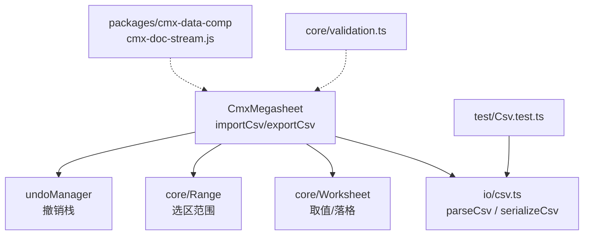
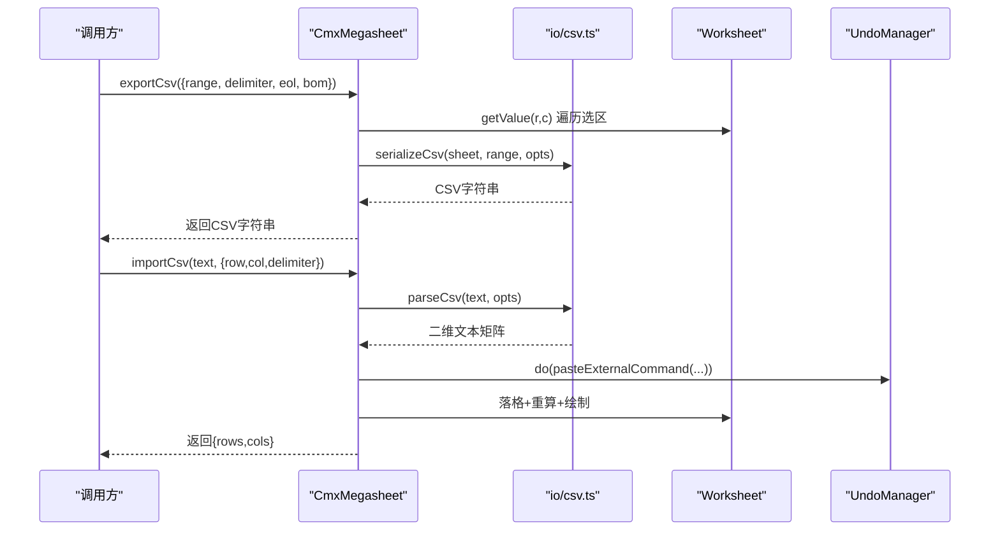
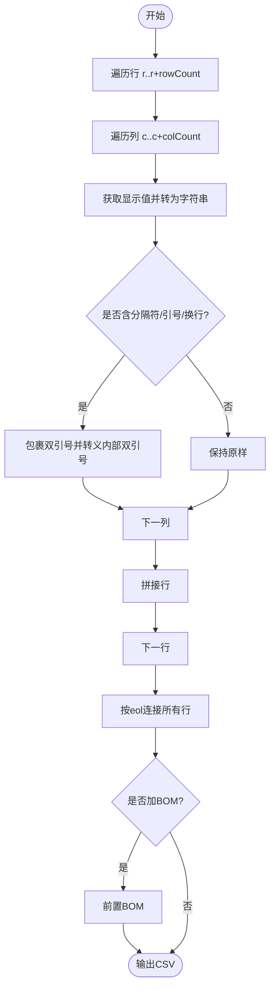
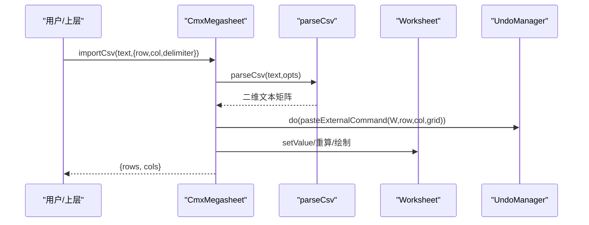
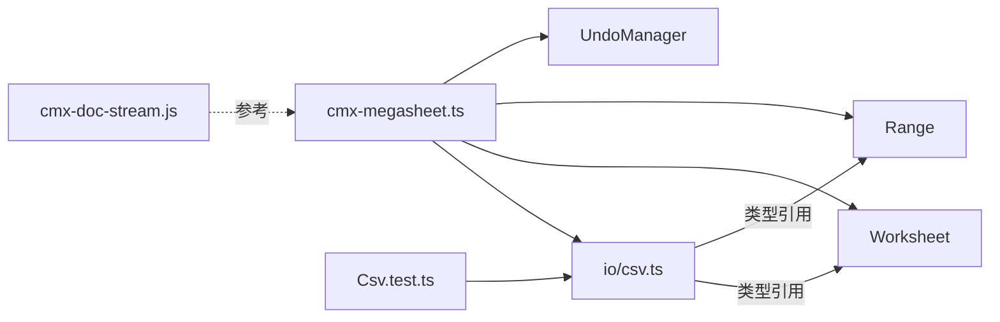

# CSV 文件处理

<cite>
**本文引用的文件**
- [csv.ts](file://cmx-mega-sheet/src/io/csv.ts)
- [Csv.test.ts](file://cmx-mega-sheet/test/Csv.test.ts)
- [cmx-megasheet.ts](file://cmx-mega-sheet/src/element/cmx-megasheet.ts)
- [validation.ts](file://cmx-mega-sheet/src/core/validation.ts)
- [cmx-doc-stream.js](file://packages/cmx-data-comp/src/lib/cmx-doc-stream.js)
- [ZMC-零内存复制-ERP后端最佳实践.md](file://docs/ZMC-零内存复制-ERP后端最佳实践.md)
</cite>

## 目录
1. [简介](#简介)
2. [项目结构](#项目结构)
3. [核心组件](#核心组件)
4. [架构总览](#架构总览)
5. [详细组件分析](#详细组件分析)
6. [依赖关系分析](#依赖关系分析)
7. [性能与大数据处理](#性能与大数据处理)
8. [错误处理与数据验证](#错误处理与数据验证)
9. [兼容性说明](#兼容性说明)
10. [故障排除指南](#故障排除指南)
11. [结论](#结论)

## 简介
本技术文档聚焦于仓库中的 CSV 导入导出能力，系统阐述解析与生成算法、编码与分隔符处理、引号转义与换行兼容策略，并给出大数据量场景下的流式读取与写入建议、内存优化与性能调优方案。同时覆盖错误处理、数据验证、类型推断与批量处理的实践要点，以及不同 CSV 变体的兼容性与常见问题排查。

## 项目结构
CSV 功能位于电子表格内核模块中，核心实现集中在 io/csv.ts，对外通过 cmx-megasheet.ts 暴露 importCsv/exportCsv 方法；测试用例在 test/Csv.test.ts；数据验证引擎在 core/validation.ts；通用流式装载（非 CSV）在 packages/cmx-data-comp/src/lib/cmx-doc-stream.js，可作为大数据流式处理的参考实现。



图表来源
- [cmx-megasheet.ts:710-738](file://cmx-mega-sheet/src/element/cmx-megasheet.ts#L710-L738)
- [csv.ts:14-89](file://cmx-mega-sheet/src/io/csv.ts#L14-L89)
- [Csv.test.ts:14-82](file://cmx-mega-sheet/test/Csv.test.ts#L14-L82)

章节来源
- [cmx-megasheet.ts:710-738](file://cmx-mega-sheet/src/element/cmx-megasheet.ts#L710-L738)
- [csv.ts:14-89](file://cmx-mega-sheet/src/io/csv.ts#L14-L89)
- [Csv.test.ts:14-82](file://cmx-mega-sheet/test/Csv.test.ts#L14-L82)

## 核心组件
- CSV 解析器 parseCsv：按 RFC-4180 风格解析，支持自定义分隔符、BOM 剥离、CR/LF 兼容、引号内逗号/换行、双引号转义。
- CSV 序列化器 serializeCsv：将工作表显示值序列化为 CSV，自动对含分隔符/引号/换行的字段包引号并转义，可选 UTF-8 BOM 与行结束符。
- 组件门面 CmxMegasheet.importCsv/exportCsv：封装解析/序列化到工作表的落格/取数流程，支持撤销与重算。
- 数据验证 validation.validateValue：提供输入校验规则（列表、整数、小数、日期、文本长度、自定义），用于编辑前拦截非法输入。
- 流式装载 FrameStreamParser：基于长度分帧的字节流解析器，适用于超大结果集的增量消费，可借鉴至 CSV 流式处理。

章节来源
- [csv.ts:14-89](file://cmx-mega-sheet/src/io/csv.ts#L14-L89)
- [cmx-megasheet.ts:710-738](file://cmx-mega-sheet/src/element/cmx-megasheet.ts#L710-L738)
- [validation.ts:1-88](file://cmx-mega-sheet/src/core/validation.ts#L1-L88)
- [cmx-doc-stream.js:1-121](file://packages/cmx-data-comp/src/lib/cmx-doc-stream.js#L1-L121)

## 架构总览
CSV 导入导出围绕“纯逻辑解析/序列化 + 工作表操作”的两层设计：io/csv.ts 负责协议级转换，cmx-megasheet.ts 负责与 Worksheet/Range/UndoManager 等内核交互。测试覆盖关键边界行为，确保往返一致性与多平台兼容性。



图表来源
- [cmx-megasheet.ts:710-738](file://cmx-mega-sheet/src/element/cmx-megasheet.ts#L710-L738)
- [csv.ts:42-89](file://cmx-mega-sheet/src/io/csv.ts#L42-L89)

## 详细组件分析

### CSV 解析器（parseCsv）
- 分隔符：默认逗号，可通过选项指定首字符作为分隔符。
- 引号与转义：支持 RFC-4180 风格的双引号包裹与 “”→" 转义。
- 换行兼容：\r\n 与 \n 均视为行结束；单独 \r 被跳过。
- BOM 处理：自动剥离前导 U+FEFF。
- 空输入：返回空数组。
- 末尾换行：不产生额外空行。

```mermaid
flowchart TD
Start(["开始"]) --> Init["初始化状态机<br/>inQuotes=false, field='', row=[]"]
Init --> Loop{"逐字符扫描"}
Loop --> |引号内| QCheck{"当前为\" ?"}
QCheck --> |是且下一个也是\"| Esc["追加\"并跳过两个字符"] --> Loop
QCheck --> |是且下一个不是\"| ExitQ["退出引号模式"] --> Loop
QCheck --> |否| AppendQ["追加字符到field"] --> Loop
Loop --> |不在引号| Delim{"是否为分隔符?"}
Delim --> |是| PushField["push field; field=''"] --> Loop
Delim --> |否| CR{"是否为\\r?"}
CR --> |是| SkipCR["跳过\\r"] --> Loop
CR --> |否| LF{"是否为\\n?"}
LF --> |是| EndRow["push field; push row; 重置row和field"] --> Loop
LF --> |否| Append["追加字符到field"] --> Loop
Loop --> |结束| Finalize{"有剩余field或row?"}
Finalize --> |是| PushLast["push field; push row"] --> End(["结束"])
Finalize --> |否| End
```

图表来源
- [csv.ts:61-89](file://cmx-mega-sheet/src/io/csv.ts#L61-L89)

章节来源
- [csv.ts:61-89](file://cmx-mega-sheet/src/io/csv.ts#L61-L89)
- [Csv.test.ts:14-42](file://cmx-mega-sheet/test/Csv.test.ts#L14-L42)

### CSV 序列化器（serializeCsv）
- 取值语义：取单元格显示值（公式计算值），对齐 Excel 另存为 CSV 的行为。
- 转义规则：若字段包含分隔符、引号或换行，则用双引号包裹并将内部双引号翻倍。
- 布尔值：输出 TRUE/FALSE。
- 行结束符：默认 \n，可配置为 \r\n。
- BOM：可选在开头添加 UTF-8 BOM，便于 Excel 中文不乱码。



图表来源
- [csv.ts:28-55](file://cmx-mega-sheet/src/io/csv.ts#L28-L55)

章节来源
- [csv.ts:28-55](file://cmx-mega-sheet/src/io/csv.ts#L28-L55)
- [Csv.test.ts:44-82](file://cmx-mega-sheet/test/Csv.test.ts#L44-L82)

### 组件门面（importCsv/exportCsv）
- exportCsv：根据可选 range 导出活动 sheet 或指定区域；透传 delimiter/eol/bom。
- importCsv：解析 CSV 后从目标行列起铺格，复用 pasteExternal 语义自动将数字串转为数值；入撤销栈并可重算与绘制；返回落区行列数。



图表来源
- [cmx-megasheet.ts:724-738](file://cmx-mega-sheet/src/element/cmx-megasheet.ts#L724-L738)
- [csv.ts:61-89](file://cmx-mega-sheet/src/io/csv.ts#L61-L89)

章节来源
- [cmx-megasheet.ts:724-738](file://cmx-mega-sheet/src/element/cmx-megasheet.ts#L724-L738)

### 数据验证（validateValue）
- 支持类型：list、whole、decimal、date、textLength、custom。
- 空值策略：allowBlank 控制是否允许空。
- 比较操作：between/notBetween/eq/ne/gt/lt/ge/le。
- 失败消息：优先使用规则中的 error 文案，否则回退默认提示。

章节来源
- [validation.ts:1-88](file://cmx-mega-sheet/src/core/validation.ts#L1-L88)

## 依赖关系分析
- io/csv.ts 仅依赖 Worksheet/Range 的类型声明，无 DOM 依赖，可在 Node 环境单测。
- cmx-megasheet.ts 聚合 Workbook、FormulaEngine、Worksheet、Range、UndoManager 等，承担 IO 与渲染协调。
- 测试用例直接断言解析/序列化行为，保障边界条件稳定。
- 流式装载模块（cmx-doc-stream.js）提供长度分帧解析器，可用于大数据场景的增量消费，虽非 CSV 专用，但可借鉴其缓冲与帧组装策略。



图表来源
- [csv.ts:11-13](file://cmx-mega-sheet/src/io/csv.ts#L11-L13)
- [cmx-megasheet.ts:70-85](file://cmx-mega-sheet/src/element/cmx-megasheet.ts#L70-L85)
- [Csv.test.ts:1-5](file://cmx-mega-sheet/test/Csv.test.ts#L1-L5)
- [cmx-doc-stream.js:93-121](file://packages/cmx-data-comp/src/lib/cmx-doc-stream.js#L93-L121)

章节来源
- [csv.ts:11-13](file://cmx-mega-sheet/src/io/csv.ts#L11-L13)
- [cmx-megasheet.ts:70-85](file://cmx-mega-sheet/src/element/cmx-megasheet.ts#L70-L85)
- [Csv.test.ts:1-5](file://cmx-mega-sheet/test/Csv.test.ts#L1-L5)
- [cmx-doc-stream.js:93-121](file://packages/cmx-data-comp/src/lib/cmx-doc-stream.js#L93-L121)

## 性能与大数据处理
- 解析/序列化复杂度：parseCsv 与 serializeCsv 均为 O(N) 线性扫描，N 为字符总数；内存占用与输入规模成正比。
- 大文件建议：
  - 前端侧：避免一次性加载超大 CSV 到内存；可采用分块读取与增量解析，结合 FrameStreamParser 的分帧思想，边收边解，减少峰值内存。
  - 后端侧：采用流式分帧传输（如 msgpack 帧），配合 onProgress/onRow 回调，实现真正的增量消费，内存与行数解耦。
- 内存优化策略：
  - 使用 Range 限定导出区域，减少不必要的数据访问。
  - 合理设置 eol/delimiter/bom，避免不必要的转义开销。
  - 对于只读展示，优先使用显示值（公式已计算），避免重复求值。
- 性能调优：
  - 批量落格：importCsv 内部通过命令入撤销栈，保证一致性；大批量时可考虑合并多次小批量提交以降低 UI 抖动。
  - 重算时机：仅在必要时 requestRecalc，避免频繁触发全量重算。

章节来源
- [csv.ts:42-89](file://cmx-mega-sheet/src/io/csv.ts#L42-L89)
- [cmx-megasheet.ts:724-738](file://cmx-mega-sheet/src/element/cmx-megasheet.ts#L724-L738)
- [cmx-doc-stream.js:1-121](file://packages/cmx-data-comp/src/lib/cmx-doc-stream.js#L1-L121)
- [ZMC-零内存复制-ERP后端最佳实践.md:61-78](file://docs/ZMC-零内存复制-ERP后端最佳实践.md#L61-L78)

## 错误处理与数据验证
- 解析错误：当前实现未抛出异常，空输入返回空数组；建议在调用层进行输入合法性检查（如分隔符有效性、最大行数限制）。
- 落格错误：importCsv 依赖 Worksheet.setValue/pasteExternal 语义，若超出行列边界应做裁剪或报错；建议在调用前校验目标区域。
- 数据验证：在编辑提交前调用 validateValue，阻止非法输入；对 CSV 导入后的数值型字段，可结合业务规则进行二次校验（如范围、格式）。
- 撤销与恢复：importCsv 入撤销栈，支持 undo/redo；批量导入时注意撤销栈大小与性能平衡。

章节来源
- [validation.ts:1-88](file://cmx-mega-sheet/src/core/validation.ts#L1-L88)
- [cmx-megasheet.ts:724-738](file://cmx-mega-sheet/src/element/cmx-megasheet.ts#L724-L738)

## 兼容性说明
- 分隔符：默认逗号，支持分号、制表符等（通过 delimiter 指定首字符）。
- 行结束符：\n 与 \r\n 均可正确解析；导出时可配置 eol。
- 引号与转义：遵循 RFC-4180，支持引号内逗号/换行与双引号转义。
- BOM：解析时自动剥离前导 BOM；导出时可添加 UTF-8 BOM 以兼容 Excel 中文显示。
- 类型推断：导入时将数字串自动转为数值（复用 pasteExternal 语义），布尔值导出为 TRUE/FALSE。
- 常见变体：
  - Excel 中文 CSV：建议导出时开启 BOM。
  - 欧洲地区常用分号分隔：通过 delimiter=';' 适配。
  - 混合换行：解析器兼容 \r\n 与 \n。

章节来源
- [csv.ts:14-55](file://cmx-mega-sheet/src/io/csv.ts#L14-L55)
- [csv.ts:61-89](file://cmx-mega-sheet/src/io/csv.ts#L61-L89)
- [Csv.test.ts:14-82](file://cmx-mega-sheet/test/Csv.test.ts#L14-L82)

## 故障排除指南
- 中文乱码：确认导出时启用 BOM；或在 Excel 打开时选择 UTF-8 编码。
- 分隔符不生效：检查传入的 delimiter 是否为单字符；确保 CSV 实际使用该分隔符。
- 引号内容错位：确认字段是否被正确包裹双引号；检查是否存在未转义的双引号。
- 末尾空行：解析器已避免末尾换行产生空行；若仍出现，检查上游数据源。
- 导入后数值类型异常：确认字段是否应为数字；如需强制文本，可在落格前转换为字符串。
- 性能问题：对超大文件采用流式处理；限制导出范围；减少重算频率。

章节来源
- [csv.ts:28-89](file://cmx-mega-sheet/src/io/csv.ts#L28-L89)
- [cmx-megasheet.ts:724-738](file://cmx-mega-sheet/src/element/cmx-megasheet.ts#L724-L738)

## 结论
该 CSV 模块提供了符合 RFC-4180 风格的解析与序列化能力，具备分隔符可配、BOM 支持、引号转义与换行兼容等特性，并通过组件门面与工作表内核无缝集成。针对大数据场景，建议借鉴流式分帧思路实现增量处理，结合合理的内存与重算策略，获得更优的性能表现。数据验证与撤销机制保障了数据的正确性与可回溯性。