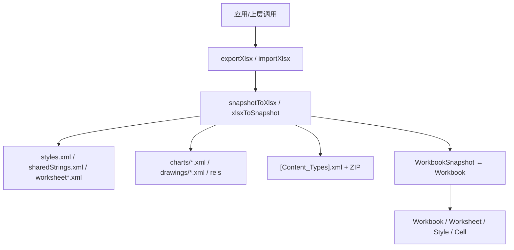
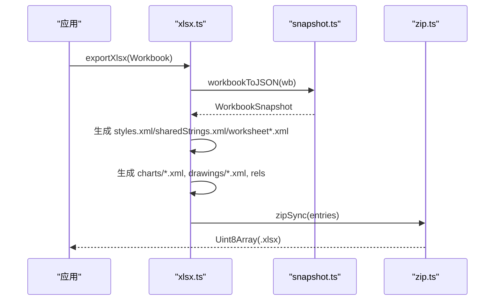
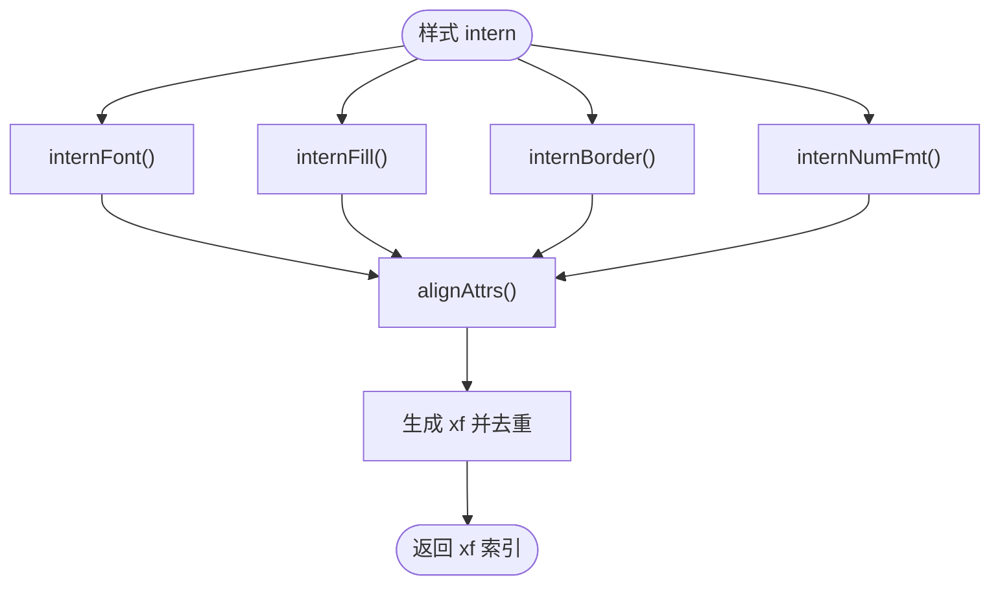
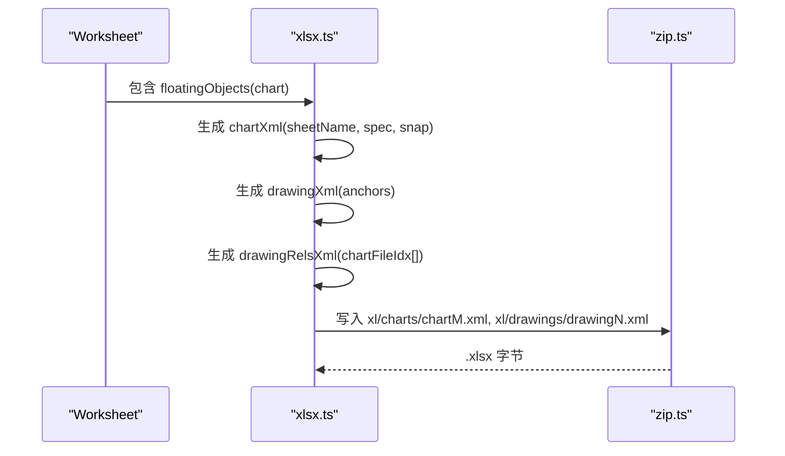
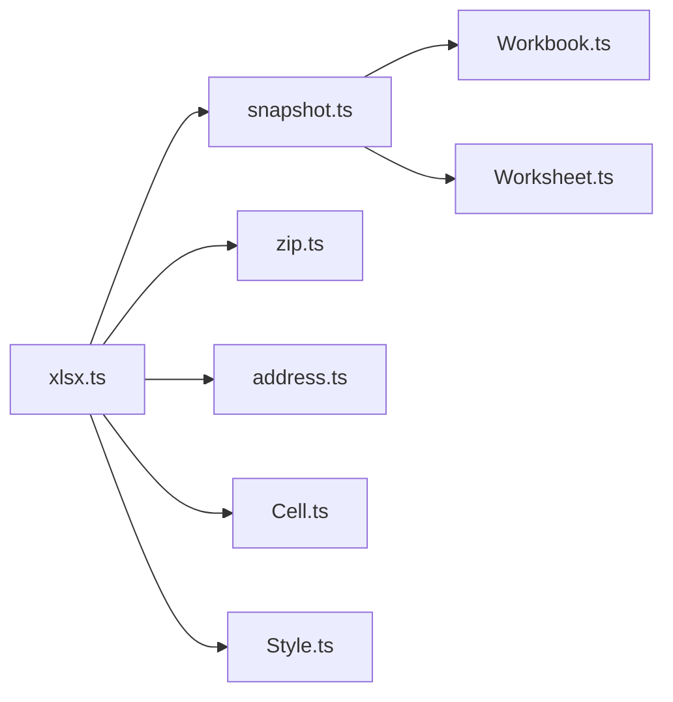

# Excel (XLSX) 导入导出

<cite>
**本文引用的文件**
- [xlsx.ts](file://cmx-mega-sheet/src/io/xlsx.ts)
- [Workbook.ts](file://cmx-mega-sheet/src/core/Workbook.ts)
- [Worksheet.ts](file://cmx-mega-sheet/src/core/Worksheet.ts)
- [Style.ts](file://cmx-mega-sheet/src/core/Style.ts)
- [zip.ts](file://cmx-mega-sheet/src/io/zip.ts)
- [snapshot.ts](file://cmx-mega-sheet/src/io/snapshot.ts)
- [Cell.ts](file://cmx-mega-sheet/src/core/Cell.ts)
- [address.ts](file://cmx-mega-sheet/src/core/address.ts)
- [xlsx.test.ts](file://cmx-mega-sheet/test/xlsx.test.ts)
</cite>

## 目录
1. [简介](#简介)
2. [项目结构](#项目结构)
3. [核心组件](#核心组件)
4. [架构总览](#架构总览)
5. [详细组件分析](#详细组件分析)
6. [依赖关系分析](#依赖关系分析)
7. [性能与内存优化](#性能与内存优化)
8. [故障排查指南](#故障排查指南)
9. [结论](#结论)
10. [附录：兼容性说明与最佳实践](#附录：兼容性说明与最佳实践)

## 简介
本技术文档聚焦于 cmx-mega-sheet 中的 Excel XLSX 导入导出能力，采用零依赖的 OOXML（SpreadsheetML）实现。该实现以“中性快照”为中间表示，完成 Workbook → 快照 → OOXML 字节流 的双向转换；同时支持样式系统、共享字符串表、合并单元格、图表与迷你图、冻结窗格、自动筛选、数据验证、页面设置等高级特性。文档从系统架构、组件职责、数据流、错误处理到性能优化进行系统化阐述，并提供兼容性与最佳实践建议。

## 项目结构
- IO 层
  - xlsx.ts：OOXML 读写核心，负责 styles.xml、sharedStrings.xml、worksheet XML、drawing/chart XML、[Content_Types].xml、rels 组装与 ZIP 打包/解包。
  - zip.ts：ZIP 压缩/解压与 UTF-8 编解码，支撑 OOXML 部件容器。
  - snapshot.ts：工作簿/工作表的“中性快照”序列化/反序列化，作为 IO 与核心模型之间的桥梁。
- Core 层
  - Workbook.ts：工作簿对象，管理多工作表、活动表、命名区域、命令/撤销、重算钩子等。
  - Worksheet.ts：工作表数据模型，承载单元格、合并区、行列元数据、大纲分组、自动筛选、数据验证、浮动对象（图表/图片/形状）、迷你图、页面设置、保护等。
  - Style.ts：样式体系（字体、填充、边框、数字格式、对齐、锁定），含命名样式表与级联解析。
  - Cell.ts：单元格值/公式/富文本等基础类型与规范化。
  - address.ts：地址解析与格式化（A1 坐标）。
- 测试
  - xlsx.test.ts：端到端往返测试，覆盖值、公式、合并、样式、可见性、活动表等。

**图示来源**
- [xlsx.ts:680-807](file://cmx-mega-sheet/src/io/xlsx.ts#L680-L807)
- [xlsx.ts:1460-1519](file://cmx-mega-sheet/src/io/xlsx.ts#L1460-L1519)
- [snapshot.ts](file://cmx-mega-sheet/src/io/snapshot.ts)
- [Workbook.ts:174-397](file://cmx-mega-sheet/src/core/Workbook.ts#L174-L397)
- [Worksheet.ts:435-800](file://cmx-mega-sheet/src/core/Worksheet.ts#L435-L800)

**章节来源**
- [xlsx.ts:1-22](file://cmx-mega-sheet/src/io/xlsx.ts#L1-L22)
- [xlsx.ts:680-807](file://cmx-mega-sheet/src/io/xlsx.ts#L680-L807)
- [xlsx.ts:1460-1519](file://cmx-mega-sheet/src/io/xlsx.ts#L1460-L1519)
- [Workbook.ts:174-397](file://cmx-mega-sheet/src/core/Workbook.ts#L174-L397)
- [Worksheet.ts:435-800](file://cmx-mega-sheet/src/core/Worksheet.ts#L435-L800)

## 核心组件
- 样式注册表（StyleRegistry）
  - 去重 font/fill/border/numFmt，生成 cellXfs 索引，输出 styles.xml。
  - 支持字体、填充（纯色/图案/渐变）、边框（含对角线）、数字格式、对齐（水平/垂直/换行/旋转/缩进/缩小）、锁定状态。
- 共享字符串表（SharedStrings）
  - 字符串去重与索引化，减少重复存储，提升文件大小与解析性能。
- 工作表 XML 生成（sheetToXml）
  - 按行分组单元格，写入 row/col 元信息、合并区、冻结窗格、自动筛选、数据验证、页面设置、绘图引用、迷你图等。
- 图表与绘图
  - 基于 ChartSpec 生成 chartN.xml，使用 twoCellAnchor 定位 drawingN.xml，并通过 rels 关联。
- 导入解析器
  - 正则扫描 sharedStrings/styles/worksheet/drawing/chart，构建 SheetSnapshot/WorkbookSnapshot，再还原为 Workbook。

**章节来源**
- [xlsx.ts:88-236](file://cmx-mega-sheet/src/io/xlsx.ts#L88-L236)
- [xlsx.ts:238-261](file://cmx-mega-sheet/src/io/xlsx.ts#L238-L261)
- [xlsx.ts:290-396](file://cmx-mega-sheet/src/io/xlsx.ts#L290-L396)
- [xlsx.ts:541-676](file://cmx-mega-sheet/src/io/xlsx.ts#L541-L676)
- [xlsx.ts:815-1519](file://cmx-mega-sheet/src/io/xlsx.ts#L815-L1519)

## 架构总览
- 导出流程
  - Workbook → workbookToJSON（快照）→ snapshotToXlsx → 生成各 OOXML 部件 → zipSync 输出 .xlsx。
- 导入流程
  - .xlsx 字节 → unzipSync → 解析 sharedStrings/styles/workbook/worksheets/drawings/charts → 构建 WorkbookSnapshot → workbookFromJSON → Workbook。

**图示来源**
- [xlsx.ts:680-807](file://cmx-mega-sheet/src/io/xlsx.ts#L680-L807)
- [xlsx.ts:811-813](file://cmx-mega-sheet/src/io/xlsx.ts#L811-L813)
- [snapshot.ts](file://cmx-mega-sheet/src/io/snapshot.ts)
- [zip.ts](file://cmx-mega-sheet/src/io/zip.ts)

**章节来源**
- [xlsx.ts:680-807](file://cmx-mega-sheet/src/io/xlsx.ts#L680-L807)
- [xlsx.ts:811-813](file://cmx-mega-sheet/src/io/xlsx.ts#L811-L813)

## 详细组件分析

### 样式系统（字体、填充、边框、数字格式）
- 导出侧
  - StyleRegistry.intern 将样式键映射到唯一 xf 索引，避免重复。
  - 字体：粗体/斜体/下划线/删除线/字号/字体名/前景色。
  - 填充：纯色 backColor、pattern（18 种 patternType）、gradient（线性角度+停止点）。
  - 边框：四边 + 对角线（diagonalUp/diagonalDown），颜色与线型映射。
  - 数字格式：自定义 numFmtId ≥ 164，内置 id 映射到常用格式串。
  - 对齐：水平/垂直、换行、文本旋转（负角转 90..180）、缩进、缩小以适应列宽。
  - 保护：locked=false 显式解锁。
- 导入侧
  - parseStyles 解析 fonts/fills/borders/cellXfs，恢复 StyleProps。
  - 支持读取 textRotation/indent/shrinkToFit/locked 等属性。

**图示来源**
- [xlsx.ts:88-236](file://cmx-mega-sheet/src/io/xlsx.ts#L88-L236)
- [xlsx.ts:853-973](file://cmx-mega-sheet/src/io/xlsx.ts#L853-L973)

**章节来源**
- [xlsx.ts:88-236](file://cmx-mega-sheet/src/io/xlsx.ts#L88-L236)
- [xlsx.ts:853-973](file://cmx-mega-sheet/src/io/xlsx.ts#L853-L973)
- [Style.ts:68-100](file://cmx-mega-sheet/src/core/Style.ts#L68-L100)

### 共享字符串表优化
- 导出：SharedStrings.intern 对字符串去重，sst.xml 中仅存唯一项，单元格通过索引引用。
- 导入：parseSharedStrings 用正则提取 <si>/<t>，拼接富文本 run 的文本。

**章节来源**
- [xlsx.ts:238-261](file://cmx-mega-sheet/src/io/xlsx.ts#L238-L261)
- [xlsx.ts:834-851](file://cmx-mega-sheet/src/io/xlsx.ts#L834-L851)

### 合并单元格处理
- 导出：遍历 snap.spans，生成 mergeCells 列表。
- 导入：解析 mergeCells 区间，计算左上角与行列跨度。

**章节来源**
- [xlsx.ts:357-366](file://cmx-mega-sheet/src/io/xlsx.ts#L357-L366)
- [xlsx.ts:1263-1282](file://cmx-mega-sheet/src/io/xlsx.ts#L1263-L1282)
- [Worksheet.ts:688-717](file://cmx-mega-sheet/src/core/Worksheet.ts#L688-L717)

### 图表和迷你图支持
- 图表
  - 导出：根据 ChartSpec 生成 series 引用、plotArea、轴、标题/图例，输出 chartN.xml；twoCellAnchor 在 drawingN.xml 中锚定；rels 指向 chart。
  - 导入：从 sheet XML 的 <drawing r:id> 追踪到 drawing 与 chart，反解类型、标题、数据范围，重建 FloatingObject.chart。
- 迷你图
  - 导出：将 CMX 迷你图映射为 Excel 原生 3 型（line/column/stacked），写入 extLst x14 sparklineGroup。
  - 导入：解析 x14 sparklineGroup，还原 dataRange 与落点位置。

**图示来源**
- [xlsx.ts:541-676](file://cmx-mega-sheet/src/io/xlsx.ts#L541-L676)
- [xlsx.ts:694-716](file://cmx-mega-sheet/src/io/xlsx.ts#L694-L716)
- [xlsx.ts:1081-1146](file://cmx-mega-sheet/src/io/xlsx.ts#L1081-L1146)

**章节来源**
- [xlsx.ts:541-676](file://cmx-mega-sheet/src/io/xlsx.ts#L541-L676)
- [xlsx.ts:1081-1146](file://cmx-mega-sheet/src/io/xlsx.ts#L1081-L1146)
- [xlsx.ts:467-492](file://cmx-mega-sheet/src/io/xlsx.ts#L467-L492)

### 工作簿结构、工作表布局、冻结窗格、自动筛选、数据验证
- 工作簿
  - workbook.xml：sheet 列表、活动页签；workbook rels 指向各 sheet 与 styles/sst。
- 工作表布局
  - dimension、cols、rows、mergeCells、autoFilter、dataValidations、pageSetup、drawing、sparklines。
- 冻结窗格
  - 导出：sheetViews 中 pane 设置 xSplit/ySplit/topLeftCell/activePane/state=frozen。
  - 导入：解析 pane 属性，恢复 frozenRowCount/frozenColCount。
- 自动筛选
  - 导出：autoFilter ref 指定区域。
  - 导入：解析 autoFilter ref，保留区域（条件由 UI 维护）。
- 数据验证
  - 导出：list 类型以 formula1 引号列表形式输出；其他类型按 operator/formula1/formula2。
  - 导入：解析 sqref/type/operator/formula1/formula2，list 类型拆分为候选值。

**章节来源**
- [xlsx.ts:398-450](file://cmx-mega-sheet/src/io/xlsx.ts#L398-L450)
- [xlsx.ts:410-428](file://cmx-mega-sheet/src/io/xlsx.ts#L410-L428)
- [xlsx.ts:494-505](file://cmx-mega-sheet/src/io/xlsx.ts#L494-L505)
- [xlsx.ts:1307-1337](file://cmx-mega-sheet/src/io/xlsx.ts#L1307-L1337)
- [xlsx.ts:1391-1426](file://cmx-mega-sheet/src/io/xlsx.ts#L1391-L1426)

### 大纲分组与汇总方位
- 导出：根据 OutlineAxis 计算每行/列的 outlineLevel，写入 row/col 的 outlineLevel 与 collapsed，并在 sheetPr 中写入 summaryBelow/summaryRight。
- 导入：从 outlineLevel 与 collapsed 重建 OutlineGroupSnapshot，恢复分组层级与折叠态。

**章节来源**
- [xlsx.ts:278-288](file://cmx-mega-sheet/src/io/xlsx.ts#L278-L288)
- [xlsx.ts:308-372](file://cmx-mega-sheet/src/io/xlsx.ts#L308-L372)
- [xlsx.ts:1005-1042](file://cmx-mega-sheet/src/io/xlsx.ts#L1005-L1042)
- [xlsx.ts:1339-1348](file://cmx-mega-sheet/src/io/xlsx.ts#L1339-L1348)
- [Worksheet.ts:248-388](file://cmx-mega-sheet/src/core/Worksheet.ts#L248-L388)

### 页面设置（打印/导出）
- 导出：paperSize、orientation、margins、scale、fitToPages。
- 导入：解析 pageSetup/pageMargins，恢复页面设置。

**章节来源**
- [xlsx.ts:494-505](file://cmx-mega-sheet/src/io/xlsx.ts#L494-L505)
- [xlsx.ts:1433-1457](file://cmx-mega-sheet/src/io/xlsx.ts#L1433-L1457)

### 公式与缓存值
- 导出：公式格写入 <f> 源与 <v> 缓存值（数值/布尔/字符串）。
- 导入：解析 <f> 与 <v>，并对导入公式做 sanitizeImportedFormula 安全化处理。

**章节来源**
- [xlsx.ts:507-539](file://cmx-mega-sheet/src/io/xlsx.ts#L507-L539)
- [xlsx.ts:1216-1229](file://cmx-mega-sheet/src/io/xlsx.ts#L1216-L1229)
- [Cell.ts](file://cmx-mega-sheet/src/core/Cell.ts)

## 依赖关系分析
- 模块耦合
  - xlsx.ts 依赖 snapshot.ts 进行模型与快照互转，依赖 zip.ts 进行 OOXML 打包/解包，依赖 address.ts/Cell.ts 进行地址与公式处理。
  - 样式系统通过 Style.ts 提供统一语义，IO 层负责与 OOXML 字段映射。
- 外部依赖
  - 零依赖：不引入 exceljs 等第三方库，完全手写 OOXML，降低体积与许可风险。
- 循环依赖规避
  - 通过事件与钩子（如 recalcHook）避免 core→formula 的模块环。

**图示来源**
- [xlsx.ts:14-21](file://cmx-mega-sheet/src/io/xlsx.ts#L14-L21)
- [Workbook.ts:231-261](file://cmx-mega-sheet/src/core/Workbook.ts#L231-L261)

**章节来源**
- [xlsx.ts:14-21](file://cmx-mega-sheet/src/io/xlsx.ts#L14-L21)
- [Workbook.ts:231-261](file://cmx-mega-sheet/src/core/Workbook.ts#L231-L261)

## 性能与内存优化
- 共享字符串去重：大幅减少重复字符串存储，降低文件体积与解析开销。
- 样式去重：StyleRegistry 对 font/fill/border/numFmt/xf 去重，避免冗余。
- 正则扫描而非 DOM：导入侧使用轻量正则解析 XML，避免 DOM 树构建带来的内存峰值。
- 稀疏存储：Worksheet 使用 SparseMatrix 存储单元格，仅记录非空数据。
- 增量重算：Workbook 支持 requestRecalcCells 增量重算，减少全量重算成本。
- 绘制抑制：Workbook.suspendPaint/resumePaint 批量操作时抑制渲染。
- 大文件策略建议
  - 分批导出：按 sheet 或区域分块生成快照，逐步写入 ZIP。
  - 流式写入：结合 zip 流式 API（若可用）避免一次性构建大数组。
  - 限制样式复杂度：减少高复杂度渐变/图案的使用，控制 styles.xml 大小。
  - 合理设置维度：避免创建超大空白区域，使用 dimension 精确描述使用区。

**章节来源**
- [xlsx.ts:238-261](file://cmx-mega-sheet/src/io/xlsx.ts#L238-L261)
- [xlsx.ts:88-236](file://cmx-mega-sheet/src/io/xlsx.ts#L88-L236)
- [xlsx.ts:815-851](file://cmx-mega-sheet/src/io/xlsx.ts#L815-L851)
- [Worksheet.ts:435-470](file://cmx-mega-sheet/src/core/Worksheet.ts#L435-L470)
- [Workbook.ts:231-261](file://cmx-mega-sheet/src/core/Workbook.ts#L231-L261)
- [Workbook.ts:384-397](file://cmx-mega-sheet/src/core/Workbook.ts#L384-L397)

## 故障排查指南
- 常见导入问题
  - 共享字符串为空：检查 sharedStrings.xml 是否被正确解析（<si>/<t>）。
  - 样式丢失：确认 styles.xml 中 cellXfs 与 xf 索引对应关系正确。
  - 图表未显示：检查 drawing 与 chart 的 rels 路径是否正确，锚点坐标是否在有效范围内。
  - 数据验证异常：list 类型的 formula1 需带引号包裹逗号分隔列表。
- 常见导出问题
  - 冻结窗格错位：确保 activePane 与 topLeftCell 一致。
  - 自动筛选区域错误：autoFilter ref 必须覆盖首行表头。
  - 页面设置无效：paperSize 需在映射表中存在，margins 单位为英寸。
- 调试建议
  - 使用单元测试验证往返一致性（值、公式、合并、样式、活动表）。
  - 导出后解压查看各 XML 片段，核对关键标签与属性。
  - 对复杂样式与图表单独构造最小用例，逐步定位问题。

**章节来源**
- [xlsx.ts:834-851](file://cmx-mega-sheet/src/io/xlsx.ts#L834-L851)
- [xlsx.ts:1081-1146](file://cmx-mega-sheet/src/io/xlsx.ts#L1081-L1146)
- [xlsx.ts:1391-1426](file://cmx-mega-sheet/src/io/xlsx.ts#L1391-L1426)
- [xlsx.test.ts:41-162](file://cmx-mega-sheet/test/xlsx.test.ts#L41-L162)

## 结论
该 XLSX 导入导出实现以零依赖方式完整覆盖 CMX 报表所需的 OOXML 子集，通过“中性快照”实现与核心模型的解耦，具备样式系统、共享字符串、合并单元格、图表/迷你图、冻结窗格、自动筛选、数据验证、页面设置等能力。其正则驱动的轻量解析与去重策略保障了性能与内存效率，配合增量重算与绘制抑制，适合大数据量场景。测试覆盖往返一致性，可作为质量保障基础。

## 附录：兼容性说明与最佳实践
- 兼容性
  - 目标：Excel 可打开与编辑；部分高级特性（如 M18 渐变、M20 保护）以近似或子集方式兼容。
  - 图表：导出为 Excel 原生 chart 类型；导入时反解为 FloatingObject.chart，便于在编辑器内重现。
  - 迷你图：导出为 Excel 原生 3 型（line/column/stacked），有损降级 area/bar/pie/bullet。
  - 数字格式：内置 id 映射至常用格式串，自定义格式从 164 起分配。
- 最佳实践
  - 尽量使用共享字符串与样式去重，减少文件体积。
  - 明确设置 dimension，避免无意义的大空白区域。
  - 谨慎使用复杂渐变与大量迷你图，控制样式与绘图复杂度。
  - 对大工作簿，考虑分 sheet 导出与按需加载。
  - 使用单元测试验证关键路径（值、公式、合并、样式、活动表、冻结窗格、自动筛选、数据验证）。

**章节来源**
- [xlsx.ts:998-1003](file://cmx-mega-sheet/src/io/xlsx.ts#L998-L1003)
- [xlsx.ts:467-492](file://cmx-mega-sheet/src/io/xlsx.ts#L467-L492)
- [xlsx.test.ts:41-162](file://cmx-mega-sheet/test/xlsx.test.ts#L41-L162)