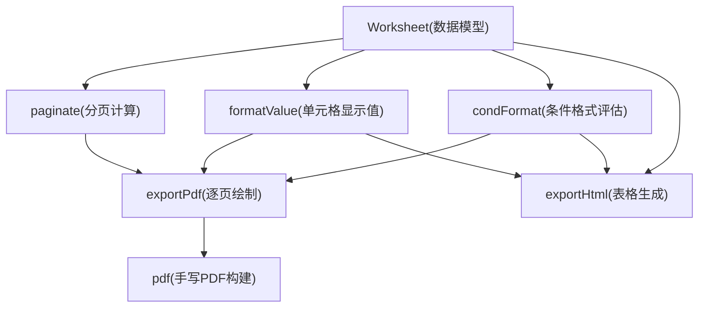
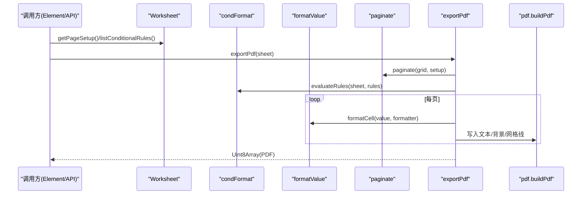
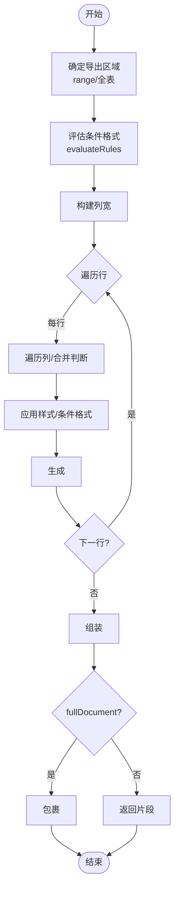
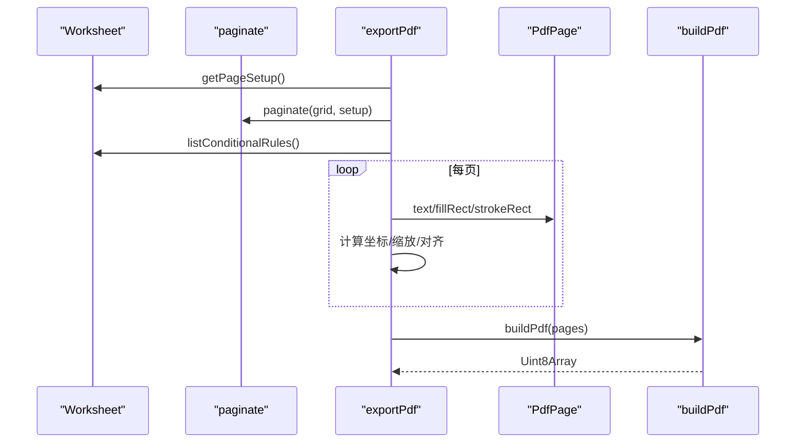
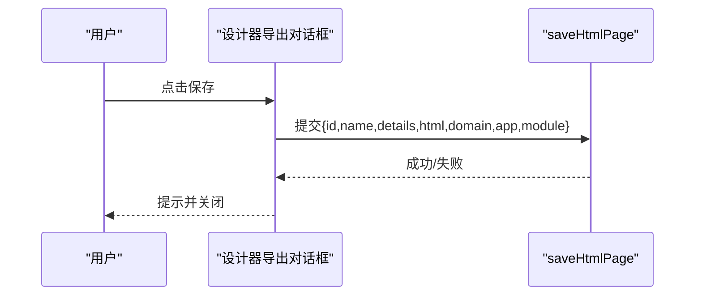
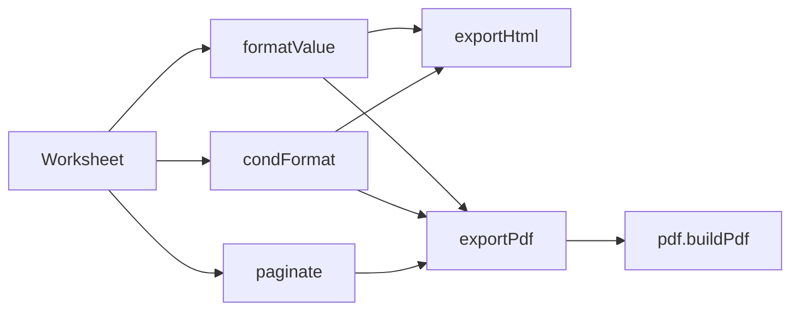

# HTML 和 PDF 导出

<cite>
**本文引用的文件**
- [exportHtml.ts](file://cmx-mega-sheet/src/io/exportHtml.ts)
- [exportPdf.ts](file://cmx-mega-sheet/src/io/exportPdf.ts)
- [pdf.ts](file://cmx-mega-sheet/src/io/pdf.ts)
- [paginate.ts](file://cmx-mega-sheet/src/io/paginate.ts)
- [Worksheet.ts](file://cmx-mega-sheet/src/core/Worksheet.ts)
- [formatValue.js](file://cmx-mega-sheet/src/render/formatValue.js)
- [condFormat.js](file://cmx-mega-sheet/src/render/condFormat.js)
- [designer-server-export.js](file://CMXHTMLDesigner/src/components/designer-app/designer-server-export.js)
- [demo_actions.js](file://cmx-mega-sheet/demo/demo_actions.js)
- [verify-m15.mjs](file://cmx-mega-sheet/demo/verify-m15.mjs)
</cite>

## 目录
1. [简介](#简介)
2. [项目结构](#项目结构)
3. [核心组件](#核心组件)
4. [架构总览](#架构总览)
5. [详细组件分析](#详细组件分析)
6. [依赖关系分析](#依赖关系分析)
7. [性能与质量调优](#性能与质量调优)
8. [故障排查指南](#故障排查指南)
9. [结论](#结论)

## 简介
本技术文档聚焦于工作表导出能力，覆盖 HTML 表格生成与 PDF 导出两大路径。内容涵盖：
- HTML 表格生成算法：样式保留、合并单元格、条件格式底色叠加、列宽/行高映射、完整文档或片段输出。
- PDF 生成流程：页面设置（纸张、边距、方向）、分页控制（fitToPages/scale/printTitles）、逐页绘制（背景、文本、网格线）、页眉页脚宏展开、矢量图形支持现状与限制。
- 配置选项与模板：导出区域、是否完整 HTML 文档、标题、网格线开关；PDF 的页面设置与打印区域。
- 批量处理与集成：通过 Element API 触发导出、下载与预览；服务端保存 HTML 页面的交互流程。
- 性能优化建议：文件大小控制、渲染开销、字体与字符集限制、图表与图片栅格化策略。

## 项目结构
导出功能位于 cmx-mega-sheet 模块的 io 层，围绕 Worksheet 数据模型，复用 render 层的格式化与条件格式计算，配合自研轻量 PDF 写出器实现零依赖导出。

**图示来源**
- [exportHtml.ts:27-53](file://cmx-mega-sheet/src/io/exportHtml.ts#L27-L53)
- [exportPdf.ts:19-108](file://cmx-mega-sheet/src/io/exportPdf.ts#L19-L108)
- [pdf.ts:63-114](file://cmx-mega-sheet/src/io/pdf.ts#L63-L114)
- [paginate.ts:64-132](file://cmx-mega-sheet/src/io/paginate.ts#L64-L132)

**章节来源**
- [exportHtml.ts:1-96](file://cmx-mega-sheet/src/io/exportHtml.ts#L1-L96)
- [exportPdf.ts:1-131](file://cmx-mega-sheet/src/io/exportPdf.ts#L1-L131)
- [pdf.ts:1-166](file://cmx-mega-sheet/src/io/pdf.ts#L1-L166)
- [paginate.ts:1-169](file://cmx-mega-sheet/src/io/paginate.ts#L1-L169)
- [Worksheet.ts:188-210](file://cmx-mega-sheet/src/core/Worksheet.ts#L188-L210)

## 核心组件
- 工作表数据模型：提供行列尺寸、单元格值、样式解析、合并区、条件规则等能力，是导出逻辑的数据源。
- HTML 导出：将工作表区域转换为自包含 HTML 或仅 <table> 片段，内联样式保留字体、对齐、背景、边框等，并叠加条件格式底色。
- PDF 导出：基于分页结果逐页绘制，支持页眉页脚宏、重复标题行/列、网格线、背景色与文本；当前使用内置 Helvetica 字体，CJK 字符以占位符输出。
- 分页引擎：根据纸张、边距、缩放/适合页数、打印区域与重复标题，计算每页的行/列区间与缩放系数。
- 手写 PDF 构建器：最小 PDF 写出器，支持多页、文本、矩形填充/描边、裁剪，构建 Catalog/Pages/Font/xref/trailer。

**章节来源**
- [Worksheet.ts:188-210](file://cmx-mega-sheet/src/core/Worksheet.ts#L188-L210)
- [exportHtml.ts:15-53](file://cmx-mega-sheet/src/io/exportHtml.ts#L15-L53)
- [exportPdf.ts:19-108](file://cmx-mega-sheet/src/io/exportPdf.ts#L19-L108)
- [paginate.ts:12-50](file://cmx-mega-sheet/src/io/paginate.ts#L12-L50)
- [pdf.ts:13-60](file://cmx-mega-sheet/src/io/pdf.ts#L13-L60)

## 架构总览
导出流程由 Worksheet 驱动，render 层提供格式化与条件格式评估，io 层负责 HTML 与 PDF 两种输出形态。PDF 路径额外依赖分页与手写 PDF 构建器。

**图示来源**
- [exportPdf.ts:19-108](file://cmx-mega-sheet/src/io/exportPdf.ts#L19-L108)
- [pdf.ts:63-114](file://cmx-mega-sheet/src/io/pdf.ts#L63-L114)
- [paginate.ts:64-132](file://cmx-mega-sheet/src/io/paginate.ts#L64-L132)

## 详细组件分析

### HTML 表格生成算法
- 输入与配置
  - 导出区域：可选 range（row/col/rowCount/colCount），缺省为全表维度。
  - fullDocument：是否输出完整 HTML 文档（含 DOCTYPE/head/title/body）。
  - title：文档标题，默认使用工作表名。
  - gridlines：是否绘制表格边框（默认开启）。
- 样式保留
  - 字体粗细、斜体、下划线、水平/垂直对齐、字号、前景色、背景色均以内联 CSS 形式写入 td。
  - 边框：若单元格定义了 borders，按四边分别写入；否则统一默认网格线。
  - 合并单元格：通过 rowspan/colspan 表达，非左上角单元格跳过渲染。
- 条件格式
  - 在导出前评估条件格式规则，将命中区域的背景色/字色作为 overlay 叠加到单元格样式中。
- 列宽与行高
  - 使用 colgroup 精确设置列宽；tr 高度按行高设定，保证视觉一致。
- 浏览器兼容性与响应式
  - 输出为纯 HTML + 内联样式，无外部依赖，可在任意现代浏览器直接打开。
  - 未引入媒体查询或流式布局，属于固定宽度表格；如需响应式，建议在宿主页面添加容器与媒体查询进行适配。
- 打印优化
  - 可通过浏览器“打印”对话框选择纸张与边距；由于表格宽度固定，建议在导出前设置合适的列宽，或在宿主页面增加 @media print 样式以优化打印效果。

**图示来源**
- [exportHtml.ts:27-53](file://cmx-mega-sheet/src/io/exportHtml.ts#L27-L53)
- [exportHtml.ts:55-91](file://cmx-mega-sheet/src/io/exportHtml.ts#L55-L91)

**章节来源**
- [exportHtml.ts:15-96](file://cmx-mega-sheet/src/io/exportHtml.ts#L15-L96)
- [formatValue.js](file://cmx-mega-sheet/src/render/formatValue.js)
- [condFormat.js](file://cmx-mega-sheet/src/render/condFormat.js)

### PDF 生成流程
- 页面设置
  - 纸张：A4/A3/Letter/Legal，纵向/横向。
  - 边距：上右下左 pt，默认 36pt。
  - 缩放：scale% 或 fitToPages(width,height)，自动计算缩放系数。
  - 打印区域：printArea，缺省为全维度。
  - 重复标题：printTitles.rowStart/end、colStart/end，每页顶部/左侧重复。
- 分页控制
  - 先计算主体可用宽高（扣除边距与重复标题占用），再沿行/列轴贪心切分，得到每页的 row/col 区间。
  - 空表兜底至少一页。
- 逐页绘制
  - 页眉/页脚：支持宏 &P（页码）、&N（总页）、&D（日期，当前为空字符串）。
  - 重复标题：先绘制交叉区（标题行×标题列），再绘制标题行与标题列，最后绘制主体。
  - 单元格：背景（含条件格式底色）、网格线、文本（对齐、加粗、字号）。
- 字体与字符集
  - 使用内置 Helvetica/Helvetica-Bold，CJK 字符以占位符输出；M16 可考虑嵌入字体以支持中文。
- 矢量图形支持
  - 当前版本不栅格化图表/图片；后续版本可结合 canvas 栅格化后嵌入。
- 输出
  - 构建多页 PDF 字节流，头尾符合 %PDF/%%EOF 规范，可由浏览器内置 PDF 查看器渲染。

**图示来源**
- [exportPdf.ts:19-108](file://cmx-mega-sheet/src/io/exportPdf.ts#L19-L108)
- [pdf.ts:63-114](file://cmx-mega-sheet/src/io/pdf.ts#L63-L114)
- [paginate.ts:64-132](file://cmx-mega-sheet/src/io/paginate.ts#L64-L132)

**章节来源**
- [exportPdf.ts:1-131](file://cmx-mega-sheet/src/io/exportPdf.ts#L1-L131)
- [pdf.ts:1-166](file://cmx-mega-sheet/src/io/pdf.ts#L1-L166)
- [paginate.ts:1-169](file://cmx-mega-sheet/src/io/paginate.ts#L1-L169)

### 导出配置选项与自定义模板
- HTML 导出配置
  - range：限定导出区域。
  - fullDocument：是否输出完整 HTML 文档。
  - title：文档标题。
  - gridlines：是否绘制网格线。
- PDF 导出配置（通过 Worksheet 的 PageSetup）
  - orientation：portrait/landscape。
  - paperSize：A4/A3/Letter/Legal。
  - margins：上右下左 pt。
  - scale：百分比缩放。
  - fitToPages：width/height 目标页数。
  - printArea：打印区域。
  - printTitles：重复标题行/列。
  - header/footer：页眉页脚模板，支持 &P/&N/&D。
- 自定义模板
  - 当前导出为程序化生成，未暴露模板语言；可通过调整样式与布局参数达到定制效果。
- 水印添加
  - 当前未提供水印能力；可在宿主页面通过 CSS 或 PDF 扩展阶段叠加。
- 批量处理
  - 通过循环调用 exportHtml/exportPdf 可实现批量导出；注意内存与文件大小控制。

**章节来源**
- [exportHtml.ts:15-24](file://cmx-mega-sheet/src/io/exportHtml.ts#L15-L24)
- [Worksheet.ts:188-210](file://cmx-mega-sheet/src/core/Worksheet.ts#L188-L210)
- [exportPdf.ts:117-130](file://cmx-mega-sheet/src/io/exportPdf.ts#L117-L130)

### 集成与使用示例
- 前端演示
  - 按钮触发：直接打印、下载 PDF、下载 HTML、获取分页信息。
  - 下载方式：创建 Blob 与临时链接触发下载。
- 服务端保存 HTML 页面
  - 设计器导出对话框：支持 Domain/App/Module 三级联动、高级模式手动编辑 ID、校验与错误提示、成功后关闭与日志记录。

**图示来源**
- [demo_actions.js:277-283](file://cmx-mega-sheet/demo/demo_actions.js#L277-L283)
- [designer-server-export.js:204-254](file://CMXHTMLDesigner/src/components/designer-app/designer-server-export.js#L204-L254)

**章节来源**
- [demo_actions.js:277-293](file://cmx-mega-sheet/demo/demo_actions.js#L277-L293)
- [designer-server-export.js:1-336](file://CMXHTMLDesigner/src/components/designer-app/designer-server-export.js#L1-L336)

## 依赖关系分析
- 模块耦合
  - exportHtml/exportPdf 强依赖 Worksheet 提供的元数据与数据访问方法。
  - 两者共享 render 层的 formatValue 与 condFormat，确保显示值与条件格式一致性。
  - exportPdf 依赖 paginate 与 pdf 构建器，形成“分页→绘制→序列化”的流水线。
- 外部依赖
  - 零 DOM、零第三方库；PDF 为手写实现，便于 Node/浏览器环境运行。
- 潜在循环依赖
  - io 层仅单向依赖 core 与 render，未见循环引用。

**图示来源**
- [exportHtml.ts:11-13](file://cmx-mega-sheet/src/io/exportHtml.ts#L11-L13)
- [exportPdf.ts:10-14](file://cmx-mega-sheet/src/io/exportPdf.ts#L10-L14)
- [pdf.ts:63-114](file://cmx-mega-sheet/src/io/pdf.ts#L63-L114)

**章节来源**
- [exportHtml.ts:1-96](file://cmx-mega-sheet/src/io/exportHtml.ts#L1-L96)
- [exportPdf.ts:1-131](file://cmx-mega-sheet/src/io/exportPdf.ts#L1-L131)
- [pdf.ts:1-166](file://cmx-mega-sheet/src/io/pdf.ts#L1-L166)

## 性能与质量调优
- 文件大小控制
  - HTML：避免不必要的样式与超大表格；合理设置列宽减少重排；必要时仅导出片段而非完整文档。
  - PDF：减少页数（调整 fitToPages/scale）、缩小边距、避免过多背景色；当前字体为内置 Helvetica，体积较小。
- 渲染开销
  - 条件格式评估与逐格绘制为 O(R×C)；大数据量时建议限定 printArea/range。
  - 文本测量与对齐计算在 PDF 中为近似估算，避免过长文本导致性能下降。
- 字体与字符集
  - 当前 CJK 字符以占位符输出；如需中文，需在 M16 阶段嵌入字体（如 CJK 子集化）以提升可读性。
- 图表与图片
  - 当前不栅格化嵌入；若需保留图表，可在后续版本引入 canvas 栅格化流程。
- 浏览器兼容性
  - HTML 导出为静态 HTML，兼容主流浏览器；PDF 由浏览器内置查看器渲染，Chrome/Edge/Safari/Firefox 均可。
- 质量调优
  - 打印优化：在宿主页面添加 @media print 样式，隐藏无关元素，调整表格宽度与字号。
  - 导出质量：优先使用 fitToPages 控制缩放，避免放大导致模糊；启用网格线提升可读性。

[本节为通用指导，无需特定文件来源]

## 故障排查指南
- HTML 导出问题
  - 条件格式底色未生效：确认已调用 evaluateRules 且范围正确；检查条件规则的区域与样式。
  - 合并单元格错位：确保仅左上角单元格渲染，其他位置跳过。
  - 样式丢失：检查单元格样式与 overlay 合并逻辑，确认背景色/前景色优先级。
- PDF 导出问题
  - 中文乱码：当前 Helvetica 不支持 CJK，需嵌入字体；或改用宿主页面打印。
  - 分页异常：检查 printArea、printTitles、fitToPages/scale 配置；确认行列尺寸合理。
  - 页眉页脚宏未展开：确认模板中包含 &P/&N/&D，且传入页码与总页数正确。
- 集成问题
  - 下载失败：检查 Blob 类型与 URL 释放；确保异步操作完成后再关闭对话框。
  - 服务端保存失败：校验 ID 合法性与 Domain/App/Module 坐标；关注错误消息与降级模式。

**章节来源**
- [verify-m15.mjs:31-63](file://cmx-mega-sheet/demo/verify-m15.mjs#L31-L63)
- [designer-server-export.js:204-254](file://CMXHTMLDesigner/src/components/designer-app/designer-server-export.js#L204-L254)

## 结论
该导出方案以 Worksheet 为核心，通过 render 层保障显示一致性与条件格式叠加，io 层提供 HTML 与 PDF 两种输出形态。HTML 导出简洁可靠，适用于存档与嵌入；PDF 导出采用零依赖手写实现，满足基本报表需求。未来可在 M16 阶段增强字体嵌入、图表栅格化与水印能力，进一步提升导出质量与灵活性。