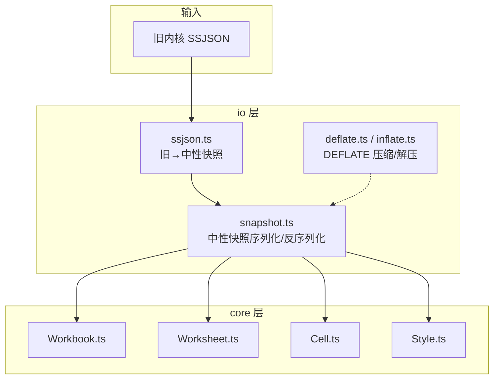
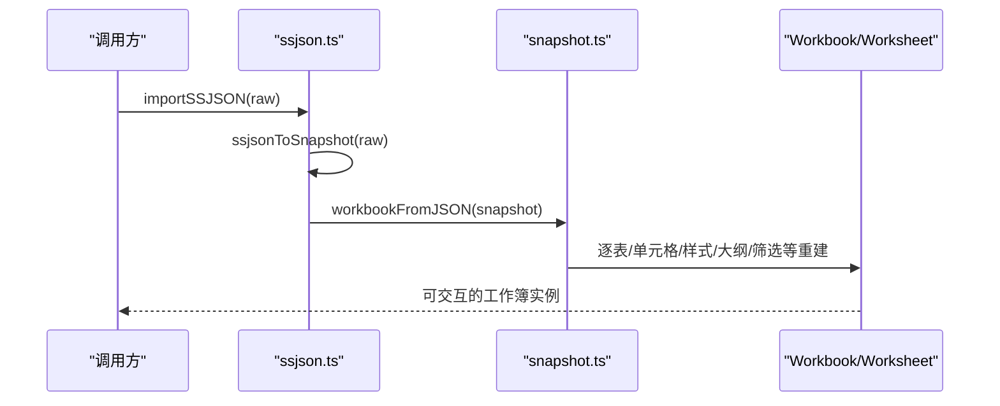
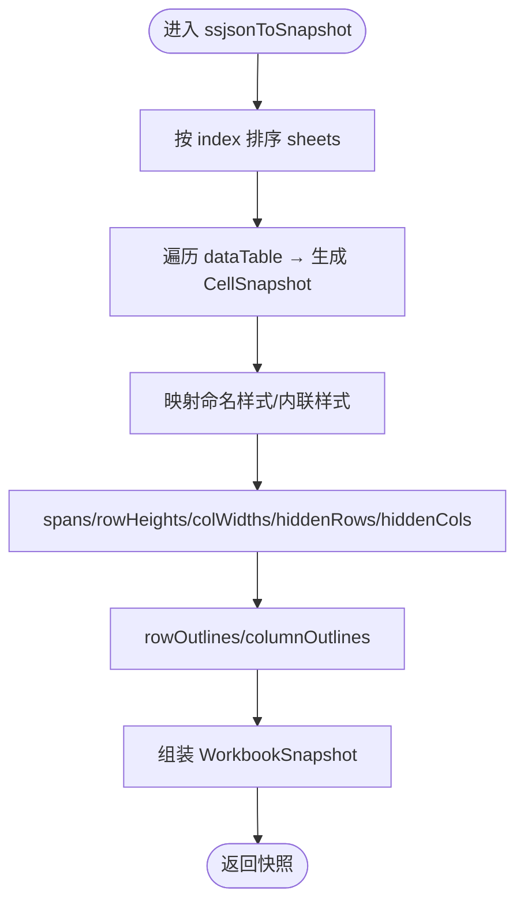
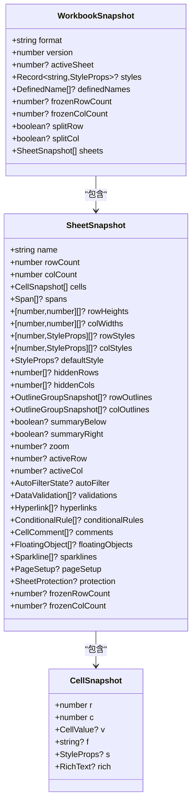
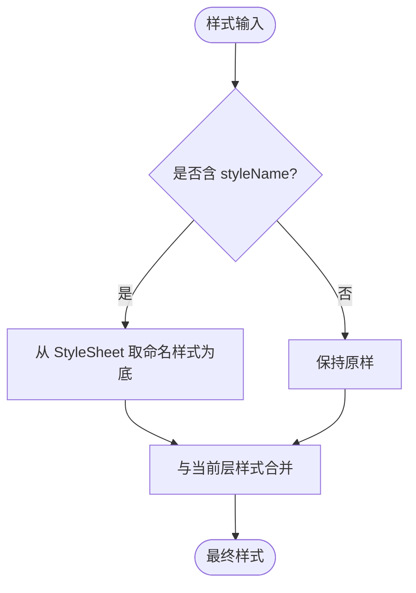
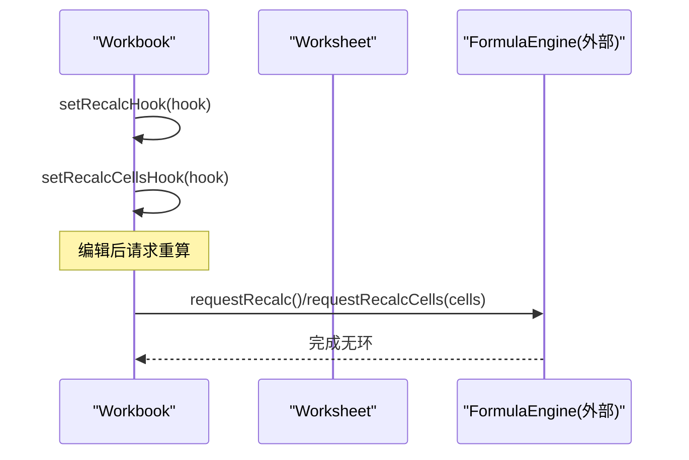
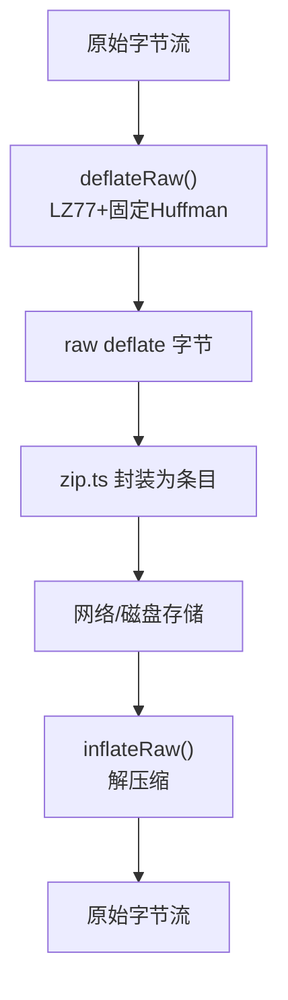
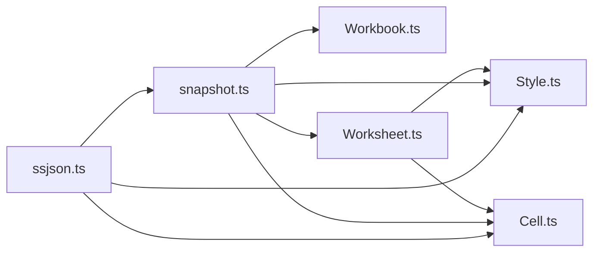

# SSJSON 序列化处理

<cite>
**本文引用的文件**
- [ssjson.ts](file://cmx-mega-sheet/src/io/ssjson.ts)
- [snapshot.ts](file://cmx-mega-sheet/src/io/snapshot.ts)
- [Cell.ts](file://cmx-mega-sheet/src/core/Cell.ts)
- [Style.ts](file://cmx-mega-sheet/src/core/Style.ts)
- [Workbook.ts](file://cmx-mega-sheet/src/core/Workbook.ts)
- [Worksheet.ts](file://cmx-mega-sheet/src/core/Worksheet.ts)
- [deflate.ts](file://cmx-mega-sheet/src/io/deflate.ts)
- [inflate.ts](file://cmx-mega-sheet/src/io/inflate.ts)
- [ssjson.test.ts](file://cmx-mega-sheet/test/ssjson.test.ts)
</cite>

## 目录
1. [简介](#简介)
2. [项目结构](#项目结构)
3. [核心组件](#核心组件)
4. [架构总览](#架构总览)
5. [详细组件分析](#详细组件分析)
6. [依赖关系分析](#依赖关系分析)
7. [性能考虑](#性能考虑)
8. [故障排查指南](#故障排查指南)
9. [结论](#结论)
10. [附录](#附录)

## 简介
本技术文档围绕 cmx-mega-sheet 中的 SSJSON（Spreadsheet JSON）序列化与反序列化能力，系统说明数据结构设计、字段映射规则、数据类型转换、版本兼容性与互操作要点。重点覆盖：
- 工作簿、工作表、单元格、样式等核心对象的 JSON 表示
- 旧内核 SSJSON 到中性快照的迁移读路径
- 数据压缩（DEFLATE）、增量重算钩子、差异稳定排序
- API 接口说明、使用示例与集成建议
- 与其他格式（如 XLSX）互操作的注意事项

## 项目结构
SSJSON 相关实现集中在 io 层与 core 层：
- io/ssjson.ts：旧内核 SSJSON → 中性快照的迁移读（只读），并暴露便捷导入入口
- io/snapshot.ts：中性快照格式定义、序列化/反序列化、工作簿级命名样式与命名区域
- core/Cell.ts：单元格值类型、富文本、公式归一化与清洗
- core/Style.ts：样式属性、命名样式表、级联解析
- core/Workbook.ts / Worksheet.ts：工作簿与工作表对象模型（用于从快照重建）
- io/deflate.ts / io/inflate.ts：零依赖 DEFLATE 编解码，支撑 ZIP/XLSX 体积优化

图表来源
- [ssjson.ts:1-256](file://cmx-mega-sheet/src/io/ssjson.ts#L1-L256)
- [snapshot.ts:1-319](file://cmx-mega-sheet/src/io/snapshot.ts#L1-L319)
- [Workbook.ts:174-396](file://cmx-mega-sheet/src/core/Workbook.ts#L174-L396)
- [Worksheet.ts:435-1274](file://cmx-mega-sheet/src/core/Worksheet.ts#L435-L1274)
- [Cell.ts:1-74](file://cmx-mega-sheet/src/core/Cell.ts#L1-L74)
- [Style.ts:1-234](file://cmx-mega-sheet/src/core/Style.ts#L1-L234)
- [deflate.ts:1-153](file://cmx-mega-sheet/src/io/deflate.ts#L1-L153)
- [inflate.ts:1-201](file://cmx-mega-sheet/src/io/inflate.ts#L1-L201)

章节来源
- [ssjson.ts:1-256](file://cmx-mega-sheet/src/io/ssjson.ts#L1-L256)
- [snapshot.ts:1-319](file://cmx-mega-sheet/src/io/snapshot.ts#L1-L319)

## 核心组件
- 旧内核 SSJSON 迁移器（ssjson.ts）
  - 将旧内核 workbook.toJSON() 的结构映射为中性快照，再经 workbookFromJSON 重建工作簿
  - 仅做“读”，写回一律走中性快照（新格式）
  - 覆盖常用子集：单元格值/公式/样式、合并、行高列宽、命名样式、大纲
- 中性快照（snapshot.ts）
  - 定义 WorkbookSnapshot / SheetSnapshot / CellSnapshot 等结构
  - 提供 sheetToJSON / sheetFromJSON / workbookToJSON / workbookFromJSON 等无损往返方法
  - 支持命名样式表、命名区域、冻结窗格、筛选、验证、超链接、条件格式、批注、浮动对象、迷你图、页面设置、保护等
- 单元格与样式（Cell.ts / Style.ts）
  - 统一值类型、公式归一化与清洗（去除 Excel 伪前缀）
  - 样式属性语义化、命名样式展开与级联解析
- 工作簿/工作表（Workbook.ts / Worksheet.ts）
  - 提供工作表集合、活动表、行列数、单元格读写、合并、可见性、大纲、筛选、验证、超链接、条件格式、批注、浮动对象、迷你图、页面设置、保护等能力
- 压缩（deflate.ts / inflate.ts）
  - 零依赖 DEFLATE 编解码，供 ZIP/XLSX 使用，减小传输体积

章节来源
- [ssjson.ts:1-256](file://cmx-mega-sheet/src/io/ssjson.ts#L1-L256)
- [snapshot.ts:1-319](file://cmx-mega-sheet/src/io/snapshot.ts#L1-L319)
- [Cell.ts:1-74](file://cmx-mega-sheet/src/core/Cell.ts#L1-L74)
- [Style.ts:1-234](file://cmx-mega-sheet/src/core/Style.ts#L1-L234)
- [Workbook.ts:174-396](file://cmx-mega-sheet/src/core/Workbook.ts#L174-L396)
- [Worksheet.ts:435-1274](file://cmx-mega-sheet/src/core/Worksheet.ts#L435-L1274)
- [deflate.ts:1-153](file://cmx-mega-sheet/src/io/deflate.ts#L1-L153)
- [inflate.ts:1-201](file://cmx-mega-sheet/src/io/inflate.ts#L1-L201)

## 架构总览
SSJSON 读取流程：旧内核 SSJSON → 迁移映射 → 中性快照 → 工作簿重建；写入流程：工作簿 → 中性快照 → 可选压缩（ZIP/XLSX）。

图表来源
- [ssjson.ts:220-256](file://cmx-mega-sheet/src/io/ssjson.ts#L220-L256)
- [snapshot.ts:271-304](file://cmx-mega-sheet/src/io/snapshot.ts#L271-L304)
- [Workbook.ts:174-396](file://cmx-mega-sheet/src/core/Workbook.ts#L174-L396)
- [Worksheet.ts:435-1274](file://cmx-mega-sheet/src/core/Worksheet.ts#L435-L1274)

## 详细组件分析

### 旧内核 SSJSON 迁移器（ssjson.ts）
- 目标：将旧内核 SSJSON 对象映射为中性快照，再重建工作簿
- 关键映射
  - 对齐枚举：hAlign/vAlign 数字 → 字符串；borderXxx.style 数字 → BorderLineStyle
  - 字体简写串 → 语义键（bold/italic/fontSize/fontFamily），pt→px 近似换算
  - style 为字符串时视为命名样式引用
  - 公式清洗：去除 '='、'@'、'_xlfn.'/_xlws.' 等伪前缀
  - 大纲：end→count 转换，collapsed 保留
  - 行列：默认值不写，非默认行高/列宽、隐藏行列记录
- 输出：WorkbookSnapshot（含 sheets、styles、activeSheet 等）

图表来源
- [ssjson.ts:153-249](file://cmx-mega-sheet/src/io/ssjson.ts#L153-L249)

章节来源
- [ssjson.ts:23-84](file://cmx-mega-sheet/src/io/ssjson.ts#L23-L84)
- [ssjson.ts:86-151](file://cmx-mega-sheet/src/io/ssjson.ts#L86-L151)
- [ssjson.ts:153-249](file://cmx-mega-sheet/src/io/ssjson.ts#L153-L249)
- [Cell.ts:50-73](file://cmx-mega-sheet/src/core/Cell.ts#L50-L73)

### 中性快照（snapshot.ts）
- 数据结构
  - WorkbookSnapshot：format/version、activeSheet、styles、definedNames、frozen/trailing、sheets
  - SheetSnapshot：name、rowCount/colCount、cells、spans、行列宽高/样式、默认样式、隐藏行列、大纲、summaryBelow/Right、zoom、activeRow/Col、autoFilter、validations、hyperlinks、conditionalRules、comments、floatingObjects、sparklines、pageSetup、protection、frozenRowCount/ColCount
  - CellSnapshot：r/c、v/f/s/rich
- 序列化策略
  - 稀疏存储：仅记录非默认值
  - 单元格排序：按 r,c 升序，保证稳定 diff
  - 命名样式：在 workbook 层集中管理，逐表复用
- 反序列化策略
  - 先建工作簿与命名样式表，再逐表重建
  - 顺序：行列尺寸/样式 → 单元格（值/公式/样式/富文本）→ 合并 → 大纲 → 隐藏 → 筛选/验证/超链接/条件格式/批注/浮动对象/迷你图/页面设置/保护
  - 兜底：空快照创建一张空白表

图表来源
- [snapshot.ts:18-109](file://cmx-mega-sheet/src/io/snapshot.ts#L18-L109)
- [snapshot.ts:111-188](file://cmx-mega-sheet/src/io/snapshot.ts#L111-L188)
- [snapshot.ts:200-269](file://cmx-mega-sheet/src/io/snapshot.ts#L200-L269)

章节来源
- [snapshot.ts:18-109](file://cmx-mega-sheet/src/io/snapshot.ts#L18-L109)
- [snapshot.ts:111-188](file://cmx-mega-sheet/src/io/snapshot.ts#L111-L188)
- [snapshot.ts:200-269](file://cmx-mega-sheet/src/io/snapshot.ts#L200-L269)
- [snapshot.ts:271-319](file://cmx-mega-sheet/src/io/snapshot.ts#L271-L319)

### 单元格与样式（Cell.ts / Style.ts）
- 单元格
  - 值类型：string | number | boolean | null
  - 公式：不含前导 '='，导入时清洗 Excel 伪前缀
  - 富文本：runs 数组，value 同步纯文本兜底
- 样式
  - 属性：字体、对齐、颜色、边框、格式化、换行、命名样式引用、M18/M20 扩展
  - 命名样式表：StyleSheet，支持 define/get/toJSON/fromJSON
  - 级联解析：单元格 > 行 > 列 > 工作表默认，styleName 先展开再叠加

图表来源
- [Style.ts:162-216](file://cmx-mega-sheet/src/core/Style.ts#L162-L216)
- [Style.ts:218-234](file://cmx-mega-sheet/src/core/Style.ts#L218-L234)
- [Cell.ts:14-74](file://cmx-mega-sheet/src/core/Cell.ts#L14-L74)

章节来源
- [Cell.ts:14-74](file://cmx-mega-sheet/src/core/Cell.ts#L14-L74)
- [Style.ts:12-100](file://cmx-mega-sheet/src/core/Style.ts#L12-L100)
- [Style.ts:123-234](file://cmx-mega-sheet/src/core/Style.ts#L123-L234)

### 工作簿/工作表（Workbook.ts / Worksheet.ts）
- 工作簿
  - 维护 sheets、活动表、命令/撤销、事件、命名区域、重算钩子（全量/增量）
- 工作表
  - 单元格存取、合并、行列宽高/样式、可见性、大纲、筛选、验证、超链接、条件格式、批注、浮动对象、迷你图、页面设置、保护
  - 大纲折叠与手动隐藏分账，避免互相覆盖

图表来源
- [Workbook.ts:231-261](file://cmx-mega-sheet/src/core/Workbook.ts#L231-L261)
- [Workbook.ts:174-396](file://cmx-mega-sheet/src/core/Workbook.ts#L174-L396)

章节来源
- [Workbook.ts:174-396](file://cmx-mega-sheet/src/core/Workbook.ts#L174-L396)
- [Worksheet.ts:435-1274](file://cmx-mega-sheet/src/core/Worksheet.ts#L435-L1274)

### 数据压缩（DEFLATE）
- deflate.ts：实现 LZ77 + 固定 Huffman 编码，输出 raw deflate 字节，适合 ZIP/XLSX 场景
- inflate.ts：支持 stored/固定/动态 Huffman 三种块，还原原始数据
- 用途：降低 XLSX/ZIP 体积，提升网络传输效率

图表来源
- [deflate.ts:1-153](file://cmx-mega-sheet/src/io/deflate.ts#L1-L153)
- [inflate.ts:1-201](file://cmx-mega-sheet/src/io/inflate.ts#L1-L201)

章节来源
- [deflate.ts:1-153](file://cmx-mega-sheet/src/io/deflate.ts#L1-L153)
- [inflate.ts:1-201](file://cmx-mega-sheet/src/io/inflate.ts#L1-L201)

## 依赖关系分析
- ssjson.ts 依赖 snapshot.ts（构建/重建快照）、core/Cell.ts（公式清洗）、core/Style.ts（样式映射）
- snapshot.ts 依赖 core/Workbook.ts / Worksheet.ts（重建对象）、core/Style.ts（命名样式）、core/Cell.ts（值/富文本）
- Worksheet.ts 依赖 core/Style.ts（样式级联）、core/Cell.ts（值/公式）
- 压缩模块独立于 IO 层，通过 zip/xlsx 间接使用

图表来源
- [ssjson.ts:1-256](file://cmx-mega-sheet/src/io/ssjson.ts#L1-L256)
- [snapshot.ts:1-319](file://cmx-mega-sheet/src/io/snapshot.ts#L1-L319)
- [Workbook.ts:174-396](file://cmx-mega-sheet/src/core/Workbook.ts#L174-L396)
- [Worksheet.ts:435-1274](file://cmx-mega-sheet/src/core/Worksheet.ts#L435-L1274)
- [Cell.ts:1-74](file://cmx-mega-sheet/src/core/Cell.ts#L1-L74)
- [Style.ts:1-234](file://cmx-mega-sheet/src/core/Style.ts#L1-L234)

章节来源
- [ssjson.ts:1-256](file://cmx-mega-sheet/src/io/ssjson.ts#L1-L256)
- [snapshot.ts:1-319](file://cmx-mega-sheet/src/io/snapshot.ts#L1-L319)

## 性能考虑
- 稀疏存储：仅序列化非默认值，减少 JSON 体积
- 稳定排序：单元格按行列升序，利于 diff 与增量更新
- 增量重算：Workbook 暴露 requestRecalcCells 钩子，仅重算受影响闭包，避免全量重算
- 压缩：DEFLATE 对重复 XML/文本有良好压缩率，适合 XLSX/ZIP 传输
- 样式级联：按需展开命名样式，避免冗余

章节来源
- [snapshot.ts:111-188](file://cmx-mega-sheet/src/io/snapshot.ts#L111-L188)
- [Workbook.ts:231-261](file://cmx-mega-sheet/src/core/Workbook.ts#L231-L261)
- [deflate.ts:1-153](file://cmx-mega-sheet/src/io/deflate.ts#L1-L153)

## 故障排查指南
- 非中性快照格式报错：parseWorkbook 会校验 format 字段，非预期格式抛出错误
  - 处理：上层捕获异常后决定是否走 SSJSON 迁移路径
- 公式导入异常：若未清洗 Excel 伪前缀，可能导致 #NAME?
  - 处理：确保使用 sanitizeImportedFormula 进行清洗
- 样式缺失或错位：检查命名样式是否正确定义与展开
  - 处理：确认 StyleSheet 已装载，且 resolveStyle 层级正确
- 大纲/筛选/隐藏冲突：大纲折叠与手动隐藏分账，注意 applyOutlineVisibility 调用时机
  - 处理：在恢复快照后调用应用可见性逻辑

章节来源
- [snapshot.ts:311-319](file://cmx-mega-sheet/src/io/snapshot.ts#L311-L319)
- [Cell.ts:50-73](file://cmx-mega-sheet/src/core/Cell.ts#L50-L73)
- [Style.ts:218-234](file://cmx-mega-sheet/src/core/Style.ts#L218-L234)
- [Worksheet.ts:775-815](file://cmx-mega-sheet/src/core/Worksheet.ts#L775-L815)

## 结论
SSJSON 在本项目中作为“旧内核 → 中性快照”的迁移读通道，配合中性快照的无损往返能力，实现了跨版本、跨格式的稳健数据持久化与互操作。通过稀疏存储、稳定排序、增量重算与 DEFLATE 压缩，兼顾了可读性、可扩展性与性能。上层只需关注中性快照与 API 即可，屏蔽了底层差异。

## 附录

### API 接口说明
- 导入
  - importSSJSON(raw): 接受对象或 JSON 字符串，返回可交互的 Workbook
  - parseWorkbook(json): 解析中性快照 JSON 字符串为 Workbook（非本格式抛错）
- 导出
  - workbookToJSON(wb): 工作簿 → 中性快照对象
  - stringifyWorkbook(wb, pretty?): 工作簿 → JSON 字符串
- 辅助
  - ssjsonToSnapshot(raw): 旧内核 SSJSON → 中性快照（内部迁移用）

章节来源
- [ssjson.ts:220-256](file://cmx-mega-sheet/src/io/ssjson.ts#L220-L256)
- [snapshot.ts:271-319](file://cmx-mega-sheet/src/io/snapshot.ts#L271-L319)

### 使用示例
- 从旧内核 SSJSON 导入并验证
  - 参考测试用例：断言工作表数量、活动表、单元格值、公式、合并、大纲折叠、隐藏行等
- 从 JSON 字符串导入
  - 支持直接传入 JSON 字符串，内部自动解析

章节来源
- [ssjson.test.ts:1-157](file://cmx-mega-sheet/test/ssjson.test.ts#L1-L157)

### 与其他格式互操作注意事项
- 与 XLSX
  - 使用 DEFLATE 压缩条目，导入/导出需兼容 stored/固定/动态 Huffman
  - 公式中可能携带 Excel 伪前缀，需在导入时清洗
- 与 CSV/PDF/HTML
  - 通过渲染/导出模块消费中性快照或 Worksheet，无需改动核心模型
- 与后端存储
  - doc_format 标记为 "cmx-megasheet"，doc_content 以 OPAQUE bytea 存储，便于未来迁移

章节来源
- [snapshot.ts:1-21](file://cmx-mega-sheet/src/io/snapshot.ts#L1-L21)
- [deflate.ts:1-153](file://cmx-mega-sheet/src/io/deflate.ts#L1-L153)
- [inflate.ts:1-201](file://cmx-mega-sheet/src/io/inflate.ts#L1-L201)
- [Cell.ts:50-73](file://cmx-mega-sheet/src/core/Cell.ts#L50-L73)