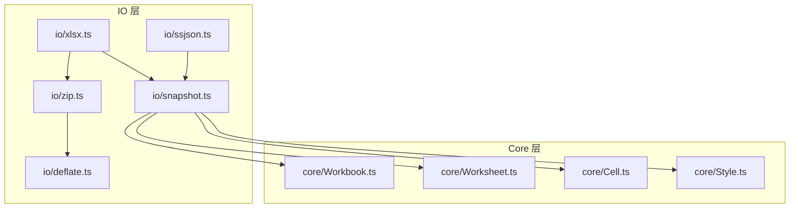
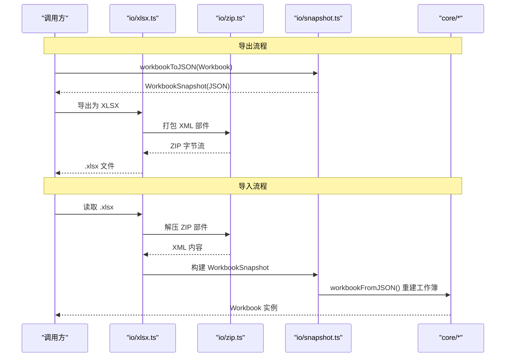
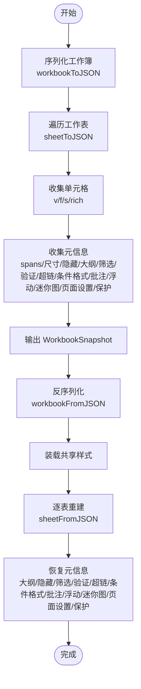
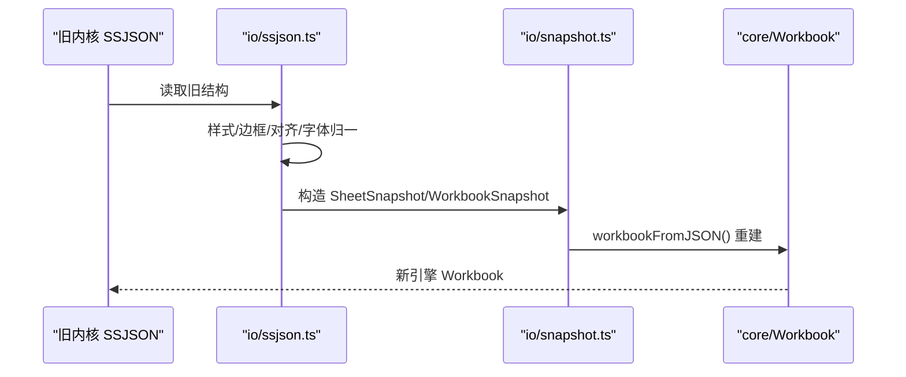
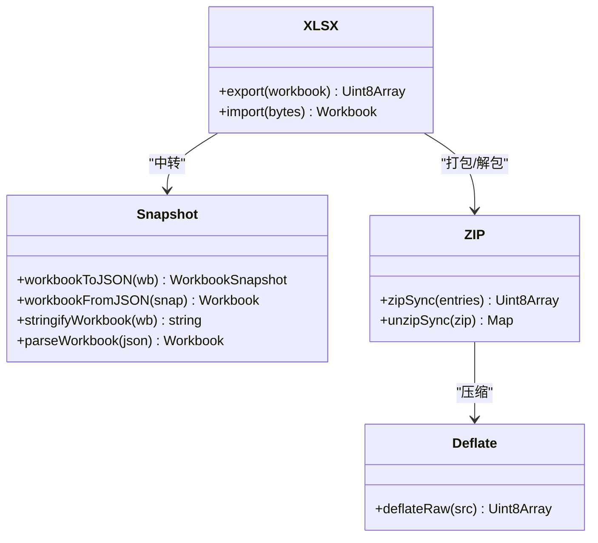
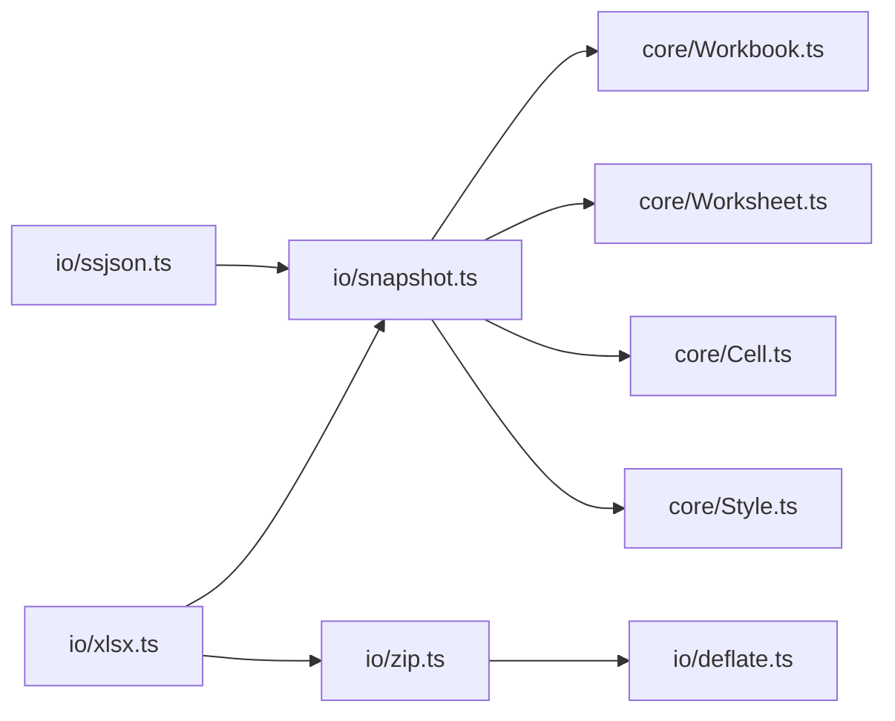

# 快照工作流程

<cite>
**本文引用的文件**
- [snapshot.ts](file://cmx-mega-sheet/src/io/snapshot.ts)
- [ssjson.ts](file://cmx-mega-sheet/src/io/ssjson.ts)
- [xlsx.ts](file://cmx-mega-sheet/src/io/xlsx.ts)
- [zip.ts](file://cmx-mega-sheet/src/io/zip.ts)
- [deflate.ts](file://cmx-mega-sheet/src/io/deflate.ts)
- [Workbook.ts](file://cmx-mega-sheet/src/core/Workbook.ts)
- [Worksheet.ts](file://cmx-mega-sheet/src/core/Worksheet.ts)
- [Cell.ts](file://cmx-mega-sheet/src/core/Cell.ts)
- [Style.ts](file://cmx-mega-sheet/src/core/Style.ts)
- [snapshot.test.ts](file://cmx-mega-sheet/test/snapshot.test.ts)
- [ssjson.test.ts](file://cmx-mega-sheet/test/ssjson.test.ts)
- [zip.test.ts](file://cmx-mega-sheet/test/zip.test.ts)
</cite>

## 目录
1. [简介](#简介)
2. [项目结构](#项目结构)
3. [核心组件](#核心组件)
4. [架构总览](#架构总览)
5. [详细组件分析](#详细组件分析)
6. [依赖关系分析](#依赖关系分析)
7. [性能考量](#性能考量)
8. [故障排查指南](#故障排查指南)
9. [结论](#结论)
10. [附录](#附录)

## 简介
本技术文档围绕工作簿快照的创建、序列化与反序列化机制展开，重点说明中性快照格式在导入导出流程中的“中介”作用：将不同外部格式（如 XLSX、旧内核 SSJSON）统一为内部中性 JSON 快照，再由中性快照重建内存工作簿。文档覆盖数据完整性校验、版本兼容策略、增量更新思路、压缩与缓存、并发访问控制、错误恢复方案，并提供快照 API 使用要点、性能监控与调试建议。

## 项目结构
快照相关代码集中在 cmx-mega-sheet 模块的 io 层与 core 层：
- io/snapshot.ts：定义中性快照数据结构与 workbookToJSON/workbookFromJSON/stringifyWorkbook/parseWorkbook 等接口。
- io/ssjson.ts：旧内核 SSJSON 迁移读，映射到中性快照后交由 workbookFromJSON 重建。
- io/xlsx.ts：基于 zip.ts 实现 XLSX 导入/导出，通过中性快照中转。
- io/zip.ts / io/deflate.ts：自包含 ZIP 读写与 DEFLATE 压缩，支撑 XLSX 包。
- core/Workbook.ts / Worksheet.ts / Cell.ts / Style.ts：工作簿/工作表/单元格/样式模型，被快照序列化/反序列化直接消费或产出。

图表来源
- [snapshot.ts:1-319](file://cmx-mega-sheet/src/io/snapshot.ts#L1-L319)
- [ssjson.ts:1-200](file://cmx-mega-sheet/src/io/ssjson.ts#L1-L200)
- [xlsx.ts:1-200](file://cmx-mega-sheet/src/io/xlsx.ts#L1-L200)
- [zip.ts:1-194](file://cmx-mega-sheet/src/io/zip.ts#L1-L194)
- [deflate.ts:1-153](file://cmx-mega-sheet/src/io/deflate.ts#L1-L153)
- [Workbook.ts:1-200](file://cmx-mega-sheet/src/core/Workbook.ts#L1-L200)

章节来源
- [snapshot.ts:1-319](file://cmx-mega-sheet/src/io/snapshot.ts#L1-L319)
- [xlsx.ts:1-200](file://cmx-mega-sheet/src/io/xlsx.ts#L1-L200)
- [ssjson.ts:1-200](file://cmx-mega-sheet/src/io/ssjson.ts#L1-L200)
- [zip.ts:1-194](file://cmx-mega-sheet/src/io/zip.ts#L1-L194)
- [deflate.ts:1-153](file://cmx-mega-sheet/src/io/deflate.ts#L1-L153)
- [Workbook.ts:1-200](file://cmx-mega-sheet/src/core/Workbook.ts#L1-L200)

## 核心组件
- 中性快照格式
  - 标签与版本：format=cmx-megasheet，version 用于破坏性变更时的迁移。
  - 结构：WorkbookSnapshot → SheetSnapshot → CellSnapshot；支持命名样式、命名区域、冻结窗格、大纲分组、自动筛选、数据验证、超链接、条件格式、批注、浮动对象、迷你图、页面设置与工作表保护等。
  - 稀疏序列化：仅记录非默认值，减少体积并便于 diff。
- 序列化/反序列化
  - workbookToJSON：遍历工作簿与工作表，输出中性快照。
  - workbookFromJSON：先装载共享样式，再逐表重建，空快照兜底生成一张空表。
  - stringifyWorkbook/parseWorkbook：便捷字符串化与解析，parseWorkbook 对非本格式进行严格校验。
- 旧格式迁移
  - ssjson.ts 将旧内核 SSJSON 映射为中性快照，供 workbookFromJSON 重建。
- XLSX 导入导出
  - xlsx.ts 通过 zip.ts 读取/写入 OOXML 包，并以中性快照作为中间表示，确保多格式统一。
- 压缩与容器
  - zip.ts 提供最小 ZIP 读写（STORE + DEFLATE），deflate.ts 提供零依赖 DEFLATE 压缩。

章节来源
- [snapshot.ts:18-319](file://cmx-mega-sheet/src/io/snapshot.ts#L18-L319)
- [ssjson.ts:1-200](file://cmx-mega-sheet/src/io/ssjson.ts#L1-L200)
- [xlsx.ts:1-200](file://cmx-mega-sheet/src/io/xlsx.ts#L1-L200)
- [zip.ts:1-194](file://cmx-mega-sheet/src/io/zip.ts#L1-L194)
- [deflate.ts:1-153](file://cmx-mega-sheet/src/io/deflate.ts#L1-L153)

## 架构总览
快照在导入导出中充当“中立桥”，屏蔽外部格式差异，保证数据一致性与可演进性。

图表来源
- [xlsx.ts:1-200](file://cmx-mega-sheet/src/io/xlsx.ts#L1-L200)
- [zip.ts:1-194](file://cmx-mega-sheet/src/io/zip.ts#L1-L194)
- [snapshot.ts:271-319](file://cmx-mega-sheet/src/io/snapshot.ts#L271-L319)

章节来源
- [xlsx.ts:1-200](file://cmx-mega-sheet/src/io/xlsx.ts#L1-L200)
- [snapshot.ts:271-319](file://cmx-mega-sheet/src/io/snapshot.ts#L271-L319)

## 详细组件分析

### 快照数据结构与往返语义
- 设计原则
  - 中性：不含视图色、不持久化几何派生态（如大纲 level）。
  - 稀疏：只写非默认值。
  - 无损往返：workbookToJSON → workbookFromJSON 可还原全部持久状态。
- 关键字段
  - 工作簿级：format/version、activeSheet、styles、definedNames、frozen/trailing 视口态透传。
  - 工作表级：行列尺寸、合并、隐藏、大纲、缩放、活动单元、自动筛选、数据验证、超链接、条件格式、批注、浮动对象、迷你图、页面设置、保护。
  - 单元格：坐标 r/c，可选 v/f/s/rich。
- 往返顺序
  - 序列化：按行/列升序稳定排序 cells，利于 diff。
  - 反序列化：先值/公式，再样式；大纲组先建组再套折叠态；手动隐藏与大纲派生隐藏分账处理。

图表来源
- [snapshot.ts:112-188](file://cmx-mega-sheet/src/io/snapshot.ts#L112-L188)
- [snapshot.ts:201-269](file://cmx-mega-sheet/src/io/snapshot.ts#L201-L269)
- [snapshot.ts:271-319](file://cmx-mega-sheet/src/io/snapshot.ts#L271-L319)

章节来源
- [snapshot.ts:23-109](file://cmx-mega-sheet/src/io/snapshot.ts#L23-L109)
- [snapshot.ts:112-188](file://cmx-mega-sheet/src/io/snapshot.ts#L112-L188)
- [snapshot.ts:201-269](file://cmx-mega-sheet/src/io/snapshot.ts#L201-L269)
- [snapshot.ts:271-319](file://cmx-mega-sheet/src/io/snapshot.ts#L271-L319)

### 旧格式迁移（SSJSON → 中性快照）
- 目标：将旧内核 workbook.toJSON() 的结构映射为中性快照，再经 workbookFromJSON 重建。
- 映射要点
  - 对齐 hAlign/vAlign/font/border/formatter 等枚举与简写。
  - 保留命名样式引用、合并、行列尺寸、大纲分组。
  - 导入时公式需清洗（sanitizeImportedFormula）。
- 限制：只做读迁移，不反向生成 SSJSON。

图表来源
- [ssjson.ts:1-200](file://cmx-mega-sheet/src/io/ssjson.ts#L1-L200)
- [snapshot.ts:286-304](file://cmx-mega-sheet/src/io/snapshot.ts#L286-L304)

章节来源
- [ssjson.ts:1-200](file://cmx-mega-sheet/src/io/ssjson.ts#L1-L200)
- [snapshot.ts:286-304](file://cmx-mega-sheet/src/io/snapshot.ts#L286-L304)

### XLSX 导入导出与中性快照中转
- 导出：workbookToJSON → OOXML → ZIP → .xlsx。
- 导入：.xlsx → unzip → 解析 XML → 构建 WorkbookSnapshot → workbookFromJSON → Workbook。
- 样式注册：去重 font/fill/border/numFmt，生成 cellXfs 索引，保证体积与一致性。
- 视口态：冻结/尾冻结/拆分模式在快照中透传，由元素层消费。

图表来源
- [xlsx.ts:1-200](file://cmx-mega-sheet/src/io/xlsx.ts#L1-L200)
- [snapshot.ts:271-319](file://cmx-mega-sheet/src/io/snapshot.ts#L271-L319)
- [zip.ts:1-194](file://cmx-mega-sheet/src/io/zip.ts#L1-L194)
- [deflate.ts:1-153](file://cmx-mega-sheet/src/io/deflate.ts#L1-L153)

章节来源
- [xlsx.ts:1-200](file://cmx-mega-sheet/src/io/xlsx.ts#L1-L200)
- [zip.ts:1-194](file://cmx-mega-sheet/src/io/zip.ts#L1-L194)
- [deflate.ts:1-153](file://cmx-mega-sheet/src/io/deflate.ts#L1-L153)

### 数据完整性检查与版本兼容性
- 格式校验：parseWorkbook 强制要求 format=cmx-megasheet，否则抛错，避免误用其他格式。
- 版本兼容：SNAPSHOT_VERSION 标记结构版本，fromJSON 可根据版本做迁移逻辑（当前为 v1）。
- 空快照兜底：workbookFromJSON 在无 sheet 时创建一张空表，保障下游 getActiveSheet 安全。
- 公式清洗：导入时 sanitizeImportedFormula 保证公式安全。

章节来源
- [snapshot.ts:18-21](file://cmx-mega-sheet/src/io/snapshot.ts#L18-L21)
- [snapshot.ts:311-318](file://cmx-mega-sheet/src/io/snapshot.ts#L311-L318)
- [snapshot.ts:286-304](file://cmx-mega-sheet/src/io/snapshot.ts#L286-L304)
- [ssjson.ts:167-168](file://cmx-mega-sheet/src/io/ssjson.ts#L167-L168)

### 增量更新策略（概念与落地建议）
- 现状：快照以整单形式序列化/反序列化，适合跨进程/存储传输。
- 建议策略
  - 基于稀疏 cells 的 diff：利用已排序 cells 列表计算新增/修改/删除，生成增量补丁。
  - 结合撤销栈：UndoManager 记录结构编辑元信息（axis/op/index/count/sheet），可用于定位变更范围。
  - 应用层合并：在加载快照后，按增量补丁对 Worksheet 执行 set* 操作，避免全量重建。
  - 冲突解决：后端保存采用乐观锁 CAS（参考业务文档中的 published_version 思想），前端在提交前携带期望版本，失败则回退并重载最新快照。

章节来源
- [Workbook.ts:35-51](file://cmx-mega-sheet/src/core/Workbook.ts#L35-L51)
- [Workbook.ts:53-123](file://cmx-mega-sheet/src/core/Workbook.ts#L53-L123)
- [snapshot.ts:112-124](file://cmx-mega-sheet/src/io/snapshot.ts#L112-L124)

### 压缩、缓存与并发控制
- 压缩
  - ZIP STORE：写路径默认不压缩，换取零实现成本与速度。
  - DEFLATE：读路径支持 DEFLATE 解压，兼容真实 XLSX。
  - 自定义 deflateRaw：零依赖实现，针对文本/XML 有良好压缩率。
- 缓存
  - 样式注册表：intern 去重 font/fill/border/numFmt，减少重复 XML。
  - 建议：对频繁使用的快照片段（如常用模板）可在上层做内存缓存，注意失效策略。
- 并发
  - 核心模型无内置并发锁；建议在调用侧串行化写操作或使用事务边界。
  - 事件与命令：EventEmitter/CommandManager 提供扩展点，可在上层加锁或队列化。

章节来源
- [zip.ts:1-194](file://cmx-mega-sheet/src/io/zip.ts#L1-L194)
- [deflate.ts:1-153](file://cmx-mega-sheet/src/io/deflate.ts#L1-L153)
- [xlsx.ts:88-126](file://cmx-mega-sheet/src/io/xlsx.ts#L88-L126)
- [Workbook.ts:174-184](file://cmx-mega-sheet/src/core/Workbook.ts#L174-L184)

### 错误恢复方案
- 解析失败：parseWorkbook 对非本格式抛出明确错误，上层可捕获并降级到 SSJSON 迁移路径。
- 空输入：workbookFromJSON 兜底生成可用工作簿，避免下游崩溃。
- 导入容错：ssjson.ts 尽力而为映射，缺失字段可跳过或赋予默认值。
- 建议：在 IO 层增加 try/catch 与重试/回滚策略，结合审计日志定位问题。

章节来源
- [snapshot.ts:311-318](file://cmx-mega-sheet/src/io/snapshot.ts#L311-L318)
- [snapshot.ts:286-304](file://cmx-mega-sheet/src/io/snapshot.ts#L286-L304)
- [ssjson.ts:1-200](file://cmx-mega-sheet/src/io/ssjson.ts#L1-L200)

### 快照 API 使用说明
- 创建工作簿快照
  - workbookToJSON(wb): 将内存工作簿序列化为中性快照对象。
  - stringifyWorkbook(wb, pretty?): 输出 JSON 字符串，pretty 控制缩进。
- 从快照重建工作簿
  - workbookFromJSON(snap): 根据快照重建 Workbook。
  - parseWorkbook(json): 解析 JSON 字符串并校验格式，返回 Workbook。
- 工作表级
  - sheetToJSON(ws)/sheetFromJSON(snap, styleSheet?): 单表序列化/反序列化。
- 注意事项
  - 共享样式：重建时需传入共享 StyleSheet，以保证命名样式一致。
  - 视口态：冻结/尾冻结/拆分模式在快照中透传，由 UI 层消费。
  - 公式：导入时会自动清洗，避免注入风险。

章节来源
- [snapshot.ts:112-188](file://cmx-mega-sheet/src/io/snapshot.ts#L112-L188)
- [snapshot.ts:201-269](file://cmx-mega-sheet/src/io/snapshot.ts#L201-L269)
- [snapshot.ts:271-319](file://cmx-mega-sheet/src/io/snapshot.ts#L271-L319)

### 性能监控与调试工具
- 单元测试
  - snapshot.test.ts：覆盖往返、稀疏、命名区域、冻结窗格、自动筛选等场景。
  - ssjson.test.ts：验证旧格式迁移到中性快照。
  - zip.test.ts：验证 CRC32、ZIP 读写、DEFLATE 互通。
- 建议指标
  - 序列化/反序列化耗时、快照大小、压缩比。
  - 导入导出吞吐（条/秒）、峰值内存。
- 调试技巧
  - 使用 stringifyWorkbook(wb, true) 输出可读 JSON 对比差异。
  - 在 xlsx.ts 中打印 styles.xml 片段，核对样式去重与映射。
  - 对导入公式使用 sanitizeImportedFormula 前后对比，确认清洗效果。

章节来源
- [snapshot.test.ts:1-197](file://cmx-mega-sheet/test/snapshot.test.ts#L1-L197)
- [ssjson.test.ts:1-40](file://cmx-mega-sheet/test/ssjson.test.ts#L1-L40)
- [zip.test.ts:1-91](file://cmx-mega-sheet/test/zip.test.ts#L1-L91)

## 依赖关系分析
- 模块耦合
  - xlsx.ts 依赖 snapshot.ts 与 zip.ts；snapshot.ts 依赖 core/*。
  - ssjson.ts 依赖 snapshot.ts 与 core/Cell 的公式清洗能力。
  - zip.ts 依赖 deflate.ts。
- 潜在循环
  - 当前依赖方向清晰，无循环依赖迹象。
- 外部依赖
  - 零依赖设计：zip/deflate 自实现，避免引入重型库。

图表来源
- [xlsx.ts:1-200](file://cmx-mega-sheet/src/io/xlsx.ts#L1-L200)
- [snapshot.ts:1-319](file://cmx-mega-sheet/src/io/snapshot.ts#L1-L319)
- [ssjson.ts:1-200](file://cmx-mega-sheet/src/io/ssjson.ts#L1-L200)
- [zip.ts:1-194](file://cmx-mega-sheet/src/io/zip.ts#L1-L194)
- [deflate.ts:1-153](file://cmx-mega-sheet/src/io/deflate.ts#L1-L153)

章节来源
- [xlsx.ts:1-200](file://cmx-mega-sheet/src/io/xlsx.ts#L1-L200)
- [snapshot.ts:1-319](file://cmx-mega-sheet/src/io/snapshot.ts#L1-L319)
- [ssjson.ts:1-200](file://cmx-mega-sheet/src/io/ssjson.ts#L1-L200)
- [zip.ts:1-194](file://cmx-mega-sheet/src/io/zip.ts#L1-L194)
- [deflate.ts:1-153](file://cmx-mega-sheet/src/io/deflate.ts#L1-L153)

## 性能考量
- 序列化优化
  - 稀疏输出：仅记录非默认值，显著降低体积。
  - 稳定排序：cells 按行列升序，便于 diff 与增量合并。
- 导入优化
  - 样式去重：intern 机制减少 styles.xml 体积。
  - 公式清洗：一次性清洗，避免后续重复计算。
- 压缩
  - 写路径 STORE：更快；读路径支持 DEFLATE：兼容性强。
- 建议
  - 大工作簿导出时启用 pretty=false 以减少体积。
  - 对高频模板进行内存缓存，注意失效与并发安全。

[本节为通用指导，无需具体文件来源]

## 故障排查指南
- 常见错误
  - 非本格式 JSON：parseWorkbook 抛出格式错误，应检查上游是否混入其他格式。
  - 空快照：workbookFromJSON 会创建空表，若下游报错，检查是否误传空快照。
  - 导入公式异常：确认 sanitizeImportedFormula 是否生效。
- 定位方法
  - 使用 stringifyWorkbook(wb, true) 输出可读快照，比对差异。
  - 在 xlsx.ts 中打印样式映射与 cellXfs，核对去重逻辑。
  - 借助单元测试用例复现问题（snapshot.test.ts、ssjson.test.ts、zip.test.ts）。

章节来源
- [snapshot.ts:311-318](file://cmx-mega-sheet/src/io/snapshot.ts#L311-L318)
- [snapshot.ts:286-304](file://cmx-mega-sheet/src/io/snapshot.ts#L286-L304)
- [ssjson.ts:167-168](file://cmx-mega-sheet/src/io/ssjson.ts#L167-L168)
- [snapshot.test.ts:131-146](file://cmx-mega-sheet/test/snapshot.test.ts#L131-L146)
- [ssjson.test.ts:1-40](file://cmx-mega-sheet/test/ssjson.test.ts#L1-L40)
- [zip.test.ts:1-91](file://cmx-mega-sheet/test/zip.test.ts#L1-L91)

## 结论
中性快照将多格式导入导出统一到一致的内存模型，具备稀疏、无损往返、强校验与可扩展特性。配合自实现 ZIP/DEFLATE 与样式去重，兼顾体积与性能。通过版本标签与迁移层，保证向后兼容。建议在应用层引入增量 diff、缓存与并发控制，进一步提升大规模报表场景下的效率与稳定性。

[本节为总结，无需具体文件来源]

## 附录
- 术语
  - 中性快照：不含视图色与几何派生态的持久化表示。
  - 稀疏序列化：仅记录非默认值。
  - 视口态：冻结/尾冻结/拆分等显示相关状态。
- 参考实现路径
  - 快照 API：见 snapshot.ts 导出函数。
  - 旧格式迁移：见 ssjson.ts 映射逻辑。
  - XLSX 中转：见 xlsx.ts 导入导出流程。
  - 压缩：见 zip.ts/deflate.ts。

[本节为补充说明，无需具体文件来源]