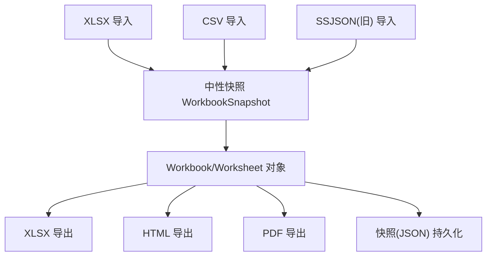
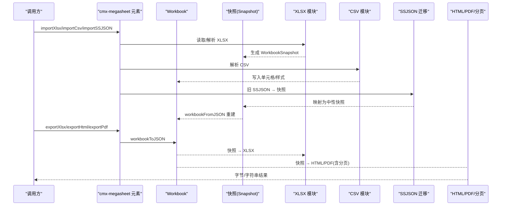
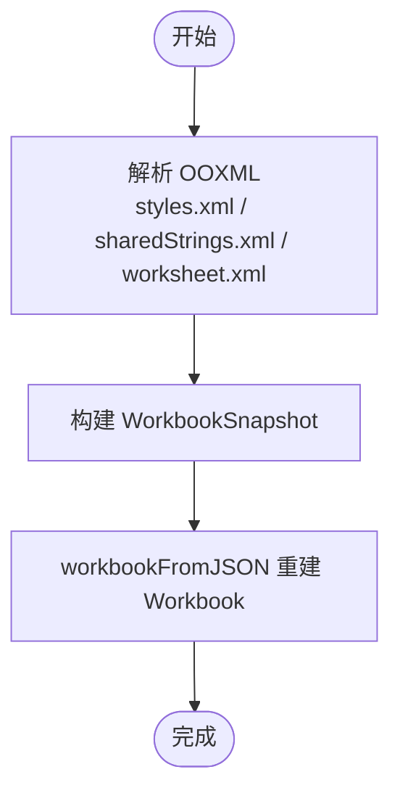
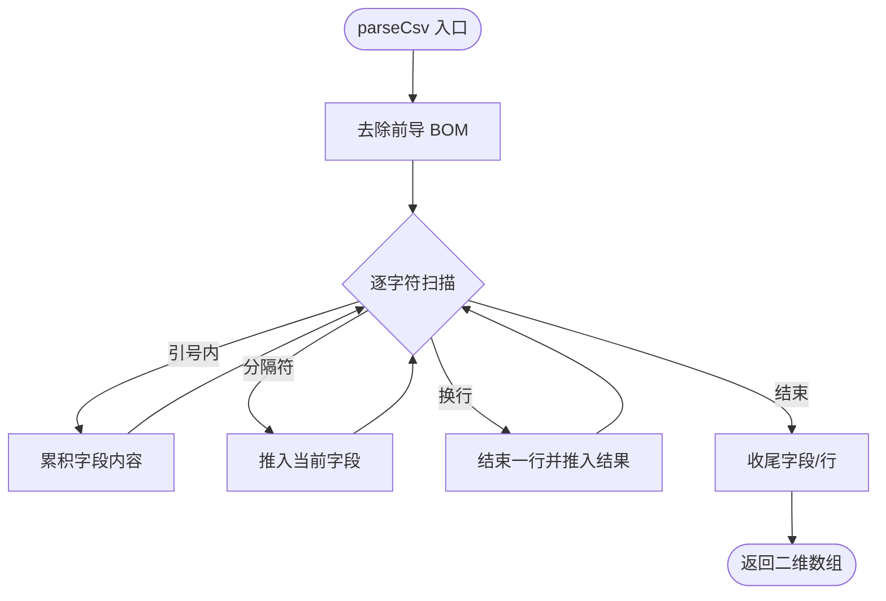
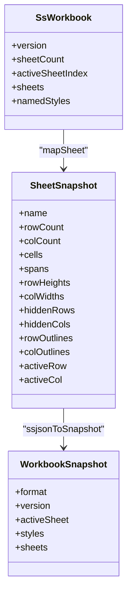
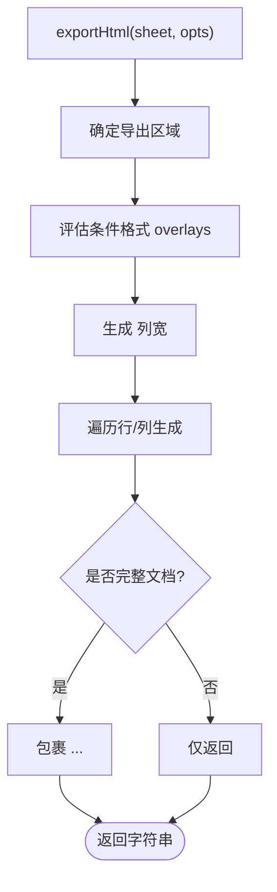
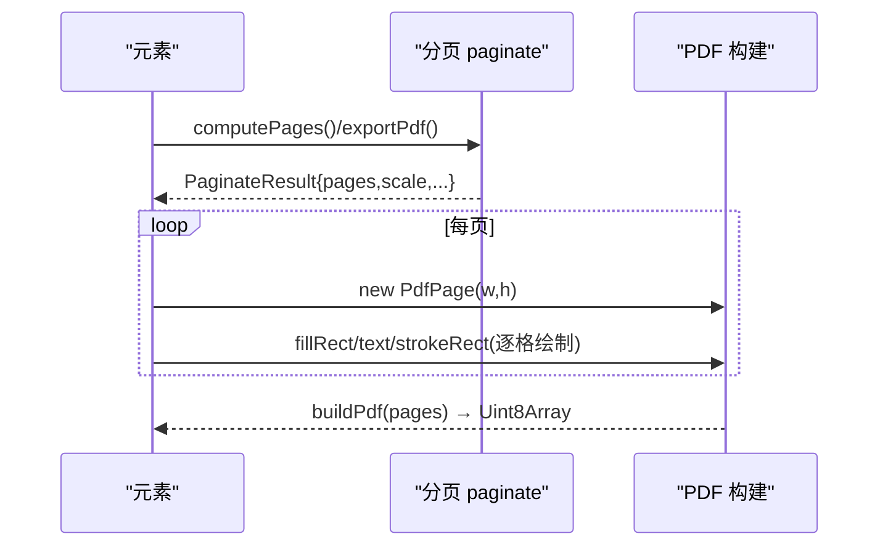
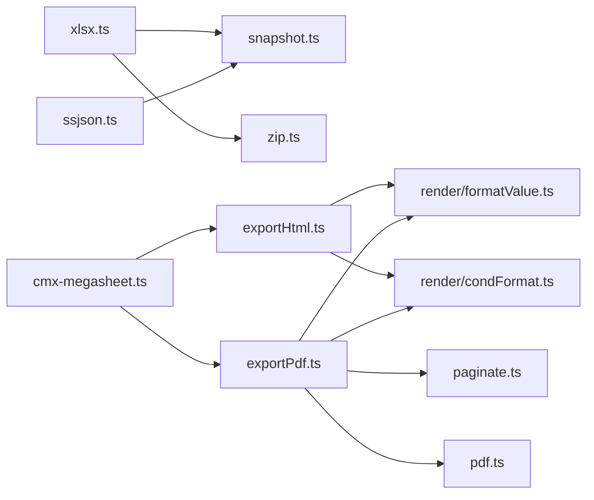

# 数据导入导出

<cite>
**本文引用的文件**
- [xlsx.ts](file://cmx-mega-sheet/src/io/xlsx.ts)
- [csv.ts](file://cmx-mega-sheet/src/io/csv.ts)
- [ssjson.ts](file://cmx-mega-sheet/src/io/ssjson.ts)
- [snapshot.ts](file://cmx-mega-sheet/src/io/snapshot.ts)
- [exportHtml.ts](file://cmx-mega-sheet/src/io/exportHtml.ts)
- [exportPdf.ts](file://cmx-mega-sheet/src/io/exportPdf.ts)
- [pdf.ts](file://cmx-mega-sheet/src/io/pdf.ts)
- [paginate.ts](file://cmx-mega-sheet/src/io/paginate.ts)
- [cmx-megasheet.ts](file://cmx-mega-sheet/src/element/cmx-megasheet.ts)
- [Csv.test.ts](file://cmx-mega-sheet/test/Csv.test.ts)
- [xlsx.test.ts](file://cmx-mega-sheet/test/xlsx.test.ts)
- [ssjson.test.ts](file://cmx-mega-sheet/test/ssjson.test.ts)
- [demo_actions.js](file://cmx-mega-sheet/demo/demo_actions.js)
</cite>

## 目录
1. [简介](#简介)
2. [项目结构](#项目结构)
3. [核心组件](#核心组件)
4. [架构总览](#架构总览)
5. [详细组件分析](#详细组件分析)
6. [依赖关系分析](#依赖关系分析)
7. [性能考量](#性能考量)
8. [故障排查指南](#故障排查指南)
9. [结论](#结论)
10. [附录](#附录)

## 简介
本技术文档围绕数据导入导出能力，系统说明 Excel(XLSX)读写、CSV 处理与编码、SSJSON 序列化/反序列化机制、HTML 导出、PDF 生成与分页、以及快照（Snapshot）格式。文档同时给出文件格式转换、批量处理与错误恢复的最佳实践，帮助在浏览器与 Node 环境下稳定实现大规模表格数据的导入导出。

## 项目结构
数据导入导出集中在 cmx-mega-sheet 的 io 层，配合 core 工作簿/工作表模型与 render 渲染能力，形成“中性快照”为枢纽的统一数据流：
- 输入侧：XLSX、CSV、旧内核 SSJSON → 中性快照 → 工作簿对象
- 输出侧：工作簿对象 → 中性快照 → XLSX/HTML/PDF/ZIP/DEFLATE 等
- 打印与导出：分页计算 + PDF 构建；HTML 直接拼接字符串

图表来源
- [xlsx.ts:1-12](file://cmx-mega-sheet/src/io/xlsx.ts#L1-L12)
- [snapshot.ts:1-10](file://cmx-mega-sheet/src/io/snapshot.ts#L1-L10)
- [exportHtml.ts:1-9](file://cmx-mega-sheet/src/io/exportHtml.ts#L1-L9)
- [exportPdf.ts:1-8](file://cmx-mega-sheet/src/io/exportPdf.ts#L1-L8)

章节来源
- [xlsx.ts:1-12](file://cmx-mega-sheet/src/io/xlsx.ts#L1-L12)
- [snapshot.ts:1-10](file://cmx-mega-sheet/src/io/snapshot.ts#L1-L10)

## 核心组件
- 中性快照（Snapshot）：统一的数据中间表示，支持稀疏存储、命名样式、冻结窗格、大纲分组、条件格式、超链接、迷你图、页面设置与工作表保护等。提供 workbookToJSON/workbookFromJSON 无损往返。
- XLSX 导入导出：基于 OOXML 子集的手写实现，覆盖值/公式/合并/行高列宽/隐藏/字体/对齐/数字格式/边框/多 sheet/活动 sheet/冻结/筛选/验证/页面设置/迷你图等。
- CSV 导入导出：RFC-4180 风格解析与序列化，支持分隔符可配、BOM、CRLF/CR/LF 兼容、引号转义。
- SSJSON 迁移读：将旧内核 workbook.toJSON() 映射到中性快照，仅读不写，保证向后兼容。
- HTML 导出：自包含 HTML 或 <table> 片段，保留字体/对齐/背景/边框/合并/条件格式底色。
- PDF 导出：零依赖手写最小 PDF，支持页眉页脚、重复标题行/列、网格线、条件格式底色、缩放与 fit-to-pages。
- 分页器：按纸张尺寸、边距、缩放、fitToPages 切分主体区域，返回每页行列区间与缩放系数。

章节来源
- [snapshot.ts:18-109](file://cmx-mega-sheet/src/io/snapshot.ts#L18-L109)
- [xlsx.ts:1-12](file://cmx-mega-sheet/src/io/xlsx.ts#L1-L12)
- [csv.ts:1-9](file://cmx-mega-sheet/src/io/csv.ts#L1-L9)
- [ssjson.ts:1-14](file://cmx-mega-sheet/src/io/ssjson.ts#L1-L14)
- [exportHtml.ts:1-9](file://cmx-mega-sheet/src/io/exportHtml.ts#L1-L9)
- [exportPdf.ts:1-8](file://cmx-mega-sheet/src/io/exportPdf.ts#L1-L8)
- [paginate.ts:1-8](file://cmx-mega-sheet/src/io/paginate.ts#L1-L8)

## 架构总览
下图展示从导入到导出的端到端流程，包括格式转换、样式与布局保留、分页与渲染。

图表来源
- [xlsx.ts:679-800](file://cmx-mega-sheet/src/io/xlsx.ts#L679-L800)
- [snapshot.ts:271-304](file://cmx-mega-sheet/src/io/snapshot.ts#L271-L304)
- [exportHtml.ts:27-53](file://cmx-mega-sheet/src/io/exportHtml.ts#L27-L53)
- [exportPdf.ts:18-108](file://cmx-mega-sheet/src/io/exportPdf.ts#L18-L108)
- [cmx-megasheet.ts:1623-1647](file://cmx-mega-sheet/src/element/cmx-megasheet.ts#L1623-L1647)

## 详细组件分析

### XLSX 导入导出
- 设计要点
  - 通过中性快照中转：import = OOXML → 快照 → workbookFromJSON；export = workbookToJSON → OOXML。
  - 样式子系统：StyleRegistry 去重 font/fill/border/numFmt，cellXfs 索引复用，减少体积。
  - 共享字符串表 SharedStrings 压缩重复文本。
  - 支持合并、行高列宽、隐藏行列、冻结窗格、自动筛选、数据验证、页面设置、迷你图、工作表保护、图表锚点等。
- 兼容性
  - 对齐 CMX 报表实际用到的 OOXML 子集，非任意 Excel 全量特性。
  - 颜色 ARGB 互转、对齐/边框枚举映射、图案填充映射、负旋转角度编码等。
- 数据转换
  - 公式带缓存值 v，导入时规范化前缀。
  - 数值/布尔/字符串类型区分写入。
  - 名称样式引用在导出时展平为具体样式键。

图表来源
- [xlsx.ts:88-236](file://cmx-mega-sheet/src/io/xlsx.ts#L88-L236)
- [xlsx.ts:238-261](file://cmx-mega-sheet/src/io/xlsx.ts#L238-L261)
- [xlsx.ts:290-396](file://cmx-mega-sheet/src/io/xlsx.ts#L290-L396)
- [xlsx.ts:507-539](file://cmx-mega-sheet/src/io/xlsx.ts#L507-L539)
- [snapshot.ts:286-304](file://cmx-mega-sheet/src/io/snapshot.ts#L286-L304)

章节来源
- [xlsx.ts:1-12](file://cmx-mega-sheet/src/io/xlsx.ts#L1-L12)
- [xlsx.ts:88-236](file://cmx-mega-sheet/src/io/xlsx.ts#L88-L236)
- [xlsx.ts:238-261](file://cmx-mega-sheet/src/io/xlsx.ts#L238-L261)
- [xlsx.ts:290-396](file://cmx-mega-sheet/src/io/xlsx.ts#L290-L396)
- [xlsx.ts:507-539](file://cmx-mega-sheet/src/io/xlsx.ts#L507-L539)
- [xlsx.ts:679-800](file://cmx-mega-sheet/src/io/xlsx.ts#L679-L800)
- [xlsx.test.ts:71-124](file://cmx-mega-sheet/test/xlsx.test.ts#L71-L124)

### CSV 处理与编码
- 解析与序列化
  - RFC-4180 风格：引号内可含分隔符/换行，双引号转义为 ""。
  - 支持自定义分隔符（逗号/分号/tab），EOL 可选 \n 或 \r\n。
  - 可选 UTF-8 BOM（Excel 中文兼容）。
  - 剥前导 BOM；\r\n 与 \n 均作换行；末尾换行不产生空行。
- 大数据优化建议
  - 使用 Range 限定区域序列化/解析，避免全表扫描。
  - 对超大 CSV 采用流式分块解析（上层实现），此处提供高效状态机 parseCsv。
- 行为校验
  - 测试覆盖基本分行分列、引号内含逗号/换行、双引号转义、CRLF/CR 跳过、BOM 剥离、分号分隔、空文本、末尾换行、布尔 TRUE/FALSE、空格→空字段、往返一致等。

图表来源
- [csv.ts:61-89](file://cmx-mega-sheet/src/io/csv.ts#L61-L89)

章节来源
- [csv.ts:1-90](file://cmx-mega-sheet/src/io/csv.ts#L1-L90)
- [Csv.test.ts:14-82](file://cmx-mega-sheet/test/Csv.test.ts#L14-L82)

### SSJSON 序列化与反序列化
- 定位与范围
  - 只做「读」：将旧内核 workbook.toJSON() 的结构映射到中性快照，再经 workbookFromJSON 重建。写回一律走新快照格式。
  - 覆盖常用子集：单元格值/公式/样式、合并、行高列宽、命名样式、大纲分组、活动单元格等。
- 映射策略
  - 旧枚举归一：hAlign/vAlign 数字 → 中性词；font 简写串 → bold/italic/fontSize(px)/fontFamily；borderXxx.style 数字 → BorderLineStyle；style 字符串 → styleName 引用。
  - 名称样式表映射为命名样式字典。
- 便捷接口
  - importSSJSON 接受对象或 JSON 字符串，内部先 ssjsonToSnapshot 再 workbookFromJSON。

图表来源
- [ssjson.ts:23-84](file://cmx-mega-sheet/src/io/ssjson.ts#L23-L84)
- [ssjson.ts:153-207](file://cmx-mega-sheet/src/io/ssjson.ts#L153-L207)
- [ssjson.ts:220-256](file://cmx-mega-sheet/src/io/ssjson.ts#L220-L256)
- [snapshot.ts:90-109](file://cmx-mega-sheet/src/io/snapshot.ts#L90-L109)

章节来源
- [ssjson.ts:1-256](file://cmx-mega-sheet/src/io/ssjson.ts#L1-L256)
- [ssjson.test.ts:1-156](file://cmx-mega-sheet/test/ssjson.test.ts#L1-L156)

### HTML 导出
- 功能要点
  - 生成完整 HTML 文档或仅 <table> 片段。
  - 保留字体/粗斜/下划线/对齐/背景/边框/合并；叠加条件格式底色。
  - 列宽通过 <colgroup> 精确控制；行高按像素设置。
- 使用方式
  - element.exportHtml(opts) 默认输出完整文档；也可传入 range/title/gridlines 等选项。

图表来源
- [exportHtml.ts:27-53](file://cmx-mega-sheet/src/io/exportHtml.ts#L27-L53)
- [exportHtml.ts:55-96](file://cmx-mega-sheet/src/io/exportHtml.ts#L55-L96)

章节来源
- [exportHtml.ts:1-96](file://cmx-mega-sheet/src/io/exportHtml.ts#L1-L96)
- [cmx-megasheet.ts:1623-1626](file://cmx-mega-sheet/src/element/cmx-megasheet.ts#L1623-L1626)

### PDF 生成与分页
- 分页计算
  - 依据纸张尺寸（A4/A3/Letter/Legal）、方向、边距、缩放或 fitToPages，将网格切分为若干页段，返回每页行列区间、缩放系数与可打印区尺寸。
  - 支持重复标题行/列（每页顶部/左侧固定显示）。
- PDF 构建
  - 零依赖手写最小 PDF：支持 Helvetica 文本、描边线、填充矩形、多页、页眉页脚宏展开（&P/&N/&D）。
  - 坐标系统：内部左上原点 y 向下，输出时翻转至 PDF 标准坐标系。
- 渲染流程
  - 每页绘制：背景（含条件格式底色）、网格线、文本（对齐/加粗/字号/颜色）、标题行/列、页眉页脚。

图表来源
- [paginate.ts:63-132](file://cmx-mega-sheet/src/io/paginate.ts#L63-L132)
- [exportPdf.ts:18-108](file://cmx-mega-sheet/src/io/exportPdf.ts#L18-L108)
- [pdf.ts:62-114](file://cmx-mega-sheet/src/io/pdf.ts#L62-L114)

章节来源
- [exportPdf.ts:1-131](file://cmx-mega-sheet/src/io/exportPdf.ts#L1-L131)
- [pdf.ts:1-166](file://cmx-mega-sheet/src/io/pdf.ts#L1-L166)
- [paginate.ts:1-169](file://cmx-mega-sheet/src/io/paginate.ts#L1-L169)
- [cmx-megasheet.ts:1628-1638](file://cmx-mega-sheet/src/element/cmx-megasheet.ts#L1628-L1638)

### 快照（Snapshot）格式
- 设计原则
  - 中性：不含视图色、几何派生态（如 outline level）。
  - 稀疏：只序列化非默认值。
  - 无损往返：workbookToJSON → workbookFromJSON 还原全部持久状态。
- 关键能力
  - 单元格值/公式/富文本/样式、合并、行高列宽、隐藏、大纲分组、自动筛选、数据验证、超链接、条件格式、批注、浮动对象、迷你图、页面设置、工作表保护、冻结窗格、命名样式、命名区域等。
- 持久化
  - 后端以 doc_format="cmx-megasheet" 标识该格式，doc_content 存为 OPAQUE bytea。

章节来源
- [snapshot.ts:1-10](file://cmx-mega-sheet/src/io/snapshot.ts#L1-L10)
- [snapshot.ts:23-109](file://cmx-mega-sheet/src/io/snapshot.ts#L23-L109)
- [snapshot.ts:111-188](file://cmx-mega-sheet/src/io/snapshot.ts#L111-L188)
- [snapshot.ts:200-304](file://cmx-mega-sheet/src/io/snapshot.ts#L200-L304)

## 依赖关系分析
- 模块耦合
  - xlsx.ts 依赖 snapshot.ts、zip.ts、address.ts、Cell 工具函数。
  - exportHtml.ts 依赖 formatValue、condFormat。
  - exportPdf.ts 依赖 paginate、pdf、formatValue、condFormat。
  - ssjson.ts 依赖 snapshot.ts、Cell 工具函数。
- 外部集成点
  - 元素层 cmx-megasheet.ts 暴露 exportHtml/exportPdf/print/getPageCount 等 API，供 UI 调用。
  - 演示脚本 demo_actions.js 展示了下载 PDF/HTML 与打印交互。

图表来源
- [xlsx.ts:14-21](file://cmx-mega-sheet/src/io/xlsx.ts#L14-L21)
- [exportHtml.ts:11-13](file://cmx-mega-sheet/src/io/exportHtml.ts#L11-L13)
- [exportPdf.ts:10-14](file://cmx-mega-sheet/src/io/exportPdf.ts#L10-L14)
- [ssjson.ts:16-21](file://cmx-mega-sheet/src/io/ssjson.ts#L16-L21)
- [cmx-megasheet.ts:1623-1647](file://cmx-mega-sheet/src/element/cmx-megasheet.ts#L1623-L1647)

章节来源
- [xlsx.ts:14-21](file://cmx-mega-sheet/src/io/xlsx.ts#L14-L21)
- [exportHtml.ts:11-13](file://cmx-mega-sheet/src/io/exportHtml.ts#L11-L13)
- [exportPdf.ts:10-14](file://cmx-mega-sheet/src/io/exportPdf.ts#L10-L14)
- [ssjson.ts:16-21](file://cmx-mega-sheet/src/io/ssjson.ts#L16-L21)
- [cmx-megasheet.ts:1623-1647](file://cmx-mega-sheet/src/element/cmx-megasheet.ts#L1623-L1647)

## 性能考量
- XLSX
  - 共享字符串表与样式去重显著降低体积；公式缓存值减少重算开销。
  - 仅输出 CMX 报表所需 OOXML 子集，避免无关部件膨胀。
- CSV
  - 状态机解析 O(n)，内存占用低；推荐结合 Range 限制区域。
  - 大文件建议分批解析与写入，避免一次性加载。
- HTML/PDF
  - HTML 纯字符串拼接，零 DOM 开销；条件格式叠加一次计算。
  - PDF 分页按需绘制，支持缩放与 fitToPages 控制页数；Helvetica 内置字体无需嵌入。
- 通用
  - 使用中性快照作为中间态，便于缓存与增量更新。
  - 批量处理时优先复用 Worksheet 实例与 StyleRegistry，减少重复分配。

[本节为通用指导，不直接分析具体文件]

## 故障排查指南
- XLSX 导入导出异常
  - 检查样式映射（对齐/边框/颜色/图案填充）是否在映射表中；确认公式已规范化前缀。
  - 若出现 XML 标签不平衡，核对 escape 逻辑与字符串转义。
- CSV 乱码或解析错误
  - 确认是否启用 BOM；分隔符是否与源文件一致；注意 CRLF/CR/LF 混用。
  - 引号内含分隔符/换行需正确转义；末尾换行不应产生空行。
- SSJSON 迁移失败
  - 确认版本与结构兼容；缺失字段将被忽略（尽力而为）；必要时扩展映射。
- HTML/PDF 显示异常
  - HTML：检查 gridlines/fullDocument/title 参数；条件格式底色未生效时确认 evaluateRules 返回值。
  - PDF：检查页面设置（纸张/方向/边距/缩放/fitToPages）；页眉页脚宏 &P/&N/&D 是否正确展开。
- 打印与预览
  - 使用 getPageCount 预览分页数；print 会打开新窗口打印友好 HTML。

章节来源
- [xlsx.ts:24-32](file://cmx-mega-sheet/src/io/xlsx.ts#L24-L32)
- [csv.ts:28-55](file://cmx-mega-sheet/src/io/csv.ts#L28-L55)
- [ssjson.ts:1-14](file://cmx-mega-sheet/src/io/ssjson.ts#L1-L14)
- [exportHtml.ts:27-53](file://cmx-mega-sheet/src/io/exportHtml.ts#L27-L53)
- [exportPdf.ts:18-108](file://cmx-mega-sheet/src/io/exportPdf.ts#L18-L108)
- [cmx-megasheet.ts:1623-1647](file://cmx-mega-sheet/src/element/cmx-megasheet.ts#L1623-L1647)

## 结论
本项目以“中性快照”为核心，实现了跨格式的稳健导入导出：XLSX 保真常用样式与布局、CSV 高效解析与序列化、SSJSON 向后兼容迁移、HTML 快速可视化、PDF 专业打印与分页。通过零依赖手写实现与严格的边界处理，兼顾了体积、性能与可维护性。建议在业务中优先使用快照进行持久化与交换，按需选择目标格式导出。

[本节为总结，不直接分析具体文件]

## 附录
- 最佳实践
  - 文件格式转换：统一经由快照中转，避免格式间直接转换带来的信息丢失。
  - 批量处理：分片读取/写入，限制 Range，复用样式与字符串表。
  - 错误恢复：对不可识别字段采取“尽力而为”策略；对非法颜色/枚举回退默认值。
  - 编码与国际化：CSV 导出开启 BOM；HTML 指定 UTF-8；PDF 文本使用内置字体，CJK 占位。
  - 用户体验：提供 print/exportHtml/exportPdf/getPageCount 等便捷入口，便于前端集成。

[本节为补充说明，不直接分析具体文件]