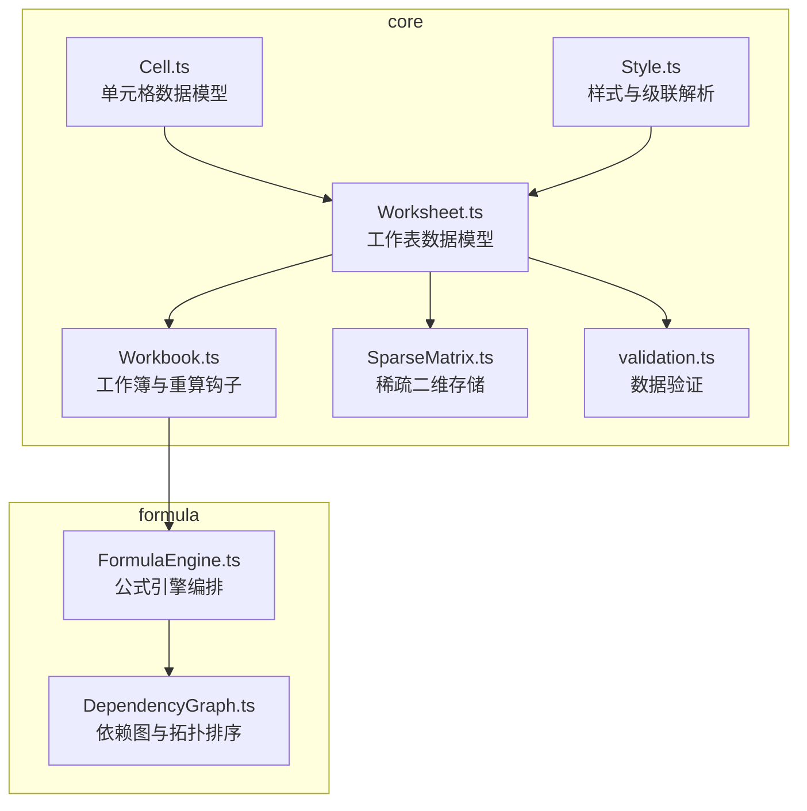
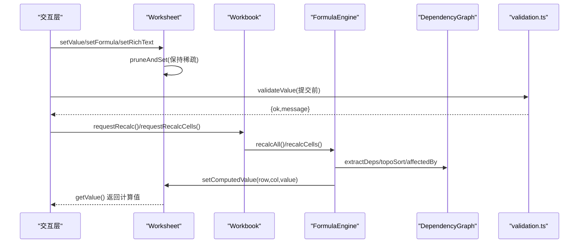
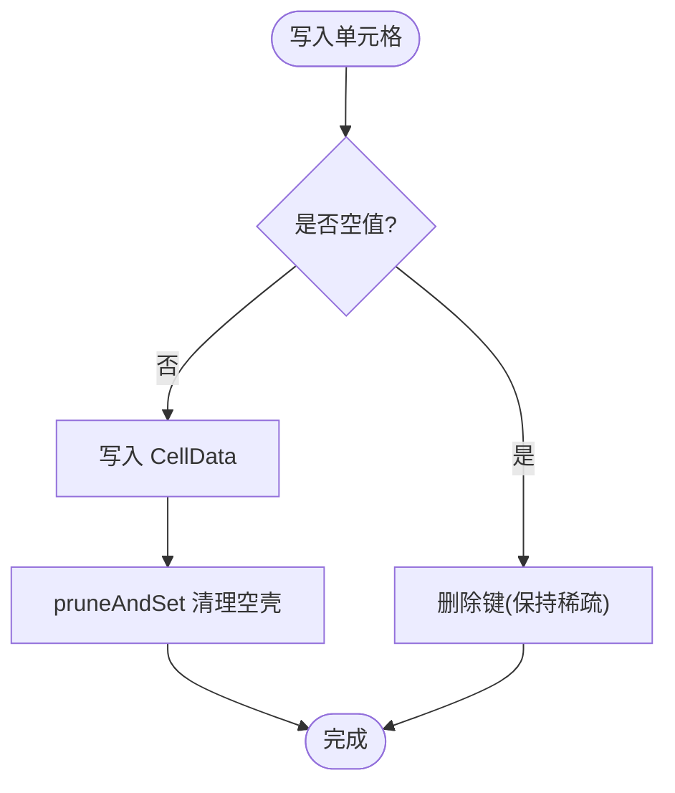
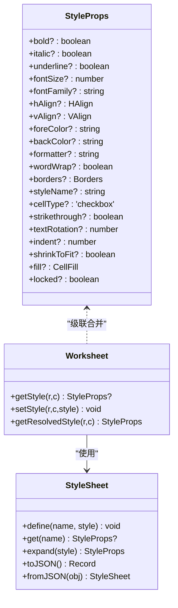
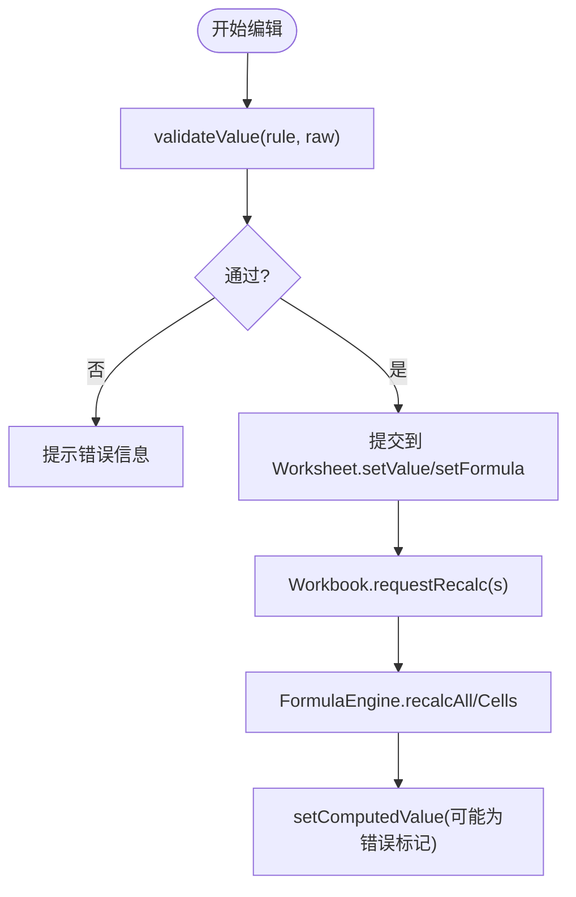
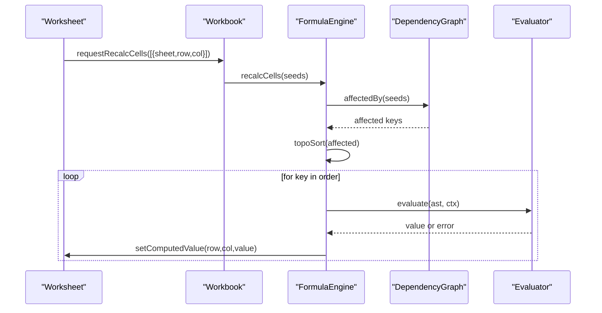
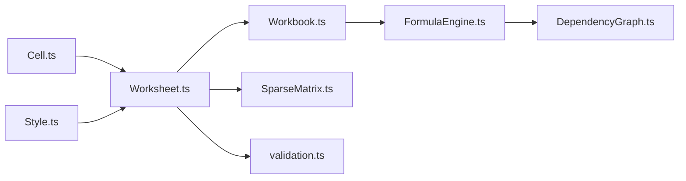

# 单元格数据模型

<cite>
**本文引用的文件**
- [Cell.ts](file://cmx-mega-sheet/src/core/Cell.ts)
- [Style.ts](file://cmx-mega-sheet/src/core/Style.ts)
- [Worksheet.ts](file://cmx-mega-sheet/src/core/Worksheet.ts)
- [Workbook.ts](file://cmx-mega-sheet/src/core/Workbook.ts)
- [SparseMatrix.ts](file://cmx-mega-sheet/src/core/SparseMatrix.ts)
- [FormulaEngine.ts](file://cmx-mega-sheet/src/formula/FormulaEngine.ts)
- [DependencyGraph.ts](file://cmx-mega-sheet/src/formula/DependencyGraph.ts)
- [validation.ts](file://cmx-mega-sheet/src/core/validation.ts)
</cite>

## 目录
1. [简介](#简介)
2. [项目结构](#项目结构)
3. [核心组件](#核心组件)
4. [架构总览](#架构总览)
5. [详细组件分析](#详细组件分析)
6. [依赖关系分析](#依赖关系分析)
7. [性能与内存优化](#性能与内存优化)
8. [故障排查指南](#故障排查指南)
9. [结论](#结论)
10. [附录：API 参考与使用示例](#附录api-参考与使用示例)

## 简介
本技术文档聚焦于电子表格的“单元格数据模型”，围绕 Cell 数据结构、样式体系、生命周期管理、状态机制（编辑/验证/错误）、公式引擎集成（依赖跟踪与重算触发）、以及高效存取策略进行系统化说明。目标读者包括需要深入理解或扩展该模块的工程师，也兼顾非专业读者的可读性。

## 项目结构
与单元格数据模型直接相关的代码集中在 cmx-mega-sheet 的核心与公式子系统中：
- core：单元格数据、样式、工作表与工作簿、稀疏矩阵存储、数据验证
- formula：公式解析、求值、依赖图与增量重算

图表来源
- [Cell.ts:1-74](file://cmx-mega-sheet/src/core/Cell.ts#L1-L74)
- [Style.ts:1-234](file://cmx-mega-sheet/src/core/Style.ts#L1-L234)
- [Worksheet.ts:1-800](file://cmx-mega-sheet/src/core/Worksheet.ts#L1-L800)
- [Workbook.ts:1-397](file://cmx-mega-sheet/src/core/Workbook.ts#L1-L397)
- [SparseMatrix.ts:1-175](file://cmx-mega-sheet/src/core/SparseMatrix.ts#L1-L175)
- [FormulaEngine.ts:1-289](file://cmx-mega-sheet/src/formula/FormulaEngine.ts#L1-L289)
- [DependencyGraph.ts:1-201](file://cmx-mega-sheet/src/formula/DependencyGraph.ts#L1-L201)

章节来源
- [Cell.ts:1-74](file://cmx-mega-sheet/src/core/Cell.ts#L1-L74)
- [Style.ts:1-234](file://cmx-mega-sheet/src/core/Style.ts#L1-L234)
- [Worksheet.ts:1-800](file://cmx-mega-sheet/src/core/Worksheet.ts#L1-L800)
- [Workbook.ts:1-397](file://cmx-mega-sheet/src/core/Workbook.ts#L1-L397)
- [SparseMatrix.ts:1-175](file://cmx-mega-sheet/src/core/SparseMatrix.ts#L1-L175)
- [FormulaEngine.ts:1-289](file://cmx-mega-sheet/src/formula/FormulaEngine.ts#L1-L289)
- [DependencyGraph.ts:1-201](file://cmx-mega-sheet/src/formula/DependencyGraph.ts#L1-L201)

## 核心组件
- 单元格数据模型（CellData）：承载 value、formula、style、rich 富文本等字段，提供类型归一化与导入清洗工具函数。
- 样式系统（StyleProps/StyleSheet/级联）：支持命名样式引用、逐层合并、边框/填充/字体/对齐/格式串等属性。
- 工作表（Worksheet）：以 SparseMatrix 为底层存储，封装单元格的读写、公式设置、计算值回填、样式级联、批注/超链/条件格式/迷你图等元数据。
- 工作簿（Workbook）：维护多工作表、命名区域、撤销/命令、重算钩子（全量/增量）。
- 稀疏矩阵（SparseMatrix）：只存非空槽位，支持行列增删时的坐标平移，保证 O(非空格) 复杂度。
- 公式引擎（FormulaEngine）：扫描公式格、构建依赖图、拓扑排序、检测环并标记 #CIRC!，按拓扑序求值回填；支持增量重算。
- 依赖图（DependencyGraph）：从 AST 抽取依赖、维护正向/反向边、受影响闭包计算、三色 DFS 环检测。
- 数据验证（validation.ts）：在提交前校验输入，返回通过/失败及消息。

章节来源
- [Cell.ts:1-74](file://cmx-mega-sheet/src/core/Cell.ts#L1-L74)
- [Style.ts:1-234](file://cmx-mega-sheet/src/core/Style.ts#L1-L234)
- [Worksheet.ts:1-800](file://cmx-mega-sheet/src/core/Worksheet.ts#L1-L800)
- [Workbook.ts:1-397](file://cmx-mega-sheet/src/core/Workbook.ts#L1-L397)
- [SparseMatrix.ts:1-175](file://cmx-mega-sheet/src/core/SparseMatrix.ts#L1-L175)
- [FormulaEngine.ts:1-289](file://cmx-mega-sheet/src/formula/FormulaEngine.ts#L1-L289)
- [DependencyGraph.ts:1-201](file://cmx-mega-sheet/src/formula/DependencyGraph.ts#L1-L201)
- [validation.ts:1-88](file://cmx-mega-sheet/src/core/validation.ts#L1-L88)

## 架构总览
单元格数据模型位于 core 层，被 Worksheet 组合使用；Workbook 作为顶层容器协调多个 Worksheet，并通过钩子与 FormulaEngine 解耦装配；FormulaEngine 通过 DependencyGraph 实现依赖跟踪与重算；样式系统在 Worksheet 中参与级联解析；数据验证在交互层提交前调用。

图表来源
- [Worksheet.ts:530-603](file://cmx-mega-sheet/src/core/Worksheet.ts#L530-L603)
- [Workbook.ts:231-261](file://cmx-mega-sheet/src/core/Workbook.ts#L231-L261)
- [FormulaEngine.ts:149-243](file://cmx-mega-sheet/src/formula/FormulaEngine.ts#L149-L243)
- [DependencyGraph.ts:26-94](file://cmx-mega-sheet/src/formula/DependencyGraph.ts#L26-L94)
- [validation.ts:24-65](file://cmx-mega-sheet/src/core/validation.ts#L24-L65)

## 详细组件分析

### 单元格数据结构与生命周期
- 数据结构
  - CellData：包含 value（标量）、formula（不含前导 '='）、style（内联 StyleProps）、rich（富文本 runs）。
  - 类型归一化：toCellValue 将 undefined/null 转为 null，其余原样或转字符串。
  - 公式归一化：normalizeFormula 去除前导 '=' 并 trim；sanitizeImportedFormula 剥离 Excel 导入伪前缀。
- 生命周期
  - 创建：Worksheet 通过 SparseMatrix 按需写入 CellData；pruneAndSet 会在数据为空时删除键以保持稀疏。
  - 更新：setValue 会覆盖 formula 与 rich；setFormula 仅保留 formula；setRichText 同步 value 为纯文本；setComputedValue 仅更新显示值。
  - 销毁：当单元格记录变为空壳（无 value/formula/style/rich），pruneAndSet 将其从稀疏矩阵移除，释放内存。

图表来源
- [Worksheet.ts:530-603](file://cmx-mega-sheet/src/core/Worksheet.ts#L530-L603)
- [Worksheet.ts:669-677](file://cmx-mega-sheet/src/core/Worksheet.ts#L669-L677)
- [Cell.ts:43-73](file://cmx-mega-sheet/src/core/Cell.ts#L43-L73)

章节来源
- [Cell.ts:14-73](file://cmx-mega-sheet/src/core/Cell.ts#L14-L73)
- [Worksheet.ts:530-603](file://cmx-mega-sheet/src/core/Worksheet.ts#L530-L603)
- [Worksheet.ts:669-677](file://cmx-mega-sheet/src/core/Worksheet.ts#L669-L677)

### 样式继承与应用机制
- 样式属性集（StyleProps）：字体、对齐、颜色、数字格式、边框、填充、锁定等，全部可选以实现稀疏存储。
- 命名样式表（StyleSheet）：集中管理复用样式，expand 方法先展开 styleName 引用再叠加当前对象键。
- 级联解析（resolveStyle）：优先级 sheetDefault < colDefault < rowDefault < cell，依次合并，borders 深合并。
- 应用方式：Worksheet.getResolvedStyle 返回最终样式；CellRange.style 对区域进行浅合并叠加。

图表来源
- [Style.ts:68-100](file://cmx-mega-sheet/src/core/Style.ts#L68-L100)
- [Style.ts:162-216](file://cmx-mega-sheet/src/core/Style.ts#L162-L216)
- [Style.ts:223-233](file://cmx-mega-sheet/src/core/Style.ts#L223-L233)
- [Worksheet.ts:605-631](file://cmx-mega-sheet/src/core/Worksheet.ts#L605-L631)

章节来源
- [Style.ts:1-234](file://cmx-mega-sheet/src/core/Style.ts#L1-L234)
- [Worksheet.ts:605-631](file://cmx-mega-sheet/src/core/Worksheet.ts#L605-L631)

### 单元格状态管理（编辑/验证/错误）
- 编辑态：由交互层控制（如 CellEditor），在 commit 前调用 validation.validateValue 进行校验。
- 验证态：validateValue 根据规则类型（list/whole/decimal/date/textLength/custom）判定通过与否，返回 ok 与 message。
- 错误态：
  - 公式错误：解析失败或求值异常时，FormulaEngine 回填 '#NAME?' / '#VALUE!' 等错误标记。
  - 循环依赖：DependencyGraph 三色 DFS 检测环，环上格标记 '#CIRC!'。
  - 保护态：Worksheet 支持 SheetProtection，锁定单元格在保护下不可编辑。

图表来源
- [validation.ts:24-65](file://cmx-mega-sheet/src/core/validation.ts#L24-L65)
- [Worksheet.ts:530-603](file://cmx-mega-sheet/src/core/Worksheet.ts#L530-L603)
- [Workbook.ts:231-261](file://cmx-mega-sheet/src/core/Workbook.ts#L231-L261)
- [FormulaEngine.ts:149-243](file://cmx-mega-sheet/src/formula/FormulaEngine.ts#L149-L243)

章节来源
- [validation.ts:1-88](file://cmx-mega-sheet/src/core/validation.ts#L1-L88)
- [Worksheet.ts:633-661](file://cmx-mega-sheet/src/core/Worksheet.ts#L633-L661)
- [FormulaEngine.ts:149-243](file://cmx-mega-sheet/src/formula/FormulaEngine.ts#L149-L243)

### 与公式引擎的集成（依赖跟踪与重算触发）
- 依赖提取：DependencyGraph.extractDeps 遍历 AST，收集 ref/range/call/array 等节点中的单元格键。
- 依赖图：维护 deps（出边）与 dependents（入边），支持 affectedBy 计算受影响闭包。
- 拓扑排序：topoSort 使用三色 DFS 检测环，返回 order 与 cyclic。
- 重算流程：
  - 全量：FormulaEngine.recalcAll 扫描所有公式格，重建依赖图，拓扑排序后逐个求值回填。
  - 增量：FormulaEngine.recalcCells 针对种子格更新图与注册表，计算受影响闭包并局部重算。
  - 钩子：Workbook 暴露 requestRecalc/requestRecalcCells，FormulaEngine 在构造时注册，避免 core→formula 环。

图表来源
- [FormulaEngine.ts:149-243](file://cmx-mega-sheet/src/formula/FormulaEngine.ts#L149-L243)
- [DependencyGraph.ts:142-199](file://cmx-mega-sheet/src/formula/DependencyGraph.ts#L142-L199)
- [Workbook.ts:231-261](file://cmx-mega-sheet/src/core/Workbook.ts#L231-L261)

章节来源
- [FormulaEngine.ts:1-289](file://cmx-mega-sheet/src/formula/FormulaEngine.ts#L1-L289)
- [DependencyGraph.ts:1-201](file://cmx-mega-sheet/src/formula/DependencyGraph.ts#L1-L201)
- [Workbook.ts:231-261](file://cmx-mega-sheet/src/core/Workbook.ts#L231-L261)

### 高效存取策略与内存优化
- 稀疏存储：SparseMatrix 仅保存非空槽位，键为 "row,col"；插入/删除行列时批量平移坐标，避免稠密数组浪费。
- 空壳清理：Worksheet.pruneAndSet 在单元格记录为空时删除键，维持稀疏性。
- 样式稀疏：StyleProps 全部可选，mergeStyle 仅合并非 undefined 键；EMPTY_STYLE 常量避免误改。
- 公式缓存：FormulaEngine.parseCache 缓存 AST 解析结果，减少重复解析开销。
- 增量重算：DependencyGraph.affectedBy 仅重算受影响闭包，降低大表编辑成本。

章节来源
- [SparseMatrix.ts:1-175](file://cmx-mega-sheet/src/core/SparseMatrix.ts#L1-L175)
- [Worksheet.ts:669-677](file://cmx-mega-sheet/src/core/Worksheet.ts#L669-L677)
- [Style.ts:102-145](file://cmx-mega-sheet/src/core/Style.ts#L102-L145)
- [FormulaEngine.ts:69-80](file://cmx-mega-sheet/src/formula/FormulaEngine.ts#L69-L80)
- [DependencyGraph.ts:142-156](file://cmx-mega-sheet/src/formula/DependencyGraph.ts#L142-L156)

## 依赖关系分析
- Worksheet 依赖 CellData、Style、SparseMatrix，负责数据与元数据的组织。
- Workbook 聚合 Worksheet，提供事件、命令、撤销与重算钩子。
- FormulaEngine 依赖 Parser/Evaluator/functions/DependencyGraph，通过 Workbook 钩子触发重算。
- DependencyGraph 依赖地址解析工具，从 AST 抽取依赖并维护图结构。
- validation.ts 独立于渲染与 DOM，供交互层在提交前调用。

图表来源
- [Worksheet.ts:16-27](file://cmx-mega-sheet/src/core/Worksheet.ts#L16-L27)
- [Workbook.ts:14-16](file://cmx-mega-sheet/src/core/Workbook.ts#L14-L16)
- [FormulaEngine.ts:15-28](file://cmx-mega-sheet/src/formula/FormulaEngine.ts#L15-L28)
- [DependencyGraph.ts:12-14](file://cmx-mega-sheet/src/formula/DependencyGraph.ts#L12-L14)
- [validation.ts:11-12](file://cmx-mega-sheet/src/core/validation.ts#L11-L12)

章节来源
- [Worksheet.ts:16-27](file://cmx-mega-sheet/src/core/Worksheet.ts#L16-L27)
- [Workbook.ts:14-16](file://cmx-mega-sheet/src/core/Workbook.ts#L14-L16)
- [FormulaEngine.ts:15-28](file://cmx-mega-sheet/src/formula/FormulaEngine.ts#L15-L28)
- [DependencyGraph.ts:12-14](file://cmx-mega-sheet/src/formula/DependencyGraph.ts#L12-L14)
- [validation.ts:11-12](file://cmx-mega-sheet/src/core/validation.ts#L11-L12)

## 性能与内存优化
- 稀疏矩阵：O(非空格) 存储与遍历，行列增删时批量平移坐标，避免 O(总格数) 代价。
- 样式合并：浅合并 + borders 深合并，避免不必要的拷贝与冗余键。
- 公式解析缓存：AST 解析结果缓存，减少重复解析。
- 增量重算：基于依赖图的受影响闭包计算，显著降低大表编辑后的重算成本。
- 空壳清理：pruneAndSet 及时删除空记录，保持内存占用与数据规模一致。

[本节为通用性能建议，不直接分析具体文件]

## 故障排查指南
- 公式错误
  - 现象：单元格显示 '#NAME?' / '#VALUE!'
  - 原因：解析失败或求值异常
  - 处理：检查公式语法与函数注册；查看 FormulaEngine.evaluate 返回值
- 循环依赖
  - 现象：单元格显示 '#CIRC!'
  - 原因：依赖图中存在环
  - 处理：检查依赖关系，消除环；查看 DependencyGraph.topoSort 的 cyclic 集合
- 验证失败
  - 现象：提交被拒绝并提示错误
  - 原因：validateValue 返回 ok=false
  - 处理：调整规则或输入；查看 validation.ts 的错误消息
- 保护态阻止编辑
  - 现象：锁定单元格无法编辑
  - 原因：SheetProtection.enabled=true 且单元格 locked !== false
  - 处理：调整保护配置或解锁单元格

章节来源
- [FormulaEngine.ts:259-271](file://cmx-mega-sheet/src/formula/FormulaEngine.ts#L259-L271)
- [DependencyGraph.ts:163-199](file://cmx-mega-sheet/src/formula/DependencyGraph.ts#L163-L199)
- [validation.ts:24-65](file://cmx-mega-sheet/src/core/validation.ts#L24-L65)
- [Worksheet.ts:633-661](file://cmx-mega-sheet/src/core/Worksheet.ts#L633-L661)

## 结论
单元格数据模型以 CellData 为核心，结合样式级联、稀疏存储与公式依赖图，实现了高性能、可扩展的电子表格数据层。通过 Workbook 的重算钩子与 FormulaEngine 的增量重算，保证了在大表场景下的响应性。数据验证与保护机制完善了交互体验与数据安全。整体设计清晰、职责分离良好，便于后续功能扩展与维护。

[本节为总结，不直接分析具体文件]

## 附录：API 参考与使用示例

### 单元格数据 API（Worksheet）
- 读取/写入值
  - getValue(row, col): CellValue
  - setValue(row, col, value): void
- 公式
  - getFormula(row, col): string
  - setFormula(row, col, formula): void
  - setComputedValue(row, col, value): void（公式引擎回填）
- 富文本
  - getRichText(row, col): RichText | null
  - setRichText(row, col, rich): void
- 样式
  - getStyle(row, col): StyleProps | undefined
  - setStyle(row, col, style): void
  - getResolvedStyle(row, col): StyleProps（级联解析）
- 区域操作
  - getCell(row, col): CellRange
  - getRange(row, col, rowCount, colCount): CellRange

章节来源
- [Worksheet.ts:530-631](file://cmx-mega-sheet/src/core/Worksheet.ts#L530-L631)

### 样式 API（Style）
- 命名样式表
  - StyleSheet.define(name, style): void
  - StyleSheet.get(name): StyleProps | undefined
  - StyleSheet.expand(style): StyleProps
  - StyleSheet.toJSON/fromJSON
- 样式合并与解析
  - mergeStyle(base, override): StyleProps
  - resolveStyle(sheet, layers): StyleProps

章节来源
- [Style.ts:128-145](file://cmx-mega-sheet/src/core/Style.ts#L128-L145)
- [Style.ts:162-216](file://cmx-mega-sheet/src/core/Style.ts#L162-L216)
- [Style.ts:223-233](file://cmx-mega-sheet/src/core/Style.ts#L223-L233)

### 公式引擎 API（FormulaEngine）
- 全量重算
  - recalcAll(): void
- 增量重算
  - recalcCells(seeds): void
- 直接求值
  - evaluateFormula(sheetName, formula, row, col): FormulaValue
- 报表取值映射
  - setReportValueMap(raw): void

章节来源
- [FormulaEngine.ts:62-67](file://cmx-mega-sheet/src/formula/FormulaEngine.ts#L62-L67)
- [FormulaEngine.ts:149-198](file://cmx-mega-sheet/src/formula/FormulaEngine.ts#L149-L198)
- [FormulaEngine.ts:206-243](file://cmx-mega-sheet/src/formula/FormulaEngine.ts#L206-L243)
- [FormulaEngine.ts:278-287](file://cmx-mega-sheet/src/formula/FormulaEngine.ts#L278-L287)

### 数据验证 API（validation.ts）
- validateValue(rule, raw, customEval?): ValidationResult
  - rule: DataValidation（类型、范围、候选值等）
  - raw: 用户输入原始串
  - customEval: 自定义验证求值器（type='custom' 时使用）

章节来源
- [validation.ts:24-65](file://cmx-mega-sheet/src/core/validation.ts#L24-L65)

### 使用示例（路径指引）
- 设置单元格值并触发重算
  - 参考：[Worksheet.setValue:534-548](file://cmx-mega-sheet/src/core/Worksheet.ts#L534-L548)
  - 参考：[Workbook.requestRecalcCells:257-261](file://cmx-mega-sheet/src/core/Workbook.ts#L257-L261)
- 设置公式并回填计算值
  - 参考：[Worksheet.setFormula:575-588](file://cmx-mega-sheet/src/core/Worksheet.ts#L575-L588)
  - 参考：[FormulaEngine.recalcAll:149-198](file://cmx-mega-sheet/src/formula/FormulaEngine.ts#L149-L198)
- 应用命名样式并级联解析
  - 参考：[StyleSheet.expand:192-201](file://cmx-mega-sheet/src/core/Style.ts#L192-L201)
  - 参考：[Worksheet.getResolvedStyle:623-631](file://cmx-mega-sheet/src/core/Worksheet.ts#L623-L631)
- 提交前数据验证
  - 参考：[validation.validateValue:24-65](file://cmx-mega-sheet/src/core/validation.ts#L24-L65)

[本节为 API 索引，不直接展示代码内容]