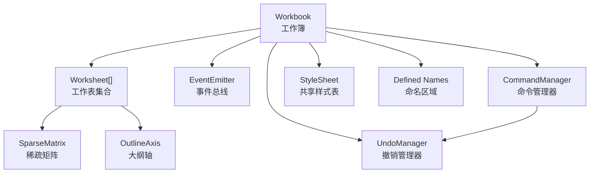
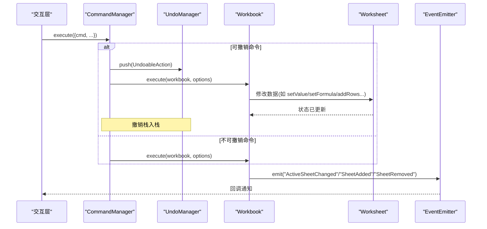
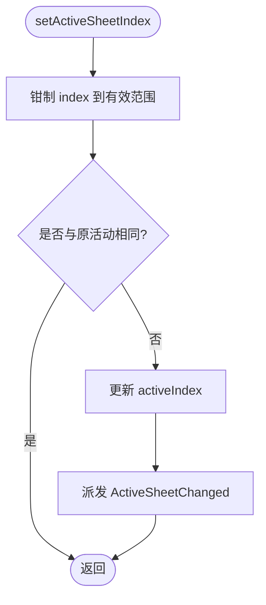
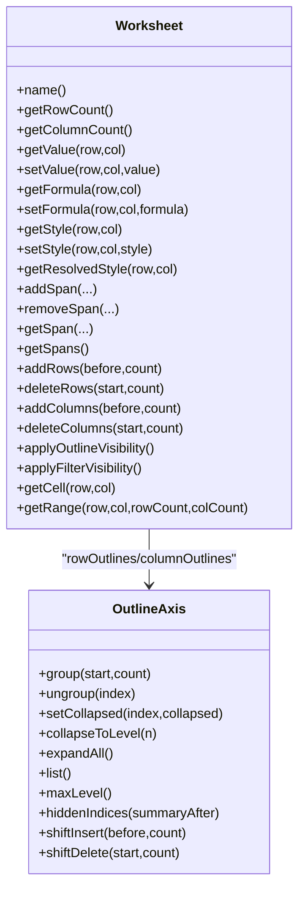
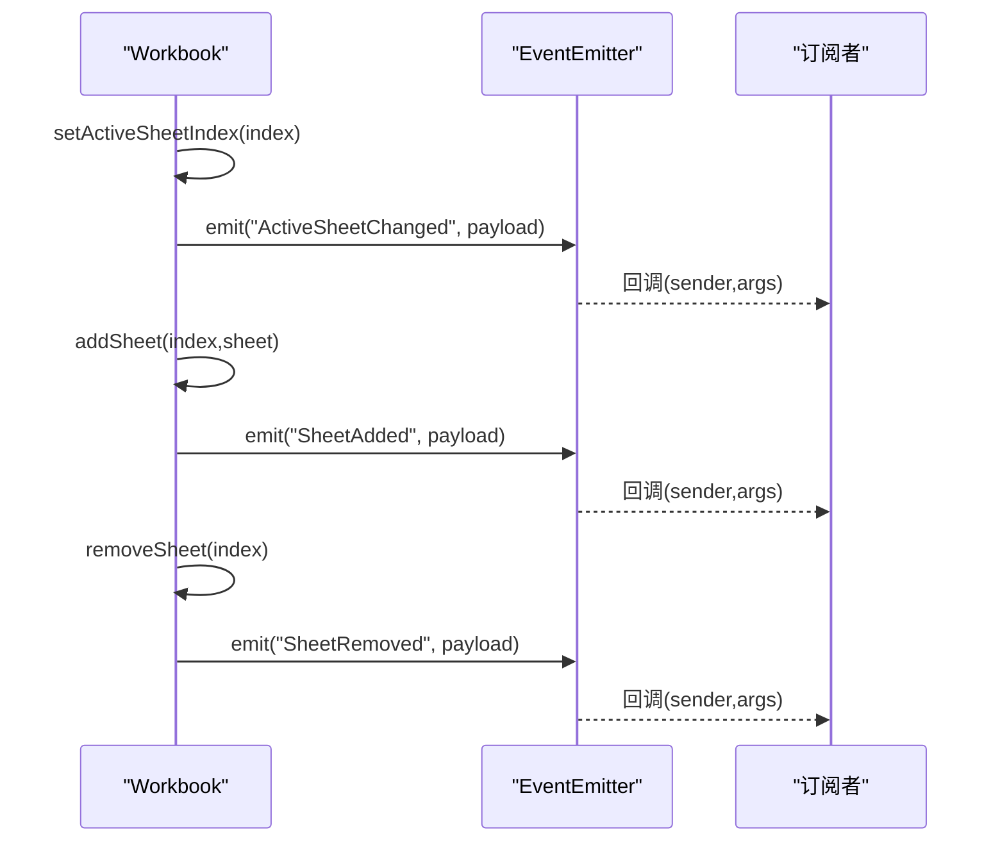
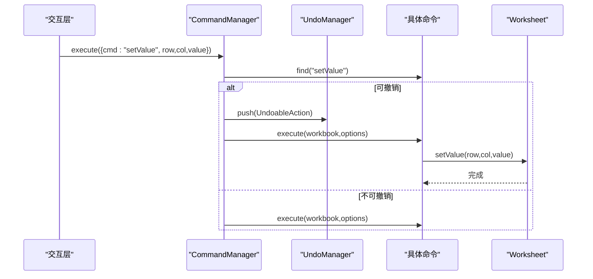
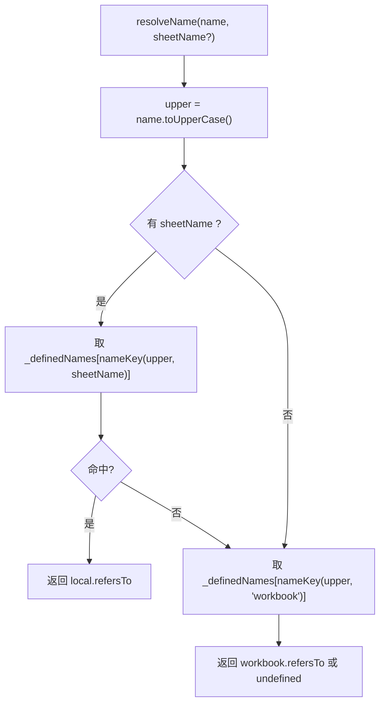
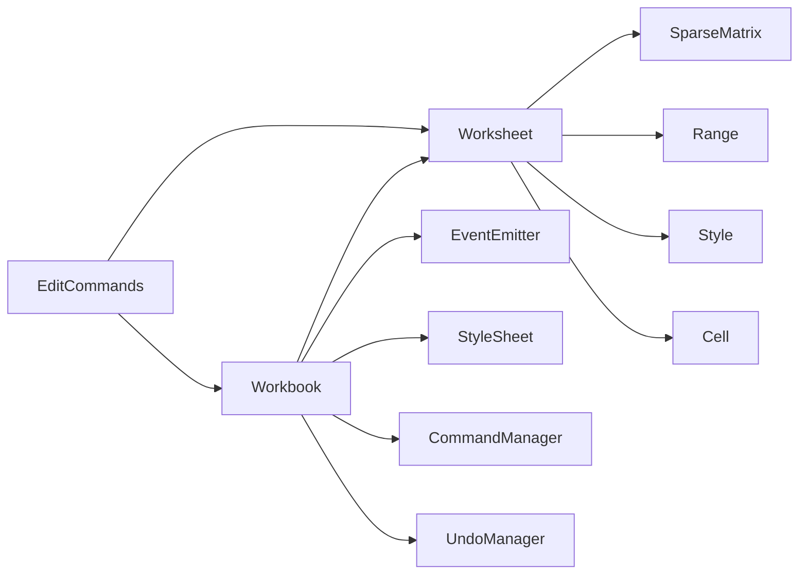

# 工作簿管理

<cite>
**本文引用的文件**
- [Workbook.ts](file://cmx-mega-sheet/src/core/Workbook.ts)
- [Worksheet.ts](file://cmx-mega-sheet/src/core/Worksheet.ts)
- [EventEmitter.ts](file://cmx-mega-sheet/src/core/EventEmitter.ts)
- [EditCommands.ts](file://cmx-mega-sheet/src/core/EditCommands.ts)
</cite>

## 目录
1. [简介](#简介)
2. [项目结构](#项目结构)
3. [核心组件](#核心组件)
4. [架构总览](#架构总览)
5. [详细组件分析](#详细组件分析)
6. [依赖关系分析](#依赖关系分析)
7. [性能考虑](#性能考虑)
8. [故障排查指南](#故障排查指南)
9. [结论](#结论)
10. [附录](#附录)

## 简介
本技术文档聚焦于“工作簿管理工作簿”的核心实现，围绕 Workbook 类展开，系统阐述其职责边界与协作机制：工作表集合管理、活动工作表切换、命名区域定义与作用域解析、事件系统（ActiveSheetChanged、SheetAdded、SheetRemoved）的触发时机与参数、撤销管理器（UndoManager）与命令管理器（CommandManager）的协作流程，以及工作表的增删改查、移动排序等操作的内部机制。同时给出完整的工作簿生命周期管理与性能优化建议，帮助读者在理解代码的同时掌握最佳实践。

## 项目结构
工作簿相关能力集中在 cmx-mega-sheet 的 core 层，关键文件如下：
- Workbook.ts：工作簿模型、事件总线、命名区域、重算钩子、命令/撤销入口、绘制抑制计数。
- Worksheet.ts：工作表数据模型（单元格、合并区、行列结构、大纲分组、筛选、验证、保护等）。
- EventEmitter.ts：类型化事件总线，提供 bind/unbind/emit 能力。
- EditCommands.ts：可撤销编辑命令工厂（值/公式/样式/填充/插删行列等），通过 UndoableAction 接入撤销栈。

图表来源
- [Workbook.ts:174-396](file://cmx-mega-sheet/src/core/Workbook.ts#L174-L396)
- [Worksheet.ts:435-492](file://cmx-mega-sheet/src/core/Worksheet.ts#L435-L492)
- [EventEmitter.ts:13-59](file://cmx-mega-sheet/src/core/EventEmitter.ts#L13-L59)
- [EditCommands.ts:109-155](file://cmx-mega-sheet/src/core/EditCommands.ts#L109-L155)

章节来源
- [Workbook.ts:1-396](file://cmx-mega-sheet/src/core/Workbook.ts#L1-L396)
- [Worksheet.ts:1-1279](file://cmx-mega-sheet/src/core/Worksheet.ts#L1-L1279)
- [EventEmitter.ts:1-60](file://cmx-mega-sheet/src/core/EventEmitter.ts#L1-L60)
- [EditCommands.ts:1-200](file://cmx-mega-sheet/src/core/EditCommands.ts#L1-L200)

## 核心组件
- Workbook：工作簿顶层对象，维护工作表集合、活动工作表索引、共享样式表、命名区域、重算钩子、事件总线、命令/撤销入口、绘制抑制计数。
- Worksheet：工作表数据模型，承载单元格值/公式/样式、合并区、行列结构与元数据、大纲分组、自动筛选、数据验证、超链接、条件格式、批注、浮动对象、迷你图、页面设置、保护态等。
- CommandManager：注册并执行命令；对可撤销命令包装为 UndoableAction 并入撤销栈。
- UndoManager：维护 undo/redo 栈，支持 do/push/undo/redo/clear/maxSize 等操作。
- EventEmitter：类型化事件分发器，提供 bind/unbind/emit/hasListeners。

章节来源
- [Workbook.ts:174-396](file://cmx-mega-sheet/src/core/Workbook.ts#L174-L396)
- [Worksheet.ts:435-1279](file://cmx-mega-sheet/src/core/Worksheet.ts#L435-L1279)
- [EditCommands.ts:109-200](file://cmx-mega-sheet/src/core/EditCommands.ts#L109-L200)
- [EventEmitter.ts:13-59](file://cmx-mega-sheet/src/core/EventEmitter.ts#L13-L59)

## 架构总览
工作簿作为模型树根节点，协调工作表、事件、命令与撤销、命名区域与重算钩子。交互层通过 CommandManager 下发命令，命令内部调用 Worksheet 的数据 API 修改状态；可撤销命令由 UndoManager 记录，支持撤销/重做。事件系统在关键状态变更时派发，供渲染层或上层订阅处理。

图表来源
- [EditCommands.ts:109-155](file://cmx-mega-sheet/src/core/EditCommands.ts#L109-L155)
- [Workbook.ts:135-172](file://cmx-mega-sheet/src/core/Workbook.ts#L135-L172)
- [Workbook.ts:288-323](file://cmx-mega-sheet/src/core/Workbook.ts#L288-L323)
- [EventEmitter.ts:41-52](file://cmx-mega-sheet/src/core/EventEmitter.ts#L41-L52)

## 详细组件分析

### Workbook：工作簿核心职责
- 工作表集合管理
  - 新增：addSheet(index?, sheet?) 插入到指定位置，越界则追加；若插入位置小于等于当前活动索引，则活动索引后移一位；派发 SheetAdded。
  - 追加：appendSheet(sheet?) 等价 addSheet(length)。
  - 删除：removeSheet(index) 移除对应工作表；若活动索引越界则回退至末尾；派发 SheetRemoved。
  - 移动：moveSheet(from, to) 将 from 处工作表移动到 to；活动表按 identity 跟随新位置。
  - 查询：getSheetCount/getSheet/getSheets/getSheetByName/getActiveSheet/getActiveSheetIndex。
  - 清空：clearSheets() 重置为空并复位活动索引。
- 活动工作表切换
  - setActiveSheetIndex(index) 安全钳制范围，仅在变化时派发 ActiveSheetChanged(oldIndex, newIndex, sheet)。
- 命名区域（Defined Names）
  - defineName(name, refersTo, scope='workbook')：存储 nameKey(scope+name.toUpperCase()) → {scope, refersTo}，去除前导 '='。
  - deleteName(name, scope)：删除键。
  - resolveName(name, sheetName?)：优先查找 sheet 级作用域，再回退 workbook 级。
  - listNames()/clearNames()：导出/清空全部命名区域。
- 重算钩子
  - setRecalcHook(hook)/requestRecalc()：全量重算入口。
  - setRecalcCellsHook(hook)/requestRecalcCells(cells)：增量重算入口，未配置时退化全量。
- 事件系统
  - events.bind/unbind：基于 EventEmitter 的类型化事件绑定/解绑。
  - 事件载荷：ActiveSheetChanged{oldIndex,newIndex,sheet}、SheetAdded{index,sheet}、SheetRemoved{index,name}。
- 命令/撤销
  - commandManager()/undoManager()：暴露 CommandManager 与 UndoManager 实例。
- 绘制抑制
  - suspendPaint()/resumePaint()/isPaintSuspended：M0 惰性计数，M1 渲染层接管。

图表来源
- [Workbook.ts:288-297](file://cmx-mega-sheet/src/core/Workbook.ts#L288-L297)

章节来源
- [Workbook.ts:174-396](file://cmx-mega-sheet/src/core/Workbook.ts#L174-L396)

### Worksheet：工作表数据模型与操作
- 单元格读写
  - getValue/setValue：标量写入会覆盖公式与富文本；空值清理保持稀疏。
  - getFormula/setFormula：规范化公式；清除公式保留其他属性。
  - setComputedValue：回填计算值（仅公式格），getValue 随后返回该值。
  - getStyle/setStyle：精确控制样式键；pruneAndSet 清理空壳。
  - getResolvedStyle：级联解析最终样式（工作簿样式表 < 行样式 < 列样式 < 单元格样式）。
- 合并区
  - addSpan/removeSpan/getSpan/getSpans：相交覆盖语义；expandRangeToSpans 扩展选区到合并区不动点。
- 行列结构与元数据
  - getRowCount/setRowCount、getColumnCount/setColumnCount：缩减时丢弃越界数据。
  - addRows/deleteRows/addColumns/deleteColumns：同步搬移 SparseMatrix、span、行高/列宽、隐藏集、行/列样式、大纲分组起点。
  - 行高/列宽/可见性：rowHeights/colWidths/hiddenRows/hiddenCols。
- 大纲分组
  - OutlineAxis：group/ungroup/setCollapsed/collapseToLevel/expandAll/list/maxLevel/hiddenIndices；shiftInsert/shiftDelete 与结构编辑同步。
- 自动筛选
  - autoFilter：区域 + 每列条件；applyFilterVisibility 刷新可见性，与手动/大纲隐藏分账。
- 数据验证、超链接、条件格式、批注、浮动对象、迷你图、页面设置、保护态
  - 分别以独立字段存储，供渲染/校验/导出消费。
- 选区与缩放
  - selections/activeRow/activeCol/zoom：选区与活动格管理；zoom 记录缩放因子。

图表来源
- [Worksheet.ts:435-492](file://cmx-mega-sheet/src/core/Worksheet.ts#L435-L492)
- [Worksheet.ts:248-388](file://cmx-mega-sheet/src/core/Worksheet.ts#L248-L388)
- [Worksheet.ts:1085-1127](file://cmx-mega-sheet/src/core/Worksheet.ts#L1085-L1127)

章节来源
- [Worksheet.ts:1-1279](file://cmx-mega-sheet/src/core/Worksheet.ts#L1-L1279)

### 事件系统设计与触发时机
- ActiveSheetChanged：当活动工作表索引发生变化时派发，携带 oldIndex、newIndex、sheet。
- SheetAdded：插入工作表后派发，携带 index、sheet。
- SheetRemoved：删除工作表后派发，携带 index、name。
- 事件总线：EventEmitter 提供类型安全的 bind/unbind/emit，异常隔离保证健壮性。

图表来源
- [Workbook.ts:288-323](file://cmx-mega-sheet/src/core/Workbook.ts#L288-L323)
- [EventEmitter.ts:41-52](file://cmx-mega-sheet/src/core/EventEmitter.ts#L41-L52)

章节来源
- [Workbook.ts:174-396](file://cmx-mega-sheet/src/core/Workbook.ts#L174-L396)
- [EventEmitter.ts:1-60](file://cmx-mega-sheet/src/core/EventEmitter.ts#L1-L60)

### 撤销管理器与命令管理器的协作
- CommandManager
  - register(name, command)：注册命名命令。
  - execute(options)：根据 cmd 查找命令；若命令声明 canUndo 且存在 undo，则包装为 UndoableAction 执行并压入 UndoManager；否则直接执行。
- UndoManager
  - do(action)：执行 action.execute() 并压栈，清空 redo 栈，裁剪长度。
  - push(action)：仅压栈（外部已执行），清空 redo 栈。
  - undo()/redo()：弹出并执行对应逆操作，交换栈。
  - maxSize(n)：限制撤销栈大小。
- EditCommands
  - SnapshotCommand：捕获受影响区域的 CellData 快照，execute 应用变更，undo 恢复快照；适用于值/公式/样式/填充等。
  - 结构编辑：insert/delete 行列命令附带 StructuralEditMeta，供 element 层派发结构变更事件，消费方同步地址映射。

图表来源
- [EditCommands.ts:109-155](file://cmx-mega-sheet/src/core/EditCommands.ts#L109-L155)
- [Workbook.ts:135-172](file://cmx-mega-sheet/src/core/Workbook.ts#L135-L172)

章节来源
- [EditCommands.ts:1-200](file://cmx-mega-sheet/src/core/EditCommands.ts#L1-L200)
- [Workbook.ts:135-172](file://cmx-mega-sheet/src/core/Workbook.ts#L135-L172)

### 命名区域的定义、解析与作用域管理
- 定义：defineName(name, refersTo, scope) 将 nameKey(scope+大写名称) 映射到 {scope, refersTo}，自动去除前导 '='。
- 解析：resolveName(name, sheetName?) 先查 sheet 级（当前 sheet 作用域），再查 workbook 级。
- 列出/清空：listNames()/clearNames() 用于 IO 往返与快照重建。
- 作用域优先级：同名时 sheet 级优先于 workbook 级。

图表来源
- [Workbook.ts:202-229](file://cmx-mega-sheet/src/core/Workbook.ts#L202-L229)

章节来源
- [Workbook.ts:185-229](file://cmx-mega-sheet/src/core/Workbook.ts#L185-L229)

### 工作表增删改查、移动与排序机制
- 增：addSheet/index 插入，活动索引可能后移；appendSheet 追加。
- 删：removeSheet 删除并修正活动索引；派发 SheetRemoved。
- 改：Worksheet 内单元格的值/公式/样式/富文本/计算值等；合并区、大纲分组、筛选、验证、保护等均可变。
- 查：getSheet/getSheetByName/getSheets/getRowCount/getColumnCount/getValue/getFormula/getStyle 等。
- 移动与排序：moveSheet(from,to) 调整数组顺序，活动表按 identity 跟随新位置。

章节来源
- [Workbook.ts:299-342](file://cmx-mega-sheet/src/core/Workbook.ts#L299-L342)
- [Worksheet.ts:1085-1127](file://cmx-mega-sheet/src/core/Worksheet.ts#L1085-L1127)

### 工作簿生命周期管理
- 构造：Workbook(opts) 初始化 CommandManager/UndoManager/styleSheet/events，并按 sheetCount 创建默认工作表。
- 运行期：通过命令/撤销进行编辑；通过事件驱动渲染/业务逻辑；通过重算钩子联动公式引擎。
- 销毁/重置：clearSheets()/clearNames()/events.unbindAll()（如需）；UndoManager.clear() 清空历史。
- 导出/导入：IO 层读取 Worksheet 快照接口（如 getDefaultStyle/getRowHeightEntries/forEachCell 等）进行序列化。

章节来源
- [Workbook.ts:263-269](file://cmx-mega-sheet/src/core/Workbook.ts#L263-L269)
- [Worksheet.ts:1229-1273](file://cmx-mega-sheet/src/core/Worksheet.ts#L1229-L1273)

## 依赖关系分析
- Workbook 依赖：
  - Worksheet：工作表数据模型。
  - EventEmitter：事件分发。
  - StyleSheet：共享样式表。
  - CommandManager/UndoManager：命令与撤销。
  - FormulaEngine（通过钩子）：重算。
- Worksheet 依赖：
  - SparseMatrix：单元格数据存储。
  - Range：区域抽象。
  - Style：样式解析与合并。
  - Cell：单元格数据结构与转换。
  - address：地址格式化。
- EditCommands 依赖：
  - Worksheet：数据修改 API。
  - Workbook：结构编辑时的跨簿公式改写。
  - Range/SparseMatrix：区域遍历与结构位移。

图表来源
- [Workbook.ts:174-396](file://cmx-mega-sheet/src/core/Workbook.ts#L174-L396)
- [Worksheet.ts:435-492](file://cmx-mega-sheet/src/core/Worksheet.ts#L435-L492)
- [EditCommands.ts:109-200](file://cmx-mega-sheet/src/core/EditCommands.ts#L109-L200)

章节来源
- [Workbook.ts:174-396](file://cmx-mega-sheet/src/core/Workbook.ts#L174-L396)
- [Worksheet.ts:435-492](file://cmx-mega-sheet/src/core/Worksheet.ts#L435-L492)
- [EditCommands.ts:109-200](file://cmx-mega-sheet/src/core/EditCommands.ts#L109-L200)

## 性能考虑
- 稀疏存储：Worksheet 使用 SparseMatrix 存储单元格，避免密集矩阵内存浪费。
- 批量操作：
  - 使用 addRows/addColumns 批量插入，减少多次分散操作。
  - 使用 CellRange.value/formula/style 对区域批量赋值，降低调用开销。
- 绘制抑制：suspendPaint/resumePaint 包裹大量变更，减少渲染抖动（M0 计数，M1 渲染层接管）。
- 撤销栈容量：通过 UndoManager.maxSize 限制历史长度，防止内存膨胀。
- 重算策略：
  - 优先使用 requestRecalcCells 进行增量重算，未配置时退化全量。
  - 公式引用结构变化时，EditCommands 会扫描并重写跨簿公式，注意影响范围。
- 结构编辑一致性：行列增删同步迁移 span、样式、隐藏集、大纲分组起点，避免后续逻辑不一致导致的额外修复成本。

[本节为通用性能指导，不直接分析具体文件]

## 故障排查指南
- 活动工作表异常
  - 现象：切换后事件未触发或索引越界。
  - 排查：确认 setActiveSheetIndex 传入值被钳制；检查是否有重复调用导致无变化。
  - 参考路径：[Workbook.ts:288-297](file://cmx-mega-sheet/src/core/Workbook.ts#L288-L297)
- 工作表增删事件丢失
  - 现象：SheetAdded/SheetRemoved 未触发。
  - 排查：确认 addSheet/removeSheet 调用路径；检查事件订阅是否正确绑定。
  - 参考路径：[Workbook.ts:299-323](file://cmx-mega-sheet/src/core/Workbook.ts#L299-L323), [EventEmitter.ts:41-52](file://cmx-mega-sheet/src/core/EventEmitter.ts#L41-L52)
- 撤销失效
  - 现象：undo/redo 无效或行为异常。
  - 排查：确认命令通过 CommandManager.execute 执行；可撤销命令需声明 canUndo 与 undo；检查 UndoManager 栈大小与 trim 行为。
  - 参考路径：[Workbook.ts:135-172](file://cmx-mega-sheet/src/core/Workbook.ts#L135-L172), [EditCommands.ts:109-155](file://cmx-mega-sheet/src/core/EditCommands.ts#L109-L155)
- 命名区域解析错误
  - 现象：resolveName 返回不符合预期。
  - 排查：确认 name 大小写归一；检查 sheet 级与 workbook 级作用域优先级；核对 refersTo 是否去除前导 '='。
  - 参考路径：[Workbook.ts:202-229](file://cmx-mega-sheet/src/core/Workbook.ts#L202-L229)
- 结构编辑后公式错位
  - 现象：插删行列后跨表公式引用偏移。
  - 排查：确认 EditCommands 中的 adjustWorkbookFormulas 已执行；检查 StructuralEditMeta 是否正确传递。
  - 参考路径：[EditCommands.ts:59-83](file://cmx-mega-sheet/src/core/EditCommands.ts#L59-L83)

章节来源
- [Workbook.ts:288-323](file://cmx-mega-sheet/src/core/Workbook.ts#L288-L323)
- [EventEmitter.ts:41-52](file://cmx-mega-sheet/src/core/EventEmitter.ts#L41-L52)
- [Workbook.ts:135-172](file://cmx-mega-sheet/src/core/Workbook.ts#L135-L172)
- [EditCommands.ts:59-83](file://cmx-mega-sheet/src/core/EditCommands.ts#L59-L83)

## 结论
Workbook 作为工作簿管理的核心，提供了工作表集合管理、活动工作表切换、命名区域与作用域解析、事件系统与命令/撤销协作的完整能力。配合 Worksheet 的数据模型与 EditCommands 的可撤销编辑机制，形成了稳定、可扩展、可追溯的表格内核基础。通过合理的批量操作、绘制抑制、撤销栈容量控制与增量重算策略，可在大规模数据场景下保持良好性能与用户体验。

[本节为总结性内容，不直接分析具体文件]

## 附录
- 常用 API 速查
  - 工作表集合：getSheetCount/getSheet/getSheets/getSheetByName/addSheet/appendSheet/removeSheet/moveSheet/clearSheets
  - 活动工作表：getActiveSheet/getActiveSheetIndex/setActiveSheetIndex
  - 命名区域：defineName/deleteName/resolveName/listNames/clearNames
  - 重算：setRecalcHook/requestRecalc/setRecalcCellsHook/requestRecalcCells
  - 事件：bind/unbind
  - 命令/撤销：commandManager()/undoManager()
  - 绘制抑制：suspendPaint/resumePaint/isPaintSuspended

[本节为补充说明，不直接分析具体文件]