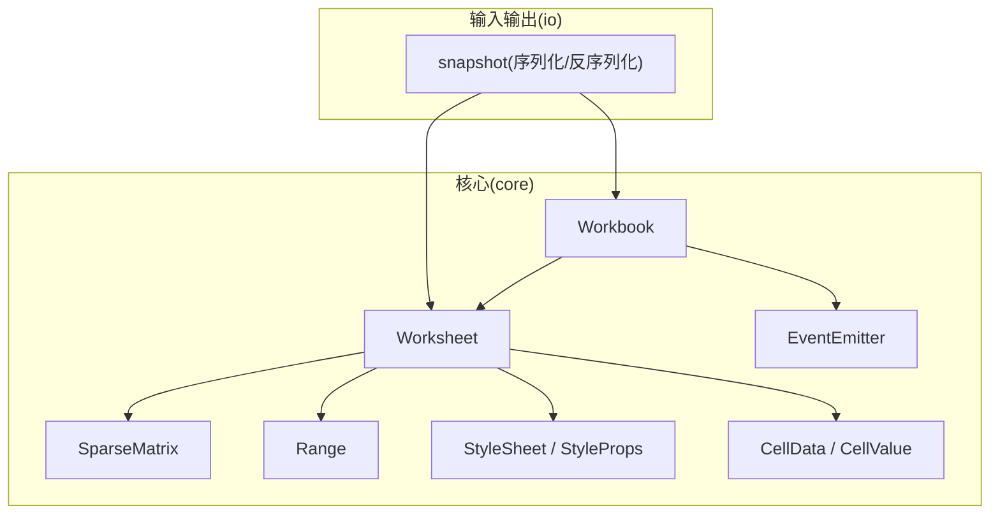
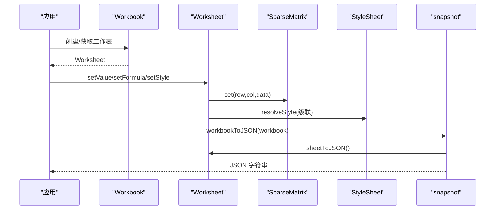
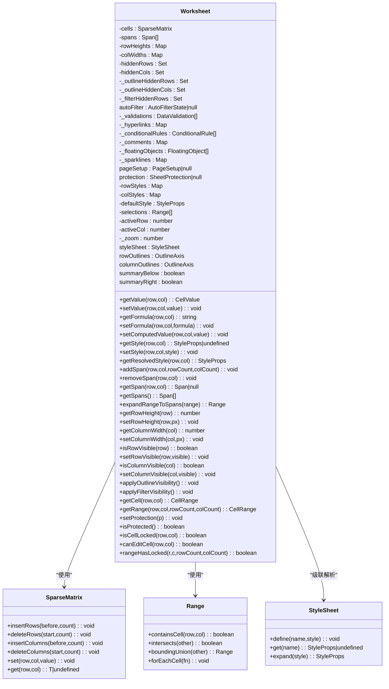
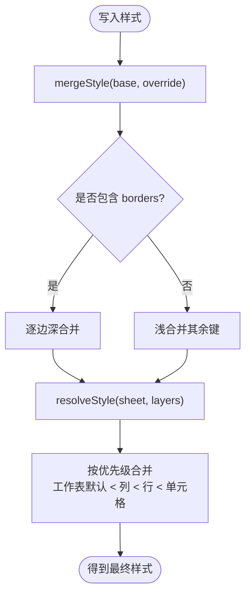
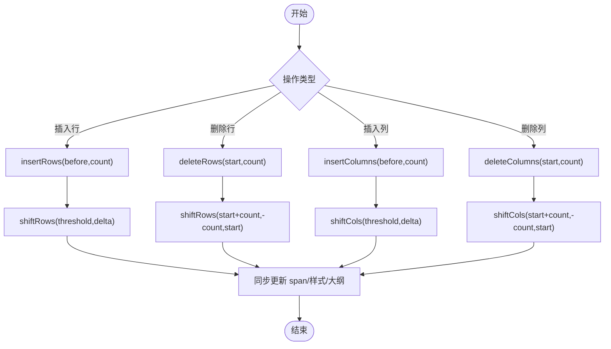
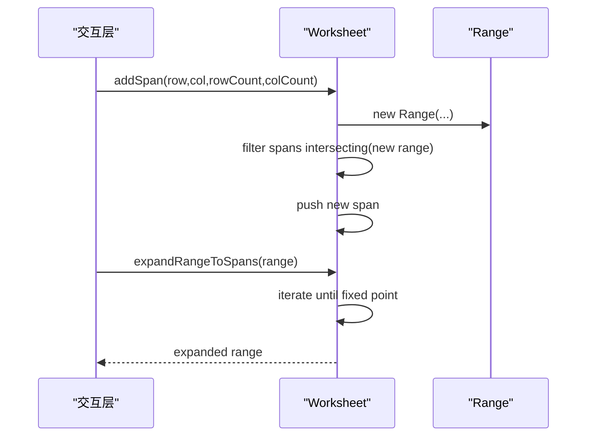
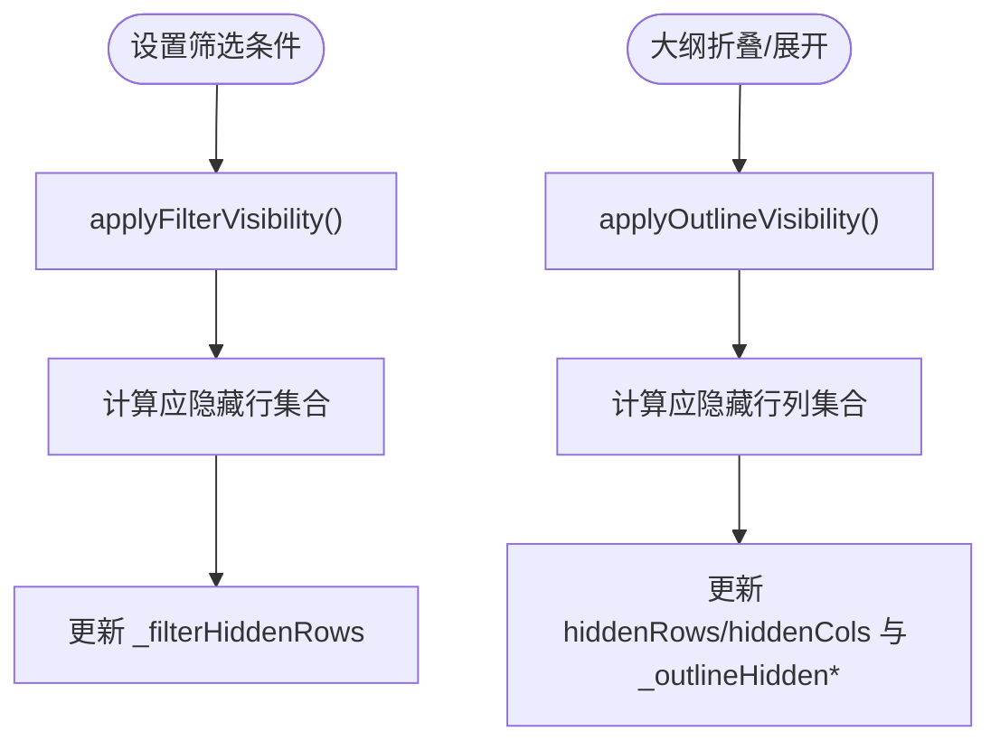
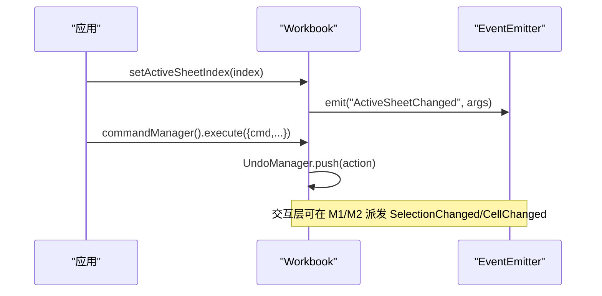
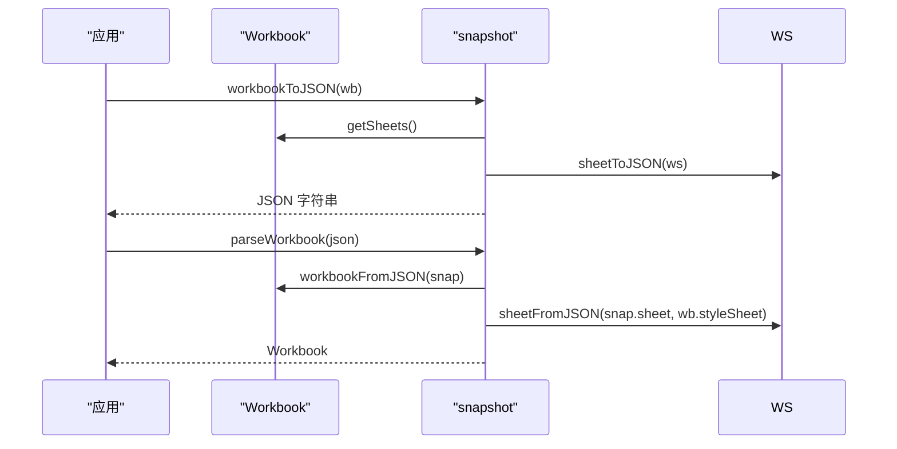
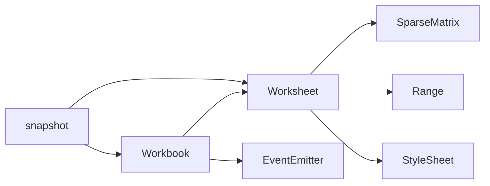

# 工作表操作

<cite>
**本文引用的文件**
- [Worksheet.ts](file://cmx-mega-sheet/src/core/Worksheet.ts)
- [Cell.ts](file://cmx-mega-sheet/src/core/Cell.ts)
- [Style.ts](file://cmx-mega-sheet/src/core/Style.ts)
- [SparseMatrix.ts](file://cmx-mega-sheet/src/core/SparseMatrix.ts)
- [Range.ts](file://cmx-mega-sheet/src/core/Range.ts)
- [Workbook.ts](file://cmx-mega-sheet/src/core/Workbook.ts)
- [EventEmitter.ts](file://cmx-mega-sheet/src/core/EventEmitter.ts)
- [snapshot.ts](file://cmx-mega-sheet/src/io/snapshot.ts)
</cite>

## 目录
1. [简介](#简介)
2. [项目结构](#项目结构)
3. [核心组件](#核心组件)
4. [架构总览](#架构总览)
5. [详细组件分析](#详细组件分析)
6. [依赖关系分析](#依赖关系分析)
7. [性能考量](#性能考量)
8. [故障排查指南](#故障排查指南)
9. [结论](#结论)
10. [附录：常见场景与最佳实践](#附录常见场景与最佳实践)

## 简介
本技术文档聚焦于工作表操作模块，围绕 Worksheet 类的设计与实现，系统阐述单元格数据存储结构、行列操作、样式应用、事件机制、序列化/反序列化与持久化策略，并给出批量数据操作的性能优化建议与常见场景的最佳实践。该模块以无渲染的数据模型为核心，提供稳定、可序列化的工作表状态管理，并与样式系统、公式引擎、IO 层解耦协作。

## 项目结构
工作表操作位于 cmx-mega-sheet 的 core 与 io 子系统中，核心由 Worksheet、Cell、Style、Range、SparseMatrix 等构成；Workbook 作为顶层容器管理多工作表、命名区域、命令与撤销、事件总线；io/snapshot 提供中性快照格式用于持久化。

图表来源
- [Worksheet.ts:435-492](file://cmx-mega-sheet/src/core/Worksheet.ts#L435-L492)
- [Workbook.ts:174-269](file://cmx-mega-sheet/src/core/Workbook.ts#L174-L269)
- [snapshot.ts:112-188](file://cmx-mega-sheet/src/io/snapshot.ts#L112-L188)

章节来源
- [Worksheet.ts:1-14](file://cmx-mega-sheet/src/core/Worksheet.ts#L1-L14)
- [Workbook.ts:1-12](file://cmx-mega-sheet/src/core/Workbook.ts#L1-L12)
- [snapshot.ts:1-10](file://cmx-mega-sheet/src/io/snapshot.ts#L1-L10)

## 核心组件
- Worksheet：工作表数据模型，承载单元格值/公式/富文本/样式、合并区、行列元数据、选区、大纲分组、自动筛选、数据验证、超链接、条件格式、批注、浮动对象、迷你图、页面设置、保护态等。
- Cell：单元格数据记录（值、公式、样式、富文本）及工具函数（值归一化、公式归一化、导入公式清洗）。
- Style：样式属性集、命名样式表、级联解析与合并。
- Range：矩形区域不可变对象，提供包含、相交、并集、遍历等几何运算。
- SparseMatrix：稀疏二维存储，支持行列增删时的坐标搬移与删除区间清理。
- Workbook：工作簿容器，管理多工作表、命名区域、命令/撤销、重算钩子、事件总线。
- EventEmitter：类型化事件总线，提供 bind/unbind/emit。
- snapshot：中性快照格式，实现 workbook/worksheet 的序列化与反序列化。

章节来源
- [Cell.ts:14-36](file://cmx-mega-sheet/src/core/Cell.ts#L14-L36)
- [Style.ts:68-100](file://cmx-mega-sheet/src/core/Style.ts#L68-L100)
- [Range.ts:16-33](file://cmx-mega-sheet/src/core/Range.ts#L16-L33)
- [SparseMatrix.ts:12-17](file://cmx-mega-sheet/src/core/SparseMatrix.ts#L12-L17)
- [Workbook.ts:174-269](file://cmx-mega-sheet/src/core/Workbook.ts#L174-L269)
- [EventEmitter.ts:13-59](file://cmx-mega-sheet/src/core/EventEmitter.ts#L13-L59)
- [snapshot.ts:23-109](file://cmx-mega-sheet/src/io/snapshot.ts#L23-L109)

## 架构总览
工作表操作采用“数据模型 + 样式系统 + IO 快照”的分层设计：
- Worksheet 维护所有数据状态，通过 SparseMatrix 高效存储非空单元格，并通过 Range 表达区域操作。
- Style 提供命名样式表与级联解析，Worksheet 在读取最终样式时按“工作表默认 < 列默认 < 行默认 < 单元格”优先级合并。
- Workbook 聚合多个 Worksheet，并提供事件、命令/撤销、命名区域与重算钩子。
- snapshot 将 Worksheet/Workbook 的状态序列化为中性 JSON，保证无损往返与跨版本兼容。

图表来源
- [Workbook.ts:263-269](file://cmx-mega-sheet/src/core/Workbook.ts#L263-L269)
- [Worksheet.ts:534-631](file://cmx-mega-sheet/src/core/Worksheet.ts#L534-L631)
- [Style.ts:223-233](file://cmx-mega-sheet/src/core/Style.ts#L223-L233)
- [snapshot.ts:272-304](file://cmx-mega-sheet/src/io/snapshot.ts#L272-L304)

## 详细组件分析

### Worksheet：工作表数据模型
- 数据结构
  - 单元格：使用 SparseMatrix<CellData> 存储，CellData 包含 value/formula/style/rich。
  - 合并区：Span[]，左上角持值，支持覆盖、查询、扩展至合并区。
  - 行列元数据：Map/Set 分别存储行高、列宽、手动隐藏行列。
  - 大纲分组：OutlineAxis 维护多级嵌套分组与折叠态，派生 level 与隐藏集合。
  - 自动筛选：AutoFilterState 保存区域与每列条件，applyFilterVisibility 刷新可见性。
  - 数据验证/超链接/条件格式/批注/浮动对象/迷你图/页面设置/保护态：各自独立存储，按区域或格键索引。
- 行列操作
  - addRows/deleteRows/addColumns/deleteColumns：委托 SparseMatrix 进行坐标搬移，同步更新 span、行高/列宽、行/列样式、大纲分组起点。
  - setRowCount/setColumnCount：缩减时丢弃越界数据。
- 单元格操作
  - getValue/setValue：值归一化，设值清除公式与富文本（对齐编辑覆盖语义）。
  - getFormula/setFormula：公式归一化，清空公式保留 value/style。
  - setComputedValue：为公式格回填计算值，不破坏公式源。
  - getRichText/setRichText：富文本与纯文本并存，value 存拼接纯文本供公式/查找/排序兜底。
  - getStyle/setStyle/getResolvedStyle：样式级联解析（工作表默认 < 列 < 行 < 单元格），支持命名样式展开。
- 选区与活动单元
  - selections 与 activeRow/activeCol，getActiveAddr 返回 A1 地址。
- 保护与锁定
  - SheetProtection 控制保护态；isCellLocked 基于 resolvedStyle.locked；canEditCell 判断是否允许编辑。
- 事件与通知
  - Worksheet 本身不直接派发业务事件；Workbook 通过 EventEmitter 派发工作簿级事件（如 ActiveSheetChanged、SheetAdded/Removed）。
  - 交互层可在 M1/M2 阶段基于 Workbook 的事件总线派发 SelectionChanged/CellChanged 等具体事件。

图表来源
- [Worksheet.ts:435-492](file://cmx-mega-sheet/src/core/Worksheet.ts#L435-L492)
- [Worksheet.ts:530-631](file://cmx-mega-sheet/src/core/Worksheet.ts#L530-L631)
- [Worksheet.ts:688-738](file://cmx-mega-sheet/src/core/Worksheet.ts#L688-L738)
- [Worksheet.ts:740-790](file://cmx-mega-sheet/src/core/Worksheet.ts#L740-L790)
- [Worksheet.ts:792-800](file://cmx-mega-sheet/src/core/Worksheet.ts#L792-L800)
- [SparseMatrix.ts:89-130](file://cmx-mega-sheet/src/core/SparseMatrix.ts#L89-L130)
- [Range.ts:85-127](file://cmx-mega-sheet/src/core/Range.ts#L85-L127)
- [Style.ts:162-201](file://cmx-mega-sheet/src/core/Style.ts#L162-L201)

章节来源
- [Worksheet.ts:29-236](file://cmx-mega-sheet/src/core/Worksheet.ts#L29-L236)
- [Worksheet.ts:435-492](file://cmx-mega-sheet/src/core/Worksheet.ts#L435-L492)
- [Worksheet.ts:530-631](file://cmx-mega-sheet/src/core/Worksheet.ts#L530-L631)
- [Worksheet.ts:688-738](file://cmx-mega-sheet/src/core/Worksheet.ts#L688-L738)
- [Worksheet.ts:740-790](file://cmx-mega-sheet/src/core/Worksheet.ts#L740-L790)
- [Worksheet.ts:792-800](file://cmx-mega-sheet/src/core/Worksheet.ts#L792-L800)

### 单元格数据与样式系统
- 单元格数据
  - CellValue：string | number | boolean | null。
  - RichText：runs 数组，value 同步存纯文本以便公式/查找/排序/TSV 兜底。
  - 公式：normalizeFormula 去除前导 '='；sanitizeImportedFormula 清洗 Excel 导入伪前缀。
- 样式系统
  - StyleProps：字体、对齐、颜色、边框、填充、锁定等；支持命名样式引用 styleName。
  - mergeStyle：浅合并，borders 逐边深合并。
  - resolveStyle：按“工作表默认 < 列默认 < 行默认 < 单元格”顺序级联解析，命名样式先展开。
  - StyleSheet：命名样式表，定义/获取/移除/序列化/反序列化。

图表来源
- [Style.ts:128-156](file://cmx-mega-sheet/src/core/Style.ts#L128-L156)
- [Style.ts:223-233](file://cmx-mega-sheet/src/core/Style.ts#L223-L233)

章节来源
- [Cell.ts:14-74](file://cmx-mega-sheet/src/core/Cell.ts#L14-L74)
- [Style.ts:68-100](file://cmx-mega-sheet/src/core/Style.ts#L68-L100)
- [Style.ts:128-156](file://cmx-mega-sheet/src/core/Style.ts#L128-L156)
- [Style.ts:162-201](file://cmx-mega-sheet/src/core/Style.ts#L162-L201)
- [Style.ts:223-233](file://cmx-mega-sheet/src/core/Style.ts#L223-L233)

### 行列操作与数据搬移
- 插入/删除行列
  - SparseMatrix.insertRows/deleteRows/insertColumns/deleteColumns：对受影响区域整体平移坐标，删除区间内槽位丢弃。
  - Worksheet 在调用后同步更新 span、行高/列宽、行/列样式、大纲分组起点。
- 缩减行列数
  - setRowCount/setColumnCount：缩减时丢弃越界数据。

图表来源
- [SparseMatrix.ts:89-130](file://cmx-mega-sheet/src/core/SparseMatrix.ts#L89-L130)
- [SparseMatrix.ts:138-166](file://cmx-mega-sheet/src/core/SparseMatrix.ts#L138-L166)
- [Worksheet.ts:512-527](file://cmx-mega-sheet/src/core/Worksheet.ts#L512-L527)

章节来源
- [SparseMatrix.ts:89-166](file://cmx-mega-sheet/src/core/SparseMatrix.ts#L89-L166)
- [Worksheet.ts:512-527](file://cmx-mega-sheet/src/core/Worksheet.ts#L512-L527)

### 选区与合并区
- 选区：SelectionModel 未在本节详述，Worksheet 维护 selections 与 activeRow/activeCol，支持多选与活动单元地址。
- 合并区：Span[]，新增时移除与之相交的旧 span；expandRangeToSpans 迭代扩展到不动点，确保选中/命中作用于整个合并区。

图表来源
- [Worksheet.ts:688-738](file://cmx-mega-sheet/src/core/Worksheet.ts#L688-L738)
- [Range.ts:85-127](file://cmx-mega-sheet/src/core/Range.ts#L85-L127)

章节来源
- [Worksheet.ts:688-738](file://cmx-mega-sheet/src/core/Worksheet.ts#L688-L738)
- [Range.ts:85-127](file://cmx-mega-sheet/src/core/Range.ts#L85-L127)

### 自动筛选与大纲分组
- 自动筛选：AutoFilterState 保存区域与每列条件；applyFilterVisibility 根据条件刷新行可见性，与手动/大纲隐藏分账。
- 大纲分组：OutlineAxis 维护多级嵌套分组与折叠态，level 自动派生；applyOutlineVisibility 刷新可见性，汇总位置由 summaryBelow/summaryRight 决定。

图表来源
- [Worksheet.ts:775-800](file://cmx-mega-sheet/src/core/Worksheet.ts#L775-L800)
- [Worksheet.ts:248-388](file://cmx-mega-sheet/src/core/Worksheet.ts#L248-L388)

章节来源
- [Worksheet.ts:248-388](file://cmx-mega-sheet/src/core/Worksheet.ts#L248-L388)
- [Worksheet.ts:775-800](file://cmx-mega-sheet/src/core/Worksheet.ts#L775-L800)

### 事件机制与数据变更通知
- 工作簿级事件：Workbook.events 基于 EventEmitter，派发 ActiveSheetChanged、SheetAdded、SheetRemoved。
- 单元格/选区事件：M1/M2 阶段由渲染/交互层在 EventEmitter 上派发 SelectionChanged/CellChanged 等具体事件，Worksheet 本身不直接派发业务事件。
- 重算钩子：Workbook.setRecalcHook/requestRecalc 与增量重算 requestRecalcCells，避免 core→formula 模块环。

图表来源
- [Workbook.ts:288-323](file://cmx-mega-sheet/src/core/Workbook.ts#L288-L323)
- [Workbook.ts:360-373](file://cmx-mega-sheet/src/core/Workbook.ts#L360-L373)
- [EventEmitter.ts:18-52](file://cmx-mega-sheet/src/core/EventEmitter.ts#L18-L52)

章节来源
- [Workbook.ts:288-323](file://cmx-mega-sheet/src/core/Workbook.ts#L288-L323)
- [Workbook.ts:360-373](file://cmx-mega-sheet/src/core/Workbook.ts#L360-L373)
- [EventEmitter.ts:18-52](file://cmx-mega-sheet/src/core/EventEmitter.ts#L18-L52)

### 序列化、反序列化与持久化
- 中性快照：snapshot.ts 定义 SNAPSHOT_FORMAT 与版本，workbookToJSON/sheetToJSON 将 Worksheet/Workbook 序列化为紧凑 JSON；workbookFromJSON/sheetFromJSON 重建状态。
- 持久化：后端将 doc_content 存为 OPAQUE bytea + doc_format 判别串；megasheet 使用 "cmx-megasheet" 格式。
- 特性：只序列化非默认值（稀疏）、命名样式共享、大纲 level 派生、保护/页面设置/筛选/验证/条件格式/批注/浮动对象/迷你图等完整状态。

图表来源
- [snapshot.ts:272-304](file://cmx-mega-sheet/src/io/snapshot.ts#L272-L304)
- [snapshot.ts:112-188](file://cmx-mega-sheet/src/io/snapshot.ts#L112-L188)
- [snapshot.ts:201-269](file://cmx-mega-sheet/src/io/snapshot.ts#L201-L269)

章节来源
- [snapshot.ts:1-10](file://cmx-mega-sheet/src/io/snapshot.ts#L1-L10)
- [snapshot.ts:112-188](file://cmx-mega-sheet/src/io/snapshot.ts#L112-L188)
- [snapshot.ts:201-269](file://cmx-mega-sheet/src/io/snapshot.ts#L201-L269)
- [snapshot.ts:272-304](file://cmx-mega-sheet/src/io/snapshot.ts#L272-L304)

## 依赖关系分析
- Worksheet 依赖 SparseMatrix 进行高效存储与坐标搬移，依赖 Range 进行区域代数运算，依赖 Style 进行样式级联解析。
- Workbook 依赖 Worksheet 集合、EventEmitter 事件总线、CommandManager/UndoManager 命令与撤销。
- snapshot 依赖 Worksheet/Workbook 暴露的读取接口进行序列化，反向依赖构造器与 setter 进行重建。

图表来源
- [Worksheet.ts:435-492](file://cmx-mega-sheet/src/core/Worksheet.ts#L435-L492)
- [Workbook.ts:174-269](file://cmx-mega-sheet/src/core/Workbook.ts#L174-L269)
- [snapshot.ts:112-188](file://cmx-mega-sheet/src/io/snapshot.ts#L112-L188)

章节来源
- [Worksheet.ts:435-492](file://cmx-mega-sheet/src/core/Worksheet.ts#L435-L492)
- [Workbook.ts:174-269](file://cmx-mega-sheet/src/core/Workbook.ts#L174-L269)
- [snapshot.ts:112-188](file://cmx-mega-sheet/src/io/snapshot.ts#L112-L188)

## 性能考量
- 稀疏存储：SparseMatrix 仅存储非空槽位，大幅降低内存占用；行列增删通过一次性重建 map 避免碰撞，时间复杂度与受影响区域规模相关。
- 批量操作优化
  - 使用 CellRange.value/formula/style 对区域批量赋值，减少重复 API 调用。
  - 在大量写入前调用 Workbook.suspendPaint() 抑制绘制，完成后 resumePaint()，避免频繁重绘。
  - 使用 setComputedValue 回填公式计算结果，避免破坏公式源。
  - 利用 applyOutlineVisibility/applyFilterVisibility 集中刷新可见性，避免多次局部更新。
- 样式级联：resolveStyle 仅在读取时计算，写入时保持稀疏存储，减少冗余。
- 序列化：snapshot 只写非默认值，减少 JSON 体积；cells 按行列升序排序，利于 diff 与缓存。

[本节为通用性能指导，无需特定文件引用]

## 故障排查指南
- 公式与值冲突
  - 现象：设置值后公式丢失。
  - 原因：setValue 会清除公式（对齐 Excel 编辑覆盖语义）。
  - 处理：如需保留公式，使用 setComputedValue 回填显示值。
  - 参考路径：[Worksheet.ts:534-548](file://cmx-mega-sheet/src/core/Worksheet.ts#L534-L548)、[Worksheet.ts:595-603](file://cmx-mega-sheet/src/core/Worksheet.ts#L595-L603)
- 富文本与标量值
  - 现象：富文本写入后 value 变化。
  - 原因：setRichText 同步 value 为纯文本拼接，供公式/查找/排序兜底。
  - 处理：读取 value 时注意其为纯文本；需要富文本时使用 getRichText。
  - 参考路径：[Worksheet.ts:555-569](file://cmx-mega-sheet/src/core/Worksheet.ts#L555-L569)、[Cell.ts:38-41](file://cmx-mega-sheet/src/core/Cell.ts#L38-L41)
- 行列增删导致数据错位
  - 现象：插入/删除行列后数据位置异常。
  - 原因：需确保调用 Worksheet 的 addRows/deleteRows/addColumns/deleteColumns，内部委托 SparseMatrix 进行坐标搬移。
  - 处理：避免直接操作底层矩阵；检查 span/样式/大纲同步更新。
  - 参考路径：[SparseMatrix.ts:89-130](file://cmx-mega-sheet/src/core/SparseMatrix.ts#L89-L130)、[Worksheet.ts:512-527](file://cmx-mega-sheet/src/core/Worksheet.ts#L512-L527)
- 保护态下编辑失败
  - 现象：受保护工作表中无法编辑锁定格。
  - 原因：isCellLocked 基于 resolvedStyle.locked；canEditCell 在未保护时可编辑，保护时仅解锁格可编辑。
  - 处理：设置 unlocked 样式或调整保护开关 allow*。
  - 参考路径：[Worksheet.ts:633-661](file://cmx-mega-sheet/src/core/Worksheet.ts#L633-L661)、[Style.ts:97-100](file://cmx-mega-sheet/src/core/Style.ts#L97-L100)
- 筛选与大纲隐藏冲突
  - 现象：筛选/大纲折叠后手动隐藏的行被误恢复。
  - 原因：applyFilterVisibility/applyOutlineVisibility 分别维护 _filterHiddenRows/_outlineHiddenRows，互不干扰。
  - 处理：确保在修改筛选/大纲后调用对应 apply*Visibility。
  - 参考路径：[Worksheet.ts:775-800](file://cmx-mega-sheet/src/core/Worksheet.ts#L775-L800)

章节来源
- [Worksheet.ts:534-603](file://cmx-mega-sheet/src/core/Worksheet.ts#L534-L603)
- [Worksheet.ts:633-661](file://cmx-mega-sheet/src/core/Worksheet.ts#L633-L661)
- [Worksheet.ts:775-800](file://cmx-mega-sheet/src/core/Worksheet.ts#L775-L800)
- [SparseMatrix.ts:89-130](file://cmx-mega-sheet/src/core/SparseMatrix.ts#L89-L130)
- [Style.ts:97-100](file://cmx-mega-sheet/src/core/Style.ts#L97-L100)

## 结论
Worksheet 模块以稀疏矩阵为基础，提供了完整的单元格数据、样式、行列结构、选区、合并区、筛选、大纲、验证、条件格式、批注、浮动对象、迷你图、页面设置与保护态管理能力。通过 Workbook 的事件与命令/撤销机制，以及与 snapshot 的中性序列化，实现了高性能、可扩展且可持久化的工作表操作体系。建议在批量操作中结合 CellRange、suspendPaint/resumePaint、以及集中式可见性刷新，以获得更佳性能与一致性。

[本节为总结性内容，无需特定文件引用]

## 附录：常见场景与最佳实践
- 批量设置区域值与样式
  - 使用 ws.getRange(row,col,rowCount,colCount).value(v).style(patch) 链式操作，减少重复调用。
  - 参考路径：[Worksheet.ts:394-433](file://cmx-mega-sheet/src/core/Worksheet.ts#L394-L433)
- 公式与计算值分离
  - 设置公式后，使用 setComputedValue 回填计算值，避免破坏公式源。
  - 参考路径：[Worksheet.ts:595-603](file://cmx-mega-sheet/src/core/Worksheet.ts#L595-L603)
- 行列增删后的状态同步
  - 始终通过 Worksheet 的 addRows/deleteRows/addColumns/deleteColumns 操作，确保 span/样式/大纲同步。
  - 参考路径：[Worksheet.ts:512-527](file://cmx-mega-sheet/src/core/Worksheet.ts#L512-L527)、[SparseMatrix.ts:89-130](file://cmx-mega-sheet/src/core/SparseMatrix.ts#L89-L130)
- 样式级联与命名样式
  - 使用 StyleSheet.define 定义命名样式，CellData.style 引用 styleName；读取时使用 getResolvedStyle 获取最终样式。
  - 参考路径：[Style.ts:162-201](file://cmx-mega-sheet/src/core/Style.ts#L162-L201)、[Worksheet.ts:623-631](file://cmx-mega-sheet/src/core/Worksheet.ts#L623-L631)
- 筛选与大纲可见性刷新
  - 修改筛选条件或大纲折叠后，调用 applyFilterVisibility/applyOutlineVisibility 刷新可见性。
  - 参考路径：[Worksheet.ts:775-800](file://cmx-mega-sheet/src/core/Worksheet.ts#L775-L800)
- 序列化与持久化
  - 使用 workbookToJSON/sheetToJSON 生成中性快照；使用 workbookFromJSON/sheetFromJSON 重建状态。
  - 参考路径：[snapshot.ts:272-304](file://cmx-mega-sheet/src/io/snapshot.ts#L272-L304)、[snapshot.ts:112-188](file://cmx-mega-sheet/src/io/snapshot.ts#L112-L188)

章节来源
- [Worksheet.ts:394-433](file://cmx-mega-sheet/src/core/Worksheet.ts#L394-L433)
- [Worksheet.ts:595-603](file://cmx-mega-sheet/src/core/Worksheet.ts#L595-L603)
- [Worksheet.ts:512-527](file://cmx-mega-sheet/src/core/Worksheet.ts#L512-L527)
- [Style.ts:162-201](file://cmx-mega-sheet/src/core/Style.ts#L162-L201)
- [Worksheet.ts:623-631](file://cmx-mega-sheet/src/core/Worksheet.ts#L623-L631)
- [Worksheet.ts:775-800](file://cmx-mega-sheet/src/core/Worksheet.ts#L775-L800)
- [snapshot.ts:272-304](file://cmx-mega-sheet/src/io/snapshot.ts#L272-L304)
- [snapshot.ts:112-188](file://cmx-mega-sheet/src/io/snapshot.ts#L112-L188)