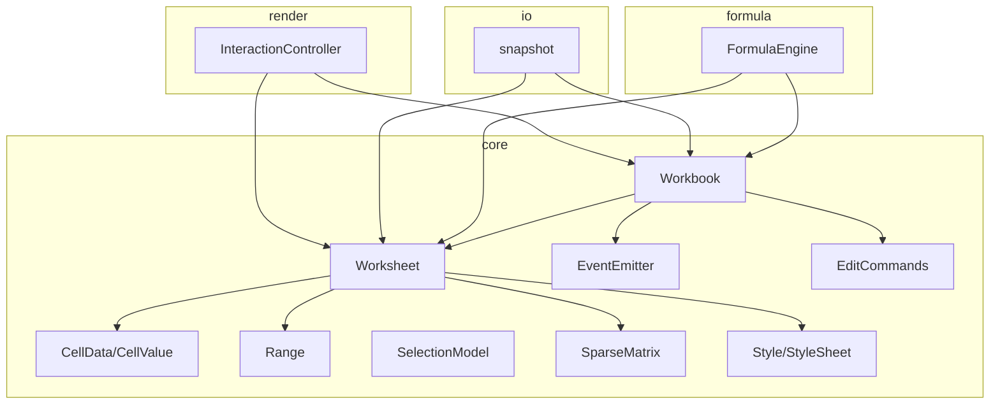
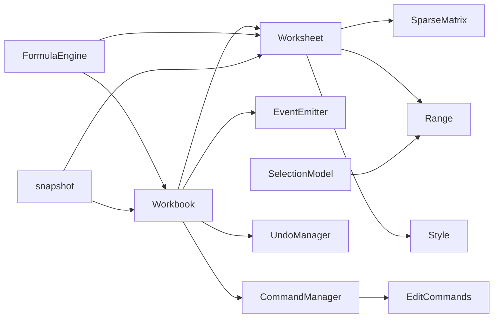

# 核心引擎架构

<cite>
**本文引用的文件**
- [Workbook.ts](file://cmx-mega-sheet/src/core/Workbook.ts)
- [Worksheet.ts](file://cmx-mega-sheet/src/core/Worksheet.ts)
- [Cell.ts](file://cmx-mega-sheet/src/core/Cell.ts)
- [Range.ts](file://cmx-mega-sheet/src/core/Range.ts)
- [SelectionModel.ts](file://cmx-mega-sheet/src/core/SelectionModel.ts)
- [SparseMatrix.ts](file://cmx-mega-sheet/src/core/SparseMatrix.ts)
- [Style.ts](file://cmx-mega-sheet/src/core/Style.ts)
- [EventEmitter.ts](file://cmx-mega-sheet/src/core/EventEmitter.ts)
- [EditCommands.ts](file://cmx-mega-sheet/src/core/EditCommands.ts)
- [FormulaEngine.ts](file://cmx-mega-sheet/src/formula/Formul aEngine.ts)
- [snapshot.ts](file://cmx-mega-sheet/src/io/snapshot.ts)
- [index.ts](file://cmx-mega-sheet/src/index.ts)
</cite>

## 目录
1. [简介](#简介)
2. [项目结构](#项目结构)
3. [核心组件](#核心组件)
4. [架构总览](#架构总览)
5. [详细组件分析](#详细组件分析)
6. [依赖关系分析](#依赖关系分析)
7. [性能与内存优化](#性能与内存优化)
8. [故障排查指南](#故障排查指南)
9. [结论](#结论)
10. [附录：API 使用示例与扩展点](#附录api-使用示例与扩展点)

## 简介
本技术文档聚焦电子表格核心引擎（cmx-mega-sheet）的架构设计与实现，围绕工作簿(Workbook)、工作表(Worksheet)、单元格(Cell)、范围(Range)、选择模型(SelectionModel)展开，系统阐述数据模型、生命周期、范围操作、选择机制、持久化策略、内存优化、并发访问控制、核心 API 用法与性能调优，并说明与其他模块（渲染、公式、IO、元素）的集成方式与扩展点。

## 项目结构
核心引擎采用分层组织：
- core：数据模型与基础能力（Workbook、Worksheet、Cell、Range、SelectionModel、样式、事件总线、稀疏矩阵、编辑命令等）
- formula：公式解析、求值、依赖图与增量重算
- io：中性快照、XLSX/CSV/HTML/PDF 导出导入
- render：几何、视口、绘制、交互控制器
- element：自定义元素封装

图表来源
- [Workbook.ts:174-397](file://cmx-mega-sheet/src/core/Workbook.ts#L174-L397)
- [Worksheet.ts:435-800](file://cmx-mega-sheet/src/core/Worksheet.ts#L435-L800)
- [Cell.ts:14-74](file://cmx-mega-sheet/src/core/Cell.ts#L14-L74)
- [Range.ts:16-166](file://cmx-mega-sheet/src/core/Range.ts#L16-L166)
- [SelectionModel.ts:23-291](file://cmx-mega-sheet/src/core/SelectionModel.ts#L23-L291)
- [SparseMatrix.ts:12-175](file://cmx-mega-sheet/src/core/SparseMatrix.ts#L12-L175)
- [Style.ts:162-234](file://cmx-mega-sheet/src/core/Style.ts#L162-L234)
- [EventEmitter.ts:13-60](file://cmx-mega-sheet/src/core/EventEmitter.ts#L13-L60)
- [EditCommands.ts:109-200](file://cmx-mega-sheet/src/core/EditCommands.ts#L109-L200)
- [FormulaEngine.ts:36-200](file://cmx-mega-sheet/src/formula/Formul aEngine.ts#L36-L200)
- [snapshot.ts:112-200](file://cmx-mega-sheet/src/io/snapshot.ts#L112-L200)

章节来源
- [index.ts:1-298](file://cmx-mega-sheet/src/index.ts#L1-L298)

## 核心组件
- Workbook：工作簿容器，管理多工作表、活动表、命名区域、撤销/命令、重算钩子、绘制抑制计数。
- Worksheet：工作表数据模型，承载单元格、合并区、行列元数据、大纲分组、筛选、验证、条件格式、批注、浮动对象、页面设置、保护态等。
- Cell：单元格数据记录（值、公式、样式、富文本），提供值归一化、公式清洗等工具。
- Range：不可变矩形区域对象，提供包含、相交、并集、遍历等代数运算。
- SelectionModel：选区模型，维护多区选择、活动格、键盘导航几何（移动、扩展、跳边、翻页）。
- SparseMatrix：稀疏二维存储，支持行列增删时的坐标搬移与删除区间清理。
- Style/StyleSheet：样式属性集合、命名样式表、级联解析与合并。
- EventEmitter：类型化事件总线，用于工作簿级事件派发。
- EditCommands：可撤销编辑命令体系（快照命令、结构编辑、填充、粘贴、排序等）。
- FormulaEngine：公式引擎编排层，负责全量/增量重算、依赖图构建、环检测、计算值回填。
- snapshot：中性快照序列化/反序列化，支撑持久化与跨版本迁移。

章节来源
- [Workbook.ts:174-397](file://cmx-mega-sheet/src/core/Workbook.ts#L174-L397)
- [Worksheet.ts:435-800](file://cmx-mega-sheet/src/core/Worksheet.ts#L435-L800)
- [Cell.ts:14-74](file://cmx-mega-sheet/src/core/Cell.ts#L14-L74)
- [Range.ts:16-166](file://cmx-mega-sheet/src/core/Range.ts#L16-L166)
- [SelectionModel.ts:23-291](file://cmx-mega-sheet/src/core/SelectionModel.ts#L23-L291)
- [SparseMatrix.ts:12-175](file://cmx-mega-sheet/src/core/SparseMatrix.ts#L12-L175)
- [Style.ts:162-234](file://cmx-mega-sheet/src/core/Style.ts#L162-L234)
- [EventEmitter.ts:13-60](file://cmx-mega-sheet/src/core/EventEmitter.ts#L13-L60)
- [EditCommands.ts:109-200](file://cmx-mega-sheet/src/core/EditCommands.ts#L109-L200)
- [FormulaEngine.ts:36-200](file://cmx-mega-sheet/src/formula/Formul aEngine.ts#L36-L200)
- [snapshot.ts:112-200](file://cmx-mega-sheet/src/io/snapshot.ts#L112-L200)

## 架构总览
核心引擎以 Workbook 为顶层，持有多个 Worksheet；每个 Worksheet 通过 SparseMatrix 稀疏存储 CellData，并通过 Range 表达区域操作；SelectionModel 独立维护选区与活动格；Style/StyleSheet 提供样式级联；EventEmitter 提供事件分发；EditCommands 提供可撤销编辑；FormulaEngine 通过 Workbook 暴露的重算钩子接入，进行全量/增量重算；snapshot 提供中性快照用于持久化。

```mermaid
classDiagram
class Workbook {
+getSheetCount()
+addSheet()
+removeSheet()
+commandManager()
+undoManager()
+requestRecalc()
+requestRecalcCells()
}
class Worksheet {
+getValue()/setValue()
+getFormula()/setFormula()
+getStyle()/setStyle()
+getRange()
+addSpan/removeSpan()
+rowOutlines/columnOutlines
+autoFilter
+protection
}
class CellData {
+value
+formula
+style
+rich
}
class Range {
+containsCell()
+intersects()
+boundingUnion()
+forEachCell()
}
class SelectionModel {
+select()
+extend()
+move()
+jumpToEdge()
}
class SparseMatrix {
+insertRows/deleteRows()
+insertColumns/deleteColumns()
}
class StyleSheet {
+define()
+expand()
}
class FormulaEngine {
+recalcAll()
+setReportValueMap()
}
Workbook --> Worksheet : "管理"
Worksheet --> CellData : "存储"
Worksheet --> Range : "操作"
Worksheet --> SparseMatrix : "底层存储"
Worksheet --> StyleSheet : "样式级联"
Workbook --> FormulaEngine : "重算钩子"
SelectionModel --> Range : "基于"
```

图表来源
- [Workbook.ts:174-397](file://cmx-mega-sheet/src/core/Workbook.ts#L174-L397)
- [Worksheet.ts:435-800](file://cmx-mega-sheet/src/core/Worksheet.ts#L435-L800)
- [Cell.ts:14-74](file://cmx-mega-sheet/src/core/Cell.ts#L14-L74)
- [Range.ts:16-166](file://cmx-mega-sheet/src/core/Range.ts#L16-L166)
- [SelectionModel.ts:23-291](file://cmx-mega-sheet/src/core/SelectionModel.ts#L23-L291)
- [SparseMatrix.ts:12-175](file://cmx-mega-sheet/src/core/SparseMatrix.ts#L12-L175)
- [Style.ts:162-234](file://cmx-mega-sheet/src/core/Style.ts#L162-L234)
- [FormulaEngine.ts:36-200](file://cmx-mega-sheet/src/formula/Formul aEngine.ts#L36-L200)

## 详细组件分析

### 工作簿(Workbook)
- 职责：管理工作表集合、活动表切换、命名区域定义/解析、撤销/命令管理、重算钩子注册、绘制抑制计数。
- 关键设计：
  - 命名区域：按 scope+name 唯一键存储 refersTo，解析时优先 sheet 级再 workbook 级。
  - 重算钩子：Workbook 暴露 setRecalcHook/setRecalcCellsHook，FormulaEngine 装配后由编辑触发全量或增量重算。
  - 撤销/命令：CommandManager 将可撤销命令包装为 UndoableAction 入栈；UndoManager 维护 undo/redo 栈并裁剪大小。
  - 事件：ActiveSheetChanged、SheetAdded、SheetRemoved 等通过 EventEmitter 派发。
- 并发与一致性：单线程 JS 环境，无显式锁；通过命令与快照保证状态一致性与可回滚。

章节来源
- [Workbook.ts:174-397](file://cmx-mega-sheet/src/core/Workbook.ts#L174-L397)
- [EventEmitter.ts:13-60](file://cmx-mega-sheet/src/core/EventEmitter.ts#L13-L60)

### 工作表(Worksheet)
- 职责：单元格读写（值/公式/样式/富文本）、合并区、行列结构与可见性、大纲分组、自动筛选、数据验证、超链接、条件格式、批注、浮动对象、迷你图、页面设置、保护态。
- 关键设计：
  - 稀疏存储：基于 SparseMatrix 仅存非空槽位，行列增删时同步搬移坐标并清理区间。
  - 样式级联：resolveStyle 从 sheet 默认→列→行→单元格逐层合并，支持命名样式展开。
  - 合并区扩展：expandRangeToSpans 迭代到不动点，确保选中/命中作用于整个合并区。
  - 大纲分组：OutlineAxis 维护多级嵌套分组与折叠态，派生 level，计算隐藏索引。
  - 保护态：isProtected/isCellLocked/canEditCell/rangeHasLocked 控制编辑权限。
- 数据结构复杂度：
  - 单元格存取 O(1)（Map 键为 "row,col"）。
  - 行列增删涉及 Map 重建，时间复杂度 O(N)（N 为非空槽位数）。
  - 合并区查找最坏 O(S)（S 为合并区数量）。

章节来源
- [Worksheet.ts:435-800](file://cmx-mega-sheet/src/core/Worksheet.ts#L435-L800)
- [SparseMatrix.ts:12-175](file://cmx-mega-sheet/src/core/SparseMatrix.ts#L12-L175)
- [Style.ts:162-234](file://cmx-mega-sheet/src/core/Style.ts#L162-L234)

### 单元格(Cell)数据模型与生命周期
- 数据模型：CellData 包含 value、formula、style、rich；CellValue 为 string|number|boolean|null；RichText 由 runs 组成，value 同步纯文本兜底。
- 生命周期：
  - 写入值：toCellValue 归一化，直接设值会覆盖公式与富文本。
  - 写入公式：normalizeFormula 去前导 '='，保留 value/style。
  - 写入富文本：richToPlain 生成纯文本存入 value，同时保存 rich。
  - 计算值回填：FormulaEngine 通过 setComputedValue 更新 value，不改动 formula。
  - 清理：pruneAndSet 在单元格为空壳时删除键以保持稀疏。
- 导入清洗：sanitizeImportedFormula 去除 '@' 与 _xlfn./_xlws. 前缀，避免未知函数错误。

章节来源
- [Cell.ts:14-74](file://cmx-mega-sheet/src/core/Cell.ts#L14-L74)
- [Worksheet.ts:530-603](file://cmx-mega-sheet/src/core/Worksheet.ts#L530-L603)

### 范围(Range)操作
- 不可变值对象，表示闭区间矩形区域，提供 containsCell、intersects、intersect、boundingUnion、translate、forEachCell、cells 生成器。
- 常用场景：选区、合并区、样式套用范围、公式引用区域。
- 复杂度：基本几何运算 O(1)，遍历 O(R*C)。

章节来源
- [Range.ts:16-166](file://cmx-mega-sheet/src/core/Range.ts#L16-L166)

### 选择模型(SelectionModel)
- 职责：维护多区选择、活动格、键盘导航几何（方向键移动、Shift 扩展、Ctrl+方向跳边、Enter/Tab 区内回绕、PageUp/PageDown 翻页、全选/整行/整列）。
- 算法要点：
  - nextCell 钳制边界，move/select/selectRow/selectColumn/selectAll 统一处理。
  - extend 以活动格为锚，另一角朝方向移动，形成新选区。
  - jumpToEdge 依据 isEmpty 回调实现 Excel 语义的跳边逻辑。
  - moveInSelection 在多区时按区内相对坐标游走，单格退化为普通移动。
- 复杂度：单次操作 O(1)，跳边最坏 O(R) 或 O(C)。

章节来源
- [SelectionModel.ts:23-291](file://cmx-mega-sheet/src/core/SelectionModel.ts#L23-L291)

### 编辑命令与撤销
- 快照命令：SnapshotCommand 捕获受影响区域的 CellData 快照，execute 应用变更，undo 恢复快照；redo 再次 execute。
- 结构编辑：插删行列时调整全簿公式引用（adjustForStructural），并记录 before/after 供撤销还原。
- 常用命令：setValueCommand、setFormulaCommand、applyStyleCommand、clearStyleKeysCommand、fillCommand、pasteExternalCommand、sortRangeCommand 等。
- 与 Workbook 集成：CommandManager.execute 将可撤销命令包装为 UndoableAction 入栈；UndoManager 管理栈大小与清空。

章节来源
- [EditCommands.ts:109-200](file://cmx-mega-sheet/src/core/EditCommands.ts#L109-L200)
- [Workbook.ts:135-172](file://cmx-mega-sheet/src/core/Workbook.ts#L135-L172)

### 公式引擎与重算
- 编排层：FormulaEngine 装配 Workbook，注册全量与增量重算钩子；扫描所有公式格，解析 AST，构建依赖图，拓扑排序求值，回填计算值。
- 依赖图：DependencyGraph 提取依赖，检测环（标记 #CIRC!），支持增量重算（M16）。
- 报表取数：ReportValueMap 注入 QM/QC/JE/FS/REF 等外部值，setReportValueMap 后触发重算。
- 性能：解析缓存 parseCache，全量/增量结合，避免重复计算。

章节来源
- [FormulaEngine.ts:36-200](file://cmx-mega-sheet/src/formula/Formul aEngine.ts#L36-L200)

### 数据持久化策略
- 中性快照：snapshot 模块定义 cmx-megasheet 自有 JSON 格式，只序列化非默认值，保证稀疏与无损往返。
- 工作簿快照：包含 activeSheet、styles、definedNames、冻结窗格、trailing 冻结、split 模式、sheets。
- 工作表快照：cells、spans、行列宽高、行列样式、默认样式、手动隐藏、大纲分组、zoom、active 位置、自动筛选、验证、超链接、条件格式、批注、浮动对象、迷你图、页面设置、保护态、冻结行列。
- 版本兼容：SNAPSHOT_VERSION 用于 fromJSON 迁移。

章节来源
- [snapshot.ts:112-200](file://cmx-mega-sheet/src/io/snapshot.ts#L112-L200)

## 依赖关系分析
- Workbook 依赖 Worksheet、EventEmitter、Style、UndoManager、CommandManager。
- Worksheet 依赖 SparseMatrix、Range、Style、Cell 工具函数。
- SelectionModel 依赖 Range。
- FormulaEngine 依赖 Workbook、Worksheet、Parser、Evaluator、DependencyGraph、CustomFunction。
- EditCommands 依赖 Worksheet、Range、Style、sort、refTransform。
- snapshot 依赖 Workbook、Worksheet、Style、Cell。

图表来源
- [Workbook.ts:174-397](file://cmx-mega-sheet/src/core/Workbook.ts#L174-L397)
- [Worksheet.ts:435-800](file://cmx-mega-sheet/src/core/Worksheet.ts#L435-L800)
- [SelectionModel.ts:23-291](file://cmx-mega-sheet/src/core/SelectionModel.ts#L23-L291)
- [FormulaEngine.ts:36-200](file://cmx-mega-sheet/src/formula/Formul aEngine.ts#L36-L200)
- [EditCommands.ts:109-200](file://cmx-mega-sheet/src/core/EditCommands.ts#L109-L200)
- [snapshot.ts:112-200](file://cmx-mega-sheet/src/io/snapshot.ts#L112-L200)

## 性能与内存优化
- 稀疏存储：SparseMatrix 仅存非空槽位，空格零成本；行列增删时批量重建 Map，避免碰撞。
- 样式级联：按需合并，避免冗余拷贝；isEmptyStyle 快速判断空样式。
- 公式重算：解析缓存、依赖图拓扑排序、增量重算（M16）减少不必要计算。
- 选区几何：Range 代数运算 O(1)，遍历按需；SelectionModel 跳边与扩展高效。
- 撤销栈裁剪：UndoManager 支持 maxSize 限制，防止无限增长。
- 建议：
  - 批量操作时使用 suspendPaint/resumePaint 减少渲染开销（M0 惰性计数，M1 接管）。
  - 大区域样式应用尽量合并为一次命令，减少多次遍历。
  - 公式复杂度高时，优先使用增量重算，避免全量重算。

[本节为通用指导，无需特定文件来源]

## 故障排查指南
- 公式错误：
  - #NAME?：检查 sanitizeImportedFormula 是否已剥离 '@' 与 _xlfn./_xlws. 前缀。
  - #CIRC!：FormulaEngine 检测到循环依赖，需检查公式引用链。
  - #REF!：跨表引用无效或行列越界，检查 splitRef/splitEndpoint 解析结果。
- 选区异常：
  - 活动格不在选区内：确认 SelectionModel 的 select/selectRange 调用是否正确钳制。
  - 跳边不生效：检查 isEmpty 回调实现是否符合当前数据语义。
- 撤销失效：
  - 命令未注册或 canUndo=false：确认 CommandManager.execute 路径与 UndoableAction 实现。
  - 结构编辑后公式未更新：确认 adjustForStructural 是否被调用并记录 before/after。
- 样式未生效：
  - 级联顺序错误：确认 resolveStyle 传入顺序为 [sheetDefault, colDefault, rowDefault, cell]。
  - borders 深合并：mergeBorders 仅覆盖指定边，注意未设置的边保留 base。

章节来源
- [FormulaEngine.ts:149-198](file://cmx-mega-sheet/src/formula/Formul aEngine.ts#L149-L198)
- [EditCommands.ts:59-83](file://cmx-mega-sheet/src/core/EditCommands.ts#L59-L83)
- [Style.ts:128-156](file://cmx-mega-sheet/src/core/Style.ts#L128-L156)
- [SelectionModel.ts:181-222](file://cmx-mega-sheet/src/core/SelectionModel.ts#L181-L222)

## 结论
核心引擎以清晰的分层与职责分离实现了高性能、可扩展的电子表格能力。Workbook 作为顶层协调者，Worksheet 承载丰富数据模型与操作，Cell/Range/SelectionModel 提供基础数据结构与交互几何，Style/StyleSheet 支持灵活样式体系，EditCommands 保障可撤销编辑，FormulaEngine 提供强大公式计算能力，snapshot 实现中性持久化。整体设计兼顾性能与可维护性，适合企业级复杂场景。

[本节为总结，无需特定文件来源]

## 附录：API 使用示例与扩展点

### 核心 API 使用示例（路径引用）
- 创建工作簿与工作表
  - 参考：[Workbook.ts:263-269](file://cmx-mega-sheet/src/core/Workbook.ts#L263-L269)
- 设置单元格值与公式
  - 参考：[Worksheet.ts:530-588](file://cmx-mega-sheet/src/core/Worksheet.ts#L530-L588)
- 设置样式与级联解析
  - 参考：[Worksheet.ts:605-631](file://cmx-mega-sheet/src/core/Worksheet.ts#L605-L631)
  - 参考：[Style.ts:223-234](file://cmx-mega-sheet/src/core/Style.ts#L223-L234)
- 范围操作与遍历
  - 参考：[Range.ts:144-160](file://cmx-mega-sheet/src/core/Range.ts#L144-L160)
- 选择模型操作
  - 参考：[SelectionModel.ts:67-147](file://cmx-mega-sheet/src/core/SelectionModel.ts#L67-L147)
- 可撤销编辑命令
  - 参考：[EditCommands.ts:133-166](file://cmx-mega-sheet/src/core/EditCommands.ts#L133-L166)
- 公式重算
  - 参考：[FormulaEngine.ts:149-198](file://cmx-mega-sheet/src/formula/Formul aEngine.ts#L149-L198)
- 持久化快照
  - 参考：[snapshot.ts:112-188](file://cmx-mega-sheet/src/io/snapshot.ts#L112-L188)

### 与其他模块的集成方式
- 渲染层（M1/M2）：通过 InteractionController 订阅 Workbook/Worksheet 事件，响应 SelectionChanged/CellChanged；使用 SheetRenderer 绘制。
- 公式层（M3）：FormulaEngine 通过 Workbook 的重算钩子接入，支持全量/增量重算。
- IO 层（M4/M15）：snapshot 提供中性格式；xlsx/csv/html/pdf 导出导入；paginate 分页打印。
- 元素层（M5）：CmxMegasheet 自定义元素封装，暴露高层 API 给业务使用。

### 扩展点设计
- 自定义函数：BuiltinRegistry 注册函数名与实现，FormulaEngine 求值时调用。
- 报表取数：ReportValueMap 注入外部数据源，配合 QM/QC/JE/FS/REF 等函数。
- 命令扩展：通过 CommandManager.register 注册新命令，实现 canUndo/undo 支持撤销。
- 样式扩展：StyleSheet.define 定义命名样式，StyleProps 新增字段需配套 merge/resolve 逻辑。
- 事件扩展：EventEmitter 支持新增事件类型，Workbook 在状态变化时 emit。

章节来源
- [index.ts:214-288](file://cmx-mega-sheet/src/index.ts#L214-L288)
- [FormulaEngine.ts:36-67](file://cmx-mega-sheet/src/formula/Formul aEngine.ts#L36-L67)
- [Workbook.ts:135-172](file://cmx-mega-sheet/src/core/Workbook.ts#L135-L172)
- [Style.ts:162-216](file://cmx-mega-sheet/src/core/Style.ts#L162-L216)