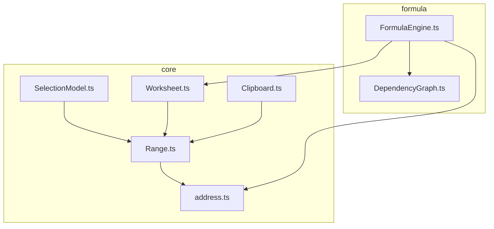
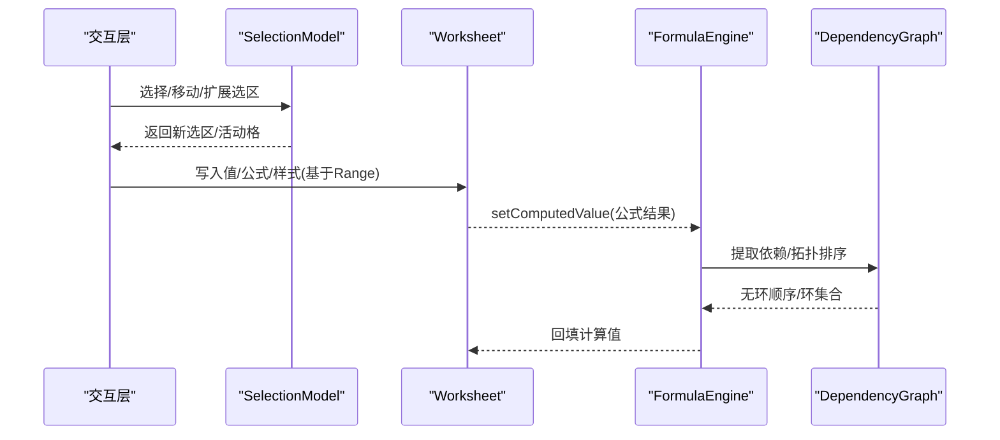
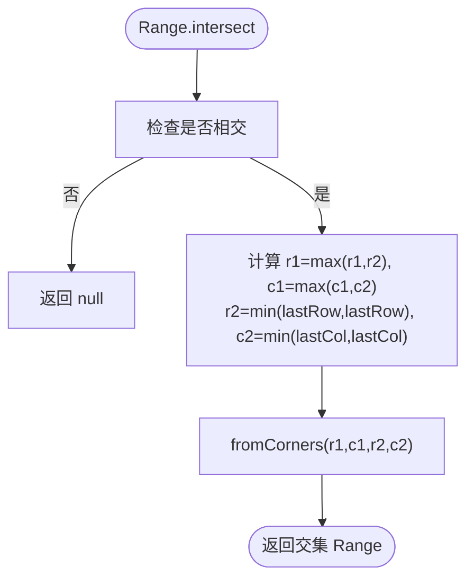
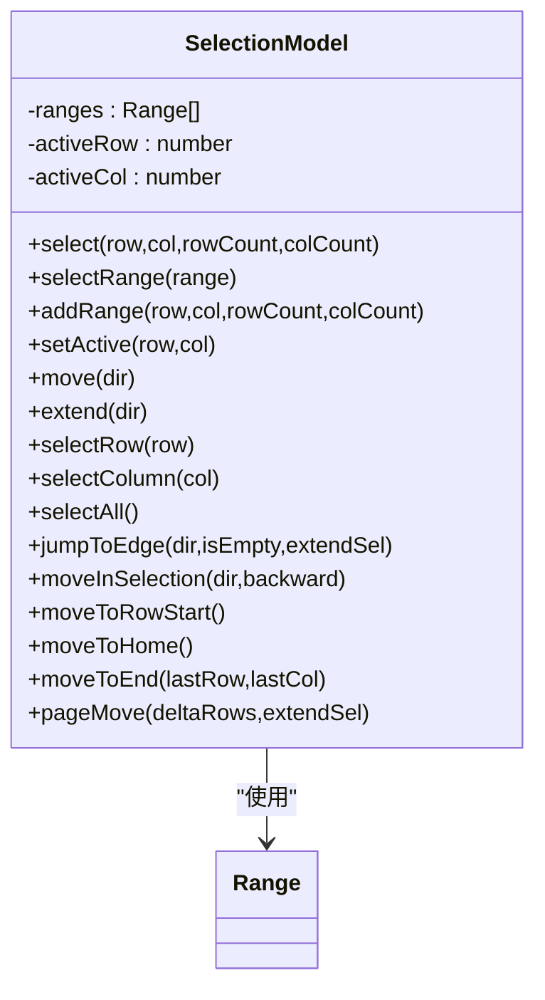
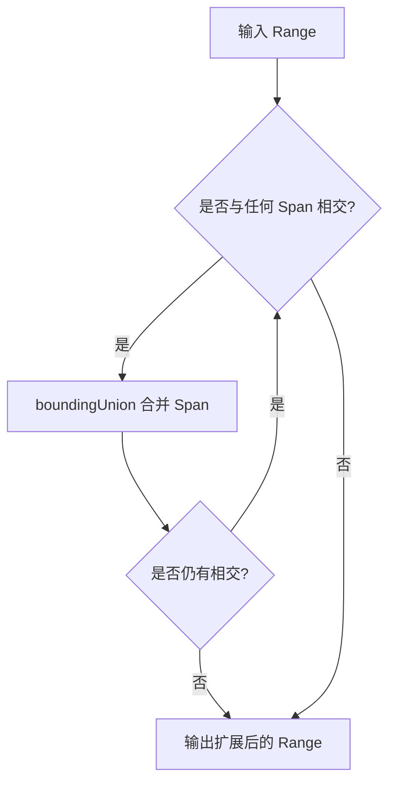
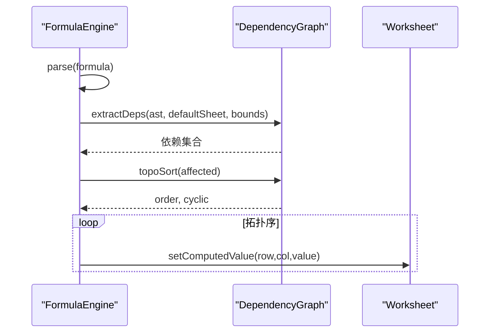
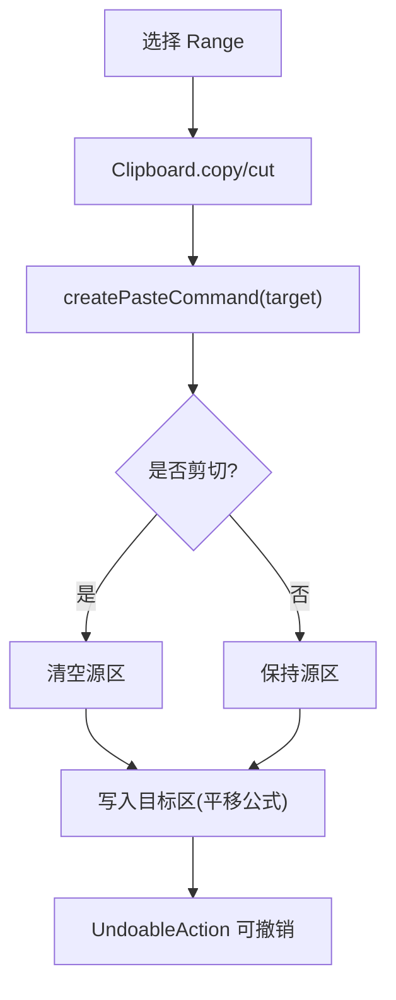
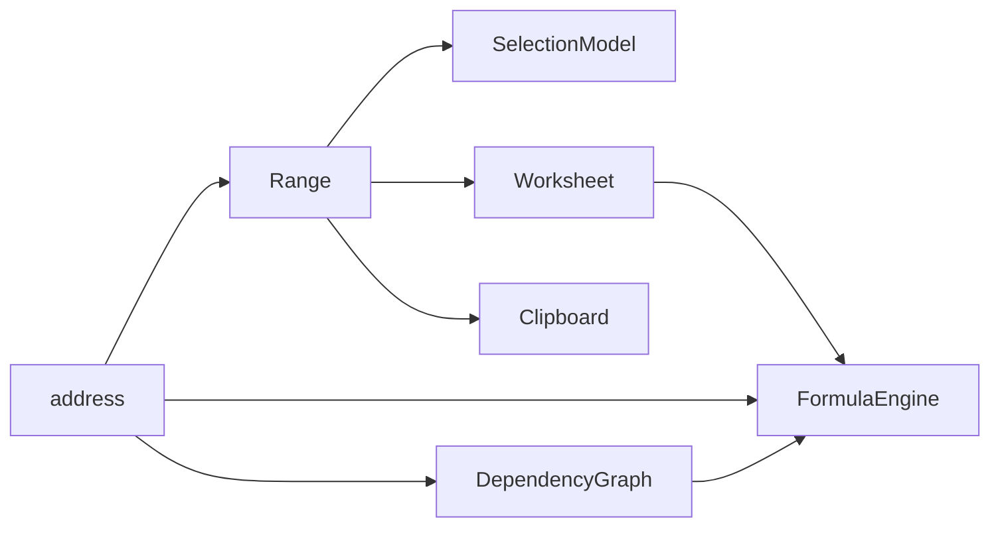

# 范围计算器

<cite>
**本文引用的文件**
- [Range.ts](file://cmx-mega-sheet/src/core/Range.ts)
- [SelectionModel.ts](file://cmx-mega-sheet/src/core/SelectionModel.ts)
- [address.ts](file://cmx-mega-sheet/src/core/address.ts)
- [Worksheet.ts](file://cmx-mega-sheet/src/core/Worksheet.ts)
- [FormulaEngine.ts](file://cmx-mega-sheet/src/formula/FormulaEngine.ts)
- [DependencyGraph.ts](file://cmx-mega-sheet/src/formula/DependencyGraph.ts)
- [Clipboard.ts](file://cmx-mega-sheet/src/core/Clipboard.ts)
- [Range.test.ts](file://cmx-mega-sheet/test/Range.test.ts)
- [SelectionModel.test.ts](file://cmx-mega-sheet/test/SelectionModel.test.ts)
</cite>

## 目录
1. [简介](#简介)
2. [项目结构](#项目结构)
3. [核心组件](#核心组件)
4. [架构总览](#架构总览)
5. [详细组件分析](#详细组件分析)
6. [依赖关系分析](#依赖关系分析)
7. [性能考虑](#性能考虑)
8. [故障排查指南](#故障排查指南)
9. [结论](#结论)
10. [附录：API 使用示例与常见问题](#附录api-使用示例与常见问题)

## 简介
本技术文档聚焦于“范围计算器”模块，围绕 Range 类的设计原理、边界计算、交集并集等核心算法展开，系统说明范围的选择模型（SelectionModel）、与单元格的关系映射（单格/多格/不规则范围）、在公式计算中的应用（引用解析、依赖分析、增量重算），以及选择交互逻辑。同时给出大范围数据处理方案、性能优化策略和常见问题的解决方案。

## 项目结构
范围相关能力分布在 core 与 formula 两个层次：
- core 层提供不可变 Range 值对象、地址解析、选区几何与剪贴板操作、工作表数据模型。
- formula 层提供公式引擎、依赖图与增量重算机制。

图表来源
- [Range.ts:1-166](file://cmx-mega-sheet/src/core/Range.ts#L1-L166)
- [SelectionModel.ts:1-291](file://cmx-mega-sheet/src/core/SelectionModel.ts#L1-L291)
- [address.ts:1-112](file://cmx-mega-sheet/src/core/address.ts#L1-L112)
- [Worksheet.ts:435-738](file://cmx-mega-sheet/src/core/Worksheet.ts#L435-L738)
- [FormulaEngine.ts:1-289](file://cmx-mega-sheet/src/formula/FormulaEngine.ts#L1-L289)
- [DependencyGraph.ts:1-201](file://cmx-mega-sheet/src/formula/DependencyGraph.ts#L1-L201)

章节来源
- [Range.ts:1-166](file://cmx-mega-sheet/src/core/Range.ts#L1-L166)
- [SelectionModel.ts:1-291](file://cmx-mega-sheet/src/core/SelectionModel.ts#L1-L291)
- [address.ts:1-112](file://cmx-mega-sheet/src/core/address.ts#L1-L112)
- [Worksheet.ts:435-738](file://cmx-mega-sheet/src/core/Worksheet.ts#L435-L738)
- [FormulaEngine.ts:1-289](file://cmx-mega-sheet/src/formula/FormulaEngine.ts#L1-L289)
- [DependencyGraph.ts:1-201](file://cmx-mega-sheet/src/formula/DependencyGraph.ts#L1-L201)

## 核心组件
- Range：矩形区域的不可变值对象，承载选区、合并 span、样式套用范围、公式引用区域的几何运算。内部以 (row, col, rowCount, colCount) 表示，全部 0-based 闭区间。
- SelectionModel：选区模型，管理多区选择、活动格、键盘导航几何（移动、扩展、跳转、翻页、整行/列/全选）。
- address：A1 地址与行列索引互转、区域字符串解析与格式化。
- Worksheet：工作表数据模型，提供单元格读写、合并 span、大纲分组、可见性、保护等；通过 Range 进行区域级操作。
- FormulaEngine：公式引擎编排层，负责全量/增量重算、依赖图拓扑排序、环检测、直接求值。
- DependencyGraph：依赖图 + 拓扑排序 + 三色环检测，支持受影响闭包计算。
- Clipboard：内部剪贴板模型，复制/剪切/粘贴（含选择性粘贴、转置、算术运算），公式相对引用平移。

章节来源
- [Range.ts:1-166](file://cmx-mega-sheet/src/core/Range.ts#L1-L166)
- [SelectionModel.ts:1-291](file://cmx-mega-sheet/src/core/SelectionModel.ts#L1-L291)
- [address.ts:1-112](file://cmx-mega-sheet/src/core/address.ts#L1-L112)
- [Worksheet.ts:435-738](file://cmx-mega-sheet/src/core/Worksheet.ts#L435-L738)
- [FormulaEngine.ts:1-289](file://cmx-mega-sheet/src/formula/FormulaEngine.ts#L1-L289)
- [DependencyGraph.ts:1-201](file://cmx-mega-sheet/src/formula/DependencyGraph.ts#L1-L201)
- [Clipboard.ts:1-418](file://cmx-mega-sheet/src/core/Clipboard.ts#L1-L418)

## 架构总览
范围计算贯穿“选择—编辑—公式—渲染”的全链路：
- 用户交互通过 SelectionModel 维护选区与活动格。
- 编辑/命令层基于 Range 对 Worksheet 进行批量读写。
- 公式引擎从 AST 抽取依赖，构建依赖图，按拓扑序计算并回填计算值。
- 渲染层读取 Worksheet 的值与样式，结合合并 span 与可见性进行绘制。

图表来源
- [SelectionModel.ts:67-124](file://cmx-mega-sheet/src/core/SelectionModel.ts#L67-L124)
- [Worksheet.ts:530-603](file://cmx-mega-sheet/src/core/Worksheet.ts#L530-L603)
- [FormulaEngine.ts:149-198](file://cmx-mega-sheet/src/formula/FormulaEngine.ts#L149-L198)
- [DependencyGraph.ts:142-199](file://cmx-mega-sheet/src/formula/DependencyGraph.ts#L142-L199)

## 详细组件分析

### Range 类设计与核心算法
- 表示与构造
  - 构造函数将 row/col 下取整并钳制到 ≥0，rowCount/colCount 归一为 ≥1。
  - 提供 fromCoord/fromCorners/fromA1 多种构造方式，toCoord/toA1 用于序列化。
- 边界与查询
  - lastRow/lastCol 提供闭区间末索引；area 为单元格数；isSingleCell 判断单格。
  - containsCell/containsRange 判断包含关系；intersects 判断是否相交。
- 代数运算
  - intersect 计算交集（无交返回 null）；boundingUnion 计算包围盒并集（非集合并）。
- 变换与遍历
  - translate 平移（负数向上/左，结果行列被钳制到 ≥0）。
  - forEachCell/cells 行优先遍历每个单元格坐标。

复杂度
- 交集/并集/包含判断均为 O(1)。
- 遍历 area 个单元格，时间 O(area)，空间 O(1)（迭代器）。

图表来源
- [Range.ts:100-127](file://cmx-mega-sheet/src/core/Range.ts#L100-L127)

章节来源
- [Range.ts:16-166](file://cmx-mega-sheet/src/core/Range.ts#L16-L166)
- [Range.test.ts:1-120](file://cmx-mega-sheet/test/Range.test.ts#L1-L120)

### SelectionModel 选择模型与交互逻辑
- 状态
  - ranges：选区列表（至少一个），最后一个为当前选区。
  - activeRow/activeCol：活动格，始终落在某个选区内。
- 基本操作
  - select/selectRange/addRange/setActive：设置选区或活动格。
  - move：方向键移动，折叠为单格并移动。
  - extend：Shift+方向键扩展选区，活动格作为锚点不动，浮动角朝方向移动。
  - selectRow/selectColumn/selectAll：整行/整列/全选。
  - jumpToEdge：Ctrl+方向键跳到数据区边界（空/非空跳变点）。
  - moveInSelection：Enter/Tab 在选区内回绕移动。
  - moveToRowStart/moveToHome/moveToEnd/pageMove：常用导航。
- 几何约束
  - clampRow/clampCol 保证不越界；nextCell 统一方向步进。

图表来源
- [SelectionModel.ts:23-291](file://cmx-mega-sheet/src/core/SelectionModel.ts#L23-L291)
- [Range.ts:16-166](file://cmx-mega-sheet/src/core/Range.ts#L16-L166)

章节来源
- [SelectionModel.ts:1-291](file://cmx-mega-sheet/src/core/SelectionModel.ts#L1-L291)
- [SelectionModel.test.ts:1-126](file://cmx-mega-sheet/test/SelectionModel.test.ts#L1-L126)

### 范围与单元格的关系映射
- 单格范围：1×1 的 Range，常用于活动格定位、单格读写。
- 多格范围：矩形区域，用于批量赋值、样式应用、公式引用。
- 不规则范围：由多个 Range 组成的选区列表（SelectionModel.ranges），用于多选场景。
- 合并 span：Worksheet.expandRangeToSpans 将选中区域扩展到包含所有与之相交的合并区（迭代至不动点），确保选中/命中语义正确。

图表来源
- [Worksheet.ts:719-738](file://cmx-mega-sheet/src/core/Worksheet.ts#L719-L738)

章节来源
- [Worksheet.ts:688-738](file://cmx-mega-sheet/src/core/Worksheet.ts#L688-L738)

### 范围在公式计算中的应用
- 引用解析
  - address.parseAddr/parseRange 将 A1 引用解析为行列坐标；FormulaEngine.splitRef/splitEndpoint 处理跨 sheet 引用、整列/整行引用。
- 依赖分析
  - DependencyGraph.extractDeps 从 AST 中递归抽取依赖，区域展开为逐格依赖，整列/整行按 bounds 钳到 sheet 维度，避免百万格遍历。
- 增量重算
  - FormulaEngine.recalcCells：先更新种子格的依赖（若仍为公式），再计算 affectedBy 传递闭包，并对该子集拓扑排序求值回填；volatile 函数每次纳入。
- 环检测
  - DependencyGraph.topoSort 使用三色 DFS 检测环，环上格标记 #CIRC!。

图表来源
- [FormulaEngine.ts:69-115](file://cmx-mega-sheet/src/formula/FormulaEngine.ts#L69-L115)
- [DependencyGraph.ts:22-94](file://cmx-mega-sheet/src/formula/DependencyGraph.ts#L22-L94)
- [FormulaEngine.ts:149-198](file://cmx-mega-sheet/src/formula/FormulaEngine.ts#L149-L198)

章节来源
- [address.ts:1-112](file://cmx-mega-sheet/src/core/address.ts#L1-L112)
- [FormulaEngine.ts:1-289](file://cmx-mega-sheet/src/formula/FormulaEngine.ts#L1-L289)
- [DependencyGraph.ts:1-201](file://cmx-mega-sheet/src/formula/DependencyGraph.ts#L1-L201)

### 范围的操作方法：选择、移动、复制、粘贴
- 选择/移动
  - SelectionModel 提供 select/move/extend/jumpToEdge/moveInSelection 等方法，覆盖键盘导航与多选扩展。
- 复制/剪切
  - Clipboard.capture 快照选定 Range 内的 CellData（值/公式/样式），记录源 Range 与尺寸。
- 粘贴
  - createPasteCommand：生成可撤销命令，执行时清空剪切源（仅一次），平移相对引用（复制模式），落区尺寸为原尺寸。
  - createPasteSpecialCommand：选择性粘贴（all/values/formulas/formats），支持转置、跳过空格、与目标值算术运算（add/subtract/multiply/divide）。
- 系统剪贴板互通
  - serializeTSV/serializeHTML 导出 TSV/HTML；parseTSV/parseClipboardHTML 解析外部数据。

图表来源
- [Clipboard.ts:67-133](file://cmx-mega-sheet/src/core/Clipboard.ts#L67-L133)
- [Clipboard.ts:143-178](file://cmx-mega-sheet/src/core/Clipboard.ts#L143-L178)

章节来源
- [SelectionModel.ts:67-124](file://cmx-mega-sheet/src/core/SelectionModel.ts#L67-L124)
- [Clipboard.ts:1-418](file://cmx-mega-sheet/src/core/Clipboard.ts#L1-L418)

## 依赖关系分析
- Range 被 SelectionModel、Worksheet、Clipboard 广泛使用，作为区域几何基元。
- SelectionModel 依赖 Range 进行选区形状计算与扩展。
- Worksheet 通过 Range 实现批量操作（值/公式/样式/合并 span）。
- FormulaEngine 依赖 address 解析引用，依赖 DependencyGraph 做依赖分析与拓扑排序。
- DependencyGraph 依赖 address 解析端点，并将区域展开为逐格依赖。

图表来源
- [Range.ts:10-166](file://cmx-mega-sheet/src/core/Range.ts#L10-L166)
- [SelectionModel.ts:11-291](file://cmx-mega-sheet/src/core/SelectionModel.ts#L11-L291)
- [Worksheet.ts:16-738](file://cmx-mega-sheet/src/core/Worksheet.ts#L16-L738)
- [FormulaEngine.ts:15-289](file://cmx-mega-sheet/src/formula/FormulaEngine.ts#L15-L289)
- [DependencyGraph.ts:12-201](file://cmx-mega-sheet/src/formula/DependencyGraph.ts#L12-L201)
- [address.ts:1-112](file://cmx-mega-sheet/src/core/address.ts#L1-L112)

章节来源
- [Range.ts:10-166](file://cmx-mega-sheet/src/core/Range.ts#L10-L166)
- [SelectionModel.ts:11-291](file://cmx-mega-sheet/src/core/SelectionModel.ts#L11-L291)
- [Worksheet.ts:16-738](file://cmx-mega-sheet/src/core/Worksheet.ts#L16-L738)
- [FormulaEngine.ts:15-289](file://cmx-mega-sheet/src/formula/FormulaEngine.ts#L15-L289)
- [DependencyGraph.ts:12-201](file://cmx-mega-sheet/src/formula/DependencyGraph.ts#L12-L201)
- [address.ts:1-112](file://cmx-mega-sheet/src/core/address.ts#L1-L112)

## 性能考虑
- 大区域遍历
  - Range.forEachCell/cells 按 area 线性遍历，适合小/中区域；超大区域建议分批或按需访问。
- 整列/整行引用
  - FormulaEngine 与 DependencyGraph 在解析整列/整行时，按 sheet 维度钳制，避免遍历百万格。
- 增量重算
  - recalcCells 仅重算受影响闭包，显著降低大表编辑成本；volatile 函数每次纳入以保证正确性。
- 合并 span 扩展
  - expandRangeToSpans 迭代至不动点，设置 guard 上限防止无限循环。
- 剪贴板
  - 选择性粘贴支持 skipBlanks 减少不必要写入；transpose 改变落区尺寸需评估性能。

[本节为通用性能指导，不直接分析具体文件]

## 故障排查指南
- 公式环引用
  - 现象：单元格显示 #CIRC!。
  - 原因：依赖图中存在环，topoSort 检测到灰→灰边。
  - 解决：检查公式链，打破循环依赖。
- 解析错误
  - 现象：显示 #NAME?/#VALUE!。
  - 原因：AST 解析失败或求值异常。
  - 解决：检查公式语法与函数参数类型。
- 选区越界
  - 现象：活动格或选区被钳制到网格边界。
  - 原因：clampRow/clampCol 限制。
  - 解决：调整网格尺寸或修正输入坐标。
- 合并 span 冲突
  - 现象：选中区域未覆盖整个合并区。
  - 原因：未调用 expandRangeToSpans。
  - 解决：在选中/命中逻辑后扩展至合并区。
- 选择性粘贴行为
  - 现象：数值未按预期运算或公式未平移。
  - 原因：content/operation 配置或剪切模式差异。
  - 解决：确认 PasteSpecialOptions 与 isCut 标志。

章节来源
- [FormulaEngine.ts:183-198](file://cmx-mega-sheet/src/formula/FormulaEngine.ts#L183-L198)
- [FormulaEngine.ts:259-287](file://cmx-mega-sheet/src/formula/FormulaEngine.ts#L259-L287)
- [DependencyGraph.ts:163-199](file://cmx-mega-sheet/src/formula/DependencyGraph.ts#L163-L199)
- [Worksheet.ts:719-738](file://cmx-mega-sheet/src/core/Worksheet.ts#L719-L738)
- [Clipboard.ts:143-178](file://cmx-mega-sheet/src/core/Clipboard.ts#L143-L178)

## 结论
Range 作为不可变值对象提供了稳定高效的区域几何能力；SelectionModel 将选择语义与键盘导航解耦；Worksheet 通过 Range 实现批量操作与合并 span 扩展；FormulaEngine 与 DependencyGraph 共同完成引用解析、依赖分析与增量重算。整体设计清晰、可扩展，适合大规模表格场景。

[本节为总结性内容，不直接分析具体文件]

## 附录：API 使用示例与常见问题

### API 使用示例（路径引用）
- 创建与转换范围
  - 从 A1 字符串构造：[Range.fromA1:69-73](file://cmx-mega-sheet/src/core/Range.ts#L69-L73)
  - 归一化坐标视图：[Range.toCoord:75-78](file://cmx-mega-sheet/src/core/Range.ts#L75-L78)
  - 区域字符串格式化：[address.formatRange:99-111](file://cmx-mega-sheet/src/core/address.ts#L99-L111)
- 选择与导航
  - 单格选择：[SelectionModel.select:67-74](file://cmx-mega-sheet/src/core/SelectionModel.ts#L67-L74)
  - 扩展选区：[SelectionModel.extend:112-124](file://cmx-mega-sheet/src/core/SelectionModel.ts#L112-L124)
  - Ctrl+方向跳转：[SelectionModel.jumpToEdge:181-190](file://cmx-mega-sheet/src/core/SelectionModel.ts#L181-L190)
- 复制粘贴
  - 复制区域：[Clipboard.copy:67-70](file://cmx-mega-sheet/src/core/Clipboard.ts#L67-L70)
  - 生成粘贴命令：[Clipboard.createPasteCommand:96-133](file://cmx-mega-sheet/src/core/Clipboard.ts#L96-L133)
  - 选择性粘贴：[Clipboard.createPasteSpecialCommand:143-178](file://cmx-mega-sheet/src/core/Clipboard.ts#L143-L178)
- 公式计算
  - 全量重算：[FormulaEngine.recalcAll:149-198](file://cmx-mega-sheet/src/formula/FormulaEngine.ts#L149-L198)
  - 增量重算：[FormulaEngine.recalcCells:206-243](file://cmx-mega-sheet/src/formula/FormulaEngine.ts#L206-L243)
  - 直接求值：[FormulaEngine.evaluateFormula:278-287](file://cmx-mega-sheet/src/formula/FormulaEngine.ts#L278-L287)

### 常见问题解决方案
- 如何高效处理超大面积区域？
  - 使用 DependencyGraph 的 bounds 钳制整列/整行依赖，避免遍历百万格。
  - 使用 SelectionModel.moveInSelection 在选区内回绕，减少跨页移动开销。
- 为什么选择性粘贴没有平移公式？
  - 选择性粘贴保守策略不平移公式，如需平移请使用普通粘贴（复制模式）。
- 合并区域选中不完整？
  - 在选中后调用 Worksheet.expandRangeToSpans 扩展至合并区。
- 公式出现 #CIRC!？
  - 检查依赖图是否存在环，必要时重构公式链。

[本节为使用指导与问题解答，不直接分析具体文件]