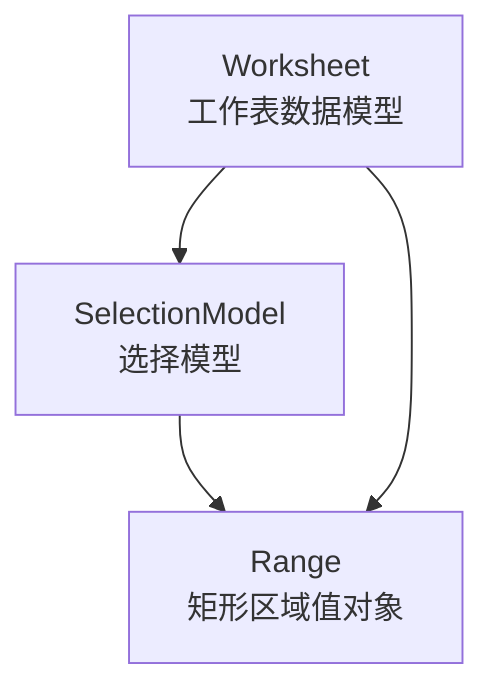
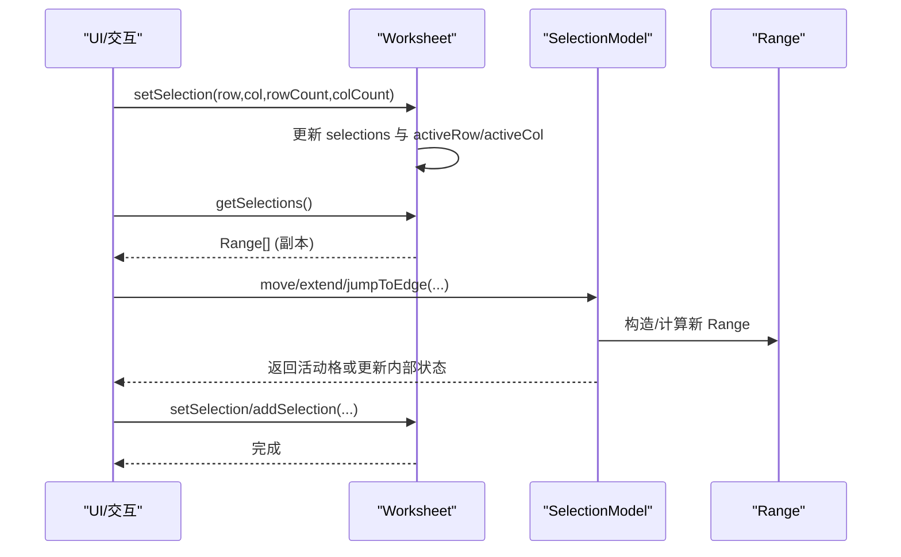
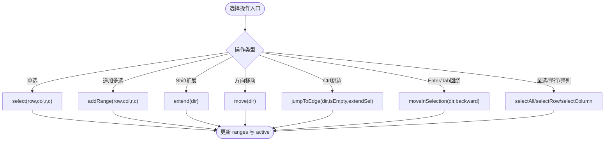
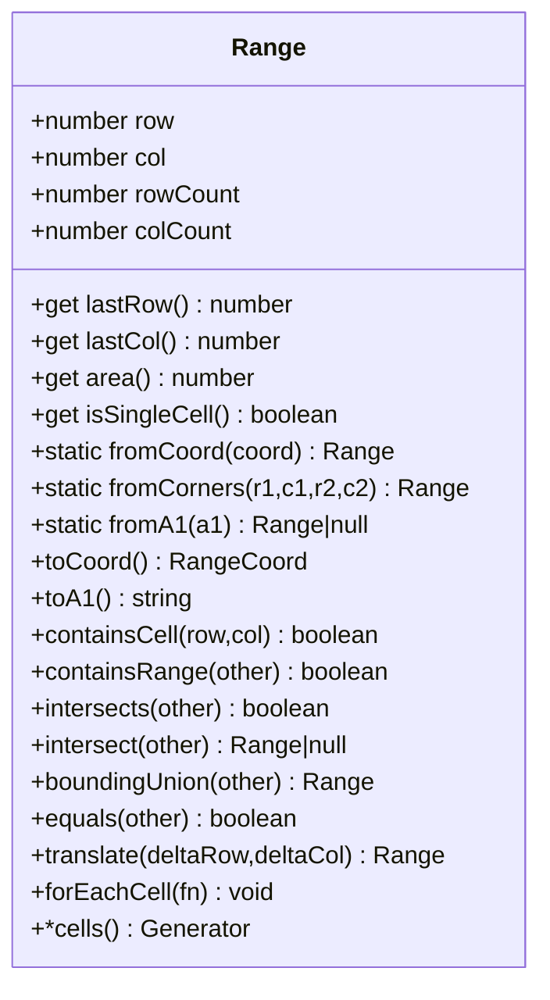
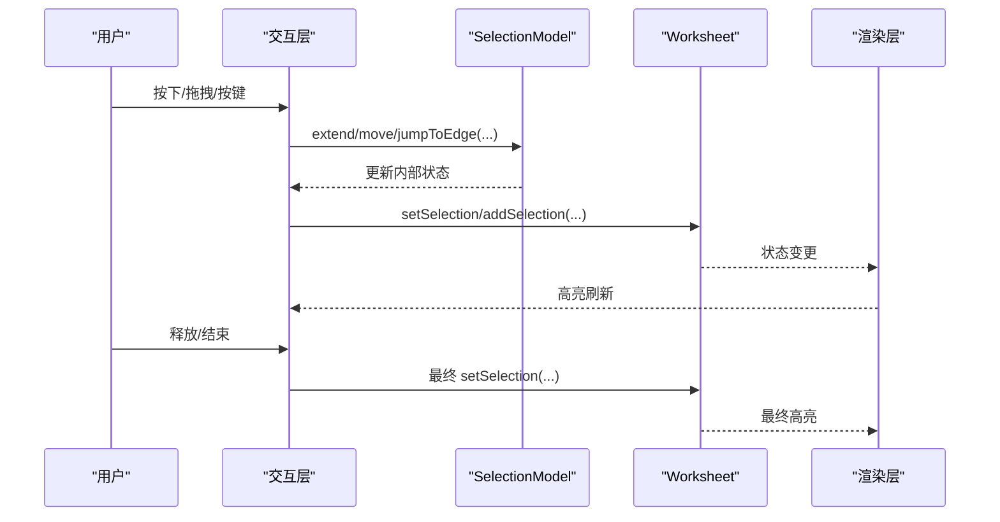
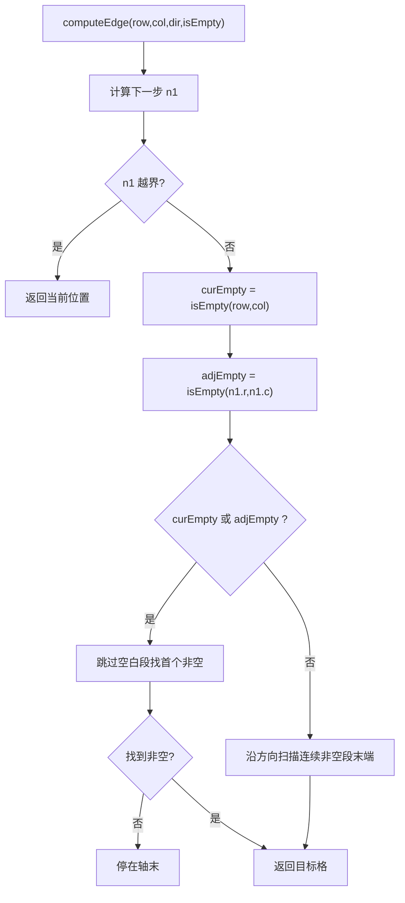
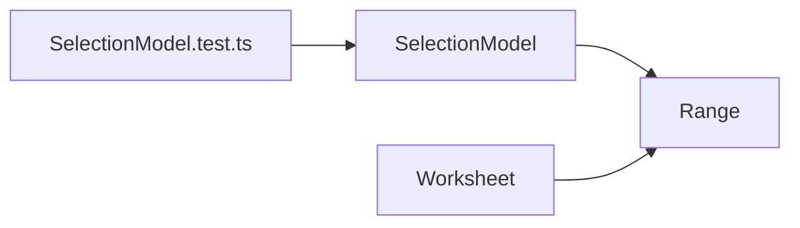

# 选择模型

<cite>
**本文引用的文件**
- [SelectionModel.ts](file://cmx-mega-sheet/src/core/SelectionModel.ts)
- [Range.ts](file://cmx-mega-sheet/src/core/Range.ts)
- [Worksheet.ts](file://cmx-mega-sheet/src/core/Worksheet.ts)
- [SelectionModel.test.ts](file://cmx-mega-sheet/test/SelectionModel.test.ts)
</cite>

## 目录
1. [简介](#简介)
2. [项目结构](#项目结构)
3. [核心组件](#核心组件)
4. [架构总览](#架构总览)
5. [详细组件分析](#详细组件分析)
6. [依赖关系分析](#依赖关系分析)
7. [性能考虑](#性能考虑)
8. [故障排查指南](#故障排查指南)
9. [结论](#结论)
10. [附录：API 参考与集成示例](#附录api-参考与集成示例)

## 简介
本技术文档聚焦于选择模型模块，围绕 SelectionModel 类的设计与实现，系统阐述多选支持、范围选择、连续选择等交互模式；说明选择状态的维护机制（选区添加、移除、合并、取消）；解释选择模型与工作表的同步机制，确保 UI 显示与数据状态一致；说明扩展性设计以支持自定义选择模式和业务逻辑；梳理选择事件的处理流程（开始、改变、结束）；给出大数据量下的性能优化策略；并提供 API 参考与集成示例。

## 项目结构
选择模型位于 cmx-mega-sheet 的 core 层，由三个关键文件构成：
- Range：不可变矩形区域值对象，提供区域代数与几何运算。
- SelectionModel：纯几何的选择模型，负责活动格移动、选区扩展、边界钳制、多区增补、键盘导航等。
- Worksheet：工作表数据模型，持有 selections 与 activeRow/activeCol，对外暴露 getSelections/setSelection 等契约接口，作为渲染层与选择模型的桥接面。



图表来源
- [Worksheet.ts:1182-1200](file://cmx-mega-sheet/src/core/Worksheet.ts#L1182-L1200)
- [SelectionModel.ts:23-57](file://cmx-mega-sheet/src/core/SelectionModel.ts#L23-L57)
- [Range.ts:16-83](file://cmx-mega-sheet/src/core/Range.ts#L16-L83)

章节来源
- [Worksheet.ts:1182-1200](file://cmx-mega-sheet/src/core/Worksheet.ts#L1182-L1200)
- [SelectionModel.ts:1-36](file://cmx-mega-sheet/src/core/SelectionModel.ts#L1-L36)
- [Range.ts:1-33](file://cmx-mega-sheet/src/core/Range.ts#L1-L33)

## 核心组件
- Range：承载矩形区域的不可变值对象，提供 fromCorners/toA1/containsCell/intersects/boundingUnion/cells 等能力，用于选区表示与计算。
- SelectionModel：封装选择状态（ranges、activeRow、activeCol），提供 select/selectRange/addRange/move/extend/selectRow/selectColumn/selectAll/jumpToEdge/moveInSelection/pageMove 等方法，实现单格选择、多选追加、Shift 扩展、Ctrl+方向跳边、Enter/Tab 区内回绕、翻页等交互。
- Worksheet：持有 selections 数组与活动格坐标，对外暴露 getSelections/setSelection/addSelection/clearSelections/getActiveRowIndex/getActiveColumnIndex/setActiveCell 等接口，供渲染层与上层调用。

章节来源
- [Range.ts:16-166](file://cmx-mega-sheet/src/core/Range.ts#L16-L166)
- [SelectionModel.ts:23-290](file://cmx-mega-sheet/src/core/SelectionModel.ts#L23-L290)
- [Worksheet.ts:1182-1218](file://cmx-mega-sheet/src/core/Worksheet.ts#L1182-L1218)

## 架构总览
选择模型采用“数据-几何-视图”分层：
- 数据层：Worksheet 维护 selections 与活动格，是持久化与快照读取的权威源。
- 几何层：SelectionModel 专注选择几何运算，不依赖 DOM，便于单元测试与 Node 环境运行。
- 视图层：渲染器消费 Worksheet.getSelections() 进行高亮绘制，并通过 Worksheet.setSelection()/addSelection() 更新状态。



图表来源
- [Worksheet.ts:1182-1218](file://cmx-mega-sheet/src/core/Worksheet.ts#L1182-L1218)
- [SelectionModel.ts:67-124](file://cmx-mega-sheet/src/core/SelectionModel.ts#L67-L124)
- [Range.ts:55-83](file://cmx-mega-sheet/src/core/Range.ts#L55-L83)

## 详细组件分析

### SelectionModel 设计与交互模式
- 多选支持：通过 ranges 列表维护多个选区，addRange 追加新区并移动活动格到新区左上角；primary() 返回最后一个选区作为当前主选区。
- 范围选择：select/selectRange 将选区替换为指定区域；selectRow/selectColumn/selectAll 快速选择整行/整列/全表。
- 连续选择：move 折叠为单格并按方向移动；extend 以活动格为锚点，将浮动角朝方向推进，实现 Shift+方向键扩选。
- 键盘导航：jumpToEdge 支持 Ctrl+方向跳至数据边界（空/非空跳变点）；moveInSelection 支持 Enter/Tab 在选区内回绕；pageMove 支持翻页移动；Home/End/Ctrl+Home/Ctrl+End 快捷定位。
- 边界处理：clampRow/clampCol 保证活动格与选区始终在网格范围内。



图表来源
- [SelectionModel.ts:67-147](file://cmx-mega-sheet/src/core/SelectionModel.ts#L67-L147)
- [SelectionModel.ts:181-222](file://cmx-mega-sheet/src/core/SelectionModel.ts#L181-L222)
- [SelectionModel.ts:237-285](file://cmx-mega-sheet/src/core/SelectionModel.ts#L237-L285)

章节来源
- [SelectionModel.ts:23-290](file://cmx-mega-sheet/src/core/SelectionModel.ts#L23-L290)

### Range 几何与代数
- 不可变值对象：构造时归一化行列与尺寸，提供 lastRow/lastCol/area/isSingleCell 等属性。
- 区域构造与转换：fromCoord/fromCorners/fromA1 多种构造方式；toCoord/toA1 输出标准化格式。
- 集合运算：containsCell/containsRange/intersects/intersect/boundingUnion 支持包含、相交、交集、包围盒并集。
- 遍历与生成：forEachCell/cells 支持逐格访问，便于批量样式应用或公式引用。



图表来源
- [Range.ts:16-166](file://cmx-mega-sheet/src/core/Range.ts#L16-L166)

章节来源
- [Range.ts:16-166](file://cmx-mega-sheet/src/core/Range.ts#L16-L166)

### Worksheet 选择契约与同步
- 选择状态：selections 数组保存所有选区；activeRow/activeCol 记录活动格。
- 写入接口：setSelection 替换全部选区；addSelection 追加选区；clearSelections 清空并保留活动格位置。
- 读取接口：getSelections 返回 Range 副本；getActiveRowIndex/getActiveColumnIndex 获取活动格；setActiveCell 设置活动格；getActiveAddr 返回活动格地址。
- 同步机制：渲染层通过 getSelections 获取最新选区进行高亮；交互层通过 setSelection/addSelection 更新状态，保证 UI 与数据一致。

```mermaid
sequenceDiagram
participant Render as "渲染层"
participant WS as "Worksheet"
participant SM as "SelectionModel"
Render->>WS : getSelections()
WS-->>Render : Range[] (副本)
Render->>WS : setSelection(row,col,r,c)
WS->>WS : selections = [new Range(...)]
WS->>WS : activeRow=row; activeCol=col
Render->>WS : addSelection(row,col,r,c)
WS->>WS : selections.push(new Range(...))
WS->>WS : activeRow=row; activeCol=col
```

图表来源
- [Worksheet.ts:1182-1218](file://cmx-mega-sheet/src/core/Worksheet.ts#L1182-L1218)

章节来源
- [Worksheet.ts:1182-1218](file://cmx-mega-sheet/src/core/Worksheet.ts#L1182-L1218)

### 选择事件处理流程（开始、改变、结束）
- 开始：用户按下鼠标或触发键盘事件时，交互层可先缓存初始活动格与选区，准备后续扩展。
- 改变：在拖拽或按键过程中，持续调用 SelectionModel.extend/move/jumpToEdge 等方法更新内部状态，并通过 Worksheet.setSelection/addSelection 同步到工作表，触发重绘。
- 结束：释放鼠标或按键结束时，最终确定选区，可能触发业务回调（如批量格式化、复制粘贴）。
- 注意：SelectionModel 本身不直接派发事件，而是通过 Worksheet 的状态变更被渲染层订阅；上层可在 Worksheet 方法前后注入业务逻辑以实现事件语义。



图表来源
- [SelectionModel.ts:112-124](file://cmx-mega-sheet/src/core/SelectionModel.ts#L112-L124)
- [Worksheet.ts:1182-1218](file://cmx-mega-sheet/src/core/Worksheet.ts#L1182-L1218)

### 复杂逻辑：Ctrl+方向跳边算法
- 输入：方向 dir、isEmpty(r,c) 判断函数、是否扩展选区 extendSel。
- 逻辑：根据当前格与相邻格的空/非空状态，决定跳到首个非空格或连续非空段末端；若全空则停在轴末；可选 extendSel 将活动格与目标角组合为新选区。
- 输出：更新活动格或选区。



图表来源
- [SelectionModel.ts:192-222](file://cmx-mega-sheet/src/core/SelectionModel.ts#L192-L222)

章节来源
- [SelectionModel.ts:181-222](file://cmx-mega-sheet/src/core/SelectionModel.ts#L181-L222)

## 依赖关系分析
- SelectionModel 依赖 Range 进行区域构造与几何运算。
- Worksheet 依赖 Range 存储 selections，并暴露选择相关 API。
- 测试用例覆盖基础选择、移动、扩展、行列全选、状态快照等场景，验证行为正确性。



图表来源
- [SelectionModel.ts:11-21](file://cmx-mega-sheet/src/core/SelectionModel.ts#L11-L21)
- [Worksheet.ts:1182-1218](file://cmx-mega-sheet/src/core/Worksheet.ts#L1182-L1218)
- [SelectionModel.test.ts:1-126](file://cmx-mega-sheet/test/SelectionModel.test.ts#L1-L126)

章节来源
- [SelectionModel.test.ts:1-126](file://cmx-mega-sheet/test/SelectionModel.test.ts#L1-L126)

## 性能考虑
- 避免频繁重绘：在拖拽或连续按键中，尽量累积多次选择变化后一次性调用 Worksheet.setSelection/addSelection，减少渲染层刷新次数。
- 使用 Range 的 cells 生成器或 forEachCell 进行批量操作时，注意控制迭代规模；对超大选区可分片处理或延迟计算。
- jumpToEdge 的 isEmpty 查询应尽可能高效（例如基于稀疏矩阵或索引），避免 O(N^2) 扫描。
- 多选追加 addRange 会增长 ranges 列表，必要时合并相邻或重叠选区以降低渲染复杂度。
- 使用 getState 获取只读快照，避免直接修改内部状态导致不一致。

[本节为通用性能建议，不直接分析具体文件]

## 故障排查指南
- 活动格越界：检查 clampRow/clampCol 是否正确调用；确认 rowCount/colCount 回调返回值合理。
- 多选未生效：确认 addRange 是否被调用；检查 primary() 是否为期望的最后一个选区。
- Shift 扩展异常：确认活动格锚点未变动；检查 nextCell 与 floatCorner 计算是否符合预期。
- Ctrl+方向跳边无效：确认 isEmpty 函数实现正确；检查边界条件与循环终止条件。
- 渲染不同步：确保每次选择变更后调用 Worksheet.setSelection/addSelection；渲染层订阅 getSelections 的变化。

章节来源
- [SelectionModel.ts:59-65](file://cmx-mega-sheet/src/core/SelectionModel.ts#L59-L65)
- [SelectionModel.ts:112-124](file://cmx-mega-sheet/src/core/SelectionModel.ts#L112-L124)
- [SelectionModel.ts:181-222](file://cmx-mega-sheet/src/core/SelectionModel.ts#L181-L222)
- [Worksheet.ts:1182-1218](file://cmx-mega-sheet/src/core/Worksheet.ts#L1182-L1218)

## 结论
SelectionModel 将选择几何从工作表与交互层解耦，提供清晰、可测、可扩展的选择能力。配合 Range 的代数运算与 Worksheet 的契约接口，能够支撑多选、范围选择、连续选择、键盘导航等常见交互，并在大数据量下通过合理的批处理与查询优化保障性能。上层可通过扩展 SelectionModel 的方法或注入 isEmpty 等策略，定制更复杂的业务选择逻辑。

[本节为总结性内容，不直接分析具体文件]

## 附录：API 参考与集成示例

### SelectionModel API
- 选择与活动格
  - select(row, col, rowCount?, colCount?)：单格选择（替换全部选区），活动格置于该格。
  - selectRange(range)：设选区为指定区域，活动格保持在区内左上。
  - addRange(row, col, rowCount?, colCount?)：追加一个选区（多选），活动格移到新区左上。
  - setActive(row, col)：只设活动格（不改选区形状）。
  - getActive()：返回活动格坐标。
- 移动与扩展
  - move(dir)：方向键移动，折叠为单格并移动。
  - extend(dir)：Shift+方向键扩展选区，活动格不动。
  - jumpToEdge(dir, isEmpty, extendSel?)：Ctrl+方向跳边，可选扩展选区。
  - moveInSelection(dir, backward?)：Enter/Tab 在选区内回绕。
  - pageMove(deltaRows, extendSel?)：翻页移动活动格。
- 快速选择
  - selectRow(row)：选中整行。
  - selectColumn(col)：选中整列。
  - selectAll()：全选。
  - selectWholeColumn()/selectWholeRow()：基于活动格选择整列/整行。
- 导航
  - moveToRowStart()：移到当前行首列。
  - moveToHome()：移到 A1。
  - moveToEnd(lastRow?, lastCol?)：移到数据区末或轴末。
- 状态读取
  - getState()：返回独立副本的选择状态。
  - getRanges()：返回所有选区的副本。
  - primary()：返回当前主选区。

章节来源
- [SelectionModel.ts:38-57](file://cmx-mega-sheet/src/core/SelectionModel.ts#L38-L57)
- [SelectionModel.ts:67-147](file://cmx-mega-sheet/src/core/SelectionModel.ts#L67-L147)
- [SelectionModel.ts:181-285](file://cmx-mega-sheet/src/core/SelectionModel.ts#L181-L285)

### Worksheet 选择 API
- getSelections()：返回 Range[] 副本。
- setSelection(row, col, rowCount?, colCount?)：替换全部选区并设置活动格。
- addSelection(row, col, rowCount?, colCount?)：追加选区并设置活动格。
- clearSelections()：清空选区，保留活动格位置。
- getActiveRowIndex()/getActiveColumnIndex()：获取活动格坐标。
- setActiveCell(row, col)：设置活动格。
- getActiveAddr()：返回活动格 A1 地址。

章节来源
- [Worksheet.ts:1182-1218](file://cmx-mega-sheet/src/core/Worksheet.ts#L1182-L1218)

### 集成示例（步骤说明）
- 初始化：创建 Worksheet 实例，配置行列数；创建 SelectionModel 实例，传入行列数回调。
- 单次选择：调用 Worksheet.setSelection(行, 列, 行数, 列数)，渲染层调用 getSelections() 高亮。
- 多选追加：调用 Worksheet.addSelection(行, 列, 行数, 列数)，渲染层再次高亮。
- 键盘导航：在按键事件中调用 SelectionModel.move/extend/jumpToEdge，再调用 Worksheet.setSelection/addSelection 同步。
- 批量操作：使用 Range.cells 或 forEachCell 遍历选区，执行批量样式或公式计算。

[本节为集成指导，不直接分析具体文件]