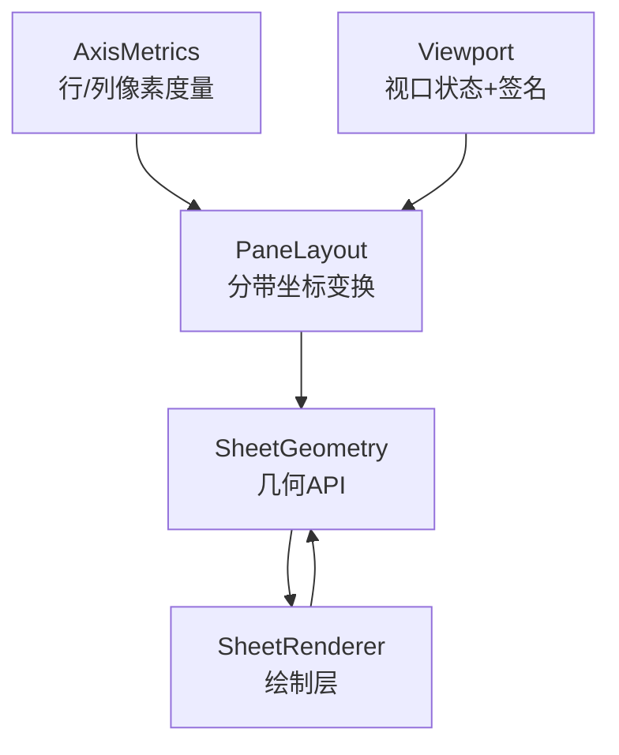
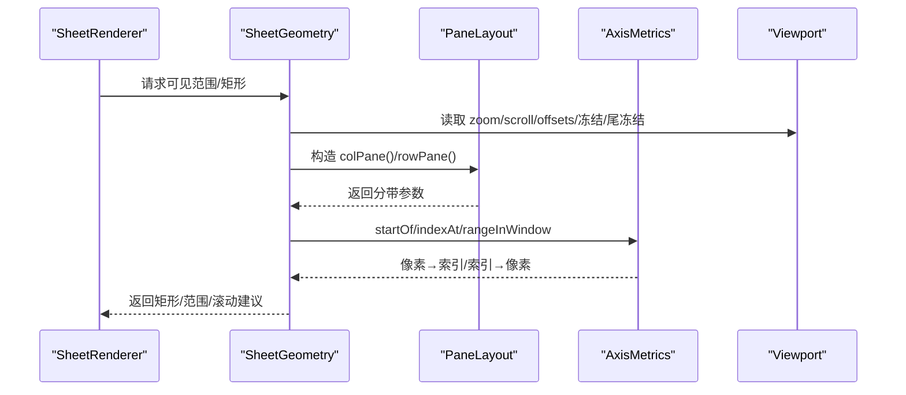
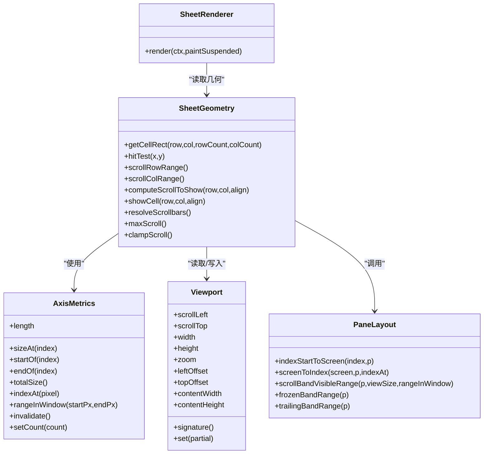
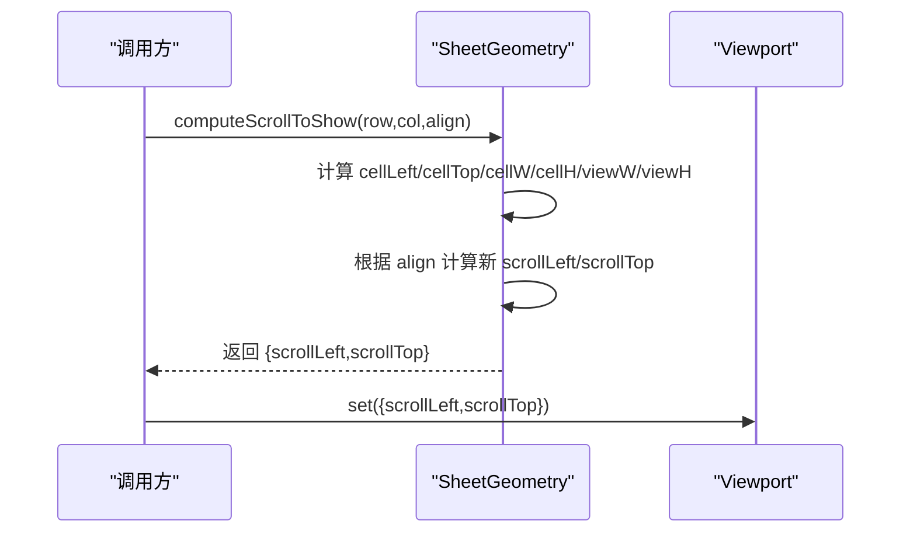
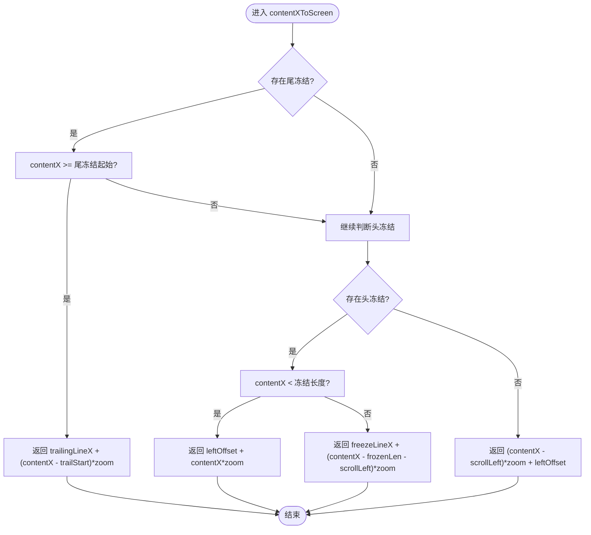

# 几何模型 (SheetGeometry)

<cite>
**本文引用的文件**
- [SheetGeometry.ts](file://cmx-mega-sheet/src/render/SheetGeometry.ts)
- [AxisMetrics.ts](file://cmx-mega-sheet/src/render/AxisMetrics.ts)
- [Viewport.ts](file://cmx-mega-sheet/src/render/Viewport.ts)
- [PaneLayout.ts](file://cmx-mega-sheet/src/render/PaneLayout.ts)
- [SheetRenderer.ts](file://cmx-mega-sheet/src/render/SheetRenderer.ts)
- [SheetGeometry.test.ts](file://cmx-mega-sheet/test/SheetGeometry.test.ts)
</cite>

## 目录
1. [简介](#简介)
2. [项目结构](#项目结构)
3. [核心组件](#核心组件)
4. [架构总览](#架构总览)
5. [详细组件分析](#详细组件分析)
6. [依赖关系分析](#依赖关系分析)
7. [性能与精度](#性能与精度)
8. [故障排查指南](#故障排查指南)
9. [结论](#结论)
10. [附录](#附录)

## 简介
本技术文档聚焦于电子表格渲染层的几何模型 SheetGeometry，系统阐述其坐标体系、行列索引转换、视口映射、冻结/尾冻结分带处理、合并单元格矩形计算、溢出文本边界计算、滚动条布局与交互命中、以及高精度像素对齐策略。同时说明几何模型的缓存机制（惰性前缀和）、增量更新策略（invalidate 与签名变化）、以及与渲染器 SheetRenderer 的数据同步方式。最后给出精度控制、性能优化与测试验证方法。

## 项目结构
几何相关代码位于 cmx-mega-sheet/src/render 目录，核心由以下模块组成：
- AxisMetrics：单轴（行/列）的像素度量与 O(log n) 双向映射，维护惰性构建的前缀和以支持 startOf/endOf/indexAt/rangeInWindow。
- Viewport：记录视口状态（滚动、缩放、尺寸、行列头/大纲带宽、冻结/尾冻结行数/列数、拆分模式、滚动条占位），并提供签名用于外部重定位。
- PaneLayout：冻结/拆分窗格的纯几何变换（indexStartToScreen/screenToIndex/scrollBandVisibleRange 等），统一头冻结、滚动带、尾冻结三带逻辑。
- SheetGeometry：基于 AxisMetrics + Viewport + PaneLayout 的几何层，提供 getCellRect/hitTest/可见范围/滚动计算/滚动条命中等能力。
- SheetRenderer：薄绘制层，仅负责把可见区域画出来，全部几何来自 SheetGeometry。

图表来源
- [AxisMetrics.ts:1-144](file://cmx-mega-sheet/src/render/AxisMetrics.ts#L1-L144)
- [Viewport.ts:1-178](file://cmx-mega-sheet/src/render/Viewport.ts#L1-L178)
- [PaneLayout.ts:1-201](file://cmx-mega-sheet/src/render/PaneLayout.ts#L1-L201)
- [SheetGeometry.ts:1-648](file://cmx-mega-sheet/src/render/SheetGeometry.ts#L1-L648)
- [SheetRenderer.ts:1-200](file://cmx-mega-sheet/src/render/SheetRenderer.ts#L1-L200)

章节来源
- [SheetGeometry.ts:1-648](file://cmx-mega-sheet/src/render/SheetGeometry.ts#L1-L648)
- [AxisMetrics.ts:1-144](file://cmx-mega-sheet/src/render/AxisMetrics.ts#L1-L144)
- [Viewport.ts:1-178](file://cmx-mega-sheet/src/render/Viewport.ts#L1-L178)
- [PaneLayout.ts:1-201](file://cmx-mega-sheet/src/render/PaneLayout.ts#L1-L201)
- [SheetRenderer.ts:1-200](file://cmx-mega-sheet/src/render/SheetRenderer.ts#L1-L200)

## 核心组件
- AxisMetrics：维护 count、sizeAt、hidden、offsets（惰性前缀和）。提供 indexAt（二分）、rangeInWindow（窗口到索引区间）、startOf/endOf/totalSize。隐藏元素计 0 像素但仍占索引，保证与旧内核一致。
- Viewport：管理 scrollLeft/scrollTop、width/height、zoom、行列头/大纲带宽、冻结/尾冻结数量、拆分模式、滚动条占位；提供 contentWidth/contentHeight/leftOffset/topOffset/signature。
- PaneLayout：实现 indexStartToScreen/screenToIndex/scrollBandVisibleRange/frozenBandRange/trailingBandRange 等纯函数，严格保证 index↔screen 互逆不变式。
- SheetGeometry：组合上述能力，暴露 getCellRect/hitTest/可见范围/滚动计算/滚动条命中/大纲按钮命中/自动填充手柄/筛选箭头/复选框/下拉箭头等 API。
- SheetRenderer：读取 geometry 提供的可见范围与矩形，按象限（冻结/滚动/尾冻结）裁剪绘制，确保“画的=点的”。

章节来源
- [AxisMetrics.ts:12-144](file://cmx-mega-sheet/src/render/AxisMetrics.ts#L12-L144)
- [Viewport.ts:16-178](file://cmx-mega-sheet/src/render/Viewport.ts#L16-L178)
- [PaneLayout.ts:22-201](file://cmx-mega-sheet/src/render/PaneLayout.ts#L22-L201)
- [SheetGeometry.ts:80-648](file://cmx-mega-sheet/src/render/SheetGeometry.ts#L80-L648)
- [SheetRenderer.ts:143-200](file://cmx-mega-sheet/src/render/SheetRenderer.ts#L143-L200)

## 架构总览
SheetGeometry 是几何层的核心，职责单一：将「内容坐标」与「屏幕坐标」在冻结/尾冻结/滚动/缩放下进行精确映射，并据此计算可视范围、命中区域、滚动位置等。它不持有数据与 DOM，所有尺寸通过 AxisMetrics 获取，所有视口状态通过 Viewport 提供，分带逻辑委托给 PaneLayout。

图表来源
- [SheetGeometry.ts:87-120](file://cmx-mega-sheet/src/render/SheetGeometry.ts#L87-L120)
- [PaneLayout.ts:102-153](file://cmx-mega-sheet/src/render/PaneLayout.ts#L102-L153)
- [AxisMetrics.ts:44-87](file://cmx-mega-sheet/src/render/AxisMetrics.ts#L44-L87)
- [Viewport.ts:106-129](file://cmx-mega-sheet/src/render/Viewport.ts#L106-L129)

## 详细组件分析

### 坐标系统与变换
- 内容坐标：未缩放、以 A1 左上为原点的逻辑像素（行高列宽的自然累加）。
- 屏幕坐标：相对画布宿主左上角，已含行列头偏移、视口滚动、缩放。
- 基本关系：屏幕 = (内容 - 滚动) * zoom + 头偏移；内容 = (屏幕 - 头偏移) / zoom + 滚动。
- 分带：头冻结带紧贴 offset；滚动带随 scroll；尾冻结带钉在 offset + viewSize 处（M19）。

关键实现路径
- 内容→屏幕：contentXToScreen/contentYToScreen（考虑尾冻结/头冻结/滚动带分支）。
- 屏幕→内容：screenXToContent/screenYToContent（镜像分支）。
- 索引→屏幕：indexStartToScreen（PaneLayout），严格与 screenToIndex 互逆。
- 屏幕→索引：screenToIndex（PaneLayout），先判尾冻结带，再判头冻结带，最后滚动带。

章节来源
- [SheetGeometry.ts:182-254](file://cmx-mega-sheet/src/render/SheetGeometry.ts#L182-L254)
- [PaneLayout.ts:102-153](file://cmx-mega-sheet/src/render/PaneLayout.ts#L102-L153)

### 单元格矩形与合并单元格
- getCellRect(row, col, rowCount=1, colCount=1)：起点用 indexStartToScreen，宽高由 startOf(col+colCount)-startOf(col) 与 startOf(row+rowCount)-startOf(row) 乘以 zoom 得到。合并单元格时返回覆盖整个跨度的矩形，便于徽标定位。
- 合并单元格几何表示：通过传入 rowCount/colCount > 1 即可得到合并区的外包矩形，渲染层可据此绘制徽标或条件格式叠加。

章节来源
- [SheetGeometry.ts:256-270](file://cmx-mega-sheet/src/render/SheetGeometry.ts#L256-L270)

### 行列索引转换与可见范围
- hitTest(screenX, screenY)：层次化判定大纲带/行列头/角落/视口，使用 screenToIndex 严格互逆于 getCellRect 的起点变换。
- 可见范围：visibleRowRange/visibleColRange 在冻结时调用 scrollBandVisibleRange 跳过冻结带；无冻结则直接 rangeInWindow。
- 导出接口：scrollRowRange/scrollColRange/getViewportTopRow/getViewportBottomRow/getViewportLeftColumn/getViewportRightColumn。

章节来源
- [SheetGeometry.ts:272-332](file://cmx-mega-sheet/src/render/SheetGeometry.ts#L272-L332)
- [SheetGeometry.ts:451-500](file://cmx-mega-sheet/src/render/SheetGeometry.ts#L451-L500)
- [PaneLayout.ts:166-200](file://cmx-mega-sheet/src/render/PaneLayout.ts#L166-L200)

### 视口坐标映射与滚动控制
- computeScrollToShow(row, col, align)：计算使目标单元格可见的最小滚动量，支持 start/center/end 对齐；结果钳制到合法范围。
- showCell：直接应用滚动到 Viewport。
- maxScroll/clampScroll：根据冻结/尾冻结扣除后计算最大滚动位置，并在内容变短或放大后钳制当前滚动避免露白。

章节来源
- [SheetGeometry.ts:502-599](file://cmx-mega-sheet/src/render/SheetGeometry.ts#L502-L599)

### 冻结/尾冻结与拆分条
- 冻结线：freezeLineX/Y 返回冻结带屏幕边界；hasFrozenRows/Cols 判断是否存在。
- 尾冻结：trailingLineX/Y 返回尾冻结带屏幕边界；hasTrailingRows/Cols、trailingCols/Rows、trailingColRange/RowRange 提供访问。
- 拆分条（M19-step2）：hitColumnSplit/hitRowSplit 检测是否命中可拖拽的冻结线；splitColToIndex/splitRowToIndex 将屏幕坐标转换为新的冻结行列数。

章节来源
- [SheetGeometry.ts:122-180](file://cmx-mega-sheet/src/render/SheetGeometry.ts#L122-L180)
- [PaneLayout.ts:44-82](file://cmx-mega-sheet/src/render/PaneLayout.ts#L44-L82)

### 滚动条布局与交互
- resolveScrollbars：解析滚动条布局并将 gutter 回写到 Viewport，供后续可见范围与绘制使用。
- hitScrollbar：基于 layout 判断命中垂直/水平条及 thumb/track。
- dragVerticalThumb/dragHorizontalThumb：将滑块位移换算为 scrollTop/scrollLeft 并应用到 Viewport。

章节来源
- [SheetGeometry.ts:548-647](file://cmx-mega-sheet/src/render/SheetGeometry.ts#L548-L647)

### 大纲区与控件命中
- rowCenterScreen/colCenterScreen：用于定位大纲按钮。
- hitOutlineButton：层级总开关与分组 +/- 按钮命中，考虑双轴角落优先级，避免早退导致漏命中。
- 其他控件命中：hitFilterArrow（筛选箭头）、hitCheckbox（复选框）、hitCellDropdown（下拉箭头）、hitFillHandle（自动填充手柄）。

章节来源
- [SheetGeometry.ts:334-449](file://cmx-mega-sheet/src/render/SheetGeometry.ts#L334-L449)

### 与渲染器的数据同步
- SheetRenderer 从 geometry 获取冻结/尾冻结数量与可见范围，按 3×3 象限分别 clip 绘制，确保“画的=点的”。
- 渲染前会计算条件格式叠加，并在每帧之前由 element 注入 ScrollbarLayout。
- 几何层不直接依赖 Canvas 类型，仅输出矩形与范围，保持纯计算特性。

章节来源
- [SheetRenderer.ts:143-200](file://cmx-mega-sheet/src/render/SheetRenderer.ts#L143-L200)

## 依赖关系分析
- SheetGeometry 强依赖 AxisMetrics（尺寸与索引映射）、Viewport（视口状态）、PaneLayout（分带变换）。
- SheetRenderer 依赖 SheetGeometry 提供几何信息，间接依赖 AxisMetrics/Viewport/PaneLayout。
- 各模块之间耦合清晰：几何层只读 Viewport，写操作通过 viewport.set 完成；AxisMetrics 通过 invalidate 触发惰性重建；PaneLayout 为纯函数，无状态。

图表来源
- [AxisMetrics.ts:12-144](file://cmx-mega-sheet/src/render/AxisMetrics.ts#L12-L144)
- [Viewport.ts:16-178](file://cmx-mega-sheet/src/render/Viewport.ts#L16-L178)
- [PaneLayout.ts:22-201](file://cmx-mega-sheet/src/render/PaneLayout.ts#L22-L201)
- [SheetGeometry.ts:80-648](file://cmx-mega-sheet/src/render/SheetGeometry.ts#L80-L648)
- [SheetRenderer.ts:143-200](file://cmx-mega-sheet/src/render/SheetRenderer.ts#L143-L200)

章节来源
- [SheetGeometry.ts:80-648](file://cmx-mega-sheet/src/render/SheetGeometry.ts#L80-L648)
- [AxisMetrics.ts:12-144](file://cmx-mega-sheet/src/render/AxisMetrics.ts#L12-L144)
- [Viewport.ts:16-178](file://cmx-mega-sheet/src/render/Viewport.ts#L16-L178)
- [PaneLayout.ts:22-201](file://cmx-mega-sheet/src/render/PaneLayout.ts#L22-L201)
- [SheetRenderer.ts:143-200](file://cmx-mega-sheet/src/render/SheetRenderer.ts#L143-L200)

## 性能与精度

### 缓存机制
- AxisMetrics 使用惰性前缀和 offsets，仅在首次访问或 invalidate/setCount 后重建，避免每次查询都线性扫描。
- 隐藏行/列尺寸为 0，二分时天然跳过，减少无效命中。
- Viewport.signature 聚合所有影响屏幕位置的变量，外部可通过签名变化决定是否需要重定位叠层，避免每帧重算。

章节来源
- [AxisMetrics.ts:17-105](file://cmx-mega-sheet/src/render/AxisMetrics.ts#L17-L105)
- [Viewport.ts:116-156](file://cmx-mega-sheet/src/render/Viewport.ts#L116-L156)

### 增量更新策略
- 当行高/列宽/行列数变化时，调用 AxisMetrics.invalidate 或 setCount，下次访问 startOf/indexAt 时重建前缀和。
- 结构版本 bumpStructure 纳入 signature，触发外部重定位（如设计器徽标叠层）。
- 滚动条布局 resolveScrollbars 在 resize/滚动/缩放/结构变化后、draw 之前执行，确保后续可见范围与绘制正确。

章节来源
- [AxisMetrics.ts:90-111](file://cmx-mega-sheet/src/render/AxisMetrics.ts#L90-L111)
- [Viewport.ts:116-119](file://cmx-mega-sheet/src/render/Viewport.ts#L116-L119)
- [SheetGeometry.ts:548-572](file://cmx-mega-sheet/src/render/SheetGeometry.ts#L548-L572)

### 与渲染器的数据同步
- SheetRenderer 在 render 中读取 geometry 的 frozen/trailing/visible ranges，按象限 clip 绘制，保证“画的=点的”。
- 条件格式叠加在渲染前计算一次，避免重复评估。
- 滚动条布局由 element 每帧注入，几何层解析后回写 gutter，保证可见范围与绘制一致。

章节来源
- [SheetRenderer.ts:169-200](file://cmx-mega-sheet/src/render/SheetRenderer.ts#L169-L200)
- [SheetGeometry.ts:548-572](file://cmx-mega-sheet/src/render/SheetGeometry.ts#L548-L572)

### 溢出文本的边界计算
- 几何层不直接测量文本，但提供单元格矩形与控件命中（筛选箭头、复选框、下拉箭头）的几何基础。渲染层结合 measureText 与单元格矩形进行溢出判断与绘制。
- 对于需要显示溢出内容的场景，可基于 getCellRect 得到的矩形与 zoom 进行像素级测量与裁剪。

章节来源
- [SheetGeometry.ts:355-387](file://cmx-mega-sheet/src/render/SheetGeometry.ts#L355-L387)
- [SheetRenderer.ts:35-68](file://cmx-mega-sheet/src/render/SheetRenderer.ts#L35-L68)

### 高精度渲染与像素对齐
- 所有屏幕坐标均经过 zoom 缩放，startOf/endOf 基于整数像素累加，避免亚像素累积误差。
- Viewport.zoom 限制在 0.1~4，避免极端缩放导致的数值不稳定。
- signature 对数值取整，避免抖动刷屏。
- 命中容差（tolerance）使用固定像素值，不随缩放变化，符合手感与一致性。

章节来源
- [Viewport.ts:78-86](file://cmx-mega-sheet/src/render/Viewport.ts#L78-L86)
- [Viewport.ts:131-156](file://cmx-mega-sheet/src/render/Viewport.ts#L131-L156)
- [SheetGeometry.ts:304-332](file://cmx-mega-sheet/src/render/SheetGeometry.ts#L304-L332)

### 性能优化建议
- 批量更新 AxisMetrics 后统一 invalidate，减少多次重建。
- 使用 visible ranges 仅绘制可见单元格，避免全量绘制。
- 条件格式叠加在渲染前计算一次，避免重复评估。
- 合理使用 freeze/trailing 分带，减少滚动带计算开销。

[本节为通用指导，无需具体文件引用]

## 故障排查指南
- 命中不一致：检查 getCellRect 与 hitTest 是否严格互逆；确认 screenToIndex 与 indexStartToScreen 分支一致（头冻结/滚动带/尾冻结）。
- 滚动越界：调用 clampScroll 或在 computeScrollToShow 后钳制到 maxScroll。
- 可见范围异常：确认 AxisMetrics.rangeInWindow 的半开窗口语义；冻结时优先使用 scrollBandVisibleRange。
- 滚动条错位：确保在 draw 之前调用 resolveScrollbars，且 gutter 已回写至 Viewport。
- 大纲按钮漏命中：确认 hitOutlineButton 先测层级总开关，再按 band 分支，避免早退。

章节来源
- [SheetGeometry.ts:272-332](file://cmx-mega-sheet/src/render/SheetGeometry.ts#L272-L332)
- [SheetGeometry.ts:574-599](file://cmx-mega-sheet/src/render/SheetGeometry.ts#L574-L599)
- [SheetGeometry.ts:402-449](file://cmx-mega-sheet/src/render/SheetGeometry.ts#L402-L449)

## 结论
SheetGeometry 作为几何层核心，提供了稳定、可测试、高性能的坐标映射与可视范围计算能力。通过 AxisMetrics 的惰性前缀和、PaneLayout 的分带纯函数、Viewport 的签名机制，实现了精确的像素对齐与高效的增量更新。与 SheetRenderer 的解耦设计确保了“画的=点的”，为复杂交互（冻结/尾冻结/拆分条/大纲/控件命中）提供了坚实基础。

[本节为总结，无需具体文件引用]

## 附录

### 关键流程时序图：滚动使单元格可见

图表来源
- [SheetGeometry.ts:502-546](file://cmx-mega-sheet/src/render/SheetGeometry.ts#L502-L546)

### 关键流程图：内容坐标→屏幕坐标（含冻结/尾冻结）

图表来源
- [SheetGeometry.ts:182-200](file://cmx-mega-sheet/src/render/SheetGeometry.ts#L182-L200)

### 测试验证方法
- 单元矩形与命中互逆：在不同滚动/缩放配置下，采样单元格中心点，验证 hitTest 返回与原单元格一致。
- 可见范围：验证不同 scrollTop/scrollLeft 下的 getViewportTopRow/getViewportBottomRow/getViewportLeftColumn/getViewportRightColumn。
- 滚动对齐：验证 start/center/end 对齐的 computeScrollToShow 结果与预期一致，且不越界。
- 隐藏行：验证隐藏行折叠后的几何与命中行为。
- 大纲按钮：验证双轴层级按钮在角落的命中优先级。

章节来源
- [SheetGeometry.test.ts:18-185](file://cmx-mega-sheet/test/SheetGeometry.test.ts#L18-L185)
- [SheetGeometry.test.ts:187-200](file://cmx-mega-sheet/test/SheetGeometry.test.ts#L187-L200)