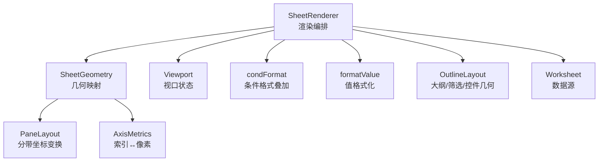
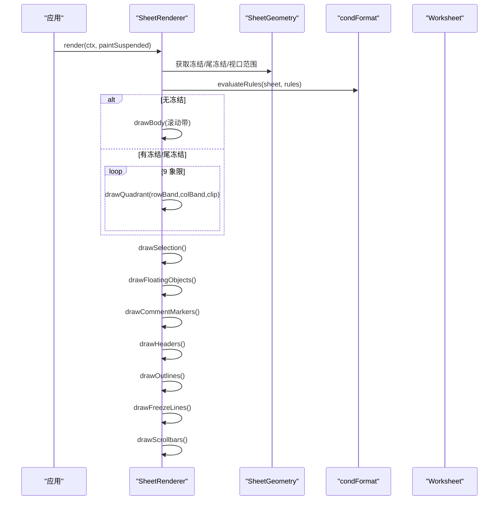
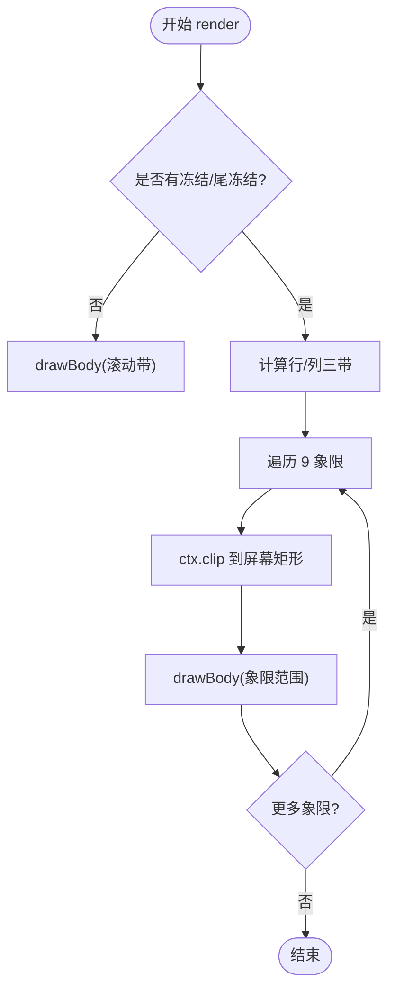
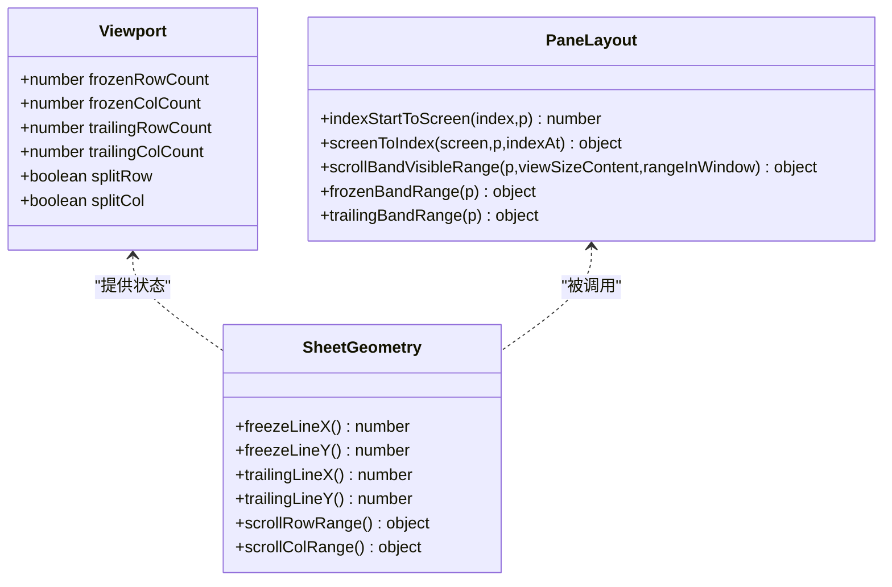
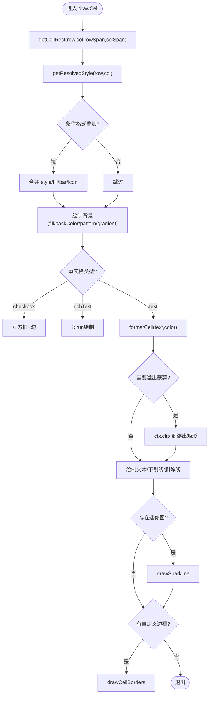
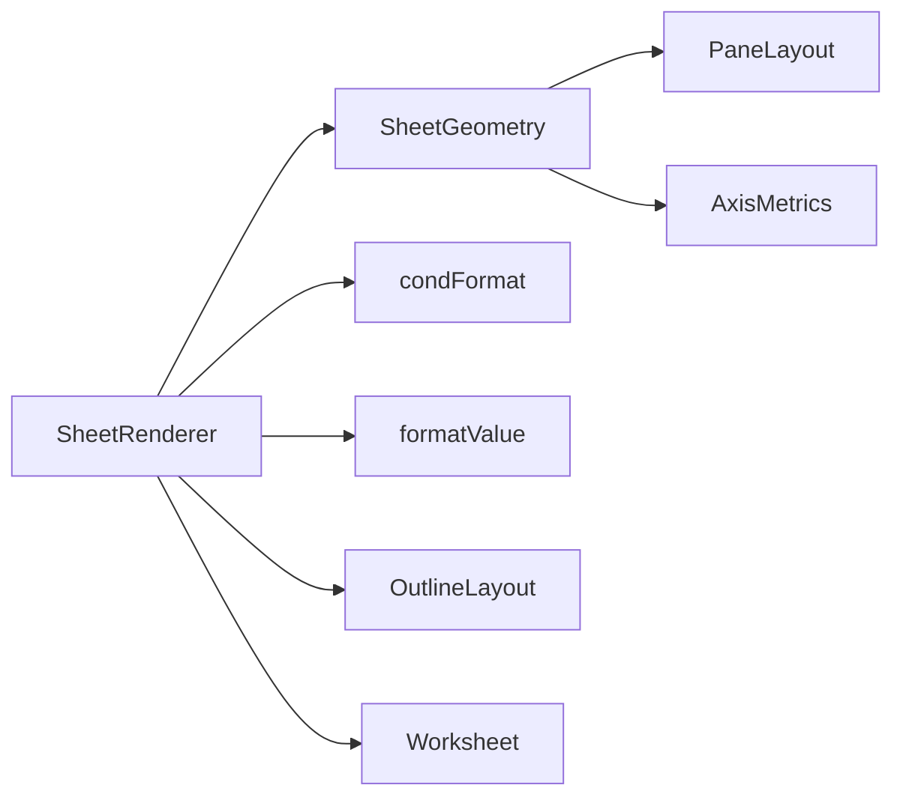

# 工作表渲染器 (SheetRenderer)

<cite>
**本文引用的文件**
- [SheetRenderer.ts](file://cmx-mega-sheet/src/render/SheetRenderer.ts)
- [Viewport.ts](file://cmx-mega-sheet/src/render/Viewport.ts)
- [PaneLayout.ts](file://cmx-mega-sheet/src/render/PaneLayout.ts)
- [SheetGeometry.ts](file://cmx-mega-sheet/src/render/SheetGeometry.ts)
- [AxisMetrics.ts](file://cmx-mega-sheet/src/render/AxisMetrics.ts)
- [condFormat.ts](file://cmx-mega-sheet/src/render/condFormat.ts)
- [formatValue.ts](file://cmx-mega-sheet/src/render/formatValue.ts)
- [OutlineLayout.ts](file://cmx-mega-sheet/src/render/OutlineLayout.ts)
- [Worksheet.ts](file://cmx-mega-sheet/src/core/Worksheet.ts)
</cite>

## 目录
1. [简介](#简介)
2. [项目结构](#项目结构)
3. [核心组件](#核心组件)
4. [架构总览](#架构总览)
5. [详细组件分析](#详细组件分析)
6. [依赖关系分析](#依赖关系分析)
7. [性能考量](#性能考量)
8. [故障排查指南](#故障排查指南)
9. [结论](#结论)
10. [附录：定制与扩展指南](#附录定制与扩展指南)

## 简介
本技术文档围绕工作表渲染器 SheetRenderer，系统性说明其可见区域渲染、象限划分算法、冻结行列处理机制；深入解析单元格绘制流程（drawCell）、合并单元格处理、条件格式叠加、浮动对象渲染等核心功能；并覆盖主题系统、网格线绘制、选区高亮、滚动条渲染等视觉元素。最后给出增量渲染、视口裁剪、硬件加速等性能优化策略及自定义渲染器与主题的扩展指南。

## 项目结构
渲染子系统位于 cmx-mega-sheet/src/render，核心由以下模块组成：
- SheetRenderer：Canvas 绘制层，负责把可见区域画出来（网格线、行列头、单元格文本/背景/边框、合并跨格、选区）。
- SheetGeometry：单元格与屏幕像素的几何映射，含视口、冻结/尾冻结分带、滚动条布局、命中测试。
- Viewport：记录视口滚动、缩放、行列头/大纲占位、冻结/尾冻结状态、滚动条占位等。
- PaneLayout：单轴（行或列）的分带坐标变换（冻结带/滚动带/尾冻结带），提供 index↔screen 互逆变换。
- AxisMetrics：单轴的 O(log n) 索引↔像素双向映射（前缀和 + 二分）。
- condFormat：条件格式引擎（cellValue/colorScale/dataBar/iconSet），纯计算，生成叠加结果供渲染叠加。
- formatValue：单元格显示值格式化（委托 numFmt 编译器）。
- OutlineLayout：大纲区布局计算（分组按钮、层级开关、筛选箭头、复选框、下拉箭头矩形）。
- Worksheet：数据模型（无渲染），提供值、样式、合并、选区、大纲、浮动对象等数据源。

图表来源
- [SheetRenderer.ts:143-229](file://cmx-mega-sheet/src/render/SheetRenderer.ts#L143-L229)
- [SheetGeometry.ts:80-142](file://cmx-mega-sheet/src/render/SheetGeometry.ts#L80-L142)
- [PaneLayout.ts:22-42](file://cmx-mega-sheet/src/render/PaneLayout.ts#L22-L42)
- [AxisMetrics.ts:12-29](file://cmx-mega-sheet/src/render/AxisMetrics.ts#L12-L29)
- [condFormat.ts:17-45](file://cmx-mega-sheet/src/render/condFormat.ts#L17-L45)
- [formatValue.ts:15-23](file://cmx-mega-sheet/src/render/formatValue.ts#L15-L23)
- [OutlineLayout.ts:16-46](file://cmx-mega-sheet/src/render/OutlineLayout.ts#L16-L46)
- [Worksheet.ts:29-186](file://cmx-mega-sheet/src/core/Worksheet.ts#L29-L186)

章节来源
- [SheetRenderer.ts:143-229](file://cmx-mega-sheet/src/render/SheetRenderer.ts#L143-L229)
- [SheetGeometry.ts:80-142](file://cmx-mega-sheet/src/render/SheetGeometry.ts#L80-L142)

## 核心组件
- SheetRenderer：渲染编排中心，负责背景、条件格式预计算、象限绘制、选择区、浮动对象、批注标记、行列头、大纲、冻结线、滚动条。
- SheetGeometry：提供 getCellRect、hitTest、freezeLineX/Y、trailingLineX/Y、scrollRowRange/scrollColRange、resolveScrollbars 等能力。
- Viewport：维护 scrollLeft/scrollTop/width/height/zoom、rowHeaderWidth/colHeaderHeight、rowOutlineWidth/colOutlineHeight、frozenRowCount/frozenColCount、trailingRowCount/trailingColCount、splitRow/splitCol、scrollbarGutterRight/Bottom。
- PaneLayout：indexStartToScreen/screenToIndex、bandOf/isFrozen、scrollBandVisibleRange、frozenBandRange、trailingBandRange。
- AxisMetrics：startOf/endOf/totalSize/indexAt/rangeInWindow，惰性构建前缀和，O(log n) 命中。
- condFormat：evaluateRules 输出 Map<"r,c", overlay>，overlay 包含 style/bar/icon/fill。
- formatValue：formatCell(value, formatter?) → { text, color? }。
- OutlineLayout：outlinePaneThickness、levelSlotCenter、row/colOutlineButtons、levelButtons/colLevelButtons、filterArrowBox、checkboxBox、cellDropdownBox。
- Worksheet：数据源，提供 getValue/getStyle/getSpans/getSelections/listConditionalRules/listFloatingObjects/listComments 等。

章节来源
- [SheetRenderer.ts:143-229](file://cmx-mega-sheet/src/render/SheetRenderer.ts#L143-L229)
- [SheetGeometry.ts:80-142](file://cmx-mega-sheet/src/render/SheetGeometry.ts#L80-L142)
- [Viewport.ts:16-42](file://cmx-mega-sheet/src/render/Viewport.ts#L16-L42)
- [PaneLayout.ts:22-42](file://cmx-mega-sheet/src/render/PaneLayout.ts#L22-L42)
- [AxisMetrics.ts:12-29](file://cmx-mega-sheet/src/render/AxisMetrics.ts#L12-L29)
- [condFormat.ts:17-45](file://cmx-mega-sheet/src/render/condFormat.ts#L17-L45)
- [formatValue.ts:15-23](file://cmx-mega-sheet/src/render/formatValue.ts#L15-L23)
- [OutlineLayout.ts:16-46](file://cmx-mega-sheet/src/render/OutlineLayout.ts#L16-L46)
- [Worksheet.ts:29-186](file://cmx-mega-sheet/src/core/Worksheet.ts#L29-L186)

## 架构总览
SheetRenderer 作为薄渲染层，不直接持有 Canvas 类型，而是通过 RenderContext2D 最小接口调用绘制。渲染流程如下：
- 背景填充
- 条件格式规则评估，生成叠加 Map
- 根据冻结/尾冻结情况，将内容划分为 3×3=9 个象限（头冻结/滚动/尾冻结 × 列头冻结/滚动/尾冻结），每个象限 clip 到屏幕矩形后调用 drawBody
- drawBody：先画网格线，再画单元格，再画合并区（覆盖内部网格线）
- 选区高亮、浮动对象、批注三角标记、行列头、大纲区、冻结线、滚动条

图表来源
- [SheetRenderer.ts:169-229](file://cmx-mega-sheet/src/render/SheetRenderer.ts#L169-L229)
- [condFormat.ts:33-45](file://cmx-mega-sheet/src/render/condFormat.ts#L33-L45)
- [SheetGeometry.ts:80-142](file://cmx-mega-sheet/src/render/SheetGeometry.ts#L80-L142)

## 详细组件分析

### 可见区域渲染与象限划分算法
- 可见范围：通过 SheetGeometry.getViewportTopRow/BottomRow/LeftColumn/RightColumn 获取滚动带可见行列区间；冻结带恒可见。
- 象限划分：按行三带（头冻结/滚动/尾冻结）与列三带组合成 9 个象限。主区（滚×滚）先画，冻结象限后画盖在其上，以对齐 Excel 图层顺序。
- 视口裁剪：每个象限使用 ctx.clip 限制到屏幕矩形，防止越界漫画到相邻带。

图表来源
- [SheetRenderer.ts:180-229](file://cmx-mega-sheet/src/render/SheetRenderer.ts#L180-L229)
- [SheetGeometry.ts:451-500](file://cmx-mega-sheet/src/render/SheetGeometry.ts#L451-L500)

章节来源
- [SheetRenderer.ts:180-229](file://cmx-mega-sheet/src/render/SheetRenderer.ts#L180-L229)
- [SheetGeometry.ts:451-500](file://cmx-mega-sheet/src/render/SheetGeometry.ts#L451-L500)

### 冻结行列处理机制
- 冻结带：头冻结（顶部 N 行/左侧 N 列）不随滚动移动，紧贴头偏移绘制。
- 尾冻结：M19 引入尾冻结（底部 M 行/右侧 M 列）钉在视口末端不滚动。
- 分带坐标变换：PaneLayout.indexStartToScreen/screenToIndex 保证 index↔screen 严格互逆，支持冻结/尾冻结/滚动三种带。
- 拆分模式：M19-step2 支持 splitRow/splitCol，冻结线变为可拖拽的粗拆分条，渲染为浅底带+中缝深线+抓握点。

图表来源
- [Viewport.ts:16-42](file://cmx-mega-sheet/src/render/Viewport.ts#L16-L42)
- [PaneLayout.ts:22-42](file://cmx-mega-sheet/src/render/PaneLayout.ts#L22-L42)
- [SheetGeometry.ts:80-142](file://cmx-mega-sheet/src/render/SheetGeometry.ts#L80-L142)

章节来源
- [PaneLayout.ts:22-42](file://cmx-mega-sheet/src/render/PaneLayout.ts#L22-L42)
- [SheetGeometry.ts:80-142](file://cmx-mega-sheet/src/render/SheetGeometry.ts#L80-L142)
- [Viewport.ts:16-42](file://cmx-mega-sheet/src/render/Viewport.ts#L16-L42)

### 单元格绘制流程（drawCell）
- 获取单元格矩形与解析样式，应用条件格式叠加（style/fill/bar/icon）。
- 背景绘制：条件格式色阶 fill 优先 > backColor solid > style.fill 结构化填充。
- 特殊类型：checkbox 仅画方框与勾，不画文本。
- 数据条与图标集：按比例画条（文本之下），图标集在格左侧并缩进文本。
- 超链接与富文本：超链接蓝色下划线；富文本逐 run 分段绘制，支持换行与垂直定位。
- 溢出裁剪：非折行文本可溢入相邻空格，遇到有内容的格即止，避免覆盖邻格文字。
- 迷你图：在文本之上、边框之下绘制 sparkline。
- 边框：自定义边框（含双线、虚线、点线、对角线）最后绘制。

图表来源
- [SheetRenderer.ts:452-533](file://cmx-mega-sheet/src/render/SheetRenderer.ts#L452-L533)
- [SheetRenderer.ts:640-683](file://cmx-mega-sheet/src/render/SheetRenderer.ts#L640-L683)
- [SheetRenderer.ts:685-772](file://cmx-mega-sheet/src/render/SheetRenderer.ts#L685-L772)
- [SheetRenderer.ts:931-994](file://cmx-mega-sheet/src/render/SheetRenderer.ts#L931-L994)

章节来源
- [SheetRenderer.ts:452-533](file://cmx-mega-sheet/src/render/SheetRenderer.ts#L452-L533)
- [SheetRenderer.ts:640-683](file://cmx-mega-sheet/src/render/SheetRenderer.ts#L640-L683)
- [SheetRenderer.ts:685-772](file://cmx-mega-sheet/src/render/SheetRenderer.ts#L685-L772)
- [SheetRenderer.ts:931-994](file://cmx-mega-sheet/src/render/SheetRenderer.ts#L931-L994)

### 合并单元格处理
- 合并区在网格线之后绘制：先用背景色铺满整个跨度，覆盖内部网格线，再画外框、内容、自定义边框，确保视觉上“一个格”。
- 合并区文本取自左上角单元格的值，并使用该单元格的样式进行绘制。

章节来源
- [SheetRenderer.ts:1131-1166](file://cmx-mega-sheet/src/render/SheetRenderer.ts#L1131-L1166)

### 条件格式叠加
- 渲染前统一评估所有规则，生成 Map<"r,c", overlay>，overlay 包含 style、fill、bar、icon。
- cellValue：比较运算（>/</between/等于/文本含/Top N/重复/唯一）→ 命中套 style。
- colorScale：2/3 色渐变，按区域 min/mid/max 线性插值背景色。
- dataBar：格内按值比例画条（返回 0..1 的 ratio）。
- iconSet：按分位分档（返回图标索引）。

章节来源
- [condFormat.ts:17-45](file://cmx-mega-sheet/src/render/condFormat.ts#L17-L45)
- [condFormat.ts:68-182](file://cmx-mega-sheet/src/render/condFormat.ts#L68-L182)
- [SheetRenderer.ts:176-178](file://cmx-mega-sheet/src/render/SheetRenderer.ts#L176-L178)

### 浮动对象渲染
- 浮动对象包括图片、图表、形状，位置经 resolveObjectRect 锚定到单元格矩形，随滚动/缩放/冻结跟随。
- 图片：优先从 imageCache 取 HTMLImageElement 绘制，否则画占位灰框+图标。
- 图表：buildChartData 从数据源区域抽取类别与系列，调用 drawChart 绘制。
- 形状：矩形/椭圆/线，支持填充与描边。
- 选中对象：selectedObjectId 对应对象绘制选框与调整手柄。

章节来源
- [SheetRenderer.ts:319-379](file://cmx-mega-sheet/src/render/SheetRenderer.ts#L319-L379)
- [SheetRenderer.ts:381-405](file://cmx-mega-sheet/src/render/SheetRenderer.ts#L381-L405)

### 主题系统与视觉元素
- 主题：RenderTheme 定义网格线、头部背景/前景、选中高亮、大纲区、滚动条、冻结线等颜色；内置 LIGHT_THEME/DARK_THEME。
- 网格线：按可见行列绘制横竖线，单元格背景/边框覆盖默认网格线。
- 选区高亮：扩展选区到合并区，绘制半透明填充与边框，最后一个选区右下角绘制自动填充手柄。
- 滚动条：轨道底色 + 圆角滑块，双条交汇时填充右下角小块。
- 行列头：列头/行头背景、分隔线、选中高亮、列标/行号文字、自动筛选箭头。
- 大纲区：分组线、+/− 按钮、层级总开关（1 2 3…）。

章节来源
- [SheetRenderer.ts:70-138](file://cmx-mega-sheet/src/render/SheetRenderer.ts#L70-L138)
- [SheetRenderer.ts:1106-1129](file://cmx-mega-sheet/src/render/SheetRenderer.ts#L1106-L1129)
- [SheetRenderer.ts:1168-1191](file://cmx-mega-sheet/src/render/SheetRenderer.ts#L1168-L1191)
- [SheetRenderer.ts:1235-1333](file://cmx-mega-sheet/src/render/SheetRenderer.ts#L1235-L1333)
- [SheetRenderer.ts:1347-1473](file://cmx-mega-sheet/src/render/SheetRenderer.ts#L1347-L1473)
- [SheetRenderer.ts:1475-1506](file://cmx-mega-sheet/src/render/SheetRenderer.ts#L1475-L1506)

### 滚动条渲染与交互
- 滚动条布局由 SheetGeometry.resolveScrollbars 计算，回写 gutter 到 Viewport，影响 contentWidth/Height 与可见范围。
- 命中测试：hitScrollbar 区分滑块与轨道空白，支持拖拽与翻页。
- 拖拽：dragVerticalThumb/dragHorizontalThumb 将滑块位置换算为 scrollTop/scrollLeft 并应用到 Viewport。

章节来源
- [SheetGeometry.ts:548-646](file://cmx-mega-sheet/src/render/SheetGeometry.ts#L548-L646)

## 依赖关系分析
- SheetRenderer 依赖 SheetGeometry 提供几何与视口信息，依赖 Viewport 提供当前视口状态。
- SheetGeometry 依赖 PaneLayout 进行分带坐标变换，依赖 AxisMetrics 进行索引↔像素映射。
- condFormat 与 formatValue 为纯逻辑模块，不依赖 DOM，便于 Node 单测。
- OutlineLayout 为渲染与几何命中共享的纯函数库，保证“画的=点的”。

图表来源
- [SheetRenderer.ts:143-229](file://cmx-mega-sheet/src/render/SheetRenderer.ts#L143-L229)
- [SheetGeometry.ts:80-142](file://cmx-mega-sheet/src/render/SheetGeometry.ts#L80-L142)
- [PaneLayout.ts:22-42](file://cmx-mega-sheet/src/render/PaneLayout.ts#L22-L42)
- [AxisMetrics.ts:12-29](file://cmx-mega-sheet/src/render/AxisMetrics.ts#L12-L29)
- [condFormat.ts:17-45](file://cmx-mega-sheet/src/render/condFormat.ts#L17-L45)
- [formatValue.ts:15-23](file://cmx-mega-sheet/src/render/formatValue.ts#L15-L23)
- [OutlineLayout.ts:16-46](file://cmx-mega-sheet/src/render/OutlineLayout.ts#L16-L46)
- [Worksheet.ts:29-186](file://cmx-mega-sheet/src/core/Worksheet.ts#L29-L186)

章节来源
- [SheetRenderer.ts:143-229](file://cmx-mega-sheet/src/render/SheetRenderer.ts#L143-L229)
- [SheetGeometry.ts:80-142](file://cmx-mega-sheet/src/render/SheetGeometry.ts#L80-L142)

## 性能考量
- 增量渲染：render 支持 paintSuspended 参数，当 Workbook.isPaintSuspended 为 true 时跳过绘制，批量更新后再重绘。
- 视口裁剪：每个象限使用 ctx.clip 限制到屏幕矩形，避免越界绘制；可见范围通过 AxisMetrics.rangeInWindow 与 PaneLayout.scrollBandVisibleRange 精确计算。
- 稀疏度量：AxisMetrics 惰性构建前缀和，隐藏行列尺寸计 0，减少无效绘制与命中计算。
- 条件格式预计算：渲染前一次性 evaluateRules，生成 Map 供 drawCell 快速叠加，避免每格重复计算。
- 结构化填充与渐变：paintPattern/paintGradient 手写实现，避免依赖浏览器渐变 API，提升兼容性并减少开销。
- 溢出裁剪：对非折行文本按需启用 ctx.clip，仅在必要时测量与裁剪，降低额外开销。
- 硬件加速建议：
  - 尽量复用 RenderContext2D 的 native 能力（如 setLineDash、translate/rotate），让浏览器 GPU 加速路径生效。
  - 控制频繁 save/restore 次数，合并绘制批次。
  - 图片缓存 imageCache 避免重复解码与绘制。
  - 大表格场景下，结合虚拟滚动（Viewport.zoom/scroll）与象限裁剪，显著减少绘制量。

[本节为通用性能指导，不直接分析具体文件]

## 故障排查指南
- 条件格式未生效：检查 condOverlays 是否生成（rules.length ? evaluateRules(...) : null），确认 overlay.style/fill/bar/icon 是否正确叠加。
- 合并单元格网格线异常：确认 drawSpans 在网格线之后绘制，且背景色覆盖内部网格线。
- 溢出文本被截断：检查 overflowClipRect 逻辑与非折行标志（wordWrap/shrinkToFit），必要时扩大可视范围或禁用溢出。
- 滚动条不可见或错位：确保 resolveScrollbars 已调用并回写 gutter，viewport.contentWidth/Height 正确扣除滚动条占位。
- 冻结线位置错误：验证 freezeLineX/Y 与 trailingLineX/Y 计算，确认 splitRow/splitCol 模式下的粗拆分条绘制。
- 大纲按钮点击无效：核对 OutlineLayout 计算的按钮矩形与 SheetGeometry.hitOutlineButton 命中逻辑一致。

章节来源
- [condFormat.ts:33-45](file://cmx-mega-sheet/src/render/condFormat.ts#L33-L45)
- [SheetRenderer.ts:1131-1166](file://cmx-mega-sheet/src/render/SheetRenderer.ts#L1131-L1166)
- [SheetRenderer.ts:640-683](file://cmx-mega-sheet/src/render/SheetRenderer.ts#L640-L683)
- [SheetGeometry.ts:548-646](file://cmx-mega-sheet/src/render/SheetGeometry.ts#L548-L646)
- [SheetRenderer.ts:258-317](file://cmx-mega-sheet/src/render/SheetRenderer.ts#L258-L317)
- [OutlineLayout.ts:16-46](file://cmx-mega-sheet/src/render/OutlineLayout.ts#L16-L46)

## 结论
SheetRenderer 以薄渲染层为核心，结合 SheetGeometry 的几何映射与 PaneLayout 的分带变换，实现了高效的可见区域渲染与复杂的冻结/尾冻结场景。通过条件格式预计算、视口裁剪、稀疏度量等手段，保证了在大表格场景下的性能与稳定性。同时，主题系统、网格线、选区、滚动条、大纲等视觉元素提供了完整的用户体验。扩展方面，可通过自定义 RenderTheme、注入 imageCache、以及利用 RenderContext2D 的最小接口实现自定义渲染器。

[本节为总结性内容，不直接分析具体文件]

## 附录：定制与扩展指南
- 自定义主题：
  - 替换 RenderTheme 中的颜色字段（gridline/headerBack/headerFore/headerLine/headerActiveBack/headerActiveFore/sheetBack/cellFore/selectionBorder/selectionFill/outlineBack/outlineLine/outlineButtonBack/outlineButtonFore/scrollbarTrack/scrollbarThumb/freezeLine）。
  - 同步更新 chartTheme（LIGHT_CHART_THEME/DARK_CHART_THEME）以匹配图表配色。
- 自定义渲染器：
  - 实现 RenderContext2D 接口，适配不同环境（如 jsdom 桩或 Node 测试）。
  - 重写关键绘制方法（如 drawCellBackground、drawCellBorders、drawGridlines）以实现特定视觉效果。
  - 利用 imageCache 缓存图片资源，避免重复加载。
- 扩展条件格式：
  - 在 condFormat.ts 中添加新规则类型，并在 evaluateRules 中注册处理逻辑。
  - 在 drawCell 中读取 overlay 并叠加相应效果。
- 扩展浮动对象：
  - 在 Worksheet 中新增 FloatingObject.kind 与 shape 类型，并在 SheetRenderer.drawFloatingObjects 中增加绘制分支。
- 性能调优：
  - 合理使用 paintSuspended 批量更新。
  - 控制 ctx.save/restore 频率，合并绘制批次。
  - 利用 AxisMetrics 的 rangeInWindow 与 PaneLayout 的分带可见范围，减少无效绘制。

章节来源
- [SheetRenderer.ts:70-138](file://cmx-mega-sheet/src/render/SheetRenderer.ts#L70-L138)
- [SheetRenderer.ts:143-163](file://cmx-mega-sheet/src/render/SheetRenderer.ts#L143-L163)
- [condFormat.ts:33-45](file://cmx-mega-sheet/src/render/condFormat.ts#L33-L45)
- [SheetRenderer.ts:319-379](file://cmx-mega-sheet/src/render/SheetRenderer.ts#L319-L379)
- [AxisMetrics.ts:113-142](file://cmx-mega-sheet/src/render/AxisMetrics.ts#L113-L142)
- [PaneLayout.ts:166-200](file://cmx-mega-sheet/src/render/PaneLayout.ts#L166-L200)