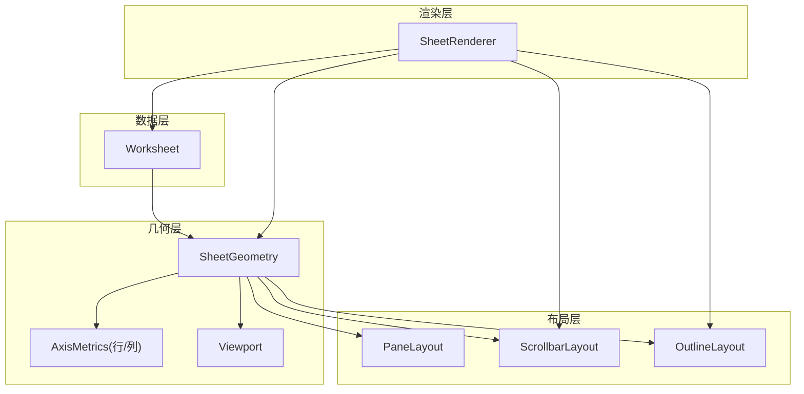
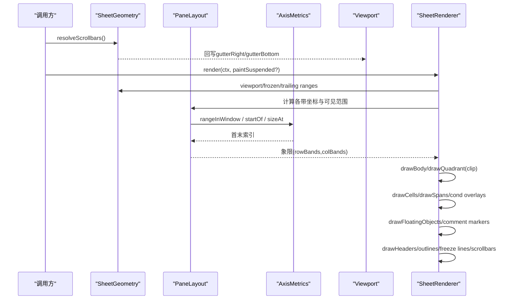
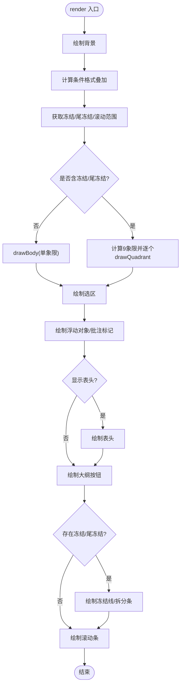
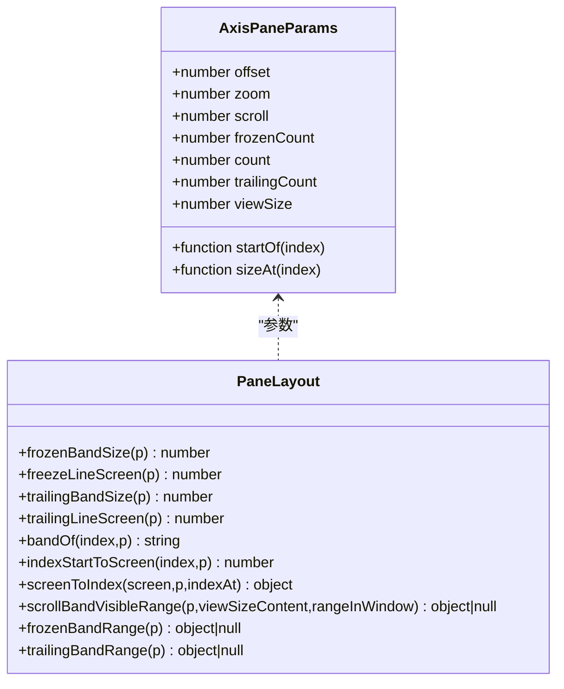
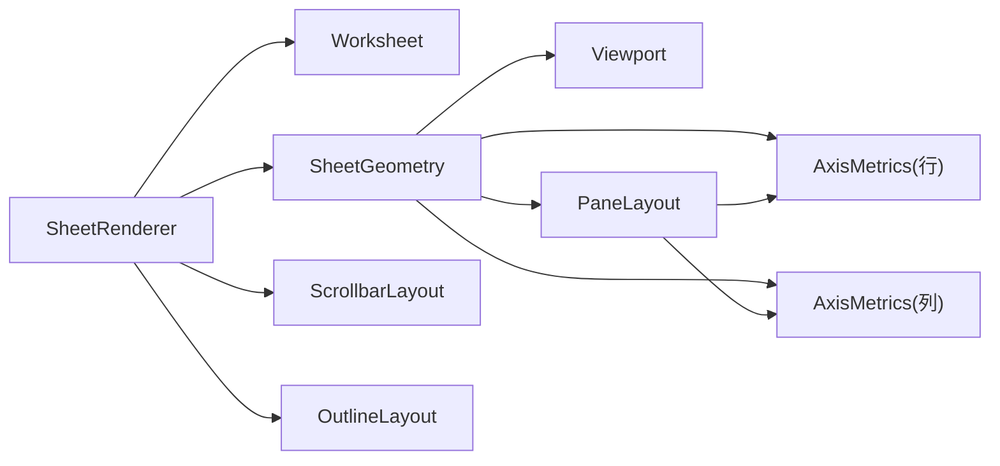

# 渲染系统

<cite>
**本文引用的文件**
- [SheetRenderer.ts](file://cmx-mega-sheet/src/render/SheetRenderer.ts)
- [Viewport.ts](file://cmx-mega-sheet/src/render/Viewport.ts)
- [PaneLayout.ts](file://cmx-mega-sheet/src/render/PaneLayout.ts)
- [SheetGeometry.ts](file://cmx-mega-sheet/src/render/SheetGeometry.ts)
- [AxisMetrics.ts](file://cmx-mega-sheet/src/render/AxisMetrics.ts)
- [ScrollbarLayout.ts](file://cmx-mega-sheet/src/render/ScrollbarLayout.ts)
- [OutlineLayout.ts](file://cmx-mega-sheet/src/render/OutlineLayout.ts)
- [formatValue.ts](file://cmx-mega-sheet/src/render/formatValue.ts)
- [condFormat.ts](file://cmx-mega-sheet/src/render/condFormat.ts)
- [Worksheet.ts](file://cmx-mega-sheet/src/core/Worksheet.ts)
</cite>

## 目录
1. [简介](#简介)
2. [项目结构](#项目结构)
3. [核心组件](#核心组件)
4. [架构总览](#架构总览)
5. [详细组件分析](#详细组件分析)
6. [依赖关系分析](#依赖关系分析)
7. [性能考量与优化](#性能考量与优化)
8. [故障排查指南](#故障排查指南)
9. [结论](#结论)
10. [附录：自定义渲染器开发方案](#附录自定义渲染器开发方案)

## 简介
本技术文档面向工作表渲染子系统，聚焦以下目标：
- 深入说明 SheetRenderer 的绘制流程与优化策略（可见区域裁剪、冻结/尾冻结九宫格象限绘制、条件格式叠加、浮动对象与批注标记）。
- 解释 Viewport 视口管理与滚动性能优化（缩放、滚动条占位、签名机制）。
- 阐述 PaneLayout 分带算法与 SheetGeometry 几何模型（内容坐标与屏幕坐标互逆、命中测试一致性）。
- 详述 AxisMetrics 度量计算与自适应布局（惰性前缀和、二分映射、窗口可见范围）。
- 覆盖虚拟滚动、增量渲染与硬件加速实践建议。
- 提供渲染性能调优指南与自定义渲染器扩展方案。

## 项目结构
渲染子系统位于 cmx-mega-sheet/src/render，围绕“数据模型 → 几何 → 布局 → 渲染”分层组织：
- 数据层：Worksheet（单元格值、样式、合并区、条件格式、图表/迷你图、大纲等）
- 几何层：SheetGeometry（行列到屏幕像素的双向映射、可视范围、滚动条解析、命中测试）
- 布局层：PaneLayout（头冻结/滚动/尾冻结三带坐标变换）、AxisMetrics（单轴度量与二分查找）、Viewport（视口状态与签名）、ScrollbarLayout（滚动条轨道/滑块矩形）
- 渲染层：SheetRenderer（Canvas 绘制网格、单元格文本/背景/边框、条件格式叠加、浮动对象、选区、大纲按钮、冻结线、滚动条）

**图示来源**
- [SheetGeometry.ts:80-120](file://cmx-mega-sheet/src/render/SheetGeometry.ts#L80-L120)
- [PaneLayout.ts:22-42](file://cmx-mega-sheet/src/render/PaneLayout.ts#L22-L42)
- [AxisMetrics.ts:12-29](file://cmx-mega-sheet/src/render/AxisMetrics.ts#L12-L29)
- [Viewport.ts:47-76](file://cmx-mega-sheet/src/render/Viewport.ts#L47-L76)
- [ScrollbarLayout.ts:19-36](file://cmx-mega-sheet/src/render/ScrollbarLayout.ts#L19-L36)
- [OutlineLayout.ts:16-22](file://cmx-mega-sheet/src/render/OutlineLayout.ts#L16-L22)
- [SheetRenderer.ts:143-163](file://cmx-mega-sheet/src/render/SheetRenderer.ts#L143-L163)

**章节来源**
- [SheetGeometry.ts:1-16](file://cmx-mega-sheet/src/render/SheetGeometry.ts#L1-L16)
- [SheetRenderer.ts:1-34](file://cmx-mega-sheet/src/render/SheetRenderer.ts#L1-L34)

## 核心组件
- SheetRenderer：负责将可见区域绘制到 Canvas，包含网格线、单元格文本/背景/边框、合并跨格、选区、条件格式叠加、浮动对象（图片/图表/形状）、批注三角标记、冻结线、滚动条。
- Viewport：记录滚动位置、缩放、行列头/大纲带宽、冻结/尾冻结行数/列数、拆分模式、滚动条占位；提供签名用于避免不必要的重定位。
- PaneLayout：纯函数实现头冻结/滚动/尾冻结三带的坐标变换与可见范围计算，保证 indexStartToScreen 与 screenToIndex 严格互逆。
- SheetGeometry：组合 AxisMetrics 与 Viewport，提供 getCellRect/hitTest/可视范围/滚动条解析/滚动对齐等能力。
- AxisMetrics：维护单轴元素尺寸与前缀和，支持 O(log n) 的 indexAt/rangeInWindow。
- ScrollbarLayout：两趟求解滚动条显示与轨道/滑块矩形，供渲染与交互共用。
- OutlineLayout：大纲区按钮与层级开关的布局计算，渲染与命中一致。
- formatValue/condFormat：格式化显示值与条件格式叠加结果，供渲染时按需应用。

**章节来源**
- [SheetRenderer.ts:143-229](file://cmx-mega-sheet/src/render/SheetRenderer.ts#L143-L229)
- [Viewport.ts:47-178](file://cmx-mega-sheet/src/render/Viewport.ts#L47-L178)
- [PaneLayout.ts:22-201](file://cmx-mega-sheet/src/render/PaneLayout.ts#L22-L201)
- [SheetGeometry.ts:80-648](file://cmx-mega-sheet/src/render/SheetGeometry.ts#L80-L648)
- [AxisMetrics.ts:12-144](file://cmx-mega-sheet/src/render/AxisMetrics.ts#L12-L144)
- [ScrollbarLayout.ts:19-168](file://cmx-mega-sheet/src/render/ScrollbarLayout.ts#L19-L168)
- [OutlineLayout.ts:16-212](file://cmx-mega-sheet/src/render/OutlineLayout.ts#L16-L212)
- [formatValue.ts:1-24](file://cmx-mega-sheet/src/render/formatValue.ts#L1-L24)
- [condFormat.ts:1-200](file://cmx-mega-sheet/src/render/condFormat.ts#L1-L200)

## 架构总览
渲染管线遵循“几何先行、布局驱动、增量绘制”的原则：
- 几何层根据 Viewport 与 AxisMetrics 计算可见范围与单元格屏幕矩形。
- 布局层通过 PaneLayout 将行列划分为头冻结/滚动/尾冻结三带，分别处理坐标变换与可见区间。
- 渲染层仅绘制可见区域，按图层顺序绘制：网格线 → 单元格 → 合并区 → 条件格式叠加 → 浮动对象 → 批注标记 → 表头 → 大纲按钮 → 冻结线 → 滚动条。

**图示来源**
- [SheetGeometry.ts:555-572](file://cmx-mega-sheet/src/render/SheetGeometry.ts#L555-L572)
- [SheetRenderer.ts:169-229](file://cmx-mega-sheet/src/render/SheetRenderer.ts#L169-L229)
- [PaneLayout.ts:166-201](file://cmx-mega-sheet/src/render/PaneLayout.ts#L166-L201)
- [AxisMetrics.ts:118-144](file://cmx-mega-sheet/src/render/AxisMetrics.ts#L118-L144)

## 详细组件分析

### SheetRenderer 绘制流程与优化
- 可见区域裁剪：使用 clip 限制每个象限绘制范围，避免越界绘制到相邻带。
- 冻结/尾冻结九宫格：按行带/列带组合为最多 3×3=9 个象限，先画滚动带再画冻结带，层序对齐 Excel。
- 条件格式叠加：渲染前一次性 evaluateRules，生成 Map<"r,c", overlay>，drawCell 时按优先级叠加 fill/style/bar/icon。
- 溢出裁剪：非折行文本可溢入相邻空格，遇到有内容的格即止，避免覆盖邻格文字。
- 文本排版：支持 hAlign/vAlign、wordWrap、shrinkToFit、fill 对齐、下划线/删除线、旋转（M18）。
- 浮动对象：图片/图表/形状按锚点矩形绘制，支持选中框与调整手柄。
- 批注标记：在可见区域内绘制右上角红三角。
- 冻结线与拆分条：冻结线细线或粗拆分条（M19-step2），尾冻结线钉在内容区末端。
- 滚动条：调用 ScrollbarLayout 解析轨道/滑块并绘制。

**图示来源**
- [SheetRenderer.ts:169-229](file://cmx-mega-sheet/src/render/SheetRenderer.ts#L169-L229)
- [SheetRenderer.ts:231-317](file://cmx-mega-sheet/src/render/SheetRenderer.ts#L231-L317)
- [SheetRenderer.ts:319-431](file://cmx-mega-sheet/src/render/SheetRenderer.ts#L319-L431)
- [SheetRenderer.ts:433-533](file://cmx-mega-sheet/src/render/SheetRenderer.ts#L433-L533)

**章节来源**
- [SheetRenderer.ts:169-229](file://cmx-mega-sheet/src/render/SheetRenderer.ts#L169-L229)
- [SheetRenderer.ts:231-317](file://cmx-mega-sheet/src/render/SheetRenderer.ts#L231-L317)
- [SheetRenderer.ts:319-431](file://cmx-mega-sheet/src/render/SheetRenderer.ts#L319-L431)
- [SheetRenderer.ts:433-533](file://cmx-mega-sheet/src/render/SheetRenderer.ts#L433-L533)
- [condFormat.ts:33-45](file://cmx-mega-sheet/src/render/condFormat.ts#L33-L45)

### Viewport 视口管理与滚动优化
- 状态字段：scrollLeft/scrollTop、width/height、zoom、rowHeaderWidth/colHeaderHeight、rowOutlineWidth/colOutlineHeight、frozenRowCount/frozenColCount、trailingRowCount/trailingColCount、splitRow/splitCol、scrollbarGutterRight/scrollbarBottom。
- 内容区尺寸：contentWidth/contentHeight 扣除头偏移与滚动条占位。
- 签名机制：signature() 聚合所有影响屏幕位置的量，变化才触发叠层重定位，减少重绘开销。
- 缩放安全：zoom setter 钳制到 [0.1, 4]，避免极端缩放导致布局异常。

**章节来源**
- [Viewport.ts:16-42](file://cmx-mega-sheet/src/render/Viewport.ts#L16-L42)
- [Viewport.ts:47-178](file://cmx-mega-sheet/src/render/Viewport.ts#L47-L178)

### PaneLayout 分带算法与几何模型
- 三带划分：头冻结（lead）、滚动（scroll）、尾冻结（trail）。冻结带不随滚动移动，尾冻结带钉在视口末端。
- 关键不变式：indexStartToScreen 与 screenToIndex 严格互逆，确保“画的=点的”。
- 可见范围：scrollBandVisibleRange 计算滚动带可见区间，frozenBandRange/trailingBandRange 返回恒可见区间。
- 边界保护：screenToIndex 对滚动带命中进行钳制，防止落回头带或漫进尾带。

**图示来源**
- [PaneLayout.ts:22-42](file://cmx-mega-sheet/src/render/PaneLayout.ts#L22-L42)
- [PaneLayout.ts:44-201](file://cmx-mega-sheet/src/render/PaneLayout.ts#L44-L201)

**章节来源**
- [PaneLayout.ts:22-201](file://cmx-mega-sheet/src/render/PaneLayout.ts#L22-L201)

### SheetGeometry 几何映射与命中测试
- 坐标转换：contentXToScreen/contentYToScreen 与 screenXToContent/screenYToContent 考虑冻结/尾冻结带。
- 单元格矩形：getCellRect 基于 PaneLayout 的 indexStartToScreen 计算起点与跨度宽高。
- 命中测试：hitTest 区分 viewport/colHeader/rowHeader/corner/rowOutline/colOutline/outlineCorner。
- 滚动条：resolveScrollbars 解析轨道/滑块并回写 gutter；hitScrollbar 与拖拽方法统一使用 ScrollbarLayout。
- 可视范围：visibleRowRange/visibleColRange 结合 PaneLayout 与 AxisMetrics.rangeInWindow。

**章节来源**
- [SheetGeometry.ts:80-143](file://cmx-mega-sheet/src/render/SheetGeometry.ts#L80-L143)
- [SheetGeometry.ts:182-254](file://cmx-mega-sheet/src/render/SheetGeometry.ts#L182-L254)
- [SheetGeometry.ts:260-332](file://cmx-mega-sheet/src/render/SheetGeometry.ts#L260-L332)
- [SheetGeometry.ts:555-648](file://cmx-mega-sheet/src/render/SheetGeometry.ts#L555-L648)

### AxisMetrics 度量计算与自适应布局
- 惰性前缀和：offsets 数组首次访问时构建，后续复用，避免重复计算。
- 隐藏元素：sizeAt 对隐藏元素返回 0，二分时天然跳过。
- 双向映射：indexAt 二分查找像素→索引；rangeInWindow 计算窗口覆盖的首末索引。
- 失效策略：setCount/invalidate 使前缀和下次重建，适应行列增删与尺寸变化。

**章节来源**
- [AxisMetrics.ts:12-144](file://cmx-mega-sheet/src/render/AxisMetrics.ts#L12-L144)

### 滚动条布局与交互
- 两趟求解：先判断是否需要竖/横滚动条，若一条出现缩小了对向可视区，则复判对向需求。
- 轨道/滑块：buildThumb 按比例计算滑块长度与位置，thumbPosToScroll 将滑块位移换算为滚动位置。
- 命中与拖拽：hitScrollbar 区分轨道空白与滑块；dragVerticalThumb/dragHorizontalThumb 更新视口滚动。

**章节来源**
- [ScrollbarLayout.ts:19-168](file://cmx-mega-sheet/src/render/ScrollbarLayout.ts#L19-L168)
- [SheetGeometry.ts:605-648](file://cmx-mega-sheet/src/render/SheetGeometry.ts#L605-L648)

### 条件格式与格式化
- 条件格式：evaluateRules 遍历规则集，生成每格叠加结果（style/fill/bar/icon），渲染时按优先级应用。
- 格式化：formatCell 委托 numFmt 引擎，支持多区段、颜色段、日期掩码、科学计数等，返回 text/color 供渲染使用。

**章节来源**
- [condFormat.ts:1-200](file://cmx-mega-sheet/src/render/condFormat.ts#L1-L200)
- [formatValue.ts:1-24](file://cmx-mega-sheet/src/render/formatValue.ts#L1-L24)

## 依赖关系分析
- SheetRenderer 依赖 Worksheet 获取值/样式/富文本/验证/迷你图/浮动对象，依赖 SheetGeometry 获取几何与可视范围，依赖 ScrollbarLayout/OutlineLayout 辅助绘制。
- SheetGeometry 依赖 AxisMetrics（行/列）与 Viewport，组合 PaneLayout 完成坐标变换与可见范围计算。
- PaneLayout 依赖 AxisMetrics 提供的 startOf/sizeAt/indexAt/rangeInWindow。
- Viewport 独立管理视口状态，提供 signature 用于外部缓存/重定位优化。
- ScrollbarLayout 与 OutlineLayout 为纯函数模块，被几何与渲染层共享，保证“画的=点的”。

**图示来源**
- [SheetRenderer.ts:12-33](file://cmx-mega-sheet/src/render/SheetRenderer.ts#L12-L33)
- [SheetGeometry.ts:18-46](file://cmx-mega-sheet/src/render/SheetGeometry.ts#L18-L46)
- [PaneLayout.ts:22-42](file://cmx-mega-sheet/src/render/PaneLayout.ts#L22-L42)

**章节来源**
- [SheetRenderer.ts:12-33](file://cmx-mega-sheet/src/render/SheetRenderer.ts#L12-L33)
- [SheetGeometry.ts:18-46](file://cmx-mega-sheet/src/render/SheetGeometry.ts#L18-L46)
- [PaneLayout.ts:22-42](file://cmx-mega-sheet/src/render/PaneLayout.ts#L22-L42)

## 性能考量与优化
- 虚拟滚动：仅绘制可见区域（scrollBandVisibleRange 与 rangeInWindow），冻结/尾冻结带单独处理，避免全量渲染。
- 增量渲染：Viewport.signature() 变化才触发重定位；条件格式在渲染前一次性计算，drawCell 直接查表叠加。
- 几何复用：AxisMetrics 惰性构建前缀和，尺寸/隐藏变化后 invalidate，避免重复计算。
- 裁剪优化：drawQuadrant 使用 clip 限制象限绘制范围，减少多余绘制。
- 文本优化：shrinkToFit 与 wordWrap 控制换行与缩放；溢出裁剪避免覆盖邻格。
- 硬件加速建议：
  - 使用离屏 Canvas 缓存复杂背景或条件格式色阶结果（需权衡内存与刷新频率）。
  - 批量绘制：合并相同样式的 fill/stroke 操作，减少状态切换。
  - 避免频繁创建路径：复用 beginPath/closePath，减少 GC 压力。
  - 利用 CSS transform 替代 JS 重排：对于浮动对象，优先使用 DOM 层 transform 配合 Canvas 合成。
- 滚动条优化：两趟求解避免闪烁；滑块最小长度保障可操作性。

[本节为通用性能指导，不直接分析具体文件]

## 故障排查指南
- 滚动条错位：检查 resolveScrollbars 是否被调用，确认 gutterRight/gutterBottom 已回写至 Viewport；核对 contentWidth/contentHeight 是否正确传入。
- 命中不一致：确保 hitTest 与 getCellRect 使用相同的 PaneLayout 变换；检查 frozen/trailing 配置是否匹配。
- 条件格式未生效：确认 evaluateRules 已执行且 condOverlays 非空；检查规则范围与数值类型。
- 文本溢出异常：确认 overflowClipRect 逻辑与 wordWrap/shrinkToFit 设置；检查邻格是否为空白。
- 冻结/尾冻结线位置错误：核对 freezeLineX/Y 与 trailingLineX/Y 的计算；确认 splitRow/splitCol 模式正确。

**章节来源**
- [SheetGeometry.ts:555-648](file://cmx-mega-sheet/src/render/SheetGeometry.ts#L555-L648)
- [SheetRenderer.ts:169-229](file://cmx-mega-sheet/src/render/SheetRenderer.ts#L169-L229)
- [condFormat.ts:33-45](file://cmx-mega-sheet/src/render/condFormat.ts#L33-L45)

## 结论
该渲染系统以几何层为核心，通过 PaneLayout 的分带算法与 AxisMetrics 的高效度量，实现了高性能的虚拟滚动与精确的命中测试。SheetRenderer 采用可见区域裁剪与条件格式预计算，结合 Viewport 签名机制，有效降低重绘成本。滚动条与大纲区的纯函数布局确保了“画的=点的”，提升交互可靠性。整体架构清晰、可扩展性强，适合大规模数据表格场景。

[本节为总结性内容，不直接分析具体文件]

## 附录：自定义渲染器开发方案
- 扩展点：
  - RenderContext2D 接口：定义最小绘制能力，便于替换为 mock 或 WebGL 后端。
  - RenderTheme：主题色配置，支持 light/dark 切换。
  - 条件格式叠加：可在 condFormat.ts 中新增规则类型，并在 SheetRenderer.drawCell 中应用。
  - 浮动对象：在 Worksheet.FloatingObject 中扩展新类型，并在 SheetRenderer.drawFloatingObjects 中处理。
- 开发步骤：
  1. 定义新的 RenderContext2D 方法（如 drawImage、rotate）。
  2. 在 SheetRenderer 中添加对应绘制分支，保持与现有图层顺序一致。
  3. 更新 PaneLayout/SheetGeometry 以支持新元素的几何计算（如需）。
  4. 编写单元测试，验证“画的=点的”不变式。
- 性能建议：
  - 批量绘制相似元素，减少状态切换。
  - 使用离屏缓冲缓存复杂图形。
  - 避免在高频回调中进行昂贵计算，改用增量更新。

**章节来源**
- [SheetRenderer.ts:35-68](file://cmx-mega-sheet/src/render/SheetRenderer.ts#L35-L68)
- [SheetRenderer.ts:70-138](file://cmx-mega-sheet/src/render/SheetRenderer.ts#L70-L138)
- [condFormat.ts:17-27](file://cmx-mega-sheet/src/render/condFormat.ts#L17-L27)
- [Worksheet.ts:167-186](file://cmx-mega-sheet/src/core/Worksheet.ts#L167-L186)