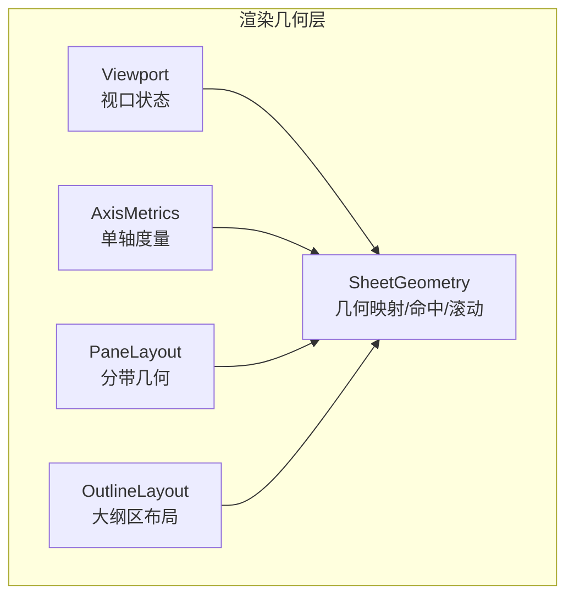
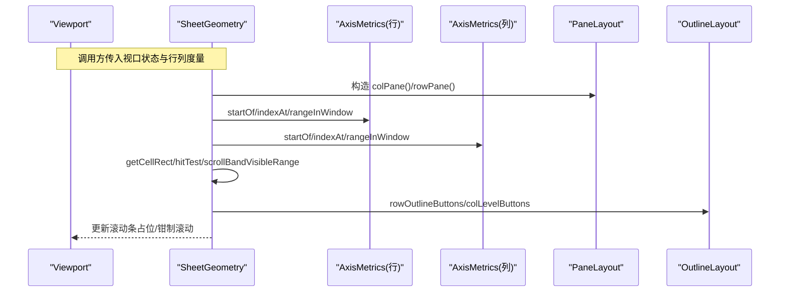
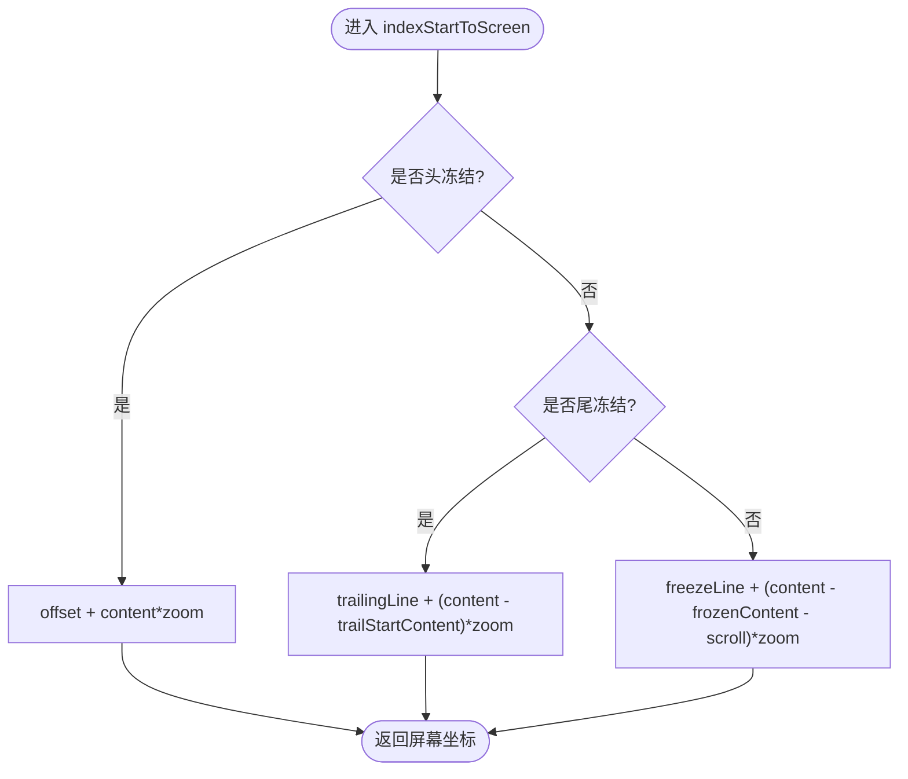
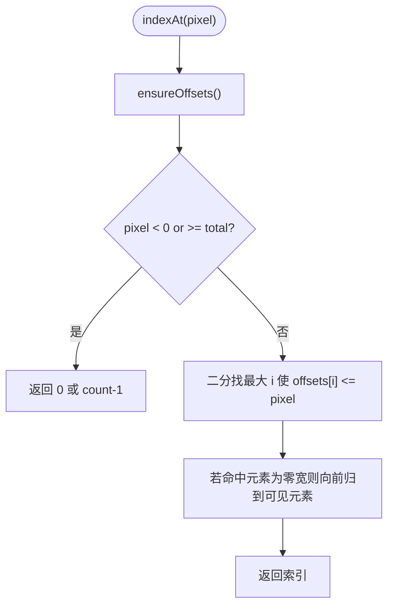
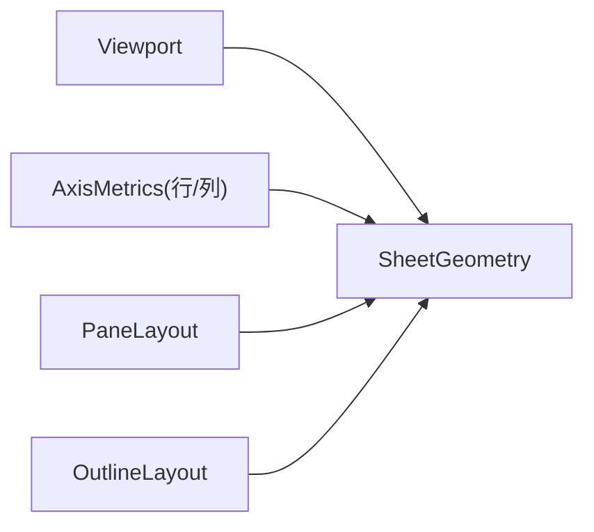

# 窗格布局（PaneLayout）

<cite>
**本文引用的文件**
- [PaneLayout.ts](file://cmx-mega-sheet/src/render/PaneLayout.ts)
- [SheetGeometry.ts](file://cmx-mega-sheet/src/render/SheetGeometry.ts)
- [AxisMetrics.ts](file://cmx-mega-sheet/src/render/AxisMetrics.ts)
- [Viewport.ts](file://cmx-mega-sheet/src/render/Viewport.ts)
- [OutlineLayout.ts](file://cmx-mega-sheet/src/render/OutlineLayout.ts)
- [PaneLayout.test.ts](file://cmx-mega-sheet/test/PaneLayout.test.ts)
- [PaneLayoutTrailing.test.ts](file://cmx-mega-sheet/test/PaneLayoutTrailing.test.ts)
</cite>

## 目录
1. [简介](#简介)
2. [项目结构](#项目结构)
3. [核心组件](#核心组件)
4. [架构总览](#架构总览)
5. [详细组件分析](#详细组件分析)
6. [依赖关系分析](#依赖关系分析)
7. [性能与内存优化](#性能与内存优化)
8. [故障排查指南](#故障排查指南)
9. [结论](#结论)
10. [附录](#附录)

## 简介
本技术文档聚焦于电子表格渲染层的“窗格布局系统”，围绕 PaneLayout 类及其在 SheetGeometry、AxisMetrics、Viewport、OutlineLayout 中的协作，系统化说明以下能力：
- 冻结/拆分/尾冻结的行列分带几何与坐标变换
- 行列头尺寸计算、大纲区域布局与分组按钮定位
- 多窗格架构下的布局协调机制、数据同步与事件传递路径
- 自适应布局调整策略（滚动、缩放、结构变化）
- 性能优化、内存管理与调试工具使用建议

## 项目结构
该布局系统位于 cmx-mega-sheet 的渲染层，核心文件组织如下：
- PaneLayout.ts：单轴（行或列）的分带几何与坐标变换（M9/M19），纯函数式实现，零 DOM。
- SheetGeometry.ts：单元格↔屏幕像素映射、命中测试、视口可见范围、滚动条解析等，组合 AxisMetrics + Viewport + PaneLayout。
- AxisMetrics.ts：单轴索引↔像素的双向映射与前缀和缓存，支持隐藏元素与二分查找。
- Viewport.ts：视口状态（滚动、缩放、头部/大纲带宽、冻结/尾冻结数、拆分模式、滚动条占位）。
- OutlineLayout.ts：大纲区布局与按钮矩形计算（纯函数），供渲染与命中共用。



**图表来源**
- [Viewport.ts:16-42](file://cmx-mega-sheet/src/render/Viewport.ts#L16-L42)
- [AxisMetrics.ts:12-144](file://cmx-mega-sheet/src/render/AxisMetrics.ts#L12-L144)
- [PaneLayout.ts:22-201](file://cmx-mega-sheet/src/render/PaneLayout.ts#L22-L201)
- [SheetGeometry.ts:80-648](file://cmx-mega-sheet/src/render/SheetGeometry.ts#L80-L648)
- [OutlineLayout.ts:16-212](file://cmx-mega-sheet/src/render/OutlineLayout.ts#L16-L212)

**章节来源**
- [Viewport.ts:16-42](file://cmx-mega-sheet/src/render/Viewport.ts#L16-L42)
- [AxisMetrics.ts:12-144](file://cmx-mega-sheet/src/render/AxisMetrics.ts#L12-L144)
- [PaneLayout.ts:22-201](file://cmx-mega-sheet/src/render/PaneLayout.ts#L22-L201)
- [SheetGeometry.ts:80-648](file://cmx-mega-sheet/src/render/SheetGeometry.ts#L80-L648)
- [OutlineLayout.ts:16-212](file://cmx-mega-sheet/src/render/OutlineLayout.ts#L16-L212)

## 核心组件
- PaneLayout：提供单轴分带的纯几何计算，包括冻结带、滚动带、尾冻结带的尺寸与屏幕坐标转换，保证 indexStartToScreen 与 screenToIndex 严格互逆。
- SheetGeometry：组合两轴（行/列）的 AxisMetrics 与 Viewport，提供 getCellRect、hitTest、滚动条解析、可视范围、滚动对齐等能力。
- AxisMetrics：维护单轴的起始坐标前缀和与二分命中，支持隐藏元素、惰性构建、范围查询。
- Viewport：集中管理视口状态（滚动、缩放、头部/大纲带宽、冻结/尾冻结、拆分模式、滚动条占位），并提供签名用于重定位叠层。
- OutlineLayout：计算大纲区厚度、分组按钮与层级开关按钮的矩形，供渲染与命中共用。

**章节来源**
- [PaneLayout.ts:22-201](file://cmx-mega-sheet/src/render/PaneLayout.ts#L22-L201)
- [SheetGeometry.ts:80-648](file://cmx-mega-sheet/src/render/SheetGeometry.ts#L80-L648)
- [AxisMetrics.ts:12-144](file://cmx-mega-sheet/src/render/AxisMetrics.ts#L12-L144)
- [Viewport.ts:16-178](file://cmx-mega-sheet/src/render/Viewport.ts#L16-L178)
- [OutlineLayout.ts:16-212](file://cmx-mega-sheet/src/render/OutlineLayout.ts#L16-L212)

## 架构总览
下图展示从输入到输出的关键流程：Viewport 提供视口状态，SheetGeometry 组合 AxisMetrics 与 PaneLayout 完成坐标变换与命中，OutlineLayout 提供大纲区布局。



**图表来源**
- [SheetGeometry.ts:87-143](file://cmx-mega-sheet/src/render/SheetGeometry.ts#L87-L143)
- [SheetGeometry.ts:260-297](file://cmx-mega-sheet/src/render/SheetGeometry.ts#L260-L297)
- [SheetGeometry.ts:451-500](file://cmx-mega-sheet/src/render/SheetGeometry.ts#L451-L500)
- [PaneLayout.ts:84-153](file://cmx-mega-sheet/src/render/PaneLayout.ts#L84-L153)
- [OutlineLayout.ts:79-176](file://cmx-mega-sheet/src/render/OutlineLayout.ts#L79-L176)

## 详细组件分析

### PaneLayout：分带算法与坐标变换
- 分带模型
  - M9：两带（冻结带 + 滚动带）
  - M19：三带（头冻结 + 滚动 + 尾冻结），尾冻结钉在视口末端不随滚动移动
- 关键不变式
  - indexStartToScreen 与 screenToIndex 严格互逆，跨冻结边界、滚动、缩放均成立
  - frozenCount=0 且 trailingCount=0 时退化为单段，与旧逻辑等价
- 主要函数职责
  - frozenBandSize / freezeLineScreen：冻结带宽度与冻结线位置
  - trailingBandSize / trailingLineScreen：尾冻结带宽度与尾线位置
  - bandOf / isFrozen：元素归属判断
  - indexStartToScreen / screenToIndex：内容坐标↔屏幕坐标双向转换
  - scrollBandVisibleRange / frozenBandRange / trailingBandRange：可见范围计算



**图表来源**
- [PaneLayout.ts:96-114](file://cmx-mega-sheet/src/render/PaneLayout.ts#L96-L114)

**章节来源**
- [PaneLayout.ts:22-201](file://cmx-mega-sheet/src/render/PaneLayout.ts#L22-L201)
- [PaneLayout.test.ts:29-124](file://cmx-mega-sheet/test/PaneLayout.test.ts#L29-L124)
- [PaneLayoutTrailing.test.ts:21-132](file://cmx-mega-sheet/test/PaneLayoutTrailing.test.ts#L21-L132)

### SheetGeometry：几何映射、命中与滚动控制
- 分带参数构造：将 Viewport 的状态映射为 PaneLayout 所需的 AxisPaneParams（含 offset、zoom、scroll、frozenCount、count、startOf、sizeAt、trailingCount、viewSize）
- 坐标变换：contentXToScreen/contentYToScreen 与 screenXToContent/screenYToContent 处理头/尾冻结与滚动带
- 单元格矩形：getCellRect 基于 PaneLayout 的 indexStartToScreen 计算起点，再按 startOf 差值计算宽高
- 命中测试：hitTest 区分 viewport/行列头/角/大纲区；hitColumnBorder/hitRowBorder 用于拖拽调尺寸；hitFilterArrow/hitCheckbox/hitCellDropdown 提供交互命中
- 可见范围：visibleRowRange/visibleColRange 结合 scrollBandVisibleRange 与 AxisMetrics.rangeInWindow
- 滚动控制：computeScrollToShow/showCell/clampScroll/maxScroll 确保滚动合法与最小移动
- 滚动条：resolveScrollbars/dragVerticalThumb/dragHorizontalThumb/hitScrollbar 解析并应用滚动条布局

```mermaid
classDiagram
class SheetGeometry {
+rows : AxisMetrics
+cols : AxisMetrics
+viewport : Viewport
+freezeLineX() : number
+freezeLineY() : number
+trailingLineX() : number
+trailingLineY() : number
+getCellRect(row,col,rowCount,colCount) : CellRect
+hitTest(screenX,screenY) : HitInfo
+scrollRowRange() : {first,last}|null
+scrollColRange() : {first,last}|null
+computeScrollToShow(row,col,align) : {scrollLeft,scrollTop}
+showCell(row,col,align) : void
+resolveScrollbars() : ScrollbarLayout
+maxScroll() : {left,top}
+clampScroll() : void
}
class AxisMetrics
class Viewport
SheetGeometry --> AxisMetrics : "使用"
SheetGeometry --> Viewport : "读取/写入"
```

**图表来源**
- [SheetGeometry.ts:80-143](file://cmx-mega-sheet/src/render/SheetGeometry.ts#L80-L143)
- [SheetGeometry.ts:260-346](file://cmx-mega-sheet/src/render/SheetGeometry.ts#L260-L346)
- [SheetGeometry.ts:451-546](file://cmx-mega-sheet/src/render/SheetGeometry.ts#L451-L546)
- [SheetGeometry.ts:555-646](file://cmx-mega-sheet/src/render/SheetGeometry.ts#L555-L646)

**章节来源**
- [SheetGeometry.ts:80-648](file://cmx-mega-sheet/src/render/SheetGeometry.ts#L80-L648)

### AxisMetrics：单轴度量与二分命中
- 前缀和缓存：offsets[i] = 0..i-1 的像素总和，惰性构建，避免重复计算
- 隐藏元素：sizeAt 对隐藏元素返回 0，indexAt 二分会跳过零宽元素并归到相邻可见元素
- 范围查询：rangeInWindow 返回窗口覆盖的索引区间，lastIndexStartingBefore 用于半开窗口右端



**图表来源**
- [AxisMetrics.ts:67-87](file://cmx-mega-sheet/src/render/AxisMetrics.ts#L67-L87)
- [AxisMetrics.ts:118-142](file://cmx-mega-sheet/src/render/AxisMetrics.ts#L118-L142)

**章节来源**
- [AxisMetrics.ts:12-144](file://cmx-mega-sheet/src/render/AxisMetrics.ts#L12-L144)

### Viewport：视口状态与签名
- 状态字段：滚动、缩放、尺寸、头部/大纲带宽、冻结/尾冻结、拆分模式、滚动条占位
- 内容区尺寸：contentWidth/contentHeight 扣除头部、大纲与滚动条占位
- 签名：signature 汇总所有影响屏幕位置的量，用于设计器徽标叠层重定位

**章节来源**
- [Viewport.ts:16-178](file://cmx-mega-sheet/src/render/Viewport.ts#L16-L178)

### OutlineLayout：大纲区布局与按钮定位
- 大纲带厚度：outlinePaneThickness 根据最深层级与是否双轴预留角空间计算
- 分组按钮：rowOutlineButtons/colOutlineButtons 计算 +/- 按钮矩形，基于汇总行/列所在处
- 层级开关：levelButtons/colLevelButtons 计算角上 1..N 层级按钮矩形，紧凑步距避免过宽
- 其他控件：filterArrowBox/checkboxBox/cellDropdownBox 提供渲染与命中共用的矩形计算

**章节来源**
- [OutlineLayout.ts:16-212](file://cmx-mega-sheet/src/render/OutlineLayout.ts#L16-L212)

## 依赖关系分析
- SheetGeometry 依赖 AxisMetrics（行/列）、Viewport、PaneLayout、OutlineLayout
- PaneLayout 通过回调访问 AxisMetrics 的 startOf/sizeAt，保持纯计算、零耦合
- Viewport 作为单一状态源，被 SheetGeometry 读写，并通过 signature 驱动外部刷新
- OutlineLayout 纯函数，无外部状态依赖，仅由 SheetGeometry 调用



**图表来源**
- [SheetGeometry.ts:18-46](file://cmx-mega-sheet/src/render/SheetGeometry.ts#L18-L46)
- [PaneLayout.ts:22-42](file://cmx-mega-sheet/src/render/PaneLayout.ts#L22-L42)
- [Viewport.ts:16-42](file://cmx-mega-sheet/src/render/Viewport.ts#L16-L42)
- [OutlineLayout.ts:16-212](file://cmx-mega-sheet/src/render/OutlineLayout.ts#L16-L212)

**章节来源**
- [SheetGeometry.ts:18-46](file://cmx-mega-sheet/src/render/SheetGeometry.ts#L18-L46)
- [PaneLayout.ts:22-42](file://cmx-mega-sheet/src/render/PaneLayout.ts#L22-L42)
- [Viewport.ts:16-42](file://cmx-mega-sheet/src/render/Viewport.ts#L16-L42)
- [OutlineLayout.ts:16-212](file://cmx-mega-sheet/src/render/OutlineLayout.ts#L16-L212)

## 性能与内存优化
- 惰性前缀和：AxisMetrics.offsets 仅在首次需要时构建，变更时 invalidate 重建，避免频繁全量计算
- 二分命中：indexAt 与 lastIndexStartingBefore 使用 O(log n) 二分，适合大规模行列
- 可见范围裁剪：scrollBandVisibleRange 精确计算滚动带可见索引，减少渲染开销
- 滚动条占位：resolveScrollbars 回写 gutter，避免后续计算重复考虑滚动条
- 缩放与冻结：PaneLayout 统一处理 zoom 与冻结/尾冻结，保证换算一致性与稳定性
- 签名化刷新：Viewport.signature 聚合所有影响屏幕位置的因素，外部可据此增量刷新

[本节为通用指导，无需具体文件引用]

## 故障排查指南
- 画点不一致
  - 检查 indexStartToScreen 与 screenToIndex 的互逆性，参考测试用例验证任意元素中点命中
  - 关注冻结线与尾线的边界判定，避免越界或漏判
- 滚动异常
  - 确认 maxScroll 与 clampScroll 是否正确限制滚动范围
  - 检查 resolveScrollbars 后 gutter 是否回写到 Viewport
- 大纲按钮命中失败
  - 核对 outlinePaneThickness 与 levelSlotCenter 的计算是否与渲染一致
  - 使用 hitOutlineButton 的分组与层级按钮顺序，确保角上层级按钮优先命中
- 可见范围错误
  - 验证 rangeInWindow 的半开窗口语义与 last 索引计算
  - 冻结/尾冻结场景下，scrollBandVisibleRange 需排除冻结带

**章节来源**
- [PaneLayout.test.ts:52-108](file://cmx-mega-sheet/test/PaneLayout.test.ts#L52-L108)
- [PaneLayoutTrailing.test.ts:57-107](file://cmx-mega-sheet/test/PaneLayoutTrailing.test.ts#L57-L107)
- [SheetGeometry.ts:555-646](file://cmx-mega-sheet/src/render/SheetGeometry.ts#L555-L646)
- [OutlineLayout.ts:39-176](file://cmx-mega-sheet/src/render/OutlineLayout.ts#L39-L176)

## 结论
PaneLayout 以纯函数形式实现了稳健的单轴分带几何，配合 SheetGeometry 的两轴组合，提供了完整的单元格↔屏幕映射、命中测试与滚动控制。AxisMetrics 的前缀和与二分命中保证了高效的数据访问，Viewport 的状态与签名机制支撑了外部组件的增量刷新。OutlineLayout 的大纲区布局与按钮定位确保了交互一致性。整体架构清晰、解耦良好，具备高可扩展性与可测试性。

[本节为总结，无需具体文件引用]

## 附录
- 关键 API 速查
  - PaneLayout：frozenBandSize、freezeLineScreen、trailingBandSize、trailingLineScreen、bandOf、isFrozen、indexStartToScreen、screenToIndex、scrollBandVisibleRange、frozenBandRange、trailingBandRange
  - SheetGeometry：getCellRect、hitTest、scrollRowRange、scrollColRange、computeScrollToShow、showCell、resolveScrollbars、maxScroll、clampScroll
  - AxisMetrics：startOf、endOf、totalSize、indexAt、rangeInWindow、invalidate、setCount
  - Viewport：leftOffset、topOffset、contentWidth、contentHeight、signature、toState
  - OutlineLayout：outlinePaneThickness、rowOutlineButtons、colOutlineButtons、levelButtons、colLevelButtons、filterArrowBox、checkboxBox、cellDropdownBox

[本节为补充信息，无需具体文件引用]