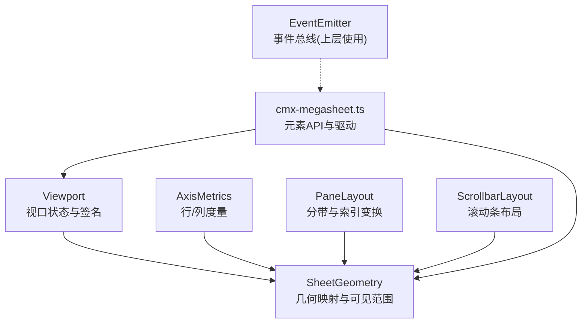
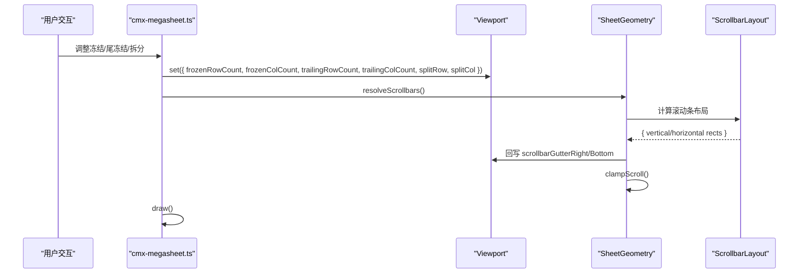
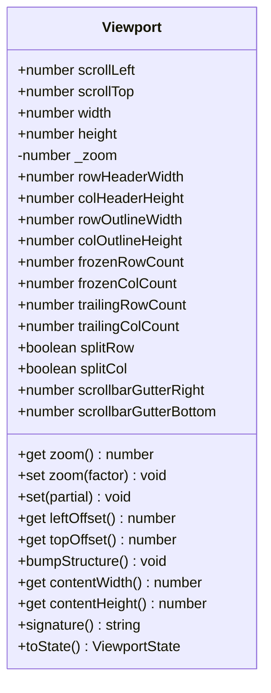
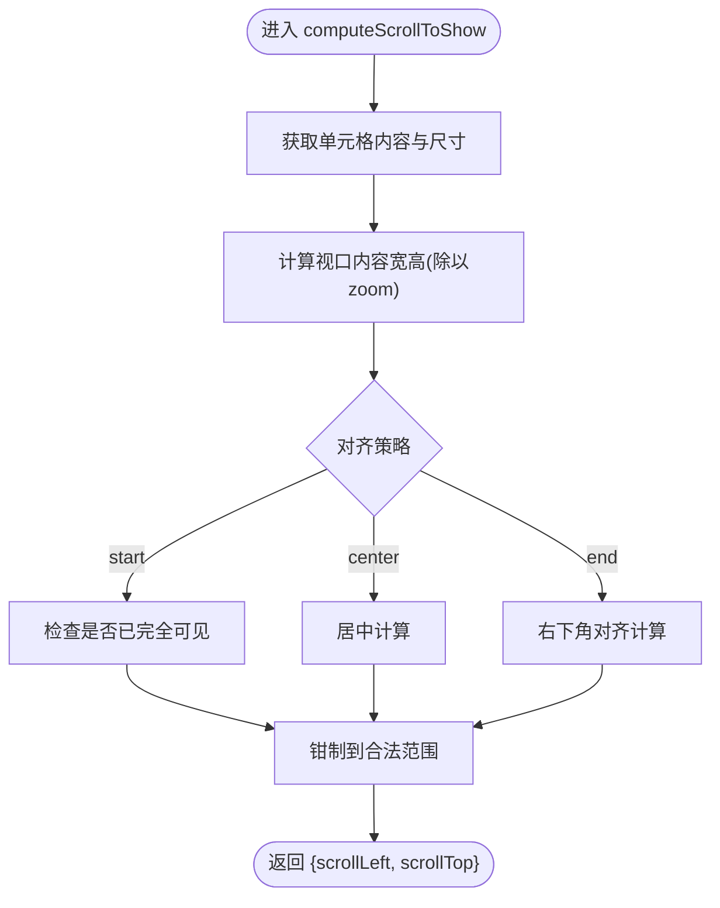
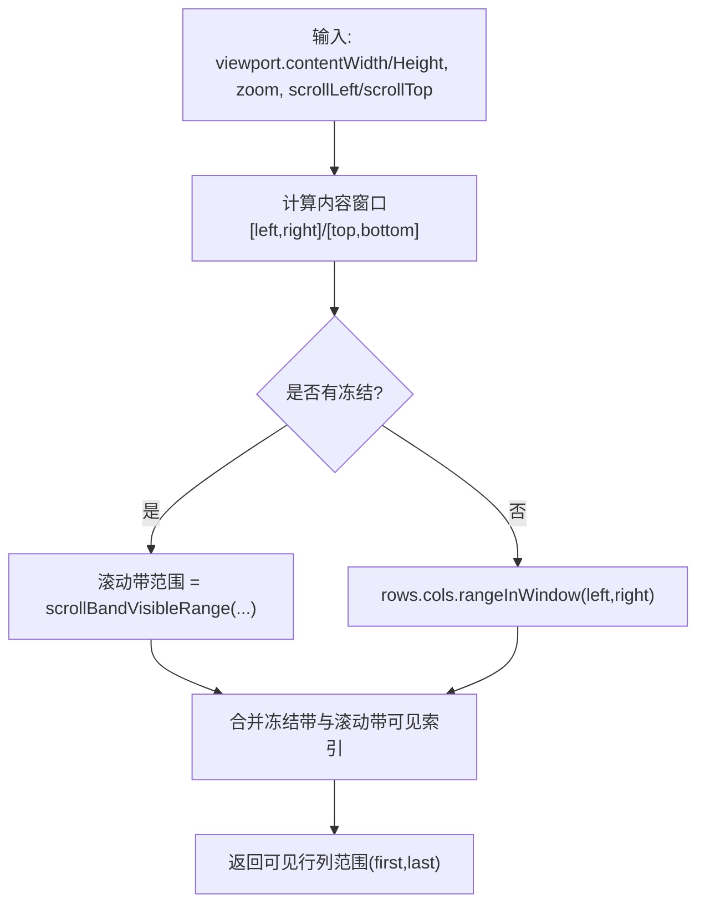
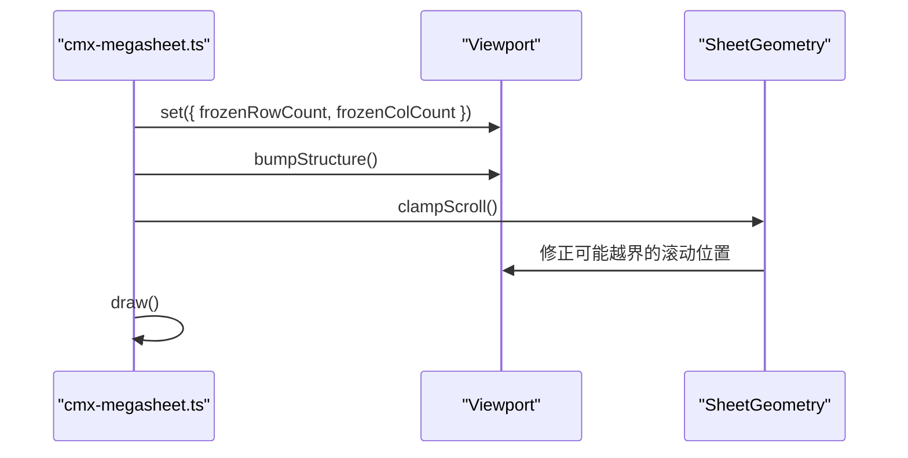
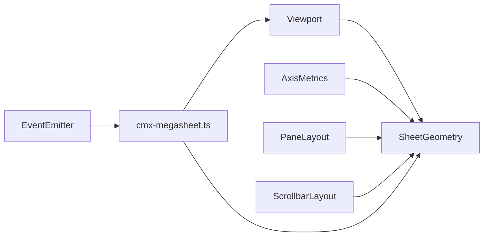

# 视口管理 (Viewport)

<cite>
**本文引用的文件**
- [Viewport.ts](file://cmx-mega-sheet/src/render/Viewport.ts)
- [SheetGeometry.ts](file://cmx-mega-sheet/src/render/SheetGeometry.ts)
- [AxisMetrics.ts](file://cmx-mega-sheet/src/render/AxisMetrics.ts)
- [PaneLayout.ts](file://cmx-mega-sheet/src/render/PaneLayout.ts)
- [ScrollbarLayout.ts](file://cmx-mega-sheet/src/render/ScrollbarLayout.ts)
- [EventEmitter.ts](file://cmx-mega-sheet/src/core/EventEmitter.ts)
- [cmx-megasheet.ts](file://cmx-mega-sheet/src/element/cmx-megasheet.ts)
- [Viewport.test.ts](file://cmx-mega-sheet/test/Viewport.test.ts)
- [SheetGeometry.test.ts](file://cmx-mega-sheet/test/SheetGeometry.test.ts)
- [SplitPane.test.ts](file://cmx-mega-sheet/test/SplitPane.test.ts)
</cite>

## 目录
1. [简介](#简介)
2. [项目结构](#项目结构)
3. [核心组件](#核心组件)
4. [架构总览](#架构总览)
5. [详细组件分析](#详细组件分析)
6. [依赖关系分析](#依赖关系分析)
7. [性能考量](#性能考量)
8. [故障排查指南](#故障排查指南)
9. [结论](#结论)
10. [附录](#附录)

## 简介
本技术文档聚焦于 cmx-mega-sheet 的视口管理系统，围绕 Viewport 类与 SheetGeometry 的交互，系统阐述可视区域计算、滚动位置管理、缩放比例控制、虚拟滚动算法、冻结行列与尾冻结（M19）、分屏拆分模式（M19-step2）、响应式布局适配、状态持久化接口、历史记录与调试方法。目标是帮助开发者理解并高效使用视口子系统，确保在大数据量场景下的渲染与交互性能。

## 项目结构
视口相关代码集中在 cmx-mega-sheet 模块的 render 层：
- Viewport：承载视口状态（滚动、尺寸、缩放、头/大纲带占位、冻结/尾冻结、拆分模式、滚动条占位）并提供签名与序列化能力。
- SheetGeometry：基于 AxisMetrics（行/列度量）和 Viewport，实现单元格到屏幕坐标的映射、可见范围计算、滚动条命中与拖拽、最大滚动限制等几何计算。
- PaneLayout：提供分带参数与索引变换工具，支撑冻结/尾冻结/滚动带的坐标转换。
- ScrollbarLayout：解析滚动条布局并回写 gutter，供渲染与交互使用。
- EventEmitter：通用事件总线，用于上层派发选择变更、单元格变更等业务事件（视口本身不直接派发业务事件）。
- cmx-megasheet.ts：元素入口，暴露冻结/尾冻结/拆分等 API，驱动视口状态变化并触发重绘。

图表来源
- [Viewport.ts:1-178](file://cmx-mega-sheet/src/render/Viewport.ts#L1-L178)
- [SheetGeometry.ts:1-648](file://cmx-mega-sheet/src/render/SheetGeometry.ts#L1-L648)
- [PaneLayout.ts](file://cmx-mega-sheet/src/render/PaneLayout.ts)
- [ScrollbarLayout.ts](file://cmx-mega-sheet/src/render/ScrollbarLayout.ts)
- [EventEmitter.ts:1-60](file://cmx-mega-sheet/src/core/EventEmitter.ts#L1-L60)
- [cmx-megasheet.ts:1174-1204](file://cmx-mega-sheet/src/element/cmx-megasheet.ts#L1174-L1204)

章节来源
- [Viewport.ts:1-178](file://cmx-mega-sheet/src/render/Viewport.ts#L1-L178)
- [SheetGeometry.ts:1-648](file://cmx-mega-sheet/src/render/SheetGeometry.ts#L1-L648)

## 核心组件
- Viewport：集中管理视口状态，提供 set、zoom 访问器、内容区尺寸计算、签名生成与 toState 序列化。支持冻结/尾冻结/拆分模式与滚动条占位。
- SheetGeometry：以纯计算方式将逻辑坐标（内容坐标）与屏幕坐标互转，处理冻结/尾冻结/滚动带，计算可见范围、滚动条命中与拖拽、最大滚动限制与钳制。
- AxisMetrics：维护行列数量与每行列的尺寸函数，支持隐藏行列、累计尺寸、窗口内范围查询，是虚拟滚动的基石。
- PaneLayout：封装分带参数（偏移、缩放、滚动、冻结数、尾部冻结数、视图大小），提供 indexStartToScreen/screenToIndex 等变换工具。
- ScrollbarLayout：根据视口与内容尺寸计算滚动条可见性、滑块位置与轨道矩形，并将 gutter 回写到 Viewport。
- EventEmitter：类型化事件总线，供上层派发业务事件（如选择变更、单元格变更），与视口解耦。

章节来源
- [Viewport.ts:16-177](file://cmx-mega-sheet/src/render/Viewport.ts#L16-L177)
- [SheetGeometry.ts:80-648](file://cmx-mega-sheet/src/render/SheetGeometry.ts#L80-L648)
- [AxisMetrics.ts](file://cmx-mega-sheet/src/render/AxisMetrics.ts)
- [PaneLayout.ts](file://cmx-mega-sheet/src/render/PaneLayout.ts)
- [ScrollbarLayout.ts](file://cmx-mega-sheet/src/render/ScrollbarLayout.ts)
- [EventEmitter.ts:1-60](file://cmx-mega-sheet/src/core/EventEmitter.ts#L1-L60)

## 架构总览
视口子系统采用“状态 + 几何”的分层设计：
- Viewport 仅持有状态，无绘制与 DOM 操作；通过 signature 提供稳定标识，避免不必要的重定位。
- SheetGeometry 依赖 AxisMetrics 与 PaneLayout，完成坐标变换、可见范围计算、滚动条交互与边界约束。
- 元素层 cmx-megasheet 暴露冻结/尾冻结/拆分等 API，修改 Viewport 状态后调用几何层 clampScroll 并触发 draw。

图表来源
- [cmx-megasheet.ts:1174-1204](file://cmx-mega-sheet/src/element/cmx-megasheet.ts#L1174-L1204)
- [SheetGeometry.ts:555-599](file://cmx-mega-sheet/src/render/SheetGeometry.ts#L555-L599)
- [Viewport.ts:88-104](file://cmx-mega-sheet/src/render/Viewport.ts#L88-L104)

## 详细组件分析

### Viewport 设计与实现
- 状态字段：scrollLeft/scrollTop、width/height、zoom、rowHeaderWidth/colHeaderHeight、rowOutlineWidth/colOutlineHeight、frozenRowCount/frozenColCount、trailingRowCount/trailingColCount、splitRow/splitCol、scrollbarGutterRight/scrollbarGutterBottom。
- 缩放控制：zoom 访问器限定在 [0.1, 4]，非有限值兜底为 1。
- 内容区尺寸：contentWidth/contentHeight 扣除行/列大纲带、行列头与滚动条占位。
- 签名机制：signature 包含所有影响单元格屏幕位置的量（滚动、缩放、头/大纲带、冻结/尾冻结、拆分模式、滚动条占位、结构版本），数值取整避免亚像素抖动。
- 状态序列化：toState 输出完整 ViewportState，便于持久化。

图表来源
- [Viewport.ts:16-177](file://cmx-mega-sheet/src/render/Viewport.ts#L16-L177)

章节来源
- [Viewport.ts:16-177](file://cmx-mega-sheet/src/render/Viewport.ts#L16-L177)
- [Viewport.test.ts:1-59](file://cmx-mega-sheet/test/Viewport.test.ts#L1-L59)

### SheetGeometry 与视口交互
- 分带参数：colPane/rowPane 封装 offset、zoom、scroll、frozenCount、count、sizeAt、startOf、trailingCount、viewSize，统一处理冻结与尾冻结。
- 坐标变换：contentXToScreen/contentYToScreen 与 screenXToContent/screenYToContent 严格互逆，考虑冻结带与尾冻结带。
- 可见范围：visibleRowRange/visibleColRange 在冻结时跳过冻结带，返回滚动带可见区间；对外暴露 getViewportTopRow/getViewportBottomRow/getViewportLeftColumn/getViewportRightColumn。
- 滚动对齐：computeScrollToShow 支持 start/center/end 三种对齐策略，并钳制到合法范围；showCell 直接应用到视口。
- 滚动条：resolveScrollbars 解析布局并回写 gutter；maxScroll 计算最大滚动位置；clampScroll 防止越界；hitScrollbar/dragVerticalThumb/dragHorizontalThumb 处理命中与拖拽。

图表来源
- [SheetGeometry.ts:502-546](file://cmx-mega-sheet/src/render/SheetGeometry.ts#L502-L546)

章节来源
- [SheetGeometry.ts:87-181](file://cmx-mega-sheet/src/render/SheetGeometry.ts#L87-L181)
- [SheetGeometry.ts:451-599](file://cmx-mega-sheet/src/render/SheetGeometry.ts#L451-L599)
- [SheetGeometry.test.ts:113-169](file://cmx-mega-sheet/test/SheetGeometry.test.ts#L113-L169)

### 虚拟滚动算法
- 基于 AxisMetrics.rangeInWindow 在内容坐标窗口内快速筛选可见行列索引，避免遍历全表。
- 冻结/尾冻结场景下，分别计算冻结带与滚动带的可见范围，主渲染区仅绘制滚动带，冻结/尾冻结带单独绘制，减少 DOM 节点数量。
- 通过 PaneLayout 的 indexStartToScreen/screenToIndex 保证 hitTest 与 getCellRect 的往返不变量。

图表来源
- [SheetGeometry.ts:451-477](file://cmx-mega-sheet/src/render/SheetGeometry.ts#L451-L477)
- [PaneLayout.ts](file://cmx-mega-sheet/src/render/PaneLayout.ts)

章节来源
- [SheetGeometry.ts:451-477](file://cmx-mega-sheet/src/render/SheetGeometry.ts#L451-L477)

### 冻结行列与尾冻结的影响
- 冻结行列：冻结带不参与滚动，始终钉在左上角；滚动带从冻结线之后开始渲染。
- 尾冻结（M19）：钉在视口末端（底部/右侧），不参与滚动；计算 maxScroll 时需扣除尾冻结内容长度。
- 拆分模式（M19-step2）：splitRow/splitCol 使冻结线变为可拖拆分条，几何与纯冻结等价，但交互层额外检测拆分条命中与拖拽。

图表来源
- [cmx-megasheet.ts:1174-1182](file://cmx-mega-sheet/src/element/cmx-megasheet.ts#L1174-L1182)
- [SheetGeometry.ts:574-599](file://cmx-mega-sheet/src/render/SheetGeometry.ts#L574-L599)

章节来源
- [cmx-megasheet.ts:1174-1204](file://cmx-mega-sheet/src/element/cmx-megasheet.ts#L1174-L1204)
- [SplitPane.test.ts:90-117](file://cmx-mega-sheet/test/SplitPane.test.ts#L90-L117)

### 响应式布局适配
- Viewport.width/height 随容器 resize 更新，contentWidth/contentHeight 自动扣除头/大纲带与滚动条占位。
- 滚动条布局在两趟中解析（竖条吃横向、横条吃纵向），确保内容区尺寸与滚动条占位一致。
- 签名机制忽略亚像素抖动，避免频繁重定位。

章节来源
- [Viewport.ts:121-156](file://cmx-mega-sheet/src/render/Viewport.ts#L121-L156)
- [SheetGeometry.ts:555-572](file://cmx-mega-sheet/src/render/SheetGeometry.ts#L555-L572)

### 视口状态持久化、历史记录管理与调试工具
- 持久化：使用 toState 输出完整状态（含冻结/尾冻结/拆分模式），可在会话或本地存储中保存；恢复时通过 set 重建 Viewport。
- 历史记录：可在应用层维护 ViewportState 快照栈，结合 signature 判断是否需要新记录；撤销/重做时回滚到历史状态。
- 调试：signature 可用于比对状态变化；测试用例覆盖 clamping、content size、round-trip 等关键不变量；Element 层 API 暴露冻结/尾冻结/拆分查询方法，便于断言。

章节来源
- [Viewport.ts:158-177](file://cmx-mega-sheet/src/render/Viewport.ts#L158-L177)
- [Viewport.test.ts:1-59](file://cmx-mega-sheet/test/Viewport.test.ts#L1-L59)
- [SheetGeometry.test.ts:87-111](file://cmx-mega-sheet/test/SheetGeometry.test.ts#L87-L111)

## 依赖关系分析
- Viewport 被 SheetGeometry 依赖，作为几何计算的输入状态源。
- SheetGeometry 依赖 AxisMetrics（行列度量）、PaneLayout（分带与索引变换）、ScrollbarLayout（滚动条布局）。
- cmx-megasheet 作为元素入口，协调 Viewport 与 SheetGeometry，并在状态变更后触发绘制。
- EventEmitter 独立于视口子系统，供上层派发业务事件，保持关注点分离。

图表来源
- [Viewport.ts:1-178](file://cmx-mega-sheet/src/render/Viewport.ts#L1-L178)
- [SheetGeometry.ts:1-648](file://cmx-mega-sheet/src/render/SheetGeometry.ts#L1-L648)
- [cmx-megasheet.ts:1174-1204](file://cmx-mega-sheet/src/element/cmx-megasheet.ts#L1174-L1204)
- [EventEmitter.ts:1-60](file://cmx-mega-sheet/src/core/EventEmitter.ts#L1-L60)

章节来源
- [Viewport.ts:1-178](file://cmx-mega-sheet/src/render/Viewport.ts#L1-L178)
- [SheetGeometry.ts:1-648](file://cmx-mega-sheet/src/render/SheetGeometry.ts#L1-L648)
- [cmx-megasheet.ts:1174-1204](file://cmx-mega-sheet/src/element/cmx-megasheet.ts#L1174-L1204)
- [EventEmitter.ts:1-60](file://cmx-mega-sheet/src/core/EventEmitter.ts#L1-L60)

## 性能考量
- 虚拟滚动：通过 AxisMetrics.rangeInWindow 与 PaneLayout 分带计算，仅渲染可见区域，降低 DOM 压力。
- 冻结/尾冻结：冻结带与滚动带分离渲染，避免重复计算与重排。
- 签名优化：signature 对滚动位置取整，忽略亚像素抖动，减少不必要重定位。
- 滚动条两趟解析：先计算竖条再计算横条，确保 gutter 正确回写，避免布局抖动。
- 事件隔离：EventEmitter.emit 捕获单个订阅者异常，保证派发管线健壮。

[本节为通用性能指导，无需特定文件引用]

## 故障排查指南
- 滚动越界：当内容变短或放大后，调用 clampScroll 修正滚动位置，避免露白。
- 冻结/尾冻结配置错误：确认 frozenRowCount/frozenColCount 与 trailingRowCount/trailingColCount 不超过行列总数；拆分模式下 splitRow/splitCol 需与冻结数配合。
- 滚动条命中失败：确保先调用 resolveScrollbars 获取 layout，再进行 hitScrollbar 判定。
- 签名不稳定：检查是否在高频事件中频繁设置微小滚动值；利用 signature 的取整特性避免抖动。

章节来源
- [SheetGeometry.ts:574-599](file://cmx-mega-sheet/src/render/SheetGeometry.ts#L574-L599)
- [Viewport.ts:78-104](file://cmx-mega-sheet/src/render/Viewport.ts#L78-L104)

## 结论
Viewport 与 SheetGeometry 构成 cmx-mega-sheet 视口子系统的核心：前者专注状态管理与签名，后者负责几何映射与可见范围计算。通过冻结/尾冻结、分屏拆分、虚拟滚动与滚动条解析，系统在大数据量场景下实现了高性能渲染与流畅交互。配合 toState 与测试用例，可实现状态持久化、历史回滚与质量保障。

[本节为总结，无需特定文件引用]

## 附录
- 常用 API 路径参考：
  - 视口状态设置与缩放：[Viewport.set / zoom:78-104](file://cmx-mega-sheet/src/render/Viewport.ts#L78-L104)
  - 可见范围与滚动对齐：[SheetGeometry.visibleRowRange / computeScrollToShow:451-546](file://cmx-mega-sheet/src/render/SheetGeometry.ts#L451-L546)
  - 滚动条解析与拖拽：[SheetGeometry.resolveScrollbars / dragVerticalThumb:555-646](file://cmx-mega-sheet/src/render/SheetGeometry.ts#L555-L646)
  - 冻结/尾冻结/拆分 API：[cmx-megasheet.freezePanes / freezeTrailing / splitPanes:1174-1204](file://cmx-mega-sheet/src/element/cmx-megasheet.ts#L1174-L1204)
  - 事件总线：[EventEmitter.bind / emit:18-52](file://cmx-mega-sheet/src/core/EventEmitter.ts#L18-L52)

[本节为附录，无需特定文件引用]