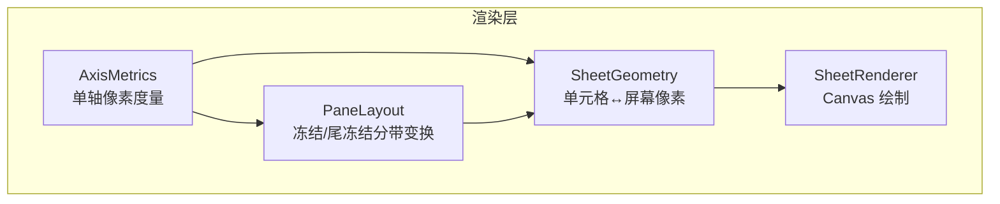
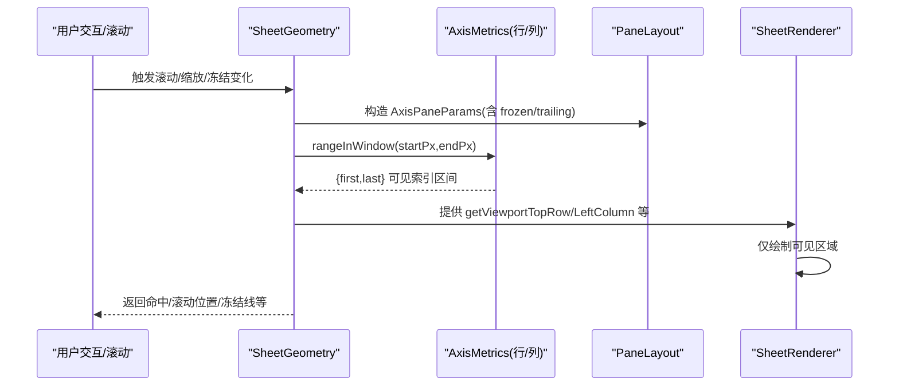
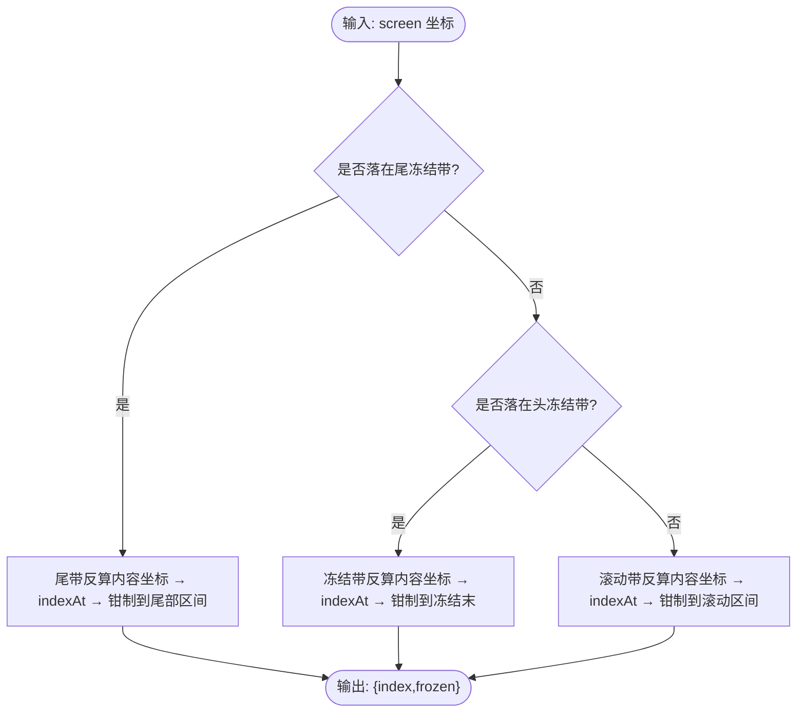
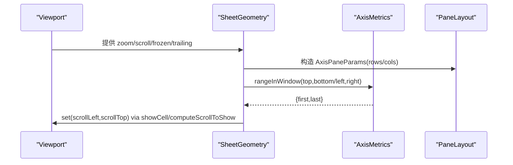
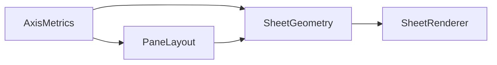

# 轴度量 (AxisMetrics)

<cite>
**本文引用的文件**
- [AxisMetrics.ts](file://cmx-mega-sheet/src/render/AxisMetrics.ts)
- [AxisMetrics.test.ts](file://cmx-mega-sheet/test/AxisMetrics.test.ts)
- [SheetGeometry.ts](file://cmx-mega-sheet/src/render/SheetGeometry.ts)
- [PaneLayout.ts](file://cmx-mega-sheet/src/render/PaneLayout.ts)
- [SheetRenderer.ts](file://cmx-mega-sheet/src/render/SheetRenderer.ts)
- [README.md](file://cmx-mega-sheet/README.md)
</cite>

## 目录
1. [简介](#简介)
2. [项目结构](#项目结构)
3. [核心组件](#核心组件)
4. [架构总览](#架构总览)
5. [详细组件分析](#详细组件分析)
6. [依赖关系分析](#依赖关系分析)
7. [性能考量](#性能考量)
8. [故障排查指南](#故障排查指南)
9. [结论](#结论)
10. [附录](#附录)

## 简介
本技术文档聚焦于电子表格渲染层的“轴度量”子系统，围绕 AxisMetrics 类展开，系统说明其行高测量、列宽计算、文本度量优化、字体度量缓存等关键能力；解释动态度量更新机制、度量值变更通知以及与布局系统的集成方式；并给出大数据量下的性能优化策略、异步度量加载与精度控制方案。同时提供扩展接口与调试工具的使用建议，帮助开发者在复杂场景下高效使用与定制该子系统。

## 项目结构
轴度量位于 cmx-mega-sheet 的渲染层，作为几何计算的基石，被 SheetGeometry、PaneLayout、SheetRenderer 等模块消费：
- AxisMetrics：单轴（行或列）像素度量，维护索引到像素坐标的 O(log n) 双向映射，惰性构建前缀和，支持隐藏元素语义。
- PaneLayout：冻结/拆分窗格的纯几何分带变换，将 AxisMetrics 的 startOf/sizeAt 抽象为回调，实现头冻结、滚动带、尾冻结三带坐标转换。
- SheetGeometry：单元格↔屏幕像素映射，组合 AxisMetrics 与 Viewport，提供 getCellRect、hitTest、可见范围计算、滚动条布局等。
- SheetRenderer：基于 Canvas 的最小绘制上下文进行渲染，依赖 SheetGeometry 提供的几何信息，负责可见区域绘制。
- README：项目分层与里程碑概览，确认渲染层职责边界与不变式。



图表来源
- [AxisMetrics.ts:12-143](file://cmx-mega-sheet/src/render/AxisMetrics.ts#L12-L143)
- [PaneLayout.ts:22-201](file://cmx-mega-sheet/src/render/PaneLayout.ts#L22-L201)
- [SheetGeometry.ts:80-120](file://cmx-mega-sheet/src/render/SheetGeometry.ts#L80-L120)
- [SheetRenderer.ts:140-163](file://cmx-mega-sheet/src/render/SheetRenderer.ts#L140-L163)

章节来源
- [README.md:98-118](file://cmx-mega-sheet/README.md#L98-L118)

## 核心组件
- AxisMetrics：提供 length、sizeAt、startOf、endOf、totalSize、indexAt、rangeInWindow、invalidate、setCount 等方法，用于单轴的尺寸查询、坐标映射与视口区间计算。内部维护惰性构建的前缀和 offsets，保证 O(log n) 二分命中。
- PaneLayout：定义 AxisPaneParams，封装 offset、zoom、scroll、frozenCount、count、startOf、sizeAt、trailingCount、viewSize 等参数，提供 indexStartToScreen、screenToIndex、scrollBandVisibleRange 等纯函数，严格保持 index↔screen 互逆。
- SheetGeometry：组合 rows/cols AxisMetrics 与 viewport，提供冻结线、尾冻结线、可见范围、滚动条布局、showCell、computeScrollToShow 等能力，是交互与渲染的几何中枢。
- SheetRenderer：最小化 Canvas 上下文接口，通过 SheetGeometry 获取几何信息，仅绘制可见区域，避免无关开销。

章节来源
- [AxisMetrics.ts:12-143](file://cmx-mega-sheet/src/render/AxisMetrics.ts#L12-L143)
- [PaneLayout.ts:22-201](file://cmx-mega-sheet/src/render/PaneLayout.ts#L22-L201)
- [SheetGeometry.ts:80-120](file://cmx-mega-sheet/src/render/SheetGeometry.ts#L80-L120)
- [SheetRenderer.ts:140-163](file://cmx-mega-sheet/src/render/SheetRenderer.ts#L140-L163)

## 架构总览
轴度量子系统以 AxisMetrics 为核心，向上支撑 PaneLayout 的分带坐标变换，再被 SheetGeometry 聚合为完整的行列几何模型，最终由 SheetRenderer 驱动可见区域绘制。该架构遵循“画=点”的不变式：任何屏幕坐标到单元格索引的映射与绘制矩形严格互逆，确保交互与渲染一致性。



图表来源
- [SheetGeometry.ts:451-477](file://cmx-mega-sheet/src/render/SheetGeometry.ts#L451-L477)
- [PaneLayout.ts:102-153](file://cmx-mega-sheet/src/render/PaneLayout.ts#L102-L153)
- [AxisMetrics.ts:118-142](file://cmx-mega-sheet/src/render/AxisMetrics.ts#L118-L142)
- [SheetRenderer.ts:169-200](file://cmx-mega-sheet/src/render/SheetRenderer.ts#L169-L200)

## 详细组件分析

### AxisMetrics 类分析
- 设计目标：单轴（行或列）的像素度量，维护索引↔像素坐标的 O(log n) 双向映射；默认尺寸 + 稀疏覆盖建模，前缀和惰性构建；隐藏元素计 0 像素但仍占索引。
- 关键方法：
  - sizeAt(index)：返回实际占用像素（隐藏为 0）。
  - startOf/endOf：元素起始/结束像素坐标。
  - totalSize：全轴像素总长。
  - indexAt(pixel)：像素→索引的二分查找，跳过零宽隐藏元素。
  - rangeInWindow(startPx,endPx)：返回窗口覆盖的索引闭区间。
  - invalidate/setCount：尺寸/隐藏/数量变化后失效重建。
- 复杂度：构建前缀和 O(n)，后续 indexAt/rangeInWindow 均为 O(log n)。

```mermaid
classDiagram
class AxisMetrics {
-sizes(index) : number
-hidden(index) : boolean
-count : number
-offsets : number[] | null
+length : number
+sizeAt(index) : number
+startOf(index) : number
+endOf(index) : number
+totalSize() : number
+indexAt(pixel) : number
+rangeInWindow(startPx, endPx) : {first,last}|null
-ensureOffsets() : void
+invalidate() : void
+setCount(count) : void
-lastIndexStartingBefore(pixel, lowerBound) : number
}
```

图表来源
- [AxisMetrics.ts:12-143](file://cmx-mega-sheet/src/render/AxisMetrics.ts#L12-L143)

章节来源
- [AxisMetrics.ts:12-143](file://cmx-mega-sheet/src/render/AxisMetrics.ts#L12-L143)
- [AxisMetrics.test.ts:1-129](file://cmx-mega-sheet/test/AxisMetrics.test.ts#L1-L129)

### PaneLayout 分带变换
- 目标：冻结/拆分窗格（M9/M19）的纯几何变换，支持头冻结、滚动带、尾冻结三带。
- 关键点：
  - indexStartToScreen(screen)：元素起始内容坐标→屏幕坐标，考虑冻结/尾冻结/滚动。
  - screenToIndex(screen)：屏幕坐标→元素索引+是否冻结，严格与 indexStartToScreen 互逆。
  - scrollBandVisibleRange：计算滚动带可见范围，排除冻结带。
- 与 AxisMetrics 的关系：通过回调 startOf/sizeAt 解耦具体度量实现，便于 Node 单测。



图表来源
- [PaneLayout.ts:102-153](file://cmx-mega-sheet/src/render/PaneLayout.ts#L102-L153)

章节来源
- [PaneLayout.ts:22-201](file://cmx-mega-sheet/src/render/PaneLayout.ts#L22-L201)

### SheetGeometry 几何中枢
- 作用：组合 rows/cols AxisMetrics 与 viewport，提供冻结线、尾冻结线、可见范围、滚动条布局、showCell、computeScrollToShow 等能力。
- 重要流程：
  - visibleRowRange/visibleColRange：结合 PaneLayout.scrollBandVisibleRange 与 AxisMetrics.rangeInWindow 计算可见索引区间。
  - hitTest/getCellRect：严格互逆，跨冻结/尾冻结/滚动/缩放均成立。
  - resolveScrollbars：解析滚动条布局并回写 gutter，影响 contentWidth/Height 与可见范围。



图表来源
- [SheetGeometry.ts:451-477](file://cmx-mega-sheet/src/render/SheetGeometry.ts#L451-L477)
- [PaneLayout.ts:166-187](file://cmx-mega-sheet/src/render/PaneLayout.ts#L166-L187)
- [AxisMetrics.ts:118-142](file://cmx-mega-sheet/src/render/AxisMetrics.ts#L118-L142)

章节来源
- [SheetGeometry.ts:80-120](file://cmx-mega-sheet/src/render/SheetGeometry.ts#L80-L120)
- [SheetGeometry.ts:451-546](file://cmx-mega-sheet/src/render/SheetGeometry.ts#L451-L546)

### 文本度量与字体缓存（扩展建议）
当前 AxisMetrics 未直接持有文本度量缓存，但可通过以下模式扩展：
- 文本度量优化：在 sizeOf 回调中调用 Canvas.measureText，对相同 font/text 组合的结果进行缓存，避免重复测量。
- 字体度量缓存：维护 Map<fontKey, width>，key 包含字体族、大小、样式、对齐等；在批量计算行高/列宽时复用。
- 异步度量加载：对于大量单元格文本，可分批异步测量并逐步回填到 AxisMetrics.sizeOf 的缓存中，减少主线程阻塞。
- 精度控制：对 measureText 结果进行四舍五入或取整，保证像素对齐一致性与视觉稳定。

[本节为概念性扩展建议，不直接分析具体文件]

## 依赖关系分析
- AxisMetrics 依赖：无外部 DOM，纯计算；通过 sizeOf/hiddenOf 回调与上层数据源耦合。
- PaneLayout 依赖：通过回调 startOf/sizeAt 解耦 AxisMetrics 实现，保持纯函数特性。
- SheetGeometry 依赖：AxisMetrics（rows/cols）、Viewport、PaneLayout；提供几何中枢能力。
- SheetRenderer 依赖：SheetGeometry；仅绘制可见区域，降低渲染成本。



图表来源
- [AxisMetrics.ts:12-143](file://cmx-mega-sheet/src/render/AxisMetrics.ts#L12-L143)
- [PaneLayout.ts:22-201](file://cmx-mega-sheet/src/render/PaneLayout.ts#L22-L201)
- [SheetGeometry.ts:80-120](file://cmx-mega-sheet/src/render/SheetGeometry.ts#L80-L120)
- [SheetRenderer.ts:140-163](file://cmx-mega-sheet/src/render/SheetRenderer.ts#L140-L163)

章节来源
- [README.md:98-118](file://cmx-mega-sheet/README.md#L98-L118)

## 性能考量
- 惰性前缀和：AxisMetrics.offsets 仅在首次访问时构建，避免不必要的 O(n) 开销。
- 二分命中：indexAt/rangeInWindow 使用二分查找，O(log n) 定位，适合大数据量。
- 隐藏元素处理：隐藏元素计 0 像素但仍占索引，二分时天然跳过，减少无效命中。
- 分带可见范围：PaneLayout.scrollBandVisibleRange 精确计算滚动带可见区间，避免冻结带参与滚动计算。
- 渲染裁剪：SheetRenderer 仅绘制可见区域，减少 Canvas 操作次数。
- 大数据优化建议：
  - 批量异步测量文本宽度，逐步回填缓存。
  - 对频繁访问的 font/text 组合建立全局缓存。
  - 使用 requestAnimationFrame 或 Web Worker 进行离线度量计算。
  - 对超大表采用分页/懒加载策略，按需构建 AxisMetrics 子集。

[本节提供通用性能指导，不直接分析具体文件]

## 故障排查指南
- 常见问题：
  - 度量失效：尺寸/隐藏/数量变化后未调用 invalidate/setCount，导致前缀和过期。
  - 命中异常：indexAt 返回隐藏元素索引，需检查 hiddenOf 回调与 sizeAt 返回值。
  - 可见范围错误：rangeInWindow 传入的像素窗口超出轴范围，需钳制到 [0,totalSize]。
  - 冻结/尾冻结边界：PaneLayout 分带逻辑需确保 frozenCount/trailingCount 正确设置。
- 调试建议：
  - 打印 AxisMetrics.totalSize/startOf/endOf 验证前缀和。
  - 断言 indexAt(pixel) 与 getCellRect 的互逆关系。
  - 使用 PaneLayout.bandOf 判断元素所属带，辅助定位边界问题。
  - 在 SheetGeometry.resolveScrollbars 后检查 gutter 回写是否正确。

章节来源
- [AxisMetrics.ts:92-111](file://cmx-mega-sheet/src/render/AxisMetrics.ts#L92-L111)
- [PaneLayout.ts:84-94](file://cmx-mega-sheet/src/render/PaneLayout.ts#L84-L94)
- [SheetGeometry.ts:555-572](file://cmx-mega-sheet/src/render/SheetGeometry.ts#L555-L572)

## 结论
AxisMetrics 作为轴度量的核心，提供了高效、可靠的单轴像素度量能力，配合 PaneLayout 的分带变换与 SheetGeometry 的几何中枢，实现了冻结/尾冻结/滚动/缩放的统一处理。通过惰性前缀和、二分命中、可见范围裁剪等手段，系统在大数据量下仍保持良好性能。扩展文本度量缓存与异步加载可进一步提升体验。建议在尺寸/隐藏/数量变化时及时失效重建，确保几何一致性与交互准确性。

[本节总结性内容，不直接分析具体文件]

## 附录
- 测试用例参考：AxisMetrics.test.ts 覆盖了均匀尺寸、自定义尺寸、隐藏元素、空轴、失效重建、视口范围等场景，可作为行为验证基准。
- 项目里程碑：README 中的 M9/M19 对应冻结/尾冻结能力，M1 对应几何/视口虚拟化，M13 对应条件格式叠加，M14 对应浮动对象层，M18 对应样式细项，M26 对应 CSV 与数据工具。

章节来源
- [AxisMetrics.test.ts:1-129](file://cmx-mega-sheet/test/AxisMetrics.test.ts#L1-L129)
- [README.md:64-93](file://cmx-mega-sheet/README.md#L64-L93)