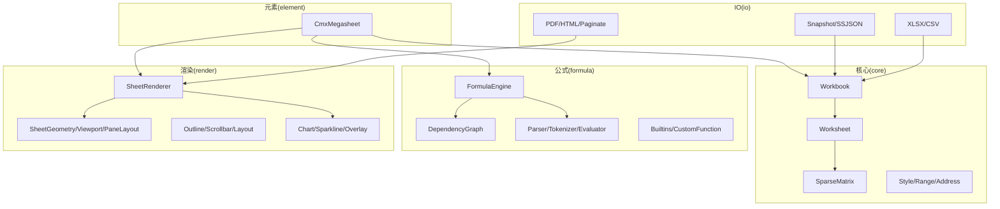
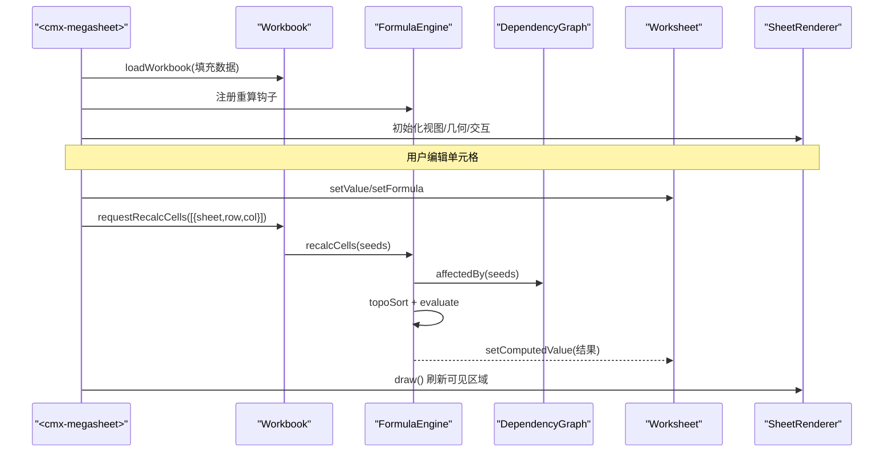
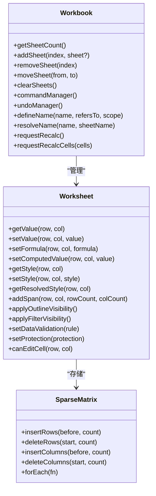
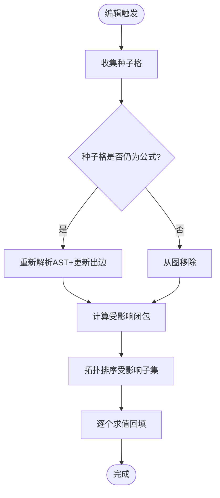
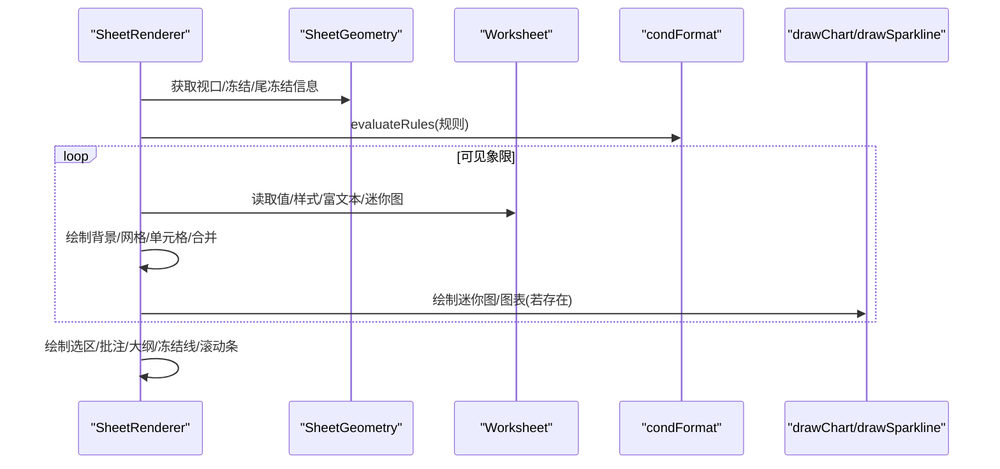
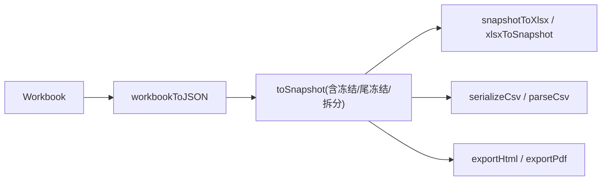
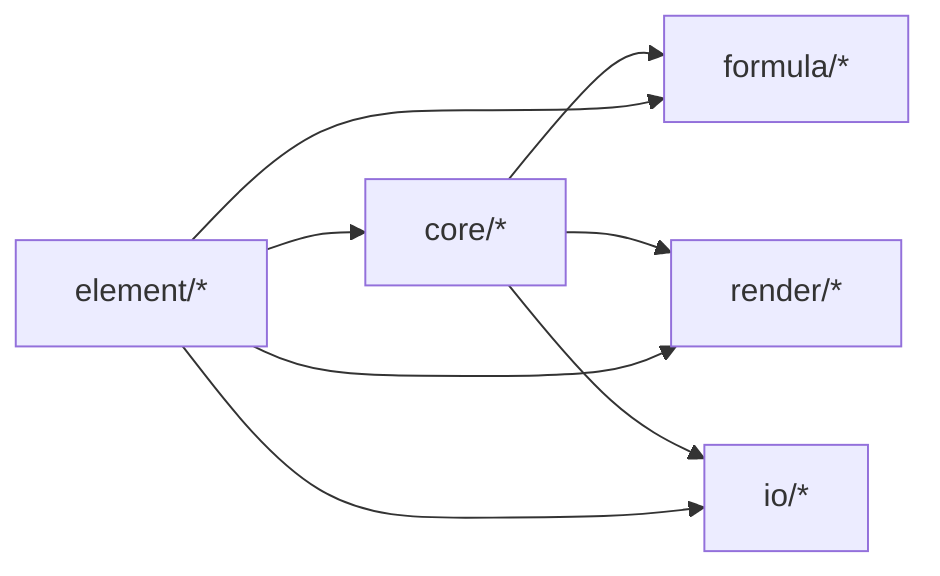

# 电子表格引擎 (cmx-mega-sheet)

<cite>
**本文引用的文件**
- [README.md](file://cmx-mega-sheet/README.md)
- [package.json](file://cmx-mega-sheet/package.json)
- [index.ts](file://cmx-mega-sheet/src/index.ts)
- [Workbook.ts](file://cmx-mega-sheet/src/core/Workbook.ts)
- [Worksheet.ts](file://cmx-mega-sheet/src/core/Worksheet.ts)
- [SparseMatrix.ts](file://cmx-mega-sheet/src/core/SparseMatrix.ts)
- [FormulaEngine.ts](file://cmx-mega-sheet/src/formula/Formul aEngine.ts)
- [DependencyGraph.ts](file://cmx-mega-sheet/src/formula/DependencyGraph.ts)
- [SheetRenderer.ts](file://cmx-mega-sheet/src/render/SheetRenderer.ts)
- [snapshot.ts](file://cmx-mega-sheet/src/io/snapshot.ts)
- [cmx-megasheet.ts](file://cmx-mega-sheet/src/element/cmx-megasheet.ts)
- [demo_index.html](file://cmx-mega-sheet/demo/demo_index.html)
</cite>

## 目录
1. [简介](#简介)
2. [项目结构](#项目结构)
3. [核心组件](#核心组件)
4. [架构总览](#架构总览)
5. [详细组件分析](#详细组件分析)
6. [依赖关系分析](#依赖关系分析)
7. [性能考量](#性能考量)
8. [故障排查指南](#故障排查指南)
9. [结论](#结论)
10. [附录](#附录)

## 简介
本技术文档面向 CMX 电子表格引擎（cmx-mega-sheet），系统性说明其核心架构、单元格操作、公式计算、数据导入导出、工作簿与工作表管理、样式系统与渲染机制，以及公式解析器、依赖图管理与性能优化策略。文档同时提供 API 参考要点、扩展开发指南与第三方集成方案，并给出与 SpreadJS 的集成方式评估与替代方案建议，附带使用示例与基准测试指引。

该引擎为自研、零运行时依赖、全 clean-room 的 TypeScript 实现，以 Web Components 暴露 <cmx-megasheet> 自定义元素，并提供 Workbook/Worksheet/FormulaEngine 等库级接口，支持中性快照、XLSX/CSV/HTML/PDF 导入导出、图表与迷你图、条件格式、冻结/尾冻结/拆分窗格、保护锁定等能力。

**章节来源**
- [README.md:1-206](file://cmx-mega-sheet/README.md#L1-L206)

## 项目结构
引擎按职责分层组织：
- core：数据模型（坐标/区域/稀疏矩阵/样式/工作簿/工作表/选区/命令/剪贴板/填充/查找/排序/验证）
- formula：公式引擎（词法/语法解析、求值、依赖图、内置函数、报表取数）
- render：画布渲染（几何/视口/布局/滚动条/主题/条件格式/数字格式/图表/浮动对象）
- io：导入导出（中性快照/XLSX/CSV/SSJSON/ZIP/DEFLATE/HTML/PDF/分页）
- element：<cmx-megasheet> 自定义元素与 ReportModel 输入契约
- index.ts：统一出口，聚合各层导出

**图示来源**
- [index.ts:1-298](file://cmx-mega-sheet/src/index.ts#L1-L298)
- [README.md:98-118](file://cmx-mega-sheet/README.md#L98-L118)

**章节来源**
- [index.ts:1-298](file://cmx-mega-sheet/src/index.ts#L1-L298)
- [README.md:98-118](file://cmx-mega-sheet/README.md#L98-L118)

## 核心组件
- 工作簿（Workbook）：管理工作表集合、活动表、事件、撤销/命令、命名区域、重算钩子。
- 工作表（Worksheet）：承载单元格数据（值/公式/富文本/样式）、合并区、行列元数据、大纲分组、筛选、验证、超链接、条件格式、批注、浮动对象、迷你图、页面设置、保护。
- 稀疏矩阵（SparseMatrix）：高效存储非空单元格，支持行列增删时的坐标搬移。
- 公式引擎（FormulaEngine）：扫描公式、构建依赖图、拓扑排序、增量/全量重算、环检测、直接求值。
- 依赖图（DependencyGraph）：维护公式格依赖与反向依赖，提供受影响闭包计算与三色环检测。
- 渲染器（SheetRenderer）：基于 SheetGeometry 的可见区域绘制，支持冻结/尾冻结/拆分、条件格式叠加、迷你图/图表、批注标记、主题。
- 自定义元素（CmxMegasheet）：装配 core/render/formula/IO，提供公共 API 与事件，封装公式栏、画布、页签栏、主题。

**章节来源**
- [Workbook.ts:1-397](file://cmx-mega-sheet/src/core/Workbook.ts#L1-L397)
- [Worksheet.ts:1-800](file://cmx-mega-sheet/src/core/Worksheet.ts#L1-L800)
- [SparseMatrix.ts:1-175](file://cmx-mega-sheet/src/core/SparseMatrix.ts#L1-L175)
- [FormulaEngine.ts:1-289](file://cmx-mega-sheet/src/formula/Formul aEngine.ts#L1-L289)
- [DependencyGraph.ts:1-201](file://cmx-mega-sheet/src/formula/DependencyGraph.ts#L1-L201)
- [SheetRenderer.ts:1-800](file://cmx-mega-sheet/src/render/SheetRenderer.ts#L1-L800)
- [cmx-megasheet.ts:1-800](file://cmx-mega-sheet/src/element/cmx-megasheet.ts#L1-L800)

## 架构总览
引擎采用“数据模型—公式—渲染—IO—元素”的分层架构，通过严格不变式保证稳定性：消费方零改、浏览器纯净、零运行时依赖、“画=点”共享几何、可撤销命令模式、既有测试零回归。

**图示来源**
- [cmx-megasheet.ts:340-384](file://cmx-mega-sheet/src/element/cmx-megasheet.ts#L340-L384)
- [FormulaEngine.ts:149-243](file://cmx-mega-sheet/src/formula/Formul aEngine.ts#L149-L243)
- [DependencyGraph.ts:142-199](file://cmx-mega-sheet/src/formula/DependencyGraph.ts#L142-L199)
- [SheetRenderer.ts:165-229](file://cmx-mega-sheet/src/render/SheetRenderer.ts#L165-L229)

## 详细组件分析

### 工作簿与工作表管理
- 工作簿：维护 sheets 数组、activeIndex、styleSheet、命名区域、撤销/命令管理器、重算钩子；提供 add/remove/move/clearSheets、事件绑定、命令执行包装。
- 工作表：维护 SparseMatrix 单元格、合并区、行列尺寸/可见性、大纲分组、自动筛选、数据验证、超链接、条件格式、批注、浮动对象、迷你图、页面设置、保护；提供链式 CellRange 句柄、范围扩展到合并区、可见性应用（大纲/筛选）。

**图示来源**
- [Workbook.ts:174-397](file://cmx-mega-sheet/src/core/Workbook.ts#L174-L397)
- [Worksheet.ts:435-800](file://cmx-mega-sheet/src/core/Worksheet.ts#L435-L800)
- [SparseMatrix.ts:89-166](file://cmx-mega-sheet/src/core/SparseMatrix.ts#L89-L166)

**章节来源**
- [Workbook.ts:1-397](file://cmx-mega-sheet/src/core/Workbook.ts#L1-L397)
- [Worksheet.ts:1-800](file://cmx-mega-sheet/src/core/Worksheet.ts#L1-L800)
- [SparseMatrix.ts:1-175](file://cmx-mega-sheet/src/core/SparseMatrix.ts#L1-L175)

### 公式解析器与依赖图管理
- 解析器：Pratt 解析器生成 AST，支持相对/绝对引用、跨表引用、整列/整行、数组字面量、命名区域。
- 依赖图：从 AST 抽取依赖键（展开区域为逐格），维护正向/反向依赖；topoSort 返回无环拓扑序与环上节点集；affectedBy 计算受影响闭包。
- 引擎编排：recalcAll 重建图并拓扑求值；recalcCells 增量更新种子格的依赖并仅重算受影响闭包；volatile 函数每次纳入；环上格写 #CIRC!。

**图示来源**
- [FormulaEngine.ts:206-243](file://cmx-mega-sheet/src/formula/Formul aEngine.ts#L206-L243)
- [DependencyGraph.ts:142-199](file://cmx-mega-sheet/src/formula/DependencyGraph.ts#L142-L199)

**章节来源**
- [FormulaEngine.ts:1-289](file://cmx-mega-sheet/src/formula/Formul aEngine.ts#L1-L289)
- [DependencyGraph.ts:1-201](file://cmx-mega-sheet/src/formula/DependencyGraph.ts#L1-L201)

### 渲染机制与样式系统
- 几何与视口：SheetGeometry 提供 getCellRect/hitTest 互逆；Viewport 管理滚动/缩放；PaneLayout 处理冻结/尾冻结/拆分的三带布局。
- 渲染流程：背景→网格线→单元格→合并区→选区→浮动对象→批注标记→行列头→大纲→冻结线→滚动条；条件格式在渲染前计算并叠加。
- 样式系统：StyleSheet 命名样式级联（工作簿→默认→列→行→单元格），支持边框、填充（图案/渐变）、对齐、字体、旋转、缩进、shrinkToFit、wordWrap、锁定等。
- 数字格式：Excel 格式串编译/执行，颜色段红字、日期掩码、1900 序列。

**图示来源**
- [SheetRenderer.ts:165-229](file://cmx-mega-sheet/src/render/SheetRenderer.ts#L165-L229)
- [SheetRenderer.ts:433-533](file://cmx-mega-sheet/src/render/SheetRenderer.ts#L433-L533)

**章节来源**
- [SheetRenderer.ts:1-800](file://cmx-mega-sheet/src/render/SheetRenderer.ts#L1-L800)

### 数据导入导出与中性快照
- 中性快照：workbookToJSON/workbookFromJSON/stringifyWorkbook/parseWorkbook，格式标签 cmx-megasheet，稀疏、不含视图态，单一事实源。
- XLSX：exportXlsx/importXlsx，零依赖 ZIP+DEFLATE，值/公式/样式/合并/行列尺寸/多表/冻结/筛选/验证/页面设置全保真。
- CSV：serializeCsv/parseCsv，RFC-4180 引号转义，分隔符可选，BOM 可选。
- HTML/PDF：exportHtml/exportPdf，零依赖手写 PDF，支持页面设置与分页。

**图示来源**
- [snapshot.ts:271-319](file://cmx-mega-sheet/src/io/snapshot.ts#L271-L319)
- [cmx-megasheet.ts:663-738](file://cmx-mega-sheet/src/element/cmx-megasheet.ts#L663-L738)

**章节来源**
- [snapshot.ts:1-319](file://cmx-mega-sheet/src/io/snapshot.ts#L1-L319)
- [cmx-megasheet.ts:663-738](file://cmx-mega-sheet/src/element/cmx-megasheet.ts#L663-L738)

### 自定义元素与公共 API
- <cmx-megasheet> 装配：创建 Workbook/FormulaEngine/AxisMetrics/Viewport/SheetGeometry/SheetRenderer/InteractionController/SheetTabStrip，处理 HiDPI、ResizeObserver、IntersectionObserver、rAF 重绘循环。
- 公共方法：loadWorkbook、setReportModel、exportXlsx/importXlsx、exportCsv/importCsv、exportHtml/exportPdf、toSnapshot/fromSnapshot、freezePanes/freezeTrailing/splitPanes、applySelectionStyle/merge/unmerge、undo/redo、sortRange/setAutoFilter/find/replaceAll、setDataValidation/setCheckbox/setHyperlink/addConditionalRule/setRichText、insertChart/insertImage/insertShape/addComment/setSparkline、protectSheet/unprotectSheet/canEditCell、setTheme/showFormulaBar/showHeaders/showGridlines/showTabs 等。
- 事件：cmx-cell-selected、cmx-cell-edited、cmx-sheet-changed、cmx-col-resized、cmx-row-resized、cmx-edit-rejected、cmx-structural-changed。

**章节来源**
- [cmx-megasheet.ts:1-800](file://cmx-mega-sheet/src/element/cmx-megasheet.ts#L1-L800)
- [README.md:142-162](file://cmx-mega-sheet/README.md#L142-L162)

## 依赖关系分析
- 模块耦合：core 不依赖 render/formula/IO；formula 依赖 core；render 依赖 core；IO 依赖 core；element 组合 core/render/formula/IO。
- 外部依赖：零运行时依赖；开发期使用 TypeScript/Vitest。
- 关键契约：Workbook 暴露 commandManager/undoManager 与重算钩子；Worksheet 暴露单元格/结构/可见性 API；FormulaEngine 通过 workbook 钩子触发重算；SheetRenderer 面向 RenderContext2D 最小接口以便测试。

**图示来源**
- [index.ts:1-298](file://cmx-mega-sheet/src/index.ts#L1-L298)

**章节来源**
- [index.ts:1-298](file://cmx-mega-sheet/src/index.ts#L1-L298)
- [package.json:1-31](file://cmx-mega-sheet/package.json#L1-L31)

## 性能考量
- 稀疏存储：SparseMatrix 仅存非空槽位，行列增删时批量搬移键，避免稠密数组内存浪费。
- 增量重算：FormulaEngine.recalcCells 仅重算受影响闭包，减少大表编辑开销；volatile 函数每次纳入确保正确性。
- 视口虚拟化：SheetRenderer 仅绘制可见区域，冻结/尾冻结/拆分下分象限 clip 绘制，降低渲染成本。
- 条件格式与迷你图：渲染前一次性计算叠加，避免重复计算。
- 数字格式：编译格式串后执行，提升格式化性能。
- 导出优化：XLSX 零依赖 DEFLATE 压缩；PDF/HTML 按需分页与裁剪。

[本节为通用性能讨论，无需具体文件分析]

## 故障排查指南
- 公式环检测：依赖图三色 DFS 识别环，环上格写入 #CIRC!；检查公式引用是否形成闭环。
- 增量重算未生效：确认 graphBuilt 已建立（先运行 recalcAll），种子格是否为公式或 volatile 引用。
- 渲染异常：检查 SheetGeometry.getCellRect/hitTest 互逆不变式；冻结/尾冻结/拆分状态是否正确；HiDPI 缩放与 rAF 重绘是否正常。
- 导入导出问题：中性快照 format/version 校验；XLSX 往返需确保冻结/筛选/验证完整；CSV 分隔符/BOM 配置。
- 保护锁定：工作表保护启用时，locked=true 的单元格拒绝编辑；可通过 canEditCell 前置检查。

**章节来源**
- [FormulaEngine.ts:149-198](file://cmx-mega-sheet/src/formula/Formul aEngine.ts#L149-L198)
- [DependencyGraph.ts:158-199](file://cmx-mega-sheet/src/formula/DependencyGraph.ts#L158-L199)
- [SheetRenderer.ts:165-229](file://cmx-mega-sheet/src/render/SheetRenderer.ts#L165-L229)
- [snapshot.ts:311-319](file://cmx-mega-sheet/src/io/snapshot.ts#L311-L319)
- [Worksheet.ts:633-661](file://cmx-mega-sheet/src/core/Worksheet.ts#L633-L661)

## 结论
cmx-mega-sheet 以 clean-room 实现提供了完整的电子表格能力：从数据模型到公式引擎、从渲染到导入导出，均围绕“零依赖、稳定契约、高性能”设计。通过中性快照统一数据表示，结合增量重算与视口虚拟化，满足企业级场景对准确性、可扩展性与性能的严苛要求。作为 SpreadJS 的替代方案，它在功能覆盖度、可控性与可维护性方面具备显著优势。

[本节为总结性内容，无需具体文件分析]

## 附录

### API 参考要点
- 工作簿：Workbook.addSheet/removeSheet/moveSheet/clearSheets、commandManager/undoManager、defineName/resolveName/listNames/clearNames、requestRecalc/requestRecalcCells。
- 工作表：Worksheet.getValue/setValue/setFormula/setComputedValue/getStyle/setStyle/getResolvedStyle、addSpan/removeSpan/getSpan/getSpans、expandRangeToSpans、getRowHeight/setRowHeight/getColumnWidth/setColumnWidth、isRowVisible/setRowVisible/isColumnVisible/setColumnVisible、applyOutlineVisibility/applyFilterVisibility、setDataValidation/setHyperlink/addConditionalRule/setRichText、listFloatingObjects/addFloatingObject、setPageSetup/setProtection/canEditCell/rangeHasLocked。
- 公式：FormulaEngine.recalcAll/recalcCells/evaluateFormula、DependencyGraph.topoSort/affectedBy、Evaluator.evaluate。
- 渲染：SheetRenderer.render(theme/chartTheme)、SheetGeometry.getCellRect/hitTest、Viewport.set/clampScroll、SheetTabStrip.render。
- IO：workbookToJSON/workbookFromJSON/stringifyWorkbook/parseWorkbook、exportXlsx/importXlsx、serializeCsv/parseCsv、exportHtml/exportPdf/computePages/buildPdf。
- 元素：CmxMegasheet.loadWorkbook/setReportModel/toSnapshot/fromSnapshot/fromJSON/exportXlsx/importXlsx/exportCsv/importCsv/exportHtml/exportPdf、freezePanes/freezeTrailing/splitPanes、applySelectionStyle/merge/unmerge、undo/redo、sortRange/setAutoFilter/find/replaceAll、setDataValidation/setCheckbox/setHyperlink/addConditionalRule/setRichText、insertChart/insertImage/insertShape/addComment/setSparkline、protectSheet/unprotectSheet/canEditCell、setTheme/showFormulaBar/showHeaders/showGridlines/showTabs。

**章节来源**
- [Workbook.ts:174-397](file://cmx-mega-sheet/src/core/Workbook.ts#L174-L397)
- [Worksheet.ts:435-800](file://cmx-mega-sheet/src/core/Worksheet.ts#L435-L800)
- [FormulaEngine.ts:1-289](file://cmx-mega-sheet/src/formula/Formul aEngine.ts#L1-L289)
- [SheetRenderer.ts:1-800](file://cmx-mega-sheet/src/render/SheetRenderer.ts#L1-L800)
- [snapshot.ts:271-319](file://cmx-mega-sheet/src/io/snapshot.ts#L271-L319)
- [cmx-megasheet.ts:596-800](file://cmx-mega-sheet/src/element/cmx-megasheet.ts#L596-L800)

### 扩展开发指南
- 自定义函数：通过 BuiltinRegistry.register 注册函数实现，支持 volatile 标记；报表取数通过 registerReportFetchFunctions 注入 QM/QC/JE/FS/REF。
- 条件格式：在 Worksheet 添加 ConditionalRule，渲染时由 evaluateRules 计算叠加样式/色阶/数据条/图标集。
- 浮动对象：在 Worksheet 添加 FloatingObject（图片/图表/形状），渲染时按锚点几何定位，支持选中与缩放句柄。
- 命令扩展：通过 CommandManager.register 注册可撤销命令，遵循 execute/undo 语义，配合 UndoManager 记录栈。

**章节来源**
- [FormulaEngine.ts:36-67](file://cmx-mega-sheet/src/formula/Formul aEngine.ts#L36-L67)
- [Worksheet.ts:84-186](file://cmx-mega-sheet/src/core/Worksheet.ts#L84-L186)
- [SheetRenderer.ts:319-379](file://cmx-mega-sheet/src/render/SheetRenderer.ts#L319-L379)
- [Workbook.ts:125-172](file://cmx-mega-sheet/src/core/Workbook.ts#L125-L172)

### 第三方集成方案
- 与 SpreadJS 集成：保持 <cmx-megasheet> 公共门面不变，通过 loadWorkbook/setReportModel 替换内核；利用逃生舱 getWorkbook 直接调用原生 API；事件体系兼容 cmx-* 事件名。
- 替代方案评估：对比 SpreadJS 的商业许可与定制成本，cmx-mega-sheet 提供 Apache-2.0 开源协议、零依赖、可审计源码、中性快照迁移路径（SSJSON→cmx-megasheet），适合长期演进与深度定制。

**章节来源**
- [README.md:13-18](file://cmx-mega-sheet/README.md#L13-L18)
- [cmx-megasheet.ts:639-661](file://cmx-mega-sheet/src/element/cmx-megasheet.ts#L639-L661)
- [snapshot.ts:286-304](file://cmx-mega-sheet/src/io/snapshot.ts#L286-L304)

### 使用示例与基准测试
- 快速开始：作为 Web Component 引入 <cmx-megasheet>，通过 loadWorkbook 回调填充工作簿；作为库使用 Workbook/Worksheet/FormulaEngine 进行编程操作。
- 演示与自检：demo/demo_index.html 提供里程碑演示总览，每页包含真实数据与侧栏自检；headless Chrome 通过 check-demo.mjs 逐页断言零 console error。
- 基准测试：使用 vitest 运行 900+ 单测；通过 demo/verify-mN.mjs 同源断言验证里程碑能力；可结合性能测量工具（如 Performance API）评估渲染与重算耗时。

**章节来源**
- [README.md:22-60](file://cmx-mega-sheet/README.md#L22-L60)
- [README.md:177-190](file://cmx-mega-sheet/README.md#L177-L190)
- [demo_index.html:50-114](file://cmx-mega-sheet/demo/demo_index.html#L50-L114)