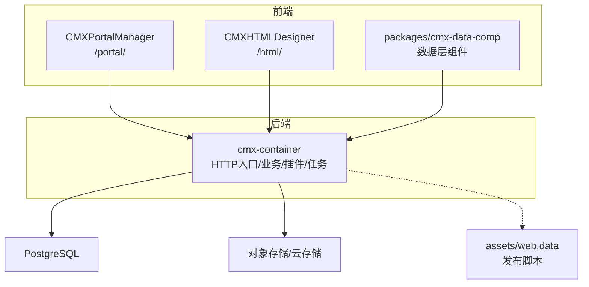
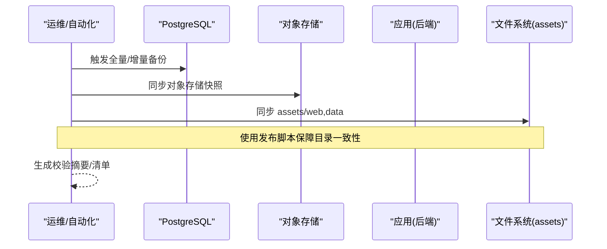
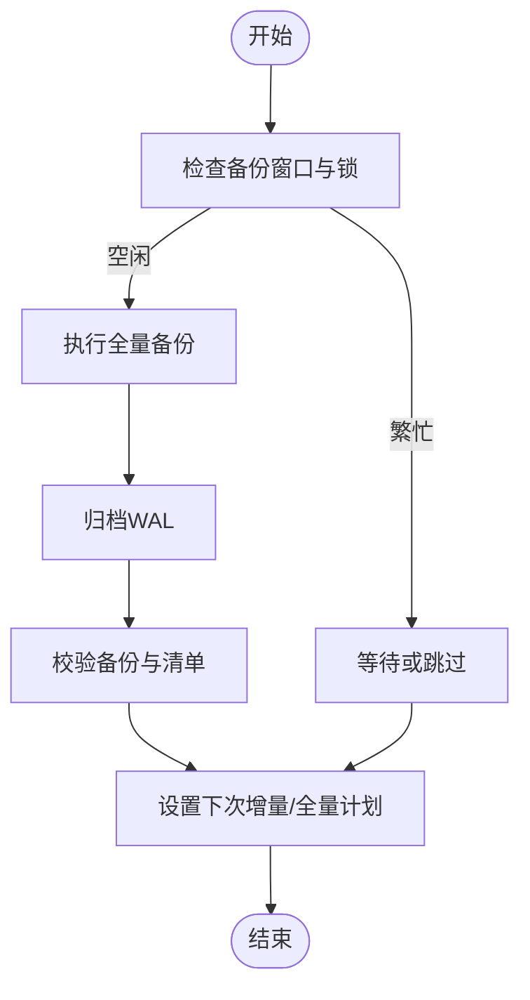
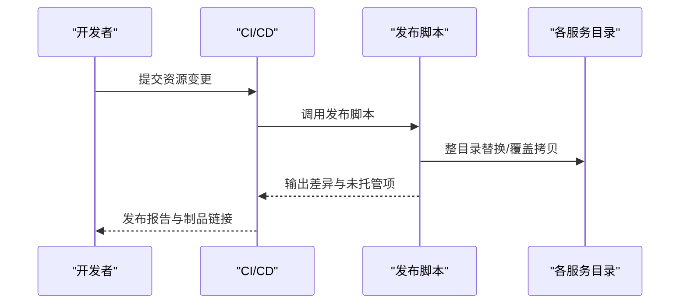
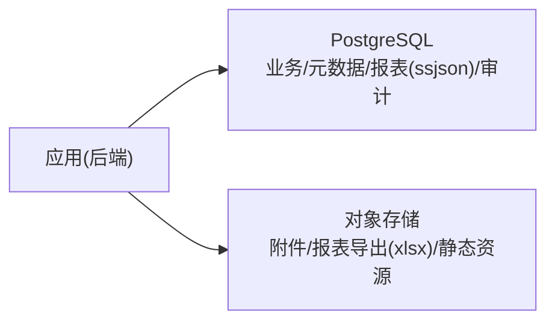
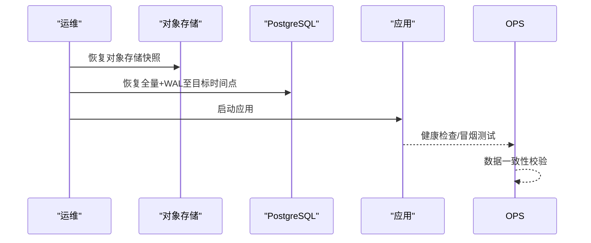
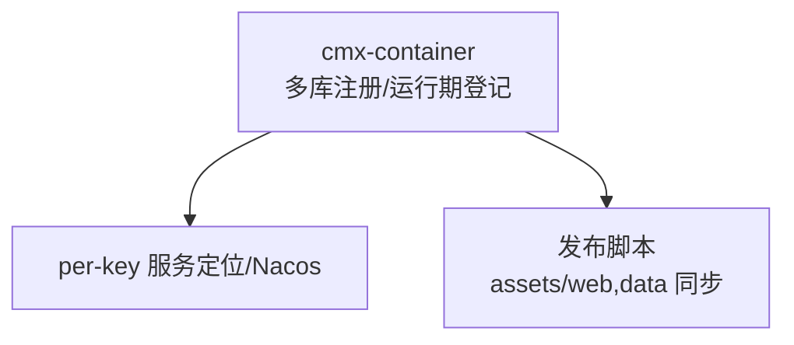

# 备份恢复

<cite>
**本文引用的文件**
- [README.md](file://README.md)
- [docker命令.txt](file://docker命令.txt)
- [publish-assets.sh](file://scripts/publish-assets.sh)
- [cmx-模块独立化方案.html](file://docs/cm x-模块独立化方案.html)
- [模型中心-元数据建模与数据库部署方案.html](file://docs/模型中心-元数据建模与数据库部署方案.html)
- [业务单据数据装载与前端模型映射方案.html](file://docs/业务单据数据装载与前端模型映射方案.html)
- [报表两模式加载存储方案.html](file://docs/报表两模式加载存储方案.html)
- [20260826_cmx-portal_通知中心数据库化与群发改造方案.md](file://documents/plans/20260826_cmx-portal_通知中心数据库化与群发改造方案.md)
- [20260822_cmx-center-client_per-key服务定位与传输混用方案.md](file://documents/20260822_cmx-center-client_per-key服务定位与传输混用方案.md)
- [20260822_cmx-center-client_服务定位map化与微服务接入Nacos方案.md](file://documents/20260822_cmx-center-client_服务定位map化与微服务接入Nacos方案.md)
- [CMXPortalManager/src/components/portal-flexible-combination-manager.js](file://CMXPortalManager/src/components/portal-flexible-combination-manager.js)
</cite>

## 目录
1. [简介](#简介)
2. [项目结构](#项目结构)
3. [核心组件](#核心组件)
4. [架构总览](#架构总览)
5. [详细组件分析](#详细组件分析)
6. [依赖关系分析](#依赖关系分析)
7. [性能考虑](#性能考虑)
8. [故障排查指南](#故障排查指南)
9. [结论](#结论)
10. [附录](#附录)

## 简介
本文件面向 CMX 企业门户平台（含门户运行时、可视化设计器、数据层 Web Components 及后端 cmx-container）的备份与恢复。文档聚焦以下目标：
- 数据库备份策略：全量备份、增量备份、定时任务配置建议
- 静态资源配置文件的版本管理与同步机制
- 用户数据与业务数据的备份方案：本地文件与云存储集成
- 灾难恢复流程与操作步骤
- 备份验证方法与恢复演练计划
- 备份存储空间规划与清理策略

说明：仓库中未包含内置的数据库备份/恢复脚本或调度器实现，因此本节提供基于现有基础设施（PostgreSQL、Redis、对象存储、发布脚本）的落地方案与操作指引，确保与平台能力一致。

## 项目结构
CMX 前端 monorepo 与后端 Rust workspace 协同工作。前端负责门户与设计器，后端提供元数据驱动的单据、字典、报表、流程等能力，并通过 HTTP 暴露接口。资产发布通过统一脚本将工作区资源同步到各服务目录，便于打包归档与一致性管理。

图表来源
- [README.md:45-55](file://README.md#L45-L55)
- [publish-assets.sh:1-48](file://scripts/publish-assets.sh#L1-L48)

章节来源
- [README.md:1-73](file://README.md#L1-L73)

## 核心组件
- 数据库连接与多库注册：后端支持多数据源注册与运行期登记，便于对多个目标库执行部署与运维操作。
- 附件与大字段：采用“引用+外部存储”的模式，避免大二进制进入数据库，提升备份效率与可恢复性。
- 报表存储：主存储为 ssjson（无损），可选导出 xlsx；支持内联与外部存储两种模式。
- 资产发布：统一脚本按目录粒度替换 web/data，保证构建产物与服务目录一致，利于归档与回滚。

章节来源
- [模型中心-元数据建模与数据库部署方案.html:412-433](file://docs/模型中心-元数据建模与数据库部署方案.html#L412-L433)
- [业务单据数据装载与前端模型映射方案.html:1145-1158](file://docs/业务单据数据装载与前端模型映射方案.html#L1145-L1158)
- [报表两模式加载存储方案.html:319-333](file://docs/报表两模式加载存储方案.html#L319-L333)
- [publish-assets.sh:1-48](file://scripts/publish-assets.sh#L1-L48)

## 架构总览
备份恢复涉及三类关键数据面：
- 结构化数据：PostgreSQL（业务表、元数据、报表内容、审计日志等）
- 非结构化数据：对象存储（附件、报表导出、静态资源等）
- 配置与资产：web/data 资源目录、配置文件、版本信息

图表来源
- [docker命令.txt:1-21](file://docker命令.txt#L1-L21)
- [publish-assets.sh:1-48](file://scripts/publish-assets.sh#L1-L48)

## 详细组件分析

### 数据库备份策略（PostgreSQL）
- 全量备份
  - 建议使用数据库原生工具进行冷备或热备（如 pg_basebackup + WAL 归档），在低峰时段执行，并记录时间戳与校验和。
  - 结合容器化部署时，确保数据卷持久化路径稳定，便于挂载与快照。
- 增量备份
  - 启用 WAL 归档，配合时间点恢复（PITR）。增量以 WAL 为单位，可实现分钟级恢复点。
  - 定期验证归档完整性，避免“有增量但不可恢复”的风险。
- 定时任务
  - 在操作系统或容器编排层配置定时任务（如 cron/Kubernetes CronJob），按日全量、按小时增量归档。
  - 任务需具备幂等性与失败重试、告警机制，并输出备份报告（大小、耗时、校验结果）。

图表来源
- [docker命令.txt:1-21](file://docker命令.txt#L1-L21)

章节来源
- [docker命令.txt:1-21](file://docker命令.txt#L1-L21)

### 静态资源配置文件的版本管理与同步
- 版本管理
  - 所有 web/data 资源以工作区为唯一真源，通过发布脚本整目录替换至各服务目录，避免手工修改导致漂移。
  - 每次发布应生成变更清单与哈希，纳入版本控制与制品库。
- 同步机制
  - 发布脚本按顶层子目录整目录替换，散文件覆盖拷贝，保留未托管条目并提示人工清理。
  - 建议在 CI/CD 中固化发布步骤，确保构建产物与服务目录一致。

图表来源
- [publish-assets.sh:1-48](file://scripts/publish-assets.sh#L1-L48)

章节来源
- [publish-assets.sh:1-48](file://scripts/publish-assets.sh#L1-L48)

### 用户数据与业务数据备份方案
- 结构化数据
  - 业务表、元数据、报表内容（ssjson）、审计日志等均落库 PostgreSQL，纳入数据库备份范围。
- 非结构化数据
  - 附件与大字段采用“引用+外部存储”模式，仅存 file_id/storage_key，本体在对象存储中。备份时需同时备份对象存储快照。
- 报表内容
  - 主存储为 ssjson（无损），必要时按需导出 xlsx；备份策略以 ssjson 为主，xlsx 作为导出产物按需备份。

图表来源
- [业务单据数据装载与前端模型映射方案.html:1145-1158](file://docs/业务单据数据装载与前端模型映射方案.html#L1145-L1158)
- [报表两模式加载存储方案.html:319-333](file://docs/报表两模式加载存储方案.html#L319-L333)

章节来源
- [业务单据数据装载与前端模型映射方案.html:1145-1158](file://docs/业务单据数据装载与前端模型映射方案.html#L1145-L1158)
- [报表两模式加载存储方案.html:319-333](file://docs/报表两模式加载存储方案.html#L319-L333)

### 灾难恢复流程与操作步骤
- 恢复目标
  - RTO/RPO 明确：根据业务等级设定恢复时间与恢复点目标。
- 恢复顺序
  1) 恢复对象存储快照（附件、报表导出、静态资源）
  2) 恢复 PostgreSQL 全量备份，并按 WAL 回放至目标时间点
  3) 启动应用，验证元数据与菜单、页面、报表加载
  4) 执行一致性校验（对象存储与数据库引用匹配）
- 回滚策略
  - 若恢复后发现问题，立即回退到上一可用备份集，并隔离问题版本。

图表来源
- [docker命令.txt:1-21](file://docker命令.txt#L1-L21)
- [业务单据数据装载与前端模型映射方案.html:1145-1158](file://docs/业务单据数据装载与前端模型映射方案.html#L1145-L1158)

### 备份验证方法与恢复演练计划
- 备份验证
  - 定期抽样恢复至隔离环境，验证登录、菜单、页面、报表、附件打开等关键路径。
  - 校验对象存储与数据库引用的一致性（随机抽取 file_id 核对存在性）。
- 恢复演练
  - 制定演练计划（季度/半年度），模拟单库/多库故障场景，记录 RTO/RPO 达成情况。
  - 演练后复盘，优化脚本与流程。

章节来源
- [20260826_cmx-portal_通知中心数据库化与群发改造方案.md:224-232](file://documents/plans/20260826_cmx-portal_通知中心数据库化与群发改造方案.md#L224-L232)

### 备份存储空间规划与清理策略
- 空间规划
  - 全量备份：按数据库体积×保留份数估算
  - 增量/WAL：按日均事务量×保留天数估算
  - 对象存储：按附件总量×冗余策略估算
- 清理策略
  - 生命周期规则：自动删除超过保留期的备份与 WAL
  - 冷热分层：近期备份放高性能盘，历史归档转低成本介质
  - 监控告警：容量阈值告警，防止写满

[本节为通用指导，不直接分析具体文件]

## 依赖关系分析
- 多库注册与运行期登记：后端支持动态注册数据源，便于对多目标库执行部署与运维操作，也为跨库备份/恢复提供基础。
- 配置与服务发现：通过 per-key 的服务定位与 Nacos 集成，可在不同环境切换配置与服务地址，便于灾备环境的快速拉起。
- 资产发布：统一发布脚本确保各服务目录与构建产物一致，降低恢复后的不一致风险。

图表来源
- [模型中心-元数据建模与数据库部署方案.html:412-433](file://docs/模型中心-元数据建模与数据库部署方案.html#L412-L433)
- [20260822_cmx-center-client_per-key服务定位与传输混用方案.md:58-71](file://documents/20260822_cmx-center-client_per-key服务定位与传输混用方案.md#L58-L71)
- [20260822_cmx-center-client_服务定位map化与微服务接入Nacos方案.md:106-153](file://documents/20260822_cmx-center-client_服务定位map化与微服务接入Nacos方案.md#L106-L153)
- [publish-assets.sh:1-48](file://scripts/publish-assets.sh#L1-L48)

章节来源
- [模型中心-元数据建模与数据库部署方案.html:412-433](file://docs/模型中心-元数据建模与数据库部署方案.html#L412-L433)
- [20260822_cmx-center-client_per-key服务定位与传输混用方案.md:58-71](file://documents/20260822_cmx-center-client_per-key服务定位与传输混用方案.md#L58-L71)
- [20260822_cmx-center-client_服务定位map化与微服务接入Nacos方案.md:106-153](file://documents/20260822_cmx-center-client_服务定位map化与微服务接入Nacos方案.md#L106-L153)
- [publish-assets.sh:1-48](file://scripts/publish-assets.sh#L1-L48)

## 性能考虑
- 备份窗口：选择业务低峰期执行全量备份，增量备份尽量频繁且轻量。
- I/O 影响：备份期间避免高并发写入；必要时暂停非关键任务。
- 网络带宽：对象存储同步需评估带宽与并发，避免挤占生产流量。
- 恢复顺序：先恢复静态资源与对象存储，再恢复数据库，缩短 RTO。

[本节为通用指导，不直接分析具体文件]

## 故障排查指南
- 备份失败
  - 检查数据库连接、权限、磁盘空间与 WAL 归档路径
  - 查看对象存储访问凭证与网络连通性
- 恢复异常
  - 校验备份集完整性（哈希/校验和）
  - 确认对象存储与数据库引用一致性
  - 逐步回退到上一可用备份集
- 配置漂移
  - 使用发布脚本重新同步 assets/web,data，消除手工修改导致的差异

章节来源
- [publish-assets.sh:1-48](file://scripts/publish-assets.sh#L1-L48)

## 结论
CMX 平台的备份恢复应以“数据库+对象存储+静态资源”三位一体为核心，结合 WAL 归档与对象存储快照，形成可验证、可演练、可回滚的完整体系。通过统一的发布脚本与多库注册能力，确保恢复后的一致性与可维护性。建议将备份与恢复纳入常态化演练与监控，持续优化 RTO/RPO。

[本节为总结性内容，不直接分析具体文件]

## 附录
- 相关能力参考
  - 多库注册与运行期登记：用于目标库管理与部署
  - 附件与报表存储约定：决定备份范围与恢复顺序
  - 发布脚本：保障静态资源与构建产物一致性

章节来源
- [模型中心-元数据建模与数据库部署方案.html:412-433](file://docs/模型中心-元数据建模与数据库部署方案.html#L412-L433)
- [业务单据数据装载与前端模型映射方案.html:1145-1158](file://docs/业务单据数据装载与前端模型映射方案.html#L1145-L1158)
- [报表两模式加载存储方案.html:319-333](file://docs/报表两模式加载存储方案.html#L319-L333)
- [publish-assets.sh:1-48](file://scripts/publish-assets.sh#L1-L48)