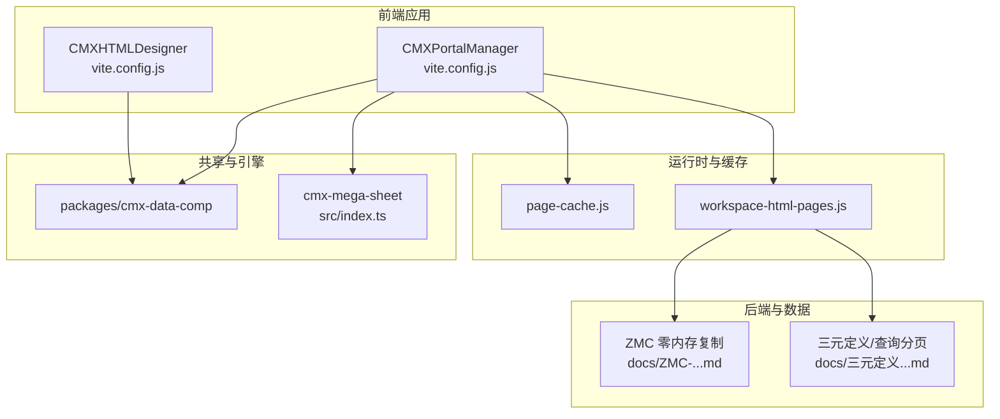
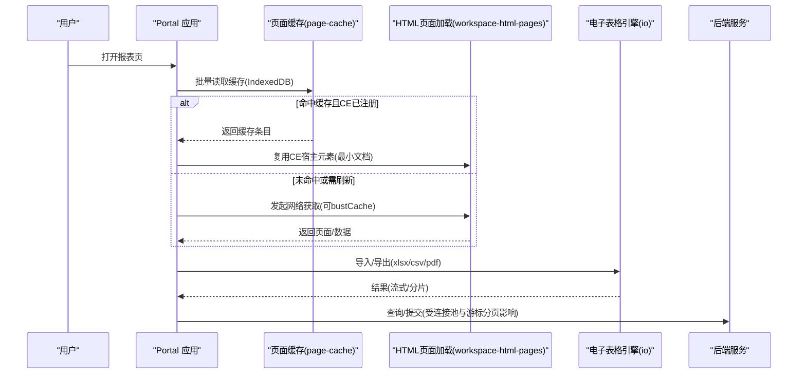
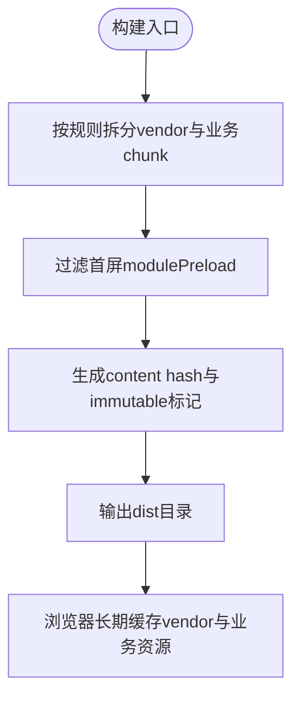
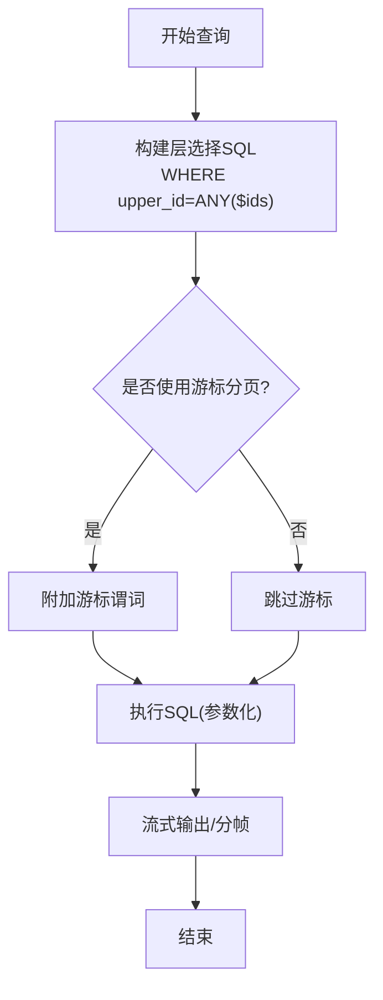
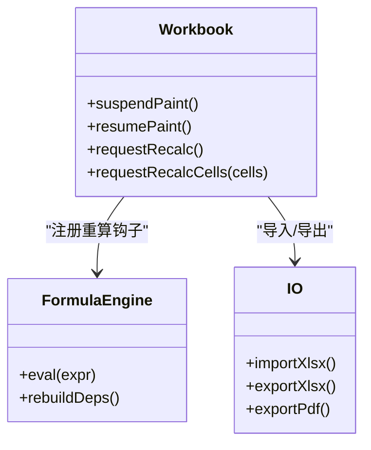
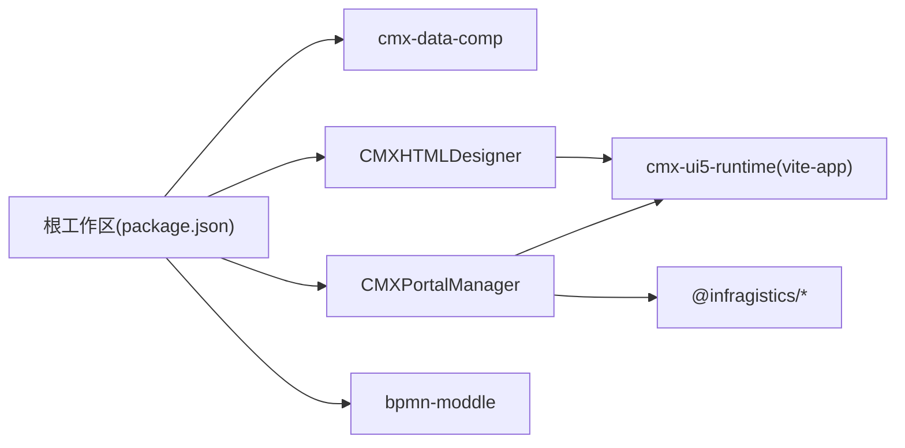

# 性能优化

<cite>
**本文引用的文件**
- [CMXHTMLDesigner/vite.config.js](file://CMXHTMLDesigner/vite.config.js)
- [CMXPortalManager/vite.config.js](file://CMXPortalManager/vite.config.js)
- [CMXHTMLDesigner/vite-designer-metadata-plugin.js](file://CMXHTMLDesigner/vite-designer-metadata-plugin.js)
- [packages/cmx-data-comp/package.json](file://package.json)
- [cmx-mega-sheet/package.json](file://cmx-mega-sheet/package.json)
- [cmx-mega-sheet/src/index.ts](file://cmx-mega-sheet/src/index.ts)
- [cmx-mega-sheet/src/core/Workbook.ts](file://cmx-mega-sheet/src/core/Workbook.ts)
- [CMXPortalManager/src/lib/page-cache.js](file://CMXPortalManager/src/lib/page-cache.js)
- [CMXPortalManager/src/lib/workspace-html-pages.js](file://CMXPortalManager/src/lib/workspace-html-pages.js)
- [docs/ZMC-零内存复制-ERP后端最佳实践.md](file://docs/ZMC-零内存复制-ERP后端最佳实践.md)
- [docs/三元定义体系架构文档.md](file://docs/三元定义体系架构文档.md)
- [docs/业务单据数据装载与前端模型映射方案.html](file://docs/业务单据数据装载与前端模型映射方案.html)
- [docs/为什么国产企业软件需要Rust-语言层根因分析.md](file://docs/为什么国产企业软件需要Rust-语言层根因分析.md)
</cite>

## 目录
1. [简介](#简介)
2. [项目结构](#项目结构)
3. [核心组件](#核心组件)
4. [架构总览](#架构总览)
5. [详细组件分析](#详细组件分析)
6. [依赖关系分析](#依赖关系分析)
7. [性能考量](#性能考量)
8. [故障排查指南](#故障排查指南)
9. [结论](#结论)
10. [附录](#附录)

## 简介
本文件面向 CMX 企业门户平台，聚焦端到端性能优化：前端构建优化（代码分割、资源压缩、缓存策略）、数据库查询优化（索引设计、查询调优、连接池配置）、内存管理与垃圾回收优化（重点覆盖电子表格引擎的大数据处理能力）、CDN 加速与静态资源优化、性能测试方法与基准工具使用，以及常见瓶颈识别与解决方案。内容基于仓库中的 Vite 构建配置、页面缓存实现、电子表格引擎导出接口与后端数据流设计文档进行系统化梳理。

## 项目结构
CMX 企业门户采用多包工作区组织：
- 前端应用：CMXHTMLDesigner（设计器）与 CMXPortalManager（门户主应用），均基于 Vite 构建，统一接入 cmx-ui5-runtime 插件与本地化白名单插件。
- 共享组件：packages/cmx-data-comp 提供数据与表格相关能力，被多个子项目复用。
- 电子表格引擎：cmx-mega-sheet 自研引擎，提供 core/render/formula/io/element 分层能力，并通过 index.ts 暴露稳定 API。
- 文档与方案：docs 下包含后端数据流、ZMC 零拷贝、层级数据等性能相关设计说明。

图表来源
- [CMXHTMLDesigner/vite.config.js:33-116](file://CMXHTMLDesigner/vite.config.js#L33-L116)
- [CMXPortalManager/vite.config.js:34-183](file://CMXPortalManager/vite.config.js#L34-L183)
- [cmx-mega-sheet/src/index.ts:1-298](file://cmx-mega-sheet/src/index.ts#L1-L298)
- [CMXPortalManager/src/lib/page-cache.js:109-181](file://CMXPortalManager/src/lib/page-cache.js#L109-L181)
- [CMXPortalManager/src/lib/workspace-html-pages.js:363-396](file://CMXPortalManager/src/lib/workspace-html-pages.js#L363-L396)
- [docs/ZMC-零内存复制-ERP后端最佳实践.md:1-149](file://docs/ZMC-零内存复制-ERP后端最佳实践.md#L1-L149)
- [docs/三元定义体系架构文档.md:1676-1711](file://docs/三元定义体系架构文档.md#L1676-L1711)

章节来源
- [CMXHTMLDesigner/vite.config.js:33-116](file://CMXHTMLDesigner/vite.config.js#L33-L116)
- [CMXPortalManager/vite.config.js:34-183](file://CMXPortalManager/vite.config.js#L34-L183)
- [cmx-mega-sheet/src/index.ts:1-298](file://cmx-mega-sheet/src/index.ts#L1-L298)
- [CMXPortalManager/src/lib/page-cache.js:109-181](file://CMXPortalManager/src/lib/page-cache.js#L109-L181)
- [CMXPortalManager/src/lib/workspace-html-pages.js:363-396](file://CMXPortalManager/src/lib/workspace-html-pages.js#L363-L396)
- [docs/ZMC-零内存复制-ERP后端最佳实践.md:1-149](file://docs/ZMC-零内存复制-ERP后端最佳实践.md#L1-L149)
- [docs/三元定义体系架构文档.md:1676-1711](file://docs/三元定义体系架构文档.md#L1676-L1711)

## 核心组件
- 前端构建与代码分割
  - 双应用均通过 Vite 构建，设置 base、plugins、resolve.alias/dedupe、optimizeDeps.exclude，生产目标 es2022，开启 sourcemap，限制 chunk 大小告警阈值。
  - Portal 侧针对重型第三方库（igniteui-spreadsheet/grids/gauges、tabulator、revogrid、treeview、lit/markdown/shiki/floating-ui）进行 manualChunks/codeSplitting groups 拆分，避免首屏加载无关大包；同时过滤 modulePreload 的 vendor-ignite-spreadsheet 以减少首屏压力。
  - Designer 侧通过自定义插件将 metadata JSON 在构建时复制到 dist，并在开发服务器挂载 /metadata 路径，便于设计期元数据直出。
- 页面缓存与增量同步
  - 页面级 IndexedDB 缓存：批量读取、LRU 淘汰、配额超限自动清理并回退；支持持久化存储请求与配额估算。
  - HTML 页面复用：若自定义元素已注册则跳过网络，直接注入最小文档；支持 bustCache 强制刷新并清理旧缓存以保障差异同步正确性。
- 电子表格引擎
  - 通过 src/index.ts 暴露 core/render/formula/io/element 各层能力，io 层提供 xlsx/csv/snapshot/pdf/html 等导入导出能力，支撑大数据量报表场景。
  - Workbook 提供撤销/重做、命令管理、命名区域、绘制抑制（suspendPaint/resumePaint）等机制，配合渲染层减少不必要重绘。

章节来源
- [CMXHTMLDesigner/vite.config.js:33-116](file://CMXHTMLDesigner/vite.config.js#L33-L116)
- [CMXPortalManager/vite.config.js:97-169](file://CMXPortalManager/vite.config.js#L97-L169)
- [CMXHTMLDesigner/vite-designer-metadata-plugin.js:43-66](file://CMXHTMLDesigner/vite-designer-metadata-plugin.js#L43-L66)
- [CMXPortalManager/src/lib/page-cache.js:109-181](file://CMXPortalManager/src/lib/page-cache.js#L109-L181)
- [CMXPortalManager/src/lib/workspace-html-pages.js:363-396](file://CMXPortalManager/src/lib/workspace-html-pages.js#L363-L396)
- [cmx-mega-sheet/src/index.ts:1-298](file://cmx-mega-sheet/src/index.ts#L1-L298)
- [cmx-mega-sheet/src/core/Workbook.ts:174-397](file://cmx-mega-sheet/src/core/Workbook.ts#L174-L397)

## 架构总览
前端构建与运行链路：
- Vite 构建产物按入口（main/login/preview/debug）输出，按需拆分 vendor 与业务 chunk，启用 content hash 与 immutable 缓存。
- 运行时通过 page-cache 与 workspace-html-pages 协同，优先命中本地缓存或已注册 CE，减少网络与解析开销。
- 电子表格引擎 io 层负责大文件导入导出，结合 Workbook 的绘制抑制与增量重算钩子，降低渲染与计算压力。

图表来源
- [CMXPortalManager/vite.config.js:97-169](file://CMXPortalManager/vite.config.js#L97-L169)
- [CMXPortalManager/src/lib/page-cache.js:109-181](file://CMXPortalManager/src/lib/page-cache.js#L109-L181)
- [CMXPortalManager/src/lib/workspace-html-pages.js:363-396](file://CMXPortalManager/src/lib/workspace-html-pages.js#L363-L396)
- [cmx-mega-sheet/src/index.ts:244-284](file://cmx-mega-sheet/src/index.ts#L244-L284)
- [docs/三元定义体系架构文档.md:1693-1711](file://docs/三元定义体系架构文档.md#L1693-L1711)

## 详细组件分析

### 前端构建优化（代码分割、资源压缩、缓存策略）
- 代码分割
  - Portal 侧通过 manualChunks 与 codeSplitting groups 将重型库拆分为独立 chunk（如 vendor-ignite-spreadsheet、vendor-tabulator、vendor-lit 等），并按优先级匹配，确保更具体的库先命中。
  - 首屏 modulePreload 过滤掉仅在动态 import 路径上的重型 vendor chunk，避免首屏阻塞。
  - Designer 侧通过 resolve.alias 指向源码，便于 dev 模式调试；dedupe 列表确保 UI5 组件与图标资源单实例。
- 资源压缩与缓存
  - 构建目标 es2022，sourcemap 开启便于线上定位；chunkSizeWarningLimit 控制过大 chunk 告警。
  - 通过 content hash 与 immutable 策略，浏览器可长期缓存 vendor 与业务 chunk，提升二次访问速度。
- 开发体验优化
  - 自定义 metadata 插件将设计期 JSON 元数据在构建时复制到 dist，并在 dev server 挂载 /metadata，避免额外请求。

图表来源
- [CMXPortalManager/vite.config.js:97-169](file://CMXPortalManager/vite.config.js#L97-L169)
- [CMXHTMLDesigner/vite.config.js:33-116](file://CMXHTMLDesigner/vite.config.js#L33-L116)
- [CMXHTMLDesigner/vite-designer-metadata-plugin.js:43-66](file://CMXHTMLDesigner/vite-designer-metadata-plugin.js#L43-L66)

章节来源
- [CMXPortalManager/vite.config.js:97-169](file://CMXPortalManager/vite.config.js#L97-L169)
- [CMXHTMLDesigner/vite.config.js:33-116](file://CMXHTMLDesigner/vite.config.js#L33-L116)
- [CMXHTMLDesigner/vite-designer-metadata-plugin.js:43-66](file://CMXHTMLDesigner/vite-designer-metadata-plugin.js#L43-L66)

### 数据库查询优化（索引设计、查询调优、连接池配置）
- 索引设计
  - 层级数据采用邻接表权威 + 派生列可选（如 level_no、full_path、is_leaf），查询时可利用派生列加速遍历与范围检索。
- 查询调优
  - 多层主从装载采用“一层一条 SQL + WHERE upper_id = ANY($ids)”的方式，避免 N+1 问题；参数化数组绑定提升注入安全与执行计划稳定性。
  - 游标分页（base64(JSON {vals, id})) 替代 offset，保证稳定无漂移的分页体验。
- 连接池配置
  - 流式输出期间占用连接直至发送完成，需结合连接池容量与背压设计，避免连接耗尽导致吞吐下降。

图表来源
- [docs/业务单据数据装载与前端模型映射方案.html:464-481](file://docs/业务单据数据装载与前端模型映射方案.html#L464-L481)
- [docs/三元定义体系架构文档.md:1693-1711](file://docs/三元定义体系架构文档.md#L1693-L1711)
- [docs/ZMC-零内存复制-ERP后端最佳实践.md:125-133](file://docs/ZMC-零内存复制-ERP后端最佳实践.md#L125-L133)

章节来源
- [docs/业务单据数据装载与前端模型映射方案.html:464-481](file://docs/业务单据数据装载与前端模型映射方案.html#L464-L481)
- [docs/三元定义体系架构文档.md:1693-1711](file://docs/三元定义体系架构文档.md#L1693-L1711)
- [docs/ZMC-零内存复制-ERP后端最佳实践.md:125-133](file://docs/ZMC-零内存复制-ERP后端最佳实践.md#L125-L133)

### 内存管理与垃圾回收优化（电子表格引擎大数据处理）
- 后端 ZMC（零内存复制）
  - 从 PG 到 HTTP 出口全程借用底层 Bytes，避免层层复制；大结果集走流式分帧，内存占用与行数解耦至 O(单行)，显著降低峰值内存与 GC 压力。
- 前端电子表格引擎
  - 通过 io 层提供 xlsx/csv/snapshot/pdf/html 等导入导出能力，结合 Workbook 的 suspendPaint/resumePaint 与增量重算钩子，减少不必要的渲染与计算。
  - 公式引擎与依赖图（DependencyGraph）支持增量重算，仅对受影响单元格触发计算，降低 CPU 占用。

图表来源
- [cmx-mega-sheet/src/core/Workbook.ts:174-397](file://cmx-mega-sheet/src/core/Workbook.ts#L174-L397)
- [cmx-mega-sheet/src/index.ts:214-284](file://cmx-mega-sheet/src/index.ts#L214-L284)
- [docs/ZMC-零内存复制-ERP后端最佳实践.md:1-149](file://docs/ZMC-零内存复制-ERP后端最佳实践.md#L1-L149)

章节来源
- [cmx-mega-sheet/src/core/Workbook.ts:174-397](file://cmx-mega-sheet/src/core/Workbook.ts#L174-L397)
- [cmx-mega-sheet/src/index.ts:214-284](file://cmx-mega-sheet/src/index.ts#L214-L284)
- [docs/ZMC-零内存复制-ERP后端最佳实践.md:1-149](file://docs/ZMC-零内存复制-ERP后端最佳实践.md#L1-L149)

### CDN 加速与静态资源优化
- 构建产物启用 content hash 与 immutable 标记，适合 CDN 长期缓存；建议将 dist 目录托管至 CDN，并设置合理的 Cache-Control（如 max-age=31536000; immutable）。
- 首屏 modulePreload 过滤重型 vendor chunk，减少关键路径资源体积；非关键库通过懒加载与路由/功能模块触发加载。
- 设计期元数据通过自定义插件复制到 dist，并可由 CDN 直接分发，避免运行时动态拉取。

章节来源
- [CMXPortalManager/vite.config.js:97-169](file://CMXPortalManager/vite.config.js#L97-L169)
- [CMXHTMLDesigner/vite-designer-metadata-plugin.js:43-66](file://CMXHTMLDesigner/vite-designer-metadata-plugin.js#L43-L66)

### 性能测试方法与基准测试工具
- 前端单元测试与覆盖率
  - 使用 Vitest 运行测试与覆盖率收集（@vitest/coverage-v8），覆盖核心逻辑（如 Workbook、Worksheet、FormulaEngine 等）。
- 电子表格引擎基准
  - 通过 demo 与 test 目录下的用例验证导入导出、渲染与交互性能；可结合浏览器 Performance 面板与内存快照分析。
- 后端基准
  - 参考 ZMC 文档中的基准对比（内存峰值、输出体积、尾延迟），在生产环境采集 p95/p99 指标，评估流式输出与连接池配置效果。

章节来源
- [cmx-mega-sheet/package.json:18-24](file://cmx-mega-sheet/package.json#L18-L24)
- [package.json:16-25](file://package.json#L16-L25)
- [docs/ZMC-零内存复制-ERP后端最佳实践.md:1-149](file://docs/ZMC-零内存复制-ERP后端最佳实践.md#L1-L149)

## 依赖关系分析
- 工作区与包依赖
  - 根 package.json 声明 workspaces，统一管理 cmx-data-comp、CMXHTMLDesigner、CMXPortalManager；overrides 锁定 graphql、vitest 版本，确保一致性。
  - 依赖 igniteui-webcomponents 系列（spreadsheet/excel/grids/gauges）与 bpmn-moddle，用于报表与流程可视化。
- 构建期依赖
  - cmx-ui5-runtime 插件与本地化白名单插件被两个前端应用共用，确保 UI5 组件行为一致与资源精简。

图表来源
- [package.json:1-39](file://package.json#L1-L39)
- [CMXHTMLDesigner/vite.config.js:33-116](file://CMXHTMLDesigner/vite.config.js#L33-L116)
- [CMXPortalManager/vite.config.js:34-183](file://CMXPortalManager/vite.config.js#L34-L183)

章节来源
- [package.json:1-39](file://package.json#L1-L39)
- [CMXHTMLDesigner/vite.config.js:33-116](file://CMXHTMLDesigner/vite.config.js#L33-L116)
- [CMXPortalManager/vite.config.js:34-183](file://CMXPortalManager/vite.config.js#L34-L183)

## 性能考量
- 前端
  - 代码分割：将重型库拆为独立 chunk，首屏仅加载必要资源；modulePreload 过滤非必要 vendor。
  - 缓存策略：content hash + immutable，CDN 长期缓存；页面级 IndexedDB 缓存与 CE 复用减少网络与解析。
  - 渲染优化：Workbook 的 suspendPaint/resumePaint 与增量重算钩子，避免全量重绘与计算。
- 后端
  - ZMC 零内存复制：宽表大查询下内存峰值显著降低，流式输出与分帧避免 OOM。
  - 查询优化：ANY($ids) 批量下钻、游标分页、参数化绑定，减少 N+1 与注入风险。
  - 连接池：流式期间占用连接，需合理配置池大小与超时，避免连接耗尽。
- 内存与 GC
  - Rust 后端无 GC 停顿问题；前端通过减少大对象创建与复用 DOM/CE，降低主线程压力。

[本节为通用指导，不直接分析具体文件]

## 故障排查指南
- 构建与部署
  - 多入口缺失：若 rollupOptions/rolldownOptions 的 input 未正确配置，可能导致 login/preview 等入口丢失，出现 401/414 循环。检查 vite.config.js 的 input 与 output 配置。
  - 首屏过大：确认 modulePreload 过滤与 manualChunks/codeSplitting groups 是否正确生效，避免重型 vendor 进入首屏。
- 页面加载
  - 缓存失效：bustCache 模式下应清空 IndexedDB 旧缓存并重置 clientRevs，避免差异同步错误。
  - CE 复用失败：若自定义元素未注册，将回退到网络加载；检查元素注册时机与依赖加载顺序。
- 电子表格
  - 渲染卡顿：使用 suspendPaint/resumePaint 包裹批量操作；启用增量重算钩子，避免全量重算。
  - 导入导出慢：检查 io 层是否使用流式处理；大文件建议分片与后台任务处理。
- 后端查询
  - N+1 问题：确认多层装载使用 ANY($ids) 批量查询；检查索引是否覆盖 upper_id/parent_id 与排序列。
  - 连接耗尽：流式输出期间连接占用较长，调整连接池大小与超时；必要时引入背压与限流。

章节来源
- [CMXPortalManager/vite.config.js:97-169](file://CMXPortalManager/vite.config.js#L97-L169)
- [CMXPortalManager/src/lib/workspace-html-pages.js:363-396](file://CMXPortalManager/src/lib/workspace-html-pages.js#L363-L396)
- [CMXPortalManager/src/lib/page-cache.js:109-181](file://CMXPortalManager/src/lib/page-cache.js#L109-L181)
- [cmx-mega-sheet/src/core/Workbook.ts:174-397](file://cmx-mega-sheet/src/core/Workbook.ts#L174-L397)
- [docs/业务单据数据装载与前端模型映射方案.html:464-481](file://docs/业务单据数据装载与前端模型映射方案.html#L464-L481)
- [docs/ZMC-零内存复制-ERP后端最佳实践.md:125-133](file://docs/ZMC-零内存复制-ERP后端最佳实践.md#L125-L133)

## 结论
CMX 企业门户平台在前端构建、页面缓存、电子表格引擎与后端数据流方面已形成较为完善的性能优化体系：通过精细的代码分割与缓存策略降低首屏与重复加载成本；借助 ZMC 零内存复制与游标分页提升后端吞吐与稳定性；电子表格引擎提供强大的导入导出与渲染能力，并结合绘制抑制与增量重算优化用户体验。建议在部署中启用 CDN 与长缓存，持续监控 p95/p99 指标，并根据业务负载调整连接池与 chunk 拆分策略。

[本节为总结，不直接分析具体文件]

## 附录
- 关键配置路径
  - 前端构建：CMXHTMLDesigner/vite.config.js、CMXPortalManager/vite.config.js
  - 页面缓存：CMXPortalManager/src/lib/page-cache.js
  - HTML 页面复用：CMXPortalManager/src/lib/workspace-html-pages.js
  - 电子表格引擎：cmx-mega-sheet/src/index.ts、cmx-mega-sheet/src/core/Workbook.ts
  - 后端数据流：docs/ZMC-零内存复制-ERP后端最佳实践.md、docs/三元定义体系架构文档.md

[本节为索引，不直接分析具体文件]