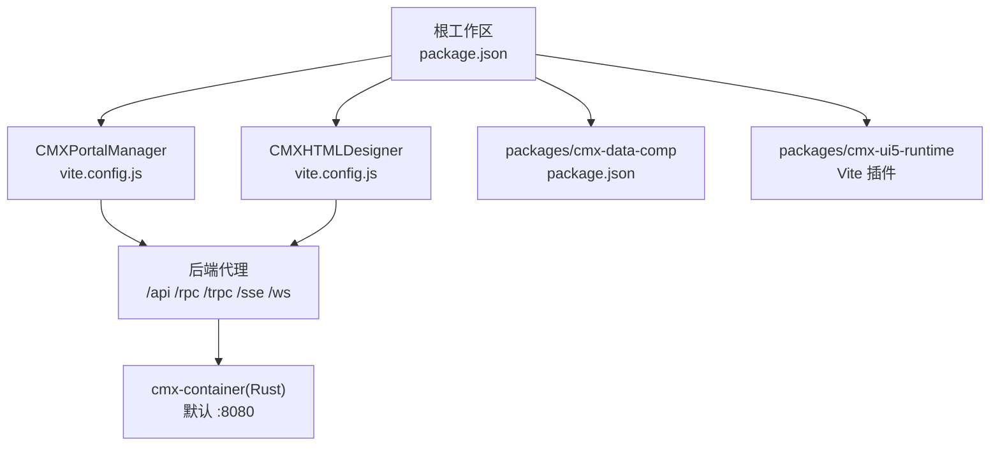
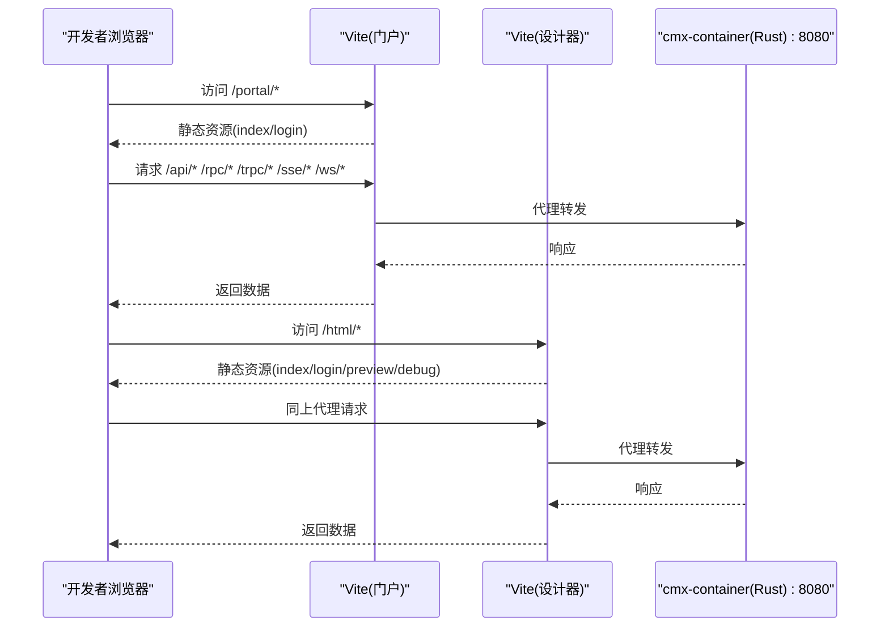
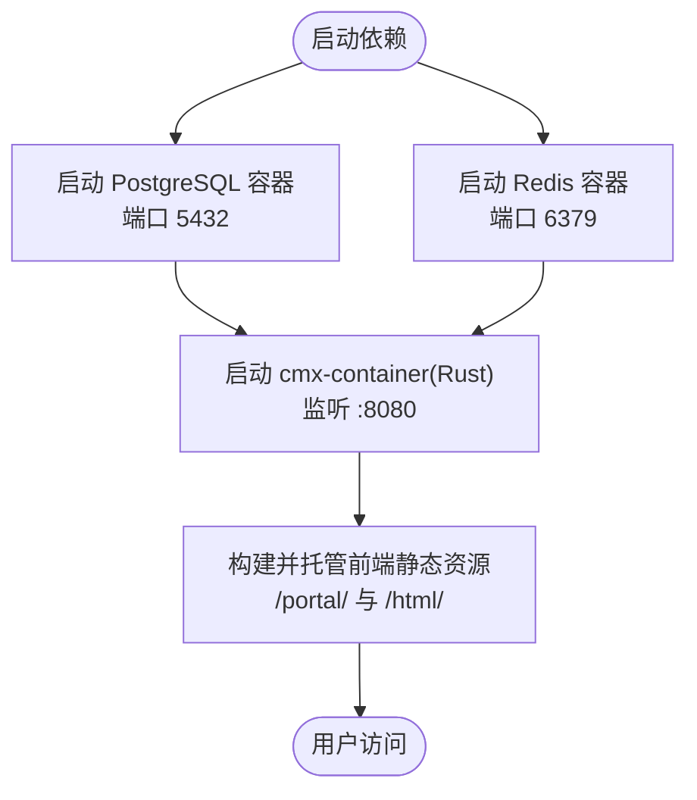
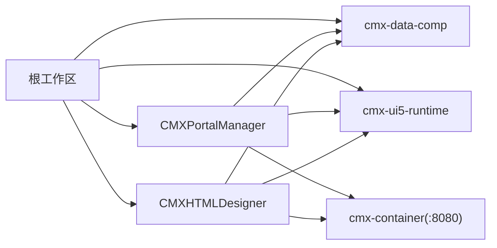

# 环境搭建

<cite>
**本文引用的文件**
- [README.md](file://README.md)
- [package.json](file://package.json)
- [.npmrc](file://.npmrc)
- [docker命令.txt](file://docker命令.txt)
- [CMXPortalManager/package.json](file://CMXPortalManager/package.json)
- [CMXHTMLDesigner/package.json](file://CMXHTMLDesigner/package.json)
- [packages/cmx-data-comp/package.json](file://packages/cmx-data-comp/package.json)
- [CMXPortalManager/vite.config.js](file://CMXPortalManager/vite.config.js)
- [CMXHTMLDesigner/vite.config.js](file://CMXHTMLDesigner/vite.config.js)
</cite>

## 目录
1. [简介](#简介)
2. [项目结构](#项目结构)
3. [核心组件](#核心组件)
4. [架构总览](#架构总览)
5. [详细组件分析](#详细组件分析)
6. [依赖关系分析](#依赖关系分析)
7. [性能与构建优化](#性能与构建优化)
8. [故障排查指南](#故障排查指南)
9. [结论](#结论)
10. [附录：环境变量与配置模板](#附录环境变量与配置模板)

## 简介
本环境搭建文档面向 CMX 企业门户平台的前端 monorepo，覆盖开发环境与生产环境的准备工作、依赖服务（Node.js、PostgreSQL、Redis）安装与配置、Docker 容器化部署步骤、npm 包管理与依赖安装、环境变量与配置文件说明，以及常见问题排查。该前端 monorepo 包含门户运行时（CMXPortalManager）、可视化设计器（CMXHTMLDesigner）、数据层 Web Components（cmx-data-comp）与共享 UI5 运行时（cmx-ui5-runtime），并与后端 cmx-container（Rust）配套使用。

## 项目结构
- 根工作区通过 npm workspaces 管理多个子项目与共享包。
- 两个主要应用：
  - CMXPortalManager：门户运行时，默认路由 /portal/
  - CMXHTMLDesigner：可视化设计器，默认路由 /html/
- 共享包：
  - packages/cmx-data-comp：数据层 Web Components
  - packages/cmx-ui5-runtime：UI5/Tabler 运行时与 Vite 插件

图表来源
- [package.json:6-10](file://package.json#L6-L10)
- [CMXPortalManager/vite.config.js:27-95](file://CMXPortalManager/vite.config.js#L27-L95)
- [CMXHTMLDesigner/vite.config.js:26-84](file://CMXHTMLDesigner/vite.config.js#L26-L84)

章节来源
- [README.md:8-18](file://README.md#L8-L18)
- [package.json:1-10](file://package.json#L1-L10)

## 核心组件
- Node.js 版本要求：
  - 门户运行时要求 Node ^18 || ^20 || >=22
- 构建与脚本：
  - 根脚本提供统一入口：dev:portal、dev:html、build:apps 等
  - 子项目通过 Vite 启动开发与构建
- 包管理器：
  - 使用 npm workspaces；商业依赖需额外 registry

章节来源
- [CMXPortalManager/package.json:5-22](file://CMXPortalManager/package.json#L5-L22)
- [package.json:16-25](file://package.json#L16-L25)
- [.npmrc:1-4](file://.npmrc#L1-L4)

## 架构总览
前端 monorepo 通过 Vite 启动开发服务器，将 /api、/rpc、/trpc、/sse、/ws 等请求代理到后端 cmx-container（默认 http://127.0.0.1:8080）。生产构建产物由静态资源服务器或反向代理托管，并通过 base 路径区分不同应用挂载点（/portal/、/html/）。

图表来源
- [CMXPortalManager/vite.config.js:84-95](file://CMXPortalManager/vite.config.js#L84-L95)
- [CMXHTMLDesigner/vite.config.js:72-84](file://CMXHTMLDesigner/vite.config.js#L72-L84)

## 详细组件分析

### 开发环境准备
- 安装 Node.js（满足版本要求）
- 安装 PostgreSQL 与 Redis（本地或 Docker）
- 克隆仓库后执行 npm install
- 启动后端服务（cmx-container，默认 :8080）
- 启动前端开发服务器：
  - 门户：npm run dev:portal
  - 设计器：npm run dev:html

章节来源
- [README.md:26-43](file://README.md#L26-L43)
- [CMXPortalManager/package.json:8-12](file://CMXPortalManager/package.json#L8-L12)
- [CMXHTMLDesigner/package.json:6-12](file://CMXHTMLDesigner/package.json#L6-L12)

### 生产环境准备
- 构建产物：
  - 门户：npm run build:portal
  - 设计器：npm run build:html
  - 全部：npm run build:apps
- 静态资源托管：
  - 将 dist 目录交由 Nginx/Apache/CDN 等托管
  - 设置 base 路径为 /portal/ 或 /html/
- 环境变量：
  - 通过 .env.production 或构建时传入的 shell 变量注入
  - 关键变量：CMX_APP_BASE、CMX_VITE_BACKEND、VITE_API_BASE、VITE_ROUTER_MODE

章节来源
- [package.json:20-25](file://package.json#L20-L25)
- [CMXPortalManager/vite.config.js:15-32](file://CMXPortalManager/vite.config.js#L15-L32)
- [CMXHTMLDesigner/vite.config.js:15-31](file://CMXHTMLDesigner/vite.config.js#L15-L31)

### Docker 容器化部署
- 数据库容器（PostgreSQL）
  - 示例命令见 docker 命令文件
  - 建议映射数据卷以持久化数据
- 缓存容器（Redis）
  - 示例命令见 docker 命令文件
- 网络与端口
  - 确保 5432(Postgres)、6379(Redis) 暴露或内部网络互通
  - 后端 cmx-container 默认 :8080，前端代理指向该地址

图表来源
- [docker命令.txt:1-21](file://docker命令.txt#L1-L21)

章节来源
- [docker命令.txt:1-21](file://docker命令.txt#L1-L21)

### npm 包管理与依赖安装
- 根级安装：npm install（启用 workspaces）
- 私有源：Infragistics 商业包需配置 registry
- 允许脚本：部分依赖需要允许运行原生脚本

章节来源
- [.npmrc:1-4](file://.npmrc#L1-L4)
- [package.json:27-30](file://package.json#L27-L30)

### 环境变量与配置文件
- 环境变量分层：
  - .env：所有模式共享
  - .env.development/.env.production：按 mode 覆盖
  - shell 环境变量优先级最高
- 关键变量：
  - CMX_APP_BASE：应用基础路径（dev=/，prod=/portal/ 或 /html/）
  - CMX_VITE_BACKEND：后端目标地址（默认 http://127.0.0.1:8080）
  - VITE_API_BASE：前端 API 基础地址（构建期注入）
  - VITE_ROUTER_MODE：路由模式 history/hash（构建期注入）
- 代理规则：
  - /shared、/api、/rpc、/trpc、/sse、/ws 等路径代理至后端

章节来源
- [CMXPortalManager/vite.config.js:15-32](file://CMXPortalManager/vite.config.js#L15-L32)
- [CMXHTMLDesigner/vite.config.js:15-31](file://CMXHTMLDesigner/vite.config.js#L15-L31)
- [CMXPortalManager/src/lib/api-client.js:18-36](file://CMXPortalManager/src/lib/api-client.js#L18-L36)
- [CMXHTMLDesigner/src/lib/api-client.js:18-36](file://CMXHTMLDesigner/src/lib/api-client.js#L18-L36)
- [CMXPortalManager/src/lib/portal-router.js:15-56](file://CMXPortalManager/src/lib/portal-router.js#L15-L56)

## 依赖关系分析
- 工作区依赖：
  - 根 package.json 声明 workspaces，统一管理子项目与包
- 子项目依赖：
  - CMXPortalManager 与 CMXHTMLDesigner 均依赖 cmx-data-comp、cmx-ui5-runtime
  - cmx-data-comp 依赖表格、表单、Ignite UI 等组件库
- 外部依赖：
  - 商业组件（Infragistics、SpreadJS）需合法授权
  - 后端通信通过 Vite 代理到 cmx-container

图表来源
- [package.json:6-10](file://package.json#L6-L10)
- [CMXPortalManager/package.json:24-53](file://CMXPortalManager/package.json#L24-L53)
- [CMXHTMLDesigner/package.json:14-30](file://CMXHTMLDesigner/package.json#L14-L30)
- [packages/cmx-data-comp/package.json:75-87](file://packages/cmx-data-comp/package.json#L75-L87)

章节来源
- [package.json:6-10](file://package.json#L6-L10)
- [CMXPortalManager/package.json:24-53](file://CMXPortalManager/package.json#L24-L53)
- [CMXHTMLDesigner/package.json:14-30](file://CMXHTMLDesigner/package.json#L14-L30)
- [packages/cmx-data-comp/package.json:75-87](file://packages/cmx-data-comp/package.json#L75-L87)

## 性能与构建优化
- 代码分割与懒加载：
  - 重型第三方库拆分为独立 chunk（如 ignite-spreadsheet、tabulator、revogrid、lit 等）
  - 首屏 modulePreload 过滤掉仅在动态导入中使用的重型 vendor chunk
- 依赖去重：
  - dedupe 列表避免重复解析 UI5/Lit 等库，减少内存与体积
- 构建目标：
  - target es2022，开启 sourcemap，限制 chunk 大小警告阈值
- 优化建议：
  - 按需引入组件，避免全量引入重型库
  - 合理划分路由与页面，利用懒加载降低首屏压力

章节来源
- [CMXPortalManager/vite.config.js:97-168](file://CMXPortalManager/vite.config.js#L97-L168)
- [CMXHTMLDesigner/vite.config.js:90-103](file://CMXHTMLDesigner/vite.config.js#L90-L103)

## 故障排查指南
- 无法拉取商业依赖（Infragistics）
  - 检查 .npmrc 中的 registry 配置是否正确
  - 确认账号权限与令牌有效
- 开发服务器无法连接后端
  - 检查 CMX_VITE_BACKEND 是否指向正确的后端地址
  - 确认后端服务已启动且端口开放
- 构建后页面 401 循环或 414 错误
  - 检查 base 路径是否正确（/portal/ 或 /html/）
  - 确认路由模式（history/hash）与服务器重写规则一致
- 登录页反复跳转
  - 检查代理规则是否生效（/api、/rpc、/trpc、/sse、/ws）
  - 核对后端鉴权接口返回状态码
- 数据库/缓存连接失败
  - 确认 PostgreSQL/Redis 容器已启动且端口可达
  - 检查环境变量与连接字符串配置

章节来源
- [.npmrc:1-4](file://.npmrc#L1-L4)
- [CMXPortalManager/vite.config.js:84-95](file://CMXPortalManager/vite.config.js#L84-L95)
- [CMXHTMLDesigner/vite.config.js:72-84](file://CMXHTMLDesigner/vite.config.js#L72-L84)
- [docker命令.txt:1-21](file://docker命令.txt#L1-L21)

## 结论
通过本指南，您可以完成 CMX 企业门户平台的环境搭建，包括 Node.js、PostgreSQL、Redis 的安装与配置，Docker 容器化部署，npm 包管理与依赖安装，以及环境变量与配置文件的使用。结合构建优化与故障排查建议，可提升开发与生产效率并确保稳定运行。

## 附录：环境变量与配置模板
- 推荐 .env（所有模式共享）
  - CMX_APP_BASE：应用基础路径（开发建议 /，生产根据挂载路径设置）
  - CMX_VITE_BACKEND：后端目标地址（默认 http://127.0.0.1:8080）
- 推荐 .env.production（生产构建）
  - CMX_APP_BASE：设置为 /portal/ 或 /html/
  - VITE_API_BASE：API 基础地址（可选，通常与 base 一致）
  - VITE_ROUTER_MODE：history 或 hash（根据服务器配置选择）
- 环境变量注入方式
  - Vite 通过 loadEnv 按 mode 加载 .env.* 文件
  - shell 环境变量优先级最高，可在 CI/CD 中临时覆盖

章节来源
- [CMXPortalManager/vite.config.js:15-32](file://CMXPortalManager/vite.config.js#L15-L32)
- [CMXHTMLDesigner/vite.config.js:15-31](file://CMXHTMLDesigner/vite.config.js#L15-L31)
- [CMXPortalManager/src/lib/api-client.js:18-36](file://CMXPortalManager/src/lib/api-client.js#L18-L36)
- [CMXHTMLDesigner/src/lib/api-client.js:18-36](file://CMXHTMLDesigner/src/lib/api-client.js#L18-L36)
- [CMXPortalManager/src/lib/portal-router.js:15-56](file://CMXPortalManager/src/lib/portal-router.js#L15-L56)