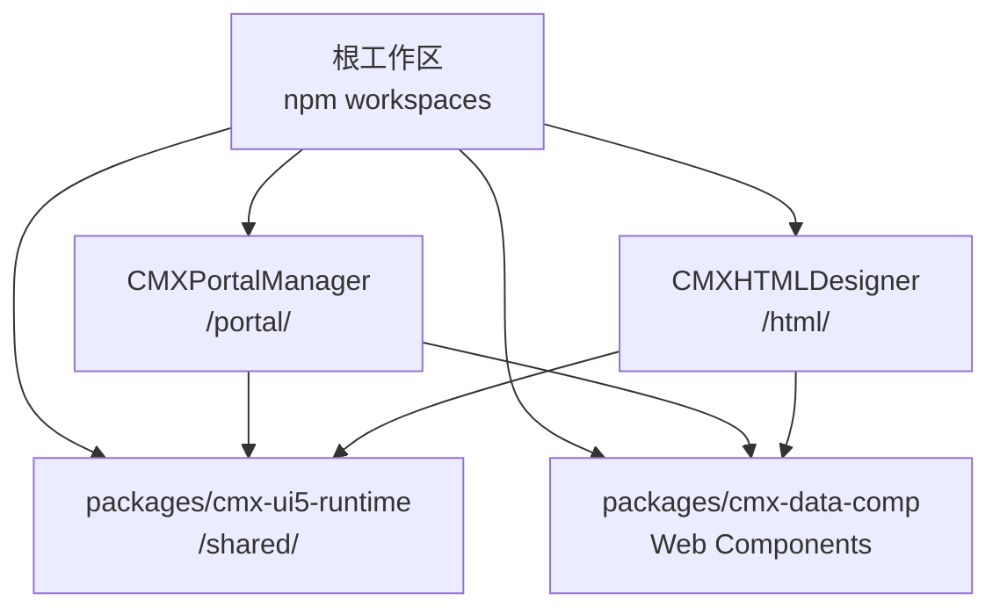
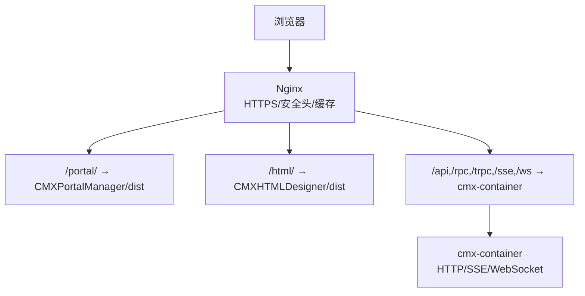
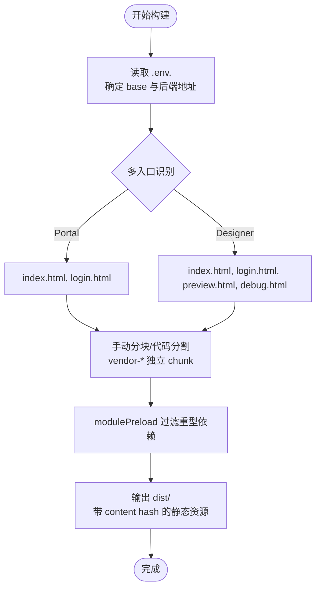
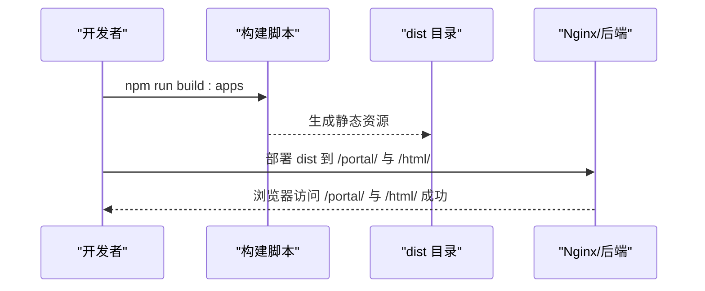
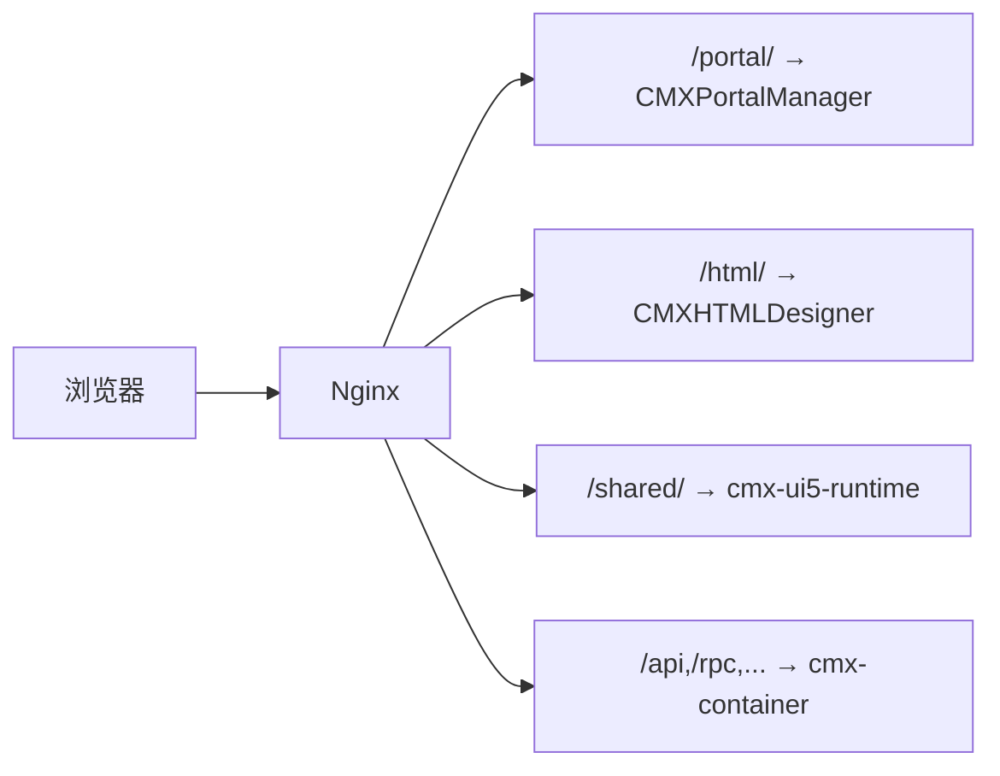
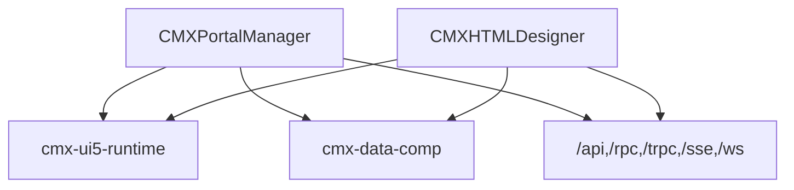
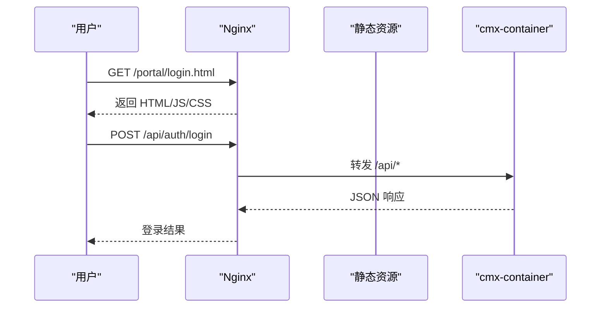
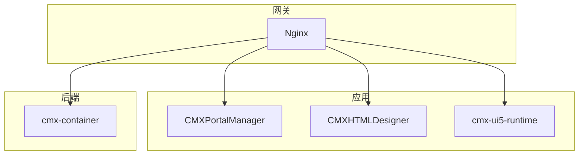
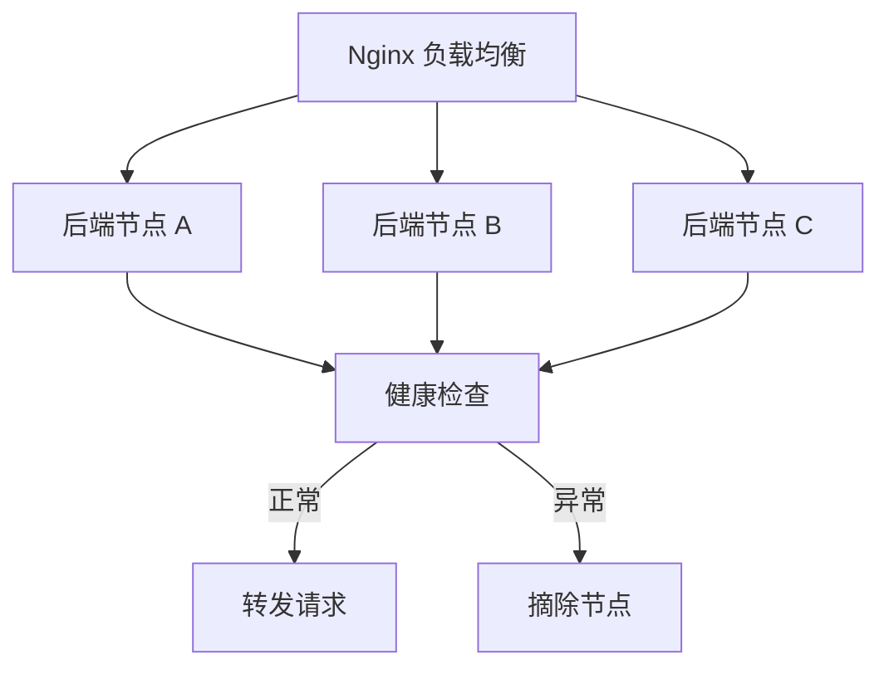
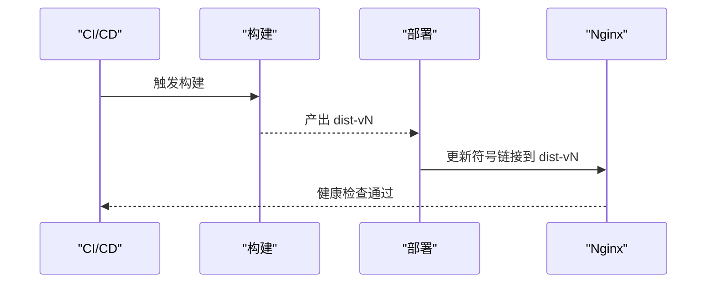

# 生产部署

<cite>
**本文引用的文件**
- [package.json](file://package.json)
- [CMXPortalManager/package.json](file://CMXPortalManager/package.json)
- [CMXHTMLDesigner/package.json](file://CMXHTMLDesigner/package.json)
- [CMXPortalManager/vite.config.js](file://CMXPortalManager/vite.config.js)
- [CMXHTMLDesigner/vite.config.js](file://CMXHTMLDesigner/vite.config.js)
- [CMXPortalManager/scripts/run-vite.mjs](file://CMXPortalManager/scripts/run-vite.mjs)
- [CMXHTMLDesigner/scripts/run-vite.mjs](file://CMXHTMLDesigner/scripts/run-vite.mjs)
- [scripts/publish-assets.sh](file://scripts/publish-assets.sh)
- [README.md](file://README.md)
- [documents/20260822_cmx-flow-rpt_反向代理评估与优化方案.md](file://documents/20260822_cmx-flow-rpt_反向代理评估与优化方案.md)
- [documents/20260822_cmx-center-client_服务定位map化与微服务接入Nacos方案.md](file://documents/20260822_cmx-center-client_服务定位map化与微服务接入Nacos方案.md)
- [docs/cm x-模块独立化方案.html](file://docs/cm x-模块独立化方案.html)
</cite>

## 目录
1. [简介](#简介)
2. [项目结构](#项目结构)
3. [核心组件](#核心组件)
4. [架构总览](#架构总览)
5. [详细组件分析](#详细组件分析)
6. [依赖关系分析](#依赖关系分析)
7. [性能与构建优化](#性能与构建优化)
8. [Nginx 反向代理与安全配置](#nginx-反向代理与安全配置)
9. [多应用部署架构](#多应用部署架构)
10. [负载均衡、会话保持与健康检查](#负载均衡会话保持与健康检查)
11. [部署脚本自动化与回滚策略](#部署脚本自动化与回滚策略)
12. [部署验证与常见问题](#部署验证与常见问题)
13. [结论](#结论)

## 简介
本文件面向生产环境，给出 CMX 企业门户平台的前端静态资源构建、发布与 Nginx 反向代理部署指南。内容覆盖：
- 构建优化与产物组织（Vite + monorepo）
- 静态资源发布流程（dist 目录与后端托管）
- Nginx 反向代理、HTTPS、安全头
- 多应用独立部署（门户管理器 /portal/ 与设计器 /html/）
- 负载均衡、会话保持与健康检查
- 自动化部署脚本与回滚策略
- 部署验证方法与常见问题处理

## 项目结构
仓库为 npm workspaces 单仓，包含两个前端应用与共享运行时：
- CMXPortalManager：门户运行时，默认路由 /portal/
- CMXHTMLDesigner：可视化设计器，默认路由 /html/
- packages/cmx-ui5-runtime：共享 UI5/Tabler 运行时，默认路由 /shared/
- packages/cmx-data-comp：数据层 Web Components（被上述应用复用）

根 package.json 提供统一构建脚本，子应用通过 Vite 构建并输出到各自 dist 目录，由后端或 Nginx 托管。

图示来源
- [package.json:6-10](file://package.json#L6-L10)
- [README.md:10-17](file://README.md#L10-L17)

章节来源
- [package.json:1-39](file://package.json#L1-L39)
- [README.md:1-73](file://README.md#L1-L73)

## 核心组件
- 构建入口与脚本
  - 根脚本：build:apps 会先构建共享运行时，再并行构建门户与管理器、设计器。
  - 子应用脚本：dev/build/preview 均通过 scripts/run-vite.mjs 调用 Vite CLI，避免路径解析问题。
- Vite 配置
  - 两应用均使用函数式 defineConfig，按 mode 加载 .env.*，并通过 CMX_APP_BASE 控制 base 路径（生产建议 /portal/ 与 /html/）。
  - 开发模式通过 server.proxy 将 /api、/rpc、/trpc、/sse、/ws 等转发至后端目标（默认 http://127.0.0.1:8080）。
  - 构建目标 es2022，开启 sourcemap，设置 chunkSizeWarningLimit，并对重型第三方库进行手动分块与 modulePreload 过滤。
- 环境变量分层
  - .env 所有模式共享；.env.production 生产覆盖；shell 环境变量优先级最高（CI/CD 场景可临时覆盖）。

章节来源
- [package.json:16-25](file://package.json#L16-L25)
- [CMXPortalManager/package.json:8-22](file://CMXPortalManager/package.json#L8-L22)
- [CMXHTMLDesigner/package.json:6-13](file://CMXHTMLDesigner/package.json#L6-L13)
- [CMXPortalManager/scripts/run-vite.mjs:1-31](file://CMXPortalManager/scripts/run-vite.mjs#L1-L31)
- [CMXHTMLDesigner/scripts/run-vite.mjs:1-31](file://CMXHTMLDesigner/scripts/run-vite.mjs#L1-L31)
- [CMXPortalManager/vite.config.js:15-33](file://CMXPortalManager/vite.config.js#L15-L33)
- [CMXHTMLDesigner/vite.config.js:15-31](file://CMXHTMLDesigner/vite.config.js#L15-L31)

## 架构总览
生产部署典型拓扑：
- 浏览器访问 Nginx（HTTPS 终止、安全头、静态资源缓存）
- Nginx 将 /portal/ 与 /html/ 指向对应应用的 dist 静态资源
- Nginx 将 /api、/rpc、/trpc、/sse、/ws 等请求反向代理到 cmx-container（Rust 后端）
- 后端可能以单体或多实例形态运行，必要时结合服务发现与负载均衡

图示来源
- [CMXPortalManager/vite.config.js:84-95](file://CMXPortalManager/vite.config.js#L84-L95)
- [CMXHTMLDesigner/vite.config.js:72-84](file://CMXHTMLDesigner/vite.config.js#L72-L84)
- [README.md:45-55](file://README.md#L45-L55)

## 详细组件分析

### 构建与打包（Vite）
- 多入口构建
  - 门户：main(index.html)、login(login.html)
  - 设计器：main、login、preview、debug
- 代码分割与预加载
  - manualChunks/rolldownOptions codeSplitting.groups 将重型库拆分为独立 chunk（如 ignite-spreadsheet、tabulator、lit、markdown、shiki 等），减少首屏体积与解析时间
  - modulePreload.resolveDependencies 过滤掉仅在动态 import 路径上的重型 vendor chunk，避免首屏不必要的预加载
- 依赖去重与优化
  - dedupe 确保 UI5/webcomponents、lit 等仅一份实例
  - optimizeDeps.exclude 排除 UI5 相关包，避免预构建干扰

图示来源
- [CMXPortalManager/vite.config.js:97-168](file://CMXPortalManager/vite.config.js#L97-L168)
- [CMXHTMLDesigner/vite.config.js:90-103](file://CMXHTMLDesigner/vite.config.js#L90-L103)

章节来源
- [CMXPortalManager/vite.config.js:97-184](file://CMXPortalManager/vite.config.js#L97-L184)
- [CMXHTMLDesigner/vite.config.js:90-118](file://CMXHTMLDesigner/vite.config.js#L90-L118)

### 静态资源发布流程
- 构建产物位置
  - 各应用 dist 目录包含 index.html、login.html 及 JS/CSS/资源
- 发布方式
  - 由后端 cmx-container 的同源 web-server 直接托管 dist
  - 或通过 Nginx 将 /portal/、/html/ 映射到对应 dist 目录
- 资产同步脚本
  - scripts/publish-assets.sh 用于将 cmx-container/assets/<svc>/web 与 data 同步到对应服务仓库，保证归档一致性

图示来源
- [package.json:22-25](file://package.json#L22-L25)
- [scripts/publish-assets.sh:1-48](file://scripts/publish-assets.sh#L1-L48)

章节来源
- [package.json:16-25](file://package.json#L16-L25)
- [scripts/publish-assets.sh:1-48](file://scripts/publish-assets.sh#L1-L48)

### 多应用部署架构（门户管理器与设计器）
- 路由划分
  - 门户管理器：/portal/
  - 设计器：/html/
  - 共享运行时：/shared/
- 独立部署
  - 可将两个应用分别部署到不同主机或容器，通过 Nginx 统一域名与路径分发
  - 后端接口统一由 Nginx 反代到 cmx-container，支持 WebSocket 与 SSE

图示来源
- [README.md:10-17](file://README.md#L10-L17)
- [CMXPortalManager/vite.config.js:84-95](file://CMXPortalManager/vite.config.js#L84-L95)
- [CMXHTMLDesigner/vite.config.js:72-84](file://CMXHTMLDesigner/vite.config.js#L72-L84)

章节来源
- [README.md:10-17](file://README.md#L10-L17)
- [CMXPortalManager/vite.config.js:84-95](file://CMXPortalManager/vite.config.js#L84-L95)
- [CMXHTMLDesigner/vite.config.js:72-84](file://CMXHTMLDesigner/vite.config.js#L72-L84)

## 依赖关系分析
- 应用间依赖
  - 两应用均依赖 cmx-ui5-runtime 与 cmx-data-comp
  - 通过 resolve.alias 在开发时指向源码，便于调试
- 外部依赖
  - UI5 WebComponents、Ignite UI、Lit、Markdown、Shiki 等按需拆分 chunk
- 后端通信
  - 开发模式通过 Vite proxy 转发 /api、/rpc、/trpc、/sse、/ws 到后端
  - 生产模式由 Nginx 统一反代

图示来源
- [CMXPortalManager/vite.config.js:42-65](file://CMXPortalManager/vite.config.js#L42-L65)
- [CMXHTMLDesigner/vite.config.js:37-58](file://CMXHTMLDesigner/vite.config.js#L37-L58)
- [CMXPortalManager/vite.config.js:84-95](file://CMXPortalManager/vite.config.js#L84-L95)
- [CMXHTMLDesigner/vite.config.js:72-84](file://CMXHTMLDesigner/vite.config.js#L72-L84)

章节来源
- [CMXPortalManager/vite.config.js:42-95](file://CMXPortalManager/vite.config.js#L42-L95)
- [CMXHTMLDesigner/vite.config.js:37-84](file://CMXHTMLDesigner/vite.config.js#L37-L84)

## 性能与构建优化
- 首屏优化
  - 使用 modulePreload 过滤重型 vendor chunk，避免首屏不必要的预加载
  - 对表格、图表、Markdown、代码高亮等重型库进行独立 chunk 拆分，按需懒加载
- 依赖去重
  - dedupe 确保 UI5 与 Lit 仅一份实例，避免重复初始化导致的问题
- 构建目标
  - target: es2022，提升现代浏览器执行效率
- 警告阈值
  - chunkSizeWarningLimit 设置为 1500，及时提示过大 chunk

章节来源
- [CMXPortalManager/vite.config.js:97-168](file://CMXPortalManager/vite.config.js#L97-L168)
- [CMXHTMLDesigner/vite.config.js:90-118](file://CMXHTMLDesigner/vite.config.js#L90-L118)

## Nginx 反向代理与安全配置
- 静态资源
  - location /portal/ 指向 CMXPortalManager/dist
  - location /html/ 指向 CMXHTMLDesigner/dist
  - 启用 gzip/brotli、长期缓存与 ETag
- 接口反代
  - location /api/、/rpc/、/trpc/、/sse/、/ws/ 转发到 cmx-container
  - WebSocket 需升级协议头；SSE 需保持长连接
- HTTPS 与安全头
  - 证书与私钥配置，强制 HTTPS 跳转
  - 安全头：HSTS、X-Frame-Options、X-Content-Type-Options、Referrer-Policy、Permissions-Policy 等
- 超时与限流
  - 合理设置 proxy_read_timeout、proxy_send_timeout，避免长耗时请求中断
  - 对登录与敏感接口实施限流与 IP 白名单

图示来源
- [CMXPortalManager/vite.config.js:84-95](file://CMXPortalManager/vite.config.js#L84-L95)
- [CMXHTMLDesigner/vite.config.js:72-84](file://CMXHTMLDesigner/vite.config.js#L72-L84)

## 多应用部署架构
- 同源托管（推荐中小规模）
  - 由 cmx-container 的 web-server 同时托管 /portal/、/html/、/shared/
- 独立宿主（推荐大规模）
  - 每个域独立进程，Nginx 作为统一网关，按路径分发
- 混用（推荐生产）
  - 高频/高负载域独立进程，低频域合并进程，零额外代码

图示来源
- [docs/cm x-模块独立化方案.html:665-694](file://docs/cm x-模块独立化方案.html#L665-L694)
- [README.md:45-55](file://README.md#L45-L55)

章节来源
- [docs/cm x-模块独立化方案.html:665-694](file://docs/cm x-模块独立化方案.html#L665-L694)
- [README.md:45-55](file://README.md#L45-L55)

## 负载均衡、会话保持与健康检查
- 负载均衡
  - Nginx upstream 多后端节点，轮询或加权分配
  - 后端服务可通过服务发现（如 Nacos）动态注册与摘除
- 会话保持
  - 基于 Cookie 的粘性会话或无状态 JWT 方案
  - 若使用服务端会话，需在 Nginx 层启用 ip_hash 或基于 key 的哈希
- 健康检查
  - Nginx 主动探测后端存活（active health check）
  - 后端暴露健康端点（如 /health），失败自动摘除

图示来源
- [documents/20260822_cmx-center-client_服务定位map化与微服务接入Nacos方案.md:78-93](file://documents/20260822_cmx-center-client_服务定位map化与微服务接入Nacos方案.md#L78-L93)
- [documents/20260822_cmx-flow-rpt_反向代理评估与优化方案.md:121-135](file://documents/20260822_cmx-flow-rpt_反向代理评估与优化方案.md#L121-L135)

章节来源
- [documents/20260822_cmx-center-client_服务定位map化与微服务接入Nacos方案.md:78-93](file://documents/20260822_cmx-center-client_服务定位map化与微服务接入Nacos方案.md#L78-L93)
- [documents/20260822_cmx-flow-rpt_反向代理评估与优化方案.md:121-135](file://documents/20260822_cmx-flow-rpt_反向代理评估与优化方案.md#L121-L135)

## 部署脚本自动化与回滚策略
- 构建与发布
  - 根脚本 build:apps 统一构建共享运行时与两个应用
  - 子应用通过 scripts/run-vite.mjs 启动 Vite，确保路径正确
  - publish-assets.sh 将 assets 同步到各服务仓库，保证归档一致
- 回滚策略
  - 版本化 dist 目录（如 dist-v1、dist-v2），Nginx 通过符号链接切换当前版本
  - 灰度发布：按流量比例或用户分组逐步放量
  - 快速回滚：切换符号链接并 reload Nginx

图示来源
- [package.json:22-25](file://package.json#L22-L25)
- [CMXPortalManager/scripts/run-vite.mjs:1-31](file://CMXPortalManager/scripts/run-vite.mjs#L1-L31)
- [CMXHTMLDesigner/scripts/run-vite.mjs:1-31](file://CMXHTMLDesigner/scripts/run-vite.mjs#L1-L31)
- [scripts/publish-assets.sh:1-48](file://scripts/publish-assets.sh#L1-L48)

章节来源
- [package.json:22-25](file://package.json#L22-L25)
- [scripts/publish-assets.sh:1-48](file://scripts/publish-assets.sh#L1-L48)

## 部署验证与常见问题
- 验证方法
  - 访问 /portal/ 与 /html/ 确认页面加载与路由正常
  - 调用 /api、/rpc、/trpc、/sse、/ws 确认接口连通性
  - 检查静态资源缓存与压缩是否生效
- 常见问题
  - 401 循环重定向：检查 base 路径与后端鉴权逻辑
  - SSE 断流：检查后端超时与 Nginx 超时配置
  - 大报表导出中断：调整 proxy_read_timeout 与后端超时策略
  - 商业组件不可用：SpreadJS/Ignite UI 需自备授权，未授权时相关功能不可用但不影响其余组件

章节来源
- [README.md:57-67](file://README.md#L57-L67)
- [documents/20260822_cmx-flow-rpt_反向代理评估与优化方案.md:61-118](file://documents/20260822_cmx-flow-rpt_反向代理评估与优化方案.md#L61-L118)

## 结论
本部署文档基于仓库中的 Vite 配置、脚本与文档，给出了生产环境的构建优化、静态资源发布、Nginx 反向代理、多应用部署、负载均衡与健康检查、自动化部署与回滚策略，以及验证与排障要点。建议在生产中严格遵循 base 路径与环境变量分层，合理拆分 chunk 与缓存策略，并结合服务发现实现弹性扩缩容与高可用。