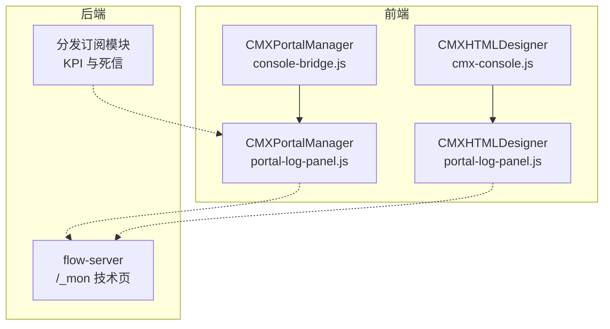
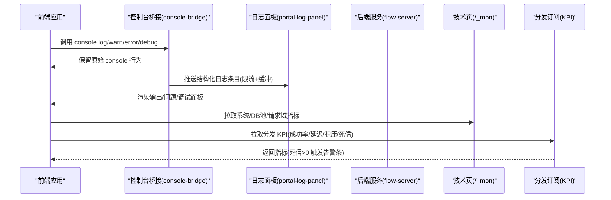
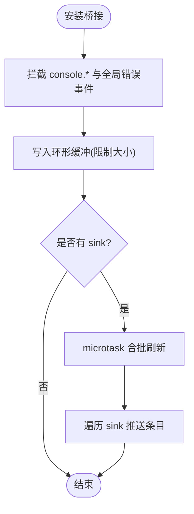
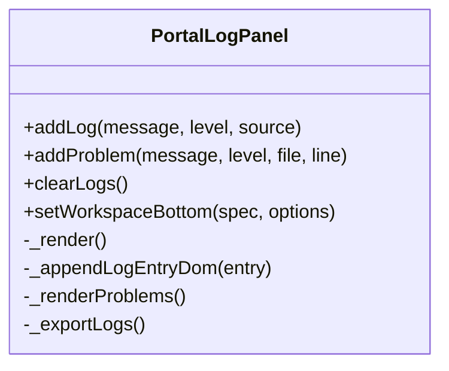
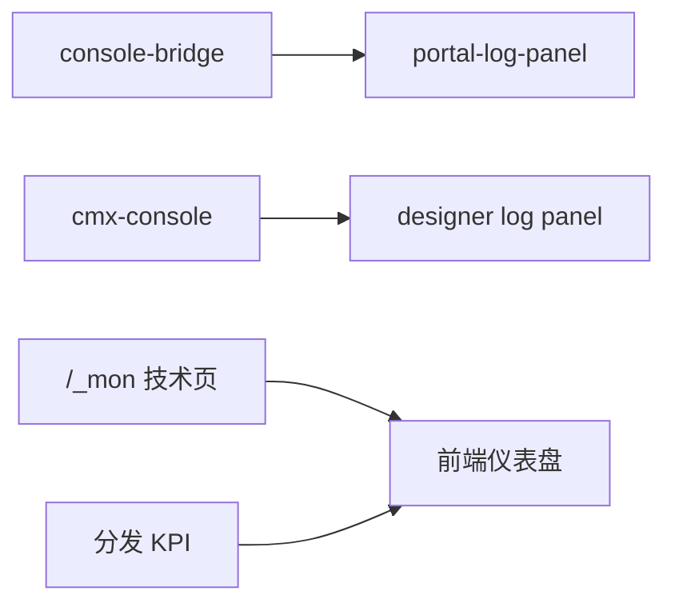

# 监控告警

<cite>
**本文引用的文件**
- [CMXPortalManager/src/components/portal-log-panel.js](file://CMXPortalManager/src/components/portal-log-panel.js)
- [CMXPortalManager/src/lib/console-bridge.js](file://CMXPortalManager/src/lib/console-bridge.js)
- [CMXHTMLDesigner/src/debug-portal/portal-log-panel.js](file://CMXHTMLDesigner/src/debug-portal/portal-log-panel.js)
- [CMXHTMLDesigner/src/utils/cmx-console.js](file://CMXHTMLDesigner/src/utils/cmx-console.js)
- [documents/技术债/20260817_流程引擎_已知问题与技术债务.md](file://documents/技术债/20260817_流程引擎_已知问题与技术债务.md)
- [documents/20260820_cmx-mdm_分发订阅模块原理与接口详解.md](file://documents/20260820_cmx-mdm_分发订阅模块原理与接口详解.md)
- [CMXPortalManager/docs/software-quality-assessment-report.html](file://CMXPortalManager/docs/software-quality-assessment-report.html)
- [CMXPortalManager/src/lib/workspace-native-pages.js](file://CMXPortalManager/src/lib/workspace-native-pages.js)
</cite>

## 目录
1. [简介](#简介)
2. [项目结构](#项目结构)
3. [核心组件](#核心组件)
4. [架构总览](#架构总览)
5. [详细组件分析](#详细组件分析)
6. [依赖关系分析](#依赖关系分析)
7. [性能考虑](#性能考虑)
8. [故障诊断指南](#故障诊断指南)
9. [结论](#结论)
10. [附录](#附录)

## 简介
本文件面向 CMX 企业门户平台的监控与告警实践，聚焦以下目标：
- 前端性能监控指标收集：页面加载时间、用户交互响应、错误率统计。
- 后端服务监控配置：API 接口性能、数据库连接池、缓存命中率。
- 日志收集与分析方案：结构化日志格式、日志轮转、集中化管理。
- 告警规则配置与通知渠道设置。
- 监控仪表板展示与故障诊断工具使用。

当前仓库已具备前端日志采集与可视化能力（控制台桥接 + 日志面板），以及后端可观测性线索（/_mon 技术页、DB 池状态、分发模块 KPI）。本文基于仓库内已有实现进行说明，并给出落地建议与扩展点。

## 项目结构
从代码证据看，监控与日志相关的前端能力集中在两个子工程：
- CMXPortalManager：生产态门户管理界面，包含日志面板与全局控制台桥接。
- CMXHTMLDesigner：设计器调试环境，提供轻量日志面板与控制台 Tap。

此外，后端可观测性在 Rust 侧通过 cmx-web-monitor 暴露 /_mon 系列技术页；分发订阅模块提供 KPI 指标与死信告警。

图表来源
- [CMXPortalManager/src/components/portal-log-panel.js:1-635](file://CMXPortalManager/src/components/portal-log-panel.js#L1-L635)
- [CMXPortalManager/src/lib/console-bridge.js:1-169](file://CMXPortalManager/src/lib/console-bridge.js#L1-L169)
- [CMXHTMLDesigner/src/debug-portal/portal-log-panel.js:1-520](file://CMXHTMLDesigner/src/debug-portal/portal-log-panel.js#L1-L520)
- [CMXHTMLDesigner/src/utils/cmx-console.js:1-83](file://CMXHTMLDesigner/src/utils/cmx-console.js#L1-L83)
- [documents/技术债/20260817_流程引擎_已知问题与技术债务.md:272-279](file://documents/技术债/20260817_流程引擎_已知问题与技术债务.md#L272-L279)
- [documents/20260820_cmx-mdm_分发订阅模块原理与接口详解.md:384-409](file://documents/20260820_cmx-mdm_分发订阅模块原理与接口详解.md#L384-L409)

章节来源
- [CMXPortalManager/src/components/portal-log-panel.js:1-635](file://CMXPortalManager/src/components/portal-log-panel.js#L1-L635)
- [CMXPortalManager/src/lib/console-bridge.js:1-169](file://CMXPortalManager/src/lib/console-bridge.js#L1-L169)
- [CMXHTMLDesigner/src/debug-portal/portal-log-panel.js:1-520](file://CMXHTMLDesigner/src/debug-portal/portal-log-panel.js#L1-L520)
- [CMXHTMLDesigner/src/utils/cmx-console.js:1-83](file://CMXHTMLDesigner/src/utils/cmx-console.js#L1-L83)
- [documents/技术债/20260817_流程引擎_已知问题与技术债务.md:272-279](file://documents/技术债/20260817_流程引擎_已知问题与技术债务.md#L272-L279)
- [documents/20260820_cmx-mdm_分发订阅模块原理与接口详解.md:384-409](file://documents/20260820_cmx-mdm_分发订阅模块原理与接口详解.md#L384-L409)

## 核心组件
- 前端控制台桥接（console-bridge）：统一捕获 console.*、window.error、unhandledrejection，按 microtask 合批转发到注册的 sink，支持环形缓冲与递归保护。
- 前端日志面板（portal-log-panel）：以标签页形式呈现输出、问题、终端占位与调试控制台，支持导出、清空、工作区底部区域挂载等。
- 设计器控制台 Tap（cmx-console）：在设计器中劫持 console，将日志双写到 DevTools 与自定义 sink。
- 后端技术页（/_mon）：暴露系统/DB 池/请求域等 JSON 指标，便于集成外部监控系统。
- 分发订阅模块 KPI：提供投递成功率、平均耗时、积压、死信、扇出滞后等指标，并在死信 > 0 时触发告警条。

章节来源
- [CMXPortalManager/src/lib/console-bridge.js:1-169](file://CMXPortalManager/src/lib/console-bridge.js#L1-L169)
- [CMXPortalManager/src/components/portal-log-panel.js:1-635](file://CMXPortalManager/src/components/portal-log-panel.js#L1-L635)
- [CMXHTMLDesigner/src/utils/cmx-console.js:1-83](file://CMXHTMLDesigner/src/utils/cmx-console.js#L1-L83)
- [CMXHTMLDesigner/src/debug-portal/portal-log-panel.js:1-520](file://CMXHTMLDesigner/src/debug-portal/portal-log-panel.js#L1-L520)
- [documents/技术债/20260817_流程引擎_已知问题与技术债务.md:272-279](file://documents/技术债/20260817_流程引擎_已知问题与技术债务.md#L272-L279)
- [documents/20260820_cmx-mdm_分发订阅模块原理与接口详解.md:384-409](file://documents/20260820_cmx-mdm_分发订阅模块原理与接口详解.md#L384-L409)

## 架构总览
前端通过控制台桥接将运行时事件标准化为日志条目，由日志面板消费并渲染；后端通过 /_mon 暴露系统级指标，分发模块提供业务 KPI。三者共同构成“前端可观测 + 后端指标 + 业务告警”的闭环。

图表来源
- [CMXPortalManager/src/lib/console-bridge.js:1-169](file://CMXPortalManager/src/lib/console-bridge.js#L1-L169)
- [CMXPortalManager/src/components/portal-log-panel.js:1-635](file://CMXPortalManager/src/components/portal-log-panel.js#L1-L635)
- [documents/技术债/20260817_流程引擎_已知问题与技术债务.md:272-279](file://documents/技术债/20260817_流程引擎_已知问题与技术债务.md#L272-L279)
- [documents/20260820_cmx-mdm_分发订阅模块原理与接口详解.md:384-409](file://documents/20260820_cmx-mdm_分发订阅模块原理与接口详解.md#L384-L409)

## 详细组件分析

### 前端控制台桥接（console-bridge）
- 功能要点
  - 安装后拦截 console.log/info/warn/error/debug，同时保留原始输出，避免丢失对象引用与样式。
  - 监听 window.error 与 unhandledrejection，统一上报错误上下文。
  - 使用环形缓冲（默认 500 条）保存安装前的日志，sink 注册时 flush。
  - 通过 queueMicrotask 合批刷新，降低高频日志对渲染线程的影响。
  - 提供 uninstallConsoleBridge 用于 HMR/测试回滚。
- 数据结构
  - 日志条目包含 level、message、source、time。
- 复杂度与性能
  - 插入 O(1)，flush 批量处理，整体对主线程影响可控。
- 错误处理
  - 单个 sink 失败不影响其他 sink；递归保护防止 sink 内部再次触发 console 导致栈溢出。

图表来源
- [CMXPortalManager/src/lib/console-bridge.js:1-169](file://CMXPortalManager/src/lib/console-bridge.js#L1-L169)

章节来源
- [CMXPortalManager/src/lib/console-bridge.js:1-169](file://CMXPortalManager/src/lib/console-bridge.js#L1-L169)

### 前端日志面板（portal-log-panel）
- 功能要点
  - 多标签页：输出、问题、终端（占位）、调试控制台。
  - 支持清空、导出、关闭面板事件。
  - 支持挂载工作区底部区域视图，复用 DOM 减少闪烁。
  - 内置最大条目限制（日志 1000、问题 300），自动裁剪旧数据。
  - 与 console-bridge 集成，接收结构化日志并渲染。
- 数据结构
  - 日志条目：id、message、level、source、time。
  - 问题条目：message、level、file、line。
- 性能优化
  - 列表项按需渲染，滚动区域独立，避免整表重绘。
  - 标签溢出计算与菜单动态生成，提升小屏体验。

图表来源
- [CMXPortalManager/src/components/portal-log-panel.js:1-635](file://CMXPortalManager/src/components/portal-log-panel.js#L1-L635)

章节来源
- [CMXPortalManager/src/components/portal-log-panel.js:1-635](file://CMXPortalManager/src/components/portal-log-panel.js#L1-L635)

### 设计器控制台 Tap（cmx-console）
- 功能要点
  - 劫持 console.log/warn/error，先调用原生方法，再调用 sink。
  - 提供 cmx_log 绕过当前劫持，避免递归。
  - 支持卸载恢复，便于测试或切换上下文。
- 适用场景
  - 设计器调试区、Inspector 调试面板等需要捕获控制台输出的场景。

章节来源
- [CMXHTMLDesigner/src/utils/cmx-console.js:1-83](file://CMXHTMLDesigner/src/utils/cmx-console.js#L1-L83)

### 后端技术页（/_mon）与指标
- 现状
  - flow-server 已接入 cmx-web-monitor，提供 /_mon 技术页及 /_mon/tech-stats、/_mon/deps 等 JSON 指标，涵盖系统、数据库连接池、请求域等。
  - 当前缺少 Prometheus 格式 metrics；业务错误采用 HTTP 200 + code 信封模式，需按信封码维度配置告警。
- 建议
  - 将 /_mon 指标暴露为 Prometheus 文本格式，便于 Prometheus/Grafana 抓取。
  - 为关键业务路径补充计数器与直方图（如 API 耗时分布、错误码分布）。

章节来源
- [documents/技术债/20260817_流程引擎_已知问题与技术债务.md:272-279](file://documents/技术债/20260817_流程引擎_已知问题与技术债务.md#L272-L279)

### 分发订阅模块 KPI 与告警
- 指标口径
  - 今日投递总量、今日成功率、平均耗时、积压、死信、扇出滞后。
- 告警策略
  - 死信数 > 0 时在监控页顶部显示红色告警条；进入 dead 时向订阅创建人与 admin 发送通知。
- 排障路径
  - 查看最近错误详情，区分 URL/secret 配置错误与下游临时故障，选择重发或跳过。

章节来源
- [documents/20260820_cmx-mdm_分发订阅模块原理与接口详解.md:384-409](file://documents/20260820_cmx-mdm_分发订阅模块原理与接口详解.md#L384-L409)

## 依赖关系分析
- 前端日志链路
  - console-bridge 作为单例桥接层，被 portal-log-panel 通过 addConsoleSink 消费。
  - 设计器侧 cmx-console 与 designer 日志面板解耦，便于在不同上下文中启用。
- 后端指标链路
  - flow-server 通过 cmx-web-monitor 暴露 /_mon；分发模块提供 KPI 接口供前端展示。
- 耦合与内聚
  - 控制台桥接与日志面板职责清晰，低耦合；后端指标通过 HTTP 暴露，易于替换采集器。

图表来源
- [CMXPortalManager/src/lib/console-bridge.js:1-169](file://CMXPortalManager/src/lib/console-bridge.js#L1-L169)
- [CMXPortalManager/src/components/portal-log-panel.js:1-635](file://CMXPortalManager/src/components/portal-log-panel.js#L1-L635)
- [CMXHTMLDesigner/src/utils/cmx-console.js:1-83](file://CMXHTMLDesigner/src/utils/cmx-console.js#L1-L83)
- [CMXHTMLDesigner/src/debug-portal/portal-log-panel.js:1-520](file://CMXHTMLDesigner/src/debug-portal/portal-log-panel.js#L1-L520)
- [documents/技术债/20260817_流程引擎_已知问题与技术债务.md:272-279](file://documents/技术债/20260817_流程引擎_已知问题与技术债务.md#L272-L279)
- [documents/20260820_cmx-mdm_分发订阅模块原理与接口详解.md:384-409](file://documents/20260820_cmx-mdm_分发订阅模块原理与接口详解.md#L384-L409)

## 性能考虑
- 前端日志
  - 使用 microtask 合批刷新，避免频繁 DOM 操作阻塞渲染。
  - 限制日志与问题条目数量，防止内存与渲染压力。
- 后端指标
  - 建议将 /_mon 指标转为 Prometheus 格式，减少前端解析成本。
  - 对慢接口与 SSE/长连接注意超时配置，避免误切流。
- 网络与代理
  - 评估反向代理超时对 SSE/大报表导出的影响，必要时分层调整超时策略。

[本节为通用指导，不直接分析具体文件]

## 故障诊断指南
- 前端错误定位
  - 打开日志面板，查看“输出”与“问题”标签，结合文件与行号快速定位。
  - 使用“导出日志”功能获取完整上下文，便于问题复现与归档。
- 服务不可达与网关错误
  - 当页面加载失败或服务未就绪时，前端会识别不可达/未配置/5xx 等错误，并以友好空状态提示，原始技术串折叠至“技术详情”。
- 后端指标与告警
  - 访问 /_mon 技术页查看系统、DB 池、请求域指标。
  - 分发模块 KPI 中关注死信数与积压，若死信 > 0 立即进入“死信处理”查看错误详情并重发/跳过。

章节来源
- [CMXPortalManager/src/components/portal-log-panel.js:1-635](file://CMXPortalManager/src/components/portal-log-panel.js#L1-L635)
- [CMXPortalManager/src/lib/workspace-native-pages.js:241-266](file://CMXPortalManager/src/lib/workspace-native-pages.js#L241-L266)
- [documents/技术债/20260817_流程引擎_已知问题与技术债务.md:272-279](file://documents/技术债/20260817_流程引擎_已知问题与技术债务.md#L272-L279)
- [documents/20260820_cmx-mdm_分发订阅模块原理与接口详解.md:384-409](file://documents/20260820_cmx-mdm_分发订阅模块原理与接口详解.md#L384-L409)

## 结论
- 前端已具备完善的日志采集与可视化能力，适合用于日常问题定位与用户体验优化。
- 后端已具备基础可观测性（/_mon 技术页、DB 池状态），但尚缺 Prometheus 指标与统一的业务错误度量。
- 分发模块提供了清晰的 KPI 与告警机制，可作为平台级监控的参考模板。
- 建议下一步补齐 Prometheus 指标、完善业务错误度量、统一告警规则与通知渠道，形成端到端的监控告警体系。

[本节为总结性内容，不直接分析具体文件]

## 附录

### 前端性能监控指标收集建议
- 页面加载时间
  - 使用 Performance API 记录首屏关键节点（FCP/LCP/TTI），结合 console-bridge 上报。
- 用户交互响应
  - 对关键按钮/表单提交埋点，记录交互耗时与失败原因，纳入日志面板与后端指标。
- 错误率统计
  - 基于 console-bridge 的错误事件与 unhandledrejection，聚合错误类型与占比，配合后端 /_mon 错误码维度。

[本节为通用指导，不直接分析具体文件]

### 后端服务监控配置建议
- API 接口性能
  - 在路由层增加耗时直方图与错误码计数，输出至 /_mon 或 Prometheus 端点。
- 数据库连接池
  - 利用现有 DB 池状态接口，监控活跃连接、等待队列与空闲连接。
- 缓存命中率
  - 对热点查询引入缓存层，统计命中/未命中比率，纳入指标面板。

[本节为通用指导，不直接分析具体文件]

### 日志收集与分析方案
- 结构化日志格式
  - 统一字段：timestamp、level、service、traceId、userId、msg。
- 日志轮转
  - 按大小/时间轮转，保留最近 N 天，压缩归档。
- 集中化管理
  - 将前端日志与后端日志统一接入日志平台，支持检索、聚合与告警。

[本节为通用指导，不直接分析具体文件]

### 告警规则配置与通知渠道
- 规则示例
  - 错误率阈值：近 5 分钟错误率 > 5%。
  - 延迟阈值：P95 耗时 > 2s。
  - 资源阈值：DB 池活跃连接 > 80%。
  - 业务告警：分发死信 > 0。
- 通知渠道
  - 邮件、IM（企业微信/钉钉）、短信、Webhook。
  - 分级通知：warning 仅记录，error 即时通知，critical 电话/短信升级。

[本节为通用指导，不直接分析具体文件]

### 监控仪表板与故障诊断工具
- 仪表板
  - 概览：QPS、错误率、P95/P99 耗时、DB 池、缓存命中率。
  - 业务：分发 KPI（成功率、延迟、积压、死信、扇出滞后）。
- 诊断工具
  - 前端日志面板：实时查看、过滤、导出。
  - 后端 /_mon：系统/DB/请求域指标。
  - 分发模块：死信处理与重试。

章节来源
- [CMXPortalManager/src/components/portal-log-panel.js:1-635](file://CMXPortalManager/src/components/portal-log-panel.js#L1-L635)
- [documents/技术债/20260817_流程引擎_已知问题与技术债务.md:272-279](file://documents/技术债/20260817_流程引擎_已知问题与技术债务.md#L272-L279)
- [documents/20260820_cmx-mdm_分发订阅模块原理与接口详解.md:384-409](file://documents/20260820_cmx-mdm_分发订阅模块原理与接口详解.md#L384-L409)