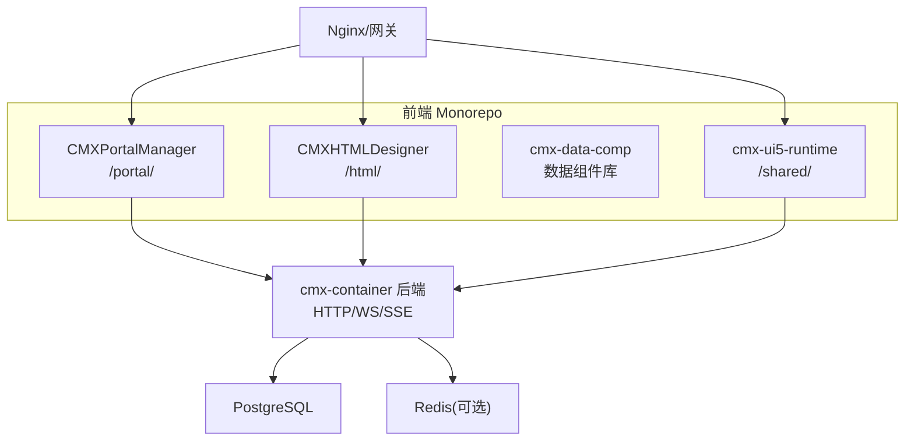
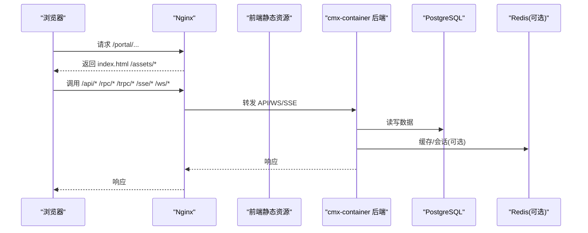
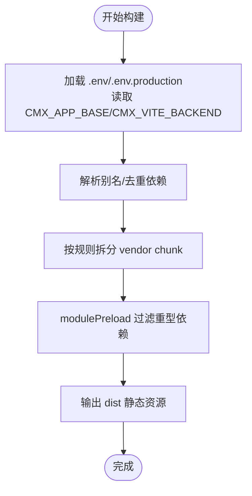
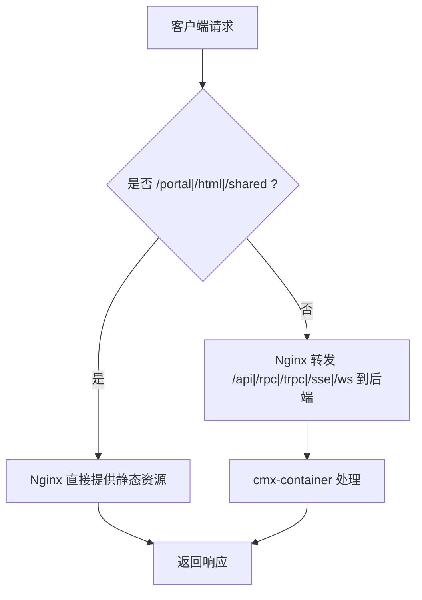
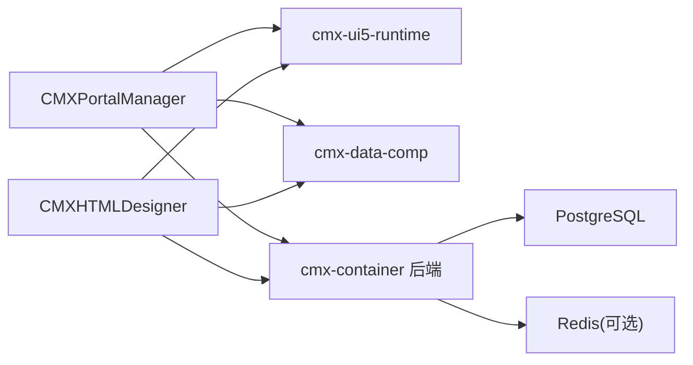

# 部署运维

<cite>
**本文引用的文件**
- [README.md](file://README.md)
- [package.json](file://package.json)
- [CMXPortalManager/vite.config.js](file://CMXPortalManager/vite.config.js)
- [CMXHTMLDesigner/vite.config.js](file://CMXHTMLDesigner/vite.config.js)
- [docker命令.txt](file://docker命令.txt)
- [20260822_cmx-flow-rpt_反向代理评估与优化方案.md](file://documents/20260822_cmx-flow-rpt_反向代理评估与优化方案.md)
- [20260822_cmx-center-client_服务定位map化与微服务接入Nacos方案.md](file://documents/20260822_cmx-center-client_服务定位map化与微服务接入Nacos方案.md)
</cite>

## 目录
1. [简介](#简介)
2. [项目结构](#项目结构)
3. [核心组件](#核心组件)
4. [架构总览](#架构总览)
5. [详细组件分析](#详细组件分析)
6. [依赖关系分析](#依赖关系分析)
7. [性能考虑](#性能考虑)
8. [故障排查指南](#故障排查指南)
9. [结论](#结论)
10. [附录](#附录)

## 简介
本运维文档面向 CMX 企业门户平台的生产环境部署与日常运维，覆盖容器化构建产物、Nginx 反向代理配置要点、环境变量与后端集成、监控告警与日志管理、备份恢复与灾难恢复、扩容策略以及 CI/CD 流水线与自动化部署流程。文档基于仓库中的前端 monorepo（CMXPortalManager、CMXHTMLDesigner、packages）与相关设计文档进行说明，确保与现有构建、路由与代理机制一致。

## 项目结构
该仓库为 npm workspace monorepo，包含：
- CMXPortalManager：门户运行时，生产路径通常为 /portal/
- CMXHTMLDesigner：可视化设计器，生产路径通常为 /html/
- packages/cmx-data-comp：数据层 Web Components
- packages/cmx-ui5-runtime：共享 UI5/Tabler 运行时，生产路径通常为 /shared/

构建产物由 Vite 生成，生产模式会输出静态资源，供 Nginx 或同源托管的 cmx-container web-server 提供。

**图表来源**
- [README.md:45-55](file://README.md#L45-L55)
- [CMXPortalManager/vite.config.js:27-95](file://CMXPortalManager/vite.config.js#L27-L95)
- [CMXHTMLDesigner/vite.config.js:15-84](file://CMXHTMLDesigner/vite.config.js#L15-L84)

**章节来源**
- [README.md:8-17](file://README.md#L8-L17)
- [package.json:1-10](file://package.json#L1-L10)

## 核心组件
- 构建与产物
  - 使用 Vite 构建，生产模式启用 source map、chunk 拆分与 modulePreload 优化。
  - 多入口页面：main/index.html、login.html，设计器还包含 preview/debug 等入口。
- 环境变量与基础路径
  - 通过 loadEnv(mode, dir, '') 加载 .env/.env.production 等，支持 CMX_APP_BASE 控制 base。
  - 开发联调通过 CMX_VITE_BACKEND 指向后端目标，并在 dev server 中代理 /api、/rpc、/trpc、/sse、/ws 等。
- 第三方依赖
  - 报表电子表格引擎 SpreadJS 与部分 Ignite UI 组件为商业授权，需自备；不影响其余功能。

**章节来源**
- [CMXPortalManager/vite.config.js:15-31](file://CMXPortalManager/vite.config.js#L15-L31)
- [CMXHTMLDesigner/vite.config.js:15-31](file://CMXHTMLDesigner/vite.config.js#L15-L31)
- [README.md:57-66](file://README.md#L57-L66)

## 架构总览
生产环境典型拓扑：
- Nginx 作为统一入口，负责 TLS 终止、静态资源缓存、反向代理到后端 API/WS/SSE。
- 前端静态资源（/portal/、/html/、/shared/）由 Nginx 直接提供。
- 后端 cmx-container 提供 HTTP/WS/SSE 接口，连接 PostgreSQL/Redis 等基础设施。
- 可选：将 flow/rpt/doc/dct 等域拆分为独立服务，通过应用层反代或网关聚合。

**图表来源**
- [CMXPortalManager/vite.config.js:84-95](file://CMXPortalManager/vite.config.js#L84-L95)
- [CMXHTMLDesigner/vite.config.js:72-84](file://CMXHTMLDesigner/vite.config.js#L72-L84)
- [docker命令.txt:1-21](file://docker命令.txt#L1-L21)

**章节来源**
- [README.md:45-55](file://README.md#L45-L55)
- [docker命令.txt:1-21](file://docker命令.txt#L1-L21)

## 详细组件分析

### 构建与打包（Vite）
- 多入口构建：portal 与 designer 均定义 main/login 等入口，生产输出至 dist。
- Chunk 拆分：按业务库维度拆分 vendor chunk，减少首屏体积并提升并行解析。
- 模块预加载：过滤重型 spreadsheet 相关 chunk 的首屏 preload，降低首屏开销。
- 别名与去重：对 UI5/webcomponents/lit 等做 alias 与 dedupe，避免重复实例导致状态异常。

**图表来源**
- [CMXPortalManager/vite.config.js:27-38](file://CMXPortalManager/vite.config.js#L27-L38)
- [CMXPortalManager/vite.config.js:97-168](file://CMXPortalManager/vite.config.js#L97-L168)
- [CMXHTMLDesigner/vite.config.js:26-36](file://CMXHTMLDesigner/vite.config.js#L26-L36)
- [CMXHTMLDesigner/vite.config.js:90-102](file://CMXHTMLDesigner/vite.config.js#L90-L102)

**章节来源**
- [CMXPortalManager/vite.config.js:97-168](file://CMXPortalManager/vite.config.js#L97-L168)
- [CMXHTMLDesigner/vite.config.js:90-102](file://CMXHTMLDesigner/vite.config.js#L90-L102)

### 环境变量与后端联调
- 环境变量分层：.env（默认）、.env.production（生产覆盖）、shell 变量（最高优先级）。
- 关键变量：
  - CMX_APP_BASE：应用基础路径（dev 通常为空或 ./，生产建议 /portal/ 或 /html/）。
  - CMX_VITE_BACKEND：开发联调后端地址，用于 dev server 代理。
- 代理路径：/api、/rpc、/trpc、/sse、/ws（portal），designer 额外包含 /graphql。

**章节来源**
- [CMXPortalManager/vite.config.js:15-31](file://CMXPortalManager/vite.config.js#L15-L31)
- [CMXHTMLDesigner/vite.config.js:15-31](file://CMXHTMLDesigner/vite.config.js#L15-L31)
- [CMXPortalManager/vite.config.js:84-95](file://CMXPortalManager/vite.config.js#L84-L95)
- [CMXHTMLDesigner/vite.config.js:72-84](file://CMXHTMLDesigner/vite.config.js#L72-L84)

### Nginx 反向代理与静态资源托管
- 静态资源：将 /portal/、/html/、/shared/ 映射到对应 dist 目录，开启 gzip/brotli 与长期缓存。
- API/WS/SSE：将 /api、/rpc、/trpc、/sse、/ws 等转发至 cmx-container 后端，保持 WebSocket 升级。
- 安全与性能：TLS 终止、HSTS、限流、访问日志、错误页定制。
- 路径一致性：确保 base 与 Nginx 路径一致，避免相对资源解析错误。

[此图为概念性流程图，不直接映射具体源码文件]

### 数据库与第三方服务集成
- 数据库：PostgreSQL（端口 5432），建议使用持久卷挂载数据目录。
- 缓存/会话：Redis（端口 6379），按需启用。
- 后端服务：cmx-container 提供 HTTP/WS/SSE 接口，前端通过 Vite 代理或 Nginx 反向代理访问。

**章节来源**
- [docker命令.txt:1-21](file://docker命令.txt#L1-L21)
- [README.md:45-55](file://README.md#L45-L55)

### 监控告警与日志管理
- 可观测性基线：建议在网关/应用层补充超时治理、熔断降级、指标采集与链路追踪。
- 日志：统一收集 Nginx 访问/错误日志与应用日志，集中存储与检索。
- 告警：针对 5xx 比例、慢请求、下游不可达、磁盘/内存/CPU 阈值设置告警。

[本节为通用运维实践，不直接引用具体源码文件]

### 备份恢复与灾难恢复
- 数据库备份：定期全量 + WAL 增量，保留策略与异地容灾。
- 静态资源：dist 产物纳入版本库或制品库，便于快速回滚。
- 配置文件：Nginx 配置、环境变量清单、密钥管理纳入配置中心或机密管理。
- 灾难恢复：RTO/RPO 目标明确，演练恢复流程，验证数据一致性与服务可用性。

[本节为通用运维实践，不直接引用具体源码文件]

### 扩容方案
- 水平扩展：Nginx 多实例 + 负载均衡；cmx-container 多副本无状态扩展。
- 分域拆分：flow/rpt/doc/dct 可按负载独立部署，通过应用层反代或网关聚合。
- 缓存与连接池：合理配置 Redis 与数据库连接池，避免热点瓶颈。

**章节来源**
- [20260822_cmx-flow-rpt_反向代理评估与优化方案.md:665-694](file://documents/20260822_cmx-flow-rpt_反向代理评估与优化方案.md#L665-L694)

### CI/CD 流水线与自动化部署
- 构建阶段：npm install → build:apps（先构建 runtime，再构建 portal/designer）。
- 制品发布：推送 dist 到对象存储或制品库，生成镜像或直接部署静态资源。
- 部署阶段：更新 Nginx 配置与静态资源，灰度发布与回滚策略。
- 质量门禁：lint/test 通过后进入发布流程。

**章节来源**
- [package.json:16-25](file://package.json#L16-L25)

## 依赖关系分析
- 前端依赖：UI5/webcomponents、lit、tabulator、revogrid、igniteui 等，已做 dedupe 与 chunk 拆分。
- 商业依赖：SpreadJS/Ignite UI 需合法授权，隔离在特定组件之后。
- 后端依赖：cmx-container（Rust workspace），提供元数据驱动的单据/字典/报表/流程等服务。

**图表来源**
- [README.md:45-55](file://README.md#L45-L55)
- [CMXPortalManager/vite.config.js:42-82](file://CMXPortalManager/vite.config.js#L42-L82)
- [CMXHTMLDesigner/vite.config.js:37-70](file://CMXHTMLDesigner/vite.config.js#L37-L70)

**章节来源**
- [README.md:45-55](file://README.md#L45-L55)
- [package.json:31-37](file://package.json#L31-L37)

## 性能考虑
- 首屏优化：modulePreload 过滤重型 spread sheet 依赖；vendor chunk 拆分减少解析时间。
- 资源缓存：静态资源开启强缓存与内容哈希，CDN 加速。
- 网络优化：Gzip/Brotli 压缩，HTTP/2 或多路复用。
- 后端优化：连接池、超时治理、熔断降级、慢查询优化。

**章节来源**
- [CMXPortalManager/vite.config.js:97-168](file://CMXPortalManager/vite.config.js#L97-L168)
- [20260822_cmx-flow-rpt_反向代理评估与优化方案.md:144-167](file://documents/20260822_cmx-flow-rpt_反向代理评估与优化方案.md#L144-L167)

## 故障排查指南
- 常见问题
  - 401/414 循环：检查 base 路径与 Nginx 路由是否一致，避免 login 路径反复跳转。
  - 静态资源 404：确认 dist 输出与 Nginx 根路径映射正确。
  - WS/SSE 失败：检查 Nginx 是否允许 upgrade 与后端代理配置。
- 诊断步骤
  - 查看浏览器 Network 与 Console，确认资源加载与错误信息。
  - 检查 Nginx access/error 日志与后端日志，定位请求链路。
  - 验证环境变量与代理路径，必要时临时切换 CMX_VITE_BACKEND 调试。

**章节来源**
- [CMXPortalManager/vite.config.js:107-116](file://CMXPortalManager/vite.config.js#L107-L116)
- [CMXHTMLDesigner/vite.config.js:72-84](file://CMXHTMLDesigner/vite.config.js#L72-L84)

## 结论
CMX 企业门户平台采用模块化前端与可拆分的后端架构，适合在生产环境通过 Nginx 统一入口、容器化部署与 CI/CD 自动化交付。结合合理的性能优化、监控告警、备份恢复与扩容策略，可保障高可用与可维护性。建议在生产落地时完善超时治理、熔断降级与可观测性，确保系统稳健运行。

## 附录

### 生产部署步骤（推荐）
- 准备基础设施：PostgreSQL、Redis（可选）、Nginx。
- 构建前端：执行构建脚本产出 dist。
- 部署静态资源：将 dist 放置到 Nginx 指定目录。
- 配置 Nginx：设置静态资源与 API/WS/SSE 反向代理。
- 启动后端：部署 cmx-container 并配置数据库连接。
- 验证：访问 /portal/、/html/、/shared/，测试登录与核心功能。

**章节来源**
- [README.md:26-43](file://README.md#L26-L43)
- [docker命令.txt:1-21](file://docker命令.txt#L1-L21)

### Docker 容器化配置要点
- 数据库容器：PostgreSQL 持久化数据目录，设置密码与用户。
- 缓存容器：Redis 按需启用，暴露端口并持久化。
- 应用容器：将前端 dist 与 Nginx 配置打包，或使用 Nginx 单独容器提供静态资源。

**章节来源**
- [docker命令.txt:1-21](file://docker命令.txt#L1-L21)

### 环境变量清单（示例）
- CMX_APP_BASE：应用基础路径（生产建议 /portal/ 或 /html/）
- CMX_VITE_BACKEND：后端联调地址（开发模式）
- 其他：根据 cmx-container 要求配置数据库连接、鉴权密钥等

**章节来源**
- [CMXPortalManager/vite.config.js:15-31](file://CMXPortalManager/vite.config.js#L15-L31)
- [CMXHTMLDesigner/vite.config.js:15-31](file://CMXHTMLDesigner/vite.config.js#L15-L31)

### 反向代理与微服务集成
- 单进程模式：一个 cmx-web-server 承载多域，适合中小规模。
- 独立服务模式：flow/rpt/doc/dct 各自独立，通过网关或应用层反代聚合。
- 混用模式：高频域独立部署，低频域合并，零额外代码。

**章节来源**
- [20260822_cmx-flow-rpt_反向代理评估与优化方案.md:665-694](file://documents/20260822_cmx-flow-rpt_反向代理评估与优化方案.md#L665-L694)

### 服务定位与动态发现
- 支持静态基址与服务发现两种模式，启动时预热上游实例，每请求选择健康节点。
- 未初始化或无可用实例时返回 503，避免崩溃与雪崩。

**章节来源**
- [20260822_cmx-center-client_服务定位map化与微服务接入Nacos方案.md:78-104](file://documents/20260822_cmx-center-client_服务定位map化与微服务接入Nacos方案.md#L78-L104)