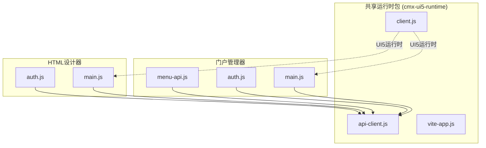
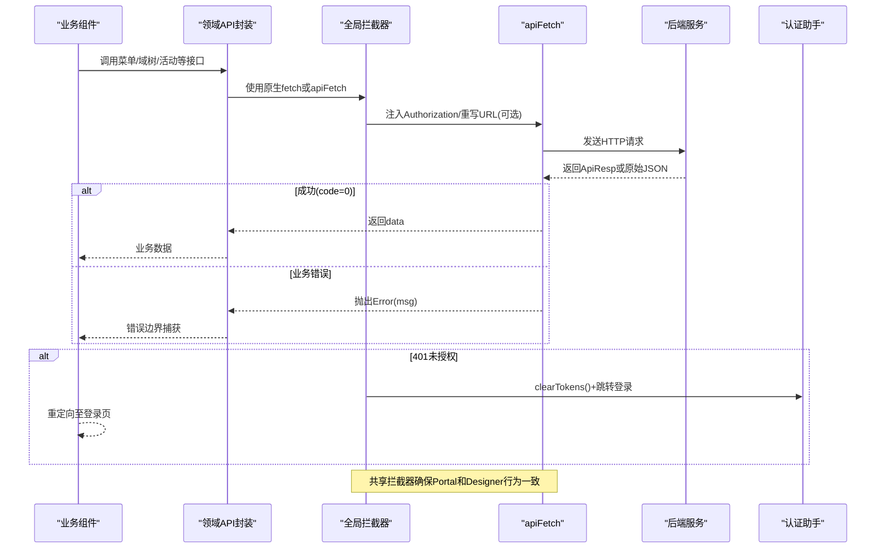
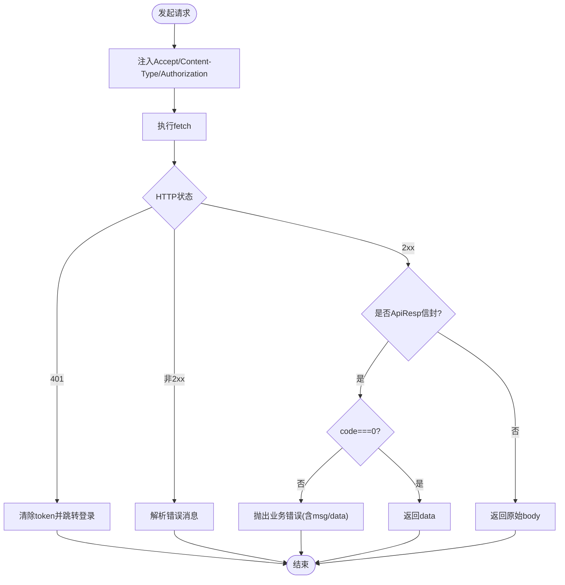
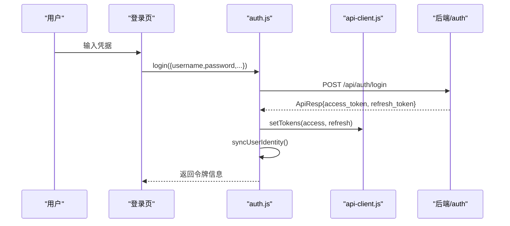
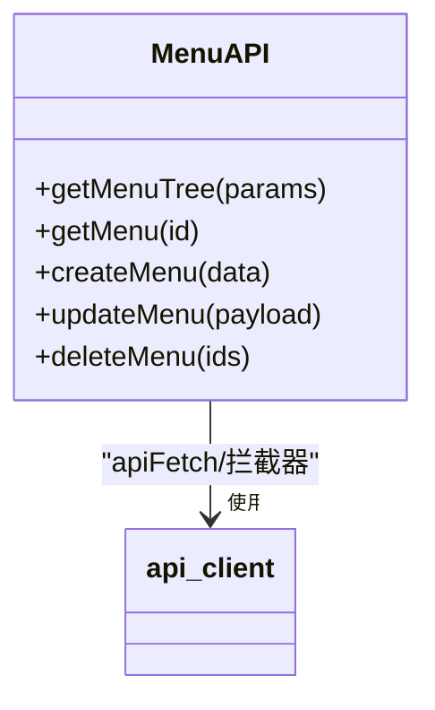
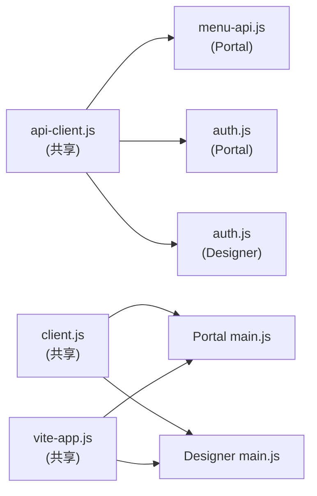

# API 客户端集成

<cite>
**本文引用的文件**
- [api-client.js](file://packages/cmx-ui5-runtime/src/api-client.js)
- [auth.js](file://CMXPortalManager/src/lib/auth.js)
- [auth.js](file://CMXHTMLDesigner/src/lib/auth.js)
- [menu-api.js](file://CMXPortalManager/src/api/menu-api.js)
- [main.js](file://CMXPortalManager/src/main.js)
- [main.js](file://CMXHTMLDesigner/src/main.js)
- [client.js](file://packages/cmx-ui5-runtime/src/client.js)
- [vite-app.js](file://packages/cmx-ui5-runtime/vite-app.js)
- [package.json](file://packages/cmx-ui5-runtime/package.json)
</cite>

## 更新摘要
**变更内容**
- 将API客户端从CMXPortalManager和CMXHTMLDesigner中的重复实现重构为共享包cmx-ui5-runtime中的统一实现
- 所有应用现在通过`cmx-ui5-runtime/api-client`导入统一的API客户端，消除了代码重复并确保了行为一致性
- 更新了项目结构图和依赖关系图以反映新的共享架构
- 增强了关于共享运行时包的使用说明

## 目录
1. [简介](#简介)
2. [项目结构](#项目结构)
3. [核心组件](#核心组件)
4. [架构总览](#架构总览)
5. [详细组件分析](#详细组件分析)
6. [依赖关系分析](#依赖关系分析)
7. [性能与缓存](#性能与缓存)
8. [故障排查指南](#故障排查指南)
9. [结论](#结论)
10. [附录](#附录)

## 简介
本文件面向门户管理器前端的 API 客户端集成，系统性说明 HTTP 客户端封装、请求拦截器、响应处理器、统一接口设计、错误处理策略、重试机制、认证令牌管理、请求头注入与会话保持、API 版本控制与向后兼容、异步与 Promise 链式调用、错误边界、网络监控与调试、缓存策略、离线支持与数据同步等。目标是让开发者在不侵入业务代码的前提下，获得稳定、可观测、易维护的 API 访问能力。

**更新** 现已采用共享包架构，API客户端统一位于`packages/cmx-ui5-runtime`中，被CMXPortalManager和CMXHTMLDesigner共同使用。

## 项目结构
- **共享HTTP客户端与拦截器**位于`packages/cmx-ui5-runtime/src`：
  - `api-client.js`：统一 fetch 封装、全局拦截器安装、401 处理、信封解包、跨域重写、登录跳转。
  - `client.js`：UI5运行时加载器，确保单实例运行。
- **应用认证助手**位于各应用lib层：
  - `../../../../../cmx-portal-manager`：门户管理器认证流程，复用共享token存取。
  - `../../../../../cmx-html-designer`：HTML设计器认证流程，复用共享token存取。
- **领域API封装**位于各应用api层：
  - `../../../../../cmx-portal-manager`：菜单树 CRUD，走全局拦截器。
- **构建配置**：
  - `packages/cmx-ui5-runtime/vite-app.js`：Vite插件，处理UI5组件去重和运行时注入。
  - `packages/cmx-ui5-runtime/package.json`：包导出配置，暴露`/api-client`和`/client`入口。

**图表来源**
- [api-client.js:1-264](file://packages/cmx-ui5-runtime/src/api-client.js#L1-L264)
- [client.js:1-41](file://packages/cmx-ui5-runtime/src/client.js#L1-L41)
- [vite-app.js:134-214](file://packages/cmx-ui5-runtime/vite-app.js#L134-L214)
- [menu-api.js:1-66](file://CMXPortalManager/src/api/menu-api.js#L1-L66)
- [auth.js:1-121](file://CMXPortalManager/src/lib/auth.js#L1-L121)
- [auth.js:1-100](file://CMXHTMLDesigner/src/lib/auth.js#L1-L100)
- [main.js:1-49](file://CMXPortalManager/src/main.js#L1-L49)
- [main.js:1-28](file://CMXHTMLDesigner/src/main.js#L1-L28)

**章节来源**
- [api-client.js:1-264](file://packages/cmx-ui5-runtime/src/api-client.js#L1-L264)
- [client.js:1-41](file://packages/cmx-ui5-runtime/src/client.js#L1-L41)
- [vite-app.js:134-214](file://packages/cmx-ui5-runtime/vite-app.js#L134-L214)
- [package.json:1-32](file://packages/cmx-ui5-runtime/package.json#L1-L32)

## 核心组件
- **统一HTTP客户端（apiFetch）**
  - 自动注入 Authorization 请求头（Bearer Token）。
  - 解析后端 ApiResp 信封 {code,msg,data}，成功返回 data，失败抛错并携带 msg。
  - 401 时清除本地 token 并跳转登录页，防回环与 URL 膨胀保护。
  - rawResponse 模式用于二进制下载等场景。
- **全局fetch拦截器（installAuthFetchInterceptor）**
  - 对同源 /api/* 请求自动注入 Bearer Token。
  - 非 /api/auth/* 且 401 时清 token 并跳转。
  - 透明拆信封：成功时 res.json() 直接拿到 data；业务错误映射为非 2xx + {error,msg,code}，保留 data（如 violations）以便前端结构化展示。
  - 支持跨域重写：当配置了 VITE_API_BASE 时，将相对 /api/* 重写到后端域名。
- **认证助手（各应用auth.js）**
  - 登录：写入 access_token/refresh_token，并异步同步 cmx_user_id/cmx_username。
  - 登出：调用后端使令牌失效，清理本地状态。
  - 获取当前用户：未登录或 401 返回 null。
  - requireAuthOrRedirect：启动门控，未登录跳转登录页。
- **领域API封装**
  - menu-api.js：菜单树 CRUD，通过全局拦截器自动鉴权与信封解包。
- **共享运行时加载器**
  - client.js：确保UI5运行时单实例加载，避免双实例问题。
  - vite-app.js：Vite插件处理UI5组件去重和运行时注入。

**章节来源**
- [api-client.js:86-133](file://packages/cmx-ui5-runtime/src/api-client.js#L86-L133)
- [api-client.js:178-263](file://packages/cmx-ui5-runtime/src/api-client.js#L178-L263)
- [auth.js:33-64](file://CMXPortalManager/src/lib/auth.js#L33-L64)
- [auth.js:33-47](file://CMXHTMLDesigner/src/lib/auth.js#L33-L47)
- [menu-api.js:24-66](file://CMXPortalManager/src/api/menu-api.js#L24-L66)
- [client.js:14-34](file://packages/cmx-ui5-runtime/src/client.js#L14-L34)

## 架构总览
下图展示了从业务调用到后端响应的完整链路，包括共享拦截器、认证、信封解包、错误处理。

**图表来源**
- [api-client.js:178-263](file://packages/cmx-ui5-runtime/src/api-client.js#L178-L263)
- [auth.js:33-64](file://CMXPortalManager/src/lib/auth.js#L33-L64)
- [menu-api.js:24-66](file://CMXPortalManager/src/api/menu-api.js#L24-L66)

## 详细组件分析

### 共享HTTP客户端与拦截器（packages/cmx-ui5-runtime/src/api-client.js）
- **关键职责**
  - 统一信封解包：code===0 返回 data，否则抛错并携带 msg。
  - 401 处理：清除 token 并跳转登录页，防止回环与 URL 膨胀。
  - 全局拦截器：为所有 /api/* 注入 Authorization，并在 401 时统一处理。
  - 跨域重写：根据 VITE_API_BASE 将相对路径重写到后端域名。
  - 便捷方法：apiGet/apiPost/apiDelete/rawResponse 模式。
- **错误处理**
  - 优先读取 body.msg/body.error，兜底 HTTP status。
  - 拦截器在业务错误时构造 {error,msg,code}，并保留 data（如 violations）。
- **会话保持**
  - 通过 getToken/setTokens/clearTokens 管理 localStorage 中的 access/refresh token。
  - 登录页地址基于 BASE_URL 计算，避免多入口部署下的白屏问题。

**图表来源**
- [api-client.js:86-133](file://packages/cmx-ui5-runtime/src/api-client.js#L86-L133)
- [api-client.js:178-263](file://packages/cmx-ui5-runtime/src/api-client.js#L178-L263)

**章节来源**
- [api-client.js:1-264](file://packages/cmx-ui5-runtime/src/api-client.js#L1-L264)

### 认证流程（各应用auth.js）
- **登录**：提交用户名/密码及设备信息，成功后写入 access_token/refresh_token，并异步同步 cmx_user_id/cmx_username。
- **登出**：调用后端使令牌失效，清理本地 token 与身份信息。
- **当前用户**：若 401 则清理 token 并返回 null。
- **启动门控**：requireAuthOrRedirect 在未登录时跳转登录页。

**图表来源**
- [auth.js:33-64](file://CMXPortalManager/src/lib/auth.js#L33-L64)
- [api-client.js:42-60](file://packages/cmx-ui5-runtime/src/api-client.js#L42-L60)

**章节来源**
- [auth.js:1-121](file://CMXPortalManager/src/lib/auth.js#L1-L121)
- [auth.js:1-100](file://CMXHTMLDesigner/src/lib/auth.js#L1-L100)
- [api-client.js:42-60](file://packages/cmx-ui5-runtime/src/api-client.js#L42-L60)

### 领域API封装
- **菜单API（menu-api.js）**
  - 通过全局拦截器自动鉴权与信封解包。
  - 提供 getMenuTree/getMenu/createMenu/updateMenu/deleteMenu。

**图表来源**
- [menu-api.js:24-66](file://CMXPortalManager/src/api/menu-api.js#L24-L66)
- [api-client.js:86-133](file://packages/cmx-ui5-runtime/src/api-client.js#L86-L133)

**章节来源**
- [menu-api.js:1-66](file://CMXPortalManager/src/api/menu-api.js#L1-L66)

### 共享运行时加载器
- **client.js**
  - 确保UI5运行时单实例加载，避免双实例问题。
  - dev模式直接import源码，生产模式加载构建产物。
- **vite-app.js**
  - Vite插件处理UI5组件去重，避免Multiple instances detected错误。
  - 注入runtime entry URL，管理UI5外部依赖。

**章节来源**
- [client.js:1-41](file://packages/cmx-ui5-runtime/src/client.js#L1-L41)
- [vite-app.js:134-214](file://packages/cmx-ui5-runtime/vite-app.js#L134-L214)

## 依赖关系分析
- **低耦合高内聚**
  - 领域 API 仅依赖统一客户端与缓存模块，不关心鉴权细节。
  - 全局拦截器屏蔽底层差异，业务侧无需感知信封与 401 处理。
- **共享架构优势**
  - CMXPortalManager和CMXHTMLDesigner共享同一份API客户端实现。
  - 消除了代码重复，确保了行为一致性。
- **外部依赖**
  - 浏览器原生 fetch、localStorage、IndexedDB、navigator.storage。

**图表来源**
- [api-client.js:1-264](file://packages/cmx-ui5-runtime/src/api-client.js#L1-L264)
- [menu-api.js:1-66](file://CMXPortalManager/src/api/menu-api.js#L1-L66)
- [auth.js:1-121](file://CMXPortalManager/src/lib/auth.js#L1-L121)
- [auth.js:1-100](file://CMXHTMLDesigner/src/lib/auth.js#L1-L100)
- [client.js:1-41](file://packages/cmx-ui5-runtime/src/client.js#L1-L41)
- [vite-app.js:134-214](file://packages/cmx-ui5-runtime/vite-app.js#L134-L214)

**章节来源**
- [api-client.js:1-264](file://packages/cmx-ui5-runtime/src/api-client.js#L1-L264)
- [package.json:7-12](file://packages/cmx-ui5-runtime/package.json#L7-L12)

## 性能与缓存
- **请求级优化**
  - 统一拦截器减少重复鉴权逻辑，降低出错概率。
  - 跨域重写集中配置，避免分散修改。
- **共享运行时优化**
  - UI5组件去重避免内存浪费。
  - 单实例运行时减少资源占用。
- **监控与调试**
  - 菜单加载失败 toast 提示。
  - 页面缓存配额查询接口便于诊断。

## 故障排查指南
- **401 未授权**
  - 检查是否已正确设置 Authorization 头。
  - 确认拦截器已安装且目标 URL 为 /api/*。
  - 确认登录态 token 存在且有效。
- **信封解析异常**
  - 确认后端返回结构包含 code/msg/data。
  - 对于非 JSON 响应（SSE/下载），使用 rawResponse 模式。
- **跨域重写无效**
  - 检查 VITE_API_BASE 配置是否正确。
  - 确认相对路径以 /api/ 开头。
- **UI5双实例问题**
  - 确认使用了共享的client.js加载器。
  - 检查vite-app.js插件是否正确配置。
- **菜单加载失败**
  - 查看 toast 提示与控制台日志。
  - 确认 /api/menu/tree 可达且返回合法树结构。

**章节来源**
- [api-client.js:178-263](file://packages/cmx-ui5-runtime/src/api-client.js#L178-L263)
- [vite-app.js:134-214](file://packages/cmx-ui5-runtime/vite-app.js#L134-L214)

## 结论
该 API 客户端集成通过共享包架构实现了统一的 HTTP 封装与全局拦截器，消除了CMXPortalManager和CMXHTMLDesigner中的代码重复，确保了行为一致性。结合领域 API 封装与多级缓存策略，显著降低了业务复杂度并提升了性能与稳定性。配合 IndexedDB 持久化与配额管理，提供了良好的离线支持与可观测性。建议后续在需要时引入更细粒度的重试与退避策略，以及更完善的网络监控埋点，以进一步提升用户体验与可维护性。

## 附录
- **最佳实践**
  - 始终通过 apiFetch 或领域 API 发起请求，避免绕过拦截器。
  - 对二进制下载使用 rawResponse 模式。
  - 登录成功后确保同步用户身份信息，保证按人过滤功能正常。
  - 使用共享的cmx-ui5-runtime/api-client，不要在各应用中重复实现。
  - 利用UI5运行时单实例机制，避免双实例问题。
- **扩展建议**
  - 增加请求耗时统计与错误上报。
  - 对关键接口实现指数退避重试。
  - 完善接口文档生成与契约校验。
- **迁移指南**
  - 将各应用中的重复API客户端实现替换为`import { installAuthFetchInterceptor } from 'cmx-ui5-runtime/api-client'`。
  - 更新认证助手中的token存取调用，使用共享的setTokens/clearTokens/getToken函数。
  - 确保在应用启动时调用installAuthFetchInterceptor()安装全局拦截器。